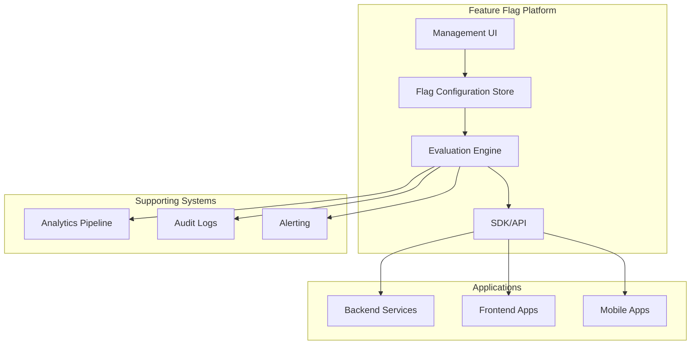
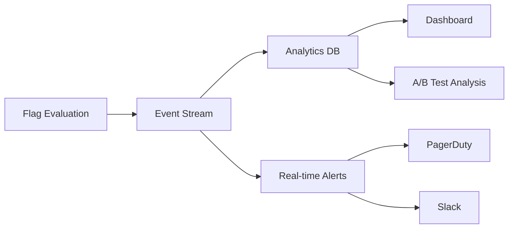

# How to Build Feature Flag Architecture

Author: [nawazdhandala](https://www.github.com/nawazdhandala)

Tags: Feature Flags, Architecture, DevOps, Release Management, A/B Testing

Description: Design a robust feature flag system with targeting rules, percentage rollouts, user segments, and integration with deployment pipelines.

---

Feature flags have become essential for modern software delivery. They let you deploy code without releasing features, run experiments, and roll back instantly without redeploying. But slapping boolean checks everywhere creates technical debt fast. This guide walks through building a proper feature flag architecture that scales with your team.

## Core Components of a Feature Flag System

Before writing any code, let's understand what makes up a complete feature flag system.



The architecture has four main pieces: a configuration store for flag definitions, an evaluation engine that decides if flags are on or off, SDKs that applications use, and supporting systems for observability.

## Designing the Flag Data Model

A well-designed data model supports simple on/off toggles and complex targeting rules. Here is a TypeScript schema that covers most use cases.

```typescript
// flag-schema.ts - Core data model for feature flags

// Supported comparison operators for targeting rules
type Operator =
  | 'equals'
  | 'not_equals'
  | 'contains'
  | 'starts_with'
  | 'ends_with'
  | 'greater_than'
  | 'less_than'
  | 'in_list'
  | 'not_in_list'
  | 'semver_greater'
  | 'semver_less';

// A single condition in a targeting rule
interface Condition {
  attribute: string;      // e.g., "user.plan", "device.os"
  operator: Operator;
  value: string | number | string[];
}

// Targeting rule with multiple conditions (AND logic)
interface TargetingRule {
  id: string;
  name: string;
  conditions: Condition[];  // All conditions must match
  variation: string;        // Which variation to serve
  priority: number;         // Lower number = higher priority
}

// For percentage rollouts, define traffic distribution
interface RolloutDistribution {
  variation: string;
  weight: number;  // Percentage (0-100)
}

// The complete feature flag definition
interface FeatureFlag {
  key: string;                          // Unique identifier
  name: string;                         // Human-readable name
  description: string;
  enabled: boolean;                     // Global kill switch

  // Possible values this flag can return
  variations: {
    [key: string]: any;  // "on", "off", "variant_a", etc.
  };

  // Default when no rules match
  defaultVariation: string;

  // Ordered list of targeting rules
  targetingRules: TargetingRule[];

  // Percentage rollout configuration
  rollout?: {
    distribution: RolloutDistribution[];
    bucketBy: string;  // Attribute to use for consistent bucketing
  };

  // Metadata
  tags: string[];
  createdAt: Date;
  updatedAt: Date;
  createdBy: string;
}
```

This model supports boolean flags, multivariate flags for A/B tests, and complex targeting. The `bucketBy` field ensures users get consistent experiences across sessions.

## Building the Evaluation Engine

The evaluation engine is where flags get evaluated. It needs to be fast, deterministic, and handle edge cases gracefully.

```python
# evaluation_engine.py - Core flag evaluation logic

import hashlib
from typing import Any, Dict, List, Optional
from dataclasses import dataclass

@dataclass
class EvaluationContext:
    """Context containing user and request attributes."""
    user_id: str
    attributes: Dict[str, Any]

@dataclass
class EvaluationResult:
    """Result of evaluating a flag."""
    flag_key: str
    variation: str
    value: Any
    reason: str  # Why this variation was chosen

class FlagEvaluator:
    def __init__(self, flag_store):
        self.flag_store = flag_store

    def evaluate(
        self,
        flag_key: str,
        context: EvaluationContext,
        default: Any = None
    ) -> EvaluationResult:
        """Evaluate a flag for the given context."""

        flag = self.flag_store.get(flag_key)

        # Flag doesn't exist - return default
        if not flag:
            return EvaluationResult(
                flag_key=flag_key,
                variation="default",
                value=default,
                reason="FLAG_NOT_FOUND"
            )

        # Flag is globally disabled
        if not flag.get("enabled", True):
            return EvaluationResult(
                flag_key=flag_key,
                variation=flag["defaultVariation"],
                value=flag["variations"][flag["defaultVariation"]],
                reason="FLAG_DISABLED"
            )

        # Check targeting rules in priority order
        for rule in sorted(flag.get("targetingRules", []),
                          key=lambda r: r["priority"]):
            if self._matches_rule(rule, context):
                return EvaluationResult(
                    flag_key=flag_key,
                    variation=rule["variation"],
                    value=flag["variations"][rule["variation"]],
                    reason=f"RULE_MATCH:{rule['id']}"
                )

        # Apply percentage rollout if configured
        if "rollout" in flag:
            variation = self._evaluate_rollout(flag, context)
            return EvaluationResult(
                flag_key=flag_key,
                variation=variation,
                value=flag["variations"][variation],
                reason="ROLLOUT"
            )

        # Fall back to default
        return EvaluationResult(
            flag_key=flag_key,
            variation=flag["defaultVariation"],
            value=flag["variations"][flag["defaultVariation"]],
            reason="DEFAULT"
        )

    def _matches_rule(
        self,
        rule: Dict,
        context: EvaluationContext
    ) -> bool:
        """Check if all conditions in a rule match."""
        for condition in rule["conditions"]:
            if not self._evaluate_condition(condition, context):
                return False
        return True

    def _evaluate_condition(
        self,
        condition: Dict,
        context: EvaluationContext
    ) -> bool:
        """Evaluate a single condition against context."""

        # Get the attribute value from context
        attr_value = self._get_attribute(
            condition["attribute"],
            context
        )

        if attr_value is None:
            return False

        op = condition["operator"]
        target = condition["value"]

        # Handle different operators
        if op == "equals":
            return attr_value == target
        elif op == "not_equals":
            return attr_value != target
        elif op == "contains":
            return target in str(attr_value)
        elif op == "in_list":
            return attr_value in target
        elif op == "greater_than":
            return float(attr_value) > float(target)
        elif op == "less_than":
            return float(attr_value) < float(target)

        return False

    def _get_attribute(
        self,
        path: str,
        context: EvaluationContext
    ) -> Optional[Any]:
        """Get nested attribute using dot notation."""

        # Special case for user_id
        if path == "user_id":
            return context.user_id

        # Navigate nested attributes
        parts = path.split(".")
        value = context.attributes

        for part in parts:
            if isinstance(value, dict) and part in value:
                value = value[part]
            else:
                return None

        return value

    def _evaluate_rollout(
        self,
        flag: Dict,
        context: EvaluationContext
    ) -> str:
        """Determine variation based on percentage rollout."""

        rollout = flag["rollout"]
        bucket_by = rollout.get("bucketBy", "user_id")

        # Get the value to bucket by
        bucket_value = self._get_attribute(bucket_by, context)
        if bucket_value is None:
            bucket_value = context.user_id

        # Generate consistent bucket (0-99)
        bucket = self._get_bucket(flag["key"], str(bucket_value))

        # Find which variation this bucket falls into
        cumulative = 0
        for dist in rollout["distribution"]:
            cumulative += dist["weight"]
            if bucket < cumulative:
                return dist["variation"]

        # Fallback to last variation
        return rollout["distribution"][-1]["variation"]

    def _get_bucket(self, flag_key: str, value: str) -> int:
        """Generate a consistent bucket number 0-99."""
        hash_input = f"{flag_key}:{value}"
        hash_bytes = hashlib.sha256(hash_input.encode()).digest()
        return int.from_bytes(hash_bytes[:4], "big") % 100
```

The key insight here is using SHA-256 hashing for bucket assignment. This ensures the same user always lands in the same bucket for a given flag, providing a consistent experience.

## User Segments for Reusable Targeting

Instead of duplicating targeting conditions across flags, define reusable segments.

```python
# segments.py - Reusable user segments

from typing import Dict, List, Any
from dataclasses import dataclass

@dataclass
class Segment:
    """A reusable group of users based on attributes."""
    key: str
    name: str
    description: str
    rules: List[Dict]  # Same structure as targeting rules
    included_users: List[str]  # Explicitly included user IDs
    excluded_users: List[str]  # Explicitly excluded user IDs

class SegmentEvaluator:
    def __init__(self):
        self.segments: Dict[str, Segment] = {}

    def register_segment(self, segment: Segment):
        """Register a segment for evaluation."""
        self.segments[segment.key] = segment

    def is_in_segment(
        self,
        segment_key: str,
        context: 'EvaluationContext'
    ) -> bool:
        """Check if a user belongs to a segment."""

        segment = self.segments.get(segment_key)
        if not segment:
            return False

        # Check explicit exclusions first
        if context.user_id in segment.excluded_users:
            return False

        # Check explicit inclusions
        if context.user_id in segment.included_users:
            return True

        # Evaluate rules (any rule match = in segment)
        for rule in segment.rules:
            if self._matches_segment_rule(rule, context):
                return True

        return False

    def _matches_segment_rule(
        self,
        rule: Dict,
        context: 'EvaluationContext'
    ) -> bool:
        """Check if context matches segment rule."""
        # Reuse condition evaluation logic
        for condition in rule.get("conditions", []):
            if not self._evaluate_condition(condition, context):
                return False
        return True

# Example segment definitions
beta_testers = Segment(
    key="beta_testers",
    name="Beta Testers",
    description="Users opted into beta features",
    rules=[
        {
            "conditions": [
                {"attribute": "user.beta_enabled", "operator": "equals", "value": True}
            ]
        }
    ],
    included_users=["user_123", "user_456"],  # Manual additions
    excluded_users=[]
)

enterprise_users = Segment(
    key="enterprise",
    name="Enterprise Customers",
    description="Users on enterprise plans",
    rules=[
        {
            "conditions": [
                {"attribute": "account.plan", "operator": "in_list", "value": ["enterprise", "enterprise_plus"]}
            ]
        }
    ],
    included_users=[],
    excluded_users=[]
)
```

## SDK Design for Client Applications

Your SDK should minimize latency, handle failures gracefully, and provide a clean API.

```typescript
// feature-flag-sdk.ts - Client SDK implementation

interface FlagValue {
  variation: string;
  value: any;
  reason: string;
}

interface SDKConfig {
  apiKey: string;
  baseUrl: string;
  pollingInterval?: number;  // Milliseconds
  defaultFlags?: Record<string, any>;
}

class FeatureFlagSDK {
  private config: SDKConfig;
  private flags: Map<string, any> = new Map();
  private ready: boolean = false;
  private listeners: Set<() => void> = new Set();

  constructor(config: SDKConfig) {
    this.config = config;
    this.initialize();
  }

  // Initialize SDK and start polling
  private async initialize(): Promise<void> {
    try {
      await this.fetchFlags();
      this.ready = true;
      this.notifyListeners();

      // Start background polling
      if (this.config.pollingInterval) {
        setInterval(
          () => this.fetchFlags(),
          this.config.pollingInterval
        );
      }
    } catch (error) {
      console.error('Failed to initialize feature flags:', error);
      // Use defaults if initial fetch fails
      this.applyDefaults();
      this.ready = true;
    }
  }

  // Fetch flag configurations from server
  private async fetchFlags(): Promise<void> {
    const response = await fetch(
      `${this.config.baseUrl}/api/flags`,
      {
        headers: {
          'Authorization': `Bearer ${this.config.apiKey}`,
          'Content-Type': 'application/json'
        }
      }
    );

    if (!response.ok) {
      throw new Error(`Failed to fetch flags: ${response.status}`);
    }

    const data = await response.json();

    // Update local cache
    for (const flag of data.flags) {
      this.flags.set(flag.key, flag);
    }
  }

  // Apply default values when fetch fails
  private applyDefaults(): void {
    if (this.config.defaultFlags) {
      for (const [key, value] of Object.entries(this.config.defaultFlags)) {
        this.flags.set(key, {
          key,
          enabled: true,
          defaultVariation: 'default',
          variations: { default: value }
        });
      }
    }
  }

  // Check if a boolean flag is enabled
  isEnabled(flagKey: string, context: Record<string, any>): boolean {
    const result = this.evaluate(flagKey, context);
    return result.value === true;
  }

  // Get the variation for a flag
  getVariation(
    flagKey: string,
    context: Record<string, any>,
    defaultValue: any = null
  ): any {
    const result = this.evaluate(flagKey, context);
    return result.value ?? defaultValue;
  }

  // Core evaluation method
  private evaluate(
    flagKey: string,
    context: Record<string, any>
  ): FlagValue {
    const flag = this.flags.get(flagKey);

    if (!flag) {
      return {
        variation: 'default',
        value: this.config.defaultFlags?.[flagKey] ?? null,
        reason: 'FLAG_NOT_FOUND'
      };
    }

    // For client-side SDK, server pre-evaluates based on context
    // This is a simplified local evaluation
    if (!flag.enabled) {
      return {
        variation: flag.defaultVariation,
        value: flag.variations[flag.defaultVariation],
        reason: 'FLAG_DISABLED'
      };
    }

    return {
      variation: flag.defaultVariation,
      value: flag.variations[flag.defaultVariation],
      reason: 'DEFAULT'
    };
  }

  // Wait for SDK to be ready
  waitUntilReady(): Promise<void> {
    if (this.ready) {
      return Promise.resolve();
    }

    return new Promise((resolve) => {
      this.listeners.add(resolve);
    });
  }

  private notifyListeners(): void {
    this.listeners.forEach(listener => listener());
    this.listeners.clear();
  }
}

// Usage example
const sdk = new FeatureFlagSDK({
  apiKey: process.env.FEATURE_FLAG_API_KEY,
  baseUrl: 'https://flags.example.com',
  pollingInterval: 30000,  // Poll every 30 seconds
  defaultFlags: {
    'new_dashboard': false,
    'dark_mode': false
  }
});

// In your application code
async function renderDashboard(user: User) {
  await sdk.waitUntilReady();

  const context = {
    user_id: user.id,
    plan: user.subscription.plan,
    country: user.profile.country
  };

  if (sdk.isEnabled('new_dashboard', context)) {
    return <NewDashboard />;
  }

  return <LegacyDashboard />;
}
```

## Pipeline Integration

Feature flags work best when integrated with your CI/CD pipeline. Here is a GitHub Actions workflow that validates flag changes.

```yaml
# .github/workflows/feature-flag-validation.yml

name: Validate Feature Flags

on:
  pull_request:
    paths:
      - 'flags/**'
      - 'segments/**'

jobs:
  validate:
    runs-on: ubuntu-latest
    steps:
      - uses: actions/checkout@v4

      - name: Setup Node.js
        uses: actions/setup-node@v4
        with:
          node-version: '20'

      - name: Install dependencies
        run: npm ci

      - name: Validate flag schema
        run: npm run validate-flags

      - name: Check for circular segment references
        run: npm run check-segments

      - name: Verify rollout percentages sum to 100
        run: npm run verify-rollouts

      - name: Run flag evaluation tests
        run: npm run test:flags

  impact-analysis:
    runs-on: ubuntu-latest
    steps:
      - uses: actions/checkout@v4
        with:
          fetch-depth: 0

      - name: Analyze flag changes
        run: |
          # Get changed flag files
          CHANGED=$(git diff --name-only origin/main...HEAD -- 'flags/')

          if [ -n "$CHANGED" ]; then
            echo "Changed flags:"
            echo "$CHANGED"

            # Generate impact report
            node scripts/analyze-flag-impact.js $CHANGED
          fi

      - name: Comment on PR
        uses: actions/github-script@v7
        with:
          script: |
            const fs = require('fs');
            const report = fs.readFileSync('impact-report.md', 'utf8');

            github.rest.issues.createComment({
              issue_number: context.issue.number,
              owner: context.repo.owner,
              repo: context.repo.repo,
              body: report
            });
```

## Observability and Analytics

Track flag evaluations to understand usage and catch issues early.



Key metrics to track:
- Evaluation count per flag
- Variation distribution (are rollouts working correctly?)
- Evaluation latency
- Error rates (fallback to defaults)
- Flag age (identify stale flags)

## Cleaning Up Old Flags

Feature flags accumulate. Without cleanup, your codebase becomes riddled with dead code paths. Add expiration dates and automate detection of flags that should be removed.

```python
# flag_cleanup.py - Detect stale feature flags

from datetime import datetime, timedelta
from typing import List, Dict

def find_stale_flags(
    flags: List[Dict],
    max_age_days: int = 90
) -> List[Dict]:
    """Find flags that have been at 100% for too long."""

    stale = []
    cutoff = datetime.now() - timedelta(days=max_age_days)

    for flag in flags:
        # Flag is fully rolled out
        if is_fully_rolled_out(flag):
            last_modified = datetime.fromisoformat(flag['updatedAt'])

            if last_modified < cutoff:
                stale.append({
                    'key': flag['key'],
                    'name': flag['name'],
                    'days_stale': (datetime.now() - last_modified).days,
                    'suggestion': 'Remove flag and clean up code'
                })

    return stale

def is_fully_rolled_out(flag: Dict) -> bool:
    """Check if flag is at 100% for all users."""

    if not flag.get('enabled'):
        return False

    rollout = flag.get('rollout')
    if not rollout:
        return True  # No rollout means 100% default

    # Check if one variation has 100% weight
    for dist in rollout.get('distribution', []):
        if dist['weight'] == 100:
            return True

    return False
```

Building a solid feature flag architecture requires thoughtful design across the data model, evaluation engine, SDKs, and operational tooling. Start simple with boolean flags and basic targeting, then expand to percentage rollouts and segments as your needs grow. Most importantly, establish processes for flag cleanup from day one - your future self will thank you.
