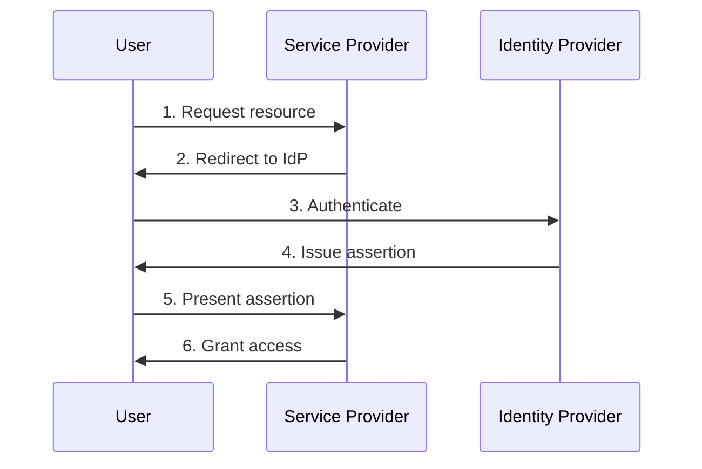
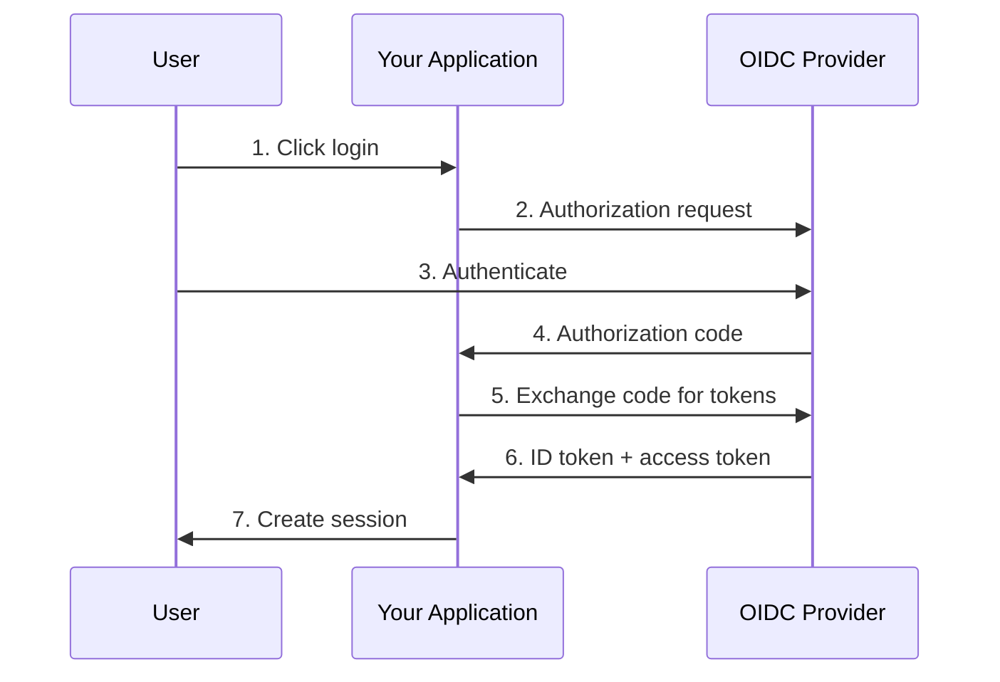
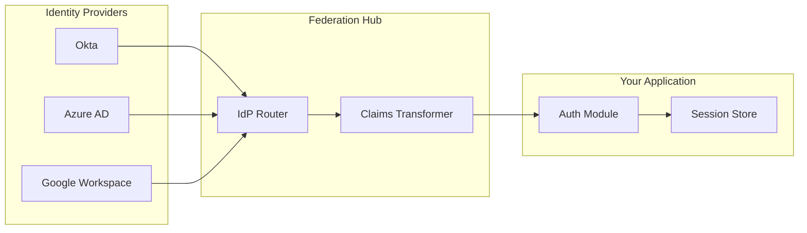

# How to Create Federation Configuration

Author: [nawazdhandala](https://github.com/nawazdhandala)

Tags: Security, Federation, Identity, SAML

Description: Learn to create federation configuration for cross-domain identity management.

---

Federation allows users from one organization to access resources in another without creating separate accounts. Instead of managing credentials in multiple places, federation establishes trust between identity providers (IdPs) and service providers (SPs), enabling seamless cross-domain authentication.

This guide walks through building a complete federation configuration, from understanding the core concepts to implementing SAML and OIDC federation in production environments.

---

## Understanding Federation Architecture

Federation relies on a trust relationship between parties. The identity provider authenticates users and issues tokens or assertions. The service provider accepts those assertions and grants access based on the claims they contain.



The key benefit is that users authenticate once with their home organization and gain access to federated services without additional passwords. This reduces credential sprawl, simplifies offboarding, and centralizes security policies.

---

## Core Federation Components

Before configuring federation, understand the building blocks.

| Component | Purpose | Example |
|-----------|---------|---------|
| Identity Provider (IdP) | Authenticates users and issues claims | Okta, Azure AD, Google Workspace |
| Service Provider (SP) | Consumes assertions and grants access | Your application, SaaS tools |
| Metadata | XML or JSON describing endpoints and certificates | entityID, SSO URL, signing cert |
| Assertion | Signed statement about user identity | SAML Response, ID Token |
| Claims | Attributes about the user | email, groups, department |

---

## Choosing Between SAML and OIDC

Both protocols achieve federation, but they differ in implementation and use cases.

| Aspect | SAML 2.0 | OIDC |
|--------|----------|------|
| Format | XML-based | JSON/JWT-based |
| Transport | Browser redirects, POST bindings | HTTP with OAuth 2.0 flows |
| Token size | Larger (XML + signature) | Smaller (compact JWT) |
| Mobile support | Limited | Excellent |
| Best for | Enterprise SSO, legacy systems | Modern apps, APIs, mobile |

For most new implementations, OIDC offers simpler integration and better tooling. SAML remains necessary when integrating with enterprise systems that only support it.

---

## SAML Federation Configuration

SAML federation requires exchanging metadata between the IdP and SP. Here is a step-by-step configuration.

### Step 1: Generate SP Metadata

Your service provider needs metadata that describes its endpoints and certificates. The following XML template shows the required elements.

```xml
<?xml version="1.0" encoding="UTF-8"?>
<!-- Service Provider Metadata -->
<!-- Replace placeholders with your actual values -->
<EntityDescriptor
    xmlns="urn:oasis:names:tc:SAML:2.0:metadata"
    entityID="https://app.example.com/saml/metadata">

    <SPSSODescriptor
        AuthnRequestsSigned="true"
        WantAssertionsSigned="true"
        protocolSupportEnumeration="urn:oasis:names:tc:SAML:2.0:protocol">

        <!-- Certificate for signature verification -->
        <KeyDescriptor use="signing">
            <KeyInfo xmlns="http://www.w3.org/2000/09/xmldsig#">
                <X509Data>
                    <X509Certificate>YOUR_BASE64_CERTIFICATE</X509Certificate>
                </X509Data>
            </KeyInfo>
        </KeyDescriptor>

        <!-- Where IdP sends the SAML Response -->
        <AssertionConsumerService
            Binding="urn:oasis:names:tc:SAML:2.0:bindings:HTTP-POST"
            Location="https://app.example.com/saml/acs"
            index="0"
            isDefault="true"/>

        <!-- Attributes the SP expects -->
        <AttributeConsumingService index="0">
            <ServiceName xml:lang="en">Example App</ServiceName>
            <RequestedAttribute
                Name="email"
                NameFormat="urn:oasis:names:tc:SAML:2.0:attrname-format:basic"
                isRequired="true"/>
            <RequestedAttribute
                Name="groups"
                NameFormat="urn:oasis:names:tc:SAML:2.0:attrname-format:basic"/>
        </AttributeConsumingService>
    </SPSSODescriptor>
</EntityDescriptor>
```

### Step 2: Configure the Identity Provider

Import your SP metadata into the IdP. Most identity providers accept metadata upload directly. Configure claim mappings to ensure the IdP sends the attributes your application needs.

The following table shows common claim mappings.

| IdP Attribute | SAML Claim | Purpose |
|---------------|------------|---------|
| user.email | email | User identification |
| user.firstName | givenName | Display name |
| user.lastName | surname | Display name |
| user.groups | groups | Authorization |
| user.department | department | Routing, policies |

### Step 3: Implement SAML Authentication

Your application needs code to handle SAML requests and responses. The following Node.js example uses the passport-saml library.

```javascript
// saml-config.js
// Configure SAML strategy for Passport.js

const passport = require('passport');
const SamlStrategy = require('passport-saml').Strategy;
const fs = require('fs');

// Load the IdP certificate for signature verification
const idpCert = fs.readFileSync('./certs/idp-certificate.pem', 'utf8');

// Load your SP private key for signing requests
const spPrivateKey = fs.readFileSync('./certs/sp-private-key.pem', 'utf8');

const samlConfig = {
  // Your application's entity ID
  issuer: 'https://app.example.com/saml/metadata',

  // IdP SSO endpoint where auth requests are sent
  entryPoint: 'https://idp.example.com/saml/sso',

  // Your callback URL that receives SAML responses
  callbackUrl: 'https://app.example.com/saml/acs',

  // IdP certificate validates incoming assertions
  cert: idpCert,

  // SP private key signs outgoing requests
  privateKey: spPrivateKey,

  // Security settings
  signatureAlgorithm: 'sha256',
  wantAssertionsSigned: true,
  wantAuthnResponseSigned: true,

  // Session lifetime in seconds
  acceptedClockSkewMs: 5000,
  maxAssertionAgeMs: 300000
};

passport.use(new SamlStrategy(samlConfig, (profile, done) => {
  // Extract user attributes from SAML assertion
  const user = {
    id: profile.nameID,
    email: profile.email,
    groups: profile.groups || [],
    sessionIndex: profile.sessionIndex
  };

  return done(null, user);
}));

module.exports = { passport, samlConfig };
```

---

## OIDC Federation Configuration

OIDC uses JSON-based configuration and is generally simpler to implement. Here is the flow.



### Step 1: Register Your Application

Register your application with the OIDC provider to obtain client credentials. The following configuration parameters are required.

```json
{
  "client_id": "your-client-id",
  "client_secret": "your-client-secret",
  "redirect_uris": [
    "https://app.example.com/auth/callback"
  ],
  "post_logout_redirect_uris": [
    "https://app.example.com/logout/callback"
  ],
  "response_types": ["code"],
  "grant_types": ["authorization_code", "refresh_token"],
  "token_endpoint_auth_method": "client_secret_basic"
}
```

### Step 2: Implement OIDC Authentication

The following Python example demonstrates OIDC authentication using the Authlib library.

```python
# oidc_config.py
# Configure OIDC authentication for Flask

from authlib.integrations.flask_client import OAuth
from flask import Flask, redirect, url_for, session

app = Flask(__name__)
app.secret_key = 'your-secret-key'

oauth = OAuth(app)

# Register the OIDC provider
# Discovery URL provides all endpoints automatically
oauth.register(
    name='idp',
    client_id='your-client-id',
    client_secret='your-client-secret',
    server_metadata_url='https://idp.example.com/.well-known/openid-configuration',
    client_kwargs={
        'scope': 'openid email profile groups'
    }
)

@app.route('/login')
def login():
    # Redirect to IdP for authentication
    redirect_uri = url_for('authorize', _external=True)
    return oauth.idp.authorize_redirect(redirect_uri)

@app.route('/auth/callback')
def authorize():
    # Exchange authorization code for tokens
    token = oauth.idp.authorize_access_token()

    # Parse the ID token to get user claims
    userinfo = token.get('userinfo')

    # Store user info in session
    session['user'] = {
        'sub': userinfo['sub'],
        'email': userinfo['email'],
        'name': userinfo.get('name'),
        'groups': userinfo.get('groups', [])
    }

    return redirect('/')

@app.route('/logout')
def logout():
    # Clear local session
    session.clear()

    # Redirect to IdP logout endpoint
    return redirect('https://idp.example.com/logout?post_logout_redirect_uri=https://app.example.com')
```

---

## Multi-IdP Federation

Enterprise environments often require federating with multiple identity providers. This is common when supporting customers who use different IdPs or when merging organizations.



The IdP router examines the user's email domain or a tenant identifier to determine which IdP should handle authentication. Claims transformation normalizes attributes across providers so your application receives consistent data regardless of the source.

---

## Security Checklist

Before deploying federation to production, verify these security requirements.

| Requirement | SAML | OIDC |
|-------------|------|------|
| Sign authentication requests | Enable AuthnRequestsSigned | Use PKCE for public clients |
| Validate assertion signatures | Verify IdP certificate | Verify JWT signature |
| Check audience restriction | Validate Audience element | Validate aud claim |
| Enforce time constraints | Check NotBefore/NotOnOrAfter | Validate exp and iat claims |
| Prevent replay attacks | Store and check assertion IDs | Use nonce parameter |
| Use HTTPS everywhere | All endpoints must be TLS | All endpoints must be TLS |
| Rotate certificates | Plan for IdP cert rotation | Rotate client secrets |

---

## Troubleshooting Common Issues

Federation failures often stem from misconfiguration. Here are the most common problems and solutions.

**Clock skew errors**: Ensure all servers synchronize time using NTP. SAML assertions and JWT tokens have tight validity windows.

**Certificate mismatch**: When IdPs rotate certificates, update your SP configuration. Monitor certificate expiration dates.

**Audience validation failures**: The assertion audience must exactly match your SP entity ID or client ID.

**Missing claims**: Verify the IdP is configured to release the attributes your application requires. Check claim mapping rules.

**Redirect URI mismatch**: The callback URL must exactly match what is registered with the IdP, including trailing slashes.

---

## Wrapping Up

Federation configuration requires careful planning but delivers significant benefits: centralized identity management, reduced credential sprawl, and simplified compliance. Start with a single IdP integration, test thoroughly in a staging environment, and expand to additional providers as needed.

For organizations using OneUptime, federation integrates seamlessly with our SSO capabilities. Configure your identity provider once, and your team gains secure access to monitoring dashboards, status pages, and incident management without managing separate credentials.

**Related Reading:**

- [How private status pages stay secure: authentication options explained](https://oneuptime.com/blog/post/2025-11-20-secure-your-status-page-authentication-options/view)
- [Stop Paywalling Security: SSO Is a Basic Right, Not an Enterprise Perk](https://oneuptime.com/blog/post/2025-08-19-sso-is-a-security-basic-not-an-enterprise-perk/view)
- [How to Configure Kubernetes Network Policies for Zero-Trust Security](https://oneuptime.com/blog/post/2026-01-06-kubernetes-network-policies-zero-trust/view)
