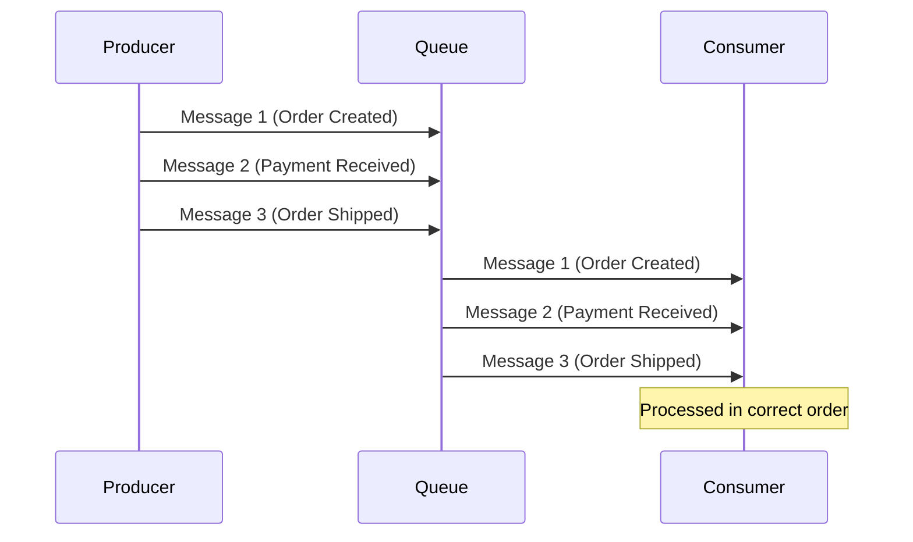
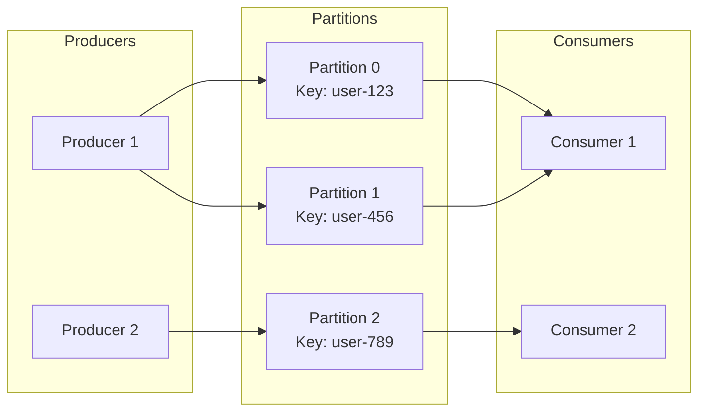
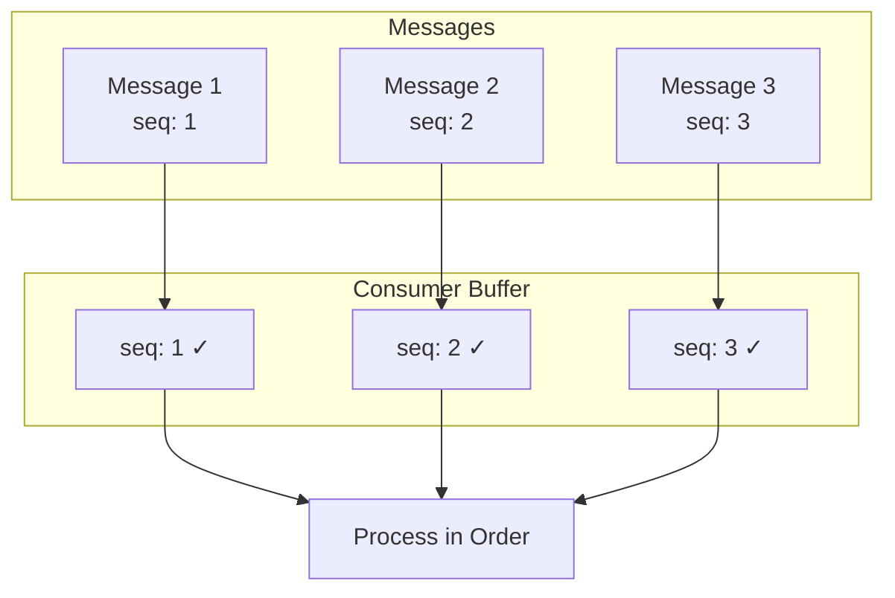
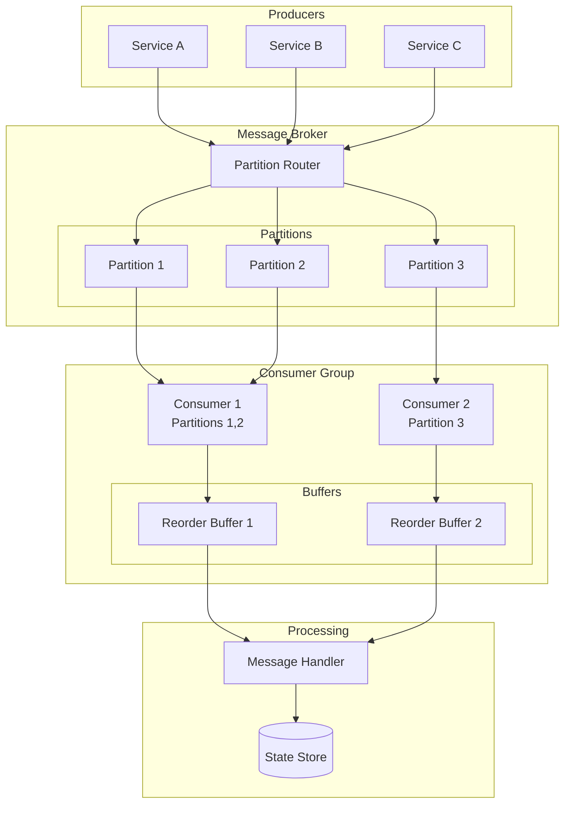

# How to Implement FIFO Guarantees

Author: [nawazdhandala](https://github.com/nawazdhandala)

Tags: Message Queues, Ordering, Reliability, Backend

Description: Learn how to implement FIFO message ordering guarantees in distributed systems.

---

Message ordering is a critical requirement in distributed systems. When events must be processed in the exact sequence they occurred, FIFO (First-In, First-Out) guarantees become essential. This post explores the core concepts, strategies, and practical implementations for achieving reliable message ordering.

## Why FIFO Matters

Consider an e-commerce system processing order events. If "Order Placed" arrives after "Order Shipped," the system state becomes inconsistent. FIFO guarantees ensure events are processed in their natural order.



## Core Concepts

### 1. Ordering Keys (Partition Keys)

Ordering keys group related messages together. Messages with the same ordering key are guaranteed to be processed in order, while messages with different keys can be processed in parallel.



### 2. Sequence Numbers

Sequence numbers provide explicit ordering metadata. Consumers use these numbers to detect gaps and reorder messages if needed.



## Partitioning Strategies

### Strategy 1: Entity-Based Partitioning

Group messages by the entity they affect. This is the most common approach.

```python
# Entity-based partitioning example
# All messages for the same user go to the same partition

import hashlib
from dataclasses import dataclass
from typing import Any

@dataclass
class Message:
    """Represents a message with ordering metadata."""
    entity_id: str      # The entity this message belongs to (e.g., user_id)
    payload: Any        # The actual message content
    sequence: int       # Sequence number within the entity

def calculate_partition(entity_id: str, num_partitions: int) -> int:
    """
    Calculate the target partition for a given entity.

    Uses consistent hashing to ensure the same entity
    always maps to the same partition.

    Args:
        entity_id: The unique identifier for the entity
        num_partitions: Total number of available partitions

    Returns:
        The partition number (0 to num_partitions - 1)
    """
    # Create a hash of the entity ID
    hash_bytes = hashlib.md5(entity_id.encode()).digest()

    # Convert first 4 bytes to an integer
    hash_int = int.from_bytes(hash_bytes[:4], byteorder='big')

    # Map to partition range
    return hash_int % num_partitions

# Example usage
user_id = "user-12345"
partition = calculate_partition(user_id, num_partitions=8)
print(f"User {user_id} maps to partition {partition}")
# All messages for user-12345 will go to the same partition
```

### Strategy 2: Time-Window Partitioning

For time-sensitive data, partition by time windows while maintaining order within each window.

```python
# Time-window partitioning example
# Messages are grouped by time windows for ordered processing

from datetime import datetime, timedelta
from typing import List, Dict
from collections import defaultdict

class TimeWindowPartitioner:
    """
    Partitions messages into time-based windows.
    Maintains FIFO order within each window.
    """

    def __init__(self, window_size_minutes: int = 5):
        """
        Initialize the partitioner.

        Args:
            window_size_minutes: Size of each time window in minutes
        """
        self.window_size = timedelta(minutes=window_size_minutes)
        self.windows: Dict[str, List[dict]] = defaultdict(list)

    def get_window_key(self, timestamp: datetime) -> str:
        """
        Calculate the window key for a given timestamp.

        Args:
            timestamp: The message timestamp

        Returns:
            A string key identifying the time window
        """
        # Round down to the nearest window boundary
        window_start = timestamp.replace(
            minute=(timestamp.minute // self.window_size.seconds * 60) *
                   (self.window_size.seconds // 60),
            second=0,
            microsecond=0
        )
        return window_start.isoformat()

    def add_message(self, message: dict, timestamp: datetime) -> str:
        """
        Add a message to the appropriate time window.

        Args:
            message: The message to add
            timestamp: The message timestamp

        Returns:
            The window key where the message was added
        """
        window_key = self.get_window_key(timestamp)

        # Messages within the same window maintain insertion order
        self.windows[window_key].append({
            'timestamp': timestamp,
            'data': message,
            'sequence': len(self.windows[window_key])
        })

        return window_key

    def get_messages_in_order(self, window_key: str) -> List[dict]:
        """
        Retrieve all messages from a window in FIFO order.

        Args:
            window_key: The time window to retrieve

        Returns:
            List of messages in order
        """
        return sorted(
            self.windows.get(window_key, []),
            key=lambda x: x['sequence']
        )
```

## Implementing FIFO with Apache Kafka

Kafka provides strong ordering guarantees within a partition. Here is how to leverage this effectively.

```python
# Kafka FIFO implementation
# Demonstrates producing and consuming with ordering guarantees

from confluent_kafka import Producer, Consumer, KafkaError
import json
from typing import Callable, Optional

class KafkaFIFOProducer:
    """
    A Kafka producer that maintains FIFO ordering per partition key.
    """

    def __init__(self, bootstrap_servers: str, topic: str):
        """
        Initialize the FIFO producer.

        Args:
            bootstrap_servers: Kafka broker addresses
            topic: Target topic name
        """
        self.topic = topic

        # Configure producer for reliability
        self.producer = Producer({
            'bootstrap.servers': bootstrap_servers,

            # Ensure messages are fully committed before ack
            'acks': 'all',

            # Enable idempotence to prevent duplicates
            'enable.idempotence': True,

            # Maximum in-flight requests per connection
            # Setting to 1 ensures strict ordering (with some throughput cost)
            'max.in.flight.requests.per.connection': 1,

            # Retry configuration
            'retries': 3,
            'retry.backoff.ms': 100,
        })

    def send(self, key: str, message: dict, sequence_num: int) -> None:
        """
        Send a message with FIFO guarantees.

        Args:
            key: Partition key (messages with same key go to same partition)
            message: The message payload
            sequence_num: Explicit sequence number for consumer validation
        """
        # Add sequence number to message for consumer-side validation
        enriched_message = {
            **message,
            '_sequence': sequence_num,
            '_key': key
        }

        # Produce with explicit key for partition assignment
        self.producer.produce(
            topic=self.topic,
            key=key.encode('utf-8'),
            value=json.dumps(enriched_message).encode('utf-8'),
            callback=self._delivery_callback
        )

        # Flush to ensure delivery (for strict ordering)
        self.producer.flush()

    def _delivery_callback(self, err, msg):
        """Handle delivery confirmation or error."""
        if err is not None:
            print(f"Delivery failed: {err}")
            raise Exception(f"Failed to deliver message: {err}")
        print(f"Message delivered to {msg.topic()} [{msg.partition()}]")


class KafkaFIFOConsumer:
    """
    A Kafka consumer that validates and processes messages in FIFO order.
    """

    def __init__(self, bootstrap_servers: str, topic: str, group_id: str):
        """
        Initialize the FIFO consumer.

        Args:
            bootstrap_servers: Kafka broker addresses
            topic: Topic to consume from
            group_id: Consumer group ID
        """
        self.consumer = Consumer({
            'bootstrap.servers': bootstrap_servers,
            'group.id': group_id,

            # Start from earliest if no offset stored
            'auto.offset.reset': 'earliest',

            # Disable auto commit for manual control
            'enable.auto.commit': False,

            # Fetch only from one partition at a time for ordering
            'max.partition.fetch.bytes': 1048576,
        })

        self.consumer.subscribe([topic])

        # Track last sequence number per key for validation
        self.last_sequence: dict = {}

    def consume(self, handler: Callable[[dict], None]) -> None:
        """
        Consume messages in FIFO order.

        Args:
            handler: Function to process each message
        """
        while True:
            msg = self.consumer.poll(timeout=1.0)

            if msg is None:
                continue

            if msg.error():
                if msg.error().code() == KafkaError._PARTITION_EOF:
                    continue
                raise Exception(f"Consumer error: {msg.error()}")

            # Parse the message
            value = json.loads(msg.value().decode('utf-8'))
            key = value.get('_key')
            sequence = value.get('_sequence')

            # Validate sequence order
            if key in self.last_sequence:
                expected = self.last_sequence[key] + 1
                if sequence != expected:
                    print(f"Warning: Out of order! Expected {expected}, got {sequence}")
                    # Handle out of order (buffer, reject, or reprocess)

            # Process the message
            handler(value)

            # Update tracking and commit
            self.last_sequence[key] = sequence
            self.consumer.commit(asynchronous=False)
```

## Implementing FIFO with Amazon SQS

Amazon SQS FIFO queues provide built-in ordering guarantees with message group IDs.

```python
# AWS SQS FIFO implementation
# Uses message group IDs for ordering and deduplication IDs for exactly-once

import boto3
import json
import uuid
from typing import Callable, Optional
from dataclasses import dataclass

@dataclass
class FIFOMessage:
    """Represents a message for SQS FIFO queue."""
    group_id: str           # Messages with same group_id are ordered
    deduplication_id: str   # Prevents duplicate processing
    body: dict              # Message content
    sequence: int           # Application-level sequence number

class SQSFIFOProducer:
    """
    Producer for SQS FIFO queues with ordering guarantees.
    """

    def __init__(self, queue_url: str, region: str = 'us-east-1'):
        """
        Initialize the SQS FIFO producer.

        Args:
            queue_url: The SQS FIFO queue URL (must end in .fifo)
            region: AWS region
        """
        self.sqs = boto3.client('sqs', region_name=region)
        self.queue_url = queue_url

        # Track sequence numbers per message group
        self.sequences: dict = {}

    def send(self, group_id: str, message: dict) -> dict:
        """
        Send a message with FIFO guarantees.

        Args:
            group_id: Message group ID for ordering
            message: The message payload

        Returns:
            SQS response with message ID and sequence number
        """
        # Generate or increment sequence number for this group
        if group_id not in self.sequences:
            self.sequences[group_id] = 0
        self.sequences[group_id] += 1
        sequence = self.sequences[group_id]

        # Create unique deduplication ID
        # Combining group_id and sequence ensures uniqueness
        deduplication_id = f"{group_id}-{sequence}-{uuid.uuid4().hex[:8]}"

        # Enrich message with ordering metadata
        enriched_body = {
            **message,
            '_group_id': group_id,
            '_sequence': sequence
        }

        # Send to SQS FIFO queue
        response = self.sqs.send_message(
            QueueUrl=self.queue_url,
            MessageBody=json.dumps(enriched_body),

            # Required for FIFO: determines ordering group
            MessageGroupId=group_id,

            # Required for FIFO: prevents duplicate delivery
            MessageDeduplicationId=deduplication_id
        )

        print(f"Sent message {sequence} to group {group_id}")
        return response

    def send_batch(self, group_id: str, messages: list) -> dict:
        """
        Send multiple messages in order within the same group.

        Args:
            group_id: Message group ID for all messages
            messages: List of message payloads

        Returns:
            SQS batch response
        """
        entries = []

        for i, message in enumerate(messages):
            # Increment sequence for each message
            if group_id not in self.sequences:
                self.sequences[group_id] = 0
            self.sequences[group_id] += 1
            sequence = self.sequences[group_id]

            entries.append({
                'Id': str(i),
                'MessageBody': json.dumps({
                    **message,
                    '_group_id': group_id,
                    '_sequence': sequence
                }),
                'MessageGroupId': group_id,
                'MessageDeduplicationId': f"{group_id}-{sequence}-{uuid.uuid4().hex[:8]}"
            })

        # SQS preserves order within a batch for the same group
        return self.sqs.send_message_batch(
            QueueUrl=self.queue_url,
            Entries=entries
        )


class SQSFIFOConsumer:
    """
    Consumer for SQS FIFO queues that maintains ordering.
    """

    def __init__(self, queue_url: str, region: str = 'us-east-1'):
        """
        Initialize the SQS FIFO consumer.

        Args:
            queue_url: The SQS FIFO queue URL
            region: AWS region
        """
        self.sqs = boto3.client('sqs', region_name=region)
        self.queue_url = queue_url

        # Track last processed sequence per group
        self.last_sequence: dict = {}

    def consume(self, handler: Callable[[dict], bool]) -> None:
        """
        Consume messages in FIFO order.

        Args:
            handler: Function to process each message.
                     Should return True on success, False on failure.
        """
        while True:
            # Receive messages (SQS returns them in order per group)
            response = self.sqs.receive_message(
                QueueUrl=self.queue_url,
                MaxNumberOfMessages=1,  # Process one at a time for strict ordering
                WaitTimeSeconds=20,     # Long polling for efficiency
                AttributeNames=['All']
            )

            messages = response.get('Messages', [])

            for message in messages:
                body = json.loads(message['Body'])
                group_id = body.get('_group_id')
                sequence = body.get('_sequence')

                # Validate ordering
                if group_id in self.last_sequence:
                    expected = self.last_sequence[group_id] + 1
                    if sequence != expected:
                        print(f"Sequence gap detected: expected {expected}, got {sequence}")
                        # Depending on requirements, you might want to:
                        # 1. Wait for missing messages
                        # 2. Process anyway and log the gap
                        # 3. Raise an alert

                # Process the message
                success = handler(body)

                if success:
                    # Delete message only after successful processing
                    self.sqs.delete_message(
                        QueueUrl=self.queue_url,
                        ReceiptHandle=message['ReceiptHandle']
                    )

                    # Update sequence tracking
                    self.last_sequence[group_id] = sequence
                    print(f"Processed message {sequence} from group {group_id}")
                else:
                    # Message will become visible again after visibility timeout
                    print(f"Failed to process message {sequence}, will retry")
```

## Handling Out-of-Order Messages

Even with FIFO systems, messages can occasionally arrive out of order due to retries or network issues. Here is a reordering buffer implementation.

```python
# Reordering buffer for handling out-of-order messages
# Buffers messages and releases them in sequence order

import heapq
from typing import Optional, List, Callable
from dataclasses import dataclass, field
from datetime import datetime, timedelta
import threading

@dataclass(order=True)
class BufferedMessage:
    """A message held in the reordering buffer."""
    sequence: int
    timestamp: datetime = field(compare=False)
    payload: dict = field(compare=False)

class ReorderingBuffer:
    """
    Buffer that reorders messages before delivery.

    Messages are held until all previous sequences are received
    or a timeout expires.
    """

    def __init__(
        self,
        handler: Callable[[dict], None],
        max_buffer_size: int = 1000,
        timeout_seconds: int = 30
    ):
        """
        Initialize the reordering buffer.

        Args:
            handler: Function to call with ordered messages
            max_buffer_size: Maximum messages to buffer per key
            timeout_seconds: Max time to wait for missing messages
        """
        self.handler = handler
        self.max_buffer_size = max_buffer_size
        self.timeout = timedelta(seconds=timeout_seconds)

        # Heap-based buffer for efficient ordering
        # Keyed by ordering key
        self.buffers: dict = {}

        # Next expected sequence per key
        self.expected_sequence: dict = {}

        # Lock for thread safety
        self.lock = threading.Lock()

    def add(self, key: str, sequence: int, payload: dict) -> None:
        """
        Add a message to the buffer.

        Args:
            key: Ordering key
            sequence: Message sequence number
            payload: Message content
        """
        with self.lock:
            # Initialize tracking for new keys
            if key not in self.buffers:
                self.buffers[key] = []
                self.expected_sequence[key] = 1

            message = BufferedMessage(
                sequence=sequence,
                timestamp=datetime.now(),
                payload=payload
            )

            # Add to heap (ordered by sequence number)
            heapq.heappush(self.buffers[key], message)

            # Try to flush ready messages
            self._flush_ready(key)

            # Check buffer size limit
            if len(self.buffers[key]) > self.max_buffer_size:
                self._force_flush_oldest(key)

    def _flush_ready(self, key: str) -> None:
        """
        Deliver messages that are ready (in sequence order).

        Args:
            key: The ordering key to flush
        """
        buffer = self.buffers[key]
        expected = self.expected_sequence[key]

        while buffer:
            # Peek at the smallest sequence number
            next_msg = buffer[0]

            if next_msg.sequence == expected:
                # This is the next expected message, deliver it
                heapq.heappop(buffer)
                self.handler(next_msg.payload)
                expected += 1
                self.expected_sequence[key] = expected

            elif next_msg.sequence < expected:
                # Duplicate or already processed, discard
                heapq.heappop(buffer)

            else:
                # Gap in sequence, check timeout
                age = datetime.now() - next_msg.timestamp
                if age > self.timeout:
                    # Timeout expired, skip missing and deliver
                    print(f"Timeout: skipping sequences {expected} to {next_msg.sequence - 1}")
                    self.expected_sequence[key] = next_msg.sequence
                    # Continue loop to deliver this message
                else:
                    # Still waiting for missing messages
                    break

    def _force_flush_oldest(self, key: str) -> None:
        """
        Force flush when buffer is full.

        Args:
            key: The ordering key to flush
        """
        buffer = self.buffers[key]

        if buffer:
            # Deliver oldest message regardless of sequence
            oldest = heapq.heappop(buffer)
            print(f"Buffer full: force delivering sequence {oldest.sequence}")
            self.handler(oldest.payload)

            # Update expected to next in buffer or beyond delivered
            if buffer:
                self.expected_sequence[key] = buffer[0].sequence
            else:
                self.expected_sequence[key] = oldest.sequence + 1


# Example usage of the reordering buffer
def process_message(msg: dict) -> None:
    """Example message handler."""
    print(f"Processing: {msg}")

# Create buffer with 30 second timeout
buffer = ReorderingBuffer(
    handler=process_message,
    max_buffer_size=100,
    timeout_seconds=30
)

# Messages arrive out of order
buffer.add("user-123", sequence=1, payload={"event": "login"})
buffer.add("user-123", sequence=3, payload={"event": "purchase"})  # Held in buffer
buffer.add("user-123", sequence=2, payload={"event": "add_to_cart"})  # Triggers flush

# Output (in order):
# Processing: {"event": "login"}
# Processing: {"event": "add_to_cart"}
# Processing: {"event": "purchase"}
```

## Architecture Overview

Here is a complete view of a FIFO-guaranteed message processing system.



## Best Practices

### 1. Choose the Right Partition Key

- Use entity IDs (user_id, order_id) that naturally group related events
- Ensure even distribution to avoid hot partitions
- Consider composite keys for complex ordering requirements

### 2. Handle Failures Gracefully

```python
# Idempotent message processing pattern
# Ensures messages can be safely reprocessed

class IdempotentProcessor:
    """
    Processes messages exactly once using deduplication.
    """

    def __init__(self, state_store):
        """
        Args:
            state_store: Persistent store for tracking processed messages
        """
        self.state_store = state_store

    def process(self, message_id: str, handler: Callable) -> bool:
        """
        Process a message idempotently.

        Args:
            message_id: Unique message identifier
            handler: Function to process the message

        Returns:
            True if processed, False if duplicate
        """
        # Check if already processed
        if self.state_store.exists(message_id):
            print(f"Duplicate message {message_id}, skipping")
            return False

        try:
            # Process the message
            handler()

            # Mark as processed (atomically with business logic if possible)
            self.state_store.set(message_id, processed=True)
            return True

        except Exception as e:
            # Do not mark as processed on failure
            # Message will be retried
            print(f"Processing failed: {e}")
            raise
```

### 3. Monitor Ordering Health

Track metrics to detect ordering issues early:

- Message lag per partition
- Out-of-order message rate
- Reorder buffer depth
- Processing latency per partition

## Conclusion

Implementing FIFO guarantees requires careful consideration of:

1. **Partition strategy**: Group related messages using appropriate keys
2. **Sequence tracking**: Use explicit sequence numbers for validation
3. **Consumer design**: Process messages in order within each partition
4. **Failure handling**: Buffer, retry, and handle gaps gracefully

By combining these techniques with the built-in capabilities of message brokers like Kafka and SQS FIFO, you can build reliable systems that maintain strict message ordering where it matters most.

Remember that global FIFO ordering across all messages is expensive and often unnecessary. Focus on ordering within logical groups (users, orders, sessions) to balance correctness with throughput.
