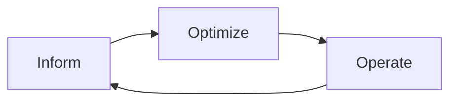
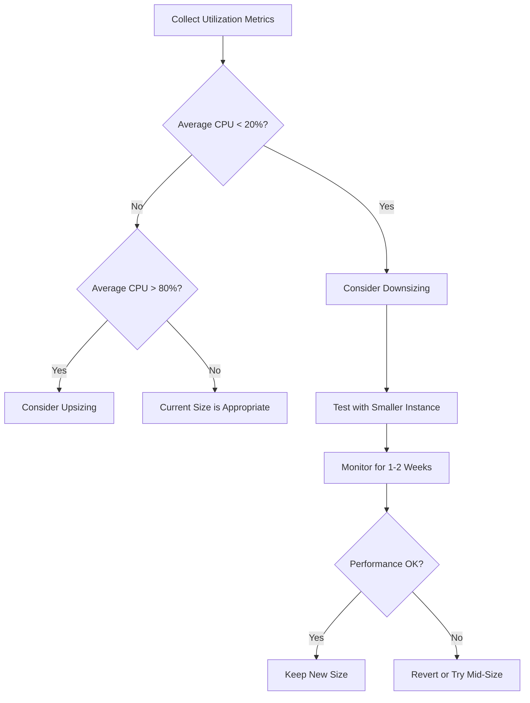

# FinOps Fundamentals for Engineering Teams

Author: [nawazdhandala](https://github.com/nawazdhandala)

Tags: FinOps, Cloud Cost, Cost Optimization, DevOps, Cloud

Description: An introduction to FinOps principles and practices that help engineering teams understand, manage, and optimize their cloud spending without sacrificing velocity.

---

Most engineering teams have no idea how much their infrastructure costs. They provision resources, deploy services, and ship features without ever looking at the bill. Then someone from finance sends a Slack message asking why the AWS bill jumped 40% last month, and nobody has a good answer.

FinOps exists to fix this. It is a set of practices that brings financial accountability to cloud spending, and it works best when engineering teams are actively involved rather than treating it as a finance problem.

## What FinOps Actually Is

FinOps (short for Cloud Financial Operations) is an operating model where engineering, finance, and business teams collaborate on cloud spending decisions. It is not about cutting costs. It is about spending efficiently so that every dollar of cloud spend delivers value.

The FinOps Foundation defines three phases that teams cycle through continuously:



**Inform**: Make cloud costs visible. Tag resources, allocate costs to teams and products, build dashboards, and establish benchmarks. You cannot optimize what you cannot see.

**Optimize**: Identify savings opportunities. Right-size instances, eliminate waste, leverage discounts (reserved instances, savings plans, spot instances), and architect for cost efficiency.

**Operate**: Build processes and governance. Set budgets, create alerts, automate cost controls, and make cost a regular part of engineering decision-making.

## Why Engineers Need to Care

The traditional model where finance manages costs and engineering manages technology does not work for cloud. In a data center world, procurement happened infrequently: you bought servers once or twice a year. In the cloud, every engineer makes spending decisions every day, often without realizing it.

Spinning up a large RDS instance for a development database, leaving a load test environment running over the weekend, choosing a NAT Gateway when a VPC endpoint would work, streaming logs through CloudWatch at high volume: these are all engineering decisions with financial consequences.

FinOps is not about making engineers ask permission to spend money. It is about giving them the information to make good decisions on their own.

## Tagging: The Foundation of Everything

Without consistent resource tagging, cost allocation is impossible. You cannot answer "how much does service X cost?" or "which team is responsible for this spend?" without tags.

At minimum, every resource should have these tags:

| Tag | Purpose | Example |
|---|---|---|
| `team` | Which team owns this | `platform`, `payments` |
| `service` | Which application/service | `user-api`, `search-indexer` |
| `environment` | Dev, staging, or production | `production`, `staging` |
| `cost-center` | Financial allocation | `eng-platform-2024` |

Enforce tagging with policy-as-code tools. Here is an example using Terraform that prevents untagged resources from being created:

```hcl
# Require mandatory tags on all resources
# This Terraform variable validation runs at plan time
# and blocks any apply that is missing required tags
variable "required_tags" {
  type = map(string)
  validation {
    condition = alltrue([
      contains(keys(var.required_tags), "team"),
      contains(keys(var.required_tags), "service"),
      contains(keys(var.required_tags), "environment"),
    ])
    error_message = "Resources must have team, service, and environment tags."
  }
}

# Apply tags to all resources in the module using default_tags
provider "aws" {
  default_tags {
    tags = var.required_tags
  }
}
```

You can also enforce tagging at the organizational level with AWS Service Control Policies or Azure Policy. The key is to prevent untagged resources from being created in the first place rather than trying to tag them after the fact.

## Understanding Your Cloud Bill

Cloud bills are notoriously hard to read. AWS alone has hundreds of service line items, and the same compute resource might appear under multiple categories (instance hours, EBS volumes, data transfer, CloudWatch metrics).

Break your bill down along two dimensions:

**By service type**: What are you paying for? Compute, storage, databases, networking, observability. This tells you where the money goes.

**By team/product**: Who is responsible for the spend? This requires tagging. Without it, you are guessing.

The AWS Cost Explorer, Azure Cost Management, or GCP Billing Console all provide these breakdowns. Third-party tools like Vantage, CloudHealth, or Kubecost (for Kubernetes) offer more detailed analysis.

A useful exercise for any engineering team: pull up the cost breakdown for your services and ask everyone to guess the top three cost drivers before revealing the actual data. The results are almost always surprising.

## Common Waste Patterns

Before getting into optimization techniques, here are the waste patterns that show up in almost every cloud account:

**Idle resources**: Development and staging environments running 24/7 when they are only used during business hours. A non-production environment that runs from 8am to 8pm, five days a week, uses only 36% of the hours it is billed for.

**Over-provisioned instances**: Teams size instances for peak load and never revisit. A t3.2xlarge running at 8% average CPU utilization should probably be a t3.medium.

**Unattached storage**: EBS volumes left behind after instances are terminated. Snapshots that no one references. S3 buckets with data that has not been accessed in months.

**Data transfer costs**: Moving data between availability zones, regions, or out to the internet. These charges are often invisible until you look at the bill.

**Zombie resources**: Load balancers with no targets, Elastic IPs with no instances, RDS read replicas that nothing queries.

## Right-Sizing

Right-sizing means matching your resource allocation to your actual usage. It is the single most impactful optimization most teams can make.



AWS Compute Optimizer and GCP Recommender both provide right-sizing recommendations based on historical utilization. But do not blindly follow them. Recommendations based on average CPU miss applications with spiky workloads. Always check the peak utilization and the p99 before downsizing.

A practical approach:

```python
# Analyze CloudWatch metrics to find over-provisioned EC2 instances
# This script pulls 14 days of CPU metrics and flags instances
# averaging below 20% utilization
import boto3
from datetime import datetime, timedelta

cloudwatch = boto3.client('cloudwatch')
ec2 = boto3.client('ec2')

def get_avg_cpu(instance_id: str, days: int = 14) -> float:
    """Fetch average CPU utilization over the given period."""
    response = cloudwatch.get_metric_statistics(
        Namespace='AWS/EC2',
        MetricName='CPUUtilization',
        Dimensions=[{'Name': 'InstanceId', 'Value': instance_id}],
        StartTime=datetime.utcnow() - timedelta(days=days),
        EndTime=datetime.utcnow(),
        Period=3600,  # 1-hour granularity
        Statistics=['Average']
    )
    datapoints = response.get('Datapoints', [])
    if not datapoints:
        return 0.0
    return sum(dp['Average'] for dp in datapoints) / len(datapoints)

def find_oversized_instances(threshold: float = 20.0):
    """List running instances with average CPU below the threshold."""
    instances = ec2.describe_instances(
        Filters=[{'Name': 'instance-state-name', 'Values': ['running']}]
    )
    results = []
    for reservation in instances['Reservations']:
        for instance in reservation['Instances']:
            instance_id = instance['InstanceId']
            instance_type = instance['InstanceType']
            avg_cpu = get_avg_cpu(instance_id)
            if avg_cpu < threshold:
                results.append({
                    'instance_id': instance_id,
                    'instance_type': instance_type,
                    'avg_cpu': round(avg_cpu, 2)
                })
    return results
```

## Scheduling Non-Production Environments

If your staging environment does not need to run at 3am, shut it down. Scheduling non-production environments to run only during business hours can cut their cost by 60-70%.

Use AWS Instance Scheduler, Azure Automation, or a simple Lambda function triggered by EventBridge rules. For Kubernetes, tools like Karpenter or kube-downscaler can scale non-production node pools to zero outside of working hours.

## Building a Cost-Aware Culture

The hardest part of FinOps is not the tooling. It is changing behavior. Here are practices that work:

**Weekly cost reviews**: Add a five-minute cost update to your team standup or weekly sync. Show the trend, highlight anomalies, and celebrate wins.

**Cost anomaly alerts**: Configure alerts for spending spikes. AWS Cost Anomaly Detection catches unexpected jumps. Route these alerts to the owning team's Slack channel.

**Architecture decision records (ADRs)**: When making architectural choices with cost implications, document the cost analysis alongside the technical analysis. "We chose DynamoDB over Aurora because at our query pattern, it costs 60% less" is a useful thing to have written down.

**Showback before chargeback**: Start by showing teams what they spend (showback) before charging it to their budget (chargeback). This builds awareness without creating friction.

**Cost as a non-functional requirement**: Just like latency, availability, and security, cost efficiency should be a requirement that is designed for, measured, and reviewed. Include cost estimates in design documents and compare actual spend against estimates after launch.

FinOps is a practice, not a project. There is no "done." Cloud infrastructure changes constantly, new services launch, usage patterns shift, and pricing models evolve. The teams that treat cost management as an ongoing discipline, not a one-time cleanup, are the ones that keep their cloud spending under control while still shipping fast.
