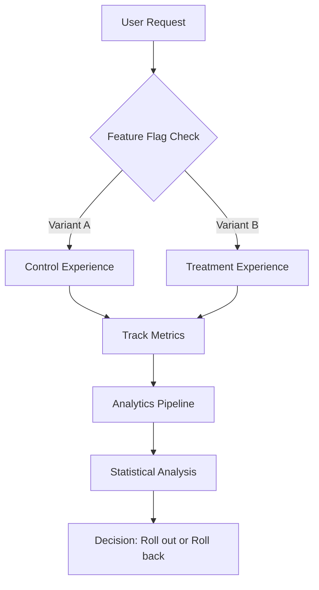
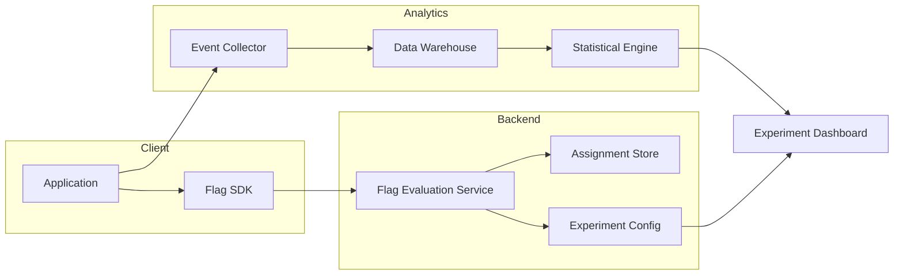
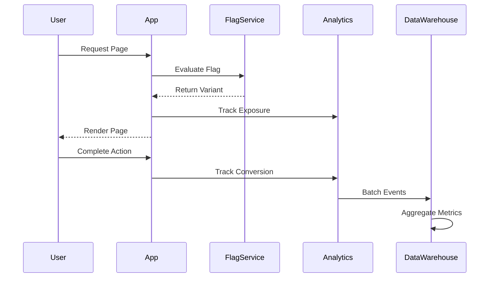
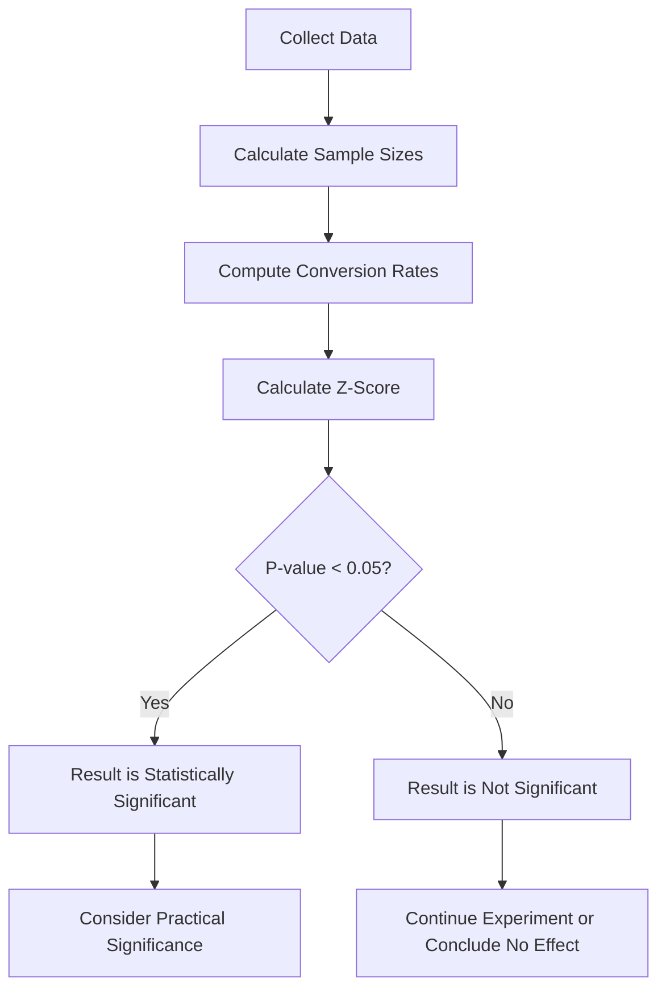

# How to Implement Flag A/B Testing

Author: [nawazdhandala](https://github.com/nawazdhandala)

Tags: Feature Flags, A/B Testing, Experimentation, Analytics

Description: Learn how to use feature flags for A/B testing and experimentation.

---

A/B testing is one of the most powerful techniques for making data-driven decisions about your product. When combined with feature flags, it becomes even more flexible and powerful. In this guide, we will walk through how to implement flag-based A/B testing from the ground up, covering experiment assignment, metrics tracking, and statistical significance.

## What is Flag A/B Testing?

Flag A/B testing uses feature flags as the mechanism to split users into different experiment groups (variants). Instead of deploying different code paths for each variant, you use a single codebase where feature flags control which experience each user sees.



## Architecture Overview

Before diving into implementation, let us understand the high-level architecture of a flag-based A/B testing system.



## Step 1: Experiment Assignment

The first step in any A/B test is assigning users to experiment variants. The assignment must be:

1. **Deterministic**: The same user should always see the same variant
2. **Random**: Users should be evenly distributed across variants
3. **Persistent**: Assignments should not change during the experiment

### Implementing a Hash-Based Assignment

Here is a TypeScript implementation of a deterministic assignment algorithm:

```typescript
import crypto from 'crypto';

// Interface defining the structure of an experiment
interface Experiment {
    id: string;
    name: string;
    variants: Variant[];
    // Traffic percentage (0-100) of users to include in the experiment
    trafficAllocation: number;
}

// Interface for individual variants within an experiment
interface Variant {
    id: string;
    name: string;
    // Weight determines the proportion of traffic this variant receives
    weight: number;
}

// Interface for the result of an assignment operation
interface AssignmentResult {
    experimentId: string;
    variantId: string | null;
    // Indicates if the user is part of the experiment
    isInExperiment: boolean;
}

/**
 * Generates a deterministic hash value between 0 and 1 for a given user and experiment.
 * Using SHA-256 ensures uniform distribution across the hash space.
 */
function getHashValue(userId: string, experimentId: string): number {
    // Combine userId and experimentId to create a unique seed
    const seed = `${userId}:${experimentId}`;

    // Generate SHA-256 hash
    const hash = crypto.createHash('sha256').update(seed).digest('hex');

    // Convert first 8 characters of hash to a number between 0 and 1
    // This gives us sufficient precision for percentage-based allocation
    const hashInt = parseInt(hash.substring(0, 8), 16);
    const maxHashValue = 0xffffffff;

    return hashInt / maxHashValue;
}

/**
 * Assigns a user to an experiment variant based on deterministic hashing.
 * This ensures the same user always gets the same variant for a given experiment.
 */
function assignUserToExperiment(
    userId: string,
    experiment: Experiment
): AssignmentResult {
    // Step 1: Determine if user is in the experiment at all
    const trafficHash = getHashValue(userId, `${experiment.id}:traffic`);
    const trafficThreshold = experiment.trafficAllocation / 100;

    // If the hash exceeds the traffic threshold, user is not in experiment
    if (trafficHash > trafficThreshold) {
        return {
            experimentId: experiment.id,
            variantId: null,
            isInExperiment: false
        };
    }

    // Step 2: Assign user to a specific variant
    const variantHash = getHashValue(userId, `${experiment.id}:variant`);

    // Calculate cumulative weights to determine variant boundaries
    const totalWeight = experiment.variants.reduce((sum, v) => sum + v.weight, 0);
    let cumulativeWeight = 0;

    // Find which variant the user falls into based on their hash value
    for (const variant of experiment.variants) {
        cumulativeWeight += variant.weight;
        const threshold = cumulativeWeight / totalWeight;

        if (variantHash <= threshold) {
            return {
                experimentId: experiment.id,
                variantId: variant.id,
                isInExperiment: true
            };
        }
    }

    // Fallback to last variant (should not reach here with valid weights)
    return {
        experimentId: experiment.id,
        variantId: experiment.variants[experiment.variants.length - 1].id,
        isInExperiment: true
    };
}

// Example usage demonstrating the assignment system
const experiment: Experiment = {
    id: 'checkout-button-color',
    name: 'Checkout Button Color Test',
    trafficAllocation: 50, // Only 50% of users will be in this experiment
    variants: [
        { id: 'control', name: 'Blue Button', weight: 50 },
        { id: 'treatment', name: 'Green Button', weight: 50 }
    ]
};

const assignment = assignUserToExperiment('user-12345', experiment);
console.log(assignment);
// Output: { experimentId: 'checkout-button-color', variantId: 'control', isInExperiment: true }
```

### Storing Assignments

For consistency and debugging, you should store assignments in a database:

```typescript
import { Pool } from 'pg';

// Database pool for PostgreSQL connections
const pool = new Pool({
    connectionString: process.env.DATABASE_URL
});

// Interface for stored assignment records
interface StoredAssignment {
    userId: string;
    experimentId: string;
    variantId: string;
    assignedAt: Date;
}

/**
 * Stores or retrieves an experiment assignment from the database.
 * This ensures users see consistent experiences across sessions.
 */
async function getOrCreateAssignment(
    userId: string,
    experiment: Experiment
): Promise<AssignmentResult> {
    // First, check if user already has an assignment for this experiment
    const existingQuery = `
        SELECT variant_id
        FROM experiment_assignments
        WHERE user_id = $1 AND experiment_id = $2
    `;

    const existing = await pool.query(existingQuery, [userId, experiment.id]);

    // Return existing assignment if found
    if (existing.rows.length > 0) {
        return {
            experimentId: experiment.id,
            variantId: existing.rows[0].variant_id,
            isInExperiment: existing.rows[0].variant_id !== null
        };
    }

    // Calculate new assignment using the hash-based algorithm
    const newAssignment = assignUserToExperiment(userId, experiment);

    // Persist the assignment to the database for future consistency
    const insertQuery = `
        INSERT INTO experiment_assignments (user_id, experiment_id, variant_id, assigned_at)
        VALUES ($1, $2, $3, NOW())
        ON CONFLICT (user_id, experiment_id) DO NOTHING
        RETURNING variant_id
    `;

    await pool.query(insertQuery, [
        userId,
        experiment.id,
        newAssignment.variantId
    ]);

    return newAssignment;
}
```

## Step 2: Implementing the Feature Flag

Now let us create a feature flag that uses the experiment assignment:

```typescript
// Types for flag evaluation context
interface FlagContext {
    userId: string;
    // Additional context attributes for targeting
    attributes?: Record<string, string | number | boolean>;
}

// Configuration for an A/B test flag
interface ABTestFlag {
    flagKey: string;
    experiment: Experiment;
    // Default value when user is not in experiment
    defaultValue: boolean | string | number | object;
    // Values for each variant
    variantValues: Record<string, boolean | string | number | object>;
}

/**
 * Evaluates a feature flag for A/B testing.
 * Returns the appropriate value based on the user's experiment assignment.
 */
async function evaluateABTestFlag<T>(
    flag: ABTestFlag,
    context: FlagContext
): Promise<{ value: T; assignment: AssignmentResult }> {
    // Get or create the user's assignment for this experiment
    const assignment = await getOrCreateAssignment(
        context.userId,
        flag.experiment
    );

    // If user is not in the experiment, return the default value
    if (!assignment.isInExperiment || assignment.variantId === null) {
        return {
            value: flag.defaultValue as T,
            assignment
        };
    }

    // Return the value associated with the user's assigned variant
    const variantValue = flag.variantValues[assignment.variantId];

    return {
        value: (variantValue ?? flag.defaultValue) as T,
        assignment
    };
}

// Example: Setting up and using an A/B test flag
const checkoutButtonFlag: ABTestFlag = {
    flagKey: 'checkout-button-style',
    experiment: experiment, // Using the experiment defined earlier
    defaultValue: { color: 'blue', text: 'Checkout' },
    variantValues: {
        'control': { color: 'blue', text: 'Checkout' },
        'treatment': { color: 'green', text: 'Complete Purchase' }
    }
};

// Usage in your application
async function renderCheckoutButton(userId: string) {
    const { value, assignment } = await evaluateABTestFlag<{ color: string; text: string }>(
        checkoutButtonFlag,
        { userId }
    );

    // Log exposure for analytics
    await trackExposure(userId, assignment);

    return `<button style="background: ${value.color}">${value.text}</button>`;
}
```

## Step 3: Metrics Tracking

Tracking metrics is essential for measuring the impact of your experiment. You need to track:

1. **Exposures**: When a user sees a variant
2. **Conversions**: When a user completes the desired action
3. **Revenue**: If applicable, the monetary value generated



### Implementing Event Tracking

```typescript
// Types for analytics events
interface BaseEvent {
    eventId: string;
    userId: string;
    timestamp: Date;
    // Session ID helps group events within a single visit
    sessionId: string;
}

// Event fired when a user is exposed to an experiment variant
interface ExposureEvent extends BaseEvent {
    type: 'exposure';
    experimentId: string;
    variantId: string;
}

// Event fired when a user completes a desired action
interface ConversionEvent extends BaseEvent {
    type: 'conversion';
    experimentId: string;
    variantId: string;
    // The specific metric being tracked (e.g., 'purchase', 'signup')
    metricName: string;
    // Optional numeric value associated with the conversion
    value?: number;
}

// Union type for all analytics events
type AnalyticsEvent = ExposureEvent | ConversionEvent;

// In-memory buffer for batching events before sending
const eventBuffer: AnalyticsEvent[] = [];
const BUFFER_FLUSH_INTERVAL = 5000; // Flush every 5 seconds
const BUFFER_MAX_SIZE = 100; // Flush when buffer reaches 100 events

/**
 * Generates a unique event ID using timestamp and random string.
 */
function generateEventId(): string {
    return `${Date.now()}-${Math.random().toString(36).substring(2, 15)}`;
}

/**
 * Tracks when a user is exposed to an experiment variant.
 * This should be called every time a flag is evaluated and shown to the user.
 */
async function trackExposure(
    userId: string,
    assignment: AssignmentResult,
    sessionId: string
): Promise<void> {
    // Do not track if user is not in the experiment
    if (!assignment.isInExperiment || assignment.variantId === null) {
        return;
    }

    const event: ExposureEvent = {
        eventId: generateEventId(),
        type: 'exposure',
        userId,
        sessionId,
        timestamp: new Date(),
        experimentId: assignment.experimentId,
        variantId: assignment.variantId
    };

    // Add to buffer for batch processing
    addToBuffer(event);
}

/**
 * Tracks a conversion event for an experiment.
 * Call this when a user completes a desired action (purchase, signup, etc.)
 */
async function trackConversion(
    userId: string,
    assignment: AssignmentResult,
    sessionId: string,
    metricName: string,
    value?: number
): Promise<void> {
    // Only track conversions for users in the experiment
    if (!assignment.isInExperiment || assignment.variantId === null) {
        return;
    }

    const event: ConversionEvent = {
        eventId: generateEventId(),
        type: 'conversion',
        userId,
        sessionId,
        timestamp: new Date(),
        experimentId: assignment.experimentId,
        variantId: assignment.variantId,
        metricName,
        value
    };

    addToBuffer(event);
}

/**
 * Adds an event to the buffer and triggers flush if needed.
 */
function addToBuffer(event: AnalyticsEvent): void {
    eventBuffer.push(event);

    // Flush immediately if buffer is full
    if (eventBuffer.length >= BUFFER_MAX_SIZE) {
        flushBuffer();
    }
}

/**
 * Sends buffered events to the analytics backend.
 */
async function flushBuffer(): Promise<void> {
    if (eventBuffer.length === 0) {
        return;
    }

    // Copy and clear the buffer atomically
    const eventsToSend = [...eventBuffer];
    eventBuffer.length = 0;

    try {
        // Send events to your analytics endpoint
        await fetch('/api/analytics/events', {
            method: 'POST',
            headers: { 'Content-Type': 'application/json' },
            body: JSON.stringify({ events: eventsToSend })
        });
    } catch (error) {
        // On failure, add events back to buffer for retry
        console.error('Failed to flush analytics events:', error);
        eventBuffer.unshift(...eventsToSend);
    }
}

// Set up periodic buffer flushing
setInterval(flushBuffer, BUFFER_FLUSH_INTERVAL);
```

## Step 4: Analytics Integration

Integrating with popular analytics platforms helps you leverage existing infrastructure. Here are examples for common platforms.

### Segment Integration

```typescript
import Analytics from '@segment/analytics-node';

// Initialize Segment client
const analytics = new Analytics({ writeKey: process.env.SEGMENT_WRITE_KEY! });

/**
 * Tracks an experiment exposure event to Segment.
 * Segment will forward this to any connected destinations.
 */
function trackExposureToSegment(
    userId: string,
    assignment: AssignmentResult
): void {
    if (!assignment.isInExperiment) return;

    analytics.track({
        userId,
        event: 'Experiment Viewed',
        properties: {
            experiment_id: assignment.experimentId,
            experiment_name: assignment.experimentId, // Ideally fetch the name
            variant_id: assignment.variantId,
            // Include timestamp for accurate time-based analysis
            exposure_timestamp: new Date().toISOString()
        },
        // Context provides additional metadata for segmentation
        context: {
            groupId: assignment.experimentId
        }
    });
}

/**
 * Tracks a conversion event to Segment with experiment context.
 */
function trackConversionToSegment(
    userId: string,
    assignment: AssignmentResult,
    eventName: string,
    properties: Record<string, unknown> = {}
): void {
    analytics.track({
        userId,
        event: eventName,
        properties: {
            ...properties,
            // Attach experiment context to all conversion events
            experiment_id: assignment.experimentId,
            variant_id: assignment.variantId
        }
    });
}
```

### Amplitude Integration

```typescript
import Amplitude from '@amplitude/analytics-node';

// Initialize Amplitude client
Amplitude.init(process.env.AMPLITUDE_API_KEY!);

/**
 * Sets user properties and tracks exposure in Amplitude.
 * User properties allow for cohort analysis by variant.
 */
async function trackExposureToAmplitude(
    userId: string,
    assignment: AssignmentResult
): Promise<void> {
    if (!assignment.isInExperiment) return;

    // Set user property for the experiment variant
    // This enables filtering and segmentation by variant
    const identify = new Amplitude.Identify();
    identify.set(`experiment_${assignment.experimentId}`, assignment.variantId);

    await Amplitude.identify(userId, undefined, identify);

    // Track the exposure event
    await Amplitude.track(
        'Experiment Exposure',
        {
            experiment_id: assignment.experimentId,
            variant_id: assignment.variantId
        },
        { user_id: userId }
    );
}

/**
 * Tracks conversion with experiment attribution in Amplitude.
 */
async function trackConversionToAmplitude(
    userId: string,
    eventName: string,
    properties: Record<string, unknown> = {},
    assignment?: AssignmentResult
): Promise<void> {
    const eventProperties = {
        ...properties,
        // Include experiment context if available
        ...(assignment?.isInExperiment && {
            experiment_id: assignment.experimentId,
            variant_id: assignment.variantId
        })
    };

    await Amplitude.track(eventName, eventProperties, { user_id: userId });
}
```

### Mixpanel Integration

```typescript
import Mixpanel from 'mixpanel';

// Initialize Mixpanel client
const mixpanel = Mixpanel.init(process.env.MIXPANEL_TOKEN!);

/**
 * Tracks experiment exposure in Mixpanel with super properties.
 */
function trackExposureToMixpanel(
    userId: string,
    assignment: AssignmentResult
): void {
    if (!assignment.isInExperiment) return;

    // Register super property so all subsequent events include variant
    // This is useful for automatic attribution
    mixpanel.people.set(userId, {
        [`$experiment_${assignment.experimentId}`]: assignment.variantId,
        $last_experiment_exposure: new Date().toISOString()
    });

    // Track the exposure event
    mixpanel.track('$experiment_started', {
        distinct_id: userId,
        $experiment_id: assignment.experimentId,
        $variant: assignment.variantId
    });
}

/**
 * Tracks conversion event in Mixpanel.
 * Experiment attribution happens automatically via super properties.
 */
function trackConversionToMixpanel(
    userId: string,
    eventName: string,
    properties: Record<string, unknown> = {}
): void {
    mixpanel.track(eventName, {
        distinct_id: userId,
        ...properties,
        $time: Date.now()
    });
}
```

## Step 5: Statistical Significance

To make valid conclusions from your A/B test, you need to calculate statistical significance. This tells you whether the observed difference between variants is real or just due to random chance.



### Implementing Statistical Analysis

```typescript
/**
 * Statistical functions for A/B test analysis.
 * These implement standard frequentist hypothesis testing.
 */

// Interface for variant metrics
interface VariantMetrics {
    variantId: string;
    // Total number of users exposed to this variant
    sampleSize: number;
    // Number of users who converted
    conversions: number;
    // Conversion rate (conversions / sampleSize)
    conversionRate: number;
}

// Interface for experiment analysis results
interface ExperimentAnalysis {
    controlMetrics: VariantMetrics;
    treatmentMetrics: VariantMetrics;
    // Absolute difference in conversion rates
    absoluteLift: number;
    // Relative percentage improvement
    relativeLift: number;
    // Z-score for the difference
    zScore: number;
    // P-value (probability of observing this difference by chance)
    pValue: number;
    // Whether the result is statistically significant at alpha = 0.05
    isSignificant: boolean;
    // 95% confidence interval for the lift
    confidenceInterval: { lower: number; upper: number };
}

/**
 * Calculates the standard error for a proportion.
 * Used in z-test calculations for conversion rates.
 */
function calculateStandardError(
    conversionRate: number,
    sampleSize: number
): number {
    // Standard error formula: sqrt(p * (1-p) / n)
    return Math.sqrt((conversionRate * (1 - conversionRate)) / sampleSize);
}

/**
 * Calculates the pooled standard error for two proportions.
 * This is used when comparing two independent proportions.
 */
function calculatePooledStandardError(
    control: VariantMetrics,
    treatment: VariantMetrics
): number {
    // Calculate pooled proportion
    const pooledProportion =
        (control.conversions + treatment.conversions) /
        (control.sampleSize + treatment.sampleSize);

    // Pooled standard error formula
    const pooledSE = Math.sqrt(
        pooledProportion * (1 - pooledProportion) *
        (1 / control.sampleSize + 1 / treatment.sampleSize)
    );

    return pooledSE;
}

/**
 * Calculates the z-score for the difference between two proportions.
 */
function calculateZScore(
    control: VariantMetrics,
    treatment: VariantMetrics
): number {
    const difference = treatment.conversionRate - control.conversionRate;
    const pooledSE = calculatePooledStandardError(control, treatment);

    // Avoid division by zero
    if (pooledSE === 0) return 0;

    return difference / pooledSE;
}

/**
 * Converts a z-score to a two-tailed p-value.
 * Uses the error function approximation for the normal CDF.
 */
function zScoreToPValue(zScore: number): number {
    // Approximation of the cumulative distribution function
    const a1 =  0.254829592;
    const a2 = -0.284496736;
    const a3 =  1.421413741;
    const a4 = -1.453152027;
    const a5 =  1.061405429;
    const p  =  0.3275911;

    const sign = zScore < 0 ? -1 : 1;
    const z = Math.abs(zScore) / Math.sqrt(2);

    const t = 1.0 / (1.0 + p * z);
    const y = 1.0 - (((((a5 * t + a4) * t) + a3) * t + a2) * t + a1) * t * Math.exp(-z * z);

    const cdf = 0.5 * (1.0 + sign * y);

    // Two-tailed p-value
    return 2 * (1 - cdf);
}

/**
 * Calculates the 95% confidence interval for the difference in proportions.
 */
function calculateConfidenceInterval(
    control: VariantMetrics,
    treatment: VariantMetrics
): { lower: number; upper: number } {
    const difference = treatment.conversionRate - control.conversionRate;

    // Standard error for the difference (unpooled, for CI)
    const seDiff = Math.sqrt(
        calculateStandardError(control.conversionRate, control.sampleSize) ** 2 +
        calculateStandardError(treatment.conversionRate, treatment.sampleSize) ** 2
    );

    // 1.96 is the z-value for 95% confidence
    const marginOfError = 1.96 * seDiff;

    return {
        lower: difference - marginOfError,
        upper: difference + marginOfError
    };
}

/**
 * Performs a complete statistical analysis of an A/B experiment.
 */
function analyzeExperiment(
    control: VariantMetrics,
    treatment: VariantMetrics,
    significanceLevel: number = 0.05
): ExperimentAnalysis {
    const absoluteLift = treatment.conversionRate - control.conversionRate;
    const relativeLift = control.conversionRate > 0
        ? (absoluteLift / control.conversionRate) * 100
        : 0;

    const zScore = calculateZScore(control, treatment);
    const pValue = zScoreToPValue(zScore);
    const confidenceInterval = calculateConfidenceInterval(control, treatment);

    return {
        controlMetrics: control,
        treatmentMetrics: treatment,
        absoluteLift,
        relativeLift,
        zScore,
        pValue,
        isSignificant: pValue < significanceLevel,
        confidenceInterval
    };
}

// Example: Analyzing experiment results
const controlData: VariantMetrics = {
    variantId: 'control',
    sampleSize: 10000,
    conversions: 350,
    conversionRate: 0.035 // 3.5% conversion rate
};

const treatmentData: VariantMetrics = {
    variantId: 'treatment',
    sampleSize: 10000,
    conversions: 420,
    conversionRate: 0.042 // 4.2% conversion rate
};

const analysis = analyzeExperiment(controlData, treatmentData);
console.log('Experiment Analysis:', {
    absoluteLift: `${(analysis.absoluteLift * 100).toFixed(2)}%`,
    relativeLift: `${analysis.relativeLift.toFixed(2)}%`,
    pValue: analysis.pValue.toFixed(4),
    isSignificant: analysis.isSignificant,
    confidenceInterval: {
        lower: `${(analysis.confidenceInterval.lower * 100).toFixed(2)}%`,
        upper: `${(analysis.confidenceInterval.upper * 100).toFixed(2)}%`
    }
});
```

### Sample Size Calculator

Before running an experiment, calculate the required sample size to detect your minimum detectable effect (MDE):

```typescript
/**
 * Calculates the required sample size per variant for an A/B test.
 * This uses the formula for comparing two proportions.
 */
function calculateRequiredSampleSize(
    baselineConversionRate: number,
    minimumDetectableEffect: number, // Relative lift you want to detect
    statisticalPower: number = 0.8, // Probability of detecting a true effect
    significanceLevel: number = 0.05 // Alpha level
): number {
    // Convert relative MDE to absolute
    const treatmentRate = baselineConversionRate * (1 + minimumDetectableEffect);
    const absoluteMDE = treatmentRate - baselineConversionRate;

    // Z-values for power and significance
    // Two-tailed test
    const zAlpha = 1.96; // For alpha = 0.05
    const zBeta = 0.84;  // For power = 0.8

    // Pooled proportion estimate
    const pooledProportion = (baselineConversionRate + treatmentRate) / 2;

    // Sample size formula
    const numerator = 2 * pooledProportion * (1 - pooledProportion) *
                      Math.pow(zAlpha + zBeta, 2);
    const denominator = Math.pow(absoluteMDE, 2);

    const sampleSizePerVariant = Math.ceil(numerator / denominator);

    return sampleSizePerVariant;
}

// Example: Calculate sample size for a checkout optimization experiment
const requiredSampleSize = calculateRequiredSampleSize(
    0.035,  // 3.5% baseline conversion rate
    0.10    // Want to detect a 10% relative improvement
);

console.log(`Required sample size per variant: ${requiredSampleSize}`);
// Output: Required sample size per variant: approximately 30,000
```

## Step 6: Putting It All Together

Here is a complete example showing how all the pieces work together in a real application:

```typescript
import express from 'express';
import { v4 as uuidv4 } from 'uuid';

const app = express();

// Store for active experiments
const experiments: Map<string, Experiment> = new Map();

// Initialize an experiment
experiments.set('pricing-page-test', {
    id: 'pricing-page-test',
    name: 'Pricing Page Layout Test',
    trafficAllocation: 100,
    variants: [
        { id: 'control', name: 'Original Layout', weight: 50 },
        { id: 'treatment', name: 'New Layout', weight: 50 }
    ]
});

// Middleware to extract or create user ID
app.use((req, res, next) => {
    // Get user ID from cookie or create new one
    req.userId = req.cookies?.userId || uuidv4();
    req.sessionId = req.cookies?.sessionId || uuidv4();

    // Set cookies if they do not exist
    if (!req.cookies?.userId) {
        res.cookie('userId', req.userId, { maxAge: 365 * 24 * 60 * 60 * 1000 });
    }
    if (!req.cookies?.sessionId) {
        res.cookie('sessionId', req.sessionId, { maxAge: 30 * 60 * 1000 });
    }

    next();
});

// Pricing page endpoint
app.get('/pricing', async (req, res) => {
    const experiment = experiments.get('pricing-page-test');

    if (!experiment) {
        // Fallback if experiment is not configured
        return res.render('pricing-control');
    }

    // Get user's assignment
    const assignment = await getOrCreateAssignment(req.userId, experiment);

    // Track exposure
    await trackExposure(req.userId, assignment, req.sessionId);

    // Also send to analytics platforms
    trackExposureToSegment(req.userId, assignment);
    await trackExposureToAmplitude(req.userId, assignment);

    // Render appropriate variant
    if (assignment.variantId === 'treatment') {
        return res.render('pricing-treatment', {
            experimentId: experiment.id,
            variantId: assignment.variantId
        });
    }

    return res.render('pricing-control', {
        experimentId: experiment.id,
        variantId: assignment.variantId
    });
});

// Conversion endpoint (when user signs up)
app.post('/signup', async (req, res) => {
    const experiment = experiments.get('pricing-page-test');

    // Get user's assignment (will return existing assignment)
    const assignment = await getOrCreateAssignment(req.userId, experiment!);

    // Track conversion
    await trackConversion(
        req.userId,
        assignment,
        req.sessionId,
        'signup',
        req.body.plan_value // e.g., monthly plan value
    );

    // Also send to analytics
    trackConversionToSegment(req.userId, assignment, 'User Signed Up', {
        plan: req.body.plan,
        value: req.body.plan_value
    });

    // Process signup...
    res.json({ success: true });
});

// Experiment results endpoint
app.get('/api/experiments/:experimentId/results', async (req, res) => {
    const { experimentId } = req.params;

    // Query aggregated metrics from your data warehouse
    const metrics = await pool.query(`
        SELECT
            ea.variant_id,
            COUNT(DISTINCT ea.user_id) as sample_size,
            COUNT(DISTINCT CASE WHEN c.user_id IS NOT NULL THEN c.user_id END) as conversions
        FROM experiment_assignments ea
        LEFT JOIN conversions c ON ea.user_id = c.user_id
            AND ea.experiment_id = c.experiment_id
        WHERE ea.experiment_id = $1
        GROUP BY ea.variant_id
    `, [experimentId]);

    // Calculate metrics for each variant
    const variantMetrics: VariantMetrics[] = metrics.rows.map(row => ({
        variantId: row.variant_id,
        sampleSize: parseInt(row.sample_size),
        conversions: parseInt(row.conversions),
        conversionRate: parseInt(row.conversions) / parseInt(row.sample_size)
    }));

    // Find control and treatment
    const control = variantMetrics.find(v => v.variantId === 'control')!;
    const treatment = variantMetrics.find(v => v.variantId === 'treatment')!;

    // Analyze results
    const analysis = analyzeExperiment(control, treatment);

    res.json({
        experimentId,
        analysis,
        recommendation: analysis.isSignificant && analysis.relativeLift > 0
            ? 'Roll out treatment variant'
            : analysis.isSignificant && analysis.relativeLift < 0
            ? 'Keep control variant'
            : 'Continue experiment - results not yet significant'
    });
});

app.listen(3000, () => {
    console.log('Server running on port 3000');
});
```

## Best Practices

### 1. Avoid Peeking

Do not check results too frequently or make decisions before reaching statistical significance. This leads to false positives.

```typescript
/**
 * Checks if an experiment has enough data for a valid conclusion.
 * Prevents premature decision-making.
 */
function canMakeDecision(
    analysis: ExperimentAnalysis,
    minimumSampleSize: number = 1000,
    minimumRuntime: number = 7 * 24 * 60 * 60 * 1000 // 7 days in ms
): { canDecide: boolean; reason: string } {
    const experimentStartTime = /* fetch from database */;
    const runtime = Date.now() - experimentStartTime;

    // Check minimum sample size
    if (analysis.controlMetrics.sampleSize < minimumSampleSize ||
        analysis.treatmentMetrics.sampleSize < minimumSampleSize) {
        return {
            canDecide: false,
            reason: `Insufficient sample size. Need at least ${minimumSampleSize} per variant.`
        };
    }

    // Check minimum runtime
    if (runtime < minimumRuntime) {
        return {
            canDecide: false,
            reason: 'Experiment has not run for minimum duration (7 days).'
        };
    }

    // Check statistical significance
    if (!analysis.isSignificant) {
        return {
            canDecide: false,
            reason: 'Results are not statistically significant yet.'
        };
    }

    return {
        canDecide: true,
        reason: 'Experiment has sufficient data for a decision.'
    };
}
```

### 2. Handle Edge Cases

```typescript
/**
 * Safely evaluates a flag with fallback handling.
 */
async function safeEvaluateFlag<T>(
    flagKey: string,
    context: FlagContext,
    defaultValue: T
): Promise<T> {
    try {
        const flag = await fetchFlagConfiguration(flagKey);

        if (!flag) {
            console.warn(`Flag ${flagKey} not found, using default`);
            return defaultValue;
        }

        const { value } = await evaluateABTestFlag<T>(flag, context);
        return value;

    } catch (error) {
        // Log error but do not crash the application
        console.error(`Error evaluating flag ${flagKey}:`, error);

        // Return default value on any error
        return defaultValue;
    }
}
```

### 3. Document Your Experiments

Keep a record of all experiments for future reference:

```typescript
interface ExperimentDocumentation {
    experimentId: string;
    hypothesis: string;
    primaryMetric: string;
    secondaryMetrics: string[];
    startDate: Date;
    endDate?: Date;
    status: 'running' | 'concluded' | 'stopped';
    conclusion?: string;
    learnings?: string[];
}
```

## Conclusion

Implementing flag-based A/B testing gives you a powerful framework for making data-driven decisions. The key components are:

1. **Deterministic assignment** ensures consistent user experiences
2. **Proper metrics tracking** captures the data you need for analysis
3. **Statistical significance** helps you make valid conclusions
4. **Analytics integration** leverages your existing data infrastructure

Remember to plan your experiments carefully, avoid peeking at results too early, and always consider both statistical and practical significance when making decisions.

By following the patterns in this guide, you can build a robust experimentation platform that enables rapid, confident product iteration.
