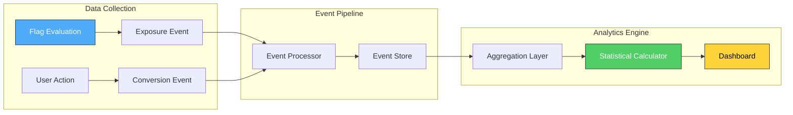
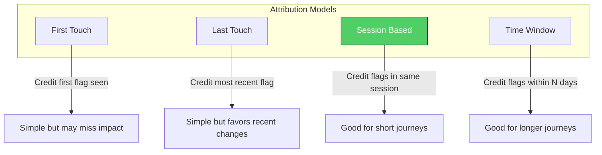
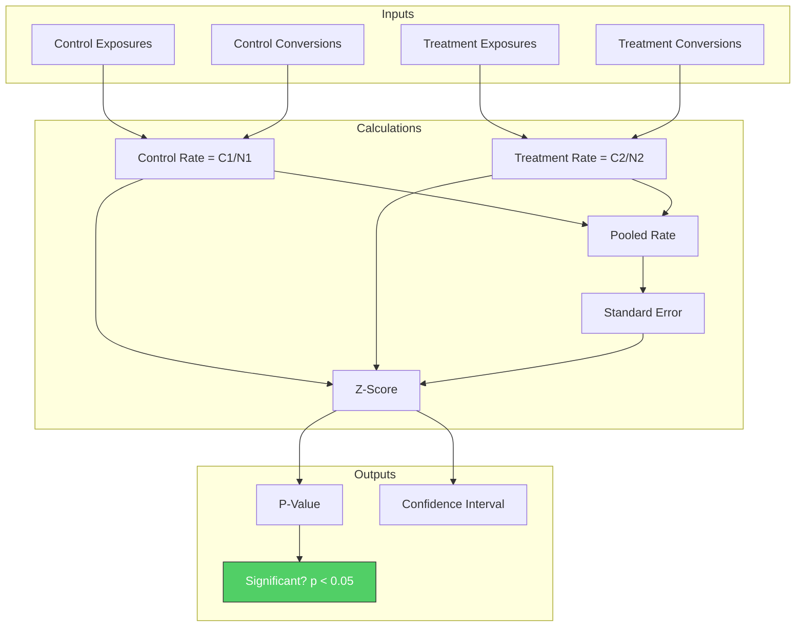
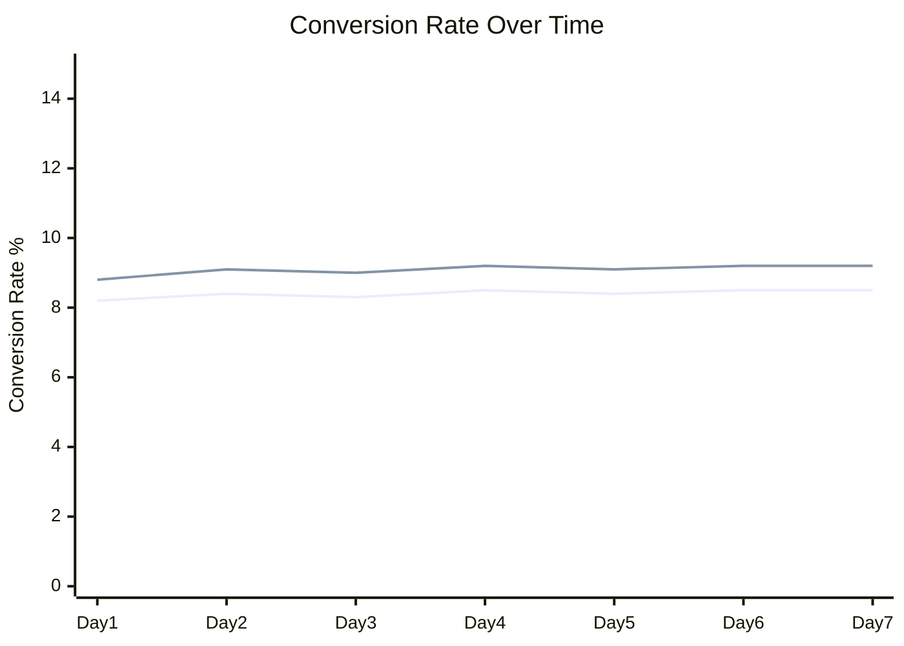
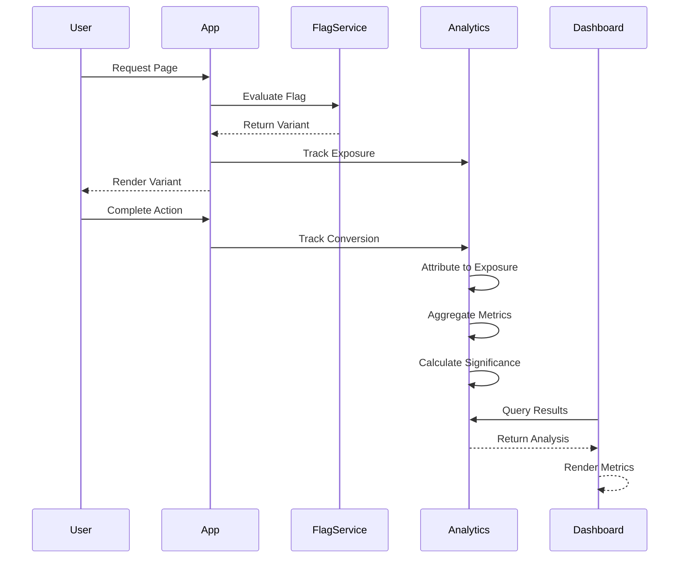

# How to Create Flag Analytics

Author: [nawazdhandala](https://github.com/nawazdhandala)

Tags: Feature Flags, Analytics, Metrics, Experimentation

Description: A practical guide to building analytics for feature flags including exposure tracking, conversion metrics, and statistical significance calculations.

---

Feature flags are not just on/off switches. When you add analytics, they become powerful experimentation tools that tell you whether a change actually improves user outcomes. This guide walks through building flag analytics from scratch, covering exposure tracking, conversion metrics, and the statistical foundations that make your experiments trustworthy.

## Why Flag Analytics Matter

Deploying a feature is the easy part. Knowing whether it helps or hurts users is hard. Without flag analytics, teams rely on gut feelings, anecdotal feedback, or delayed metric reviews to make decisions. Flag analytics close the loop by connecting each feature flag evaluation to measurable outcomes.

With proper flag analytics, you can answer:

- Which variant is actually performing better?
- How many users saw each variant?
- Is the difference statistically significant or just noise?
- What is the impact on key business metrics?

## The Flag Analytics Pipeline

Flag analytics require capturing data at multiple points and connecting them together. Here is the high-level architecture:



The pipeline has three stages:

1. **Data Collection:** Capture flag evaluations (exposures) and user actions (conversions)
2. **Event Pipeline:** Process, enrich, and store events for analysis
3. **Analytics Engine:** Aggregate data, calculate statistics, and present results

## Setting Up Exposure Tracking

Exposure tracking records every time a user sees a particular flag variant. This is the foundation of all flag analytics.

### Exposure Event Structure

Each exposure event should contain:

```typescript
interface ExposureEvent {
  // Unique identifier for this evaluation
  evaluationId: string;

  // Which flag was evaluated
  flagKey: string;

  // Which variant the user received
  variant: string;

  // User identifier (hashed for privacy)
  userId: string;

  // Timestamp of the evaluation
  timestamp: Date;

  // Context about the evaluation
  context: {
    sessionId: string;
    platform: string;
    version: string;
  };

  // Targeting rule that matched
  ruleId?: string;
}
```

### Implementing Exposure Tracking

Here is a basic exposure tracker that wraps your flag evaluation logic:

```typescript
import { v4 as uuid } from 'uuid';

class FlagAnalytics {
  private eventQueue: ExposureEvent[] = [];
  private flushInterval: number = 5000;

  constructor(private eventEndpoint: string) {
    setInterval(() => this.flush(), this.flushInterval);
  }

  trackExposure(
    flagKey: string,
    variant: string,
    userId: string,
    context: Record<string, string>
  ): void {
    const event: ExposureEvent = {
      evaluationId: uuid(),
      flagKey,
      variant,
      userId: this.hashUserId(userId),
      timestamp: new Date(),
      context: {
        sessionId: context.sessionId || '',
        platform: context.platform || 'web',
        version: context.version || '1.0.0',
      },
    };

    this.eventQueue.push(event);

    // Flush immediately if queue is large
    if (this.eventQueue.length >= 100) {
      this.flush();
    }
  }

  private async flush(): Promise<void> {
    if (this.eventQueue.length === 0) return;

    const events = [...this.eventQueue];
    this.eventQueue = [];

    try {
      await fetch(this.eventEndpoint, {
        method: 'POST',
        headers: { 'Content-Type': 'application/json' },
        body: JSON.stringify({ events }),
      });
    } catch (error) {
      // Re-queue events on failure
      this.eventQueue = [...events, ...this.eventQueue];
      console.error('Failed to flush exposure events:', error);
    }
  }

  private hashUserId(userId: string): string {
    // Use a proper hashing function in production
    return Buffer.from(userId).toString('base64');
  }
}
```

### Deduplication Matters

Users might evaluate the same flag multiple times in a session. You need a deduplication strategy to avoid counting the same user multiple times:

```typescript
class DeduplicatedExposureTracker {
  private seenExposures = new Map<string, number>();
  private dedupeWindow = 30 * 60 * 1000; // 30 minutes

  shouldTrack(userId: string, flagKey: string): boolean {
    const key = `${userId}:${flagKey}`;
    const lastSeen = this.seenExposures.get(key);
    const now = Date.now();

    if (lastSeen && now - lastSeen < this.dedupeWindow) {
      return false;
    }

    this.seenExposures.set(key, now);
    return true;
  }

  // Clean up old entries periodically
  cleanup(): void {
    const cutoff = Date.now() - this.dedupeWindow;
    for (const [key, timestamp] of this.seenExposures) {
      if (timestamp < cutoff) {
        this.seenExposures.delete(key);
      }
    }
  }
}
```

## Tracking Conversion Metrics

Exposures tell you who saw what. Conversions tell you what they did afterwards. The connection between exposures and conversions is where analytics becomes powerful.

### Conversion Event Structure

```typescript
interface ConversionEvent {
  // Unique identifier for this conversion
  conversionId: string;

  // What metric this represents
  metricKey: string;

  // Numeric value if applicable
  value?: number;

  // User identifier (hashed)
  userId: string;

  // Timestamp of the conversion
  timestamp: Date;

  // Session for attribution
  sessionId: string;

  // Additional properties
  properties?: Record<string, string | number | boolean>;
}
```

### Conversion Tracking Implementation

```typescript
class ConversionTracker {
  private eventQueue: ConversionEvent[] = [];

  track(
    metricKey: string,
    userId: string,
    sessionId: string,
    value?: number,
    properties?: Record<string, string | number | boolean>
  ): void {
    const event: ConversionEvent = {
      conversionId: uuid(),
      metricKey,
      userId: this.hashUserId(userId),
      timestamp: new Date(),
      sessionId,
      value,
      properties,
    };

    this.eventQueue.push(event);
  }

  // Common conversion types
  trackPurchase(userId: string, sessionId: string, amount: number): void {
    this.track('purchase', userId, sessionId, amount, { currency: 'USD' });
  }

  trackSignup(userId: string, sessionId: string): void {
    this.track('signup', userId, sessionId, 1);
  }

  trackEngagement(userId: string, sessionId: string, action: string): void {
    this.track('engagement', userId, sessionId, 1, { action });
  }

  private hashUserId(userId: string): string {
    return Buffer.from(userId).toString('base64');
  }
}
```

### Attribution Models

Connecting conversions to flag exposures requires an attribution model. Here are common approaches:



Session-based attribution works well for most use cases:

```typescript
interface Attribution {
  exposureId: string;
  flagKey: string;
  variant: string;
  timeSinceExposure: number;
}

class AttributionEngine {
  async attributeConversion(
    userId: string,
    sessionId: string,
    conversionTime: Date,
    lookbackWindow: number = 24 * 60 * 60 * 1000 // 24 hours
  ): Promise<Attribution[]> {
    const cutoff = new Date(conversionTime.getTime() - lookbackWindow);

    // Query exposures for this user within the lookback window
    const exposures = await this.getExposures(userId, cutoff, conversionTime);

    // Filter to same session or within time window
    return exposures
      .filter(exp => exp.context.sessionId === sessionId ||
                     exp.timestamp >= cutoff)
      .map(exp => ({
        exposureId: exp.evaluationId,
        flagKey: exp.flagKey,
        variant: exp.variant,
        timeSinceExposure: conversionTime.getTime() - exp.timestamp.getTime(),
      }));
  }

  private async getExposures(
    userId: string,
    from: Date,
    to: Date
  ): Promise<ExposureEvent[]> {
    // Query your event store
    return [];
  }
}
```

## Building the Aggregation Layer

Raw events need to be aggregated into metrics that are useful for analysis. The aggregation layer computes daily or hourly rollups.

### Aggregated Metrics Schema

```typescript
interface FlagMetricAggregate {
  flagKey: string;
  variant: string;
  metricKey: string;
  period: string; // '2026-01-30' or '2026-01-30T14'

  // Exposure counts
  uniqueUsers: number;
  totalExposures: number;

  // Conversion metrics
  conversions: number;
  totalValue: number;

  // Calculated rates
  conversionRate: number;
  averageValue: number;
}
```

### Aggregation Query Example

```sql
-- Daily aggregation for flag analytics
WITH exposures AS (
  SELECT
    flag_key,
    variant,
    DATE(timestamp) as period,
    COUNT(DISTINCT user_id) as unique_users,
    COUNT(*) as total_exposures
  FROM exposure_events
  WHERE timestamp >= CURRENT_DATE - INTERVAL '30 days'
  GROUP BY flag_key, variant, DATE(timestamp)
),
conversions AS (
  SELECT
    a.flag_key,
    a.variant,
    DATE(c.timestamp) as period,
    COUNT(DISTINCT c.user_id) as converters,
    COUNT(*) as conversion_count,
    SUM(c.value) as total_value
  FROM conversion_events c
  JOIN attribution a ON c.conversion_id = a.conversion_id
  WHERE c.timestamp >= CURRENT_DATE - INTERVAL '30 days'
  GROUP BY a.flag_key, a.variant, DATE(c.timestamp)
)
SELECT
  e.flag_key,
  e.variant,
  e.period,
  e.unique_users,
  e.total_exposures,
  COALESCE(c.converters, 0) as converters,
  COALESCE(c.conversion_count, 0) as conversions,
  COALESCE(c.total_value, 0) as total_value,
  COALESCE(c.converters::float / NULLIF(e.unique_users, 0), 0) as conversion_rate
FROM exposures e
LEFT JOIN conversions c
  ON e.flag_key = c.flag_key
  AND e.variant = c.variant
  AND e.period = c.period
ORDER BY e.flag_key, e.period, e.variant;
```

## Statistical Significance Calculations

The most important part of flag analytics is determining whether observed differences are real or just random noise. This requires statistical significance testing.

### Understanding the Math

For conversion rate experiments, we use a two-proportion z-test. Here is what it calculates:



### Statistical Significance Implementation

```typescript
interface ExperimentResult {
  controlRate: number;
  treatmentRate: number;
  relativeLift: number;
  absoluteLift: number;
  zScore: number;
  pValue: number;
  confidenceInterval: [number, number];
  isSignificant: boolean;
  requiredSampleSize: number;
  currentPower: number;
}

class StatisticalCalculator {
  // Standard normal distribution cumulative function
  private normalCDF(z: number): number {
    const a1 = 0.254829592;
    const a2 = -0.284496736;
    const a3 = 1.421413741;
    const a4 = -1.453152027;
    const a5 = 1.061405429;
    const p = 0.3275911;

    const sign = z < 0 ? -1 : 1;
    z = Math.abs(z) / Math.sqrt(2);

    const t = 1.0 / (1.0 + p * z);
    const y = 1.0 - (((((a5 * t + a4) * t) + a3) * t + a2) * t + a1) * t * Math.exp(-z * z);

    return 0.5 * (1.0 + sign * y);
  }

  // Two-tailed p-value from z-score
  private zToPValue(z: number): number {
    return 2 * (1 - this.normalCDF(Math.abs(z)));
  }

  calculateSignificance(
    controlExposures: number,
    controlConversions: number,
    treatmentExposures: number,
    treatmentConversions: number,
    confidenceLevel: number = 0.95
  ): ExperimentResult {
    // Conversion rates
    const p1 = controlConversions / controlExposures;
    const p2 = treatmentConversions / treatmentExposures;

    // Pooled proportion
    const pooledP = (controlConversions + treatmentConversions) /
                    (controlExposures + treatmentExposures);

    // Standard error
    const se = Math.sqrt(
      pooledP * (1 - pooledP) * (1 / controlExposures + 1 / treatmentExposures)
    );

    // Z-score
    const z = (p2 - p1) / se;

    // P-value (two-tailed)
    const pValue = this.zToPValue(z);

    // Confidence interval for the difference
    const zAlpha = 1.96; // 95% confidence
    const ciMargin = zAlpha * Math.sqrt(
      (p1 * (1 - p1) / controlExposures) + (p2 * (1 - p2) / treatmentExposures)
    );

    // Lift calculations
    const absoluteLift = p2 - p1;
    const relativeLift = p1 > 0 ? (p2 - p1) / p1 : 0;

    // Significance threshold
    const alpha = 1 - confidenceLevel;
    const isSignificant = pValue < alpha;

    // Required sample size for 80% power to detect current lift
    const requiredSampleSize = this.calculateRequiredSampleSize(p1, p2, 0.8, alpha);

    // Current power with observed sample sizes
    const currentPower = this.calculatePower(
      p1, p2, controlExposures, treatmentExposures, alpha
    );

    return {
      controlRate: p1,
      treatmentRate: p2,
      relativeLift,
      absoluteLift,
      zScore: z,
      pValue,
      confidenceInterval: [absoluteLift - ciMargin, absoluteLift + ciMargin],
      isSignificant,
      requiredSampleSize,
      currentPower,
    };
  }

  calculateRequiredSampleSize(
    baseRate: number,
    expectedRate: number,
    power: number = 0.8,
    alpha: number = 0.05
  ): number {
    const zAlpha = 1.96; // Two-tailed for alpha = 0.05
    const zBeta = 0.84;  // For power = 0.8

    const p1 = baseRate;
    const p2 = expectedRate;
    const pBar = (p1 + p2) / 2;

    const n = Math.pow(
      zAlpha * Math.sqrt(2 * pBar * (1 - pBar)) +
      zBeta * Math.sqrt(p1 * (1 - p1) + p2 * (1 - p2)),
      2
    ) / Math.pow(p2 - p1, 2);

    return Math.ceil(n);
  }

  calculatePower(
    p1: number,
    p2: number,
    n1: number,
    n2: number,
    alpha: number = 0.05
  ): number {
    const se = Math.sqrt(p1 * (1 - p1) / n1 + p2 * (1 - p2) / n2);
    const zAlpha = 1.96;
    const zObserved = Math.abs(p2 - p1) / se;

    return this.normalCDF(zObserved - zAlpha);
  }
}
```

### Using the Calculator

```typescript
const calc = new StatisticalCalculator();

// Example: checkout flow experiment
const result = calc.calculateSignificance(
  10000,  // control exposures
  850,    // control conversions (8.5% rate)
  10000,  // treatment exposures
  920     // treatment conversions (9.2% rate)
);

console.log(`Control Rate: ${(result.controlRate * 100).toFixed(2)}%`);
console.log(`Treatment Rate: ${(result.treatmentRate * 100).toFixed(2)}%`);
console.log(`Relative Lift: ${(result.relativeLift * 100).toFixed(1)}%`);
console.log(`P-Value: ${result.pValue.toFixed(4)}`);
console.log(`Significant: ${result.isSignificant ? 'Yes' : 'No'}`);
console.log(`Current Power: ${(result.currentPower * 100).toFixed(1)}%`);
```

## Building the Analytics Dashboard

The final piece is presenting this data in a way that helps teams make decisions.

### Key Metrics to Display

| Metric | Description | Why It Matters |
|--------|-------------|----------------|
| Exposure Count | Unique users per variant | Shows experiment reach |
| Conversion Rate | Conversions / Exposures | Primary success metric |
| Relative Lift | % change vs control | Easy to understand impact |
| Statistical Significance | p-value < 0.05 | Confidence in results |
| Confidence Interval | Range of true effect | Uncertainty bounds |
| Time to Significance | Days until conclusive | Planning timeline |

### Dashboard Data Structure

```typescript
interface FlagAnalyticsDashboard {
  flagKey: string;
  experiment: {
    name: string;
    hypothesis: string;
    startDate: Date;
    status: 'running' | 'concluded' | 'stopped';
  };
  variants: Array<{
    name: string;
    exposures: number;
    conversions: number;
    conversionRate: number;
    isControl: boolean;
  }>;
  analysis: {
    winner: string | null;
    relativeLift: number;
    absoluteLift: number;
    pValue: number;
    confidenceInterval: [number, number];
    isSignificant: boolean;
    powerAnalysis: {
      currentPower: number;
      requiredSampleSize: number;
      estimatedDaysToSignificance: number;
    };
  };
  timeline: Array<{
    date: string;
    controlRate: number;
    treatmentRate: number;
    cumulativePValue: number;
  }>;
}
```

### Timeline Visualization

Tracking metrics over time helps identify when experiments reach significance and catch any anomalies:



## Avoiding Common Pitfalls

### 1. Peeking Problem

Looking at results repeatedly and stopping when significant inflates false positive rates. Either use sequential testing methods or pre-commit to a sample size.

```typescript
// Sequential testing adjustment (simplified)
function adjustedAlpha(looks: number, alpha: number = 0.05): number {
  // O'Brien-Fleming spending function approximation
  return alpha / Math.sqrt(looks);
}
```

### 2. Sample Ratio Mismatch

If your 50/50 split shows 60/40 exposures, something is wrong with assignment. Always check sample ratios before trusting results.

```typescript
function checkSampleRatio(
  controlExposures: number,
  treatmentExposures: number,
  expectedRatio: number = 1.0,
  tolerance: number = 0.1
): boolean {
  const actualRatio = controlExposures / treatmentExposures;
  return Math.abs(actualRatio - expectedRatio) <= tolerance;
}
```

### 3. Novelty Effects

New features often show initial lifts that fade. Run experiments for at least 2-3 weeks to account for novelty wearing off.

### 4. Simpson's Paradox

Aggregate results can hide segment-level differences. Always slice results by key segments (platform, user type, geography).

## Putting It All Together

Here is how the complete flow works:



## Next Steps

1. **Start simple.** Track exposures and one key conversion metric before adding complexity.

2. **Validate your pipeline.** Send test events and verify they appear in aggregates correctly.

3. **Pre-register hypotheses.** Document what you expect to see before running experiments.

4. **Build guardrail metrics.** Track metrics that should not degrade even if the primary metric improves.

5. **Automate decisions.** Set up alerts when experiments reach significance or show concerning patterns.

Flag analytics transform feature flags from deployment tools into experimentation platforms. The investment in building proper tracking and statistical analysis pays off every time you make a product decision backed by data instead of opinion.

**Related Reading:**

- [SRE Metrics to Track](https://oneuptime.com/blog/post/2025-11-28-sre-metrics-to-track/view)
- [What Are Metrics in OpenTelemetry](https://oneuptime.com/blog/post/2025-08-26-what-are-metrics-in-opentelemetry/view)
- [Traces and Spans in OpenTelemetry](https://oneuptime.com/blog/post/2025-08-27-traces-and-spans-in-opentelemetry/view)
