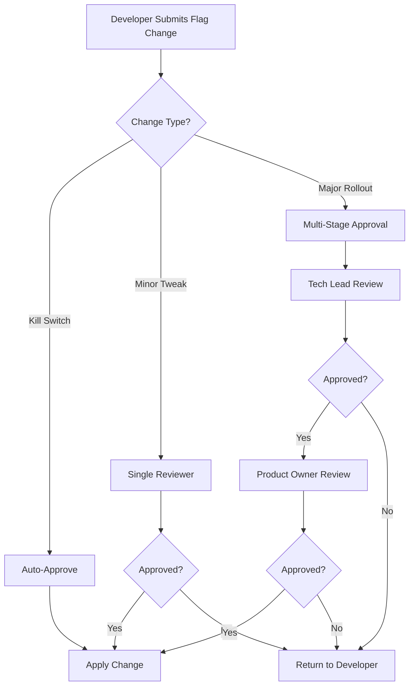
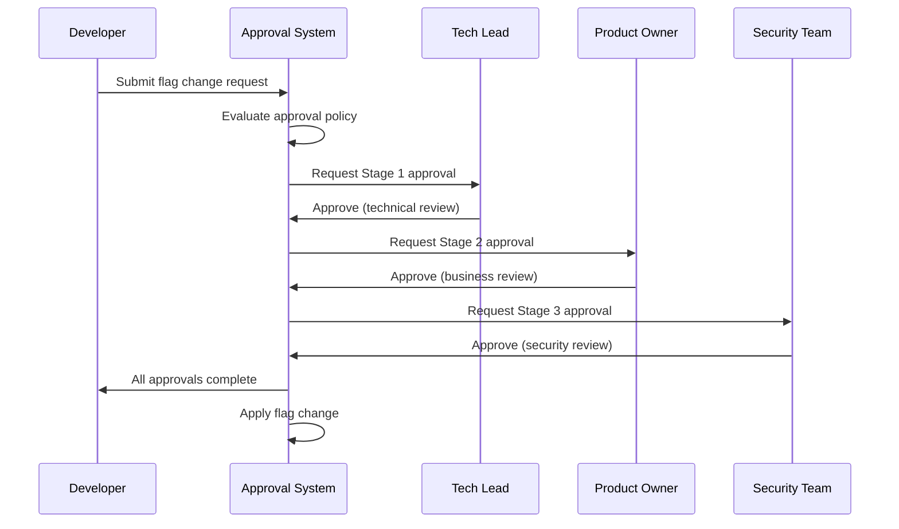
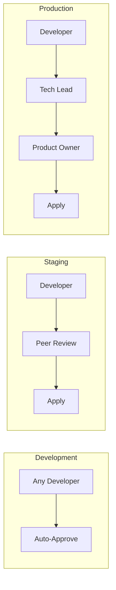
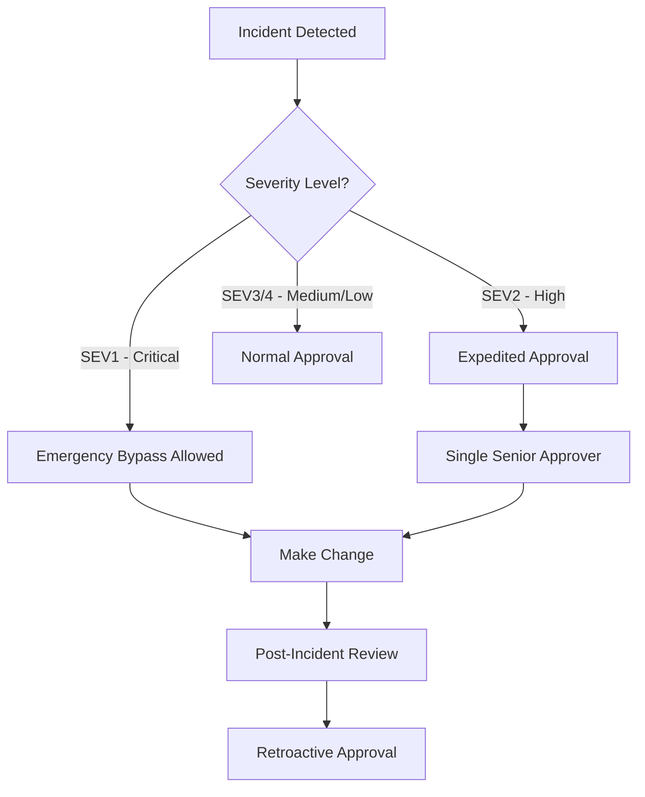
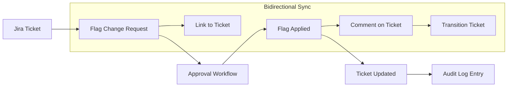
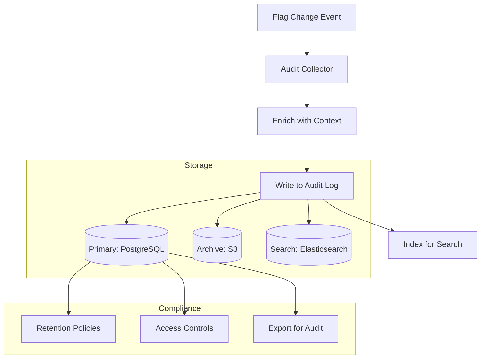
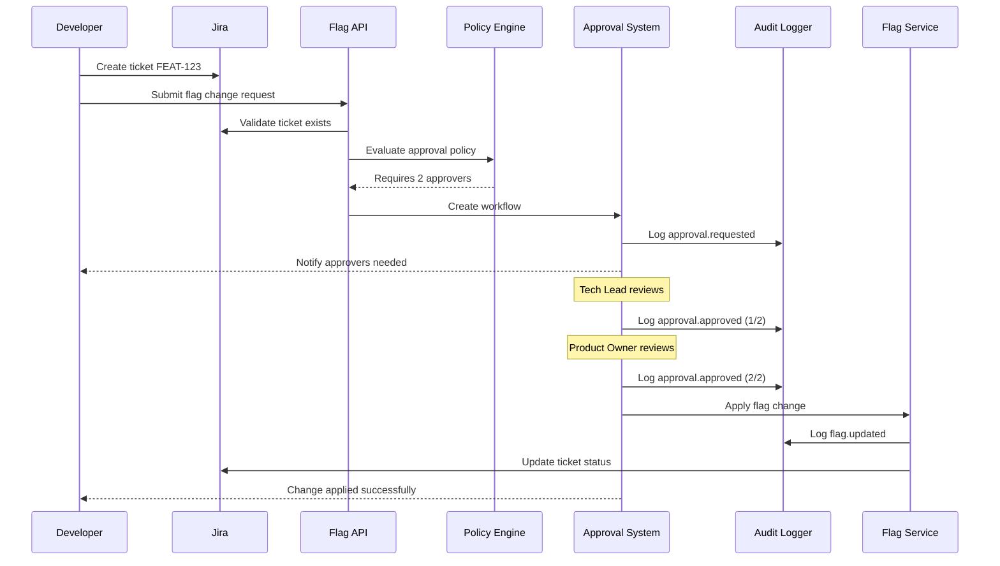

# How to Implement Flag Approval Workflows

Author: [nawazdhandala](https://github.com/nawazdhandala)

Tags: Feature Flags, Workflows, Approval, Governance

Description: Learn how to implement approval workflows for feature flag changes.

---

Feature flags give teams the power to toggle functionality without deploying code. But with great power comes the need for governance. When a single flag change can affect millions of users, you need approval workflows to prevent accidental outages and ensure compliance.

## 1. Approval Process Design

A well-designed approval process balances speed with safety. The goal is to catch mistakes before they reach production while not slowing down legitimate changes.



The key principle: **match approval rigor to risk level**. Not every change needs a committee.

### Defining Approval Policies

Create a policy configuration that categorizes flag changes by risk:

`approval-policies.yaml`

This configuration defines which changes require approval and who can approve them. High-risk changes affecting production require multiple approvers, while low-risk changes in development environments can be auto-approved.

```yaml
apiVersion: featureflags/v1
kind: ApprovalPolicy
metadata:
  name: standard-approval-policy
spec:
  rules:
    - name: kill-switch-bypass
      description: Emergency kill switches skip approval
      conditions:
        - field: flag.tags
          operator: contains
          value: kill-switch
      approval:
        required: false

    - name: production-changes
      description: Production changes need tech lead approval
      conditions:
        - field: environment
          operator: equals
          value: production
      approval:
        required: true
        minApprovers: 2
        approverRoles:
          - tech-lead
          - product-owner

    - name: staging-changes
      description: Staging changes need single approval
      conditions:
        - field: environment
          operator: equals
          value: staging
      approval:
        required: true
        minApprovers: 1
        approverRoles:
          - developer
          - tech-lead

    - name: development-auto-approve
      description: Dev environment changes auto-approve
      conditions:
        - field: environment
          operator: equals
          value: development
      approval:
        required: false
```

### Implementing the Approval Engine

Here's a TypeScript implementation of an approval engine that evaluates policies:

`src/approval/engine.ts`

This approval engine evaluates flag change requests against configured policies. It determines which approval rules apply and calculates the required approvers based on the change context.

```typescript
interface FlagChangeRequest {
  flagKey: string;
  environment: string;
  previousValue: any;
  newValue: any;
  requestedBy: string;
  tags: string[];
  metadata: Record<string, any>;
}

interface ApprovalRule {
  name: string;
  conditions: Condition[];
  approval: {
    required: boolean;
    minApprovers?: number;
    approverRoles?: string[];
  };
}

interface ApprovalResult {
  requiresApproval: boolean;
  matchedRule: string;
  requiredApprovers: number;
  allowedRoles: string[];
}

class ApprovalEngine {
  private rules: ApprovalRule[];

  constructor(rules: ApprovalRule[]) {
    // Rules are evaluated in order - first match wins
    this.rules = rules;
  }

  evaluate(request: FlagChangeRequest): ApprovalResult {
    for (const rule of this.rules) {
      if (this.matchesConditions(request, rule.conditions)) {
        return {
          requiresApproval: rule.approval.required,
          matchedRule: rule.name,
          requiredApprovers: rule.approval.minApprovers ?? 0,
          allowedRoles: rule.approval.approverRoles ?? [],
        };
      }
    }

    // Default: require approval if no rules match
    return {
      requiresApproval: true,
      matchedRule: 'default',
      requiredApprovers: 1,
      allowedRoles: ['admin'],
    };
  }

  private matchesConditions(
    request: FlagChangeRequest,
    conditions: Condition[]
  ): boolean {
    return conditions.every((condition) => {
      const value = this.getFieldValue(request, condition.field);
      return this.evaluateCondition(value, condition.operator, condition.value);
    });
  }

  private getFieldValue(request: FlagChangeRequest, field: string): any {
    const parts = field.split('.');
    let value: any = request;
    for (const part of parts) {
      value = value?.[part];
    }
    return value;
  }

  private evaluateCondition(
    actual: any,
    operator: string,
    expected: any
  ): boolean {
    switch (operator) {
      case 'equals':
        return actual === expected;
      case 'contains':
        return Array.isArray(actual) && actual.includes(expected);
      case 'greaterThan':
        return actual > expected;
      case 'regex':
        return new RegExp(expected).test(actual);
      default:
        return false;
    }
  }
}
```

## 2. Multi-Stage Approvals

For high-risk changes, a single approval is not enough. Multi-stage approvals ensure multiple perspectives review the change before it goes live.



### Stage Configuration

`src/approval/stages.ts`

This configuration defines the approval stages, their order, and timeout behavior. Each stage can have different approver requirements and SLAs.

```typescript
interface ApprovalStage {
  name: string;
  order: number;
  requiredApprovers: number;
  approverRoles: string[];
  timeoutHours: number;
  onTimeout: 'escalate' | 'reject' | 'auto-approve';
  escalateTo?: string[];
}

const multiStageConfig: ApprovalStage[] = [
  {
    name: 'technical-review',
    order: 1,
    requiredApprovers: 1,
    approverRoles: ['tech-lead', 'senior-engineer'],
    timeoutHours: 24,
    onTimeout: 'escalate',
    escalateTo: ['engineering-manager'],
  },
  {
    name: 'business-review',
    order: 2,
    requiredApprovers: 1,
    approverRoles: ['product-owner', 'product-manager'],
    timeoutHours: 48,
    onTimeout: 'escalate',
    escalateTo: ['director-product'],
  },
  {
    name: 'security-review',
    order: 3,
    requiredApprovers: 1,
    approverRoles: ['security-engineer'],
    timeoutHours: 72,
    onTimeout: 'reject',
  },
];
```

### Multi-Stage Workflow Manager

`src/approval/workflow-manager.ts`

The workflow manager tracks approval state across stages and handles transitions. It notifies approvers when their stage becomes active and manages timeouts.

```typescript
interface ApprovalWorkflow {
  id: string;
  changeRequest: FlagChangeRequest;
  stages: ApprovalStage[];
  currentStageIndex: number;
  stageApprovals: Map<string, StageApproval>;
  status: 'pending' | 'approved' | 'rejected' | 'expired';
  createdAt: Date;
  updatedAt: Date;
}

interface StageApproval {
  stageName: string;
  approvals: Approval[];
  status: 'pending' | 'approved' | 'rejected';
  startedAt: Date;
  completedAt?: Date;
}

interface Approval {
  approver: string;
  role: string;
  decision: 'approve' | 'reject';
  comment?: string;
  timestamp: Date;
}

class WorkflowManager {
  private workflows: Map<string, ApprovalWorkflow> = new Map();
  private notificationService: NotificationService;

  async createWorkflow(
    request: FlagChangeRequest,
    stages: ApprovalStage[]
  ): Promise<ApprovalWorkflow> {
    const workflow: ApprovalWorkflow = {
      id: crypto.randomUUID(),
      changeRequest: request,
      stages: stages.sort((a, b) => a.order - b.order),
      currentStageIndex: 0,
      stageApprovals: new Map(),
      status: 'pending',
      createdAt: new Date(),
      updatedAt: new Date(),
    };

    // Initialize first stage
    await this.initializeStage(workflow, 0);
    this.workflows.set(workflow.id, workflow);

    return workflow;
  }

  async submitApproval(
    workflowId: string,
    approver: string,
    role: string,
    decision: 'approve' | 'reject',
    comment?: string
  ): Promise<ApprovalWorkflow> {
    const workflow = this.workflows.get(workflowId);
    if (!workflow) throw new Error('Workflow not found');

    const currentStage = workflow.stages[workflow.currentStageIndex];
    const stageApproval = workflow.stageApprovals.get(currentStage.name);

    // Validate approver has correct role
    if (!currentStage.approverRoles.includes(role)) {
      throw new Error(`Role ${role} cannot approve stage ${currentStage.name}`);
    }

    // Record the approval
    stageApproval.approvals.push({
      approver,
      role,
      decision,
      comment,
      timestamp: new Date(),
    });

    // Check if stage is complete
    if (decision === 'reject') {
      stageApproval.status = 'rejected';
      workflow.status = 'rejected';
      await this.notifyRejection(workflow, currentStage.name, comment);
    } else if (
      stageApproval.approvals.filter((a) => a.decision === 'approve').length >=
      currentStage.requiredApprovers
    ) {
      stageApproval.status = 'approved';
      stageApproval.completedAt = new Date();

      // Move to next stage or complete
      if (workflow.currentStageIndex < workflow.stages.length - 1) {
        workflow.currentStageIndex++;
        await this.initializeStage(workflow, workflow.currentStageIndex);
      } else {
        workflow.status = 'approved';
        await this.applyFlagChange(workflow.changeRequest);
      }
    }

    workflow.updatedAt = new Date();
    return workflow;
  }

  private async initializeStage(
    workflow: ApprovalWorkflow,
    stageIndex: number
  ): Promise<void> {
    const stage = workflow.stages[stageIndex];
    workflow.stageApprovals.set(stage.name, {
      stageName: stage.name,
      approvals: [],
      status: 'pending',
      startedAt: new Date(),
    });

    // Notify approvers
    await this.notificationService.notifyApprovers(
      stage.approverRoles,
      workflow.changeRequest,
      stage.name
    );

    // Schedule timeout check
    this.scheduleTimeoutCheck(workflow.id, stage);
  }

  private scheduleTimeoutCheck(
    workflowId: string,
    stage: ApprovalStage
  ): void {
    setTimeout(
      async () => {
        const workflow = this.workflows.get(workflowId);
        if (!workflow) return;

        const stageApproval = workflow.stageApprovals.get(stage.name);
        if (stageApproval?.status !== 'pending') return;

        switch (stage.onTimeout) {
          case 'escalate':
            await this.notificationService.notifyApprovers(
              stage.escalateTo ?? [],
              workflow.changeRequest,
              stage.name,
              true // isEscalation
            );
            break;
          case 'reject':
            workflow.status = 'expired';
            await this.notifyRejection(workflow, stage.name, 'Approval timeout');
            break;
          case 'auto-approve':
            await this.submitApproval(
              workflowId,
              'system',
              'auto-approve',
              'approve',
              'Auto-approved due to timeout'
            );
            break;
        }
      },
      stage.timeoutHours * 60 * 60 * 1000
    );
  }

  private async applyFlagChange(request: FlagChangeRequest): Promise<void> {
    // Implementation to apply the flag change
    console.log(`Applying flag change: ${request.flagKey}`);
  }

  private async notifyRejection(
    workflow: ApprovalWorkflow,
    stageName: string,
    reason?: string
  ): Promise<void> {
    await this.notificationService.notifyRequester(
      workflow.changeRequest.requestedBy,
      `Flag change rejected at ${stageName}: ${reason}`
    );
  }
}
```

## 3. Environment-Specific Approvals

Different environments have different risk profiles. A change to a development environment flag should not require the same scrutiny as a production change.



### Environment-Aware Policy Engine

`src/approval/environment-policy.ts`

This policy engine adjusts approval requirements based on the target environment. It considers factors like user impact, rollback complexity, and compliance requirements.

```typescript
interface EnvironmentConfig {
  name: string;
  riskLevel: 'low' | 'medium' | 'high' | 'critical';
  userImpact: number; // Estimated users affected
  requiresApproval: boolean;
  minApprovers: number;
  approverRoles: string[];
  additionalChecks: string[];
}

const environmentConfigs: Map<string, EnvironmentConfig> = new Map([
  [
    'development',
    {
      name: 'development',
      riskLevel: 'low',
      userImpact: 10,
      requiresApproval: false,
      minApprovers: 0,
      approverRoles: [],
      additionalChecks: [],
    },
  ],
  [
    'staging',
    {
      name: 'staging',
      riskLevel: 'medium',
      userImpact: 100,
      requiresApproval: true,
      minApprovers: 1,
      approverRoles: ['developer', 'tech-lead'],
      additionalChecks: ['integration-tests-pass'],
    },
  ],
  [
    'production',
    {
      name: 'production',
      riskLevel: 'critical',
      userImpact: 1000000,
      requiresApproval: true,
      minApprovers: 2,
      approverRoles: ['tech-lead', 'product-owner'],
      additionalChecks: [
        'integration-tests-pass',
        'load-tests-pass',
        'security-scan-pass',
        'staging-soak-24h',
      ],
    },
  ],
]);

class EnvironmentPolicyEngine {
  async evaluateChange(
    request: FlagChangeRequest
  ): Promise<{
    allowed: boolean;
    requirements: EnvironmentConfig;
    failedChecks: string[];
  }> {
    const config = environmentConfigs.get(request.environment);
    if (!config) {
      throw new Error(`Unknown environment: ${request.environment}`);
    }

    const failedChecks: string[] = [];

    // Run additional checks
    for (const check of config.additionalChecks) {
      const passed = await this.runCheck(check, request);
      if (!passed) {
        failedChecks.push(check);
      }
    }

    return {
      allowed: failedChecks.length === 0,
      requirements: config,
      failedChecks,
    };
  }

  private async runCheck(
    checkName: string,
    request: FlagChangeRequest
  ): Promise<boolean> {
    switch (checkName) {
      case 'integration-tests-pass':
        return this.checkIntegrationTests(request);
      case 'load-tests-pass':
        return this.checkLoadTests(request);
      case 'security-scan-pass':
        return this.checkSecurityScan(request);
      case 'staging-soak-24h':
        return this.checkStagingSoak(request);
      default:
        console.warn(`Unknown check: ${checkName}`);
        return true;
    }
  }

  private async checkIntegrationTests(
    request: FlagChangeRequest
  ): Promise<boolean> {
    // Verify integration tests passed with the new flag value
    const testResults = await fetch(
      `https://ci.example.com/api/tests?flag=${request.flagKey}`
    );
    const data = await testResults.json();
    return data.status === 'passed';
  }

  private async checkLoadTests(request: FlagChangeRequest): Promise<boolean> {
    // Verify load tests show acceptable performance
    const loadResults = await fetch(
      `https://ci.example.com/api/load-tests?flag=${request.flagKey}`
    );
    const data = await loadResults.json();
    return data.p99Latency < 500 && data.errorRate < 0.01;
  }

  private async checkSecurityScan(
    request: FlagChangeRequest
  ): Promise<boolean> {
    // Verify no security vulnerabilities introduced
    const scanResults = await fetch(
      `https://security.example.com/api/scan?flag=${request.flagKey}`
    );
    const data = await scanResults.json();
    return data.criticalIssues === 0 && data.highIssues === 0;
  }

  private async checkStagingSoak(request: FlagChangeRequest): Promise<boolean> {
    // Verify flag has been enabled in staging for 24 hours
    const flagHistory = await fetch(
      `https://flags.example.com/api/history?flag=${request.flagKey}&env=staging`
    );
    const data = await flagHistory.json();
    const stagingEnabledAt = new Date(data.enabledAt);
    const hoursSinceEnabled =
      (Date.now() - stagingEnabledAt.getTime()) / (1000 * 60 * 60);
    return hoursSinceEnabled >= 24;
  }
}
```

### Progressive Rollout with Environment Gates

`src/approval/progressive-rollout.ts`

This system enforces progressive rollouts through environments. A flag must successfully pass through lower environments before it can be enabled in higher ones.

```typescript
interface EnvironmentGate {
  sourceEnv: string;
  targetEnv: string;
  requirements: {
    minSoakTimeHours: number;
    maxErrorRate: number;
    minSuccessRate: number;
    requiredApprovals: number;
  };
}

const environmentGates: EnvironmentGate[] = [
  {
    sourceEnv: 'development',
    targetEnv: 'staging',
    requirements: {
      minSoakTimeHours: 1,
      maxErrorRate: 0.05,
      minSuccessRate: 0.95,
      requiredApprovals: 0,
    },
  },
  {
    sourceEnv: 'staging',
    targetEnv: 'production',
    requirements: {
      minSoakTimeHours: 24,
      maxErrorRate: 0.01,
      minSuccessRate: 0.99,
      requiredApprovals: 2,
    },
  },
];

class ProgressiveRolloutManager {
  async canPromote(
    flagKey: string,
    sourceEnv: string,
    targetEnv: string
  ): Promise<{
    allowed: boolean;
    blockers: string[];
  }> {
    const gate = environmentGates.find(
      (g) => g.sourceEnv === sourceEnv && g.targetEnv === targetEnv
    );

    if (!gate) {
      return {
        allowed: false,
        blockers: [`No promotion path from ${sourceEnv} to ${targetEnv}`],
      };
    }

    const blockers: string[] = [];
    const metrics = await this.getFlagMetrics(flagKey, sourceEnv);

    // Check soak time
    if (metrics.hoursEnabled < gate.requirements.minSoakTimeHours) {
      blockers.push(
        `Insufficient soak time: ${metrics.hoursEnabled}h < ${gate.requirements.minSoakTimeHours}h required`
      );
    }

    // Check error rate
    if (metrics.errorRate > gate.requirements.maxErrorRate) {
      blockers.push(
        `Error rate too high: ${(metrics.errorRate * 100).toFixed(2)}% > ${gate.requirements.maxErrorRate * 100}% allowed`
      );
    }

    // Check success rate
    if (metrics.successRate < gate.requirements.minSuccessRate) {
      blockers.push(
        `Success rate too low: ${(metrics.successRate * 100).toFixed(2)}% < ${gate.requirements.minSuccessRate * 100}% required`
      );
    }

    return {
      allowed: blockers.length === 0,
      blockers,
    };
  }

  private async getFlagMetrics(
    flagKey: string,
    environment: string
  ): Promise<{
    hoursEnabled: number;
    errorRate: number;
    successRate: number;
  }> {
    // Fetch metrics from observability platform
    const response = await fetch(
      `https://metrics.example.com/api/flags/${flagKey}?env=${environment}`
    );
    return response.json();
  }
}
```

## 4. Emergency Bypass Procedures

Sometimes you need to make changes immediately, bypassing normal approval workflows. Emergency bypass procedures let you act fast while maintaining accountability.



### Emergency Bypass System

`src/approval/emergency-bypass.ts`

The emergency bypass system allows critical changes to skip normal approval while ensuring full accountability. All bypasses require documented justification and trigger post-incident review.

```typescript
interface EmergencyBypassRequest {
  id: string;
  flagKey: string;
  environment: string;
  previousValue: any;
  newValue: any;
  requestedBy: string;
  incidentId: string;
  severity: 'SEV1' | 'SEV2' | 'SEV3' | 'SEV4';
  justification: string;
  timestamp: Date;
}

interface BypassAuditRecord {
  bypassRequest: EmergencyBypassRequest;
  applied: boolean;
  appliedAt?: Date;
  appliedBy?: string;
  retroactiveApproval?: {
    approvedBy: string;
    approvedAt: Date;
    comment: string;
  };
  postIncidentReview?: {
    reviewedBy: string;
    reviewedAt: Date;
    findings: string;
    actionItems: string[];
  };
}

class EmergencyBypassManager {
  private auditLog: BypassAuditRecord[] = [];
  private allowedBypassRoles = ['incident-commander', 'on-call-engineer', 'sre'];

  async requestEmergencyBypass(
    request: Omit<EmergencyBypassRequest, 'id' | 'timestamp'>
  ): Promise<{
    approved: boolean;
    bypassId: string;
    reason?: string;
  }> {
    const bypassRequest: EmergencyBypassRequest = {
      ...request,
      id: crypto.randomUUID(),
      timestamp: new Date(),
    };

    // Validate severity justifies bypass
    if (!['SEV1', 'SEV2'].includes(request.severity)) {
      return {
        approved: false,
        bypassId: bypassRequest.id,
        reason: 'Emergency bypass only allowed for SEV1 and SEV2 incidents',
      };
    }

    // Validate requester has bypass privileges
    const requesterRoles = await this.getUserRoles(request.requestedBy);
    const hasPermission = requesterRoles.some((role) =>
      this.allowedBypassRoles.includes(role)
    );

    if (!hasPermission) {
      return {
        approved: false,
        bypassId: bypassRequest.id,
        reason: 'User does not have emergency bypass privileges',
      };
    }

    // Validate incident exists and is active
    const incident = await this.getIncident(request.incidentId);
    if (!incident || incident.status === 'resolved') {
      return {
        approved: false,
        bypassId: bypassRequest.id,
        reason: 'No active incident found with provided ID',
      };
    }

    // Create audit record
    this.auditLog.push({
      bypassRequest,
      applied: false,
    });

    // Send notifications
    await this.notifyBypassInitiated(bypassRequest);

    return {
      approved: true,
      bypassId: bypassRequest.id,
    };
  }

  async applyEmergencyChange(
    bypassId: string,
    appliedBy: string
  ): Promise<void> {
    const record = this.auditLog.find((r) => r.bypassRequest.id === bypassId);
    if (!record) throw new Error('Bypass request not found');

    // Apply the flag change immediately
    await this.applyFlagChange(
      record.bypassRequest.flagKey,
      record.bypassRequest.environment,
      record.bypassRequest.newValue
    );

    // Update audit record
    record.applied = true;
    record.appliedAt = new Date();
    record.appliedBy = appliedBy;

    // Schedule post-incident review reminder
    this.schedulePostIncidentReview(bypassId);

    // Alert relevant stakeholders
    await this.notifyBypassApplied(record);
  }

  async submitRetroactiveApproval(
    bypassId: string,
    approver: string,
    comment: string
  ): Promise<void> {
    const record = this.auditLog.find((r) => r.bypassRequest.id === bypassId);
    if (!record) throw new Error('Bypass request not found');

    record.retroactiveApproval = {
      approvedBy: approver,
      approvedAt: new Date(),
      comment,
    };
  }

  async submitPostIncidentReview(
    bypassId: string,
    reviewedBy: string,
    findings: string,
    actionItems: string[]
  ): Promise<void> {
    const record = this.auditLog.find((r) => r.bypassRequest.id === bypassId);
    if (!record) throw new Error('Bypass request not found');

    record.postIncidentReview = {
      reviewedBy,
      reviewedAt: new Date(),
      findings,
      actionItems,
    };

    // Create tickets for action items
    for (const item of actionItems) {
      await this.createActionItemTicket(bypassId, item);
    }
  }

  private schedulePostIncidentReview(bypassId: string): void {
    // Remind after 48 hours if review not submitted
    setTimeout(
      async () => {
        const record = this.auditLog.find((r) => r.bypassRequest.id === bypassId);
        if (record && !record.postIncidentReview) {
          await this.sendReviewReminder(bypassId);
        }
      },
      48 * 60 * 60 * 1000
    );
  }

  private async notifyBypassInitiated(
    request: EmergencyBypassRequest
  ): Promise<void> {
    // Send to incident channel and relevant stakeholders
    console.log(`Emergency bypass initiated: ${request.id}`);
  }

  private async notifyBypassApplied(record: BypassAuditRecord): Promise<void> {
    console.log(`Emergency bypass applied: ${record.bypassRequest.id}`);
  }

  private async applyFlagChange(
    flagKey: string,
    environment: string,
    value: any
  ): Promise<void> {
    console.log(`Applying ${flagKey}=${value} to ${environment}`);
  }

  private async getUserRoles(userId: string): Promise<string[]> {
    // Fetch user roles from identity provider
    return ['on-call-engineer'];
  }

  private async getIncident(
    incidentId: string
  ): Promise<{ status: string } | null> {
    // Fetch incident from incident management system
    return { status: 'active' };
  }

  private async sendReviewReminder(bypassId: string): Promise<void> {
    console.log(`Reminder: Post-incident review needed for bypass ${bypassId}`);
  }

  private async createActionItemTicket(
    bypassId: string,
    actionItem: string
  ): Promise<void> {
    console.log(`Creating ticket for action item: ${actionItem}`);
  }
}
```

## 5. Integration with Ticketing Systems

Linking flag changes to tickets creates traceability and context. Every change should reference why it was made and what problem it solves.



### Jira Integration

`src/integrations/jira.ts`

This integration ensures every flag change is linked to a Jira ticket. It validates tickets exist, syncs approval status, and updates tickets when flags are changed.

```typescript
interface JiraTicket {
  key: string;
  summary: string;
  status: string;
  assignee: string;
  labels: string[];
  customFields: {
    featureFlag?: string;
    targetEnvironment?: string;
    rolloutPercentage?: number;
  };
}

interface JiraIntegrationConfig {
  baseUrl: string;
  apiToken: string;
  projectKey: string;
  requiredFields: string[];
  allowedStatuses: string[];
}

class JiraIntegration {
  private config: JiraIntegrationConfig;

  constructor(config: JiraIntegrationConfig) {
    this.config = config;
  }

  async validateTicketForFlagChange(
    ticketKey: string,
    flagKey: string
  ): Promise<{
    valid: boolean;
    errors: string[];
  }> {
    const errors: string[] = [];

    try {
      const ticket = await this.getTicket(ticketKey);

      // Check ticket exists
      if (!ticket) {
        return { valid: false, errors: ['Ticket not found'] };
      }

      // Check ticket status allows changes
      if (!this.config.allowedStatuses.includes(ticket.status)) {
        errors.push(
          `Ticket status '${ticket.status}' does not allow flag changes. Allowed: ${this.config.allowedStatuses.join(', ')}`
        );
      }

      // Check required fields are populated
      for (const field of this.config.requiredFields) {
        if (!ticket.customFields[field]) {
          errors.push(`Required field '${field}' is empty`);
        }
      }

      // Check flag key matches if specified
      if (ticket.customFields.featureFlag &&
          ticket.customFields.featureFlag !== flagKey) {
        errors.push(
          `Ticket flag '${ticket.customFields.featureFlag}' does not match requested flag '${flagKey}'`
        );
      }

      return { valid: errors.length === 0, errors };
    } catch (error) {
      return { valid: false, errors: [`Failed to validate ticket: ${error}`] };
    }
  }

  async linkFlagChangeToTicket(
    ticketKey: string,
    changeRequest: FlagChangeRequest,
    approvalWorkflowId: string
  ): Promise<void> {
    // Add comment with flag change details
    await this.addComment(
      ticketKey,
      `Feature flag change requested:

**Flag:** \`${changeRequest.flagKey}\`
**Environment:** ${changeRequest.environment}
**Previous Value:** \`${JSON.stringify(changeRequest.previousValue)}\`
**New Value:** \`${JSON.stringify(changeRequest.newValue)}\`
**Requested By:** ${changeRequest.requestedBy}
**Approval Workflow:** [View](https://flags.example.com/approvals/${approvalWorkflowId})`
    );

    // Add label for tracking
    await this.addLabel(ticketKey, 'flag-change-pending');

    // Update custom field
    await this.updateCustomField(ticketKey, 'featureFlag', changeRequest.flagKey);
  }

  async updateTicketOnApproval(
    ticketKey: string,
    approved: boolean,
    approvers: string[],
    comment?: string
  ): Promise<void> {
    const status = approved ? 'APPROVED' : 'REJECTED';
    const approverList = approvers.join(', ');

    await this.addComment(
      ticketKey,
      `Flag change ${status}

**Approvers:** ${approverList}
${comment ? `**Comment:** ${comment}` : ''}`
    );

    // Update labels
    await this.removeLabel(ticketKey, 'flag-change-pending');
    await this.addLabel(
      ticketKey,
      approved ? 'flag-change-approved' : 'flag-change-rejected'
    );

    // Transition ticket if approved
    if (approved) {
      await this.transitionTicket(ticketKey, 'In Progress');
    }
  }

  async updateTicketOnFlagApplied(
    ticketKey: string,
    flagKey: string,
    environment: string,
    value: any
  ): Promise<void> {
    await this.addComment(
      ticketKey,
      `Feature flag applied successfully:

**Flag:** \`${flagKey}\`
**Environment:** ${environment}
**Value:** \`${JSON.stringify(value)}\`
**Applied At:** ${new Date().toISOString()}`
    );

    // Update custom fields
    await this.updateCustomField(ticketKey, 'targetEnvironment', environment);

    // If this was a percentage rollout, track it
    if (typeof value === 'object' && value.percentage !== undefined) {
      await this.updateCustomField(ticketKey, 'rolloutPercentage', value.percentage);
    }
  }

  private async getTicket(ticketKey: string): Promise<JiraTicket | null> {
    const response = await fetch(
      `${this.config.baseUrl}/rest/api/3/issue/${ticketKey}`,
      {
        headers: {
          Authorization: `Basic ${this.config.apiToken}`,
          'Content-Type': 'application/json',
        },
      }
    );

    if (!response.ok) return null;
    return response.json();
  }

  private async addComment(ticketKey: string, body: string): Promise<void> {
    await fetch(
      `${this.config.baseUrl}/rest/api/3/issue/${ticketKey}/comment`,
      {
        method: 'POST',
        headers: {
          Authorization: `Basic ${this.config.apiToken}`,
          'Content-Type': 'application/json',
        },
        body: JSON.stringify({
          body: {
            type: 'doc',
            version: 1,
            content: [
              {
                type: 'paragraph',
                content: [{ type: 'text', text: body }],
              },
            ],
          },
        }),
      }
    );
  }

  private async addLabel(ticketKey: string, label: string): Promise<void> {
    await fetch(`${this.config.baseUrl}/rest/api/3/issue/${ticketKey}`, {
      method: 'PUT',
      headers: {
        Authorization: `Basic ${this.config.apiToken}`,
        'Content-Type': 'application/json',
      },
      body: JSON.stringify({
        update: {
          labels: [{ add: label }],
        },
      }),
    });
  }

  private async removeLabel(ticketKey: string, label: string): Promise<void> {
    await fetch(`${this.config.baseUrl}/rest/api/3/issue/${ticketKey}`, {
      method: 'PUT',
      headers: {
        Authorization: `Basic ${this.config.apiToken}`,
        'Content-Type': 'application/json',
      },
      body: JSON.stringify({
        update: {
          labels: [{ remove: label }],
        },
      }),
    });
  }

  private async updateCustomField(
    ticketKey: string,
    fieldName: string,
    value: any
  ): Promise<void> {
    await fetch(`${this.config.baseUrl}/rest/api/3/issue/${ticketKey}`, {
      method: 'PUT',
      headers: {
        Authorization: `Basic ${this.config.apiToken}`,
        'Content-Type': 'application/json',
      },
      body: JSON.stringify({
        fields: {
          [fieldName]: value,
        },
      }),
    });
  }

  private async transitionTicket(
    ticketKey: string,
    targetStatus: string
  ): Promise<void> {
    // Get available transitions
    const transitionsResponse = await fetch(
      `${this.config.baseUrl}/rest/api/3/issue/${ticketKey}/transitions`,
      {
        headers: {
          Authorization: `Basic ${this.config.apiToken}`,
        },
      }
    );
    const { transitions } = await transitionsResponse.json();

    const transition = transitions.find(
      (t: any) => t.name === targetStatus || t.to.name === targetStatus
    );

    if (transition) {
      await fetch(
        `${this.config.baseUrl}/rest/api/3/issue/${ticketKey}/transitions`,
        {
          method: 'POST',
          headers: {
            Authorization: `Basic ${this.config.apiToken}`,
            'Content-Type': 'application/json',
          },
          body: JSON.stringify({
            transition: { id: transition.id },
          }),
        }
      );
    }
  }
}
```

## 6. Audit Trail Integration

Every flag change must be recorded for compliance, debugging, and accountability. A comprehensive audit trail captures who, what, when, why, and the outcome.



### Comprehensive Audit Logger

`src/audit/logger.ts`

The audit logger captures all flag-related events with full context. It supports compliance requirements like SOC2 and GDPR with configurable retention and access controls.

```typescript
interface AuditEvent {
  id: string;
  timestamp: Date;
  eventType: AuditEventType;
  actor: {
    userId: string;
    email: string;
    roles: string[];
    ipAddress: string;
    userAgent: string;
  };
  resource: {
    type: 'flag' | 'approval' | 'policy';
    id: string;
    name: string;
    environment: string;
  };
  action: {
    type: string;
    previousState: any;
    newState: any;
    metadata: Record<string, any>;
  };
  context: {
    requestId: string;
    sessionId: string;
    ticketId?: string;
    incidentId?: string;
    approvalWorkflowId?: string;
  };
  outcome: {
    success: boolean;
    errorCode?: string;
    errorMessage?: string;
  };
}

type AuditEventType =
  | 'flag.created'
  | 'flag.updated'
  | 'flag.deleted'
  | 'flag.toggled'
  | 'approval.requested'
  | 'approval.approved'
  | 'approval.rejected'
  | 'approval.bypassed'
  | 'policy.created'
  | 'policy.updated'
  | 'access.granted'
  | 'access.revoked';

interface AuditLoggerConfig {
  primaryStorage: 'postgresql' | 'dynamodb';
  archiveStorage: 's3' | 'gcs';
  searchIndex: 'elasticsearch' | 'opensearch';
  retentionDays: number;
  archiveAfterDays: number;
}

class AuditLogger {
  private config: AuditLoggerConfig;
  private primaryDb: PrimaryStorage;
  private archiveStorage: ArchiveStorage;
  private searchIndex: SearchIndex;

  constructor(config: AuditLoggerConfig) {
    this.config = config;
    this.primaryDb = this.initPrimaryStorage(config.primaryStorage);
    this.archiveStorage = this.initArchiveStorage(config.archiveStorage);
    this.searchIndex = this.initSearchIndex(config.searchIndex);
  }

  async log(event: Omit<AuditEvent, 'id' | 'timestamp'>): Promise<string> {
    const fullEvent: AuditEvent = {
      ...event,
      id: crypto.randomUUID(),
      timestamp: new Date(),
    };

    // Write to primary storage (synchronous for durability)
    await this.primaryDb.write(fullEvent);

    // Index for search (async, non-blocking)
    this.searchIndex.index(fullEvent).catch((err) => {
      console.error('Failed to index audit event:', err);
    });

    // Check if compliance alerts needed
    await this.checkComplianceAlerts(fullEvent);

    return fullEvent.id;
  }

  async query(filters: {
    startDate?: Date;
    endDate?: Date;
    eventTypes?: AuditEventType[];
    actorId?: string;
    resourceId?: string;
    environment?: string;
    ticketId?: string;
  }): Promise<AuditEvent[]> {
    // Use search index for complex queries
    return this.searchIndex.search(filters);
  }

  async getEventById(eventId: string): Promise<AuditEvent | null> {
    // Try primary storage first
    let event = await this.primaryDb.getById(eventId);

    // Fall back to archive if not found (older events)
    if (!event) {
      event = await this.archiveStorage.getById(eventId);
    }

    return event;
  }

  async exportForCompliance(
    startDate: Date,
    endDate: Date,
    format: 'json' | 'csv'
  ): Promise<string> {
    const events = await this.query({ startDate, endDate });

    if (format === 'csv') {
      return this.convertToCsv(events);
    }

    return JSON.stringify(events, null, 2);
  }

  async archiveOldEvents(): Promise<number> {
    const cutoffDate = new Date();
    cutoffDate.setDate(cutoffDate.getDate() - this.config.archiveAfterDays);

    const eventsToArchive = await this.primaryDb.getOlderThan(cutoffDate);

    for (const event of eventsToArchive) {
      await this.archiveStorage.write(event);
      await this.primaryDb.delete(event.id);
    }

    return eventsToArchive.length;
  }

  async purgeExpiredEvents(): Promise<number> {
    const cutoffDate = new Date();
    cutoffDate.setDate(cutoffDate.getDate() - this.config.retentionDays);

    return this.archiveStorage.deleteOlderThan(cutoffDate);
  }

  private async checkComplianceAlerts(event: AuditEvent): Promise<void> {
    // Alert on emergency bypasses
    if (event.eventType === 'approval.bypassed') {
      await this.sendComplianceAlert(
        'Emergency Bypass Used',
        `User ${event.actor.email} bypassed approval for ${event.resource.name}`,
        event
      );
    }

    // Alert on production changes
    if (
      event.resource.environment === 'production' &&
      ['flag.updated', 'flag.toggled'].includes(event.eventType)
    ) {
      await this.sendComplianceAlert(
        'Production Flag Change',
        `Flag ${event.resource.name} was modified in production`,
        event
      );
    }

    // Alert on access changes
    if (['access.granted', 'access.revoked'].includes(event.eventType)) {
      await this.sendComplianceAlert(
        'Access Change',
        `Access ${event.eventType.split('.')[1]} for ${event.resource.name}`,
        event
      );
    }
  }

  private async sendComplianceAlert(
    title: string,
    message: string,
    event: AuditEvent
  ): Promise<void> {
    // Send to compliance team Slack channel
    console.log(`[COMPLIANCE ALERT] ${title}: ${message}`);
  }

  private convertToCsv(events: AuditEvent[]): string {
    const headers = [
      'id',
      'timestamp',
      'eventType',
      'actorEmail',
      'resourceName',
      'environment',
      'action',
      'success',
    ];

    const rows = events.map((e) => [
      e.id,
      e.timestamp.toISOString(),
      e.eventType,
      e.actor.email,
      e.resource.name,
      e.resource.environment,
      e.action.type,
      e.outcome.success,
    ]);

    return [headers.join(','), ...rows.map((r) => r.join(','))].join('\n');
  }

  private initPrimaryStorage(type: string): PrimaryStorage {
    // Initialize based on config
    return {} as PrimaryStorage;
  }

  private initArchiveStorage(type: string): ArchiveStorage {
    return {} as ArchiveStorage;
  }

  private initSearchIndex(type: string): SearchIndex {
    return {} as SearchIndex;
  }
}

// Type definitions for storage interfaces
interface PrimaryStorage {
  write(event: AuditEvent): Promise<void>;
  getById(id: string): Promise<AuditEvent | null>;
  getOlderThan(date: Date): Promise<AuditEvent[]>;
  delete(id: string): Promise<void>;
}

interface ArchiveStorage {
  write(event: AuditEvent): Promise<void>;
  getById(id: string): Promise<AuditEvent | null>;
  deleteOlderThan(date: Date): Promise<number>;
}

interface SearchIndex {
  index(event: AuditEvent): Promise<void>;
  search(filters: any): Promise<AuditEvent[]>;
}
```

### Audit Dashboard Query Examples

```typescript
// Example queries for common audit scenarios

const auditLogger = new AuditLogger(config);

// 1. Get all production changes in the last 24 hours
const productionChanges = await auditLogger.query({
  startDate: new Date(Date.now() - 24 * 60 * 60 * 1000),
  environment: 'production',
  eventTypes: ['flag.created', 'flag.updated', 'flag.deleted', 'flag.toggled'],
});

// 2. Get all actions by a specific user
const userActions = await auditLogger.query({
  actorId: 'user-123',
  startDate: new Date('2026-01-01'),
  endDate: new Date('2026-01-31'),
});

// 3. Get audit trail for a specific ticket
const ticketAudit = await auditLogger.query({
  ticketId: 'FEAT-456',
});

// 4. Get all emergency bypasses
const bypasses = await auditLogger.query({
  eventTypes: ['approval.bypassed'],
  startDate: new Date('2026-01-01'),
});

// 5. Export for SOC2 audit
const auditExport = await auditLogger.exportForCompliance(
  new Date('2025-01-01'),
  new Date('2025-12-31'),
  'csv'
);
```

## Putting It All Together

Here is how all the components work together in a complete flag change workflow:



---

Feature flag approval workflows are not about adding bureaucracy. They are about building confidence that changes are intentional, reviewed, and traceable. Start with simple policies and add complexity only where risk demands it. The goal is to move fast safely, not to move slowly carefully.
