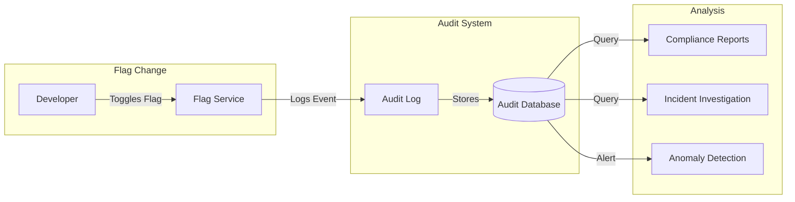
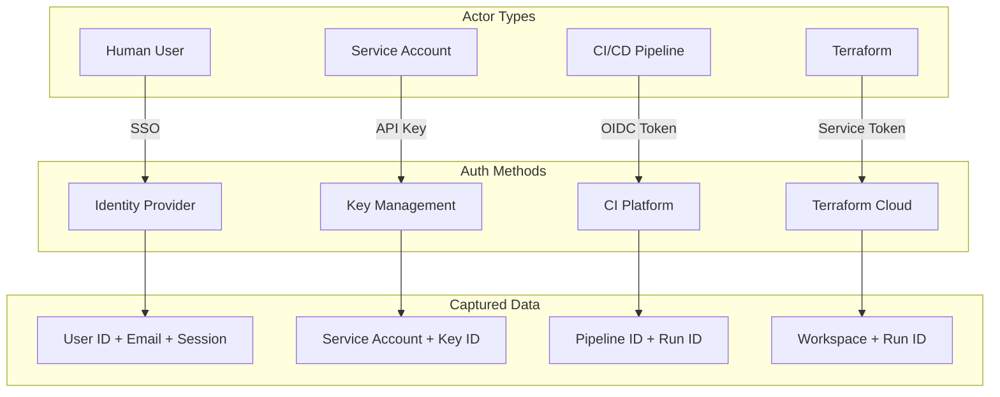
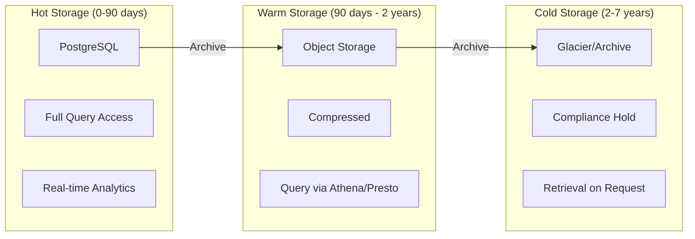
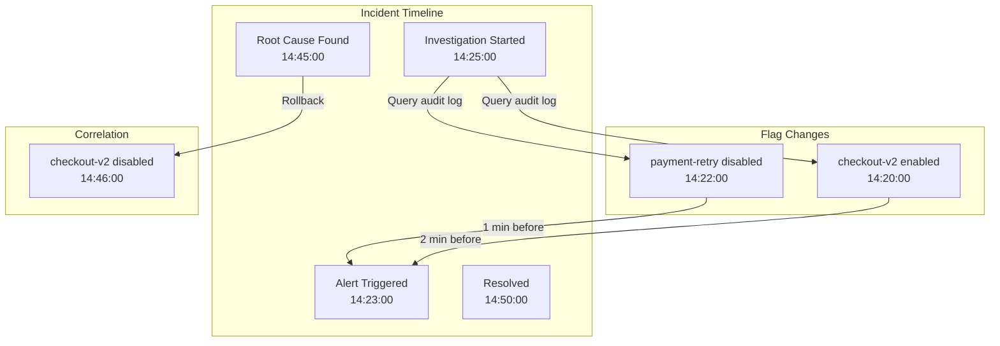

# How to Create Flag Audit Trail

Author: [nawazdhandala](https://github.com/nawazdhandala)

Tags: Feature Flags, Audit, Compliance, Governance

Description: Learn how to implement comprehensive audit trails for feature flag changes.

---

Feature flags are powerful, but with great power comes great responsibility. When a flag change causes an incident, the first question is always: "Who changed what, and when?" Without a proper audit trail, you're flying blind. This guide covers everything you need to implement robust audit logging for feature flag governance.

## Why Audit Trails Matter

Feature flags directly control application behavior in production. A single toggle can enable a new feature for millions of users or disable critical functionality. Audit trails provide:

- **Accountability**: Know who made changes and why
- **Debugging**: Correlate flag changes with incidents
- **Compliance**: Meet regulatory requirements (SOC 2, HIPAA, GDPR)
- **Rollback context**: Understand what to revert to



## Change Event Logging

Every flag modification should trigger a detailed audit event. Here's what to capture.

### Core Event Structure

```typescript
interface FlagAuditEvent {
  // Event identification
  eventId: string;
  eventType: 'FLAG_CREATED' | 'FLAG_UPDATED' | 'FLAG_DELETED' |
             'FLAG_TOGGLED' | 'TARGETING_UPDATED' | 'ROLLOUT_CHANGED';
  timestamp: string;  // ISO 8601 format

  // Actor information
  actor: {
    userId: string;
    email: string;
    ipAddress: string;
    userAgent: string;
    sessionId: string;
  };

  // Flag information
  flag: {
    key: string;
    name: string;
    projectId: string;
    environment: string;
  };

  // Change details
  changes: {
    previousValue: any;
    newValue: any;
    diff: string;  // JSON Patch or similar
  };

  // Context
  context: {
    source: 'UI' | 'API' | 'CLI' | 'TERRAFORM' | 'SDK';
    reason?: string;  // Optional change reason
    ticketId?: string;  // Link to issue tracker
    approvedBy?: string;  // For changes requiring approval
  };
}
```

### Implementation Example

```typescript
import { v4 as uuidv4 } from 'uuid';
import { createHash } from 'crypto';

class FlagAuditLogger {
  private auditStore: AuditStore;
  private eventBus: EventBus;

  constructor(auditStore: AuditStore, eventBus: EventBus) {
    this.auditStore = auditStore;
    this.eventBus = eventBus;
  }

  async logFlagChange(
    eventType: string,
    flag: Flag,
    previousState: FlagState | null,
    newState: FlagState,
    actor: Actor,
    context: ChangeContext
  ): Promise<void> {
    const event: FlagAuditEvent = {
      eventId: uuidv4(),
      eventType,
      timestamp: new Date().toISOString(),

      actor: {
        userId: actor.id,
        email: actor.email,
        ipAddress: this.hashPII(actor.ipAddress),  // Hash for privacy
        userAgent: actor.userAgent,
        sessionId: actor.sessionId,
      },

      flag: {
        key: flag.key,
        name: flag.name,
        projectId: flag.projectId,
        environment: flag.environment,
      },

      changes: {
        previousValue: previousState,
        newValue: newState,
        diff: this.computeDiff(previousState, newState),
      },

      context: {
        source: context.source,
        reason: context.reason,
        ticketId: context.ticketId,
        approvedBy: context.approvedBy,
      },
    };

    // Store the audit event
    await this.auditStore.save(event);

    // Publish for real-time monitoring
    await this.eventBus.publish('flag.audit', event);
  }

  private hashPII(value: string): string {
    // Hash sensitive data for privacy compliance
    return createHash('sha256').update(value).digest('hex').substring(0, 16);
  }

  private computeDiff(previous: any, current: any): string {
    // Use JSON Patch format for precise diff tracking
    const jsonpatch = require('fast-json-patch');
    return JSON.stringify(jsonpatch.compare(previous || {}, current));
  }
}
```

### Middleware for Automatic Logging

Integrate audit logging into your flag service middleware:

```typescript
// Express middleware for automatic audit logging
function auditMiddleware(auditLogger: FlagAuditLogger) {
  return async (req: Request, res: Response, next: NextFunction) => {
    // Capture the original response
    const originalJson = res.json.bind(res);

    res.json = (data: any) => {
      // Log flag changes after successful operations
      if (res.statusCode >= 200 && res.statusCode < 300) {
        if (req.method !== 'GET' && req.path.includes('/flags')) {
          auditLogger.logFlagChange(
            getEventType(req.method),
            data.flag,
            req.body._previousState,
            data.flag,
            extractActor(req),
            extractContext(req)
          ).catch(err => console.error('Audit logging failed:', err));
        }
      }
      return originalJson(data);
    };

    next();
  };
}

function getEventType(method: string): string {
  const mapping: Record<string, string> = {
    'POST': 'FLAG_CREATED',
    'PUT': 'FLAG_UPDATED',
    'PATCH': 'FLAG_TOGGLED',
    'DELETE': 'FLAG_DELETED',
  };
  return mapping[method] || 'FLAG_UPDATED';
}
```

## Who/What/When Tracking

The audit trail must answer three fundamental questions for every change.

### Who Made the Change?

Track both human and machine actors:

```typescript
interface Actor {
  // Human users
  userId?: string;
  email?: string;
  name?: string;
  role?: string;

  // Service accounts / API keys
  serviceAccountId?: string;
  serviceAccountName?: string;
  apiKeyId?: string;

  // Authentication context
  authMethod: 'SSO' | 'API_KEY' | 'SERVICE_ACCOUNT' | 'CLI';
  mfaVerified?: boolean;

  // Session information
  sessionId: string;
  ipAddress: string;
  userAgent: string;
  geoLocation?: {
    country: string;
    region: string;
    city: string;
  };
}
```



### What Changed?

Capture granular change details:

```typescript
interface ChangeDetails {
  // Flag identification
  flagKey: string;
  flagVersion: number;
  environment: string;

  // Change type
  changeType:
    | 'ENABLED_TOGGLED'
    | 'DEFAULT_VALUE_CHANGED'
    | 'TARGETING_RULES_MODIFIED'
    | 'PERCENTAGE_ROLLOUT_CHANGED'
    | 'SEGMENTS_UPDATED'
    | 'METADATA_CHANGED'
    | 'PREREQUISITES_CHANGED';

  // Detailed diff
  previousState: {
    enabled: boolean;
    defaultValue: any;
    rules: TargetingRule[];
    rolloutPercentage?: number;
    segments?: string[];
  };

  newState: {
    enabled: boolean;
    defaultValue: any;
    rules: TargetingRule[];
    rolloutPercentage?: number;
    segments?: string[];
  };

  // Human-readable summary
  summary: string;

  // Affected users (estimated)
  impactEstimate?: {
    affectedUsers: number;
    affectedPercentage: number;
  };
}
```

### When Did It Happen?

Precise timing with timezone handling:

```typescript
interface Timestamp {
  // Primary timestamp
  iso8601: string;  // "2026-01-30T14:30:00.000Z"
  unix: number;     // 1769862600000

  // Timezone context
  timezone: string;  // "America/New_York"
  localTime: string; // "2026-01-30T09:30:00-05:00"

  // Sequencing
  sequenceNumber: bigint;  // Monotonic counter for ordering

  // Clock synchronization
  serverClockSkew?: number;  // Detected client/server clock difference
}

// Ensure consistent timestamps across distributed systems
function createAuditTimestamp(): Timestamp {
  const now = new Date();
  const sequenceNumber = getNextSequenceNumber();  // From distributed counter

  return {
    iso8601: now.toISOString(),
    unix: now.getTime(),
    timezone: Intl.DateTimeFormat().resolvedOptions().timeZone,
    localTime: now.toLocaleString('sv', { timeZoneName: 'short' }),
    sequenceNumber,
  };
}
```

## Audit Log Schema

Design your schema for both queryability and long-term storage.

### Database Schema (PostgreSQL)

```sql
-- Main audit events table
CREATE TABLE flag_audit_events (
    id UUID PRIMARY KEY DEFAULT gen_random_uuid(),
    event_type VARCHAR(50) NOT NULL,
    timestamp TIMESTAMPTZ NOT NULL DEFAULT NOW(),
    sequence_number BIGSERIAL,

    -- Actor information
    actor_user_id VARCHAR(255),
    actor_email VARCHAR(255),
    actor_type VARCHAR(50) NOT NULL,  -- 'user', 'service_account', 'api_key'
    actor_ip_hash VARCHAR(64),
    actor_session_id VARCHAR(255),

    -- Flag information
    flag_key VARCHAR(255) NOT NULL,
    flag_name VARCHAR(500),
    project_id VARCHAR(255) NOT NULL,
    environment VARCHAR(100) NOT NULL,

    -- Change details (JSONB for flexibility)
    previous_state JSONB,
    new_state JSONB,
    change_diff JSONB,
    change_summary TEXT,

    -- Context
    source VARCHAR(50) NOT NULL,
    change_reason TEXT,
    ticket_id VARCHAR(100),
    approved_by VARCHAR(255),

    -- Metadata
    metadata JSONB DEFAULT '{}',

    -- Indexing helpers
    created_at TIMESTAMPTZ NOT NULL DEFAULT NOW()
);

-- Indexes for common queries
CREATE INDEX idx_audit_timestamp ON flag_audit_events(timestamp DESC);
CREATE INDEX idx_audit_flag_key ON flag_audit_events(flag_key);
CREATE INDEX idx_audit_actor ON flag_audit_events(actor_user_id);
CREATE INDEX idx_audit_project_env ON flag_audit_events(project_id, environment);
CREATE INDEX idx_audit_event_type ON flag_audit_events(event_type);

-- Composite index for typical queries
CREATE INDEX idx_audit_flag_time ON flag_audit_events(flag_key, timestamp DESC);

-- Full-text search on change summaries
CREATE INDEX idx_audit_summary_search ON flag_audit_events
    USING gin(to_tsvector('english', change_summary));

-- Partitioning for performance (partition by month)
CREATE TABLE flag_audit_events_partitioned (
    LIKE flag_audit_events INCLUDING ALL
) PARTITION BY RANGE (timestamp);

-- Create monthly partitions
CREATE TABLE flag_audit_events_2026_01
    PARTITION OF flag_audit_events_partitioned
    FOR VALUES FROM ('2026-01-01') TO ('2026-02-01');

CREATE TABLE flag_audit_events_2026_02
    PARTITION OF flag_audit_events_partitioned
    FOR VALUES FROM ('2026-02-01') TO ('2026-03-01');
```

### Immutability Guarantees

Audit logs must be tamper-proof:

```sql
-- Prevent updates and deletes on audit table
CREATE OR REPLACE FUNCTION prevent_audit_modification()
RETURNS TRIGGER AS $$
BEGIN
    RAISE EXCEPTION 'Audit log records cannot be modified or deleted';
    RETURN NULL;
END;
$$ LANGUAGE plpgsql;

CREATE TRIGGER audit_immutability_update
    BEFORE UPDATE ON flag_audit_events
    FOR EACH ROW EXECUTE FUNCTION prevent_audit_modification();

CREATE TRIGGER audit_immutability_delete
    BEFORE DELETE ON flag_audit_events
    FOR EACH ROW EXECUTE FUNCTION prevent_audit_modification();

-- Add hash chain for integrity verification
ALTER TABLE flag_audit_events ADD COLUMN previous_hash VARCHAR(64);
ALTER TABLE flag_audit_events ADD COLUMN record_hash VARCHAR(64);

CREATE OR REPLACE FUNCTION compute_audit_hash()
RETURNS TRIGGER AS $$
DECLARE
    prev_hash VARCHAR(64);
    record_data TEXT;
BEGIN
    -- Get previous record's hash
    SELECT record_hash INTO prev_hash
    FROM flag_audit_events
    ORDER BY sequence_number DESC
    LIMIT 1;

    NEW.previous_hash := COALESCE(prev_hash, 'genesis');

    -- Compute hash of this record
    record_data := NEW.event_type || NEW.timestamp || NEW.flag_key ||
                   NEW.actor_user_id || COALESCE(NEW.previous_hash, '');
    NEW.record_hash := encode(sha256(record_data::bytea), 'hex');

    RETURN NEW;
END;
$$ LANGUAGE plpgsql;

CREATE TRIGGER audit_hash_chain
    BEFORE INSERT ON flag_audit_events
    FOR EACH ROW EXECUTE FUNCTION compute_audit_hash();
```

### Event Sourcing Pattern

For complete history reconstruction:

```typescript
interface FlagEventStore {
  // Append-only event storage
  appendEvent(event: FlagAuditEvent): Promise<void>;

  // Reconstruct flag state at any point in time
  getFlagStateAt(flagKey: string, timestamp: Date): Promise<FlagState>;

  // Get all events for a flag
  getEventStream(flagKey: string, options?: {
    startTime?: Date;
    endTime?: Date;
    limit?: number;
  }): AsyncIterator<FlagAuditEvent>;
}

class EventSourcedFlagStore implements FlagEventStore {
  async getFlagStateAt(flagKey: string, timestamp: Date): Promise<FlagState> {
    // Start with empty state
    let state: FlagState = {
      enabled: false,
      defaultValue: null,
      rules: [],
    };

    // Replay all events up to timestamp
    const events = this.getEventStream(flagKey, { endTime: timestamp });

    for await (const event of events) {
      state = this.applyEvent(state, event);
    }

    return state;
  }

  private applyEvent(state: FlagState, event: FlagAuditEvent): FlagState {
    switch (event.eventType) {
      case 'FLAG_CREATED':
        return event.changes.newValue;
      case 'FLAG_UPDATED':
      case 'FLAG_TOGGLED':
        return { ...state, ...event.changes.newValue };
      case 'FLAG_DELETED':
        return { enabled: false, defaultValue: null, rules: [], deleted: true };
      default:
        return state;
    }
  }
}
```

## Retention Policies

Balance compliance requirements with storage costs.

### Retention Tiers



### Implementation

```typescript
interface RetentionPolicy {
  tier: 'hot' | 'warm' | 'cold';
  minRetentionDays: number;
  maxRetentionDays: number;
  storageClass: string;
  compressionEnabled: boolean;
  encryptionRequired: boolean;
}

const retentionPolicies: Record<string, RetentionPolicy> = {
  // Recent data - fast access
  hot: {
    tier: 'hot',
    minRetentionDays: 0,
    maxRetentionDays: 90,
    storageClass: 'postgresql',
    compressionEnabled: false,
    encryptionRequired: true,
  },

  // Historical data - occasional access
  warm: {
    tier: 'warm',
    minRetentionDays: 90,
    maxRetentionDays: 730,  // 2 years
    storageClass: 's3-standard',
    compressionEnabled: true,
    encryptionRequired: true,
  },

  // Compliance archive - rare access
  cold: {
    tier: 'cold',
    minRetentionDays: 730,
    maxRetentionDays: 2555,  // 7 years
    storageClass: 's3-glacier',
    compressionEnabled: true,
    encryptionRequired: true,
  },
};

class RetentionManager {
  async archiveOldRecords(): Promise<void> {
    // Move from hot to warm (90+ days old)
    const warmCutoff = new Date();
    warmCutoff.setDate(warmCutoff.getDate() - 90);

    const recordsToWarm = await this.db.query(`
      SELECT * FROM flag_audit_events
      WHERE timestamp < $1
      AND archived = false
      ORDER BY timestamp ASC
      LIMIT 10000
    `, [warmCutoff]);

    for (const batch of chunk(recordsToWarm, 1000)) {
      // Compress and upload to S3
      const compressed = await this.compressRecords(batch);
      await this.s3.putObject({
        Bucket: 'audit-archive',
        Key: `warm/${warmCutoff.toISOString().slice(0, 7)}/${uuidv4()}.json.gz`,
        Body: compressed,
        StorageClass: 'STANDARD',
      });

      // Mark as archived in hot storage
      await this.db.query(`
        UPDATE flag_audit_events
        SET archived = true
        WHERE id = ANY($1)
      `, [batch.map(r => r.id)]);
    }
  }

  async enforceRetention(): Promise<void> {
    // Delete records past maximum retention
    const coldCutoff = new Date();
    coldCutoff.setFullYear(coldCutoff.getFullYear() - 7);

    // Check for legal holds before deletion
    const recordsToDelete = await this.db.query(`
      SELECT id FROM flag_audit_events
      WHERE timestamp < $1
      AND legal_hold = false
    `, [coldCutoff]);

    // Permanently delete
    await this.db.query(`
      DELETE FROM flag_audit_events
      WHERE id = ANY($1)
    `, [recordsToDelete.map(r => r.id)]);
  }
}
```

### Legal Hold Support

```typescript
interface LegalHold {
  holdId: string;
  reason: string;
  createdBy: string;
  createdAt: Date;
  expiresAt?: Date;
  affectedRecords: {
    flagKeys?: string[];
    dateRange?: { start: Date; end: Date };
    actors?: string[];
  };
}

class LegalHoldManager {
  async createHold(hold: LegalHold): Promise<void> {
    // Mark matching records as under legal hold
    await this.db.query(`
      UPDATE flag_audit_events
      SET legal_hold = true,
          legal_hold_id = $1
      WHERE (flag_key = ANY($2) OR $2 IS NULL)
        AND (timestamp BETWEEN $3 AND $4 OR $3 IS NULL)
        AND (actor_user_id = ANY($5) OR $5 IS NULL)
    `, [
      hold.holdId,
      hold.affectedRecords.flagKeys,
      hold.affectedRecords.dateRange?.start,
      hold.affectedRecords.dateRange?.end,
      hold.affectedRecords.actors,
    ]);

    // Log the hold creation itself
    await this.auditLogger.log({
      eventType: 'LEGAL_HOLD_CREATED',
      holdId: hold.holdId,
      reason: hold.reason,
      createdBy: hold.createdBy,
    });
  }
}
```

## Compliance Requirements

Different regulations have specific audit requirements.

### SOC 2 Requirements

```typescript
// SOC 2 requires tracking all access to sensitive data
interface SOC2AuditRequirements {
  // CC6.1: Logical and physical access controls
  accessControlLogging: {
    trackAllAuthentication: boolean;
    trackAuthorizationDecisions: boolean;
    trackPrivilegedActions: boolean;
  };

  // CC7.2: System monitoring
  changeDetection: {
    trackAllConfigChanges: boolean;
    alertOnUnauthorizedChanges: boolean;
    retentionPeriodDays: number;  // Minimum 1 year
  };

  // CC8.1: Change management
  changeManagement: {
    requireChangeReason: boolean;
    requireApproval: boolean;
    trackRollbacks: boolean;
  };
}

const soc2Compliance: SOC2AuditRequirements = {
  accessControlLogging: {
    trackAllAuthentication: true,
    trackAuthorizationDecisions: true,
    trackPrivilegedActions: true,
  },
  changeDetection: {
    trackAllConfigChanges: true,
    alertOnUnauthorizedChanges: true,
    retentionPeriodDays: 365,
  },
  changeManagement: {
    requireChangeReason: true,
    requireApproval: true,  // For production changes
    trackRollbacks: true,
  },
};
```

### HIPAA Requirements

```typescript
// HIPAA requires detailed access logging for PHI
interface HIPAAAuditRequirements {
  // 164.312(b): Audit controls
  auditControls: {
    recordAllAccess: boolean;
    includeUserIdentification: boolean;
    includeTimestamp: boolean;
    includeAccessType: boolean;
  };

  // 164.312(c): Integrity controls
  integrityControls: {
    preventTampering: boolean;
    detectModification: boolean;
    maintainHashChain: boolean;
  };

  // Retention: Minimum 6 years
  retentionPeriodYears: number;
}

const hipaaCompliance: HIPAAAuditRequirements = {
  auditControls: {
    recordAllAccess: true,
    includeUserIdentification: true,
    includeTimestamp: true,
    includeAccessType: true,
  },
  integrityControls: {
    preventTampering: true,
    detectModification: true,
    maintainHashChain: true,
  },
  retentionPeriodYears: 6,
};
```

### GDPR Considerations

```typescript
// GDPR requires balancing audit needs with privacy
interface GDPRAuditConsiderations {
  // Data minimization
  dataMinimization: {
    hashIpAddresses: boolean;
    excludeUnnecessaryPII: boolean;
    anonymizeAfterPeriod: boolean;
    anonymizationPeriodDays: number;
  };

  // Right to erasure (with exceptions for legal obligations)
  rightToErasure: {
    allowDeletion: boolean;
    exceptForLegalCompliance: boolean;
    exceptForLegalClaims: boolean;
  };

  // Data subject access requests
  subjectAccessRequests: {
    provideExport: boolean;
    exportFormat: string;
  };
}

const gdprCompliance: GDPRAuditConsiderations = {
  dataMinimization: {
    hashIpAddresses: true,
    excludeUnnecessaryPII: true,
    anonymizeAfterPeriod: true,
    anonymizationPeriodDays: 365,  // Anonymize PII after 1 year
  },
  rightToErasure: {
    allowDeletion: false,  // Audit logs are legal obligation
    exceptForLegalCompliance: true,
    exceptForLegalClaims: true,
  },
  subjectAccessRequests: {
    provideExport: true,
    exportFormat: 'json',
  },
};
```

### Compliance Validation

```typescript
class ComplianceValidator {
  validateAuditEvent(event: FlagAuditEvent, standards: string[]): ValidationResult {
    const errors: string[] = [];

    if (standards.includes('SOC2')) {
      if (!event.actor.userId && !event.actor.serviceAccountId) {
        errors.push('SOC2: Actor identification required');
      }
      if (!event.context.reason && event.flag.environment === 'production') {
        errors.push('SOC2: Change reason required for production');
      }
    }

    if (standards.includes('HIPAA')) {
      if (!event.timestamp) {
        errors.push('HIPAA: Timestamp required');
      }
      if (!event.eventType) {
        errors.push('HIPAA: Access type required');
      }
    }

    if (standards.includes('GDPR')) {
      if (event.actor.ipAddress && !this.isHashed(event.actor.ipAddress)) {
        errors.push('GDPR: IP address should be hashed');
      }
    }

    return {
      valid: errors.length === 0,
      errors,
      warnings: this.getWarnings(event, standards),
    };
  }
}
```

## Audit Log Analysis

Transform audit data into actionable insights.

### Query Patterns

```sql
-- Who changed this flag recently?
SELECT
    actor_email,
    event_type,
    change_summary,
    timestamp
FROM flag_audit_events
WHERE flag_key = 'new-checkout-flow'
  AND timestamp > NOW() - INTERVAL '7 days'
ORDER BY timestamp DESC;

-- What changed during an incident window?
SELECT
    flag_key,
    actor_email,
    event_type,
    change_summary,
    timestamp
FROM flag_audit_events
WHERE timestamp BETWEEN '2026-01-30 14:00:00' AND '2026-01-30 15:00:00'
  AND environment = 'production'
ORDER BY timestamp;

-- Which flags have the most changes? (potential instability)
SELECT
    flag_key,
    COUNT(*) as change_count,
    COUNT(DISTINCT actor_user_id) as unique_actors
FROM flag_audit_events
WHERE timestamp > NOW() - INTERVAL '30 days'
GROUP BY flag_key
ORDER BY change_count DESC
LIMIT 10;

-- Detect unusual activity patterns
WITH hourly_changes AS (
    SELECT
        DATE_TRUNC('hour', timestamp) as hour,
        COUNT(*) as changes
    FROM flag_audit_events
    WHERE timestamp > NOW() - INTERVAL '7 days'
    GROUP BY DATE_TRUNC('hour', timestamp)
)
SELECT
    hour,
    changes,
    AVG(changes) OVER (ORDER BY hour ROWS BETWEEN 24 PRECEDING AND CURRENT ROW) as avg_24h,
    changes / NULLIF(AVG(changes) OVER (ORDER BY hour ROWS BETWEEN 24 PRECEDING AND CURRENT ROW), 0) as ratio
FROM hourly_changes
WHERE changes > 2 * (SELECT AVG(changes) FROM hourly_changes);
```

### Anomaly Detection

```typescript
class AuditAnomalyDetector {
  async detectAnomalies(): Promise<Anomaly[]> {
    const anomalies: Anomaly[] = [];

    // Unusual time of day
    const offHoursChanges = await this.findOffHoursChanges();
    anomalies.push(...offHoursChanges.map(c => ({
      type: 'OFF_HOURS_CHANGE',
      severity: 'medium',
      event: c,
      message: `Flag changed at ${c.timestamp} (outside business hours)`,
    })));

    // Unusual actor (service account making unusual changes)
    const unusualActors = await this.findUnusualActorBehavior();
    anomalies.push(...unusualActors);

    // Rapid changes (potential automation issue)
    const rapidChanges = await this.findRapidChanges();
    anomalies.push(...rapidChanges.map(r => ({
      type: 'RAPID_CHANGES',
      severity: 'high',
      events: r.events,
      message: `${r.count} changes to ${r.flagKey} in ${r.minutes} minutes`,
    })));

    // Unauthorized environment access
    const unauthorizedAccess = await this.findUnauthorizedAccess();
    anomalies.push(...unauthorizedAccess.map(u => ({
      type: 'UNAUTHORIZED_ACCESS',
      severity: 'critical',
      event: u,
      message: `User ${u.actor_email} accessed ${u.environment} without authorization`,
    })));

    return anomalies;
  }

  private async findRapidChanges(): Promise<RapidChangeGroup[]> {
    const result = await this.db.query(`
      WITH change_windows AS (
        SELECT
          flag_key,
          timestamp,
          COUNT(*) OVER (
            PARTITION BY flag_key
            ORDER BY timestamp
            RANGE BETWEEN INTERVAL '5 minutes' PRECEDING AND CURRENT ROW
          ) as changes_in_window
        FROM flag_audit_events
        WHERE timestamp > NOW() - INTERVAL '24 hours'
      )
      SELECT flag_key, MAX(changes_in_window) as max_changes
      FROM change_windows
      WHERE changes_in_window > 5
      GROUP BY flag_key
    `);

    return result.rows;
  }
}
```

### Dashboard Metrics

```typescript
interface AuditDashboardMetrics {
  // Activity overview
  totalChangesLast24h: number;
  totalChangesLast7d: number;
  uniqueActorsLast24h: number;

  // Environment breakdown
  changesByEnvironment: Record<string, number>;

  // Actor breakdown
  topActors: Array<{ email: string; changeCount: number }>;

  // Change type breakdown
  changesByType: Record<string, number>;

  // Compliance status
  complianceStatus: {
    retentionCompliant: boolean;
    encryptionEnabled: boolean;
    immutabilityEnforced: boolean;
    lastIntegrityCheck: Date;
    integrityCheckPassed: boolean;
  };

  // Anomalies
  openAnomalies: number;
  criticalAnomalies: number;
}

async function computeDashboardMetrics(): Promise<AuditDashboardMetrics> {
  const [
    activity,
    byEnvironment,
    topActors,
    byType,
    compliance,
    anomalies,
  ] = await Promise.all([
    getActivityMetrics(),
    getChangesByEnvironment(),
    getTopActors(),
    getChangesByType(),
    getComplianceStatus(),
    getAnomalyCount(),
  ]);

  return {
    totalChangesLast24h: activity.last24h,
    totalChangesLast7d: activity.last7d,
    uniqueActorsLast24h: activity.uniqueActors,
    changesByEnvironment: byEnvironment,
    topActors,
    changesByType: byType,
    complianceStatus: compliance,
    openAnomalies: anomalies.open,
    criticalAnomalies: anomalies.critical,
  };
}
```

### Incident Correlation



```typescript
class IncidentCorrelator {
  async findRelatedFlagChanges(
    incidentStartTime: Date,
    incidentEndTime: Date,
    lookbackMinutes: number = 30
  ): Promise<FlagAuditEvent[]> {
    const lookbackStart = new Date(incidentStartTime);
    lookbackStart.setMinutes(lookbackStart.getMinutes() - lookbackMinutes);

    return this.db.query(`
      SELECT *
      FROM flag_audit_events
      WHERE timestamp BETWEEN $1 AND $2
        AND environment = 'production'
        AND event_type IN ('FLAG_TOGGLED', 'FLAG_UPDATED', 'ROLLOUT_CHANGED')
      ORDER BY timestamp DESC
    `, [lookbackStart, incidentEndTime]);
  }

  async generateIncidentReport(incidentId: string): Promise<IncidentReport> {
    const incident = await this.getIncident(incidentId);
    const relatedChanges = await this.findRelatedFlagChanges(
      incident.startTime,
      incident.endTime
    );

    return {
      incidentId,
      timeWindow: {
        start: incident.startTime,
        end: incident.endTime,
      },
      relatedFlagChanges: relatedChanges.map(c => ({
        flagKey: c.flag_key,
        changeType: c.event_type,
        actor: c.actor_email,
        timestamp: c.timestamp,
        timeDelta: this.computeTimeDelta(c.timestamp, incident.startTime),
        changeSummary: c.change_summary,
      })),
      potentialCauses: this.rankPotentialCauses(relatedChanges, incident),
      recommendations: this.generateRecommendations(relatedChanges),
    };
  }
}
```

## Best Practices Summary

1. **Log everything**: Every flag change, evaluation, and access attempt
2. **Capture context**: Who, what, when, why, and from where
3. **Ensure immutability**: Use append-only storage with integrity verification
4. **Plan retention**: Align with compliance requirements, use tiered storage
5. **Enable analysis**: Index for common queries, build dashboards
6. **Detect anomalies**: Alert on unusual patterns automatically
7. **Correlate with incidents**: Make it easy to find flag changes during outages

---

A well-implemented audit trail transforms feature flags from potential liabilities into well-governed tools. When the next incident strikes, you'll have the answers before anyone asks the questions.
