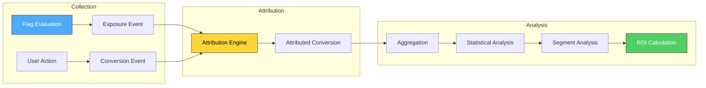
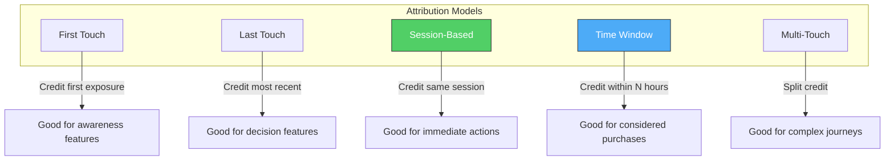
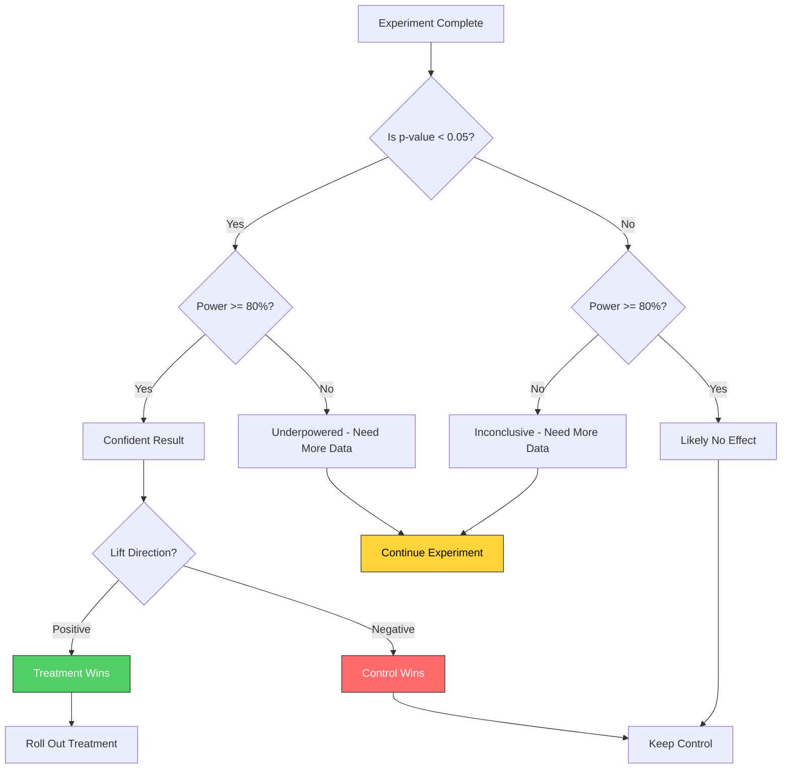
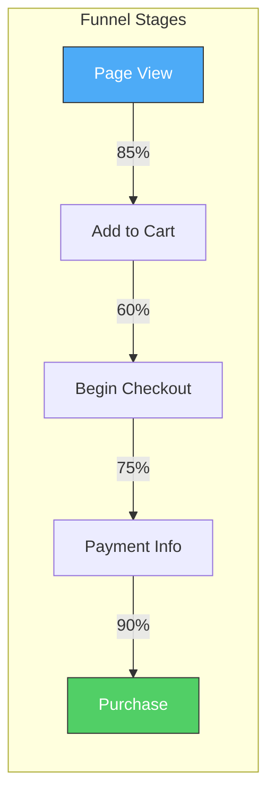
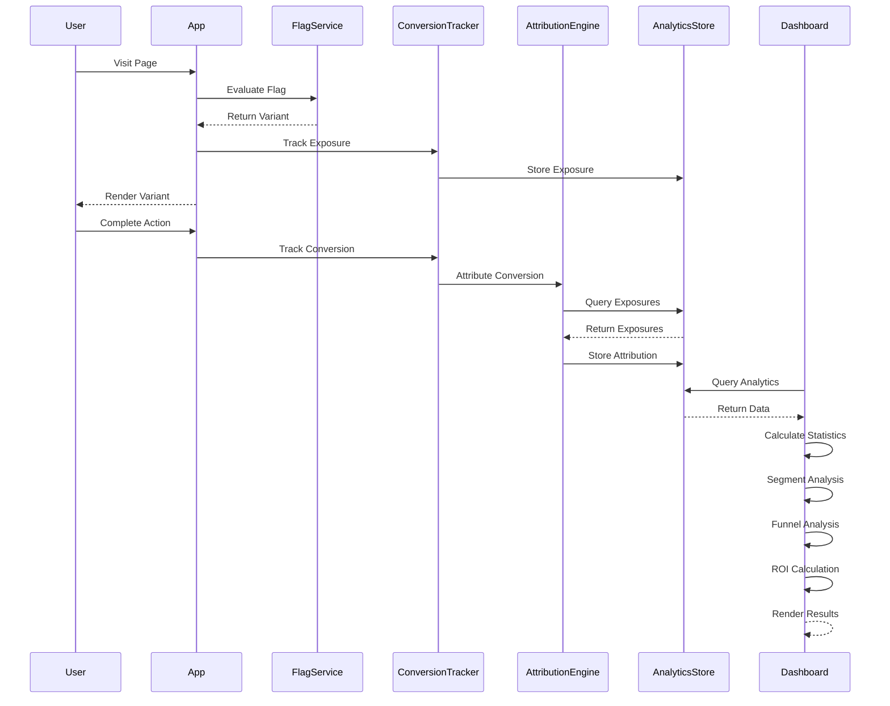

# How to Build Flag Conversion Tracking

Author: [nawazdhandala](https://github.com/nawazdhandala)

Tags: Feature Flags, Analytics, Conversion, Experimentation

Description: Learn how to track conversion rates across feature flag variants.

---

Feature flags enable controlled rollouts, but the real value comes from measuring their impact. Conversion tracking connects feature flag exposures to user actions, answering the fundamental question: does this change actually improve outcomes? This guide covers everything you need to build a robust flag conversion tracking system, from defining conversion events to calculating ROI.

## Why Conversion Tracking Matters

Without conversion tracking, feature flags are just deployment switches. With conversion tracking, they become experimentation tools that drive data-informed decisions.

Consider this scenario: you roll out a new checkout flow to 50% of users. Both groups seem happy, no complaints roll in. But is the new flow actually better? Conversion tracking tells you that the new flow has a 12% higher purchase completion rate, justifying a full rollout and quantifying the business impact.

## The Conversion Tracking Pipeline

Conversion tracking requires capturing, attributing, and analyzing user actions in the context of flag exposures.



## Conversion Event Definition

A conversion event represents a meaningful user action that indicates success. The key is defining what "success" means for each feature flag.

### Conversion Event Structure

```typescript
interface ConversionEvent {
  // Unique identifier for this conversion
  conversionId: string;

  // What type of conversion this is
  eventType: string;

  // Numeric value if applicable (revenue, score, etc.)
  value?: number;

  // User identifier for attribution
  userId: string;

  // Session identifier for session-based attribution
  sessionId: string;

  // When the conversion occurred
  timestamp: Date;

  // Additional context
  metadata: {
    source?: string;
    category?: string;
    properties?: Record<string, string | number | boolean>;
  };
}
```

### Common Conversion Types

Different features require different conversion metrics. Here are typical patterns:

| Feature Type | Primary Conversion | Secondary Conversions |
|--------------|-------------------|----------------------|
| Checkout Flow | Purchase Complete | Cart Abandonment Rate, Average Order Value |
| Signup Form | Account Created | Email Verified, Profile Completed |
| Search Feature | Result Clicked | Search Refinements, Time to Click |
| Pricing Page | Plan Selected | Upgrade Rate, Downgrade Rate |
| Onboarding | Tutorial Complete | Feature Adoption, 7-Day Retention |

### Implementing Conversion Tracking

```typescript
import { v4 as uuid } from 'uuid';

interface ConversionConfig {
  eventType: string;
  valueExtractor?: (data: any) => number;
  metadata?: Record<string, any>;
}

class ConversionTracker {
  private queue: ConversionEvent[] = [];
  private flushThreshold = 50;
  private flushInterval = 5000;

  constructor(private endpoint: string) {
    setInterval(() => this.flush(), this.flushInterval);
  }

  track(
    eventType: string,
    userId: string,
    sessionId: string,
    value?: number,
    metadata?: Record<string, any>
  ): string {
    const conversionId = uuid();

    const event: ConversionEvent = {
      conversionId,
      eventType,
      value,
      userId: this.hashUserId(userId),
      sessionId,
      timestamp: new Date(),
      metadata: {
        ...metadata,
        trackedAt: Date.now(),
      },
    };

    this.queue.push(event);

    if (this.queue.length >= this.flushThreshold) {
      this.flush();
    }

    return conversionId;
  }

  // Preset conversion trackers
  trackPurchase(userId: string, sessionId: string, amount: number, currency: string = 'USD'): string {
    return this.track('purchase', userId, sessionId, amount, { currency });
  }

  trackSignup(userId: string, sessionId: string, plan?: string): string {
    return this.track('signup', userId, sessionId, 1, { plan });
  }

  trackEngagement(userId: string, sessionId: string, action: string, duration?: number): string {
    return this.track('engagement', userId, sessionId, duration || 1, { action });
  }

  trackFeatureAdoption(userId: string, sessionId: string, feature: string): string {
    return this.track('feature_adoption', userId, sessionId, 1, { feature });
  }

  private async flush(): Promise<void> {
    if (this.queue.length === 0) return;

    const batch = this.queue.splice(0, this.queue.length);

    try {
      await fetch(this.endpoint, {
        method: 'POST',
        headers: { 'Content-Type': 'application/json' },
        body: JSON.stringify({ conversions: batch }),
      });
    } catch (error) {
      // Re-queue on failure with exponential backoff consideration
      this.queue.unshift(...batch);
      console.error('Conversion tracking flush failed:', error);
    }
  }

  private hashUserId(userId: string): string {
    // Use a proper hashing function in production (SHA-256 recommended)
    return Buffer.from(userId).toString('base64');
  }
}
```

## Attribution Models

Attribution connects conversions to flag exposures. The model you choose affects how credit is assigned and can significantly impact your analysis.



### First-Touch Attribution

Credit goes to the first flag exposure the user experienced. Best for features that create initial awareness or interest.

```typescript
class FirstTouchAttribution {
  async attribute(
    userId: string,
    conversionTime: Date,
    lookbackDays: number = 30
  ): Promise<Attribution | null> {
    const cutoff = new Date(conversionTime.getTime() - lookbackDays * 24 * 60 * 60 * 1000);

    const exposures = await this.getExposures(userId, cutoff, conversionTime);

    if (exposures.length === 0) return null;

    // Sort by timestamp ascending and take first
    exposures.sort((a, b) => a.timestamp.getTime() - b.timestamp.getTime());

    return {
      exposureId: exposures[0].evaluationId,
      flagKey: exposures[0].flagKey,
      variant: exposures[0].variant,
      attributionModel: 'first_touch',
      weight: 1.0,
    };
  }

  private async getExposures(userId: string, from: Date, to: Date): Promise<ExposureEvent[]> {
    // Query exposure store
    return [];
  }
}
```

### Last-Touch Attribution

Credit goes to the most recent flag exposure before conversion. Best for features that directly influence the final decision.

```typescript
class LastTouchAttribution {
  async attribute(
    userId: string,
    conversionTime: Date,
    lookbackDays: number = 7
  ): Promise<Attribution | null> {
    const cutoff = new Date(conversionTime.getTime() - lookbackDays * 24 * 60 * 60 * 1000);

    const exposures = await this.getExposures(userId, cutoff, conversionTime);

    if (exposures.length === 0) return null;

    // Sort by timestamp descending and take first
    exposures.sort((a, b) => b.timestamp.getTime() - a.timestamp.getTime());

    return {
      exposureId: exposures[0].evaluationId,
      flagKey: exposures[0].flagKey,
      variant: exposures[0].variant,
      attributionModel: 'last_touch',
      weight: 1.0,
    };
  }

  private async getExposures(userId: string, from: Date, to: Date): Promise<ExposureEvent[]> {
    return [];
  }
}
```

### Session-Based Attribution

Credit goes to all flag exposures within the same session as the conversion. Best for immediate actions where the entire session context matters.

```typescript
class SessionBasedAttribution {
  async attribute(
    userId: string,
    sessionId: string,
    conversionTime: Date
  ): Promise<Attribution[]> {
    const exposures = await this.getSessionExposures(userId, sessionId);

    return exposures.map(exp => ({
      exposureId: exp.evaluationId,
      flagKey: exp.flagKey,
      variant: exp.variant,
      attributionModel: 'session',
      weight: 1.0 / exposures.length, // Equal weight distribution
    }));
  }

  private async getSessionExposures(userId: string, sessionId: string): Promise<ExposureEvent[]> {
    return [];
  }
}
```

### Time-Window Attribution

Credit goes to exposures within a configurable time window before conversion. Balances recency with reasonable lookback for considered decisions.

```typescript
class TimeWindowAttribution {
  constructor(private windowMs: number = 24 * 60 * 60 * 1000) {} // Default 24 hours

  async attribute(
    userId: string,
    conversionTime: Date
  ): Promise<Attribution[]> {
    const windowStart = new Date(conversionTime.getTime() - this.windowMs);

    const exposures = await this.getExposures(userId, windowStart, conversionTime);

    // Weight by recency (more recent = higher weight)
    const totalTime = this.windowMs;

    return exposures.map(exp => {
      const timeSinceExposure = conversionTime.getTime() - exp.timestamp.getTime();
      const recencyScore = 1 - (timeSinceExposure / totalTime);

      return {
        exposureId: exp.evaluationId,
        flagKey: exp.flagKey,
        variant: exp.variant,
        attributionModel: 'time_window',
        weight: recencyScore,
        timeSinceExposure,
      };
    });
  }

  private async getExposures(userId: string, from: Date, to: Date): Promise<ExposureEvent[]> {
    return [];
  }
}
```

### Multi-Touch Attribution

Distributes credit across all touchpoints. Best for complex user journeys where multiple features influence the outcome.

```typescript
type AttributionStrategy = 'linear' | 'time_decay' | 'position_based';

class MultiTouchAttribution {
  constructor(private strategy: AttributionStrategy = 'linear') {}

  async attribute(
    userId: string,
    conversionTime: Date,
    lookbackDays: number = 30
  ): Promise<Attribution[]> {
    const cutoff = new Date(conversionTime.getTime() - lookbackDays * 24 * 60 * 60 * 1000);
    const exposures = await this.getExposures(userId, cutoff, conversionTime);

    if (exposures.length === 0) return [];

    switch (this.strategy) {
      case 'linear':
        return this.linearAttribution(exposures);
      case 'time_decay':
        return this.timeDecayAttribution(exposures, conversionTime);
      case 'position_based':
        return this.positionBasedAttribution(exposures);
    }
  }

  private linearAttribution(exposures: ExposureEvent[]): Attribution[] {
    const weight = 1 / exposures.length;
    return exposures.map(exp => ({
      exposureId: exp.evaluationId,
      flagKey: exp.flagKey,
      variant: exp.variant,
      attributionModel: 'multi_touch_linear',
      weight,
    }));
  }

  private timeDecayAttribution(exposures: ExposureEvent[], conversionTime: Date): Attribution[] {
    const decayRate = 0.5; // Half-life decay
    const halfLifeMs = 7 * 24 * 60 * 60 * 1000; // 7 days

    const weights = exposures.map(exp => {
      const timeDiff = conversionTime.getTime() - exp.timestamp.getTime();
      return Math.pow(decayRate, timeDiff / halfLifeMs);
    });

    const totalWeight = weights.reduce((a, b) => a + b, 0);

    return exposures.map((exp, i) => ({
      exposureId: exp.evaluationId,
      flagKey: exp.flagKey,
      variant: exp.variant,
      attributionModel: 'multi_touch_time_decay',
      weight: weights[i] / totalWeight,
    }));
  }

  private positionBasedAttribution(exposures: ExposureEvent[]): Attribution[] {
    // 40% to first, 40% to last, 20% split among middle
    const n = exposures.length;

    if (n === 1) {
      return [{
        exposureId: exposures[0].evaluationId,
        flagKey: exposures[0].flagKey,
        variant: exposures[0].variant,
        attributionModel: 'multi_touch_position',
        weight: 1.0,
      }];
    }

    if (n === 2) {
      return exposures.map((exp, i) => ({
        exposureId: exp.evaluationId,
        flagKey: exp.flagKey,
        variant: exp.variant,
        attributionModel: 'multi_touch_position',
        weight: 0.5,
      }));
    }

    const middleWeight = 0.2 / (n - 2);

    return exposures.map((exp, i) => {
      let weight: number;
      if (i === 0) weight = 0.4;
      else if (i === n - 1) weight = 0.4;
      else weight = middleWeight;

      return {
        exposureId: exp.evaluationId,
        flagKey: exp.flagKey,
        variant: exp.variant,
        attributionModel: 'multi_touch_position',
        weight,
      };
    });
  }

  private async getExposures(userId: string, from: Date, to: Date): Promise<ExposureEvent[]> {
    return [];
  }
}
```

## Statistical Analysis

Once you have attributed conversions, statistical analysis determines whether observed differences are meaningful or just random variation.

### Conversion Rate Analysis

```typescript
interface VariantStats {
  variant: string;
  exposures: number;
  conversions: number;
  conversionRate: number;
  totalValue: number;
  averageValue: number;
}

interface StatisticalResult {
  controlStats: VariantStats;
  treatmentStats: VariantStats;
  absoluteLift: number;
  relativeLift: number;
  zScore: number;
  pValue: number;
  confidenceInterval: [number, number];
  isSignificant: boolean;
  statisticalPower: number;
  minimumDetectableEffect: number;
}

class ConversionAnalyzer {
  private readonly confidenceLevel: number;
  private readonly powerTarget: number;

  constructor(confidenceLevel: number = 0.95, powerTarget: number = 0.8) {
    this.confidenceLevel = confidenceLevel;
    this.powerTarget = powerTarget;
  }

  analyze(control: VariantStats, treatment: VariantStats): StatisticalResult {
    const p1 = control.conversionRate;
    const p2 = treatment.conversionRate;
    const n1 = control.exposures;
    const n2 = treatment.exposures;

    // Pooled proportion for standard error
    const pooledP = (control.conversions + treatment.conversions) / (n1 + n2);

    // Standard error of the difference
    const se = Math.sqrt(pooledP * (1 - pooledP) * (1 / n1 + 1 / n2));

    // Z-score
    const zScore = se > 0 ? (p2 - p1) / se : 0;

    // P-value (two-tailed)
    const pValue = 2 * (1 - this.normalCDF(Math.abs(zScore)));

    // Confidence interval
    const zAlpha = this.getZAlpha(this.confidenceLevel);
    const ciSe = Math.sqrt((p1 * (1 - p1) / n1) + (p2 * (1 - p2) / n2));
    const ciMargin = zAlpha * ciSe;

    const absoluteLift = p2 - p1;
    const relativeLift = p1 > 0 ? absoluteLift / p1 : 0;

    // Statistical power
    const power = this.calculatePower(p1, p2, n1, n2);

    // Minimum detectable effect at current sample size
    const mde = this.calculateMDE(p1, n1, n2);

    return {
      controlStats: control,
      treatmentStats: treatment,
      absoluteLift,
      relativeLift,
      zScore,
      pValue,
      confidenceInterval: [absoluteLift - ciMargin, absoluteLift + ciMargin],
      isSignificant: pValue < (1 - this.confidenceLevel),
      statisticalPower: power,
      minimumDetectableEffect: mde,
    };
  }

  calculateRequiredSampleSize(
    baselineRate: number,
    expectedLift: number,
    splitRatio: number = 0.5
  ): { perVariant: number; total: number; estimatedDays: (dailyTraffic: number) => number } {
    const p1 = baselineRate;
    const p2 = baselineRate * (1 + expectedLift);

    const zAlpha = this.getZAlpha(this.confidenceLevel);
    const zBeta = this.getZBeta(this.powerTarget);

    const pBar = (p1 + p2) / 2;

    const n = Math.pow(
      zAlpha * Math.sqrt(2 * pBar * (1 - pBar)) +
      zBeta * Math.sqrt(p1 * (1 - p1) + p2 * (1 - p2)),
      2
    ) / Math.pow(p2 - p1, 2);

    const perVariant = Math.ceil(n);
    const total = Math.ceil(perVariant / splitRatio);

    return {
      perVariant,
      total,
      estimatedDays: (dailyTraffic: number) => Math.ceil(total / dailyTraffic),
    };
  }

  private calculatePower(p1: number, p2: number, n1: number, n2: number): number {
    const se = Math.sqrt((p1 * (1 - p1) / n1) + (p2 * (1 - p2) / n2));
    if (se === 0) return 1;

    const zAlpha = this.getZAlpha(this.confidenceLevel);
    const effectSize = Math.abs(p2 - p1) / se;

    return this.normalCDF(effectSize - zAlpha);
  }

  private calculateMDE(baselineRate: number, n1: number, n2: number): number {
    const zAlpha = this.getZAlpha(this.confidenceLevel);
    const zBeta = this.getZBeta(this.powerTarget);

    const p = baselineRate;
    const se = Math.sqrt(2 * p * (1 - p) / ((n1 * n2) / (n1 + n2)));

    return (zAlpha + zBeta) * se;
  }

  private normalCDF(z: number): number {
    const a1 = 0.254829592;
    const a2 = -0.284496736;
    const a3 = 1.421413741;
    const a4 = -1.453152027;
    const a5 = 1.061405429;
    const p = 0.3275911;

    const sign = z < 0 ? -1 : 1;
    z = Math.abs(z) / Math.sqrt(2);

    const t = 1.0 / (1.0 + p * z);
    const y = 1.0 - (((((a5 * t + a4) * t) + a3) * t + a2) * t + a1) * t * Math.exp(-z * z);

    return 0.5 * (1.0 + sign * y);
  }

  private getZAlpha(confidence: number): number {
    // Common values
    if (confidence === 0.95) return 1.96;
    if (confidence === 0.99) return 2.576;
    if (confidence === 0.90) return 1.645;
    return 1.96; // Default to 95%
  }

  private getZBeta(power: number): number {
    if (power === 0.8) return 0.84;
    if (power === 0.9) return 1.28;
    if (power === 0.95) return 1.645;
    return 0.84; // Default to 80%
  }
}
```

### Interpreting Results



## Segment-Based Conversion Analysis

Aggregate results can hide important segment-level differences. Always analyze conversions across key user segments.

### Segment Definition

```typescript
interface Segment {
  name: string;
  dimension: string;
  value: string | string[];
  filter: (user: UserContext) => boolean;
}

interface SegmentedResults {
  segment: Segment;
  controlStats: VariantStats;
  treatmentStats: VariantStats;
  analysis: StatisticalResult;
}

class SegmentAnalyzer {
  private segments: Segment[] = [];

  defineSegment(
    name: string,
    dimension: string,
    value: string | string[],
    filter: (user: UserContext) => boolean
  ): void {
    this.segments.push({ name, dimension, value, filter });
  }

  // Common segment definitions
  defineStandardSegments(): void {
    // Platform segments
    this.defineSegment('Web Users', 'platform', 'web', u => u.platform === 'web');
    this.defineSegment('Mobile Users', 'platform', 'mobile', u => ['ios', 'android'].includes(u.platform));
    this.defineSegment('iOS Users', 'platform', 'ios', u => u.platform === 'ios');
    this.defineSegment('Android Users', 'platform', 'android', u => u.platform === 'android');

    // User type segments
    this.defineSegment('New Users', 'user_type', 'new', u => u.isNewUser);
    this.defineSegment('Returning Users', 'user_type', 'returning', u => !u.isNewUser);
    this.defineSegment('Power Users', 'user_type', 'power', u => u.engagementScore > 80);

    // Geography segments
    this.defineSegment('US Users', 'country', 'US', u => u.country === 'US');
    this.defineSegment('EU Users', 'region', 'EU', u => u.region === 'EU');

    // Pricing tier segments
    this.defineSegment('Free Users', 'plan', 'free', u => u.plan === 'free');
    this.defineSegment('Paid Users', 'plan', ['basic', 'pro', 'enterprise'], u => u.plan !== 'free');
  }

  async analyzeBySegments(
    flagKey: string,
    conversionType: string,
    dateRange: { from: Date; to: Date }
  ): Promise<SegmentedResults[]> {
    const results: SegmentedResults[] = [];
    const analyzer = new ConversionAnalyzer();

    for (const segment of this.segments) {
      const segmentData = await this.getSegmentData(flagKey, conversionType, dateRange, segment);

      if (segmentData.control.exposures < 100 || segmentData.treatment.exposures < 100) {
        // Skip segments with insufficient data
        continue;
      }

      const analysis = analyzer.analyze(segmentData.control, segmentData.treatment);

      results.push({
        segment,
        controlStats: segmentData.control,
        treatmentStats: segmentData.treatment,
        analysis,
      });
    }

    return results;
  }

  detectSegmentDivergence(results: SegmentedResults[]): SegmentDivergence[] {
    const divergences: SegmentDivergence[] = [];

    for (const result of results) {
      // Check if segment result differs significantly from overall
      const overallLift = this.getOverallLift();
      const segmentLift = result.analysis.relativeLift;

      const liftDifference = Math.abs(segmentLift - overallLift);

      if (liftDifference > 0.1 && result.analysis.isSignificant) {
        divergences.push({
          segment: result.segment,
          overallLift,
          segmentLift,
          direction: segmentLift > overallLift ? 'outperforming' : 'underperforming',
          significance: result.analysis.pValue,
        });
      }
    }

    return divergences;
  }

  private async getSegmentData(
    flagKey: string,
    conversionType: string,
    dateRange: { from: Date; to: Date },
    segment: Segment
  ): Promise<{ control: VariantStats; treatment: VariantStats }> {
    // Query segmented data from your analytics store
    return {
      control: { variant: 'control', exposures: 0, conversions: 0, conversionRate: 0, totalValue: 0, averageValue: 0 },
      treatment: { variant: 'treatment', exposures: 0, conversions: 0, conversionRate: 0, totalValue: 0, averageValue: 0 },
    };
  }

  private getOverallLift(): number {
    return 0;
  }
}

interface SegmentDivergence {
  segment: Segment;
  overallLift: number;
  segmentLift: number;
  direction: 'outperforming' | 'underperforming';
  significance: number;
}
```

### Segment Analysis Dashboard View

```typescript
interface SegmentDashboard {
  flagKey: string;
  overallResult: StatisticalResult;
  segmentResults: Array<{
    segmentName: string;
    sampleSize: number;
    conversionRate: { control: number; treatment: number };
    lift: number;
    isSignificant: boolean;
    divergesFromOverall: boolean;
  }>;
  alerts: Array<{
    type: 'positive_divergence' | 'negative_divergence' | 'insufficient_data';
    segment: string;
    message: string;
  }>;
}

function buildSegmentDashboard(
  flagKey: string,
  overall: StatisticalResult,
  segments: SegmentedResults[]
): SegmentDashboard {
  const segmentResults = segments.map(s => ({
    segmentName: s.segment.name,
    sampleSize: s.controlStats.exposures + s.treatmentStats.exposures,
    conversionRate: {
      control: s.controlStats.conversionRate,
      treatment: s.treatmentStats.conversionRate,
    },
    lift: s.analysis.relativeLift,
    isSignificant: s.analysis.isSignificant,
    divergesFromOverall: Math.abs(s.analysis.relativeLift - overall.relativeLift) > 0.1,
  }));

  const alerts = [];

  for (const result of segmentResults) {
    if (result.divergesFromOverall && result.isSignificant) {
      if (result.lift > overall.relativeLift) {
        alerts.push({
          type: 'positive_divergence' as const,
          segment: result.segmentName,
          message: `${result.segmentName} shows ${((result.lift - overall.relativeLift) * 100).toFixed(1)}% higher lift than overall`,
        });
      } else {
        alerts.push({
          type: 'negative_divergence' as const,
          segment: result.segmentName,
          message: `${result.segmentName} shows ${((overall.relativeLift - result.lift) * 100).toFixed(1)}% lower lift than overall`,
        });
      }
    }

    if (result.sampleSize < 1000) {
      alerts.push({
        type: 'insufficient_data' as const,
        segment: result.segmentName,
        message: `${result.segmentName} has limited data (${result.sampleSize} users). Results may not be reliable.`,
      });
    }
  }

  return {
    flagKey,
    overallResult: overall,
    segmentResults,
    alerts,
  };
}
```

## Funnel Analysis

For multi-step conversions, funnel analysis shows where users drop off and how each variant affects progression through stages.



### Funnel Tracking Implementation

```typescript
interface FunnelStage {
  name: string;
  eventType: string;
  order: number;
}

interface FunnelProgress {
  userId: string;
  sessionId: string;
  flagKey: string;
  variant: string;
  stages: Array<{
    stage: FunnelStage;
    timestamp: Date;
    completed: boolean;
  }>;
  currentStage: number;
  completed: boolean;
}

interface FunnelAnalysis {
  flagKey: string;
  variants: Array<{
    variant: string;
    stages: Array<{
      stage: FunnelStage;
      entered: number;
      completed: number;
      conversionRate: number;
      dropoffRate: number;
    }>;
    overallConversionRate: number;
  }>;
  stageComparisons: Array<{
    stage: FunnelStage;
    controlRate: number;
    treatmentRate: number;
    lift: number;
    isSignificant: boolean;
  }>;
}

class FunnelTracker {
  private stages: FunnelStage[] = [];
  private progress: Map<string, FunnelProgress> = new Map();

  defineStages(stages: Array<{ name: string; eventType: string }>): void {
    this.stages = stages.map((s, i) => ({
      name: s.name,
      eventType: s.eventType,
      order: i,
    }));
  }

  trackStage(
    eventType: string,
    userId: string,
    sessionId: string,
    flagKey: string,
    variant: string
  ): void {
    const stage = this.stages.find(s => s.eventType === eventType);
    if (!stage) return;

    const key = `${userId}:${sessionId}:${flagKey}`;
    let progress = this.progress.get(key);

    if (!progress) {
      progress = {
        userId,
        sessionId,
        flagKey,
        variant,
        stages: this.stages.map(s => ({
          stage: s,
          timestamp: new Date(0),
          completed: false,
        })),
        currentStage: -1,
        completed: false,
      };
      this.progress.set(key, progress);
    }

    // Mark stage as completed
    const stageProgress = progress.stages[stage.order];
    if (!stageProgress.completed) {
      stageProgress.completed = true;
      stageProgress.timestamp = new Date();
      progress.currentStage = Math.max(progress.currentStage, stage.order);
    }

    // Check if funnel is complete
    if (stage.order === this.stages.length - 1) {
      progress.completed = true;
    }
  }

  analyze(flagKey: string): FunnelAnalysis {
    const funnelData = Array.from(this.progress.values())
      .filter(p => p.flagKey === flagKey);

    const variants = new Map<string, FunnelProgress[]>();
    for (const progress of funnelData) {
      const list = variants.get(progress.variant) || [];
      list.push(progress);
      variants.set(progress.variant, list);
    }

    const variantAnalysis = Array.from(variants.entries()).map(([variant, progressList]) => {
      const stageAnalysis = this.stages.map(stage => {
        const entered = progressList.filter(p =>
          stage.order === 0 || p.stages[stage.order - 1].completed
        ).length;

        const completed = progressList.filter(p =>
          p.stages[stage.order].completed
        ).length;

        return {
          stage,
          entered,
          completed,
          conversionRate: entered > 0 ? completed / entered : 0,
          dropoffRate: entered > 0 ? (entered - completed) / entered : 0,
        };
      });

      const firstStageCount = stageAnalysis[0].entered;
      const lastStageCount = stageAnalysis[stageAnalysis.length - 1].completed;

      return {
        variant,
        stages: stageAnalysis,
        overallConversionRate: firstStageCount > 0 ? lastStageCount / firstStageCount : 0,
      };
    });

    // Compare stages between control and treatment
    const controlData = variantAnalysis.find(v => v.variant === 'control');
    const treatmentData = variantAnalysis.find(v => v.variant !== 'control');

    const stageComparisons = this.stages.map((stage, i) => {
      const controlRate = controlData?.stages[i].conversionRate || 0;
      const treatmentRate = treatmentData?.stages[i].conversionRate || 0;

      return {
        stage,
        controlRate,
        treatmentRate,
        lift: controlRate > 0 ? (treatmentRate - controlRate) / controlRate : 0,
        isSignificant: false, // Calculate with proper statistical test
      };
    });

    return {
      flagKey,
      variants: variantAnalysis,
      stageComparisons,
    };
  }
}
```

### Example: Checkout Funnel

```typescript
const funnelTracker = new FunnelTracker();

// Define checkout funnel stages
funnelTracker.defineStages([
  { name: 'Product View', eventType: 'product_viewed' },
  { name: 'Add to Cart', eventType: 'added_to_cart' },
  { name: 'Begin Checkout', eventType: 'checkout_started' },
  { name: 'Payment Info', eventType: 'payment_entered' },
  { name: 'Order Placed', eventType: 'order_placed' },
]);

// Track events as they happen
funnelTracker.trackStage('product_viewed', 'user123', 'session456', 'new_checkout', 'treatment');
funnelTracker.trackStage('added_to_cart', 'user123', 'session456', 'new_checkout', 'treatment');
// ... more events

// Analyze results
const analysis = funnelTracker.analyze('new_checkout');
console.log('Funnel Analysis:', analysis);
```

## ROI Calculation

The ultimate measure of a feature flag experiment is its return on investment. ROI calculation connects conversion improvements to actual business value.

### ROI Metrics Structure

```typescript
interface ROIMetrics {
  flagKey: string;
  period: { from: Date; to: Date };

  // Traffic metrics
  controlExposures: number;
  treatmentExposures: number;

  // Conversion metrics
  controlConversions: number;
  treatmentConversions: number;
  incrementalConversions: number;

  // Revenue metrics
  controlRevenue: number;
  treatmentRevenue: number;
  incrementalRevenue: number;

  // Cost metrics
  implementationCost: number;
  operationalCost: number;

  // ROI calculations
  netBenefit: number;
  roi: number;
  paybackPeriodDays: number;

  // Projected annualized impact
  projectedAnnualRevenue: number;
  projectedAnnualROI: number;
}
```

### ROI Calculator Implementation

```typescript
interface CostInputs {
  developmentHours: number;
  hourlyRate: number;
  infrastructureCost: number;
  maintenanceCostPerMonth: number;
}

interface RevenueInputs {
  averageOrderValue: number;
  customerLifetimeValue?: number;
  marginPercentage: number;
}

class ROICalculator {
  calculateROI(
    stats: {
      controlExposures: number;
      treatmentExposures: number;
      controlConversions: number;
      treatmentConversions: number;
      controlRevenue: number;
      treatmentRevenue: number;
    },
    costs: CostInputs,
    revenue: RevenueInputs,
    experimentDays: number
  ): ROIMetrics {
    // Conversion rates
    const controlRate = stats.controlConversions / stats.controlExposures;
    const treatmentRate = stats.treatmentConversions / stats.treatmentExposures;

    // Incremental conversions (what treatment added)
    const expectedTreatmentConversions = stats.treatmentExposures * controlRate;
    const incrementalConversions = stats.treatmentConversions - expectedTreatmentConversions;

    // Revenue calculations
    const incrementalRevenue = incrementalConversions * revenue.averageOrderValue;
    const incrementalProfit = incrementalRevenue * revenue.marginPercentage;

    // Cost calculations
    const implementationCost = costs.developmentHours * costs.hourlyRate + costs.infrastructureCost;
    const operationalCost = (costs.maintenanceCostPerMonth / 30) * experimentDays;
    const totalCost = implementationCost + operationalCost;

    // ROI
    const netBenefit = incrementalProfit - totalCost;
    const roi = totalCost > 0 ? (netBenefit / totalCost) * 100 : 0;

    // Payback period
    const dailyBenefit = incrementalProfit / experimentDays;
    const paybackPeriodDays = dailyBenefit > 0 ? totalCost / dailyBenefit : Infinity;

    // Annualized projections (assuming full rollout)
    const totalExposures = stats.controlExposures + stats.treatmentExposures;
    const dailyExposures = totalExposures / experimentDays;
    const annualExposures = dailyExposures * 365;

    const annualIncrementalConversions = annualExposures * (treatmentRate - controlRate);
    const projectedAnnualRevenue = annualIncrementalConversions * revenue.averageOrderValue * revenue.marginPercentage;
    const projectedAnnualROI = implementationCost > 0
      ? ((projectedAnnualRevenue - costs.maintenanceCostPerMonth * 12) / implementationCost) * 100
      : 0;

    return {
      flagKey: '',
      period: { from: new Date(), to: new Date() },
      controlExposures: stats.controlExposures,
      treatmentExposures: stats.treatmentExposures,
      controlConversions: stats.controlConversions,
      treatmentConversions: stats.treatmentConversions,
      incrementalConversions: Math.round(incrementalConversions),
      controlRevenue: stats.controlRevenue,
      treatmentRevenue: stats.treatmentRevenue,
      incrementalRevenue,
      implementationCost,
      operationalCost,
      netBenefit,
      roi,
      paybackPeriodDays: Math.round(paybackPeriodDays),
      projectedAnnualRevenue,
      projectedAnnualROI,
    };
  }

  // Calculate break-even lift required
  calculateBreakEvenLift(
    baselineConversionRate: number,
    expectedExposures: number,
    costs: CostInputs,
    revenue: RevenueInputs
  ): number {
    const totalCost = costs.developmentHours * costs.hourlyRate + costs.infrastructureCost;

    // Required incremental profit to break even
    const requiredProfit = totalCost;

    // Required incremental conversions
    const profitPerConversion = revenue.averageOrderValue * revenue.marginPercentage;
    const requiredConversions = requiredProfit / profitPerConversion;

    // Required lift
    const treatmentExposures = expectedExposures * 0.5; // Assuming 50/50 split
    const requiredRate = (treatmentExposures * baselineConversionRate + requiredConversions) / treatmentExposures;
    const requiredLift = (requiredRate - baselineConversionRate) / baselineConversionRate;

    return requiredLift;
  }
}
```

### ROI Dashboard Example

```typescript
// Example usage
const roiCalc = new ROICalculator();

const roi = roiCalc.calculateROI(
  {
    controlExposures: 50000,
    treatmentExposures: 50000,
    controlConversions: 2500, // 5% conversion
    treatmentConversions: 2850, // 5.7% conversion
    controlRevenue: 250000,
    treatmentRevenue: 285000,
  },
  {
    developmentHours: 80,
    hourlyRate: 150,
    infrastructureCost: 500,
    maintenanceCostPerMonth: 200,
  },
  {
    averageOrderValue: 100,
    marginPercentage: 0.3,
  },
  30 // 30 day experiment
);

console.log(`Incremental Conversions: ${roi.incrementalConversions}`);
console.log(`Incremental Revenue: $${roi.incrementalRevenue.toFixed(2)}`);
console.log(`Net Benefit: $${roi.netBenefit.toFixed(2)}`);
console.log(`ROI: ${roi.roi.toFixed(1)}%`);
console.log(`Payback Period: ${roi.paybackPeriodDays} days`);
console.log(`Projected Annual Revenue: $${roi.projectedAnnualRevenue.toFixed(2)}`);
```

## Complete Conversion Tracking System

Here is how all the pieces fit together:



## Best Practices

### 1. Define Conversions Before Launching

Document your primary and secondary conversion metrics before starting the experiment. Changing metrics mid-experiment invalidates results.

### 2. Use Appropriate Attribution Windows

| Conversion Type | Recommended Window |
|----------------|-------------------|
| Immediate Action | Session-based |
| Considered Purchase | 24-72 hours |
| Subscription Signup | 7-14 days |
| B2B Purchase | 30+ days |

### 3. Monitor Sample Ratios

Check that your 50/50 split is actually 50/50. Sample ratio mismatch (SRM) indicates assignment problems that invalidate results.

```typescript
function checkSampleRatioMismatch(
  controlCount: number,
  treatmentCount: number,
  expectedRatio: number = 1.0
): { hasSRM: boolean; actualRatio: number; pValue: number } {
  const total = controlCount + treatmentCount;
  const expectedControl = total / (1 + expectedRatio);
  const expectedTreatment = total - expectedControl;

  // Chi-square test
  const chiSquare =
    Math.pow(controlCount - expectedControl, 2) / expectedControl +
    Math.pow(treatmentCount - expectedTreatment, 2) / expectedTreatment;

  // p-value (1 degree of freedom)
  const pValue = 1 - chiSquareCDF(chiSquare, 1);

  return {
    hasSRM: pValue < 0.01, // SRM if p < 0.01
    actualRatio: controlCount / treatmentCount,
    pValue,
  };
}
```

### 4. Run Guardrail Metrics

Track metrics that should not degrade even if the primary metric improves:

- Error rates
- Page load time
- Support tickets
- Unsubscribe rates
- Bounce rates

### 5. Account for Novelty Effects

New features often show initial lifts that fade. Run experiments for at least 2-3 weeks to see stabilized effects.

### 6. Segment Analysis Is Not Optional

Always check results across key segments. A positive overall result can hide negative impacts on important user groups.

## Next Steps

1. **Start with one conversion type.** Get exposure and conversion tracking working for your most important metric before adding complexity.

2. **Validate your pipeline.** Send test events and verify they flow through attribution to aggregated metrics correctly.

3. **Build statistical intuition.** Understand what p-values, confidence intervals, and power actually mean for your decisions.

4. **Automate alerting.** Set up notifications for when experiments reach significance, show SRM, or impact guardrail metrics.

5. **Document decisions.** Record experiment outcomes and the reasoning behind rollout decisions for future reference.

Conversion tracking transforms feature flags from deployment mechanisms into experimentation platforms. The investment in proper tracking, attribution, and analysis pays dividends every time you ship a change backed by data rather than guesswork.

**Related Reading:**

- [Flag Analytics](https://oneuptime.com/blog/post/2026-01-30-flag-analytics/view)
- [Feature Flag Architecture](https://oneuptime.com/blog/post/2026-01-30-feature-flag-architecture/view)
- [A/B Testing Infrastructure](https://oneuptime.com/blog/post/2026-01-25-ab-testing-infrastructure/view)
