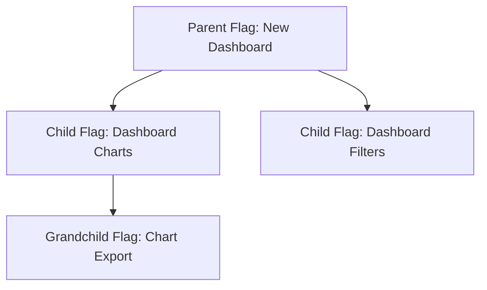
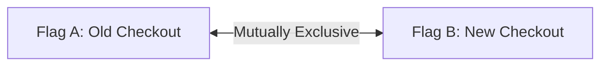
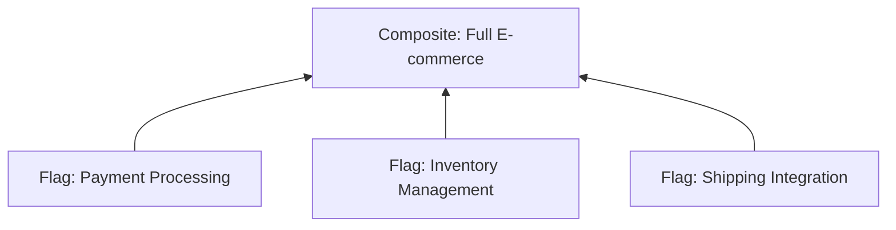
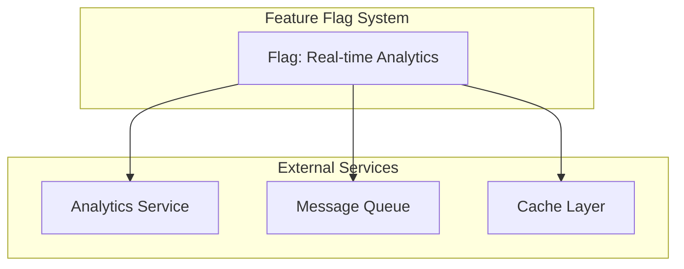
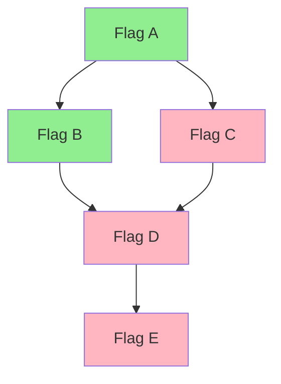
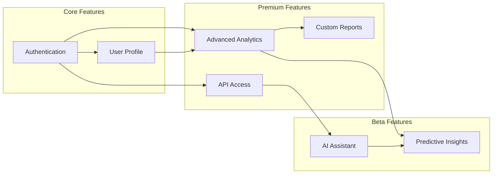

# How to Build Flag Dependencies

Author: [nawazdhandala](https://github.com/nawazdhandala)

Tags: Feature Flags, Dependencies, Architecture, Development

Description: Learn how to manage dependencies between feature flags effectively.

---

Feature flags are powerful tools for controlling feature rollouts, but as your system grows, you'll encounter situations where flags depend on each other. Managing these dependencies effectively is crucial for maintaining a stable and predictable system. In this post, we'll explore how to build and manage flag dependencies in feature flag systems.

## Understanding Dependency Types and Patterns

Flag dependencies come in several forms, each with its own characteristics and challenges.

### Hierarchical Dependencies

The most common pattern is hierarchical dependencies, where one flag requires another to be enabled.



In this pattern, enabling "Dashboard Charts" only makes sense if "New Dashboard" is enabled. Here's how to implement this:

```typescript
interface FeatureFlag {
  key: string;
  enabled: boolean;
  dependencies?: string[];
}

class FlagDependencyManager {
  private flags: Map<string, FeatureFlag> = new Map();

  registerFlag(flag: FeatureFlag): void {
    this.flags.set(flag.key, flag);
  }

  isEnabled(flagKey: string): boolean {
    const flag = this.flags.get(flagKey);
    if (!flag) return false;
    if (!flag.enabled) return false;

    // Check all dependencies are enabled
    if (flag.dependencies) {
      for (const depKey of flag.dependencies) {
        if (!this.isEnabled(depKey)) {
          return false;
        }
      }
    }

    return true;
  }
}

// Usage
const manager = new FlagDependencyManager();

manager.registerFlag({
  key: 'new-dashboard',
  enabled: true,
});

manager.registerFlag({
  key: 'dashboard-charts',
  enabled: true,
  dependencies: ['new-dashboard'],
});

console.log(manager.isEnabled('dashboard-charts')); // true only if new-dashboard is also enabled
```

### Mutual Exclusion Dependencies

Sometimes flags should never be enabled simultaneously. This is common during A/B testing or gradual migrations.



```typescript
interface MutualExclusionGroup {
  name: string;
  flags: string[];
}

class ExclusiveFlagManager {
  private exclusionGroups: MutualExclusionGroup[] = [];
  private enabledFlags: Set<string> = new Set();

  addExclusionGroup(group: MutualExclusionGroup): void {
    this.exclusionGroups.push(group);
  }

  enableFlag(flagKey: string): boolean {
    // Check if enabling this flag violates any exclusion group
    for (const group of this.exclusionGroups) {
      if (group.flags.includes(flagKey)) {
        for (const otherFlag of group.flags) {
          if (otherFlag !== flagKey && this.enabledFlags.has(otherFlag)) {
            console.warn(
              `Cannot enable ${flagKey}: conflicts with ${otherFlag} in group ${group.name}`
            );
            return false;
          }
        }
      }
    }

    this.enabledFlags.add(flagKey);
    return true;
  }
}

// Usage
const exclusiveManager = new ExclusiveFlagManager();

exclusiveManager.addExclusionGroup({
  name: 'checkout-versions',
  flags: ['old-checkout', 'new-checkout'],
});

exclusiveManager.enableFlag('old-checkout'); // true
exclusiveManager.enableFlag('new-checkout'); // false - conflicts with old-checkout
```

## Cross-Flag Relationships

In complex systems, flags often have intricate relationships that span multiple features or domains.

### Composite Flags

Composite flags aggregate the state of multiple underlying flags:



```typescript
interface CompositeFlag {
  key: string;
  requiredFlags: string[];
  optionalFlags?: string[];
  minOptionalRequired?: number;
}

class CompositeFlagEvaluator {
  private flags: Map<string, boolean> = new Map();
  private composites: Map<string, CompositeFlag> = new Map();

  setFlagState(key: string, enabled: boolean): void {
    this.flags.set(key, enabled);
  }

  registerComposite(composite: CompositeFlag): void {
    this.composites.set(composite.key, composite);
  }

  evaluateComposite(compositeKey: string): boolean {
    const composite = this.composites.get(compositeKey);
    if (!composite) return false;

    // All required flags must be enabled
    for (const required of composite.requiredFlags) {
      if (!this.flags.get(required)) {
        return false;
      }
    }

    // Check optional flags if specified
    if (composite.optionalFlags && composite.minOptionalRequired) {
      const enabledOptional = composite.optionalFlags.filter(
        (key) => this.flags.get(key)
      ).length;

      if (enabledOptional < composite.minOptionalRequired) {
        return false;
      }
    }

    return true;
  }
}

// Usage
const evaluator = new CompositeFlagEvaluator();

evaluator.setFlagState('payment-processing', true);
evaluator.setFlagState('inventory-management', true);
evaluator.setFlagState('shipping-integration', true);

evaluator.registerComposite({
  key: 'full-ecommerce',
  requiredFlags: ['payment-processing', 'inventory-management'],
  optionalFlags: ['shipping-integration', 'tax-calculation', 'loyalty-program'],
  minOptionalRequired: 1,
});

console.log(evaluator.evaluateComposite('full-ecommerce')); // true
```

## Service Dependencies

Feature flags often depend on external services being available and healthy.



```typescript
interface ServiceHealth {
  serviceName: string;
  isHealthy: boolean;
  lastChecked: Date;
}

interface ServiceDependentFlag {
  key: string;
  enabled: boolean;
  requiredServices: string[];
  gracefulDegradation?: boolean;
}

class ServiceAwareFlagManager {
  private flags: Map<string, ServiceDependentFlag> = new Map();
  private serviceHealth: Map<string, ServiceHealth> = new Map();

  registerFlag(flag: ServiceDependentFlag): void {
    this.flags.set(flag.key, flag);
  }

  updateServiceHealth(health: ServiceHealth): void {
    this.serviceHealth.set(health.serviceName, health);
  }

  isEnabled(flagKey: string): boolean {
    const flag = this.flags.get(flagKey);
    if (!flag || !flag.enabled) return false;

    const unhealthyServices: string[] = [];

    for (const service of flag.requiredServices) {
      const health = this.serviceHealth.get(service);
      if (!health || !health.isHealthy) {
        unhealthyServices.push(service);
      }
    }

    if (unhealthyServices.length > 0) {
      if (flag.gracefulDegradation) {
        console.warn(
          `Flag ${flagKey} running in degraded mode. Unhealthy services: ${unhealthyServices.join(', ')}`
        );
        return true; // Allow degraded operation
      }
      return false;
    }

    return true;
  }

  async checkAllServices(): Promise<void> {
    // Implementation would ping each service
    // and update health status
  }
}

// Usage
const serviceManager = new ServiceAwareFlagManager();

serviceManager.registerFlag({
  key: 'real-time-analytics',
  enabled: true,
  requiredServices: ['analytics-service', 'message-queue', 'cache-layer'],
  gracefulDegradation: false,
});

serviceManager.updateServiceHealth({
  serviceName: 'analytics-service',
  isHealthy: true,
  lastChecked: new Date(),
});
```

## Configuration Dependencies

Flags may depend on specific configuration values being present and valid.

```typescript
interface ConfigDependency {
  configKey: string;
  validator?: (value: any) => boolean;
  requiredValue?: any;
}

interface ConfigDependentFlag {
  key: string;
  enabled: boolean;
  configDependencies: ConfigDependency[];
}

class ConfigAwareFlagManager {
  private flags: Map<string, ConfigDependentFlag> = new Map();
  private config: Map<string, any> = new Map();

  registerFlag(flag: ConfigDependentFlag): void {
    this.flags.set(flag.key, flag);
  }

  setConfig(key: string, value: any): void {
    this.config.set(key, value);
  }

  isEnabled(flagKey: string): boolean {
    const flag = this.flags.get(flagKey);
    if (!flag || !flag.enabled) return false;

    for (const dep of flag.configDependencies) {
      const configValue = this.config.get(dep.configKey);

      // Check if config exists
      if (configValue === undefined) {
        console.warn(`Missing config: ${dep.configKey} for flag ${flagKey}`);
        return false;
      }

      // Check required value
      if (dep.requiredValue !== undefined && configValue !== dep.requiredValue) {
        return false;
      }

      // Run custom validator
      if (dep.validator && !dep.validator(configValue)) {
        console.warn(`Config validation failed: ${dep.configKey} for flag ${flagKey}`);
        return false;
      }
    }

    return true;
  }
}

// Usage
const configManager = new ConfigAwareFlagManager();

configManager.registerFlag({
  key: 'advanced-encryption',
  enabled: true,
  configDependencies: [
    {
      configKey: 'encryption.algorithm',
      requiredValue: 'AES-256',
    },
    {
      configKey: 'encryption.keyRotationDays',
      validator: (value) => typeof value === 'number' && value <= 90,
    },
  ],
});

configManager.setConfig('encryption.algorithm', 'AES-256');
configManager.setConfig('encryption.keyRotationDays', 30);

console.log(configManager.isEnabled('advanced-encryption')); // true
```

## Dependency Resolution

When dealing with complex dependency graphs, you need a systematic approach to resolve dependencies.



```typescript
interface DependencyNode {
  key: string;
  enabled: boolean;
  dependencies: string[];
}

class DependencyResolver {
  private nodes: Map<string, DependencyNode> = new Map();

  addNode(node: DependencyNode): void {
    this.nodes.set(node.key, node);
  }

  // Topological sort to determine evaluation order
  getEvaluationOrder(): string[] {
    const visited = new Set<string>();
    const result: string[] = [];

    const visit = (key: string, ancestors: Set<string> = new Set()): void => {
      if (ancestors.has(key)) {
        throw new Error(`Circular dependency detected: ${key}`);
      }
      if (visited.has(key)) return;

      ancestors.add(key);
      const node = this.nodes.get(key);

      if (node) {
        for (const dep of node.dependencies) {
          visit(dep, new Set(ancestors));
        }
      }

      visited.add(key);
      result.push(key);
    };

    for (const key of this.nodes.keys()) {
      visit(key);
    }

    return result;
  }

  // Resolve all flags in correct order
  resolveAll(): Map<string, boolean> {
    const order = this.getEvaluationOrder();
    const resolved = new Map<string, boolean>();

    for (const key of order) {
      const node = this.nodes.get(key);
      if (!node) {
        resolved.set(key, false);
        continue;
      }

      // Check if all dependencies are resolved and enabled
      const depsEnabled = node.dependencies.every(
        (dep) => resolved.get(dep) === true
      );

      resolved.set(key, node.enabled && depsEnabled);
    }

    return resolved;
  }

  // Find all flags affected by changing a specific flag
  findAffectedFlags(flagKey: string): string[] {
    const affected: string[] = [];

    const findDependents = (key: string): void => {
      for (const [nodeKey, node] of this.nodes) {
        if (node.dependencies.includes(key) && !affected.includes(nodeKey)) {
          affected.push(nodeKey);
          findDependents(nodeKey);
        }
      }
    };

    findDependents(flagKey);
    return affected;
  }
}

// Usage
const resolver = new DependencyResolver();

resolver.addNode({ key: 'flag-e', enabled: true, dependencies: [] });
resolver.addNode({ key: 'flag-d', enabled: true, dependencies: ['flag-e'] });
resolver.addNode({ key: 'flag-b', enabled: true, dependencies: ['flag-d'] });
resolver.addNode({ key: 'flag-c', enabled: false, dependencies: ['flag-d'] });
resolver.addNode({ key: 'flag-a', enabled: true, dependencies: ['flag-b', 'flag-c'] });

console.log('Evaluation order:', resolver.getEvaluationOrder());
// ['flag-e', 'flag-d', 'flag-b', 'flag-c', 'flag-a']

console.log('Resolved states:', resolver.resolveAll());
// flag-e: true, flag-d: true, flag-b: true, flag-c: false, flag-a: false

console.log('Flags affected by flag-d:', resolver.findAffectedFlags('flag-d'));
// ['flag-b', 'flag-c', 'flag-a']
```

## Impact Analysis

Before changing a flag's state, it's crucial to understand the potential impact on the system.

```typescript
interface ImpactReport {
  flagKey: string;
  directDependents: string[];
  transitiveDependents: string[];
  affectedServices: string[];
  riskLevel: 'low' | 'medium' | 'high' | 'critical';
  warnings: string[];
}

class ImpactAnalyzer {
  private resolver: DependencyResolver;
  private serviceMap: Map<string, string[]> = new Map(); // flag -> services

  constructor(resolver: DependencyResolver) {
    this.resolver = resolver;
  }

  registerFlagServices(flagKey: string, services: string[]): void {
    this.serviceMap.set(flagKey, services);
  }

  analyzeDisable(flagKey: string): ImpactReport {
    const affected = this.resolver.findAffectedFlags(flagKey);
    const directDependents = affected.filter((key) => {
      const node = this.resolver['nodes'].get(key);
      return node?.dependencies.includes(flagKey);
    });

    const transitiveDependents = affected.filter(
      (key) => !directDependents.includes(key)
    );

    // Collect all affected services
    const affectedServices = new Set<string>();
    const flagServices = this.serviceMap.get(flagKey) || [];
    flagServices.forEach((s) => affectedServices.add(s));

    for (const dep of affected) {
      const services = this.serviceMap.get(dep) || [];
      services.forEach((s) => affectedServices.add(s));
    }

    // Determine risk level
    let riskLevel: 'low' | 'medium' | 'high' | 'critical' = 'low';
    const warnings: string[] = [];

    if (affected.length > 10) {
      riskLevel = 'critical';
      warnings.push(`High cascade effect: ${affected.length} flags affected`);
    } else if (affected.length > 5) {
      riskLevel = 'high';
    } else if (affected.length > 2) {
      riskLevel = 'medium';
    }

    if (affectedServices.size > 3) {
      riskLevel = riskLevel === 'low' ? 'medium' : riskLevel;
      warnings.push(`Multiple services affected: ${Array.from(affectedServices).join(', ')}`);
    }

    return {
      flagKey,
      directDependents,
      transitiveDependents,
      affectedServices: Array.from(affectedServices),
      riskLevel,
      warnings,
    };
  }

  generateReport(flagKey: string): string {
    const impact = this.analyzeDisable(flagKey);

    return `
Impact Analysis Report for: ${impact.flagKey}
================================================
Risk Level: ${impact.riskLevel.toUpperCase()}

Direct Dependents (${impact.directDependents.length}):
${impact.directDependents.map((d) => `  - ${d}`).join('\n') || '  None'}

Transitive Dependents (${impact.transitiveDependents.length}):
${impact.transitiveDependents.map((d) => `  - ${d}`).join('\n') || '  None'}

Affected Services (${impact.affectedServices.length}):
${impact.affectedServices.map((s) => `  - ${s}`).join('\n') || '  None'}

Warnings:
${impact.warnings.map((w) => `  ! ${w}`).join('\n') || '  None'}
    `.trim();
  }
}

// Usage
const analyzer = new ImpactAnalyzer(resolver);

analyzer.registerFlagServices('flag-d', ['api-gateway', 'user-service']);
analyzer.registerFlagServices('flag-b', ['payment-service']);
analyzer.registerFlagServices('flag-a', ['frontend', 'mobile-app']);

console.log(analyzer.generateReport('flag-d'));
```

## Best Practices for Flag Dependencies

### 1. Document Dependencies Explicitly

Always document your flag dependencies in a central location:

```typescript
// flag-registry.ts
export const FLAG_REGISTRY = {
  'new-dashboard': {
    description: 'Enables the redesigned dashboard',
    dependencies: [],
    owner: 'frontend-team',
    services: ['dashboard-service'],
  },
  'dashboard-charts': {
    description: 'Enables chart widgets on the dashboard',
    dependencies: ['new-dashboard'],
    owner: 'frontend-team',
    services: ['dashboard-service', 'analytics-service'],
  },
} as const;
```

### 2. Implement Validation on Flag Changes

```typescript
class FlagChangeValidator {
  validateChange(flagKey: string, newState: boolean, analyzer: ImpactAnalyzer): {
    allowed: boolean;
    reason?: string;
    requiresApproval?: boolean;
  } {
    if (newState === true) {
      // Enabling a flag - check dependencies are met
      return { allowed: true };
    }

    // Disabling a flag - check impact
    const impact = analyzer.analyzeDisable(flagKey);

    if (impact.riskLevel === 'critical') {
      return {
        allowed: false,
        reason: 'Critical impact detected. Requires manual review.',
        requiresApproval: true,
      };
    }

    if (impact.riskLevel === 'high') {
      return {
        allowed: true,
        requiresApproval: true,
      };
    }

    return { allowed: true };
  }
}
```

### 3. Use Visualization Tools

Create dependency graphs for easy understanding:



## Conclusion

Building effective flag dependencies requires careful planning and robust tooling. Key takeaways:

1. **Identify dependency types early** - Understand whether you're dealing with hierarchical, mutual exclusion, or composite dependencies.

2. **Implement proper resolution** - Use topological sorting to handle complex dependency graphs and detect circular dependencies.

3. **Consider external factors** - Service health and configuration states can be critical dependencies that shouldn't be overlooked.

4. **Analyze impact before changes** - Always understand the downstream effects of flag changes before making them.

5. **Document and visualize** - Clear documentation and visual dependency graphs help teams understand and maintain flag relationships.

By following these patterns and practices, you can build a feature flag system that scales with your application while remaining maintainable and predictable.
