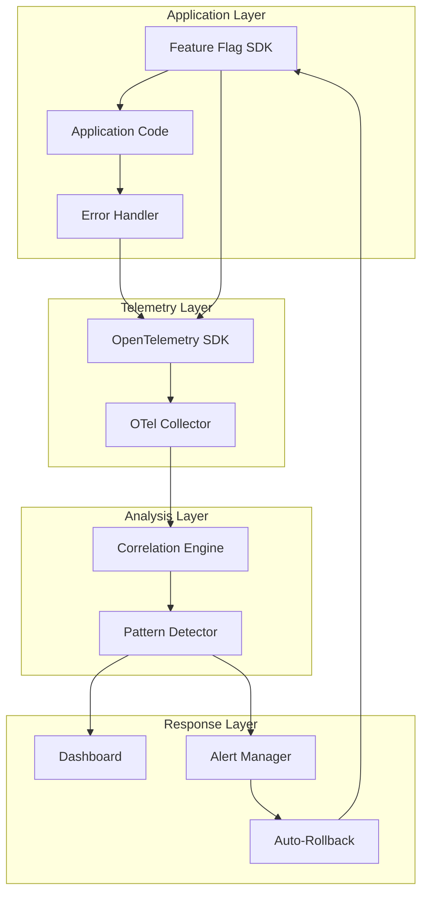
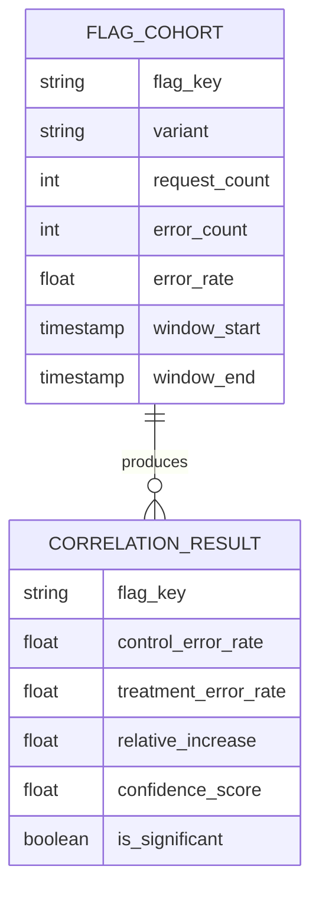
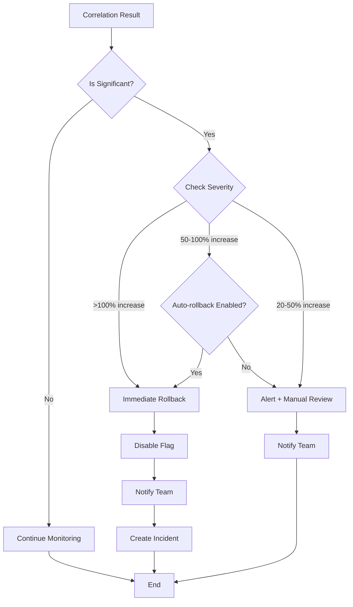
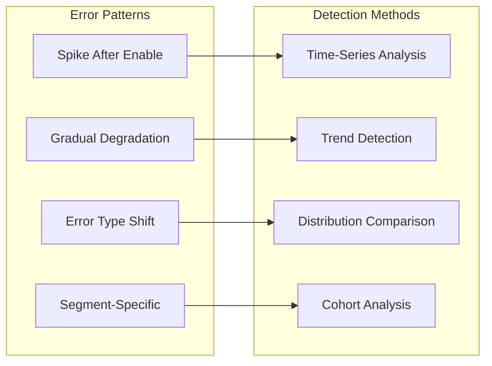
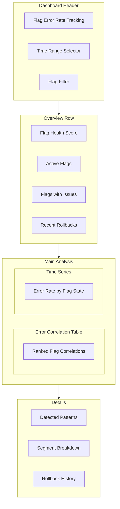

# How to Create Flag Error Rate Tracking

Author: [nawazdhandala](https://github.com/nawazdhandala)

Tags: Feature Flags, Error Tracking, Monitoring, Observability

Description: Learn how to track error rates correlated with feature flag states.

---

Feature flags let you ship code without shipping risk. But what happens when a flag causes errors? If you cannot correlate failures with flag states, you are flying blind. This guide shows you how to build flag error rate tracking from scratch, complete with automatic rollback triggers, dashboards, and alerting.

---

## Table of Contents

1. Why Flag-Correlated Error Tracking Matters
2. Core Architecture
3. Instrumenting Error Rates by Flag State
4. Building the Correlation Layer
5. Automatic Rollback Triggers
6. Error Pattern Detection
7. Dashboard Setup
8. Alert Configuration
9. Production-Ready Implementation
10. Best Practices

---

## 1. Why Flag-Correlated Error Tracking Matters

Traditional error monitoring tells you that errors increased. Flag-correlated tracking tells you **which flag caused it**.

| Without Flag Correlation | With Flag Correlation |
|--------------------------|----------------------|
| "Error rate spiked at 2:30pm" | "Error rate for users with `new-checkout=true` is 5x higher" |
| "500 errors increased" | "Flag `payment-v2` correlates with 90% of payment failures" |
| "Investigate everything" | "Disable `new-checkout` flag to mitigate" |

The difference: minutes of investigation versus hours of guesswork.

---

## 2. Core Architecture

The system has four main components working together:



**Data flow:**
1. Feature flag SDK evaluates flags and emits evaluation events
2. Application code runs with flag context attached
3. Errors are captured with flag state as attributes
4. Correlation engine compares error rates between flag cohorts
5. Pattern detector identifies statistically significant differences
6. Alerts trigger automatic rollback when thresholds breach

---

## 3. Instrumenting Error Rates by Flag State

The foundation is attaching flag state to every error and request span.

### Flag Context Provider

```typescript
// flag-context.ts
import { context, trace, Span } from '@opentelemetry/api';

interface FlagEvaluation {
  flagKey: string;
  value: boolean | string | number;
  variant: string;
  reason: string;
}

// Store active flag evaluations for the current request
const FLAG_CONTEXT_KEY = Symbol('flag-context');

export class FlagContext {
  private evaluations: Map<string, FlagEvaluation> = new Map();

  record(evaluation: FlagEvaluation): void {
    this.evaluations.set(evaluation.flagKey, evaluation);

    // Attach to current span immediately
    const span = trace.getActiveSpan();
    if (span) {
      span.setAttribute(`flag.${evaluation.flagKey}`, String(evaluation.value));
      span.setAttribute(`flag.${evaluation.flagKey}.variant`, evaluation.variant);
    }
  }

  getAll(): Map<string, FlagEvaluation> {
    return new Map(this.evaluations);
  }

  toAttributes(): Record<string, string> {
    const attrs: Record<string, string> = {};
    for (const [key, eval] of this.evaluations) {
      attrs[`flag.${key}`] = String(eval.value);
      attrs[`flag.${key}.variant`] = eval.variant;
    }
    return attrs;
  }
}

export function getFlagContext(): FlagContext {
  return (context.active().getValue(FLAG_CONTEXT_KEY) as FlagContext)
    || new FlagContext();
}

export function withFlagContext<T>(fn: () => T): T {
  const flagContext = new FlagContext();
  return context.with(
    context.active().setValue(FLAG_CONTEXT_KEY, flagContext),
    fn
  );
}
```

### Instrumented Flag Client

```typescript
// flag-client.ts
import { trace, metrics, SpanStatusCode } from '@opentelemetry/api';
import { getFlagContext, FlagEvaluation } from './flag-context';

const tracer = trace.getTracer('feature-flags');
const meter = metrics.getMeter('feature-flags');

// Metrics for flag evaluations
const flagEvaluationCounter = meter.createCounter('flag.evaluations', {
  description: 'Number of flag evaluations',
});

const flagErrorCounter = meter.createCounter('flag.evaluation_errors', {
  description: 'Number of flag evaluation errors',
});

interface FlagClient {
  getBooleanValue(flagKey: string, defaultValue: boolean): Promise<boolean>;
}

export class InstrumentedFlagClient implements FlagClient {
  constructor(private underlying: FlagClient) {}

  async getBooleanValue(flagKey: string, defaultValue: boolean): Promise<boolean> {
    const span = tracer.startSpan('flag.evaluate', {
      attributes: {
        'flag.key': flagKey,
        'flag.default_value': defaultValue,
      },
    });

    try {
      const value = await this.underlying.getBooleanValue(flagKey, defaultValue);
      const variant = value ? 'treatment' : 'control';

      // Record evaluation
      const evaluation: FlagEvaluation = {
        flagKey,
        value,
        variant,
        reason: 'rule-match',
      };

      getFlagContext().record(evaluation);

      // Emit metrics
      flagEvaluationCounter.add(1, {
        'flag.key': flagKey,
        'flag.variant': variant,
        'flag.value': String(value),
      });

      span.setAttribute('flag.value', value);
      span.setAttribute('flag.variant', variant);
      span.setStatus({ code: SpanStatusCode.OK });

      return value;
    } catch (error: any) {
      flagErrorCounter.add(1, { 'flag.key': flagKey });
      span.recordException(error);
      span.setStatus({ code: SpanStatusCode.ERROR, message: error.message });
      return defaultValue;
    } finally {
      span.end();
    }
  }
}
```

### Error Handler with Flag Context

```typescript
// error-handler.ts
import { trace, metrics, SpanStatusCode } from '@opentelemetry/api';
import { getFlagContext } from './flag-context';

const meter = metrics.getMeter('application-errors');

const errorCounter = meter.createCounter('app.errors', {
  description: 'Application errors with flag context',
});

const errorsByFlagCounter = meter.createCounter('app.errors_by_flag', {
  description: 'Errors attributed to specific flag states',
});

interface ErrorContext {
  error: Error;
  operation: string;
  userId?: string;
  metadata?: Record<string, string>;
}

export function recordError(ctx: ErrorContext): void {
  const span = trace.getActiveSpan();
  const flagContext = getFlagContext();
  const flagAttributes = flagContext.toAttributes();

  // Record on span
  if (span) {
    span.recordException(ctx.error);
    span.setStatus({ code: SpanStatusCode.ERROR, message: ctx.error.message });

    // Add flag context to span
    for (const [key, value] of Object.entries(flagAttributes)) {
      span.setAttribute(key, value);
    }
  }

  // Emit general error metric
  errorCounter.add(1, {
    'error.type': ctx.error.name,
    'error.operation': ctx.operation,
    ...flagAttributes,
  });

  // Emit flag-specific error metrics for correlation
  for (const [flagKey, evaluation] of flagContext.getAll()) {
    errorsByFlagCounter.add(1, {
      'flag.key': flagKey,
      'flag.value': String(evaluation.value),
      'flag.variant': evaluation.variant,
      'error.type': ctx.error.name,
      'error.operation': ctx.operation,
    });
  }
}
```

---

## 4. Building the Correlation Layer

The correlation layer compares error rates between flag cohorts to identify problematic flags.

### Correlation Data Model



### Correlation Engine

```typescript
// correlation-engine.ts
interface CohortMetrics {
  flagKey: string;
  variant: string;
  requestCount: number;
  errorCount: number;
  errorRate: number;
  windowStart: Date;
  windowEnd: Date;
}

interface CorrelationResult {
  flagKey: string;
  controlErrorRate: number;
  treatmentErrorRate: number;
  relativeIncrease: number; // (treatment - control) / control
  absoluteIncrease: number; // treatment - control
  confidenceScore: number;  // Statistical confidence (0-1)
  isSignificant: boolean;
  recommendation: 'none' | 'investigate' | 'rollback';
}

export class CorrelationEngine {
  // Minimum sample size for statistical significance
  private readonly minSampleSize = 100;
  // Minimum relative increase to consider significant
  private readonly significanceThreshold = 0.20; // 20% increase
  // Confidence level for statistical test
  private readonly confidenceLevel = 0.95;

  async computeCorrelations(
    metrics: CohortMetrics[]
  ): Promise<CorrelationResult[]> {
    // Group metrics by flag key
    const byFlag = new Map<string, CohortMetrics[]>();
    for (const m of metrics) {
      const existing = byFlag.get(m.flagKey) || [];
      existing.push(m);
      byFlag.set(m.flagKey, existing);
    }

    const results: CorrelationResult[] = [];

    for (const [flagKey, cohorts] of byFlag) {
      const control = cohorts.find(c => c.variant === 'control');
      const treatment = cohorts.find(c => c.variant === 'treatment');

      if (!control || !treatment) continue;

      const result = this.computeCorrelation(flagKey, control, treatment);
      results.push(result);
    }

    return results.sort((a, b) => b.relativeIncrease - a.relativeIncrease);
  }

  private computeCorrelation(
    flagKey: string,
    control: CohortMetrics,
    treatment: CohortMetrics
  ): CorrelationResult {
    const controlRate = control.errorRate;
    const treatmentRate = treatment.errorRate;

    // Avoid division by zero
    const relativeIncrease = controlRate > 0
      ? (treatmentRate - controlRate) / controlRate
      : treatmentRate > 0 ? Infinity : 0;

    const absoluteIncrease = treatmentRate - controlRate;

    // Chi-squared test for statistical significance
    const confidenceScore = this.computeConfidence(control, treatment);

    const isSignificant =
      control.requestCount >= this.minSampleSize &&
      treatment.requestCount >= this.minSampleSize &&
      relativeIncrease >= this.significanceThreshold &&
      confidenceScore >= this.confidenceLevel;

    // Determine recommendation
    let recommendation: 'none' | 'investigate' | 'rollback' = 'none';
    if (isSignificant) {
      if (relativeIncrease >= 1.0) { // 100% increase or more
        recommendation = 'rollback';
      } else {
        recommendation = 'investigate';
      }
    }

    return {
      flagKey,
      controlErrorRate: controlRate,
      treatmentErrorRate: treatmentRate,
      relativeIncrease,
      absoluteIncrease,
      confidenceScore,
      isSignificant,
      recommendation,
    };
  }

  private computeConfidence(
    control: CohortMetrics,
    treatment: CohortMetrics
  ): number {
    // Simplified two-proportion z-test
    const n1 = control.requestCount;
    const n2 = treatment.requestCount;
    const p1 = control.errorRate;
    const p2 = treatment.errorRate;

    if (n1 === 0 || n2 === 0) return 0;

    const pooledP = (p1 * n1 + p2 * n2) / (n1 + n2);
    const se = Math.sqrt(pooledP * (1 - pooledP) * (1/n1 + 1/n2));

    if (se === 0) return p1 === p2 ? 0 : 1;

    const z = Math.abs(p2 - p1) / se;

    // Convert z-score to confidence (simplified)
    // z=1.96 corresponds to 95% confidence
    return Math.min(1, z / 1.96 * 0.95);
  }
}
```

### Query for Cohort Metrics

```sql
-- Prometheus/PromQL query for error rates by flag cohort
-- Control group error rate
sum(rate(app_errors_by_flag_total{flag_key="new-checkout", flag_variant="control"}[5m]))
/
sum(rate(http_requests_total{flag_new_checkout="false"}[5m]))

-- Treatment group error rate
sum(rate(app_errors_by_flag_total{flag_key="new-checkout", flag_variant="treatment"}[5m]))
/
sum(rate(http_requests_total{flag_new_checkout="true"}[5m]))
```

---

## 5. Automatic Rollback Triggers

When error correlation exceeds thresholds, trigger automatic rollback.

### Rollback Decision Flow



### Rollback Controller

```typescript
// rollback-controller.ts
import { trace, metrics } from '@opentelemetry/api';
import { CorrelationResult } from './correlation-engine';

const tracer = trace.getTracer('rollback-controller');
const meter = metrics.getMeter('rollback-controller');

const rollbackCounter = meter.createCounter('flag.rollbacks', {
  description: 'Automatic flag rollbacks triggered',
});

interface RollbackConfig {
  flagKey: string;
  autoRollbackEnabled: boolean;
  rollbackThreshold: number;    // Relative increase threshold (e.g., 1.0 = 100%)
  alertThreshold: number;       // Alert threshold (e.g., 0.2 = 20%)
  cooldownMinutes: number;      // Minimum time between rollbacks
}

interface FlagService {
  disableFlag(flagKey: string, reason: string): Promise<void>;
  getFlagStatus(flagKey: string): Promise<{ enabled: boolean; lastModified: Date }>;
}

interface AlertService {
  sendAlert(alert: {
    severity: 'warning' | 'critical';
    title: string;
    description: string;
    flagKey: string;
    metrics: Record<string, number>;
  }): Promise<void>;
}

interface IncidentService {
  createIncident(incident: {
    title: string;
    description: string;
    severity: 'sev1' | 'sev2' | 'sev3';
    tags: string[];
  }): Promise<string>;
}

export class RollbackController {
  private lastRollback: Map<string, Date> = new Map();

  constructor(
    private flagService: FlagService,
    private alertService: AlertService,
    private incidentService: IncidentService,
    private configs: Map<string, RollbackConfig>
  ) {}

  async evaluateAndAct(results: CorrelationResult[]): Promise<void> {
    for (const result of results) {
      const config = this.configs.get(result.flagKey);
      if (!config) continue;

      await this.processResult(result, config);
    }
  }

  private async processResult(
    result: CorrelationResult,
    config: RollbackConfig
  ): Promise<void> {
    const span = tracer.startSpan('rollback.evaluate', {
      attributes: {
        'flag.key': result.flagKey,
        'correlation.relative_increase': result.relativeIncrease,
        'correlation.is_significant': result.isSignificant,
      },
    });

    try {
      if (!result.isSignificant) {
        span.setAttribute('action', 'none');
        return;
      }

      // Check cooldown
      const lastRollbackTime = this.lastRollback.get(result.flagKey);
      if (lastRollbackTime) {
        const cooldownMs = config.cooldownMinutes * 60 * 1000;
        if (Date.now() - lastRollbackTime.getTime() < cooldownMs) {
          span.setAttribute('action', 'cooldown_active');
          return;
        }
      }

      // Determine action based on severity
      if (result.relativeIncrease >= config.rollbackThreshold) {
        if (config.autoRollbackEnabled) {
          await this.executeRollback(result, config);
          span.setAttribute('action', 'rollback');
        } else {
          await this.sendCriticalAlert(result, config);
          span.setAttribute('action', 'critical_alert');
        }
      } else if (result.relativeIncrease >= config.alertThreshold) {
        await this.sendWarningAlert(result, config);
        span.setAttribute('action', 'warning_alert');
      }
    } finally {
      span.end();
    }
  }

  private async executeRollback(
    result: CorrelationResult,
    config: RollbackConfig
  ): Promise<void> {
    const reason = `Auto-rollback: ${(result.relativeIncrease * 100).toFixed(1)}% error increase detected`;

    // Disable the flag
    await this.flagService.disableFlag(result.flagKey, reason);
    this.lastRollback.set(result.flagKey, new Date());

    // Record metric
    rollbackCounter.add(1, {
      'flag.key': result.flagKey,
      'rollback.trigger': 'error_correlation',
    });

    // Create incident
    const incidentId = await this.incidentService.createIncident({
      title: `Auto-rollback: ${result.flagKey}`,
      description: `
Feature flag "${result.flagKey}" was automatically disabled due to elevated error rates.

**Metrics:**
- Control error rate: ${(result.controlErrorRate * 100).toFixed(2)}%
- Treatment error rate: ${(result.treatmentErrorRate * 100).toFixed(2)}%
- Relative increase: ${(result.relativeIncrease * 100).toFixed(1)}%
- Confidence: ${(result.confidenceScore * 100).toFixed(1)}%

**Action taken:** Flag disabled automatically.

**Next steps:**
1. Investigate root cause
2. Fix underlying issue
3. Re-enable flag with monitoring
      `.trim(),
      severity: 'sev2',
      tags: ['feature-flag', 'auto-rollback', result.flagKey],
    });

    // Notify team
    await this.alertService.sendAlert({
      severity: 'critical',
      title: `Flag "${result.flagKey}" auto-rolled back`,
      description: `Incident ${incidentId} created`,
      flagKey: result.flagKey,
      metrics: {
        controlErrorRate: result.controlErrorRate,
        treatmentErrorRate: result.treatmentErrorRate,
        relativeIncrease: result.relativeIncrease,
      },
    });
  }

  private async sendCriticalAlert(
    result: CorrelationResult,
    config: RollbackConfig
  ): Promise<void> {
    await this.alertService.sendAlert({
      severity: 'critical',
      title: `Flag "${result.flagKey}" causing elevated errors - manual rollback recommended`,
      description: `Error rate increased by ${(result.relativeIncrease * 100).toFixed(1)}%`,
      flagKey: result.flagKey,
      metrics: {
        controlErrorRate: result.controlErrorRate,
        treatmentErrorRate: result.treatmentErrorRate,
        relativeIncrease: result.relativeIncrease,
      },
    });
  }

  private async sendWarningAlert(
    result: CorrelationResult,
    config: RollbackConfig
  ): Promise<void> {
    await this.alertService.sendAlert({
      severity: 'warning',
      title: `Flag "${result.flagKey}" showing elevated error correlation`,
      description: `Error rate increased by ${(result.relativeIncrease * 100).toFixed(1)}% - monitoring closely`,
      flagKey: result.flagKey,
      metrics: {
        controlErrorRate: result.controlErrorRate,
        treatmentErrorRate: result.treatmentErrorRate,
        relativeIncrease: result.relativeIncrease,
      },
    });
  }
}
```

---

## 6. Error Pattern Detection

Beyond simple rate comparison, detect patterns that indicate flag-related issues.

### Pattern Types



### Pattern Detector

```typescript
// pattern-detector.ts
interface TimeSeriesPoint {
  timestamp: Date;
  value: number;
}

interface ErrorDistribution {
  errorType: string;
  count: number;
  percentage: number;
}

interface PatternDetectionResult {
  patternType: 'spike' | 'degradation' | 'type_shift' | 'segment_specific' | 'none';
  confidence: number;
  description: string;
  flagKey: string;
  evidence: Record<string, any>;
}

export class PatternDetector {
  // Detect sudden spike after flag enable
  detectSpikeAfterEnable(
    flagKey: string,
    enableTime: Date,
    errorTimeSeries: TimeSeriesPoint[]
  ): PatternDetectionResult {
    // Split into before/after periods
    const before = errorTimeSeries.filter(p => p.timestamp < enableTime);
    const after = errorTimeSeries.filter(p => p.timestamp >= enableTime);

    if (before.length < 5 || after.length < 5) {
      return { patternType: 'none', confidence: 0, description: '', flagKey, evidence: {} };
    }

    const beforeAvg = this.average(before.map(p => p.value));
    const afterAvg = this.average(after.map(p => p.value));
    const beforeStdDev = this.standardDeviation(before.map(p => p.value));

    // Check if after average is > 2 standard deviations above before average
    const zScore = (afterAvg - beforeAvg) / (beforeStdDev || 1);
    const isSpike = zScore > 2;

    return {
      patternType: isSpike ? 'spike' : 'none',
      confidence: Math.min(1, Math.abs(zScore) / 3),
      description: isSpike
        ? `Error rate spiked from ${(beforeAvg * 100).toFixed(2)}% to ${(afterAvg * 100).toFixed(2)}% after flag enable`
        : '',
      flagKey,
      evidence: {
        beforeAverage: beforeAvg,
        afterAverage: afterAvg,
        zScore,
        enableTime: enableTime.toISOString(),
      },
    };
  }

  // Detect gradual degradation over time
  detectGradualDegradation(
    flagKey: string,
    errorTimeSeries: TimeSeriesPoint[],
    windowMinutes: number = 60
  ): PatternDetectionResult {
    if (errorTimeSeries.length < 10) {
      return { patternType: 'none', confidence: 0, description: '', flagKey, evidence: {} };
    }

    // Calculate linear regression slope
    const values = errorTimeSeries.map(p => p.value);
    const slope = this.linearRegressionSlope(values);

    // Positive slope indicates increasing errors
    const isDegrading = slope > 0.001; // Threshold for meaningful increase
    const percentIncreasePerHour = slope * 60; // Convert to per-hour

    return {
      patternType: isDegrading ? 'degradation' : 'none',
      confidence: Math.min(1, Math.abs(slope) * 1000),
      description: isDegrading
        ? `Error rate increasing by ${(percentIncreasePerHour * 100).toFixed(3)}% per hour`
        : '',
      flagKey,
      evidence: {
        slope,
        percentIncreasePerHour,
        dataPoints: errorTimeSeries.length,
      },
    };
  }

  // Detect shift in error type distribution
  detectErrorTypeShift(
    flagKey: string,
    controlDistribution: ErrorDistribution[],
    treatmentDistribution: ErrorDistribution[]
  ): PatternDetectionResult {
    // Find error types that appear only in treatment or have significantly higher rates
    const newErrors: string[] = [];
    const amplifiedErrors: Array<{ type: string; increase: number }> = [];

    for (const treatment of treatmentDistribution) {
      const control = controlDistribution.find(c => c.errorType === treatment.errorType);

      if (!control) {
        newErrors.push(treatment.errorType);
      } else if (treatment.percentage > control.percentage * 1.5) {
        amplifiedErrors.push({
          type: treatment.errorType,
          increase: (treatment.percentage - control.percentage) / control.percentage,
        });
      }
    }

    const hasShift = newErrors.length > 0 || amplifiedErrors.length > 0;

    return {
      patternType: hasShift ? 'type_shift' : 'none',
      confidence: hasShift ? 0.8 : 0,
      description: hasShift
        ? `New error types: ${newErrors.join(', ')}. Amplified: ${amplifiedErrors.map(e => e.type).join(', ')}`
        : '',
      flagKey,
      evidence: {
        newErrors,
        amplifiedErrors,
      },
    };
  }

  // Detect segment-specific issues (e.g., only affects certain users)
  detectSegmentSpecificIssues(
    flagKey: string,
    segmentMetrics: Array<{
      segment: string;
      controlErrorRate: number;
      treatmentErrorRate: number;
      sampleSize: number;
    }>
  ): PatternDetectionResult {
    const significantSegments = segmentMetrics.filter(s => {
      const increase = (s.treatmentErrorRate - s.controlErrorRate) / (s.controlErrorRate || 0.001);
      return increase > 0.5 && s.sampleSize >= 50; // 50% increase with sufficient sample
    });

    const hasSegmentIssue = significantSegments.length > 0 &&
      significantSegments.length < segmentMetrics.length; // Not all segments affected

    return {
      patternType: hasSegmentIssue ? 'segment_specific' : 'none',
      confidence: hasSegmentIssue ? 0.85 : 0,
      description: hasSegmentIssue
        ? `Issue affects specific segments: ${significantSegments.map(s => s.segment).join(', ')}`
        : '',
      flagKey,
      evidence: {
        affectedSegments: significantSegments,
        totalSegments: segmentMetrics.length,
      },
    };
  }

  private average(values: number[]): number {
    return values.reduce((a, b) => a + b, 0) / values.length;
  }

  private standardDeviation(values: number[]): number {
    const avg = this.average(values);
    const squareDiffs = values.map(v => Math.pow(v - avg, 2));
    return Math.sqrt(this.average(squareDiffs));
  }

  private linearRegressionSlope(values: number[]): number {
    const n = values.length;
    const indices = values.map((_, i) => i);
    const sumX = indices.reduce((a, b) => a + b, 0);
    const sumY = values.reduce((a, b) => a + b, 0);
    const sumXY = indices.reduce((total, x, i) => total + x * values[i], 0);
    const sumXX = indices.reduce((total, x) => total + x * x, 0);

    return (n * sumXY - sumX * sumY) / (n * sumXX - sumX * sumX);
  }
}
```

---

## 7. Dashboard Setup

Build dashboards that surface flag-error correlations at a glance.

### Dashboard Layout



### Grafana Dashboard JSON

```json
{
  "title": "Flag Error Rate Tracking",
  "panels": [
    {
      "title": "Flag Health Score",
      "type": "stat",
      "gridPos": { "x": 0, "y": 0, "w": 6, "h": 4 },
      "targets": [
        {
          "expr": "100 - (sum(flag_correlation_significant) / sum(flag_evaluations_active_flags) * 100)",
          "legendFormat": "Health %"
        }
      ],
      "fieldConfig": {
        "defaults": {
          "thresholds": {
            "steps": [
              { "color": "red", "value": 0 },
              { "color": "yellow", "value": 80 },
              { "color": "green", "value": 95 }
            ]
          }
        }
      }
    },
    {
      "title": "Flags with Significant Error Correlation",
      "type": "table",
      "gridPos": { "x": 0, "y": 4, "w": 12, "h": 8 },
      "targets": [
        {
          "expr": "topk(10, flag_correlation_relative_increase{is_significant=\"true\"})",
          "format": "table",
          "instant": true
        }
      ],
      "transformations": [
        {
          "id": "organize",
          "options": {
            "renameByName": {
              "flag_key": "Flag",
              "Value": "Error Increase %",
              "control_error_rate": "Control Rate",
              "treatment_error_rate": "Treatment Rate"
            }
          }
        }
      ]
    },
    {
      "title": "Error Rate Comparison: $flag",
      "type": "timeseries",
      "gridPos": { "x": 12, "y": 4, "w": 12, "h": 8 },
      "targets": [
        {
          "expr": "sum(rate(app_errors_by_flag_total{flag_key=\"$flag\", flag_variant=\"control\"}[5m])) / sum(rate(http_requests_total{flag_key=\"$flag\", flag_variant=\"control\"}[5m]))",
          "legendFormat": "Control"
        },
        {
          "expr": "sum(rate(app_errors_by_flag_total{flag_key=\"$flag\", flag_variant=\"treatment\"}[5m])) / sum(rate(http_requests_total{flag_key=\"$flag\", flag_variant=\"treatment\"}[5m]))",
          "legendFormat": "Treatment"
        }
      ]
    },
    {
      "title": "Recent Auto-Rollbacks",
      "type": "table",
      "gridPos": { "x": 0, "y": 12, "w": 12, "h": 6 },
      "targets": [
        {
          "expr": "flag_rollbacks_total",
          "format": "table",
          "instant": true
        }
      ]
    },
    {
      "title": "Error Types by Flag State",
      "type": "piechart",
      "gridPos": { "x": 12, "y": 12, "w": 12, "h": 6 },
      "targets": [
        {
          "expr": "sum by (error_type) (app_errors_by_flag_total{flag_key=\"$flag\", flag_variant=\"treatment\"})",
          "legendFormat": "{{error_type}}"
        }
      ]
    }
  ],
  "templating": {
    "list": [
      {
        "name": "flag",
        "type": "query",
        "query": "label_values(flag_evaluations_total, flag_key)",
        "multi": false
      }
    ]
  }
}
```

### Key Metrics to Display

| Panel | Metric | Purpose |
|-------|--------|---------|
| Health Score | `100 - (flags_with_issues / total_flags * 100)` | Overall system health |
| Correlation Table | `flag_correlation_relative_increase` | Identify problematic flags |
| Time Series | `error_rate{variant="treatment"} vs error_rate{variant="control"}` | Visual comparison |
| Rollback History | `flag_rollbacks_total` | Track automatic interventions |
| Pattern Alerts | `pattern_detection_results` | Surface non-obvious issues |

---

## 8. Alert Configuration

Configure alerts that fire before users notice problems.

### Alert Rules

```yaml
# prometheus-alerts.yaml
groups:
  - name: flag-error-correlation
    rules:
      # Critical: High error correlation detected
      - alert: FlagErrorCorrelationCritical
        expr: |
          flag_correlation_relative_increase{is_significant="true"} > 1.0
        for: 2m
        labels:
          severity: critical
          team: platform
        annotations:
          summary: "Flag {{ $labels.flag_key }} causing 100%+ error increase"
          description: |
            Treatment error rate is {{ $value | humanizePercentage }} higher than control.
            Control: {{ $labels.control_error_rate | humanizePercentage }}
            Treatment: {{ $labels.treatment_error_rate | humanizePercentage }}
          runbook_url: https://wiki.example.com/runbooks/flag-error-correlation

      # Warning: Moderate error correlation
      - alert: FlagErrorCorrelationWarning
        expr: |
          flag_correlation_relative_increase{is_significant="true"} > 0.2
          and
          flag_correlation_relative_increase{is_significant="true"} <= 1.0
        for: 5m
        labels:
          severity: warning
          team: platform
        annotations:
          summary: "Flag {{ $labels.flag_key }} showing elevated error correlation"
          description: |
            Treatment error rate is {{ $value | humanizePercentage }} higher than control.

      # Auto-rollback triggered
      - alert: FlagAutoRollbackTriggered
        expr: |
          increase(flag_rollbacks_total[5m]) > 0
        labels:
          severity: critical
          team: platform
        annotations:
          summary: "Auto-rollback triggered for flag {{ $labels.flag_key }}"
          description: |
            Flag was automatically disabled due to error correlation.
            Check incident channel for details.

      # Pattern: Spike after enable
      - alert: FlagErrorSpikeDetected
        expr: |
          pattern_detection_spike_confidence > 0.8
        for: 1m
        labels:
          severity: warning
          team: platform
        annotations:
          summary: "Error spike detected after enabling {{ $labels.flag_key }}"
          description: "{{ $labels.description }}"

      # Pattern: Gradual degradation
      - alert: FlagGradualDegradation
        expr: |
          pattern_detection_degradation_slope > 0.001
        for: 30m
        labels:
          severity: warning
          team: platform
        annotations:
          summary: "Gradual error increase with flag {{ $labels.flag_key }}"
          description: |
            Error rate increasing by {{ $value | humanizePercentage }} per hour.
```

### Alert Routing

```yaml
# alertmanager.yaml
route:
  receiver: default
  routes:
    - match:
        alertname: FlagAutoRollbackTriggered
      receiver: incident-channel
      continue: true

    - match:
        severity: critical
        team: platform
      receiver: platform-oncall
      group_wait: 30s
      group_interval: 5m

    - match:
        severity: warning
        team: platform
      receiver: platform-slack
      group_wait: 5m
      group_interval: 15m

receivers:
  - name: platform-oncall
    pagerduty_configs:
      - service_key: ${PAGERDUTY_KEY}

  - name: platform-slack
    slack_configs:
      - channel: '#platform-alerts'
        title: '{{ .GroupLabels.alertname }}'
        text: '{{ range .Alerts }}{{ .Annotations.description }}{{ end }}'

  - name: incident-channel
    slack_configs:
      - channel: '#incidents'
        title: 'Auto-Rollback: {{ .GroupLabels.flag_key }}'
```

---

## 9. Production-Ready Implementation

Tie everything together into a production service.

### Main Service

```typescript
// flag-error-tracker.ts
import { trace, metrics } from '@opentelemetry/api';
import { CorrelationEngine, CorrelationResult } from './correlation-engine';
import { PatternDetector } from './pattern-detector';
import { RollbackController, RollbackConfig } from './rollback-controller';

const tracer = trace.getTracer('flag-error-tracker');
const meter = metrics.getMeter('flag-error-tracker');

// Export correlation results as metrics for dashboards
const correlationGauge = meter.createObservableGauge('flag_correlation_relative_increase', {
  description: 'Relative error rate increase for treatment vs control',
});

interface MetricsBackend {
  queryCohortMetrics(
    flagKeys: string[],
    windowMinutes: number
  ): Promise<Array<{
    flagKey: string;
    variant: string;
    requestCount: number;
    errorCount: number;
    errorRate: number;
    windowStart: Date;
    windowEnd: Date;
  }>>;

  queryErrorTimeSeries(
    flagKey: string,
    windowMinutes: number
  ): Promise<Array<{ timestamp: Date; value: number }>>;
}

export class FlagErrorTracker {
  private correlationEngine: CorrelationEngine;
  private patternDetector: PatternDetector;
  private rollbackController: RollbackController;
  private lastResults: CorrelationResult[] = [];

  constructor(
    private metricsBackend: MetricsBackend,
    private flagKeys: string[],
    rollbackController: RollbackController
  ) {
    this.correlationEngine = new CorrelationEngine();
    this.patternDetector = new PatternDetector();
    this.rollbackController = rollbackController;

    // Register observable gauge callback
    correlationGauge.addCallback((result) => {
      for (const r of this.lastResults) {
        result.observe(r.relativeIncrease, {
          'flag.key': r.flagKey,
          'is_significant': String(r.isSignificant),
          'control_error_rate': String(r.controlErrorRate),
          'treatment_error_rate': String(r.treatmentErrorRate),
        });
      }
    });
  }

  async runAnalysisCycle(): Promise<void> {
    const span = tracer.startSpan('flag-error-tracker.analysis-cycle');

    try {
      // 1. Fetch cohort metrics
      const cohortMetrics = await this.metricsBackend.queryCohortMetrics(
        this.flagKeys,
        5 // 5-minute window
      );
      span.setAttribute('cohort_metrics_count', cohortMetrics.length);

      // 2. Compute correlations
      const correlations = await this.correlationEngine.computeCorrelations(cohortMetrics);
      this.lastResults = correlations;
      span.setAttribute('correlations_computed', correlations.length);

      // 3. Detect patterns for significant correlations
      for (const correlation of correlations.filter(c => c.isSignificant)) {
        const timeSeries = await this.metricsBackend.queryErrorTimeSeries(
          correlation.flagKey,
          60 // 1-hour window for pattern detection
        );

        const spikeResult = this.patternDetector.detectSpikeAfterEnable(
          correlation.flagKey,
          new Date(Date.now() - 30 * 60 * 1000), // Assume enabled 30 min ago
          timeSeries
        );

        if (spikeResult.patternType !== 'none') {
          span.addEvent('pattern_detected', {
            'flag.key': correlation.flagKey,
            'pattern.type': spikeResult.patternType,
            'pattern.confidence': spikeResult.confidence,
          });
        }
      }

      // 4. Evaluate rollback actions
      await this.rollbackController.evaluateAndAct(correlations);

      span.setAttribute('analysis.success', true);
    } catch (error: any) {
      span.recordException(error);
      throw error;
    } finally {
      span.end();
    }
  }

  // Run continuously
  startPeriodicAnalysis(intervalSeconds: number = 60): void {
    setInterval(() => {
      this.runAnalysisCycle().catch(err => {
        console.error('Analysis cycle failed:', err);
      });
    }, intervalSeconds * 1000);
  }
}
```

### Express Integration

```typescript
// middleware/flag-error-tracking.ts
import { Request, Response, NextFunction } from 'express';
import { withFlagContext, getFlagContext } from '../flag-context';
import { recordError } from '../error-handler';

export function flagErrorTrackingMiddleware() {
  return (req: Request, res: Response, next: NextFunction) => {
    // Wrap request in flag context
    withFlagContext(() => {
      // Capture errors
      const originalEnd = res.end;
      res.end = function(...args: any[]) {
        // Record error if status >= 500
        if (res.statusCode >= 500) {
          recordError({
            error: new Error(`HTTP ${res.statusCode}`),
            operation: `${req.method} ${req.route?.path || req.path}`,
            userId: (req as any).userId,
          });
        }
        return originalEnd.apply(this, args);
      };

      next();
    });
  };
}

// Error handling middleware
export function errorTrackingMiddleware() {
  return (err: Error, req: Request, res: Response, next: NextFunction) => {
    recordError({
      error: err,
      operation: `${req.method} ${req.route?.path || req.path}`,
      userId: (req as any).userId,
    });
    next(err);
  };
}
```

---

## 10. Best Practices

### Do

| Practice | Rationale |
|----------|-----------|
| Attach flag context to every span | Enables correlation even for unexpected errors |
| Set minimum sample sizes | Avoids false positives from small cohorts |
| Use statistical significance tests | Reduces noise from random variation |
| Implement cooldown periods | Prevents rollback thrashing |
| Create incidents on rollback | Ensures issues get investigated |
| Monitor the tracker itself | Meta-observability prevents blind spots |

### Avoid

| Anti-Pattern | Why It Hurts |
|--------------|--------------|
| Alerting on raw error counts | Volume varies with traffic; use rates |
| Ignoring confidence scores | Low-confidence correlations waste time |
| Auto-rolling back without notification | Team loses context on what happened |
| Tracking too many flags | Dilutes signal; focus on risky flags |
| Skipping segment analysis | Misses issues affecting specific user groups |

### Tuning Guide

| Parameter | Start With | Adjust Based On |
|-----------|------------|-----------------|
| Significance threshold | 20% relative increase | False positive rate |
| Confidence level | 95% | Acceptable risk tolerance |
| Minimum sample size | 100 requests | Traffic volume |
| Analysis interval | 60 seconds | Desired detection speed |
| Rollback threshold | 100% increase | Business criticality |
| Cooldown period | 30 minutes | Deployment frequency |

---

## Summary

Flag error rate tracking transforms feature flags from deployment tools into safety nets. By correlating errors with flag states, you gain:

1. **Faster detection** - Know which flag caused the problem in minutes, not hours
2. **Automatic mitigation** - Rollback problematic flags before users complain
3. **Pattern visibility** - Spot gradual degradation and segment-specific issues
4. **Confident releases** - Ship faster knowing the system will catch problems

The key components:

- **Instrumentation layer** attaches flag context to errors and spans
- **Correlation engine** compares error rates between cohorts statistically
- **Pattern detector** identifies spikes, trends, and distribution shifts
- **Rollback controller** takes automatic action when thresholds breach
- **Dashboards and alerts** surface issues and notify the right people

Start with a single high-risk flag, validate the correlation logic works, then expand coverage as you build confidence. Within weeks, you will wonder how you ever shipped features without this safety net.

---

*Ready to implement flag error rate tracking? [OneUptime](https://oneuptime.com) provides built-in feature flag monitoring with OpenTelemetry integration, automatic correlation, and configurable rollback triggers - all in one platform.*

---

### Related Reading

- [The Three Pillars of Observability: Logs, Metrics, and Traces](/blog/post/2025-08-20-three-pillars-of-observability-logs-metrics-traces/)
- [18 SRE Metrics Worth Tracking](/blog/post/2025-11-28-sre-metrics-to-track/)
- [What are Traces and Spans in OpenTelemetry](/blog/post/2025-08-27-traces-and-spans-in-opentelemetry/)
