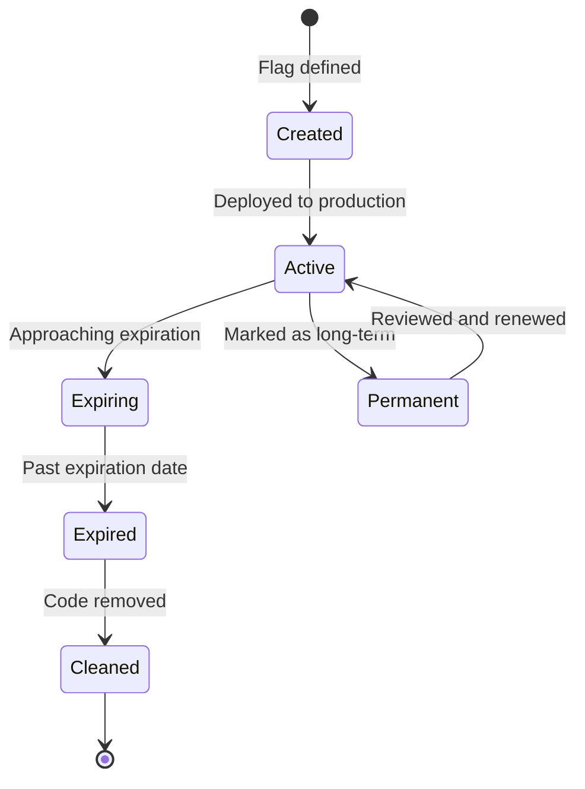
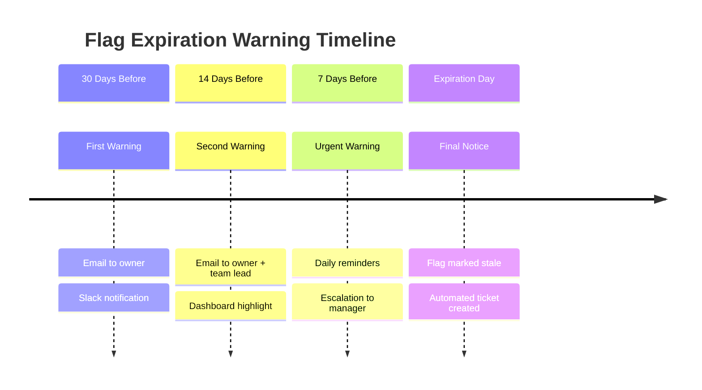
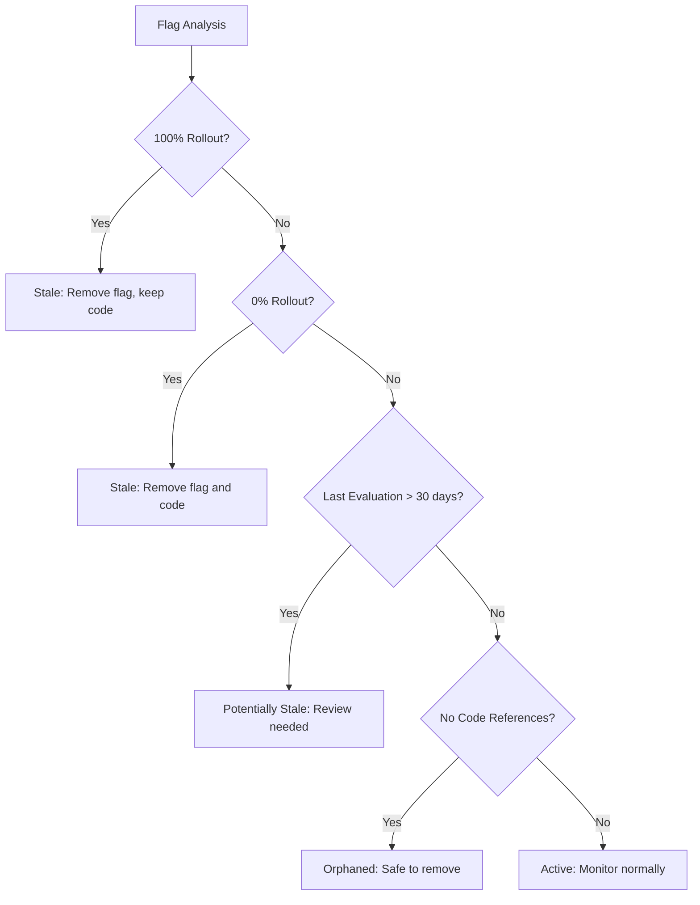
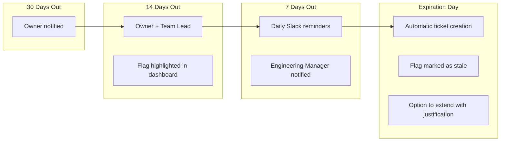
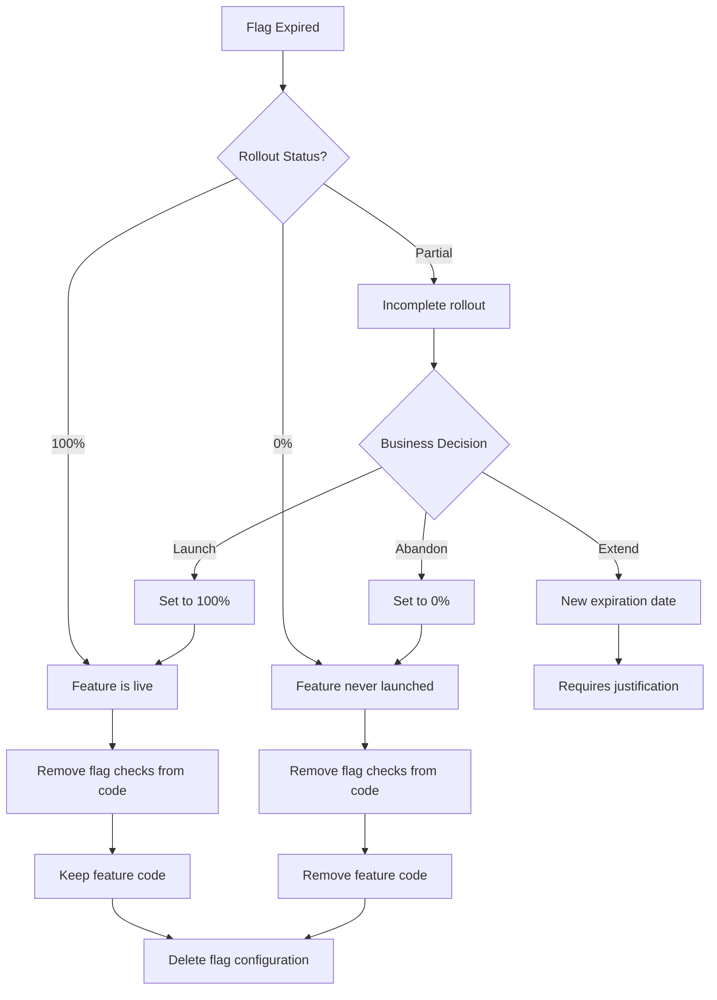
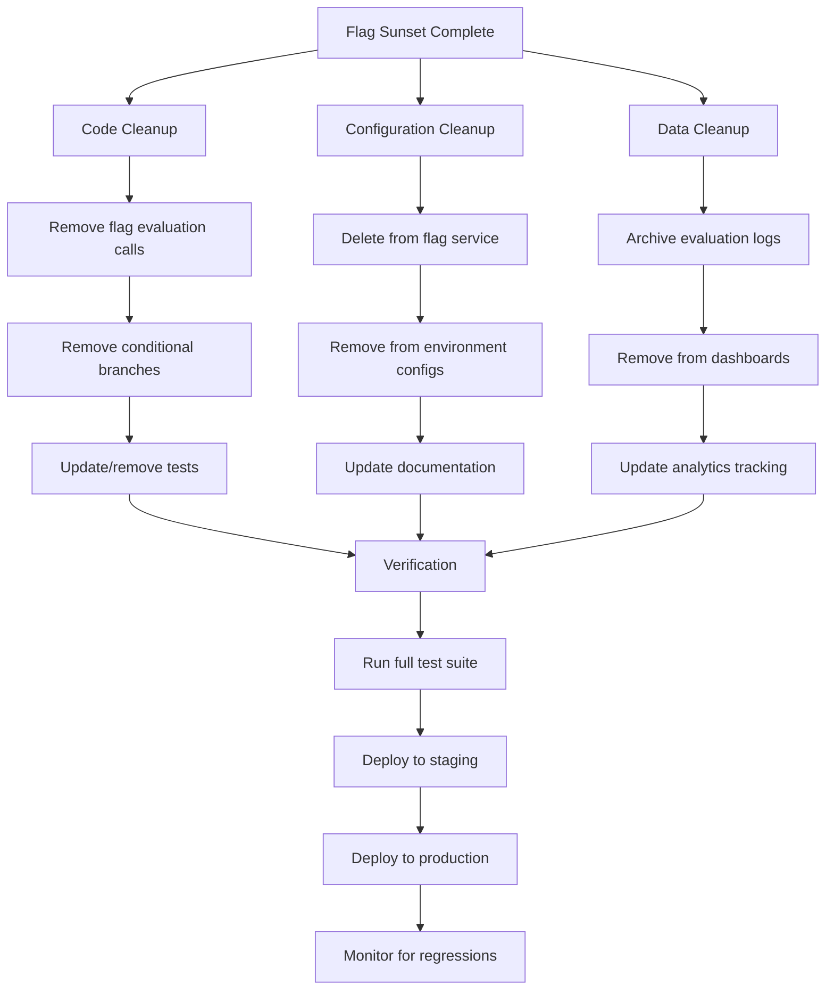
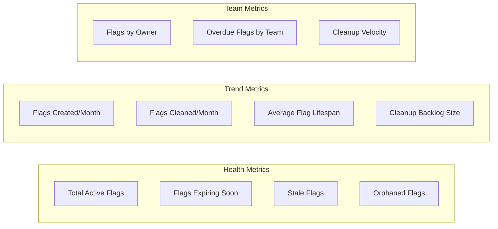

# How to Create Flag Expiration

Author: [nawazdhandala](https://github.com/nawazdhandala)

Tags: Feature Flags, Lifecycle, Expiration, Cleanup

Description: Learn how to implement flag expiration for technical debt prevention.

---

Feature flags are powerful tools for progressive rollouts and experimentation, but they come with a hidden cost: technical debt. Without proper lifecycle management, flags accumulate in your codebase, creating confusion, increasing complexity, and introducing potential bugs. Flag expiration is the systematic approach to ensuring flags don't outlive their usefulness.

## The Feature Flag Lifecycle

Every feature flag should follow a predictable lifecycle from creation to removal.



Understanding this lifecycle is crucial for preventing flag sprawl. Each stage has specific actions and responsibilities that keep your flag inventory healthy.

## Setting Expiration Dates

The foundation of flag lifecycle management is setting meaningful expiration dates at creation time.

### Basic Flag Configuration with Expiration

```typescript
interface FeatureFlag {
  key: string;
  name: string;
  description: string;
  createdAt: Date;
  createdBy: string;
  expirationDate: Date;
  expirationAction: 'warn' | 'disable' | 'remove';
  owner: string;
  tags: string[];
}

// Example flag with expiration
const newCheckoutFlag: FeatureFlag = {
  key: 'new-checkout-flow',
  name: 'New Checkout Flow',
  description: 'Redesigned checkout experience with fewer steps',
  createdAt: new Date('2026-01-30'),
  createdBy: 'engineering@company.com',
  expirationDate: new Date('2026-03-30'), // 60 days from creation
  expirationAction: 'warn',
  owner: 'checkout-team',
  tags: ['checkout', 'ux', 'experiment']
};
```

### Expiration Date Guidelines

Different flag types warrant different expiration windows:

| Flag Type | Recommended Expiration | Rationale |
|-----------|----------------------|-----------|
| Release Toggle | 2-4 weeks | Remove once fully rolled out |
| Experiment | 4-8 weeks | Conclude experiments quickly |
| Ops Toggle | 1-6 months | Review operational flags quarterly |
| Permission Toggle | 6-12 months | Annual access review |
| Kill Switch | No expiration | Keep for emergencies, but review annually |

### Flag Creation Service

```typescript
class FeatureFlagService {
  private defaultExpirationDays: Record<string, number> = {
    release: 30,
    experiment: 60,
    ops: 90,
    permission: 180,
    killswitch: 365
  };

  createFlag(params: {
    key: string;
    name: string;
    type: string;
    owner: string;
    customExpirationDays?: number;
  }): FeatureFlag {
    const expirationDays = params.customExpirationDays
      ?? this.defaultExpirationDays[params.type]
      ?? 30;

    const expirationDate = new Date();
    expirationDate.setDate(expirationDate.getDate() + expirationDays);

    return {
      key: params.key,
      name: params.name,
      description: '',
      createdAt: new Date(),
      createdBy: this.getCurrentUser(),
      expirationDate,
      expirationAction: 'warn',
      owner: params.owner,
      tags: [params.type]
    };
  }

  private getCurrentUser(): string {
    // Implementation depends on your auth system
    return 'system';
  }
}
```

## Automated Expiration Warnings

Proactive notifications prevent flags from silently becoming stale.

### Warning Timeline



### Notification Service Implementation

```typescript
interface ExpirationNotification {
  flagKey: string;
  owner: string;
  daysUntilExpiration: number;
  severity: 'info' | 'warning' | 'urgent' | 'critical';
}

class FlagExpirationNotifier {
  private warningThresholds = [30, 14, 7, 1, 0];

  async checkAndNotify(flags: FeatureFlag[]): Promise<void> {
    const today = new Date();

    for (const flag of flags) {
      const daysUntilExpiration = this.getDaysUntil(flag.expirationDate, today);

      if (this.shouldNotify(daysUntilExpiration)) {
        await this.sendNotification({
          flagKey: flag.key,
          owner: flag.owner,
          daysUntilExpiration,
          severity: this.getSeverity(daysUntilExpiration)
        });
      }
    }
  }

  private getDaysUntil(expiration: Date, today: Date): number {
    const diffTime = expiration.getTime() - today.getTime();
    return Math.ceil(diffTime / (1000 * 60 * 60 * 24));
  }

  private shouldNotify(days: number): boolean {
    return this.warningThresholds.includes(days) || days < 0;
  }

  private getSeverity(days: number): ExpirationNotification['severity'] {
    if (days <= 0) return 'critical';
    if (days <= 7) return 'urgent';
    if (days <= 14) return 'warning';
    return 'info';
  }

  private async sendNotification(notification: ExpirationNotification): Promise<void> {
    // Send to multiple channels based on severity
    if (notification.severity === 'critical') {
      await this.sendSlackMessage(notification);
      await this.sendEmail(notification);
      await this.createJiraTicket(notification);
    } else if (notification.severity === 'urgent') {
      await this.sendSlackMessage(notification);
      await this.sendEmail(notification);
    } else {
      await this.sendSlackMessage(notification);
    }
  }

  private async sendSlackMessage(notification: ExpirationNotification): Promise<void> {
    const message = this.formatSlackMessage(notification);
    // Slack API call
    console.log(`Slack: ${message}`);
  }

  private async sendEmail(notification: ExpirationNotification): Promise<void> {
    // Email service call
    console.log(`Email sent to ${notification.owner}`);
  }

  private async createJiraTicket(notification: ExpirationNotification): Promise<void> {
    // Jira API call
    console.log(`Jira ticket created for ${notification.flagKey}`);
  }

  private formatSlackMessage(notification: ExpirationNotification): string {
    const emoji = {
      info: ':information_source:',
      warning: ':warning:',
      urgent: ':exclamation:',
      critical: ':rotating_light:'
    };

    return `${emoji[notification.severity]} Feature flag \`${notification.flagKey}\` ` +
      `expires in ${notification.daysUntilExpiration} days. Owner: @${notification.owner}`;
  }
}
```

## Stale Flag Detection

Beyond simple date-based expiration, detect flags that are stale based on usage patterns.

### Staleness Indicators



### Stale Flag Detector

```typescript
interface FlagUsageStats {
  flagKey: string;
  lastEvaluated: Date | null;
  evaluationCount30Days: number;
  rolloutPercentage: number;
  codeReferences: number;
}

interface StalenessReport {
  flagKey: string;
  status: 'active' | 'stale' | 'orphaned' | 'fully-rolled-out' | 'never-used';
  recommendation: string;
  confidence: number;
}

class StaleFlagDetector {
  private readonly STALE_DAYS_THRESHOLD = 30;
  private readonly MIN_EVALUATIONS_THRESHOLD = 10;

  async analyzeFlags(
    flags: FeatureFlag[],
    usageStats: FlagUsageStats[]
  ): Promise<StalenessReport[]> {
    const reports: StalenessReport[] = [];

    for (const flag of flags) {
      const stats = usageStats.find(s => s.flagKey === flag.key);

      if (!stats) {
        reports.push({
          flagKey: flag.key,
          status: 'orphaned',
          recommendation: 'No usage data found. Verify flag is properly instrumented or remove.',
          confidence: 0.7
        });
        continue;
      }

      reports.push(this.analyzeFlag(flag, stats));
    }

    return reports;
  }

  private analyzeFlag(flag: FeatureFlag, stats: FlagUsageStats): StalenessReport {
    // Check for 100% rollout - flag should be removed, code kept
    if (stats.rolloutPercentage === 100) {
      return {
        flagKey: flag.key,
        status: 'fully-rolled-out',
        recommendation: 'Flag is at 100% rollout. Remove flag code and make feature permanent.',
        confidence: 0.95
      };
    }

    // Check for 0% rollout with no recent evaluations
    if (stats.rolloutPercentage === 0 && stats.evaluationCount30Days === 0) {
      return {
        flagKey: flag.key,
        status: 'never-used',
        recommendation: 'Flag has never been enabled. Consider removing both flag and feature code.',
        confidence: 0.9
      };
    }

    // Check for no code references
    if (stats.codeReferences === 0) {
      return {
        flagKey: flag.key,
        status: 'orphaned',
        recommendation: 'No code references found. Safe to delete flag configuration.',
        confidence: 0.85
      };
    }

    // Check for stale based on last evaluation
    if (stats.lastEvaluated) {
      const daysSinceEvaluation = this.getDaysSince(stats.lastEvaluated);
      if (daysSinceEvaluation > this.STALE_DAYS_THRESHOLD) {
        return {
          flagKey: flag.key,
          status: 'stale',
          recommendation: `Not evaluated in ${daysSinceEvaluation} days. Review if still needed.`,
          confidence: 0.75
        };
      }
    }

    return {
      flagKey: flag.key,
      status: 'active',
      recommendation: 'Flag is actively used. Continue monitoring.',
      confidence: 0.9
    };
  }

  private getDaysSince(date: Date): number {
    const now = new Date();
    const diffTime = now.getTime() - date.getTime();
    return Math.floor(diffTime / (1000 * 60 * 60 * 24));
  }
}
```

## Pre-Expiration Notifications

Implement a comprehensive notification system that escalates as expiration approaches.

### Notification Escalation Matrix



### Escalation Service

```typescript
interface EscalationConfig {
  daysBeforeExpiration: number;
  recipients: string[];
  channels: ('email' | 'slack' | 'ticket')[];
  frequency: 'once' | 'daily' | 'hourly';
}

class ExpirationEscalationService {
  private escalationLevels: EscalationConfig[] = [
    {
      daysBeforeExpiration: 30,
      recipients: ['owner'],
      channels: ['slack'],
      frequency: 'once'
    },
    {
      daysBeforeExpiration: 14,
      recipients: ['owner', 'teamLead'],
      channels: ['slack', 'email'],
      frequency: 'once'
    },
    {
      daysBeforeExpiration: 7,
      recipients: ['owner', 'teamLead', 'manager'],
      channels: ['slack', 'email'],
      frequency: 'daily'
    },
    {
      daysBeforeExpiration: 0,
      recipients: ['owner', 'teamLead', 'manager'],
      channels: ['slack', 'email', 'ticket'],
      frequency: 'once'
    }
  ];

  async processExpiringFlags(flags: FeatureFlag[]): Promise<void> {
    const today = new Date();

    for (const flag of flags) {
      const daysUntilExpiration = this.getDaysUntil(flag.expirationDate, today);
      const applicableLevel = this.getApplicableEscalationLevel(daysUntilExpiration);

      if (applicableLevel && this.shouldSendNotification(flag, applicableLevel)) {
        await this.executeEscalation(flag, applicableLevel);
        await this.recordNotificationSent(flag, applicableLevel);
      }
    }
  }

  private getApplicableEscalationLevel(days: number): EscalationConfig | null {
    // Find the most urgent applicable level
    return this.escalationLevels
      .filter(level => days <= level.daysBeforeExpiration)
      .sort((a, b) => a.daysBeforeExpiration - b.daysBeforeExpiration)[0] || null;
  }

  private async shouldSendNotification(
    flag: FeatureFlag,
    level: EscalationConfig
  ): Promise<boolean> {
    // Check notification history based on frequency
    const lastNotification = await this.getLastNotification(flag.key, level);

    if (!lastNotification) return true;

    if (level.frequency === 'once') return false;

    const hoursSinceLastNotification = this.getHoursSince(lastNotification);

    if (level.frequency === 'daily') {
      return hoursSinceLastNotification >= 24;
    }

    if (level.frequency === 'hourly') {
      return hoursSinceLastNotification >= 1;
    }

    return false;
  }

  private async executeEscalation(
    flag: FeatureFlag,
    level: EscalationConfig
  ): Promise<void> {
    const recipients = await this.resolveRecipients(flag, level.recipients);

    for (const channel of level.channels) {
      switch (channel) {
        case 'slack':
          await this.sendSlackNotification(flag, recipients);
          break;
        case 'email':
          await this.sendEmailNotification(flag, recipients);
          break;
        case 'ticket':
          await this.createCleanupTicket(flag);
          break;
      }
    }
  }

  private async resolveRecipients(
    flag: FeatureFlag,
    recipientTypes: string[]
  ): Promise<string[]> {
    const recipients: string[] = [];

    for (const type of recipientTypes) {
      switch (type) {
        case 'owner':
          recipients.push(flag.owner);
          break;
        case 'teamLead':
          recipients.push(await this.getTeamLead(flag.owner));
          break;
        case 'manager':
          recipients.push(await this.getManager(flag.owner));
          break;
      }
    }

    return [...new Set(recipients)]; // Deduplicate
  }

  private getDaysUntil(expiration: Date, today: Date): number {
    const diffTime = expiration.getTime() - today.getTime();
    return Math.ceil(diffTime / (1000 * 60 * 60 * 24));
  }

  private getHoursSince(date: Date): number {
    const now = new Date();
    return (now.getTime() - date.getTime()) / (1000 * 60 * 60);
  }

  // Placeholder methods for external integrations
  private async getLastNotification(flagKey: string, level: EscalationConfig): Promise<Date | null> {
    return null; // Implement with your notification store
  }

  private async recordNotificationSent(flag: FeatureFlag, level: EscalationConfig): Promise<void> {
    // Store notification record
  }

  private async getTeamLead(owner: string): Promise<string> {
    return 'team-lead@company.com';
  }

  private async getManager(owner: string): Promise<string> {
    return 'manager@company.com';
  }

  private async sendSlackNotification(flag: FeatureFlag, recipients: string[]): Promise<void> {
    console.log(`Slack notification sent for ${flag.key} to ${recipients.join(', ')}`);
  }

  private async sendEmailNotification(flag: FeatureFlag, recipients: string[]): Promise<void> {
    console.log(`Email sent for ${flag.key} to ${recipients.join(', ')}`);
  }

  private async createCleanupTicket(flag: FeatureFlag): Promise<void> {
    console.log(`Cleanup ticket created for ${flag.key}`);
  }
}
```

## Graceful Sunset Process

When a flag expires, don't just delete it. Follow a graceful sunset process that minimizes risk.

### Sunset Workflow



### Sunset Service Implementation

```typescript
type RolloutDecision = 'complete-rollout' | 'abandon' | 'extend';

interface SunsetPlan {
  flagKey: string;
  currentRollout: number;
  decision: RolloutDecision;
  codeChangesRequired: string[];
  estimatedEffort: 'low' | 'medium' | 'high';
  assignee: string;
}

class FlagSunsetService {
  async createSunsetPlan(flag: FeatureFlag, stats: FlagUsageStats): Promise<SunsetPlan> {
    const codeChanges = await this.identifyCodeChanges(flag);

    return {
      flagKey: flag.key,
      currentRollout: stats.rolloutPercentage,
      decision: this.recommendDecision(stats),
      codeChangesRequired: codeChanges,
      estimatedEffort: this.estimateEffort(codeChanges.length),
      assignee: flag.owner
    };
  }

  private recommendDecision(stats: FlagUsageStats): RolloutDecision {
    if (stats.rolloutPercentage >= 90) {
      return 'complete-rollout';
    }
    if (stats.rolloutPercentage === 0 || stats.evaluationCount30Days < 10) {
      return 'abandon';
    }
    return 'extend';
  }

  private async identifyCodeChanges(flag: FeatureFlag): Promise<string[]> {
    // In practice, this would scan the codebase
    // Here's a simplified example
    return [
      `Remove flag check in src/features/${flag.key}/index.ts`,
      `Update tests in src/features/${flag.key}/__tests__/`,
      `Remove flag from configuration in config/flags.json`
    ];
  }

  private estimateEffort(changeCount: number): 'low' | 'medium' | 'high' {
    if (changeCount <= 3) return 'low';
    if (changeCount <= 10) return 'medium';
    return 'high';
  }

  async executeSunset(plan: SunsetPlan): Promise<void> {
    console.log(`Executing sunset for ${plan.flagKey}`);

    switch (plan.decision) {
      case 'complete-rollout':
        await this.completeRollout(plan);
        break;
      case 'abandon':
        await this.abandonFlag(plan);
        break;
      case 'extend':
        await this.requestExtension(plan);
        break;
    }
  }

  private async completeRollout(plan: SunsetPlan): Promise<void> {
    // 1. Set flag to 100% for all environments
    await this.setRolloutPercentage(plan.flagKey, 100);

    // 2. Wait for stability period (e.g., 1 week)
    console.log(`Flag ${plan.flagKey} set to 100%. Stability period started.`);

    // 3. Create PR to remove flag from code
    await this.createCleanupPR(plan, 'remove-flag-keep-feature');
  }

  private async abandonFlag(plan: SunsetPlan): Promise<void> {
    // 1. Ensure flag is at 0%
    await this.setRolloutPercentage(plan.flagKey, 0);

    // 2. Create PR to remove flag and feature code
    await this.createCleanupPR(plan, 'remove-flag-and-feature');
  }

  private async requestExtension(plan: SunsetPlan): Promise<void> {
    // Create ticket requiring justification for extension
    console.log(`Extension requested for ${plan.flagKey}. Justification required.`);
  }

  private async setRolloutPercentage(flagKey: string, percentage: number): Promise<void> {
    console.log(`Setting ${flagKey} to ${percentage}%`);
  }

  private async createCleanupPR(plan: SunsetPlan, type: string): Promise<void> {
    console.log(`Creating cleanup PR for ${plan.flagKey}: ${type}`);
    console.log(`Changes required: ${plan.codeChangesRequired.join(', ')}`);
  }
}
```

## Post-Expiration Cleanup

After a flag is sunset, ensure complete removal from your systems.

### Cleanup Checklist



### Automated Cleanup Service

```typescript
interface CleanupTask {
  type: 'code' | 'config' | 'data';
  description: string;
  automated: boolean;
  status: 'pending' | 'in-progress' | 'completed' | 'failed';
}

interface CleanupReport {
  flagKey: string;
  startedAt: Date;
  completedAt: Date | null;
  tasks: CleanupTask[];
  success: boolean;
}

class FlagCleanupService {
  async performCleanup(flagKey: string): Promise<CleanupReport> {
    const report: CleanupReport = {
      flagKey,
      startedAt: new Date(),
      completedAt: null,
      tasks: [],
      success: false
    };

    try {
      // Code cleanup tasks
      report.tasks.push(await this.removeCodeReferences(flagKey));
      report.tasks.push(await this.updateTests(flagKey));

      // Configuration cleanup tasks
      report.tasks.push(await this.removeFromFlagService(flagKey));
      report.tasks.push(await this.removeFromEnvironmentConfigs(flagKey));

      // Data cleanup tasks
      report.tasks.push(await this.archiveEvaluationLogs(flagKey));
      report.tasks.push(await this.updateDashboards(flagKey));

      // Verification
      report.tasks.push(await this.runVerification(flagKey));

      report.success = report.tasks.every(t => t.status === 'completed');
      report.completedAt = new Date();
    } catch (error) {
      report.success = false;
      console.error(`Cleanup failed for ${flagKey}:`, error);
    }

    return report;
  }

  private async removeCodeReferences(flagKey: string): Promise<CleanupTask> {
    const task: CleanupTask = {
      type: 'code',
      description: 'Remove flag evaluation calls from codebase',
      automated: false, // Requires PR review
      status: 'pending'
    };

    // Create a branch and PR with flag removal
    // In practice, this would use AST parsing to find and remove flag checks
    console.log(`Created PR to remove code references for ${flagKey}`);
    task.status = 'in-progress';

    return task;
  }

  private async updateTests(flagKey: string): Promise<CleanupTask> {
    const task: CleanupTask = {
      type: 'code',
      description: 'Update or remove tests related to flag',
      automated: false,
      status: 'pending'
    };

    console.log(`Test updates identified for ${flagKey}`);
    task.status = 'in-progress';

    return task;
  }

  private async removeFromFlagService(flagKey: string): Promise<CleanupTask> {
    const task: CleanupTask = {
      type: 'config',
      description: 'Delete flag from feature flag service',
      automated: true,
      status: 'pending'
    };

    // API call to delete flag
    console.log(`Deleting ${flagKey} from flag service`);
    task.status = 'completed';

    return task;
  }

  private async removeFromEnvironmentConfigs(flagKey: string): Promise<CleanupTask> {
    const task: CleanupTask = {
      type: 'config',
      description: 'Remove flag from environment configuration files',
      automated: true,
      status: 'pending'
    };

    // Update config files
    console.log(`Removing ${flagKey} from environment configs`);
    task.status = 'completed';

    return task;
  }

  private async archiveEvaluationLogs(flagKey: string): Promise<CleanupTask> {
    const task: CleanupTask = {
      type: 'data',
      description: 'Archive evaluation logs for compliance',
      automated: true,
      status: 'pending'
    };

    // Move logs to archive storage
    console.log(`Archiving evaluation logs for ${flagKey}`);
    task.status = 'completed';

    return task;
  }

  private async updateDashboards(flagKey: string): Promise<CleanupTask> {
    const task: CleanupTask = {
      type: 'data',
      description: 'Remove flag from monitoring dashboards',
      automated: true,
      status: 'pending'
    };

    console.log(`Updating dashboards to remove ${flagKey}`);
    task.status = 'completed';

    return task;
  }

  private async runVerification(flagKey: string): Promise<CleanupTask> {
    const task: CleanupTask = {
      type: 'code',
      description: 'Verify no remaining references to flag',
      automated: true,
      status: 'pending'
    };

    // Run grep/ast search for any remaining references
    const remainingReferences = await this.searchForReferences(flagKey);

    if (remainingReferences.length === 0) {
      task.status = 'completed';
    } else {
      task.status = 'failed';
      console.log(`Found remaining references: ${remainingReferences.join(', ')}`);
    }

    return task;
  }

  private async searchForReferences(flagKey: string): Promise<string[]> {
    // In practice, search codebase for flag key
    return [];
  }
}
```

## Building a Flag Hygiene Dashboard

Centralize flag lifecycle visibility in a single dashboard.

### Dashboard Metrics



### Dashboard Implementation

```typescript
interface FlagHealthMetrics {
  totalActive: number;
  expiringSoon: number; // Within 14 days
  stale: number;
  orphaned: number;
  fullyRolledOut: number;
}

interface FlagTrendMetrics {
  createdThisMonth: number;
  cleanedThisMonth: number;
  averageLifespanDays: number;
  cleanupBacklog: number;
}

interface TeamMetrics {
  team: string;
  totalFlags: number;
  overdueFlags: number;
  cleanupVelocity: number; // Flags cleaned per month
}

class FlagHygieneDashboard {
  async getHealthMetrics(flags: FeatureFlag[]): Promise<FlagHealthMetrics> {
    const today = new Date();
    const fourteenDaysFromNow = new Date(today.getTime() + 14 * 24 * 60 * 60 * 1000);

    return {
      totalActive: flags.length,
      expiringSoon: flags.filter(f => f.expirationDate <= fourteenDaysFromNow).length,
      stale: flags.filter(f => f.expirationDate < today).length,
      orphaned: 0, // Requires code scanning
      fullyRolledOut: 0 // Requires usage stats
    };
  }

  async getTrendMetrics(
    flags: FeatureFlag[],
    cleanupHistory: { cleanedAt: Date }[]
  ): Promise<FlagTrendMetrics> {
    const now = new Date();
    const monthAgo = new Date(now.getTime() - 30 * 24 * 60 * 60 * 1000);

    const createdThisMonth = flags.filter(f => f.createdAt >= monthAgo).length;
    const cleanedThisMonth = cleanupHistory.filter(h => h.cleanedAt >= monthAgo).length;

    const lifespans = flags.map(f =>
      (f.expirationDate.getTime() - f.createdAt.getTime()) / (1000 * 60 * 60 * 24)
    );
    const averageLifespanDays = lifespans.reduce((a, b) => a + b, 0) / lifespans.length;

    const overdueFlags = flags.filter(f => f.expirationDate < now);

    return {
      createdThisMonth,
      cleanedThisMonth,
      averageLifespanDays: Math.round(averageLifespanDays),
      cleanupBacklog: overdueFlags.length
    };
  }

  async getTeamMetrics(flags: FeatureFlag[]): Promise<TeamMetrics[]> {
    const teamMap = new Map<string, FeatureFlag[]>();

    for (const flag of flags) {
      const team = this.getTeamFromOwner(flag.owner);
      const existing = teamMap.get(team) || [];
      teamMap.set(team, [...existing, flag]);
    }

    const today = new Date();
    const metrics: TeamMetrics[] = [];

    for (const [team, teamFlags] of teamMap) {
      metrics.push({
        team,
        totalFlags: teamFlags.length,
        overdueFlags: teamFlags.filter(f => f.expirationDate < today).length,
        cleanupVelocity: await this.getTeamCleanupVelocity(team)
      });
    }

    return metrics.sort((a, b) => b.overdueFlags - a.overdueFlags);
  }

  private getTeamFromOwner(owner: string): string {
    // Map owner to team based on your org structure
    return owner.split('@')[0].split('-')[0] || 'unknown';
  }

  private async getTeamCleanupVelocity(team: string): Promise<number> {
    // Calculate average flags cleaned per month for team
    return 0; // Implement with your data source
  }
}
```

## Best Practices Summary

### Do's

1. **Set expiration dates at creation time** - Make it a required field in your flag creation workflow
2. **Use meaningful default expirations** - Different flag types deserve different lifespans
3. **Automate notifications** - Don't rely on manual tracking
4. **Escalate progressively** - Start gentle, get more urgent as expiration approaches
5. **Track cleanup metrics** - What gets measured gets managed
6. **Make cleanup easy** - Provide clear instructions and tooling for flag removal

### Don'ts

1. **Don't create flags without owners** - Every flag needs someone accountable
2. **Don't extend indefinitely** - Require justification for each extension
3. **Don't delete without cleanup** - Remove code references before deleting configuration
4. **Don't ignore stale flags** - They represent real technical debt
5. **Don't skip the sunset process** - Rushed cleanups cause incidents

## Conclusion

Flag expiration is not just about setting a date and forgetting about it. It is a comprehensive lifecycle management approach that includes:

- Setting appropriate expiration dates based on flag type
- Automating warnings that escalate as expiration approaches
- Detecting stale flags through usage analysis
- Following a graceful sunset process
- Completing thorough post-expiration cleanup

By implementing these practices, you transform feature flags from a source of technical debt into a well-managed tool that accelerates development without long-term cost. Start with expiration dates and automated warnings, then progressively add more sophisticated detection and cleanup automation as your flag usage matures.
