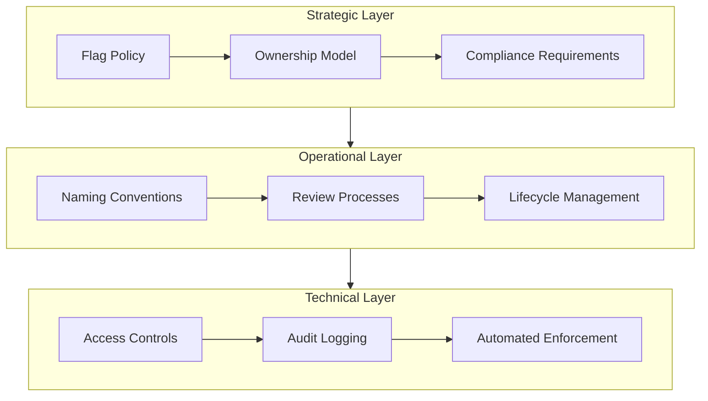
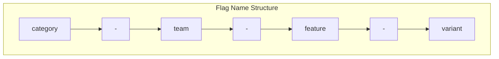
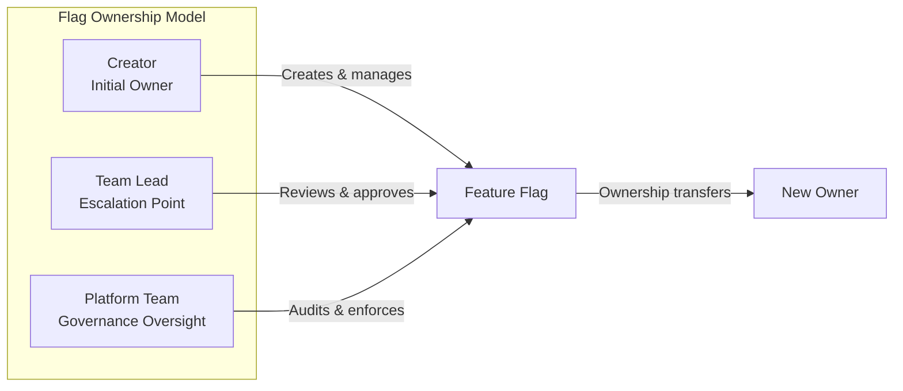
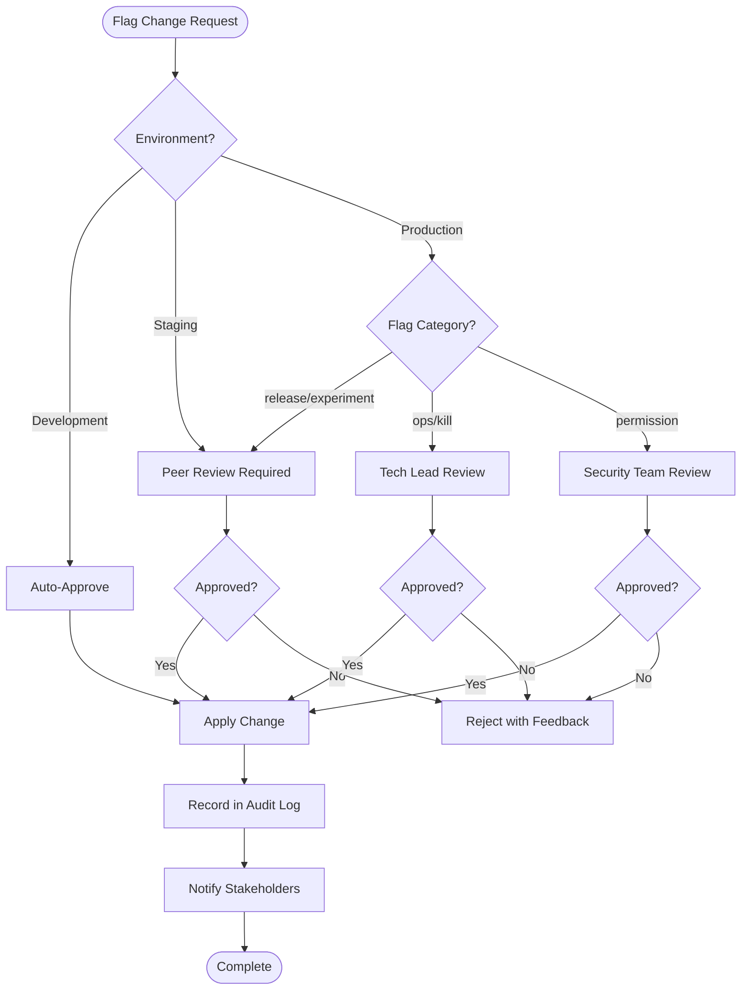
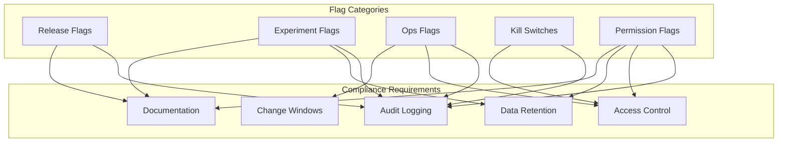
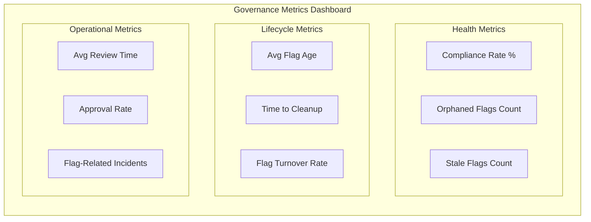
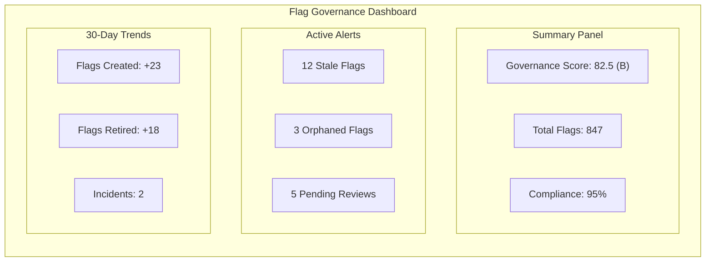

# How to Build Flag Governance

Author: [nawazdhandala](https://github.com/nawazdhandala)

Tags: Feature Flags, Governance, Compliance, Best Practices

Description: Learn how to establish governance practices for feature flag management.

---

Feature flags unlock powerful deployment capabilities, but without governance they become technical debt factories. Teams accumulate hundreds of flags with unclear ownership, inconsistent naming, and no retirement plan. Flag governance transforms this chaos into a structured system where every flag has purpose, every change is traceable, and stale flags get cleaned up automatically.

## Why Flag Governance Matters

Organizations without flag governance experience predictable problems:

- **Flag sprawl**: Thousands of flags accumulate with no clear purpose or owner
- **Naming chaos**: `new_checkout`, `checkout_v2`, `checkout_experiment_final` all exist simultaneously
- **Security blind spots**: Sensitive flags controlling access lack audit trails
- **Technical debt**: Flags remain in code years after their purpose ended
- **Incident risk**: Flag changes cause outages because review processes are absent

Flag governance addresses these problems by establishing clear standards, ownership, and lifecycle management before flags become unmanageable.

## Governance Framework Design

A robust flag governance framework operates across three layers: strategic, operational, and technical.



### Strategic Layer Components

**Flag Policy**: Define when feature flags should and should not be used. Not every conditional needs a flag. Reserve flags for deployment decoupling, experimentation, and operational controls.

**Ownership Model**: Every flag must have an owner accountable for its lifecycle. Ownership transfers when team members leave. Orphaned flags get escalated.

**Compliance Requirements**: Flags affecting user data, billing, or security require additional controls. Document which flag categories need enhanced review.

### Operational Layer Components

**Naming Conventions**: Standardized names make flags discoverable and self-documenting. Enforce conventions through validation.

**Review Processes**: Flag changes in production environments require peer review. High-risk flags require additional approval.

**Lifecycle Management**: Flags have defined lifespans. Temporary flags expire automatically. Long-lived flags require periodic review.

### Technical Layer Components

**Access Controls**: Restrict who can create, modify, and delete flags based on environment and flag category.

**Audit Logging**: Every flag change is logged with who, what, when, and why. Logs feed into security monitoring.

**Automated Enforcement**: Validation rules prevent policy violations at creation time. Alerts fire when flags violate lifecycle rules.

## Naming Conventions

Consistent naming makes flags searchable, groupable, and understandable at a glance. A good naming convention encodes context into the flag name itself.

### Naming Convention Structure



### Naming Convention Policy

```yaml
# flag-naming-policy.yaml
apiVersion: governance/v1
kind: FlagNamingPolicy
metadata:
  name: flag-naming-convention
  version: "1.0"
  owner: platform-team
  lastReview: "2026-01-15"

spec:
  pattern: "^[a-z]+-[a-z]+-[a-z0-9-]+(-[a-z0-9]+)?$"

  segments:
    - name: category
      position: 1
      required: true
      description: "Type of flag indicating its purpose"
      allowedValues:
        - release      # Feature releases and rollouts
        - experiment   # A/B tests and experiments
        - ops          # Operational controls
        - kill         # Circuit breakers and kill switches
        - permission   # Access control flags

    - name: team
      position: 2
      required: true
      description: "Team that owns this flag"
      allowedValues:
        - checkout
        - payments
        - search
        - platform
        - growth

    - name: feature
      position: 3
      required: true
      description: "Feature or capability being controlled"
      pattern: "^[a-z0-9-]+$"
      maxLength: 30

    - name: variant
      position: 4
      required: false
      description: "Optional variant identifier for experiments"
      pattern: "^[a-z0-9]+$"

  examples:
    valid:
      - "release-checkout-express-shipping"
      - "experiment-growth-onboarding-flow-v2"
      - "ops-platform-rate-limiting"
      - "kill-payments-stripe-integration"
      - "permission-search-advanced-filters"
    invalid:
      - "newFeature"           # Missing category and team
      - "RELEASE-CHECKOUT"     # Uppercase not allowed
      - "release_checkout_x"   # Underscores not allowed
      - "release-checkout"     # Missing feature segment

  validation:
    enforceOnCreate: true
    enforceOnUpdate: false
    warnOnNonCompliant: true
```

### Naming Validation Implementation

```typescript
// flag-naming-validator.ts
interface NamingSegment {
  name: string;
  position: number;
  required: boolean;
  allowedValues?: string[];
  pattern?: string;
  maxLength?: number;
}

interface NamingPolicy {
  pattern: string;
  segments: NamingSegment[];
}

interface ValidationResult {
  valid: boolean;
  errors: string[];
  warnings: string[];
  parsedSegments?: Record<string, string>;
}

class FlagNamingValidator {
  private policy: NamingPolicy;

  constructor(policy: NamingPolicy) {
    this.policy = policy;
  }

  validate(flagName: string): ValidationResult {
    const errors: string[] = [];
    const warnings: string[] = [];

    // Check overall pattern
    const patternRegex = new RegExp(this.policy.pattern);
    if (!patternRegex.test(flagName)) {
      errors.push(
        `Flag name "${flagName}" does not match required pattern: ${this.policy.pattern}`
      );
      return { valid: false, errors, warnings };
    }

    // Parse segments
    const parts = flagName.split('-');
    const parsedSegments: Record<string, string> = {};

    for (const segment of this.policy.segments) {
      const value = parts[segment.position - 1];

      // Check required segments
      if (segment.required && !value) {
        errors.push(`Missing required segment: ${segment.name}`);
        continue;
      }

      if (!value) continue;

      // Check allowed values
      if (segment.allowedValues && !segment.allowedValues.includes(value)) {
        errors.push(
          `Invalid ${segment.name}: "${value}". Allowed values: ${segment.allowedValues.join(', ')}`
        );
      }

      // Check pattern
      if (segment.pattern) {
        const segmentRegex = new RegExp(segment.pattern);
        if (!segmentRegex.test(value)) {
          errors.push(
            `Segment ${segment.name} "${value}" does not match pattern: ${segment.pattern}`
          );
        }
      }

      // Check max length
      if (segment.maxLength && value.length > segment.maxLength) {
        warnings.push(
          `Segment ${segment.name} exceeds recommended length of ${segment.maxLength}`
        );
      }

      parsedSegments[segment.name] = value;
    }

    return {
      valid: errors.length === 0,
      errors,
      warnings,
      parsedSegments
    };
  }

  suggestName(category: string, team: string, feature: string, variant?: string): string {
    const parts = [category, team, feature];
    if (variant) {
      parts.push(variant);
    }
    return parts.join('-').toLowerCase().replace(/[^a-z0-9-]/g, '-');
  }
}

// Example usage
const policy: NamingPolicy = {
  pattern: "^[a-z]+-[a-z]+-[a-z0-9-]+(-[a-z0-9]+)?$",
  segments: [
    {
      name: "category",
      position: 1,
      required: true,
      allowedValues: ["release", "experiment", "ops", "kill", "permission"]
    },
    {
      name: "team",
      position: 2,
      required: true,
      allowedValues: ["checkout", "payments", "search", "platform", "growth"]
    },
    {
      name: "feature",
      position: 3,
      required: true,
      pattern: "^[a-z0-9-]+$",
      maxLength: 30
    },
    {
      name: "variant",
      position: 4,
      required: false,
      pattern: "^[a-z0-9]+$"
    }
  ]
};

const validator = new FlagNamingValidator(policy);

// Valid flag
const result1 = validator.validate("release-checkout-express-shipping");
console.log(result1);
// { valid: true, errors: [], warnings: [], parsedSegments: { category: 'release', team: 'checkout', feature: 'express-shipping' } }

// Invalid flag
const result2 = validator.validate("newFeature");
console.log(result2);
// { valid: false, errors: ['Flag name "newFeature" does not match required pattern...'], warnings: [] }

// Suggest a name
const suggested = validator.suggestName("release", "payments", "Apple Pay Integration");
console.log(suggested);
// "release-payments-apple-pay-integration"
```

## Ownership Assignment

Clear ownership prevents the "tragedy of the commons" where everyone assumes someone else manages the flag. Every flag must have an accountable owner from creation through retirement.



### Ownership Policy Implementation

```typescript
// flag-ownership.ts
interface FlagOwnership {
  flagKey: string;
  primaryOwner: string;
  teamOwner: string;
  createdBy: string;
  createdAt: Date;
  lastModifiedBy: string;
  lastModifiedAt: Date;
  reviewers: string[];
  escalationPath: string[];
}

interface OwnershipTransfer {
  flagKey: string;
  fromOwner: string;
  toOwner: string;
  reason: string;
  transferredAt: Date;
  approvedBy: string;
}

interface OrphanedFlagAlert {
  flagKey: string;
  lastOwner: string;
  orphanedAt: Date;
  reason: 'owner_departed' | 'team_dissolved' | 'ownership_expired';
  escalatedTo: string;
  actionDeadline: Date;
}

class FlagOwnershipService {
  private flagOwnership: Map<string, FlagOwnership> = new Map();
  private ownershipHistory: OwnershipTransfer[] = [];

  async assignOwnership(
    flagKey: string,
    owner: string,
    team: string,
    reviewers: string[]
  ): Promise<FlagOwnership> {
    const ownership: FlagOwnership = {
      flagKey,
      primaryOwner: owner,
      teamOwner: team,
      createdBy: owner,
      createdAt: new Date(),
      lastModifiedBy: owner,
      lastModifiedAt: new Date(),
      reviewers,
      escalationPath: await this.buildEscalationPath(team)
    };

    this.flagOwnership.set(flagKey, ownership);
    await this.notifyOwnershipAssigned(ownership);

    return ownership;
  }

  async transferOwnership(
    flagKey: string,
    fromOwner: string,
    toOwner: string,
    reason: string,
    approver: string
  ): Promise<OwnershipTransfer> {
    const currentOwnership = this.flagOwnership.get(flagKey);

    if (!currentOwnership) {
      throw new Error(`Flag ${flagKey} not found`);
    }

    if (currentOwnership.primaryOwner !== fromOwner) {
      throw new Error(`${fromOwner} is not the current owner of ${flagKey}`);
    }

    // Validate new owner exists and is active
    const isValidOwner = await this.validateOwner(toOwner);
    if (!isValidOwner) {
      throw new Error(`${toOwner} is not a valid owner`);
    }

    // Create transfer record
    const transfer: OwnershipTransfer = {
      flagKey,
      fromOwner,
      toOwner,
      reason,
      transferredAt: new Date(),
      approvedBy: approver
    };

    // Update ownership
    currentOwnership.primaryOwner = toOwner;
    currentOwnership.lastModifiedBy = approver;
    currentOwnership.lastModifiedAt = new Date();

    this.ownershipHistory.push(transfer);

    await this.notifyOwnershipTransferred(transfer);

    return transfer;
  }

  async detectOrphanedFlags(
    departedUsers: string[],
    dissolvedTeams: string[]
  ): Promise<OrphanedFlagAlert[]> {
    const alerts: OrphanedFlagAlert[] = [];

    for (const [flagKey, ownership] of this.flagOwnership) {
      let reason: OrphanedFlagAlert['reason'] | null = null;

      if (departedUsers.includes(ownership.primaryOwner)) {
        reason = 'owner_departed';
      } else if (dissolvedTeams.includes(ownership.teamOwner)) {
        reason = 'team_dissolved';
      }

      if (reason) {
        const escalatedTo = ownership.escalationPath[0] || 'platform-team@company.com';

        alerts.push({
          flagKey,
          lastOwner: ownership.primaryOwner,
          orphanedAt: new Date(),
          reason,
          escalatedTo,
          actionDeadline: new Date(Date.now() + 14 * 24 * 60 * 60 * 1000) // 14 days
        });

        await this.notifyOrphanedFlag(alerts[alerts.length - 1]);
      }
    }

    return alerts;
  }

  async getOwnershipReport(): Promise<{
    totalFlags: number;
    flagsByOwner: Record<string, number>;
    flagsByTeam: Record<string, number>;
    flagsWithoutReviewers: string[];
    recentTransfers: OwnershipTransfer[];
  }> {
    const flagsByOwner: Record<string, number> = {};
    const flagsByTeam: Record<string, number> = {};
    const flagsWithoutReviewers: string[] = [];

    for (const [flagKey, ownership] of this.flagOwnership) {
      // Count by owner
      flagsByOwner[ownership.primaryOwner] =
        (flagsByOwner[ownership.primaryOwner] || 0) + 1;

      // Count by team
      flagsByTeam[ownership.teamOwner] =
        (flagsByTeam[ownership.teamOwner] || 0) + 1;

      // Check for missing reviewers
      if (ownership.reviewers.length === 0) {
        flagsWithoutReviewers.push(flagKey);
      }
    }

    return {
      totalFlags: this.flagOwnership.size,
      flagsByOwner,
      flagsByTeam,
      flagsWithoutReviewers,
      recentTransfers: this.ownershipHistory.slice(-10)
    };
  }

  private async buildEscalationPath(team: string): Promise<string[]> {
    // In production, fetch from org chart / HR system
    return [
      `${team}-lead@company.com`,
      'engineering-manager@company.com',
      'platform-team@company.com'
    ];
  }

  private async validateOwner(owner: string): Promise<boolean> {
    // In production, validate against employee directory
    return true;
  }

  private async notifyOwnershipAssigned(ownership: FlagOwnership): Promise<void> {
    console.log(`Ownership assigned: ${ownership.flagKey} -> ${ownership.primaryOwner}`);
  }

  private async notifyOwnershipTransferred(transfer: OwnershipTransfer): Promise<void> {
    console.log(`Ownership transferred: ${transfer.flagKey} from ${transfer.fromOwner} to ${transfer.toOwner}`);
  }

  private async notifyOrphanedFlag(alert: OrphanedFlagAlert): Promise<void> {
    console.log(`Orphaned flag alert: ${alert.flagKey} escalated to ${alert.escalatedTo}`);
  }
}

// Example usage
const ownershipService = new FlagOwnershipService();

// Assign ownership when flag is created
await ownershipService.assignOwnership(
  'release-checkout-express-shipping',
  'alice@company.com',
  'checkout',
  ['bob@company.com', 'carol@company.com']
);

// Transfer ownership when Alice leaves
await ownershipService.transferOwnership(
  'release-checkout-express-shipping',
  'alice@company.com',
  'bob@company.com',
  'Alice departing company',
  'checkout-lead@company.com'
);
```

## Review Processes

Flag changes in production require oversight. The review process varies by flag category and risk level.



### Review Workflow Implementation

```python
# flag_review_workflow.py
from dataclasses import dataclass, field
from enum import Enum
from typing import List, Optional, Dict
from datetime import datetime, timedelta
import uuid

class FlagCategory(Enum):
    RELEASE = "release"
    EXPERIMENT = "experiment"
    OPS = "ops"
    KILL = "kill"
    PERMISSION = "permission"

class Environment(Enum):
    DEVELOPMENT = "development"
    STAGING = "staging"
    PRODUCTION = "production"

class ReviewStatus(Enum):
    PENDING = "pending"
    APPROVED = "approved"
    REJECTED = "rejected"
    EXPIRED = "expired"

class ChangeType(Enum):
    CREATE = "create"
    UPDATE = "update"
    TOGGLE = "toggle"
    DELETE = "delete"

@dataclass
class FlagChangeRequest:
    id: str
    flag_key: str
    category: FlagCategory
    environment: Environment
    change_type: ChangeType
    requestor: str
    description: str
    previous_value: Optional[Dict] = None
    new_value: Optional[Dict] = None
    created_at: datetime = field(default_factory=datetime.utcnow)
    expires_at: datetime = field(default_factory=lambda: datetime.utcnow() + timedelta(days=7))

@dataclass
class ReviewStep:
    reviewer_type: str
    reviewer: Optional[str] = None
    status: ReviewStatus = ReviewStatus.PENDING
    reviewed_at: Optional[datetime] = None
    comments: Optional[str] = None

@dataclass
class ReviewWorkflow:
    change_request: FlagChangeRequest
    steps: List[ReviewStep]
    current_step: int = 0
    status: ReviewStatus = ReviewStatus.PENDING

    @property
    def is_complete(self) -> bool:
        return self.status in [ReviewStatus.APPROVED, ReviewStatus.REJECTED, ReviewStatus.EXPIRED]


class FlagReviewService:
    """Service for managing flag change review workflows."""

    def __init__(self, notification_service, audit_service):
        self.notification_service = notification_service
        self.audit_service = audit_service
        self.workflows: Dict[str, ReviewWorkflow] = {}

    def create_review_workflow(
        self,
        change_request: FlagChangeRequest
    ) -> ReviewWorkflow:
        """Create a review workflow based on environment and category."""

        steps = self._determine_review_steps(
            change_request.environment,
            change_request.category
        )

        workflow = ReviewWorkflow(
            change_request=change_request,
            steps=steps
        )

        self.workflows[change_request.id] = workflow

        # Auto-approve if no steps required
        if len(steps) == 0:
            workflow.status = ReviewStatus.APPROVED
            self._apply_change(workflow)
        else:
            self._notify_next_reviewer(workflow)

        return workflow

    def _determine_review_steps(
        self,
        environment: Environment,
        category: FlagCategory
    ) -> List[ReviewStep]:
        """Determine required review steps based on environment and category."""

        # Development: no review needed
        if environment == Environment.DEVELOPMENT:
            return []

        steps = []

        # Staging: peer review only
        if environment == Environment.STAGING:
            steps.append(ReviewStep(reviewer_type="peer"))
            return steps

        # Production: varies by category
        if environment == Environment.PRODUCTION:
            if category in [FlagCategory.RELEASE, FlagCategory.EXPERIMENT]:
                steps.append(ReviewStep(reviewer_type="peer"))
            elif category in [FlagCategory.OPS, FlagCategory.KILL]:
                steps.append(ReviewStep(reviewer_type="peer"))
                steps.append(ReviewStep(reviewer_type="tech_lead"))
            elif category == FlagCategory.PERMISSION:
                steps.append(ReviewStep(reviewer_type="peer"))
                steps.append(ReviewStep(reviewer_type="security"))

        return steps

    def submit_review(
        self,
        workflow_id: str,
        reviewer: str,
        approved: bool,
        comments: Optional[str] = None
    ) -> ReviewWorkflow:
        """Submit a review decision for a workflow step."""

        workflow = self.workflows.get(workflow_id)
        if not workflow:
            raise ValueError(f"Workflow {workflow_id} not found")

        if workflow.is_complete:
            raise ValueError("Workflow is already complete")

        current_step = workflow.steps[workflow.current_step]

        # Validate reviewer is authorized for this step
        if not self._is_authorized_reviewer(reviewer, current_step.reviewer_type):
            raise ValueError(f"{reviewer} is not authorized to review this step")

        # Record the review
        current_step.reviewer = reviewer
        current_step.status = ReviewStatus.APPROVED if approved else ReviewStatus.REJECTED
        current_step.reviewed_at = datetime.utcnow()
        current_step.comments = comments

        if not approved:
            workflow.status = ReviewStatus.REJECTED
            self._notify_rejection(workflow, comments)
            self._log_audit(workflow, "rejected", reviewer)
            return workflow

        # Move to next step or complete
        if workflow.current_step < len(workflow.steps) - 1:
            workflow.current_step += 1
            self._notify_next_reviewer(workflow)
        else:
            workflow.status = ReviewStatus.APPROVED
            self._apply_change(workflow)
            self._log_audit(workflow, "approved", reviewer)

        return workflow

    def _is_authorized_reviewer(self, reviewer: str, reviewer_type: str) -> bool:
        """Check if reviewer is authorized for the review type."""
        # In production, check against role-based access control
        authorized_reviewers = {
            "peer": ["*"],  # Any team member
            "tech_lead": ["*-lead@company.com"],
            "security": ["security-team@company.com"]
        }
        return True  # Simplified for example

    def _notify_next_reviewer(self, workflow: ReviewWorkflow) -> None:
        """Notify the next reviewer in the workflow."""
        current_step = workflow.steps[workflow.current_step]
        print(f"Notification: Review needed ({current_step.reviewer_type}) for {workflow.change_request.flag_key}")

    def _notify_rejection(self, workflow: ReviewWorkflow, reason: Optional[str]) -> None:
        """Notify requestor of rejection."""
        print(f"Notification: Change rejected for {workflow.change_request.flag_key}: {reason}")

    def _apply_change(self, workflow: ReviewWorkflow) -> None:
        """Apply the approved flag change."""
        print(f"Applying change: {workflow.change_request.change_type.value} on {workflow.change_request.flag_key}")
        # In production, call flag management API

    def _log_audit(self, workflow: ReviewWorkflow, action: str, actor: str) -> None:
        """Log the workflow completion to audit trail."""
        print(f"Audit: {action} - {workflow.change_request.flag_key} by {actor}")


# Example usage
review_service = FlagReviewService(None, None)

# Create a change request for production permission flag
change_request = FlagChangeRequest(
    id=str(uuid.uuid4()),
    flag_key="permission-search-advanced-filters",
    category=FlagCategory.PERMISSION,
    environment=Environment.PRODUCTION,
    change_type=ChangeType.UPDATE,
    requestor="developer@company.com",
    description="Enable advanced search filters for enterprise customers",
    previous_value={"enabled": False},
    new_value={"enabled": True, "targeting": {"plan": "enterprise"}}
)

# Create workflow - will require peer + security review
workflow = review_service.create_review_workflow(change_request)
print(f"Workflow created with {len(workflow.steps)} review steps")

# Peer approves
workflow = review_service.submit_review(
    workflow.change_request.id,
    "peer@company.com",
    approved=True,
    comments="Looks good, targeting is correct"
)

# Security approves
workflow = review_service.submit_review(
    workflow.change_request.id,
    "security-team@company.com",
    approved=True,
    comments="Access control verified"
)

print(f"Final status: {workflow.status.value}")
```

## Compliance Requirements

Different flag categories have different compliance requirements. Document these requirements and enforce them through automated checks.



### Compliance Policy Configuration

```yaml
# flag-compliance-policy.yaml
apiVersion: governance/v1
kind: FlagCompliancePolicy
metadata:
  name: flag-compliance-requirements
  version: "2.0"
  owner: compliance-team
  lastReview: "2026-01-15"
  nextReview: "2026-04-15"

spec:
  categories:
    release:
      description: "Flags controlling feature releases and rollouts"
      maxLifespan: 90  # days
      requirements:
        auditLogging: required
        documentation: required
        reviewProcess: peer
        changeWindow: business_hours
      retentionPolicy:
        evaluationLogs: 30  # days
        changeHistory: 365  # days
      cleanup:
        warnAt: 60  # days
        enforceAt: 90  # days

    experiment:
      description: "Flags for A/B tests and experiments"
      maxLifespan: 30  # days
      requirements:
        auditLogging: required
        documentation: required
        dataRetention: required
        reviewProcess: peer
        hypothesisDoc: required
      retentionPolicy:
        evaluationLogs: 90  # days for experiment analysis
        changeHistory: 365  # days
      cleanup:
        warnAt: 21  # days
        enforceAt: 30  # days

    ops:
      description: "Operational controls and feature toggles"
      maxLifespan: null  # Long-lived
      requirements:
        auditLogging: required
        accessControl: restricted
        changeWindow: maintenance_only
        reviewProcess: tech_lead
        runbook: required
      retentionPolicy:
        evaluationLogs: 90  # days
        changeHistory: 730  # days (2 years)
      reviewCycle: 180  # days - periodic review required

    kill:
      description: "Circuit breakers and kill switches"
      maxLifespan: null  # Long-lived
      requirements:
        auditLogging: required
        accessControl: restricted
        instantChange: allowed  # Can bypass change windows
        reviewProcess: tech_lead
        runbook: required
      retentionPolicy:
        evaluationLogs: 90  # days
        changeHistory: 730  # days
      testingRequired: quarterly

    permission:
      description: "Access control and entitlement flags"
      maxLifespan: null  # Long-lived
      requirements:
        auditLogging: required
        accessControl: security_team
        dataRetention: required
        reviewProcess: security
        documentation: required
        privacyReview: required
      retentionPolicy:
        evaluationLogs: 365  # days - audit requirement
        changeHistory: 2555  # days (7 years)
      complianceFrameworks:
        - SOC2
        - GDPR
        - CCPA

  changeWindows:
    business_hours:
      days: ["monday", "tuesday", "wednesday", "thursday", "friday"]
      hours: "09:00-17:00"
      timezone: "America/New_York"
      exceptions:
        - type: incident_response
          approvers: ["on-call-lead"]
    maintenance_only:
      days: ["tuesday", "thursday"]
      hours: "02:00-06:00"
      timezone: "America/New_York"
      requiresNotice: 24  # hours
      exceptions:
        - type: incident_response
          approvers: ["on-call-lead"]

  accessControl:
    restricted:
      allowedRoles:
        - platform-engineer
        - sre
        - tech-lead
      requiresMFA: true
    security_team:
      allowedRoles:
        - security-engineer
        - compliance-officer
      requiresMFA: true
      requiresApproval: true
```

### Compliance Check Implementation

```typescript
// flag-compliance-checker.ts
interface ComplianceRequirement {
  name: string;
  required: boolean;
  check: (flag: FlagMetadata) => ComplianceCheckResult;
}

interface ComplianceCheckResult {
  passed: boolean;
  requirement: string;
  message: string;
  severity: 'info' | 'warning' | 'error';
}

interface FlagMetadata {
  key: string;
  category: string;
  createdAt: Date;
  lastModifiedAt: Date;
  owner: string;
  documentation?: string;
  runbook?: string;
  hypothesis?: string;
  reviewHistory: ReviewRecord[];
  evaluationCount: number;
}

interface ReviewRecord {
  reviewedAt: Date;
  reviewer: string;
  type: string;
}

class FlagComplianceChecker {
  private requirements: Map<string, ComplianceRequirement[]> = new Map();

  constructor() {
    this.initializeRequirements();
  }

  private initializeRequirements(): void {
    // Release flag requirements
    this.requirements.set('release', [
      {
        name: 'documentation',
        required: true,
        check: (flag) => ({
          passed: !!flag.documentation && flag.documentation.length > 50,
          requirement: 'documentation',
          message: flag.documentation
            ? 'Documentation present'
            : 'Release flags require documentation',
          severity: flag.documentation ? 'info' : 'error'
        })
      },
      {
        name: 'lifespan',
        required: true,
        check: (flag) => {
          const ageInDays = this.getDaysOld(flag.createdAt);
          const maxAge = 90;
          return {
            passed: ageInDays <= maxAge,
            requirement: 'lifespan',
            message: ageInDays <= maxAge
              ? `Flag is ${ageInDays} days old (max: ${maxAge})`
              : `Flag exceeds maximum lifespan: ${ageInDays}/${maxAge} days`,
            severity: ageInDays > maxAge ? 'error' : ageInDays > 60 ? 'warning' : 'info'
          };
        }
      }
    ]);

    // Experiment flag requirements
    this.requirements.set('experiment', [
      {
        name: 'hypothesis',
        required: true,
        check: (flag) => ({
          passed: !!flag.hypothesis,
          requirement: 'hypothesis',
          message: flag.hypothesis
            ? 'Hypothesis documented'
            : 'Experiment flags require a documented hypothesis',
          severity: flag.hypothesis ? 'info' : 'error'
        })
      },
      {
        name: 'lifespan',
        required: true,
        check: (flag) => {
          const ageInDays = this.getDaysOld(flag.createdAt);
          const maxAge = 30;
          return {
            passed: ageInDays <= maxAge,
            requirement: 'lifespan',
            message: ageInDays <= maxAge
              ? `Experiment is ${ageInDays} days old (max: ${maxAge})`
              : `Experiment exceeds maximum lifespan: ${ageInDays}/${maxAge} days`,
            severity: ageInDays > maxAge ? 'error' : ageInDays > 21 ? 'warning' : 'info'
          };
        }
      }
    ]);

    // Ops flag requirements
    this.requirements.set('ops', [
      {
        name: 'runbook',
        required: true,
        check: (flag) => ({
          passed: !!flag.runbook,
          requirement: 'runbook',
          message: flag.runbook
            ? 'Runbook linked'
            : 'Ops flags require a linked runbook',
          severity: flag.runbook ? 'info' : 'error'
        })
      },
      {
        name: 'periodic_review',
        required: true,
        check: (flag) => {
          const lastReview = flag.reviewHistory
            .filter(r => r.type === 'periodic')
            .sort((a, b) => b.reviewedAt.getTime() - a.reviewedAt.getTime())[0];

          const daysSinceReview = lastReview
            ? this.getDaysOld(lastReview.reviewedAt)
            : Infinity;

          return {
            passed: daysSinceReview <= 180,
            requirement: 'periodic_review',
            message: daysSinceReview <= 180
              ? `Last reviewed ${daysSinceReview} days ago`
              : `Overdue for periodic review (last: ${daysSinceReview} days ago)`,
            severity: daysSinceReview > 180 ? 'error' : daysSinceReview > 150 ? 'warning' : 'info'
          };
        }
      }
    ]);

    // Kill switch requirements
    this.requirements.set('kill', [
      {
        name: 'runbook',
        required: true,
        check: (flag) => ({
          passed: !!flag.runbook,
          requirement: 'runbook',
          message: flag.runbook
            ? 'Runbook linked'
            : 'Kill switches require a linked runbook',
          severity: flag.runbook ? 'info' : 'error'
        })
      },
      {
        name: 'tested',
        required: true,
        check: (flag) => {
          const lastTest = flag.reviewHistory
            .filter(r => r.type === 'test')
            .sort((a, b) => b.reviewedAt.getTime() - a.reviewedAt.getTime())[0];

          const daysSinceTest = lastTest
            ? this.getDaysOld(lastTest.reviewedAt)
            : Infinity;

          return {
            passed: daysSinceTest <= 90,
            requirement: 'tested',
            message: daysSinceTest <= 90
              ? `Last tested ${daysSinceTest} days ago`
              : `Kill switch test overdue (last: ${daysSinceTest} days ago)`,
            severity: daysSinceTest > 90 ? 'error' : daysSinceTest > 60 ? 'warning' : 'info'
          };
        }
      }
    ]);

    // Permission flag requirements
    this.requirements.set('permission', [
      {
        name: 'documentation',
        required: true,
        check: (flag) => ({
          passed: !!flag.documentation && flag.documentation.length > 100,
          requirement: 'documentation',
          message: flag.documentation
            ? 'Documentation present'
            : 'Permission flags require detailed documentation',
          severity: flag.documentation ? 'info' : 'error'
        })
      },
      {
        name: 'security_review',
        required: true,
        check: (flag) => {
          const securityReview = flag.reviewHistory
            .find(r => r.type === 'security');

          return {
            passed: !!securityReview,
            requirement: 'security_review',
            message: securityReview
              ? `Security reviewed on ${securityReview.reviewedAt.toISOString()}`
              : 'Permission flags require security team review',
            severity: securityReview ? 'info' : 'error'
          };
        }
      }
    ]);
  }

  checkCompliance(flag: FlagMetadata): {
    compliant: boolean;
    results: ComplianceCheckResult[];
    score: number;
  } {
    const requirements = this.requirements.get(flag.category) || [];
    const results: ComplianceCheckResult[] = [];

    for (const req of requirements) {
      const result = req.check(flag);
      results.push(result);
    }

    const requiredPassed = results
      .filter((_, i) => requirements[i].required)
      .every(r => r.passed);

    const score = results.filter(r => r.passed).length / results.length * 100;

    return {
      compliant: requiredPassed,
      results,
      score: Math.round(score)
    };
  }

  private getDaysOld(date: Date): number {
    return Math.floor((Date.now() - date.getTime()) / (1000 * 60 * 60 * 24));
  }

  generateComplianceReport(flags: FlagMetadata[]): {
    totalFlags: number;
    compliantFlags: number;
    complianceRate: number;
    byCategory: Record<string, { total: number; compliant: number; rate: number }>;
    violations: { flag: string; violations: ComplianceCheckResult[] }[];
  } {
    const byCategory: Record<string, { total: number; compliant: number; rate: number }> = {};
    const violations: { flag: string; violations: ComplianceCheckResult[] }[] = [];
    let compliantCount = 0;

    for (const flag of flags) {
      const { compliant, results } = this.checkCompliance(flag);

      // Track by category
      if (!byCategory[flag.category]) {
        byCategory[flag.category] = { total: 0, compliant: 0, rate: 0 };
      }
      byCategory[flag.category].total++;

      if (compliant) {
        compliantCount++;
        byCategory[flag.category].compliant++;
      } else {
        violations.push({
          flag: flag.key,
          violations: results.filter(r => !r.passed)
        });
      }
    }

    // Calculate rates
    for (const category of Object.keys(byCategory)) {
      byCategory[category].rate = Math.round(
        (byCategory[category].compliant / byCategory[category].total) * 100
      );
    }

    return {
      totalFlags: flags.length,
      compliantFlags: compliantCount,
      complianceRate: Math.round((compliantCount / flags.length) * 100),
      byCategory,
      violations
    };
  }
}

// Example usage
const checker = new FlagComplianceChecker();

const flag: FlagMetadata = {
  key: 'experiment-growth-onboarding-flow',
  category: 'experiment',
  createdAt: new Date(Date.now() - 25 * 24 * 60 * 60 * 1000), // 25 days old
  lastModifiedAt: new Date(),
  owner: 'growth@company.com',
  hypothesis: 'New onboarding flow will increase activation by 15%',
  reviewHistory: [],
  evaluationCount: 50000
};

const result = checker.checkCompliance(flag);
console.log(`Compliant: ${result.compliant}, Score: ${result.score}%`);
for (const check of result.results) {
  console.log(`  ${check.requirement}: ${check.passed ? 'PASS' : 'FAIL'} - ${check.message}`);
}
```

## Governance Metrics

Track governance effectiveness through metrics that reveal compliance health, flag lifecycle efficiency, and operational risk.



### Metrics Collection Implementation

```python
# flag_governance_metrics.py
from dataclasses import dataclass, field
from typing import List, Dict, Optional
from datetime import datetime, timedelta
from enum import Enum
import statistics

@dataclass
class FlagMetrics:
    key: str
    category: str
    created_at: datetime
    last_modified_at: datetime
    last_evaluated_at: Optional[datetime]
    evaluation_count: int
    owner: str
    is_compliant: bool
    is_stale: bool
    is_orphaned: bool

@dataclass
class ReviewMetrics:
    workflow_id: str
    flag_key: str
    requested_at: datetime
    completed_at: Optional[datetime]
    approved: bool
    review_steps: int
    time_to_first_review: Optional[timedelta]
    total_review_time: Optional[timedelta]

@dataclass
class IncidentMetrics:
    incident_id: str
    flag_key: str
    occurred_at: datetime
    severity: str
    root_cause: str
    time_to_resolve: timedelta

class GovernanceMetricsCollector:
    """Collects and calculates flag governance metrics."""

    def __init__(self, flag_service, review_service, incident_service):
        self.flag_service = flag_service
        self.review_service = review_service
        self.incident_service = incident_service

    async def collect_health_metrics(self) -> Dict:
        """Collect metrics about overall flag health."""
        flags = await self.flag_service.get_all_flags()

        total_flags = len(flags)
        compliant_flags = sum(1 for f in flags if f.is_compliant)
        orphaned_flags = sum(1 for f in flags if f.is_orphaned)
        stale_flags = sum(1 for f in flags if f.is_stale)

        # Calculate by category
        by_category = {}
        for flag in flags:
            if flag.category not in by_category:
                by_category[flag.category] = {
                    'total': 0, 'compliant': 0, 'stale': 0, 'orphaned': 0
                }
            by_category[flag.category]['total'] += 1
            if flag.is_compliant:
                by_category[flag.category]['compliant'] += 1
            if flag.is_stale:
                by_category[flag.category]['stale'] += 1
            if flag.is_orphaned:
                by_category[flag.category]['orphaned'] += 1

        return {
            'timestamp': datetime.utcnow().isoformat(),
            'total_flags': total_flags,
            'compliance_rate': round(compliant_flags / total_flags * 100, 2) if total_flags > 0 else 100,
            'orphaned_count': orphaned_flags,
            'orphaned_rate': round(orphaned_flags / total_flags * 100, 2) if total_flags > 0 else 0,
            'stale_count': stale_flags,
            'stale_rate': round(stale_flags / total_flags * 100, 2) if total_flags > 0 else 0,
            'by_category': by_category
        }

    async def collect_lifecycle_metrics(self, days: int = 30) -> Dict:
        """Collect metrics about flag lifecycle."""
        flags = await self.flag_service.get_all_flags()
        cutoff = datetime.utcnow() - timedelta(days=days)

        # Calculate ages
        ages = [(datetime.utcnow() - f.created_at).days for f in flags]

        # Get recently created and deleted flags
        created_recently = [f for f in flags if f.created_at >= cutoff]
        deleted_recently = await self.flag_service.get_deleted_flags(since=cutoff)

        # Calculate time to cleanup for cleaned up flags
        cleanup_times = []
        for flag in deleted_recently:
            if flag.category in ['release', 'experiment']:
                max_age = 90 if flag.category == 'release' else 30
                actual_age = (flag.deleted_at - flag.created_at).days
                cleanup_times.append(actual_age - max_age)  # negative = early cleanup

        return {
            'timestamp': datetime.utcnow().isoformat(),
            'period_days': days,
            'average_age_days': round(statistics.mean(ages), 1) if ages else 0,
            'median_age_days': round(statistics.median(ages), 1) if ages else 0,
            'max_age_days': max(ages) if ages else 0,
            'flags_created': len(created_recently),
            'flags_deleted': len(deleted_recently),
            'turnover_rate': round(len(deleted_recently) / len(flags) * 100, 2) if flags else 0,
            'avg_cleanup_delay_days': round(statistics.mean(cleanup_times), 1) if cleanup_times else 0,
            'age_distribution': {
                '0-7_days': sum(1 for a in ages if a <= 7),
                '8-30_days': sum(1 for a in ages if 7 < a <= 30),
                '31-90_days': sum(1 for a in ages if 30 < a <= 90),
                '91-180_days': sum(1 for a in ages if 90 < a <= 180),
                '181+_days': sum(1 for a in ages if a > 180)
            }
        }

    async def collect_operational_metrics(self, days: int = 30) -> Dict:
        """Collect metrics about operational processes."""
        cutoff = datetime.utcnow() - timedelta(days=days)

        # Get reviews from period
        reviews = await self.review_service.get_reviews(since=cutoff)
        completed_reviews = [r for r in reviews if r.completed_at is not None]

        # Calculate review times
        review_times = []
        time_to_first = []
        for review in completed_reviews:
            if review.total_review_time:
                review_times.append(review.total_review_time.total_seconds() / 3600)  # hours
            if review.time_to_first_review:
                time_to_first.append(review.time_to_first_review.total_seconds() / 3600)

        # Get incidents
        incidents = await self.incident_service.get_flag_incidents(since=cutoff)

        return {
            'timestamp': datetime.utcnow().isoformat(),
            'period_days': days,
            'reviews': {
                'total': len(reviews),
                'completed': len(completed_reviews),
                'pending': len(reviews) - len(completed_reviews),
                'approval_rate': round(
                    sum(1 for r in completed_reviews if r.approved) / len(completed_reviews) * 100, 2
                ) if completed_reviews else 100,
                'avg_review_time_hours': round(statistics.mean(review_times), 2) if review_times else 0,
                'avg_time_to_first_review_hours': round(statistics.mean(time_to_first), 2) if time_to_first else 0,
                'p95_review_time_hours': round(
                    sorted(review_times)[int(len(review_times) * 0.95)] if review_times else 0, 2
                )
            },
            'incidents': {
                'total': len(incidents),
                'by_severity': {
                    'critical': sum(1 for i in incidents if i.severity == 'critical'),
                    'high': sum(1 for i in incidents if i.severity == 'high'),
                    'medium': sum(1 for i in incidents if i.severity == 'medium'),
                    'low': sum(1 for i in incidents if i.severity == 'low')
                },
                'avg_resolution_time_hours': round(
                    statistics.mean([i.time_to_resolve.total_seconds() / 3600 for i in incidents]), 2
                ) if incidents else 0
            }
        }

    async def generate_governance_scorecard(self) -> Dict:
        """Generate a comprehensive governance scorecard."""
        health = await self.collect_health_metrics()
        lifecycle = await self.collect_lifecycle_metrics()
        operational = await self.collect_operational_metrics()

        # Calculate overall governance score (0-100)
        scores = {
            'compliance': health['compliance_rate'],
            'hygiene': 100 - health['stale_rate'] - health['orphaned_rate'],
            'lifecycle': max(0, 100 - lifecycle['avg_cleanup_delay_days']),  # Penalize late cleanup
            'operational': operational['reviews']['approval_rate'] * 0.5 + (
                100 - min(100, operational['incidents']['total'] * 10)
            ) * 0.5
        }

        overall_score = sum(scores.values()) / len(scores)

        # Determine grade
        if overall_score >= 90:
            grade = 'A'
        elif overall_score >= 80:
            grade = 'B'
        elif overall_score >= 70:
            grade = 'C'
        elif overall_score >= 60:
            grade = 'D'
        else:
            grade = 'F'

        return {
            'generated_at': datetime.utcnow().isoformat(),
            'overall_score': round(overall_score, 1),
            'grade': grade,
            'component_scores': scores,
            'health_metrics': health,
            'lifecycle_metrics': lifecycle,
            'operational_metrics': operational,
            'recommendations': self._generate_recommendations(scores, health, lifecycle, operational)
        }

    def _generate_recommendations(
        self,
        scores: Dict,
        health: Dict,
        lifecycle: Dict,
        operational: Dict
    ) -> List[str]:
        """Generate actionable recommendations based on metrics."""
        recommendations = []

        if scores['compliance'] < 90:
            recommendations.append(
                f"Compliance rate is {scores['compliance']:.1f}%. "
                "Review and remediate non-compliant flags, focusing on missing documentation and overdue reviews."
            )

        if health['orphaned_count'] > 0:
            recommendations.append(
                f"Found {health['orphaned_count']} orphaned flags. "
                "Assign owners or schedule for cleanup within 14 days."
            )

        if health['stale_count'] > 0:
            recommendations.append(
                f"Found {health['stale_count']} stale flags. "
                "Review each for retirement eligibility and clean up code references."
            )

        if lifecycle['avg_cleanup_delay_days'] > 7:
            recommendations.append(
                f"Average cleanup delay is {lifecycle['avg_cleanup_delay_days']:.1f} days past expiration. "
                "Implement automated cleanup reminders and escalation."
            )

        if operational['reviews']['avg_review_time_hours'] > 24:
            recommendations.append(
                f"Average review time is {operational['reviews']['avg_review_time_hours']:.1f} hours. "
                "Consider adding more reviewers or implementing auto-approval for low-risk changes."
            )

        if operational['incidents']['total'] > 0:
            recommendations.append(
                f"Recorded {operational['incidents']['total']} flag-related incidents. "
                "Review incident root causes and strengthen review processes for high-risk flag categories."
            )

        return recommendations


# Example scorecard output
"""
{
  "generated_at": "2026-01-30T10:00:00Z",
  "overall_score": 82.5,
  "grade": "B",
  "component_scores": {
    "compliance": 95.0,
    "hygiene": 88.0,
    "lifecycle": 72.0,
    "operational": 75.0
  },
  "recommendations": [
    "Found 12 stale flags. Review each for retirement eligibility and clean up code references.",
    "Average cleanup delay is 15.3 days past expiration. Implement automated cleanup reminders.",
    "Recorded 2 flag-related incidents. Review incident root causes."
  ]
}
"""
```

### Governance Dashboard Visualization



## Bringing It All Together

Flag governance is not a one-time implementation but an ongoing practice. Here is a maturity model to guide your journey:

```mermaid
flowchart LR
    subgraph L1["Level 1: Ad Hoc"]
        A1["No naming standards"]
        A2["Unclear ownership"]
        A3["No cleanup process"]
    end

    subgraph L2["Level 2: Defined"]
        B1["Naming conventions"]
        B2["Ownership assigned"]
        B3["Manual cleanup"]
    end

    subgraph L3["Level 3: Managed"]
        C1["Automated validation"]
        C2["Review workflows"]
        C3["Lifecycle alerts"]
    end

    subgraph L4["Level 4: Optimized"]
        D1["Full compliance monitoring"]
        D2["Automated cleanup"]
        D3["Governance metrics"]
    end

    L1 --> L2 --> L3 --> L4
```



### Implementation Roadmap

**Phase 1 (Weeks 1-2): Foundation**
- Document naming conventions and get team buy-in
- Audit existing flags and assign owners
- Create flag inventory with basic metadata

**Phase 2 (Weeks 3-4): Process**
- Implement naming validation on flag creation
- Define review requirements by category
- Establish cleanup schedule for stale flags

**Phase 3 (Weeks 5-8): Automation**
- Deploy automated compliance checking
- Implement review workflows with notifications
- Set up lifecycle alerts for expiring flags

**Phase 4 (Ongoing): Optimization**
- Track governance metrics and trends
- Refine policies based on compliance data
- Automate flag retirement for temporary flags
- Continuous improvement cycle

## Key Takeaways

Flag governance transforms feature flag sprawl into a managed, compliant system. The core principles:

1. **Name intentionally**: Encoding category, team, and purpose into flag names makes them self-documenting and searchable.

2. **Assign clear ownership**: Every flag needs an accountable owner. Orphaned flags become technical debt.

3. **Match controls to risk**: Permission flags need security review. Release flags need peer review. Calibrate oversight to impact.

4. **Automate enforcement**: Manual governance does not scale. Build validation into flag creation and lifecycle management.

5. **Measure and iterate**: Track compliance rates, review times, and cleanup delays. Use data to improve governance continuously.

The investment in governance infrastructure pays dividends through reduced technical debt, faster flag cleanup, and teams that treat feature flags as first-class managed resources rather than throwaway code.
