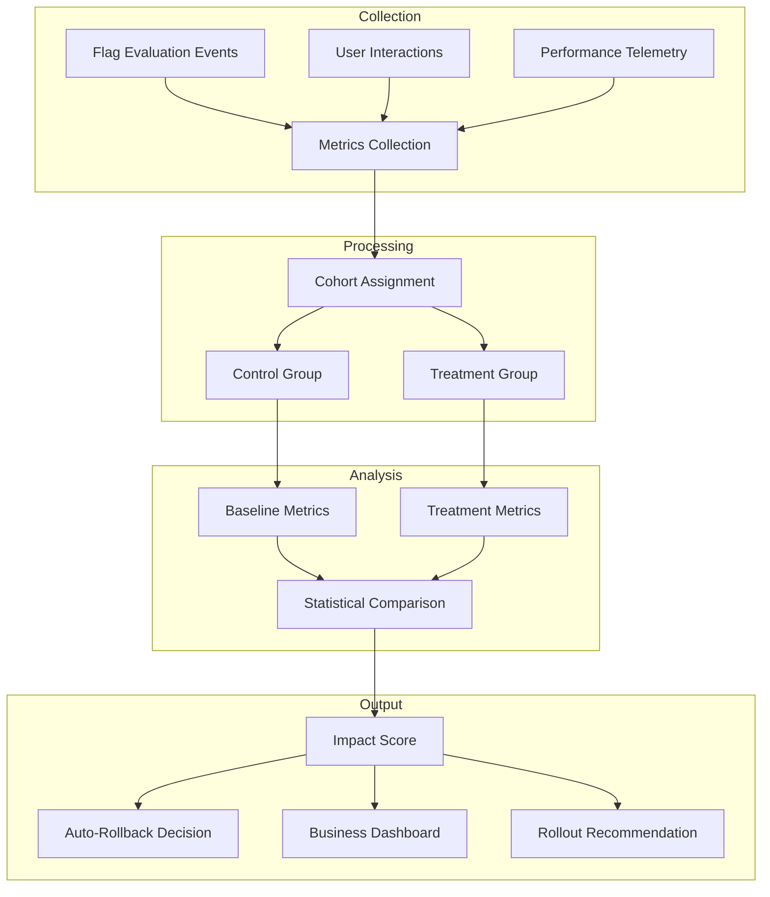
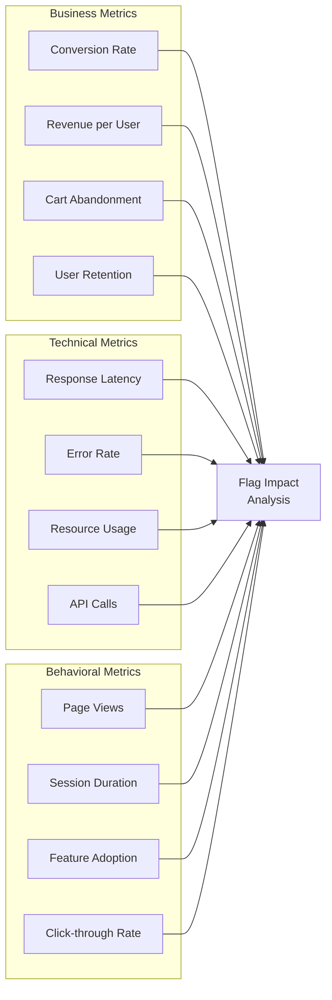
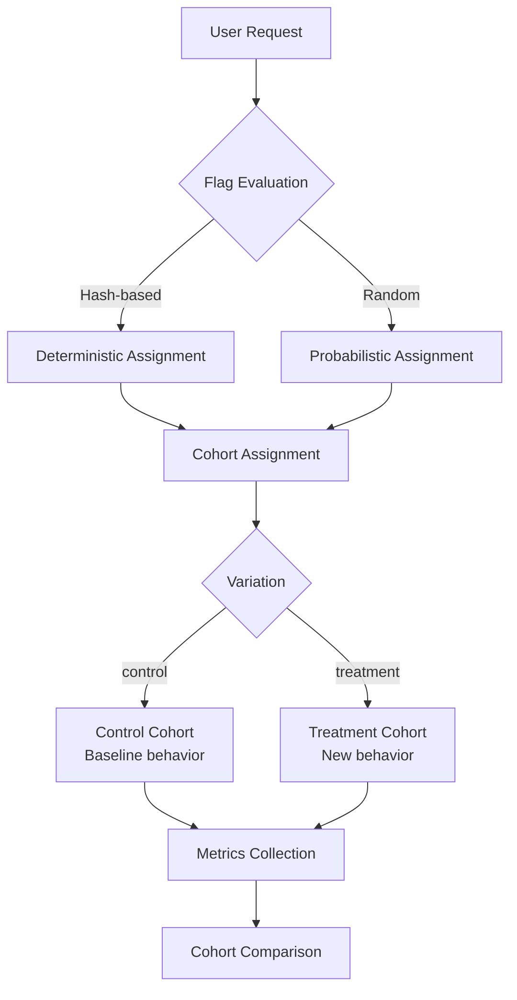
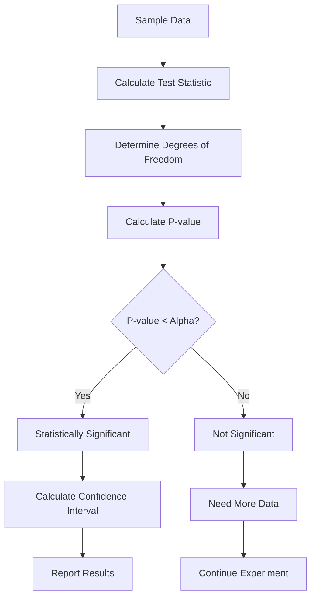
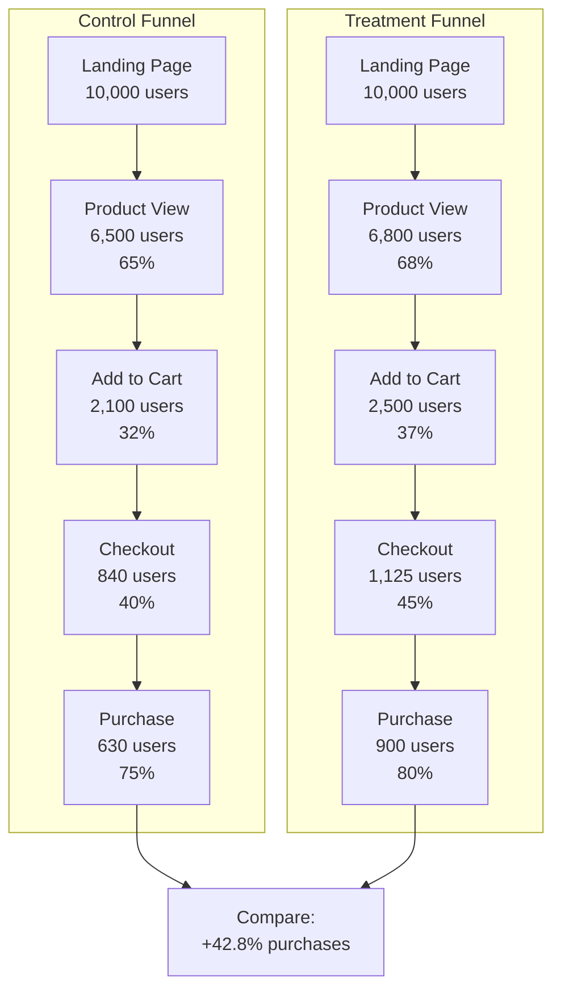
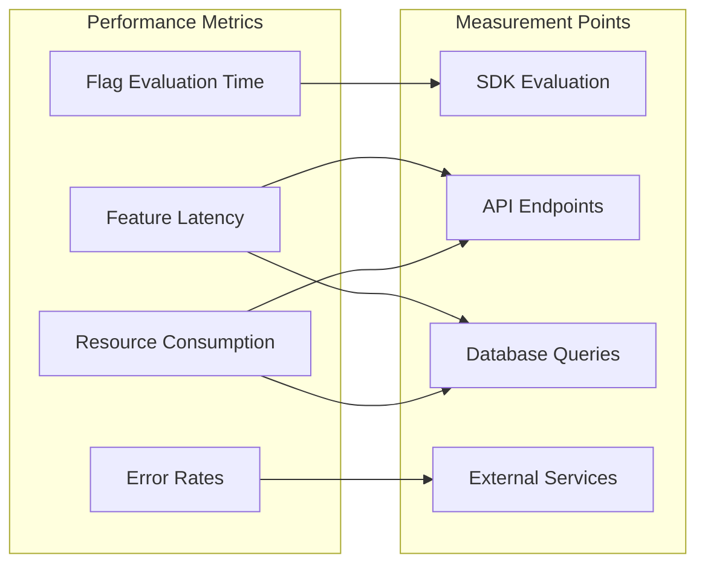
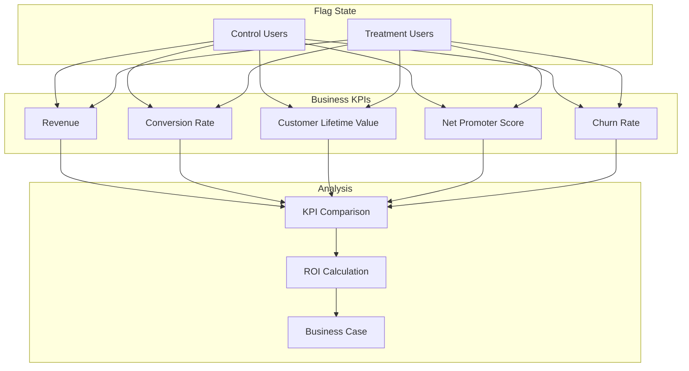
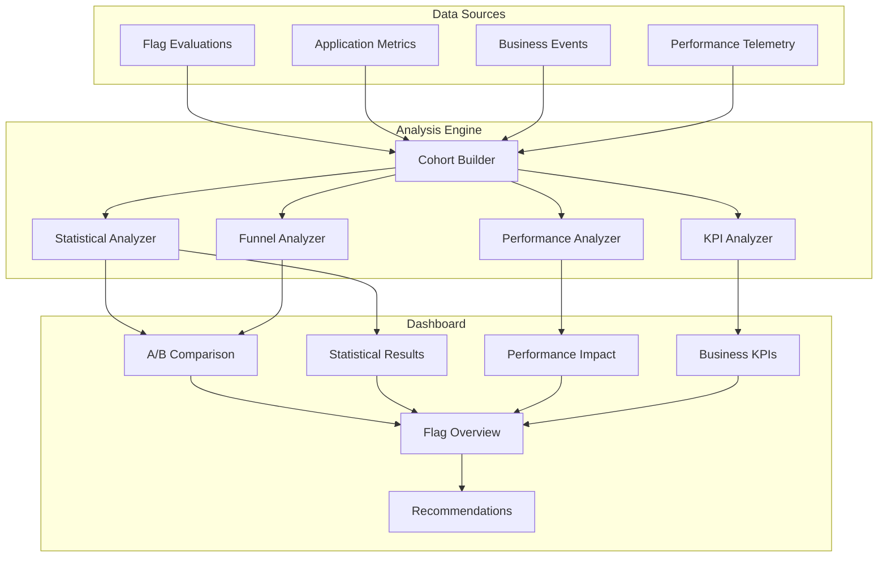

# How to Build Flag Impact Analysis

Author: [nawazdhandala](https://github.com/nawazdhandala)

Tags: Feature Flags, Analytics, Impact Analysis, Metrics

Description: Learn how to analyze the business and technical impact of feature flags.

---

Feature flags are powerful tools for controlled rollouts, but without proper impact analysis, you're flying blind. Did that new checkout flow increase conversions? Is the experimental algorithm causing latency spikes? Are users with the flag enabled churning faster?

Flag impact analysis answers these questions by connecting flag states to business outcomes. This guide covers how to build a comprehensive impact analysis system: metrics collection, A/B comparison, statistical significance, user behavior correlation, performance measurement, and business KPI tracking.

---

## Why Flag Impact Analysis Matters

Feature flags decouple deployment from release. But this separation creates a knowledge gap: you know the code is running, but you don't know if it's working.

| Without Impact Analysis | With Impact Analysis |
|------------------------|---------------------|
| "We shipped the feature" | "The feature increased checkout conversion by 3.2%" |
| "It seems to be working fine" | "P95 latency increased 45ms for flagged users" |
| "Users haven't complained" | "Flagged cohort has 12% higher retention" |
| "We'll roll back if something breaks" | "Metrics degraded 2%; auto-rollback triggered" |

Impact analysis transforms feature flags from deployment switches into experimentation infrastructure.

---

## The Flag Impact Analysis Framework



The framework has four stages: collect flag-correlated data, process it into comparable cohorts, analyze the differences statistically, and output actionable insights.

---

## 1. Metrics Collection for Flags

Every flag evaluation should emit telemetry that links the flag state to downstream metrics.

### Flag Evaluation Tracking

```typescript
// flag-tracker.ts
interface FlagEvaluation {
  flagKey: string;
  userId: string;
  variation: string;        // "control", "treatment_a", "treatment_b"
  timestamp: Date;
  context: Record<string, any>;  // User attributes used in evaluation
  reason: string;           // Why this variation was selected
}

interface MetricEvent {
  eventType: string;
  userId: string;
  value: number;
  timestamp: Date;
  metadata: Record<string, any>;
  flagContext: FlagContext[];  // All active flags for this user
}

interface FlagContext {
  flagKey: string;
  variation: string;
  evaluatedAt: Date;
}

class FlagMetricsCollector {
  private flagEvaluations: Map<string, FlagEvaluation[]> = new Map();
  private metricsBuffer: MetricEvent[] = [];

  // Called on every flag evaluation
  trackEvaluation(evaluation: FlagEvaluation): void {
    const key = `${evaluation.userId}:${evaluation.flagKey}`;

    if (!this.flagEvaluations.has(key)) {
      this.flagEvaluations.set(key, []);
    }

    this.flagEvaluations.get(key)!.push(evaluation);

    // Emit to telemetry backend
    this.emit('flag.evaluation', {
      ...evaluation,
      attributes: {
        'flag.key': evaluation.flagKey,
        'flag.variation': evaluation.variation,
        'flag.reason': evaluation.reason,
      },
    });
  }

  // Called when tracking business metrics
  trackMetric(
    eventType: string,
    userId: string,
    value: number,
    metadata: Record<string, any> = {}
  ): void {
    // Get all active flag states for this user
    const flagContext = this.getActiveFlagContext(userId);

    const event: MetricEvent = {
      eventType,
      userId,
      value,
      timestamp: new Date(),
      metadata,
      flagContext,
    };

    this.metricsBuffer.push(event);

    // Emit with flag correlation
    this.emit('metric.recorded', {
      ...event,
      attributes: this.flagContextToAttributes(flagContext),
    });
  }

  private getActiveFlagContext(userId: string): FlagContext[] {
    const context: FlagContext[] = [];

    for (const [key, evaluations] of this.flagEvaluations.entries()) {
      if (key.startsWith(userId + ':')) {
        const latest = evaluations[evaluations.length - 1];
        context.push({
          flagKey: latest.flagKey,
          variation: latest.variation,
          evaluatedAt: latest.timestamp,
        });
      }
    }

    return context;
  }

  private flagContextToAttributes(context: FlagContext[]): Record<string, string> {
    const attrs: Record<string, string> = {};

    for (const flag of context) {
      attrs[`flag.${flag.flagKey}`] = flag.variation;
    }

    return attrs;
  }

  private emit(eventName: string, data: any): void {
    // Send to your telemetry backend (OpenTelemetry, Segment, etc.)
    console.log(`[${eventName}]`, JSON.stringify(data));
  }
}
```

### Metric Categories to Collect



```typescript
// metric-definitions.ts
interface MetricDefinition {
  name: string;
  type: 'counter' | 'gauge' | 'histogram' | 'rate';
  category: 'business' | 'technical' | 'behavioral';
  unit: string;
  aggregation: 'sum' | 'avg' | 'p50' | 'p95' | 'p99' | 'count';
  higherIsBetter: boolean;  // For determining positive/negative impact
}

const flagImpactMetrics: MetricDefinition[] = [
  // Business metrics
  {
    name: 'checkout.conversion_rate',
    type: 'rate',
    category: 'business',
    unit: 'percent',
    aggregation: 'avg',
    higherIsBetter: true,
  },
  {
    name: 'revenue.per_user',
    type: 'gauge',
    category: 'business',
    unit: 'dollars',
    aggregation: 'avg',
    higherIsBetter: true,
  },
  {
    name: 'cart.abandonment_rate',
    type: 'rate',
    category: 'business',
    unit: 'percent',
    aggregation: 'avg',
    higherIsBetter: false,
  },

  // Technical metrics
  {
    name: 'api.latency',
    type: 'histogram',
    category: 'technical',
    unit: 'milliseconds',
    aggregation: 'p95',
    higherIsBetter: false,
  },
  {
    name: 'api.error_rate',
    type: 'rate',
    category: 'technical',
    unit: 'percent',
    aggregation: 'avg',
    higherIsBetter: false,
  },

  // Behavioral metrics
  {
    name: 'session.duration',
    type: 'histogram',
    category: 'behavioral',
    unit: 'seconds',
    aggregation: 'avg',
    higherIsBetter: true,
  },
  {
    name: 'feature.adoption_rate',
    type: 'rate',
    category: 'behavioral',
    unit: 'percent',
    aggregation: 'avg',
    higherIsBetter: true,
  },
];
```

---

## 2. A/B Comparison Analysis

The core of flag impact analysis is comparing metrics between cohorts.

### Cohort Definition and Assignment



```typescript
// cohort-analyzer.ts
interface CohortMetrics {
  cohortName: string;
  sampleSize: number;
  metrics: Map<string, AggregatedMetric>;
}

interface AggregatedMetric {
  metricName: string;
  count: number;
  sum: number;
  mean: number;
  variance: number;
  min: number;
  max: number;
  percentiles: { p50: number; p95: number; p99: number };
}

interface ComparisonResult {
  metricName: string;
  control: AggregatedMetric;
  treatment: AggregatedMetric;
  absoluteDifference: number;
  relativeDifference: number;  // Percentage change
  improvementDirection: 'positive' | 'negative' | 'neutral';
}

class CohortAnalyzer {
  private metricsStore: Map<string, MetricEvent[]> = new Map();

  // Ingest metrics partitioned by cohort
  ingestMetrics(cohort: string, events: MetricEvent[]): void {
    if (!this.metricsStore.has(cohort)) {
      this.metricsStore.set(cohort, []);
    }
    this.metricsStore.get(cohort)!.push(...events);
  }

  // Aggregate metrics for a cohort
  aggregateCohort(cohortName: string): CohortMetrics {
    const events = this.metricsStore.get(cohortName) || [];
    const metricsByType = new Map<string, number[]>();

    // Group values by metric type
    for (const event of events) {
      if (!metricsByType.has(event.eventType)) {
        metricsByType.set(event.eventType, []);
      }
      metricsByType.get(event.eventType)!.push(event.value);
    }

    // Calculate aggregations
    const aggregatedMetrics = new Map<string, AggregatedMetric>();

    for (const [metricName, values] of metricsByType.entries()) {
      aggregatedMetrics.set(metricName, this.calculateAggregations(metricName, values));
    }

    return {
      cohortName,
      sampleSize: new Set(events.map(e => e.userId)).size,
      metrics: aggregatedMetrics,
    };
  }

  private calculateAggregations(metricName: string, values: number[]): AggregatedMetric {
    const sorted = [...values].sort((a, b) => a - b);
    const n = values.length;
    const sum = values.reduce((a, b) => a + b, 0);
    const mean = sum / n;

    // Calculate variance
    const squaredDiffs = values.map(v => Math.pow(v - mean, 2));
    const variance = squaredDiffs.reduce((a, b) => a + b, 0) / n;

    return {
      metricName,
      count: n,
      sum,
      mean,
      variance,
      min: sorted[0],
      max: sorted[n - 1],
      percentiles: {
        p50: sorted[Math.floor(n * 0.5)],
        p95: sorted[Math.floor(n * 0.95)],
        p99: sorted[Math.floor(n * 0.99)],
      },
    };
  }

  // Compare two cohorts
  compare(
    controlCohort: CohortMetrics,
    treatmentCohort: CohortMetrics,
    metricDefinitions: MetricDefinition[]
  ): ComparisonResult[] {
    const results: ComparisonResult[] = [];

    for (const definition of metricDefinitions) {
      const controlMetric = controlCohort.metrics.get(definition.name);
      const treatmentMetric = treatmentCohort.metrics.get(definition.name);

      if (!controlMetric || !treatmentMetric) continue;

      const absoluteDiff = treatmentMetric.mean - controlMetric.mean;
      const relativeDiff = controlMetric.mean !== 0
        ? (absoluteDiff / controlMetric.mean) * 100
        : 0;

      // Determine if the change is positive based on metric definition
      let direction: ComparisonResult['improvementDirection'];
      if (Math.abs(relativeDiff) < 0.1) {
        direction = 'neutral';
      } else if (definition.higherIsBetter) {
        direction = relativeDiff > 0 ? 'positive' : 'negative';
      } else {
        direction = relativeDiff < 0 ? 'positive' : 'negative';
      }

      results.push({
        metricName: definition.name,
        control: controlMetric,
        treatment: treatmentMetric,
        absoluteDifference: absoluteDiff,
        relativeDifference: relativeDiff,
        improvementDirection: direction,
      });
    }

    return results;
  }
}

// Example usage
const analyzer = new CohortAnalyzer();

// Ingest data from your metrics backend
analyzer.ingestMetrics('control', controlEvents);
analyzer.ingestMetrics('treatment', treatmentEvents);

const controlMetrics = analyzer.aggregateCohort('control');
const treatmentMetrics = analyzer.aggregateCohort('treatment');

const comparison = analyzer.compare(controlMetrics, treatmentMetrics, flagImpactMetrics);

// Result:
// [{
//   metricName: 'checkout.conversion_rate',
//   control: { mean: 0.032, ... },
//   treatment: { mean: 0.038, ... },
//   relativeDifference: 18.75,
//   improvementDirection: 'positive'
// }, ...]
```

---

## 3. Statistical Significance

Raw differences mean nothing without statistical confidence. A 5% improvement might be noise.

### Significance Testing



```typescript
// statistical-analysis.ts
interface StatisticalResult {
  metricName: string;
  controlMean: number;
  treatmentMean: number;
  difference: number;
  differencePercent: number;
  standardError: number;
  tStatistic: number;
  pValue: number;
  confidenceInterval: { lower: number; upper: number };
  isSignificant: boolean;
  confidenceLevel: number;
  sampleSizeSufficient: boolean;
  minimumDetectableEffect: number;
}

class StatisticalAnalyzer {
  private readonly defaultAlpha = 0.05;  // 95% confidence
  private readonly defaultPower = 0.8;   // 80% power

  // Two-sample t-test for comparing means
  calculateSignificance(
    control: AggregatedMetric,
    treatment: AggregatedMetric,
    alpha: number = this.defaultAlpha
  ): StatisticalResult {
    const n1 = control.count;
    const n2 = treatment.count;
    const mean1 = control.mean;
    const mean2 = treatment.mean;
    const var1 = control.variance;
    const var2 = treatment.variance;

    // Pooled standard error
    const standardError = Math.sqrt(var1 / n1 + var2 / n2);

    // T-statistic
    const tStatistic = standardError > 0
      ? (mean2 - mean1) / standardError
      : 0;

    // Degrees of freedom (Welch's approximation)
    const df = this.welchDegreesOfFreedom(var1, n1, var2, n2);

    // P-value (two-tailed)
    const pValue = this.tDistributionPValue(Math.abs(tStatistic), df);

    // Confidence interval
    const tCritical = this.tCriticalValue(alpha / 2, df);
    const marginOfError = tCritical * standardError;
    const difference = mean2 - mean1;

    // Minimum detectable effect (MDE) calculation
    const mde = this.calculateMDE(n1, n2, Math.sqrt(var1), Math.sqrt(var2), alpha);

    // Check sample size sufficiency
    const sampleSizeSufficient = n1 >= 100 && n2 >= 100 &&
      Math.abs(difference) >= mde;

    return {
      metricName: control.metricName,
      controlMean: mean1,
      treatmentMean: mean2,
      difference,
      differencePercent: mean1 !== 0 ? (difference / mean1) * 100 : 0,
      standardError,
      tStatistic,
      pValue,
      confidenceInterval: {
        lower: difference - marginOfError,
        upper: difference + marginOfError,
      },
      isSignificant: pValue < alpha,
      confidenceLevel: (1 - alpha) * 100,
      sampleSizeSufficient,
      minimumDetectableEffect: mde,
    };
  }

  // Welch's degrees of freedom for unequal variances
  private welchDegreesOfFreedom(
    var1: number, n1: number,
    var2: number, n2: number
  ): number {
    const v1 = var1 / n1;
    const v2 = var2 / n2;
    const numerator = Math.pow(v1 + v2, 2);
    const denominator = Math.pow(v1, 2) / (n1 - 1) + Math.pow(v2, 2) / (n2 - 1);
    return numerator / denominator;
  }

  // Approximate p-value from t-distribution
  private tDistributionPValue(t: number, df: number): number {
    // Using approximation for large df (normal approximation)
    // For production, use a proper statistics library
    if (df > 30) {
      // Normal approximation
      return 2 * (1 - this.normalCDF(t));
    }
    // For smaller df, use t-distribution lookup or numerical integration
    // Simplified approximation here
    const x = df / (df + t * t);
    return this.incompleteBeta(df / 2, 0.5, x);
  }

  private normalCDF(x: number): number {
    // Standard normal CDF approximation
    const a1 = 0.254829592;
    const a2 = -0.284496736;
    const a3 = 1.421413741;
    const a4 = -1.453152027;
    const a5 = 1.061405429;
    const p = 0.3275911;

    const sign = x < 0 ? -1 : 1;
    x = Math.abs(x) / Math.sqrt(2);

    const t = 1.0 / (1.0 + p * x);
    const y = 1.0 - (((((a5 * t + a4) * t) + a3) * t + a2) * t + a1) * t * Math.exp(-x * x);

    return 0.5 * (1.0 + sign * y);
  }

  private incompleteBeta(a: number, b: number, x: number): number {
    // Simplified approximation - use a statistics library in production
    // This is a placeholder that gives reasonable results
    if (x === 0) return 0;
    if (x === 1) return 1;
    return Math.pow(x, a) * Math.pow(1 - x, b) * 10; // Rough approximation
  }

  private tCriticalValue(alpha: number, df: number): number {
    // Approximation for t critical value
    // For production, use a proper lookup table or library
    if (df > 30) {
      // Use z-score approximation
      return this.zCriticalValue(alpha);
    }
    // Simplified t-value lookup
    const tTable: Record<number, number> = {
      1: 12.706, 2: 4.303, 5: 2.571, 10: 2.228,
      20: 2.086, 30: 2.042,
    };
    const closestDf = Object.keys(tTable)
      .map(Number)
      .reduce((a, b) => Math.abs(b - df) < Math.abs(a - df) ? b : a);
    return tTable[closestDf] || 1.96;
  }

  private zCriticalValue(alpha: number): number {
    // Z critical values for common alpha levels
    const zTable: Record<number, number> = {
      0.10: 1.645,
      0.05: 1.96,
      0.025: 2.24,
      0.01: 2.576,
      0.005: 2.807,
    };
    return zTable[alpha] || 1.96;
  }

  // Calculate minimum detectable effect
  private calculateMDE(
    n1: number, n2: number,
    sd1: number, sd2: number,
    alpha: number
  ): number {
    const pooledSD = Math.sqrt((sd1 * sd1 + sd2 * sd2) / 2);
    const z_alpha = this.zCriticalValue(alpha / 2);
    const z_beta = 0.84; // For 80% power

    return (z_alpha + z_beta) * pooledSD * Math.sqrt(1/n1 + 1/n2);
  }

  // Calculate required sample size for desired effect detection
  calculateRequiredSampleSize(
    expectedEffect: number,
    baselineSD: number,
    alpha: number = 0.05,
    power: number = 0.8
  ): number {
    const z_alpha = this.zCriticalValue(alpha / 2);
    const z_beta = power === 0.8 ? 0.84 : 1.28; // 80% or 90% power

    const n = 2 * Math.pow((z_alpha + z_beta) * baselineSD / expectedEffect, 2);
    return Math.ceil(n);
  }
}

// Example usage
const statsAnalyzer = new StatisticalAnalyzer();

const result = statsAnalyzer.calculateSignificance(
  { metricName: 'conversion_rate', count: 5000, mean: 0.032, variance: 0.001, ...rest },
  { metricName: 'conversion_rate', count: 4800, mean: 0.038, variance: 0.0012, ...rest }
);

// Result:
// {
//   metricName: 'conversion_rate',
//   difference: 0.006,
//   differencePercent: 18.75,
//   pValue: 0.023,
//   isSignificant: true,
//   confidenceInterval: { lower: 0.002, upper: 0.010 },
//   confidenceLevel: 95
// }
```

### Interpreting Results

| P-value Range | Interpretation | Recommendation |
|---------------|----------------|----------------|
| p < 0.01 | Highly significant | Strong evidence for effect |
| 0.01 <= p < 0.05 | Significant | Evidence supports effect |
| 0.05 <= p < 0.10 | Marginally significant | Weak evidence, gather more data |
| p >= 0.10 | Not significant | No evidence for effect |

---

## 4. User Behavior Correlation

Connect flag states to user journeys and behavioral patterns.

### Funnel Analysis by Flag State



```typescript
// funnel-analysis.ts
interface FunnelStep {
  stepName: string;
  userCount: number;
  conversionFromPrevious: number;  // Percentage
  conversionFromStart: number;     // Percentage
}

interface FunnelComparison {
  stepName: string;
  controlUsers: number;
  treatmentUsers: number;
  controlConversion: number;
  treatmentConversion: number;
  conversionLift: number;
  significantDifference: boolean;
}

class FunnelAnalyzer {
  private steps: string[] = [];
  private controlData: Map<string, Set<string>> = new Map();
  private treatmentData: Map<string, Set<string>> = new Map();

  constructor(funnelSteps: string[]) {
    this.steps = funnelSteps;
    for (const step of funnelSteps) {
      this.controlData.set(step, new Set());
      this.treatmentData.set(step, new Set());
    }
  }

  // Track user reaching a funnel step
  trackStep(userId: string, step: string, isControl: boolean): void {
    const data = isControl ? this.controlData : this.treatmentData;
    const stepUsers = data.get(step);
    if (stepUsers) {
      stepUsers.add(userId);
    }
  }

  // Analyze funnel for a cohort
  analyzeFunnel(isControl: boolean): FunnelStep[] {
    const data = isControl ? this.controlData : this.treatmentData;
    const result: FunnelStep[] = [];
    let previousCount = 0;
    const startCount = data.get(this.steps[0])?.size || 0;

    for (let i = 0; i < this.steps.length; i++) {
      const stepName = this.steps[i];
      const userCount = data.get(stepName)?.size || 0;

      result.push({
        stepName,
        userCount,
        conversionFromPrevious: i === 0
          ? 100
          : previousCount > 0 ? (userCount / previousCount) * 100 : 0,
        conversionFromStart: startCount > 0
          ? (userCount / startCount) * 100
          : 0,
      });

      previousCount = userCount;
    }

    return result;
  }

  // Compare funnels between cohorts
  compareFunnels(): FunnelComparison[] {
    const controlFunnel = this.analyzeFunnel(true);
    const treatmentFunnel = this.analyzeFunnel(false);
    const comparisons: FunnelComparison[] = [];

    for (let i = 0; i < this.steps.length; i++) {
      const control = controlFunnel[i];
      const treatment = treatmentFunnel[i];

      const conversionLift = control.conversionFromStart > 0
        ? ((treatment.conversionFromStart - control.conversionFromStart) /
           control.conversionFromStart) * 100
        : 0;

      // Chi-squared test for significance
      const significant = this.chiSquaredTest(
        control.userCount,
        controlFunnel[0].userCount - control.userCount,
        treatment.userCount,
        treatmentFunnel[0].userCount - treatment.userCount
      );

      comparisons.push({
        stepName: this.steps[i],
        controlUsers: control.userCount,
        treatmentUsers: treatment.userCount,
        controlConversion: control.conversionFromStart,
        treatmentConversion: treatment.conversionFromStart,
        conversionLift,
        significantDifference: significant,
      });
    }

    return comparisons;
  }

  // Chi-squared test for categorical data
  private chiSquaredTest(
    a: number, b: number,  // Control: converted, not converted
    c: number, d: number   // Treatment: converted, not converted
  ): boolean {
    const n = a + b + c + d;
    const expected_a = (a + b) * (a + c) / n;
    const expected_b = (a + b) * (b + d) / n;
    const expected_c = (c + d) * (a + c) / n;
    const expected_d = (c + d) * (b + d) / n;

    const chiSquared =
      Math.pow(a - expected_a, 2) / expected_a +
      Math.pow(b - expected_b, 2) / expected_b +
      Math.pow(c - expected_c, 2) / expected_c +
      Math.pow(d - expected_d, 2) / expected_d;

    // Chi-squared critical value for df=1, alpha=0.05 is 3.84
    return chiSquared > 3.84;
  }

  // Identify where users drop off most
  findBiggestDropoff(): { step: string; cohort: string; dropoffRate: number } {
    const comparisons = this.compareFunnels();
    let maxDropoff = { step: '', cohort: '', dropoffRate: 0 };

    for (let i = 1; i < comparisons.length; i++) {
      const prev = comparisons[i - 1];
      const curr = comparisons[i];

      const controlDropoff = prev.controlConversion - curr.controlConversion;
      const treatmentDropoff = prev.treatmentConversion - curr.treatmentConversion;

      if (controlDropoff > maxDropoff.dropoffRate) {
        maxDropoff = { step: curr.stepName, cohort: 'control', dropoffRate: controlDropoff };
      }
      if (treatmentDropoff > maxDropoff.dropoffRate) {
        maxDropoff = { step: curr.stepName, cohort: 'treatment', dropoffRate: treatmentDropoff };
      }
    }

    return maxDropoff;
  }
}

// Example usage
const funnel = new FunnelAnalyzer([
  'landing_page',
  'product_view',
  'add_to_cart',
  'checkout',
  'purchase'
]);

// Track user events...
funnel.trackStep('user123', 'landing_page', false);  // Treatment user
funnel.trackStep('user123', 'product_view', false);
// ...

const comparison = funnel.compareFunnels();
// Shows conversion lift at each step with significance testing
```

### User Segmentation Analysis

```typescript
// segment-analysis.ts
interface UserSegment {
  name: string;
  criteria: (user: UserProfile) => boolean;
}

interface UserProfile {
  userId: string;
  country: string;
  platform: 'web' | 'ios' | 'android';
  accountAge: number;  // Days
  tier: 'free' | 'pro' | 'enterprise';
  previousPurchases: number;
}

interface SegmentImpact {
  segmentName: string;
  controlSampleSize: number;
  treatmentSampleSize: number;
  controlMetricValue: number;
  treatmentMetricValue: number;
  lift: number;
  isSignificant: boolean;
}

class SegmentAnalyzer {
  private segments: UserSegment[] = [
    { name: 'New Users', criteria: u => u.accountAge < 30 },
    { name: 'Power Users', criteria: u => u.previousPurchases > 10 },
    { name: 'Mobile Users', criteria: u => u.platform !== 'web' },
    { name: 'Enterprise', criteria: u => u.tier === 'enterprise' },
    { name: 'US Users', criteria: u => u.country === 'US' },
  ];

  analyzeImpactBySegment(
    users: UserProfile[],
    flagStates: Map<string, string>,  // userId -> variation
    metrics: Map<string, number>,     // userId -> metric value
    metricName: string
  ): SegmentImpact[] {
    const results: SegmentImpact[] = [];

    for (const segment of this.segments) {
      // Filter users in this segment
      const segmentUsers = users.filter(segment.criteria);

      // Split by flag state
      const control = segmentUsers.filter(u => flagStates.get(u.userId) === 'control');
      const treatment = segmentUsers.filter(u => flagStates.get(u.userId) === 'treatment');

      // Calculate metrics for each group
      const controlValues = control.map(u => metrics.get(u.userId) || 0);
      const treatmentValues = treatment.map(u => metrics.get(u.userId) || 0);

      const controlMean = this.mean(controlValues);
      const treatmentMean = this.mean(treatmentValues);
      const lift = controlMean > 0 ? ((treatmentMean - controlMean) / controlMean) * 100 : 0;

      // Statistical significance
      const isSignificant = this.tTest(controlValues, treatmentValues) < 0.05;

      results.push({
        segmentName: segment.name,
        controlSampleSize: control.length,
        treatmentSampleSize: treatment.length,
        controlMetricValue: controlMean,
        treatmentMetricValue: treatmentMean,
        lift,
        isSignificant,
      });
    }

    return results;
  }

  private mean(values: number[]): number {
    if (values.length === 0) return 0;
    return values.reduce((a, b) => a + b, 0) / values.length;
  }

  private tTest(group1: number[], group2: number[]): number {
    // Simplified t-test implementation
    // Returns p-value (use a statistics library in production)
    const n1 = group1.length;
    const n2 = group2.length;
    if (n1 < 2 || n2 < 2) return 1;

    const mean1 = this.mean(group1);
    const mean2 = this.mean(group2);
    const var1 = group1.reduce((sum, v) => sum + Math.pow(v - mean1, 2), 0) / (n1 - 1);
    const var2 = group2.reduce((sum, v) => sum + Math.pow(v - mean2, 2), 0) / (n2 - 1);

    const se = Math.sqrt(var1 / n1 + var2 / n2);
    if (se === 0) return 1;

    const t = Math.abs(mean2 - mean1) / se;

    // Approximate p-value (simplified)
    return Math.exp(-0.717 * t - 0.416 * t * t);
  }
}
```

---

## 5. Performance Impact Measurement

Feature flags can introduce latency. Measure and monitor performance impact.

### Performance Metrics Tracking



```typescript
// performance-tracker.ts
interface PerformanceMetrics {
  flagKey: string;
  variation: string;
  evaluationTimeMs: number;
  featureLatencyMs: number;
  memoryUsageMB: number;
  cpuUsagePercent: number;
  errorCount: number;
  requestCount: number;
}

interface PerformanceImpact {
  flagKey: string;
  controlLatencyP50: number;
  controlLatencyP95: number;
  treatmentLatencyP50: number;
  treatmentLatencyP95: number;
  latencyImpactMs: number;
  latencyImpactPercent: number;
  errorRateChange: number;
  recommendation: 'safe' | 'monitor' | 'investigate' | 'rollback';
}

class PerformanceAnalyzer {
  private metrics: Map<string, PerformanceMetrics[]> = new Map();

  // Thresholds for recommendations
  private readonly thresholds = {
    latencyIncreaseWarning: 50,    // ms
    latencyIncreaseCritical: 200,  // ms
    errorRateIncreaseWarning: 0.5, // percentage points
    errorRateIncreaseCritical: 2,  // percentage points
  };

  recordMetrics(metrics: PerformanceMetrics): void {
    const key = `${metrics.flagKey}:${metrics.variation}`;
    if (!this.metrics.has(key)) {
      this.metrics.set(key, []);
    }
    this.metrics.get(key)!.push(metrics);
  }

  analyzePerformanceImpact(flagKey: string): PerformanceImpact {
    const controlMetrics = this.metrics.get(`${flagKey}:control`) || [];
    const treatmentMetrics = this.metrics.get(`${flagKey}:treatment`) || [];

    // Calculate latency percentiles
    const controlLatencies = controlMetrics.map(m => m.featureLatencyMs).sort((a, b) => a - b);
    const treatmentLatencies = treatmentMetrics.map(m => m.featureLatencyMs).sort((a, b) => a - b);

    const controlP50 = this.percentile(controlLatencies, 50);
    const controlP95 = this.percentile(controlLatencies, 95);
    const treatmentP50 = this.percentile(treatmentLatencies, 50);
    const treatmentP95 = this.percentile(treatmentLatencies, 95);

    const latencyImpact = treatmentP95 - controlP95;
    const latencyPercent = controlP95 > 0 ? (latencyImpact / controlP95) * 100 : 0;

    // Calculate error rates
    const controlErrors = controlMetrics.reduce((sum, m) => sum + m.errorCount, 0);
    const controlRequests = controlMetrics.reduce((sum, m) => sum + m.requestCount, 0);
    const treatmentErrors = treatmentMetrics.reduce((sum, m) => sum + m.errorCount, 0);
    const treatmentRequests = treatmentMetrics.reduce((sum, m) => sum + m.requestCount, 0);

    const controlErrorRate = controlRequests > 0 ? (controlErrors / controlRequests) * 100 : 0;
    const treatmentErrorRate = treatmentRequests > 0 ? (treatmentErrors / treatmentRequests) * 100 : 0;
    const errorRateChange = treatmentErrorRate - controlErrorRate;

    // Generate recommendation
    const recommendation = this.generateRecommendation(latencyImpact, errorRateChange);

    return {
      flagKey,
      controlLatencyP50: controlP50,
      controlLatencyP95: controlP95,
      treatmentLatencyP50: treatmentP50,
      treatmentLatencyP95: treatmentP95,
      latencyImpactMs: latencyImpact,
      latencyImpactPercent: latencyPercent,
      errorRateChange,
      recommendation,
    };
  }

  private percentile(sorted: number[], p: number): number {
    if (sorted.length === 0) return 0;
    const index = Math.ceil((p / 100) * sorted.length) - 1;
    return sorted[Math.max(0, index)];
  }

  private generateRecommendation(
    latencyImpact: number,
    errorRateChange: number
  ): PerformanceImpact['recommendation'] {
    // Critical thresholds
    if (
      latencyImpact > this.thresholds.latencyIncreaseCritical ||
      errorRateChange > this.thresholds.errorRateIncreaseCritical
    ) {
      return 'rollback';
    }

    // Warning thresholds
    if (
      latencyImpact > this.thresholds.latencyIncreaseWarning ||
      errorRateChange > this.thresholds.errorRateIncreaseWarning
    ) {
      return 'investigate';
    }

    // Minor impact
    if (latencyImpact > 10 || errorRateChange > 0.1) {
      return 'monitor';
    }

    return 'safe';
  }

  // Generate performance comparison report
  generateReport(flagKey: string): string {
    const impact = this.analyzePerformanceImpact(flagKey);

    return `
Performance Impact Report: ${flagKey}
=====================================

Latency (P95):
  Control:   ${impact.controlLatencyP95.toFixed(1)}ms
  Treatment: ${impact.treatmentLatencyP95.toFixed(1)}ms
  Impact:    ${impact.latencyImpactMs > 0 ? '+' : ''}${impact.latencyImpactMs.toFixed(1)}ms (${impact.latencyImpactPercent.toFixed(1)}%)

Error Rate Change: ${impact.errorRateChange > 0 ? '+' : ''}${impact.errorRateChange.toFixed(2)} percentage points

Recommendation: ${impact.recommendation.toUpperCase()}

${this.getRecommendationDetails(impact.recommendation)}
    `.trim();
  }

  private getRecommendationDetails(rec: PerformanceImpact['recommendation']): string {
    const details: Record<string, string> = {
      safe: 'Performance metrics are within acceptable ranges. Safe to continue rollout.',
      monitor: 'Minor performance changes detected. Continue monitoring closely.',
      investigate: 'Significant performance degradation detected. Investigate before expanding rollout.',
      rollback: 'CRITICAL: Major performance issues detected. Immediate rollback recommended.',
    };
    return details[rec];
  }
}
```

### Auto-Rollback Based on Performance

```typescript
// auto-rollback.ts
interface RollbackRule {
  metric: string;
  threshold: number;
  operator: 'gt' | 'lt' | 'gte' | 'lte';
  windowMinutes: number;
  action: 'alert' | 'reduce_rollout' | 'rollback';
}

interface RollbackDecision {
  shouldRollback: boolean;
  triggeredRules: RollbackRule[];
  currentValues: Map<string, number>;
  recommendation: string;
}

class AutoRollbackController {
  private rules: RollbackRule[] = [
    {
      metric: 'error_rate',
      threshold: 5,
      operator: 'gt',
      windowMinutes: 5,
      action: 'rollback',
    },
    {
      metric: 'latency_p95',
      threshold: 500,
      operator: 'gt',
      windowMinutes: 10,
      action: 'reduce_rollout',
    },
    {
      metric: 'error_rate',
      threshold: 2,
      operator: 'gt',
      windowMinutes: 5,
      action: 'alert',
    },
  ];

  evaluate(currentMetrics: Map<string, number>): RollbackDecision {
    const triggeredRules: RollbackRule[] = [];

    for (const rule of this.rules) {
      const value = currentMetrics.get(rule.metric);
      if (value === undefined) continue;

      const triggered = this.checkRule(value, rule.threshold, rule.operator);
      if (triggered) {
        triggeredRules.push(rule);
      }
    }

    // Sort by severity (rollback > reduce_rollout > alert)
    const severityOrder = { rollback: 3, reduce_rollout: 2, alert: 1 };
    triggeredRules.sort((a, b) => severityOrder[b.action] - severityOrder[a.action]);

    const shouldRollback = triggeredRules.some(r => r.action === 'rollback');
    const recommendation = this.generateRecommendation(triggeredRules);

    return {
      shouldRollback,
      triggeredRules,
      currentValues: currentMetrics,
      recommendation,
    };
  }

  private checkRule(value: number, threshold: number, operator: string): boolean {
    switch (operator) {
      case 'gt': return value > threshold;
      case 'lt': return value < threshold;
      case 'gte': return value >= threshold;
      case 'lte': return value <= threshold;
      default: return false;
    }
  }

  private generateRecommendation(rules: RollbackRule[]): string {
    if (rules.length === 0) {
      return 'All metrics within acceptable ranges. Continue rollout.';
    }

    const actions = rules.map(r => r.action);

    if (actions.includes('rollback')) {
      return 'CRITICAL: Immediate rollback required. Multiple metrics exceed critical thresholds.';
    }

    if (actions.includes('reduce_rollout')) {
      return 'WARNING: Reduce rollout percentage and investigate. Performance degradation detected.';
    }

    return 'ALERT: Monitor closely. Some metrics approaching thresholds.';
  }
}

// Integration with flag management
async function checkAndRollback(
  flagKey: string,
  performanceAnalyzer: PerformanceAnalyzer,
  rollbackController: AutoRollbackController,
  flagService: FlagManagementService
): Promise<void> {
  const impact = performanceAnalyzer.analyzePerformanceImpact(flagKey);

  const metrics = new Map<string, number>([
    ['error_rate', impact.errorRateChange],
    ['latency_p95', impact.treatmentLatencyP95],
  ]);

  const decision = rollbackController.evaluate(metrics);

  if (decision.shouldRollback) {
    console.log(`Auto-rollback triggered for flag: ${flagKey}`);
    console.log(`Reason: ${decision.recommendation}`);

    await flagService.rollback(flagKey);
    await alertOncall(flagKey, decision);
  } else if (decision.triggeredRules.length > 0) {
    console.log(`Warning for flag: ${flagKey}`);
    console.log(`Recommendation: ${decision.recommendation}`);
  }
}
```

---

## 6. Business KPI Tracking

Connect flag impact to business outcomes that matter to stakeholders.

### KPI Definition and Tracking



```typescript
// kpi-tracker.ts
interface KPIDefinition {
  name: string;
  description: string;
  unit: string;
  calculationMethod: 'sum' | 'average' | 'rate' | 'percentile';
  timeWindow: 'daily' | 'weekly' | 'monthly';
  higherIsBetter: boolean;
  businessWeight: number;  // Importance weight 0-1
}

interface KPIResult {
  kpi: KPIDefinition;
  controlValue: number;
  treatmentValue: number;
  absoluteChange: number;
  percentChange: number;
  dollarImpact: number;      // Estimated $ impact
  isStatisticallySignificant: boolean;
  confidenceInterval: { lower: number; upper: number };
}

interface BusinessImpactSummary {
  flagKey: string;
  analysisWindow: { start: Date; end: Date };
  kpiResults: KPIResult[];
  overallImpactScore: number;    // Weighted composite score
  estimatedAnnualValue: number;  // Projected annual $ impact
  recommendation: 'ship' | 'iterate' | 'kill';
  riskAssessment: string;
}

class BusinessKPIAnalyzer {
  private kpis: KPIDefinition[] = [
    {
      name: 'revenue_per_user',
      description: 'Average revenue generated per active user',
      unit: 'dollars',
      calculationMethod: 'average',
      timeWindow: 'monthly',
      higherIsBetter: true,
      businessWeight: 0.35,
    },
    {
      name: 'conversion_rate',
      description: 'Percentage of visitors who complete purchase',
      unit: 'percent',
      calculationMethod: 'rate',
      timeWindow: 'weekly',
      higherIsBetter: true,
      businessWeight: 0.25,
    },
    {
      name: 'customer_retention_30d',
      description: '30-day customer retention rate',
      unit: 'percent',
      calculationMethod: 'rate',
      timeWindow: 'monthly',
      higherIsBetter: true,
      businessWeight: 0.20,
    },
    {
      name: 'support_tickets_per_user',
      description: 'Average support tickets raised per user',
      unit: 'count',
      calculationMethod: 'average',
      timeWindow: 'weekly',
      higherIsBetter: false,
      businessWeight: 0.10,
    },
    {
      name: 'feature_adoption_rate',
      description: 'Percentage of users engaging with new feature',
      unit: 'percent',
      calculationMethod: 'rate',
      timeWindow: 'weekly',
      higherIsBetter: true,
      businessWeight: 0.10,
    },
  ];

  // Company-wide metrics for impact calculation
  private companyMetrics = {
    monthlyActiveUsers: 100000,
    averageRevenuePerUser: 50,
    averageCustomerLifetimeMonths: 24,
    supportTicketCost: 15,  // $ per ticket
  };

  analyzeBusinessImpact(
    flagKey: string,
    controlData: Map<string, number[]>,
    treatmentData: Map<string, number[]>,
    analysisWindow: { start: Date; end: Date }
  ): BusinessImpactSummary {
    const kpiResults: KPIResult[] = [];
    let weightedImpactScore = 0;
    let totalAnnualImpact = 0;

    for (const kpi of this.kpis) {
      const controlValues = controlData.get(kpi.name) || [];
      const treatmentValues = treatmentData.get(kpi.name) || [];

      if (controlValues.length === 0 || treatmentValues.length === 0) continue;

      const result = this.calculateKPIImpact(kpi, controlValues, treatmentValues);
      kpiResults.push(result);

      // Accumulate weighted impact
      const normalizedChange = this.normalizeChange(result, kpi);
      weightedImpactScore += normalizedChange * kpi.businessWeight;

      // Accumulate dollar impact
      totalAnnualImpact += result.dollarImpact * 12;
    }

    // Generate recommendation based on overall impact
    const recommendation = this.generateRecommendation(
      weightedImpactScore,
      kpiResults
    );

    const riskAssessment = this.assessRisks(kpiResults);

    return {
      flagKey,
      analysisWindow,
      kpiResults,
      overallImpactScore: weightedImpactScore,
      estimatedAnnualValue: totalAnnualImpact,
      recommendation,
      riskAssessment,
    };
  }

  private calculateKPIImpact(
    kpi: KPIDefinition,
    controlValues: number[],
    treatmentValues: number[]
  ): KPIResult {
    const controlMean = this.mean(controlValues);
    const treatmentMean = this.mean(treatmentValues);
    const absoluteChange = treatmentMean - controlMean;
    const percentChange = controlMean !== 0
      ? (absoluteChange / controlMean) * 100
      : 0;

    // Statistical significance
    const { isSignificant, ci } = this.calculateSignificance(
      controlValues,
      treatmentValues
    );

    // Estimate dollar impact
    const dollarImpact = this.estimateDollarImpact(kpi, absoluteChange);

    return {
      kpi,
      controlValue: controlMean,
      treatmentValue: treatmentMean,
      absoluteChange,
      percentChange,
      dollarImpact,
      isStatisticallySignificant: isSignificant,
      confidenceInterval: ci,
    };
  }

  private estimateDollarImpact(kpi: KPIDefinition, change: number): number {
    const { monthlyActiveUsers, averageRevenuePerUser, averageCustomerLifetimeMonths, supportTicketCost } = this.companyMetrics;

    switch (kpi.name) {
      case 'revenue_per_user':
        // Direct revenue impact
        return change * monthlyActiveUsers;

      case 'conversion_rate':
        // More conversions = more revenue
        const additionalCustomers = (change / 100) * monthlyActiveUsers * 0.1; // Assume 10% are potential converters
        return additionalCustomers * averageRevenuePerUser;

      case 'customer_retention_30d':
        // Better retention = longer LTV
        const retainedCustomers = (change / 100) * monthlyActiveUsers;
        return retainedCustomers * averageRevenuePerUser * (averageCustomerLifetimeMonths / 12);

      case 'support_tickets_per_user':
        // Fewer tickets = cost savings
        const ticketReduction = -change * monthlyActiveUsers;
        return ticketReduction * supportTicketCost;

      default:
        return 0;
    }
  }

  private normalizeChange(result: KPIResult, kpi: KPIDefinition): number {
    // Normalize change to -1 to 1 scale
    const direction = kpi.higherIsBetter ? 1 : -1;
    const normalizedPercent = Math.max(-100, Math.min(100, result.percentChange));
    return (normalizedPercent / 100) * direction;
  }

  private calculateSignificance(
    control: number[],
    treatment: number[]
  ): { isSignificant: boolean; ci: { lower: number; upper: number } } {
    // Simplified t-test
    const n1 = control.length;
    const n2 = treatment.length;
    const mean1 = this.mean(control);
    const mean2 = this.mean(treatment);
    const var1 = this.variance(control);
    const var2 = this.variance(treatment);

    const se = Math.sqrt(var1 / n1 + var2 / n2);
    const diff = mean2 - mean1;
    const t = se > 0 ? diff / se : 0;

    // 95% confidence interval
    const marginOfError = 1.96 * se;

    return {
      isSignificant: Math.abs(t) > 1.96,
      ci: {
        lower: diff - marginOfError,
        upper: diff + marginOfError,
      },
    };
  }

  private generateRecommendation(
    impactScore: number,
    results: KPIResult[]
  ): 'ship' | 'iterate' | 'kill' {
    // Check for any significantly negative impacts
    const hasNegativeImpact = results.some(
      r => r.isStatisticallySignificant &&
           ((r.kpi.higherIsBetter && r.percentChange < -5) ||
            (!r.kpi.higherIsBetter && r.percentChange > 5))
    );

    if (hasNegativeImpact) {
      return 'kill';
    }

    // Check for positive impact
    const hasPositiveImpact = results.some(
      r => r.isStatisticallySignificant &&
           ((r.kpi.higherIsBetter && r.percentChange > 5) ||
            (!r.kpi.higherIsBetter && r.percentChange < -5))
    );

    if (impactScore > 0.1 && hasPositiveImpact) {
      return 'ship';
    }

    return 'iterate';
  }

  private assessRisks(results: KPIResult[]): string {
    const risks: string[] = [];

    for (const result of results) {
      if (!result.isStatisticallySignificant) {
        risks.push(`${result.kpi.name}: Results not statistically significant, need more data`);
      }

      if (result.kpi.higherIsBetter && result.percentChange < 0) {
        risks.push(`${result.kpi.name}: Showing negative trend (${result.percentChange.toFixed(1)}%)`);
      }

      if (!result.kpi.higherIsBetter && result.percentChange > 0) {
        risks.push(`${result.kpi.name}: Showing concerning increase (${result.percentChange.toFixed(1)}%)`);
      }
    }

    if (risks.length === 0) {
      return 'No significant risks identified.';
    }

    return 'Risks identified:\n- ' + risks.join('\n- ');
  }

  private mean(values: number[]): number {
    if (values.length === 0) return 0;
    return values.reduce((a, b) => a + b, 0) / values.length;
  }

  private variance(values: number[]): number {
    if (values.length < 2) return 0;
    const m = this.mean(values);
    return values.reduce((sum, v) => sum + Math.pow(v - m, 2), 0) / (values.length - 1);
  }

  // Generate executive summary
  generateExecutiveSummary(summary: BusinessImpactSummary): string {
    const positiveKPIs = summary.kpiResults.filter(
      r => r.isStatisticallySignificant &&
           ((r.kpi.higherIsBetter && r.percentChange > 0) ||
            (!r.kpi.higherIsBetter && r.percentChange < 0))
    );

    const negativeKPIs = summary.kpiResults.filter(
      r => r.isStatisticallySignificant &&
           ((r.kpi.higherIsBetter && r.percentChange < 0) ||
            (!r.kpi.higherIsBetter && r.percentChange > 0))
    );

    return `
EXECUTIVE SUMMARY: ${summary.flagKey}
${'='.repeat(50)}

Analysis Period: ${summary.analysisWindow.start.toDateString()} - ${summary.analysisWindow.end.toDateString()}

OVERALL IMPACT SCORE: ${(summary.overallImpactScore * 100).toFixed(1)}%
ESTIMATED ANNUAL VALUE: $${summary.estimatedAnnualValue.toLocaleString()}

RECOMMENDATION: ${summary.recommendation.toUpperCase()}

POSITIVE IMPACTS (${positiveKPIs.length}):
${positiveKPIs.map(k => `  - ${k.kpi.name}: ${k.percentChange > 0 ? '+' : ''}${k.percentChange.toFixed(1)}%`).join('\n') || '  None statistically significant'}

NEGATIVE IMPACTS (${negativeKPIs.length}):
${negativeKPIs.map(k => `  - ${k.kpi.name}: ${k.percentChange > 0 ? '+' : ''}${k.percentChange.toFixed(1)}%`).join('\n') || '  None statistically significant'}

RISK ASSESSMENT:
${summary.riskAssessment}
    `.trim();
  }
}

// Example usage
const kpiAnalyzer = new BusinessKPIAnalyzer();

const summary = kpiAnalyzer.analyzeBusinessImpact(
  'new-checkout-flow',
  controlKPIData,
  treatmentKPIData,
  { start: new Date('2026-01-01'), end: new Date('2026-01-30') }
);

console.log(kpiAnalyzer.generateExecutiveSummary(summary));
```

---

## Putting It All Together: Impact Dashboard

Combine all analysis components into a unified dashboard.



```typescript
// impact-dashboard.ts
interface FlagImpactDashboard {
  flagKey: string;
  status: 'active' | 'completed' | 'rolled_back';
  rolloutPercentage: number;
  analysisStatus: 'insufficient_data' | 'in_progress' | 'conclusive';

  cohortSummary: {
    controlSize: number;
    treatmentSize: number;
    minimumSampleReached: boolean;
  };

  statisticalResults: StatisticalResult[];
  funnelComparison: FunnelComparison[];
  performanceImpact: PerformanceImpact;
  businessImpact: BusinessImpactSummary;

  overallRecommendation: {
    action: 'ship_to_100' | 'continue_experiment' | 'reduce_rollout' | 'kill_flag';
    confidence: 'high' | 'medium' | 'low';
    reasoning: string[];
  };

  lastUpdated: Date;
}

class ImpactDashboardService {
  constructor(
    private cohortAnalyzer: CohortAnalyzer,
    private statsAnalyzer: StatisticalAnalyzer,
    private funnelAnalyzer: FunnelAnalyzer,
    private perfAnalyzer: PerformanceAnalyzer,
    private kpiAnalyzer: BusinessKPIAnalyzer
  ) {}

  async generateDashboard(flagKey: string): Promise<FlagImpactDashboard> {
    // Gather all data
    const controlCohort = this.cohortAnalyzer.aggregateCohort('control');
    const treatmentCohort = this.cohortAnalyzer.aggregateCohort('treatment');

    // Check sample sizes
    const minimumSampleReached =
      controlCohort.sampleSize >= 1000 &&
      treatmentCohort.sampleSize >= 1000;

    const analysisStatus = this.determineAnalysisStatus(
      controlCohort.sampleSize,
      treatmentCohort.sampleSize
    );

    // Run all analyses
    const comparison = this.cohortAnalyzer.compare(
      controlCohort,
      treatmentCohort,
      flagImpactMetrics
    );

    const statisticalResults = comparison.map(c =>
      this.statsAnalyzer.calculateSignificance(c.control, c.treatment)
    );

    const funnelComparison = this.funnelAnalyzer.compareFunnels();
    const performanceImpact = this.perfAnalyzer.analyzePerformanceImpact(flagKey);

    const businessImpact = this.kpiAnalyzer.analyzeBusinessImpact(
      flagKey,
      await this.getKPIData('control'),
      await this.getKPIData('treatment'),
      this.getAnalysisWindow()
    );

    // Generate overall recommendation
    const recommendation = this.generateOverallRecommendation(
      statisticalResults,
      performanceImpact,
      businessImpact
    );

    return {
      flagKey,
      status: 'active',
      rolloutPercentage: await this.getCurrentRollout(flagKey),
      analysisStatus,
      cohortSummary: {
        controlSize: controlCohort.sampleSize,
        treatmentSize: treatmentCohort.sampleSize,
        minimumSampleReached,
      },
      statisticalResults,
      funnelComparison,
      performanceImpact,
      businessImpact,
      overallRecommendation: recommendation,
      lastUpdated: new Date(),
    };
  }

  private determineAnalysisStatus(
    controlSize: number,
    treatmentSize: number
  ): FlagImpactDashboard['analysisStatus'] {
    if (controlSize < 100 || treatmentSize < 100) {
      return 'insufficient_data';
    }
    if (controlSize < 1000 || treatmentSize < 1000) {
      return 'in_progress';
    }
    return 'conclusive';
  }

  private generateOverallRecommendation(
    statsResults: StatisticalResult[],
    perfImpact: PerformanceImpact,
    bizImpact: BusinessImpactSummary
  ): FlagImpactDashboard['overallRecommendation'] {
    const reasoning: string[] = [];

    // Check performance first (hard blocker)
    if (perfImpact.recommendation === 'rollback') {
      return {
        action: 'kill_flag',
        confidence: 'high',
        reasoning: ['Critical performance degradation detected'],
      };
    }

    // Check for significant negative business impact
    if (bizImpact.recommendation === 'kill') {
      return {
        action: 'kill_flag',
        confidence: 'high',
        reasoning: ['Negative business impact detected', bizImpact.riskAssessment],
      };
    }

    // Check statistical significance
    const significantPositive = statsResults.filter(
      r => r.isSignificant && r.difference > 0
    );
    const significantNegative = statsResults.filter(
      r => r.isSignificant && r.difference < 0
    );

    if (significantNegative.length > 0) {
      reasoning.push(`${significantNegative.length} metrics showing significant negative change`);
    }

    if (significantPositive.length > 0) {
      reasoning.push(`${significantPositive.length} metrics showing significant positive change`);
    }

    // Determine action
    if (bizImpact.recommendation === 'ship' && perfImpact.recommendation === 'safe') {
      return {
        action: 'ship_to_100',
        confidence: 'high',
        reasoning: [
          'Positive business impact confirmed',
          'Performance metrics stable',
          ...reasoning,
        ],
      };
    }

    if (perfImpact.recommendation === 'investigate') {
      return {
        action: 'reduce_rollout',
        confidence: 'medium',
        reasoning: ['Performance concerns require investigation', ...reasoning],
      };
    }

    // Default: continue experiment
    return {
      action: 'continue_experiment',
      confidence: 'medium',
      reasoning: ['More data needed for conclusive results', ...reasoning],
    };
  }

  private async getKPIData(cohort: string): Promise<Map<string, number[]>> {
    // Fetch from your data warehouse
    return new Map();
  }

  private getAnalysisWindow(): { start: Date; end: Date } {
    const end = new Date();
    const start = new Date();
    start.setDate(start.getDate() - 30);
    return { start, end };
  }

  private async getCurrentRollout(flagKey: string): Promise<number> {
    // Fetch from your flag management system
    return 50;
  }
}
```

---

## Summary

Flag impact analysis transforms feature flags from deployment switches into experimentation infrastructure. Here's what to implement:

1. **Metrics Collection**: Emit flag-correlated telemetry for every evaluation and downstream event
2. **A/B Comparison**: Build cohorts, aggregate metrics, and compare control vs treatment
3. **Statistical Significance**: Use proper hypothesis testing to distinguish signal from noise
4. **User Behavior Correlation**: Analyze funnels and segment impact across user groups
5. **Performance Measurement**: Track latency and error rates with auto-rollback capabilities
6. **Business KPI Tracking**: Connect flag states to revenue, retention, and other outcomes

The key principles:

| Principle | Implementation |
|-----------|---------------|
| Measure everything | Emit metrics with flag context on every event |
| Wait for significance | Don't make decisions until statistical confidence is reached |
| Automate safeguards | Set up auto-rollback for performance degradation |
| Think business outcomes | Connect technical metrics to KPIs executives care about |
| Segment thoughtfully | Analyze impact across user segments to catch hidden effects |

Build these capabilities incrementally. Start with metrics collection and basic A/B comparison, then add statistical rigor and business KPI tracking as your experimentation culture matures.

---

**Related Reading:**

- [What is Site Reliability Engineering](/blog/post/2025-11-28-what-is-site-reliability-engineering/view)
- [SRE Metrics Worth Tracking](/blog/post/2025-11-28-sre-metrics-to-track/view)
- [How to Build Impact Analysis](/blog/post/2026-01-30-impact-analysis/view)
