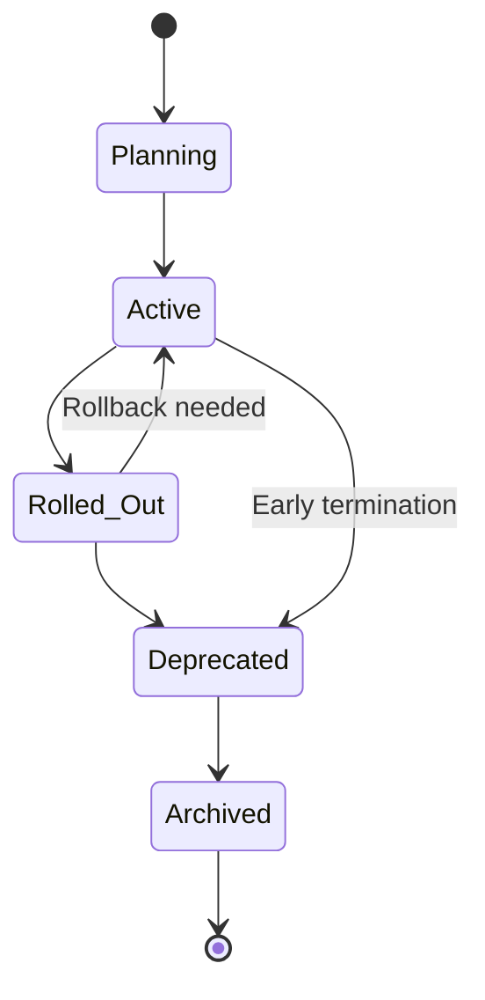
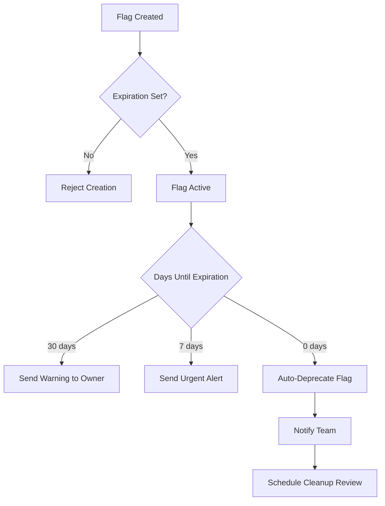
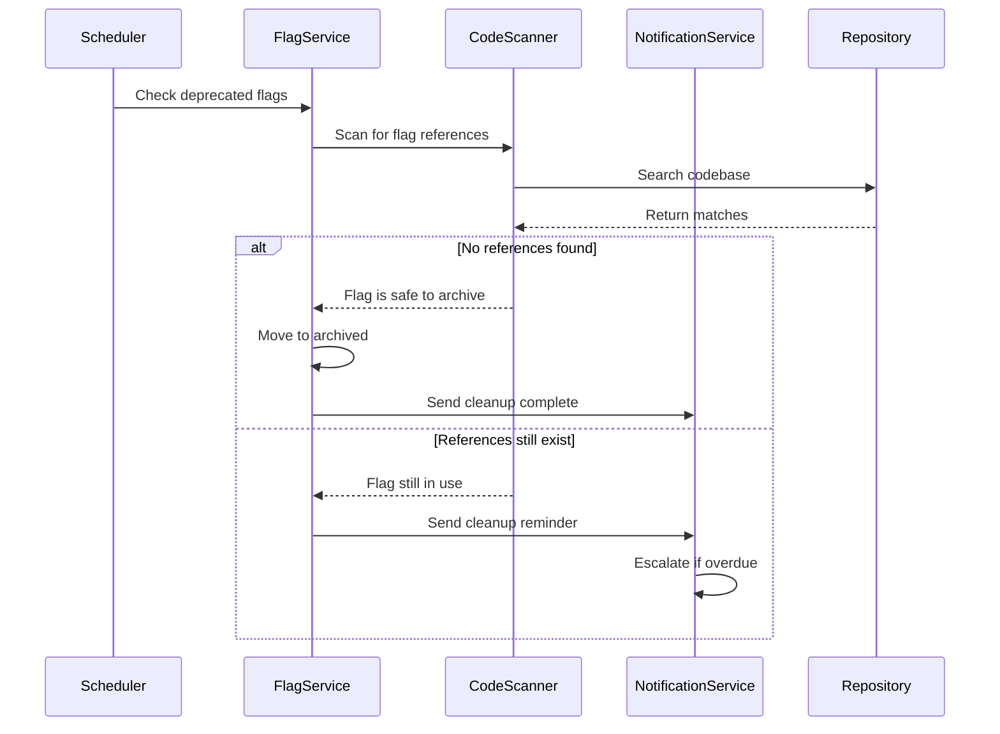
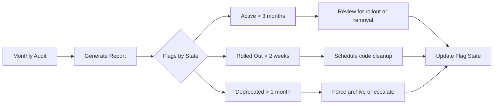
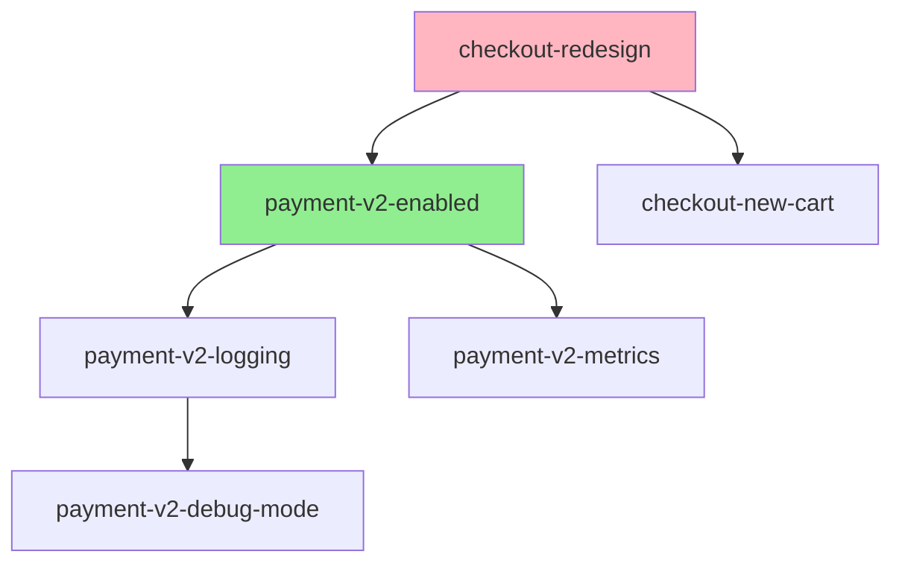
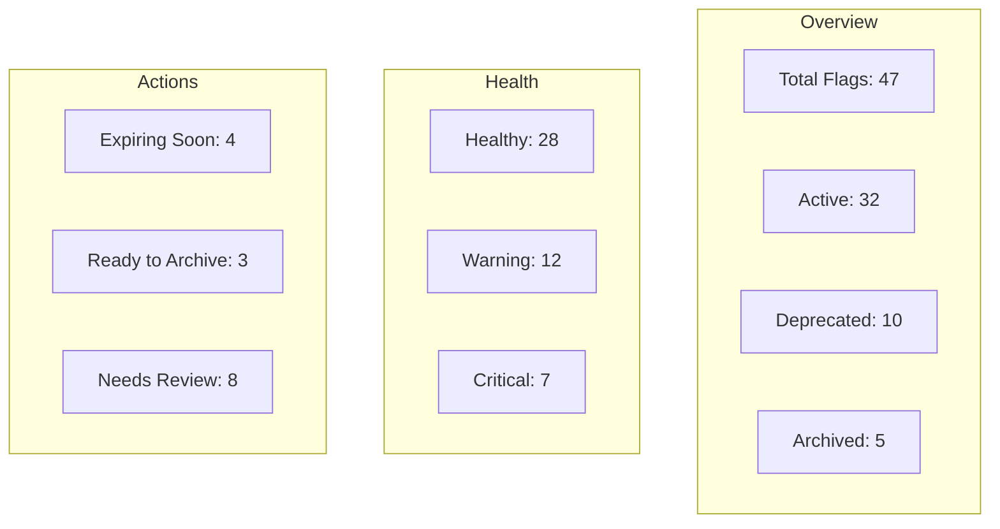

# How to Build Flag Lifecycle Management

Author: [nawazdhandala](https://github.com/nawazdhandala)

Tags: Feature Flags, DevOps, Lifecycle Management, Best Practices

Description: Learn how to manage the lifecycle of feature flags from creation to retirement.

---

## Why Flag Lifecycle Management Matters

Feature flags are powerful tools for progressive delivery, experimentation, and risk mitigation. However, without proper lifecycle management, they quickly become technical debt. Stale flags clutter codebases, create confusion, and introduce potential bugs when developers forget which flags are active or what they control.

A well-designed flag lifecycle management system ensures that every flag has a clear purpose, a defined lifespan, and an automated path to retirement.

---

## The Five Stages of a Feature Flag

Every feature flag progresses through distinct stages. Understanding these stages is the foundation of effective lifecycle management.



### Stage 1: Planning

The flag exists as a proposal. Define its purpose, scope, and expected lifespan before writing any code.

### Stage 2: Active

The flag is in production, controlling feature rollout. This is where the flag provides value through gradual releases, A/B testing, or kill switches.

### Stage 3: Rolled Out

The feature is fully enabled for all users. The flag still exists in code but is no longer toggled.

### Stage 4: Deprecated

The flag is marked for removal. Code cleanup begins, and the flag configuration is frozen.

### Stage 5: Archived

The flag and its associated code branches have been removed. Historical data is retained for audit purposes.

---

## Designing a Flag State Machine

Implement a state machine to enforce valid transitions and prevent flags from lingering indefinitely.

```typescript
// flag-lifecycle.ts
// A TypeScript implementation of the flag lifecycle state machine

// Define the possible states a feature flag can be in
enum FlagState {
  PLANNING = 'planning',
  ACTIVE = 'active',
  ROLLED_OUT = 'rolled_out',
  DEPRECATED = 'deprecated',
  ARCHIVED = 'archived'
}

// Define which transitions are allowed from each state
const VALID_TRANSITIONS: Record<FlagState, FlagState[]> = {
  [FlagState.PLANNING]: [FlagState.ACTIVE],
  [FlagState.ACTIVE]: [FlagState.ROLLED_OUT, FlagState.DEPRECATED],
  [FlagState.ROLLED_OUT]: [FlagState.DEPRECATED, FlagState.ACTIVE],
  [FlagState.DEPRECATED]: [FlagState.ARCHIVED],
  [FlagState.ARCHIVED]: []
};

// Interface defining the structure of a feature flag
interface FeatureFlag {
  id: string;
  name: string;
  state: FlagState;
  createdAt: Date;
  expiresAt: Date | null;
  owner: string;
  description: string;
  stateHistory: StateChange[];
}

// Track state changes for audit purposes
interface StateChange {
  from: FlagState;
  to: FlagState;
  changedAt: Date;
  changedBy: string;
  reason: string;
}

// Validate and execute state transitions
function transitionFlag(
  flag: FeatureFlag,
  newState: FlagState,
  userId: string,
  reason: string
): FeatureFlag {
  const validNextStates = VALID_TRANSITIONS[flag.state];

  // Enforce valid transitions only
  if (!validNextStates.includes(newState)) {
    throw new Error(
      `Invalid transition: cannot move from ${flag.state} to ${newState}. ` +
      `Valid transitions: ${validNextStates.join(', ')}`
    );
  }

  // Record the state change for audit trail
  const stateChange: StateChange = {
    from: flag.state,
    to: newState,
    changedAt: new Date(),
    changedBy: userId,
    reason: reason
  };

  // Return updated flag with new state and history
  return {
    ...flag,
    state: newState,
    stateHistory: [...flag.stateHistory, stateChange]
  };
}
```

---

## Flag Expiration and Automatic Alerts

Every flag should have an expiration date. This prevents flags from becoming permanent fixtures in your codebase.



### Implementing Expiration Checks

```python
# flag_expiration_checker.py
# A scheduled job that checks for expiring flags and sends notifications

from datetime import datetime, timedelta
from dataclasses import dataclass
from enum import Enum
from typing import List, Optional
import logging

# Configure logging for the expiration checker
logging.basicConfig(level=logging.INFO)
logger = logging.getLogger(__name__)


class AlertLevel(Enum):
    """Define alert severity levels for expiring flags."""
    WARNING = "warning"      # 30 days until expiration
    URGENT = "urgent"        # 7 days until expiration
    CRITICAL = "critical"    # Expired


@dataclass
class ExpirationAlert:
    """Represents an alert for a flag approaching expiration."""
    flag_id: str
    flag_name: str
    owner: str
    expires_at: datetime
    days_remaining: int
    alert_level: AlertLevel


def check_flag_expirations(flags: List[dict]) -> List[ExpirationAlert]:
    """
    Scan all active flags and generate alerts for those approaching expiration.

    Args:
        flags: List of flag dictionaries from the flag management system

    Returns:
        List of ExpirationAlert objects for flags that need attention
    """
    alerts = []
    now = datetime.utcnow()

    for flag in flags:
        # Skip flags that are already deprecated or archived
        if flag['state'] in ['deprecated', 'archived']:
            continue

        # Skip flags without expiration dates (though this should be rare)
        if not flag.get('expires_at'):
            logger.warning(f"Flag {flag['id']} has no expiration date set")
            continue

        expires_at = flag['expires_at']
        days_remaining = (expires_at - now).days

        # Determine alert level based on days remaining
        alert_level = None
        if days_remaining <= 0:
            alert_level = AlertLevel.CRITICAL
        elif days_remaining <= 7:
            alert_level = AlertLevel.URGENT
        elif days_remaining <= 30:
            alert_level = AlertLevel.WARNING

        # Create alert if flag is within notification window
        if alert_level:
            alerts.append(ExpirationAlert(
                flag_id=flag['id'],
                flag_name=flag['name'],
                owner=flag['owner'],
                expires_at=expires_at,
                days_remaining=max(0, days_remaining),
                alert_level=alert_level
            ))

            logger.info(
                f"Alert generated for flag '{flag['name']}': "
                f"{alert_level.value}, {days_remaining} days remaining"
            )

    return alerts


def auto_deprecate_expired_flags(flags: List[dict]) -> List[str]:
    """
    Automatically move expired flags to deprecated state.

    Args:
        flags: List of flag dictionaries

    Returns:
        List of flag IDs that were auto-deprecated
    """
    deprecated_flags = []
    now = datetime.utcnow()

    for flag in flags:
        # Only process active or rolled_out flags
        if flag['state'] not in ['active', 'rolled_out']:
            continue

        if flag.get('expires_at') and flag['expires_at'] <= now:
            # Flag has expired, mark for deprecation
            deprecated_flags.append(flag['id'])
            logger.info(
                f"Auto-deprecating expired flag: {flag['name']} "
                f"(expired: {flag['expires_at']})"
            )

    return deprecated_flags
```

---

## Cleanup Automation

Automated cleanup prevents flag debt from accumulating. Implement a multi-stage cleanup process that gives teams time to remove flag references from code.



### Code Scanner Implementation

```typescript
// flag-code-scanner.ts
// Scans repositories for feature flag references to enable safe cleanup

import { execSync } from 'child_process';

interface FlagReference {
  filePath: string;
  lineNumber: number;
  lineContent: string;
  flagId: string;
}

interface ScanResult {
  flagId: string;
  references: FlagReference[];
  isSafeToRemove: boolean;
  lastScannedAt: Date;
}

/**
 * Scans a codebase for references to a specific feature flag.
 * Uses git grep for fast searching across the repository.
 *
 * @param flagId - The unique identifier of the flag to search for
 * @param repoPath - Path to the repository to scan
 * @returns ScanResult containing all found references
 */
function scanForFlagReferences(
  flagId: string,
  repoPath: string
): ScanResult {
  const references: FlagReference[] = [];

  // Build search patterns to catch various flag usage patterns
  // This covers common patterns like isEnabled('flag'), getFlag('flag'), etc.
  const searchPatterns = [
    flagId,                           // Direct ID usage
    `'${flagId}'`,                    // Single quoted
    `"${flagId}"`,                    // Double quoted
    `FLAG_${flagId.toUpperCase()}`,   // Constant style
  ];

  for (const pattern of searchPatterns) {
    try {
      // Use git grep for efficient searching
      // -n: show line numbers
      // -I: ignore binary files
      const output = execSync(
        `git grep -n -I "${pattern}" -- "*.ts" "*.tsx" "*.js" "*.jsx" "*.py"`,
        {
          cwd: repoPath,
          encoding: 'utf-8',
          // Don't throw on no matches (exit code 1)
          stdio: ['pipe', 'pipe', 'pipe']
        }
      );

      // Parse git grep output: file:line:content
      const lines = output.trim().split('\n').filter(Boolean);

      for (const line of lines) {
        const match = line.match(/^([^:]+):(\d+):(.*)$/);
        if (match) {
          references.push({
            filePath: match[1],
            lineNumber: parseInt(match[2], 10),
            lineContent: match[3].trim(),
            flagId: flagId
          });
        }
      }
    } catch (error) {
      // git grep returns exit code 1 when no matches found
      // This is expected behavior, not an error
    }
  }

  // Deduplicate references by file and line
  const uniqueRefs = deduplicateReferences(references);

  return {
    flagId,
    references: uniqueRefs,
    isSafeToRemove: uniqueRefs.length === 0,
    lastScannedAt: new Date()
  };
}

/**
 * Remove duplicate references that may appear from multiple search patterns
 */
function deduplicateReferences(refs: FlagReference[]): FlagReference[] {
  const seen = new Set<string>();
  return refs.filter(ref => {
    const key = `${ref.filePath}:${ref.lineNumber}`;
    if (seen.has(key)) {
      return false;
    }
    seen.add(key);
    return true;
  });
}

/**
 * Generate a cleanup report for all deprecated flags
 */
async function generateCleanupReport(
  deprecatedFlagIds: string[],
  repoPath: string
): Promise<Map<string, ScanResult>> {
  const report = new Map<string, ScanResult>();

  for (const flagId of deprecatedFlagIds) {
    const result = scanForFlagReferences(flagId, repoPath);
    report.set(flagId, result);

    if (result.isSafeToRemove) {
      console.log(`Flag ${flagId}: Safe to archive (no references found)`);
    } else {
      console.log(
        `Flag ${flagId}: ${result.references.length} references found, ` +
        `cleanup required`
      );
    }
  }

  return report;
}
```

---

## Flag Hygiene Best Practices

### 1. Require Metadata at Creation

Never create a flag without essential metadata. Enforce this at the API level.

```typescript
// flag-creation-validator.ts
// Validates that all required metadata is present before flag creation

interface FlagCreationRequest {
  name: string;
  description: string;
  owner: string;
  expiresAt: Date;
  jiraTicket?: string;
  category: FlagCategory;
}

enum FlagCategory {
  RELEASE = 'release',           // Gradual feature rollout
  EXPERIMENT = 'experiment',     // A/B testing
  OPS = 'ops',                   // Operational toggle
  PERMISSION = 'permission'      // Access control
}

/**
 * Validates flag creation requests to ensure all required metadata is present.
 * This prevents orphan flags and ensures every flag has clear ownership.
 */
function validateFlagCreation(request: FlagCreationRequest): string[] {
  const errors: string[] = [];

  // Name must be descriptive and follow naming convention
  if (!request.name || request.name.length < 5) {
    errors.push('Flag name must be at least 5 characters');
  }

  // Enforce kebab-case naming convention
  if (!/^[a-z][a-z0-9-]*[a-z0-9]$/.test(request.name)) {
    errors.push('Flag name must be kebab-case (e.g., new-checkout-flow)');
  }

  // Description is mandatory for future maintainers
  if (!request.description || request.description.length < 20) {
    errors.push('Description must be at least 20 characters');
  }

  // Every flag must have a clear owner
  if (!request.owner) {
    errors.push('Owner email is required');
  }

  // Expiration date is mandatory to prevent permanent flags
  if (!request.expiresAt) {
    errors.push('Expiration date is required');
  } else {
    const maxExpiration = new Date();
    maxExpiration.setMonth(maxExpiration.getMonth() + 6);

    // Flags should not live longer than 6 months by default
    if (request.expiresAt > maxExpiration) {
      errors.push(
        'Expiration date cannot be more than 6 months in the future. ' +
        'Request an exception if longer lifespan is needed.'
      );
    }
  }

  // Link to tracking ticket for traceability
  if (request.category === FlagCategory.RELEASE && !request.jiraTicket) {
    errors.push('Release flags must be linked to a Jira ticket');
  }

  return errors;
}
```

### 2. Implement Flag Naming Conventions

Consistent naming makes flags discoverable and self-documenting.

```
Pattern: {team}-{feature}-{variant}

Examples:
  checkout-new-payment-flow
  search-ml-ranking-v2
  platform-rate-limit-increase
  experiment-homepage-cta-blue
```

### 3. Set Up Regular Flag Audits

Schedule monthly audits to review flag health across your organization.



### 4. Track Flag Metrics

Monitor flag usage to identify candidates for cleanup.

```python
# flag_metrics.py
# Collect and analyze metrics about flag usage patterns

from dataclasses import dataclass
from datetime import datetime, timedelta
from typing import Dict, List
from collections import defaultdict


@dataclass
class FlagMetrics:
    """Metrics collected for a single feature flag."""
    flag_id: str
    evaluation_count: int          # Total times flag was checked
    unique_users: int              # Distinct users who encountered flag
    true_percentage: float         # Percentage of evaluations returning true
    last_evaluated: datetime       # Most recent evaluation timestamp
    days_since_last_change: int    # Days since flag configuration changed


def analyze_flag_health(metrics: FlagMetrics) -> Dict[str, any]:
    """
    Analyze flag metrics to determine if cleanup is needed.

    Returns a health assessment with recommendations.
    """
    issues = []
    recommendations = []

    # Flag that is always true is ready for removal
    if metrics.true_percentage >= 99.9:
        issues.append('Flag is effectively always ON')
        recommendations.append(
            'Consider removing flag and making feature permanent'
        )

    # Flag that is always false might be dead code
    if metrics.true_percentage <= 0.1:
        issues.append('Flag is effectively always OFF')
        recommendations.append(
            'Verify if flag is still needed or remove associated code'
        )

    # Flag with no recent evaluations might be dead
    days_inactive = (datetime.utcnow() - metrics.last_evaluated).days
    if days_inactive > 30:
        issues.append(f'Flag has not been evaluated in {days_inactive} days')
        recommendations.append(
            'Check if flag is still referenced in active code paths'
        )

    # Flag that has not changed in a long time might be forgotten
    if metrics.days_since_last_change > 90:
        issues.append('Flag configuration unchanged for 90+ days')
        recommendations.append(
            'Review if flag is still serving its intended purpose'
        )

    return {
        'flag_id': metrics.flag_id,
        'health_score': calculate_health_score(metrics, issues),
        'issues': issues,
        'recommendations': recommendations,
        'needs_attention': len(issues) > 0
    }


def calculate_health_score(metrics: FlagMetrics, issues: List[str]) -> int:
    """
    Calculate a health score from 0-100.
    Higher scores indicate healthier flags.
    """
    score = 100

    # Deduct points for each issue found
    score -= len(issues) * 20

    # Bonus for active flags with varied evaluation results
    if 10 < metrics.true_percentage < 90:
        score += 10  # Flag is actively being used for targeting

    return max(0, min(100, score))


def generate_cleanup_candidates(
    all_metrics: List[FlagMetrics],
    threshold_score: int = 50
) -> List[str]:
    """
    Identify flags that should be prioritized for cleanup.

    Args:
        all_metrics: Metrics for all active flags
        threshold_score: Flags scoring below this need attention

    Returns:
        List of flag IDs that are cleanup candidates
    """
    candidates = []

    for metrics in all_metrics:
        health = analyze_flag_health(metrics)
        if health['health_score'] < threshold_score:
            candidates.append(metrics.flag_id)

    return candidates
```

### 5. Implement Flag Dependencies

Track relationships between flags to prevent cascading issues during cleanup.



---

## Building a Flag Dashboard

Create visibility into your flag ecosystem with a comprehensive dashboard.

### Key Metrics to Display

| Metric | Description | Alert Threshold |
|--------|-------------|-----------------|
| Total Active Flags | Flags currently in use | > 100 per service |
| Average Flag Age | Mean days since creation | > 60 days |
| Flags Without Owner | Orphaned flags | > 0 |
| Overdue Deprecations | Flags past expiration | > 5 |
| Cleanup Success Rate | Archived / Deprecated ratio | < 80% |

### Dashboard Layout



---

## Integration with CI/CD

Add flag lifecycle checks to your deployment pipeline.

```yaml
# .github/workflows/flag-hygiene.yml
# GitHub Actions workflow for automated flag hygiene checks

name: Flag Hygiene Check

on:
  # Run on every pull request to catch issues early
  pull_request:
    branches: [main]
  # Run weekly to catch aging flags
  schedule:
    - cron: '0 9 * * 1'  # Every Monday at 9 AM

jobs:
  flag-check:
    runs-on: ubuntu-latest
    steps:
      - name: Checkout code
        uses: actions/checkout@v4
        with:
          fetch-depth: 0  # Full history for accurate scanning

      - name: Setup Node.js
        uses: actions/setup-node@v4
        with:
          node-version: '20'

      - name: Install dependencies
        run: npm ci

      - name: Scan for flag references
        id: scan
        run: |
          # Run the flag scanner and output results
          npm run flag-scan -- --output json > flag-report.json

          # Count flags that need attention
          CRITICAL=$(jq '.flags | map(select(.health == "critical")) | length' flag-report.json)
          echo "critical_count=$CRITICAL" >> $GITHUB_OUTPUT

      - name: Check for deprecated flag usage
        run: |
          # Fail if code references deprecated flags
          npm run flag-check-deprecated

      - name: Warn on stale flags
        if: steps.scan.outputs.critical_count > 0
        run: |
          echo "::warning::Found flags requiring immediate attention"
          jq '.flags | map(select(.health == "critical"))' flag-report.json

      - name: Upload flag report
        uses: actions/upload-artifact@v4
        with:
          name: flag-hygiene-report
          path: flag-report.json
          retention-days: 30
```

---

## Summary

Effective flag lifecycle management requires:

1. **Clear Stages** - Define explicit states (Planning, Active, Rolled Out, Deprecated, Archived) and enforce valid transitions.

2. **Mandatory Expiration** - Every flag must have an expiration date. Use automated alerts at 30, 7, and 0 days remaining.

3. **Automated Cleanup** - Scan codebases for flag references before archiving. Generate cleanup reports and track removal progress.

4. **Rich Metadata** - Require owner, description, category, and linked tickets at flag creation time.

5. **Continuous Monitoring** - Track evaluation patterns, identify always-on or always-off flags, and surface cleanup candidates.

6. **CI/CD Integration** - Block deployments that reference deprecated flags and run regular hygiene checks.

7. **Visibility** - Build dashboards showing flag health across your organization.

By treating feature flags as first-class citizens with proper lifecycle management, you gain the benefits of progressive delivery without accumulating technical debt. Start with expiration dates and owner assignment, then gradually add automation as your flag usage grows.

---

## Further Reading

- [The Five Stages of SRE Maturity](https://oneuptime.com/blog/post/2025-09-01-the-five-stages-of-sre-maturity/view)
- [The Ultimate SRE Reliability Checklist](https://oneuptime.com/blog/post/2025-09-10-sre-checklist/view)
