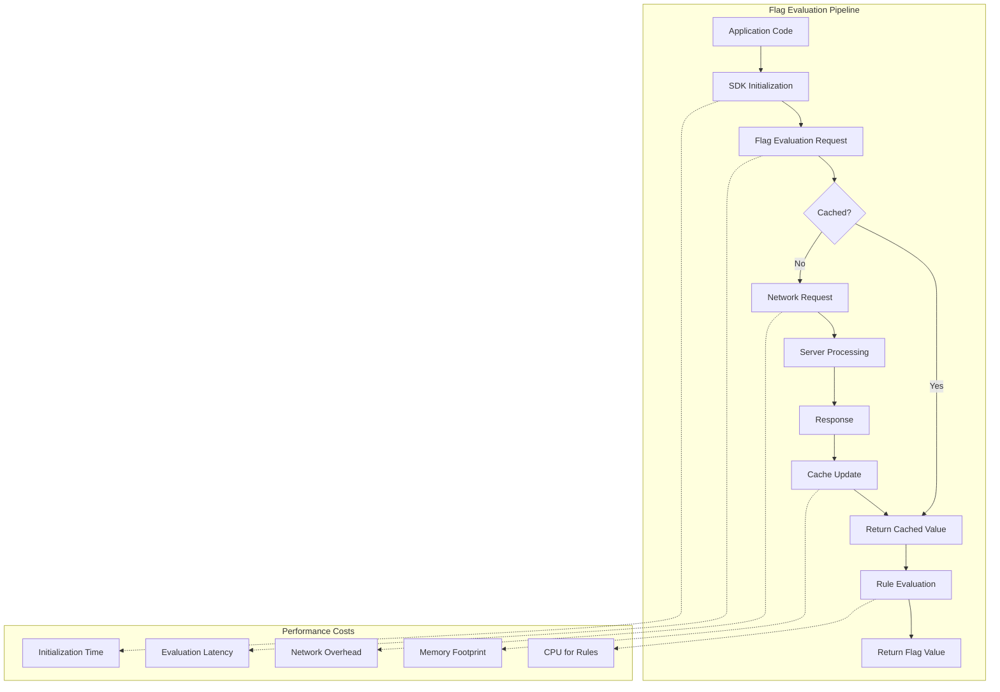
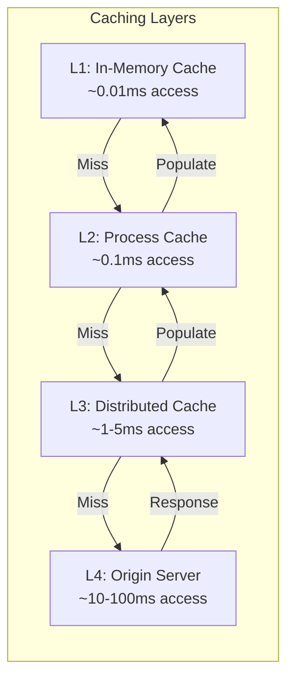
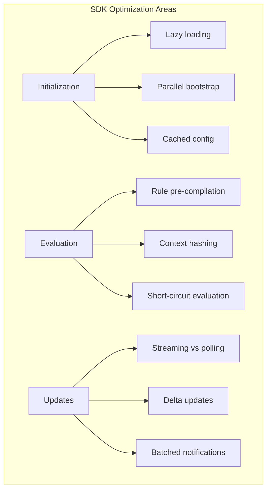
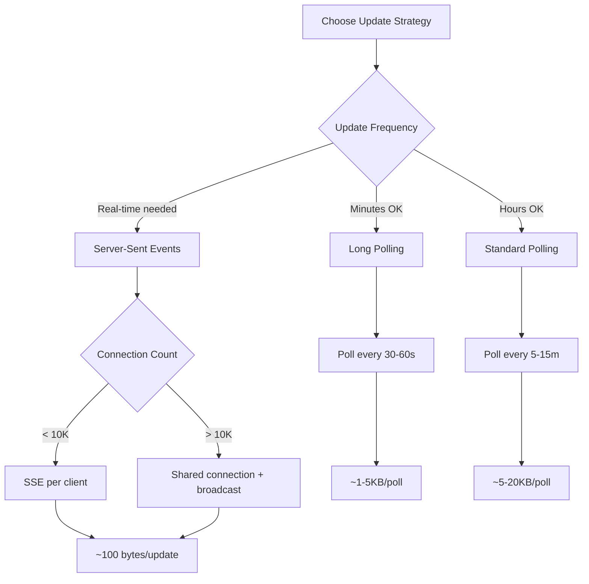
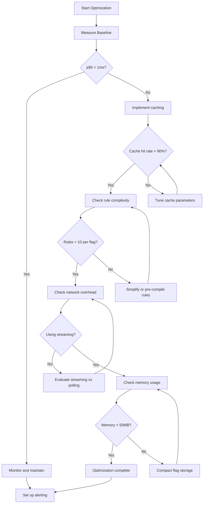

# How to Implement Flag Performance Impact

Author: [nawazdhandala](https://github.com/nawazdhandala)

Tags: Feature Flags, Performance, Optimization, Monitoring

Description: Learn how to measure and optimize the performance impact of feature flags.

---

Feature flags are essential for progressive delivery and experimentation, but they come with hidden costs. Every flag evaluation adds latency, memory consumption, and network overhead. At scale, poorly optimized flags can become a significant performance bottleneck. This guide covers how to measure, monitor, and optimize the performance impact of feature flags in your applications.

## Understanding Flag Performance Costs

Before optimizing, you need to understand where performance costs originate in feature flag systems.



### Cost Breakdown

| Cost Type | Source | Typical Impact | When It Matters |
|-----------|--------|----------------|-----------------|
| Initialization | SDK bootstrap, initial sync | 50-500ms at startup | Cold starts, serverless |
| Evaluation Latency | Rule processing, context matching | 0.1-5ms per evaluation | Hot paths, high-frequency calls |
| Network Overhead | Flag updates, streaming connections | 1-50KB per sync | Mobile, bandwidth-constrained |
| Memory Footprint | Flag definitions, evaluation cache | 1-50MB per process | Memory-constrained environments |
| CPU Usage | Complex targeting rules | 1-10% CPU overhead | High-throughput services |

## Evaluation Latency Measurement

The most critical metric is evaluation latency - how long it takes to get a flag value. Here is how to instrument and measure it.

### Basic Instrumentation

```javascript
// flag-metrics.js
class FlagMetrics {
  constructor() {
    this.evaluations = new Map();
    this.histograms = new Map();
  }

  /**
   * Wrap flag evaluation with timing instrumentation.
   * Records latency percentiles and evaluation counts.
   */
  measureEvaluation(flagKey, evaluationFn) {
    const startTime = performance.now();

    try {
      const result = evaluationFn();
      const duration = performance.now() - startTime;

      this.recordEvaluation(flagKey, duration, 'success');
      return result;
    } catch (error) {
      const duration = performance.now() - startTime;
      this.recordEvaluation(flagKey, duration, 'error');
      throw error;
    }
  }

  recordEvaluation(flagKey, durationMs, status) {
    if (!this.histograms.has(flagKey)) {
      this.histograms.set(flagKey, {
        count: 0,
        sum: 0,
        min: Infinity,
        max: 0,
        buckets: new Array(10).fill(0), // 0.1ms buckets up to 1ms+
        errors: 0
      });
    }

    const histogram = this.histograms.get(flagKey);
    histogram.count++;
    histogram.sum += durationMs;
    histogram.min = Math.min(histogram.min, durationMs);
    histogram.max = Math.max(histogram.max, durationMs);

    // Bucket: <0.1ms, <0.2ms, <0.3ms, ..., <0.9ms, >=1ms
    const bucketIndex = Math.min(Math.floor(durationMs * 10), 9);
    histogram.buckets[bucketIndex]++;

    if (status === 'error') {
      histogram.errors++;
    }
  }

  getStats(flagKey) {
    const histogram = this.histograms.get(flagKey);
    if (!histogram) return null;

    return {
      flagKey,
      count: histogram.count,
      avgMs: (histogram.sum / histogram.count).toFixed(3),
      minMs: histogram.min.toFixed(3),
      maxMs: histogram.max.toFixed(3),
      errorRate: ((histogram.errors / histogram.count) * 100).toFixed(2),
      p50Ms: this.calculatePercentile(histogram, 50),
      p95Ms: this.calculatePercentile(histogram, 95),
      p99Ms: this.calculatePercentile(histogram, 99)
    };
  }

  calculatePercentile(histogram, percentile) {
    const targetCount = Math.ceil(histogram.count * (percentile / 100));
    let cumulative = 0;

    for (let i = 0; i < histogram.buckets.length; i++) {
      cumulative += histogram.buckets[i];
      if (cumulative >= targetCount) {
        // Return upper bound of bucket
        return ((i + 1) * 0.1).toFixed(3);
      }
    }
    return '1.000+';
  }

  getAllStats() {
    const stats = [];
    for (const flagKey of this.histograms.keys()) {
      stats.push(this.getStats(flagKey));
    }
    return stats.sort((a, b) => parseFloat(b.avgMs) - parseFloat(a.avgMs));
  }
}

// Usage with any feature flag SDK
const flagMetrics = new FlagMetrics();

function getFeatureFlag(flagKey, context) {
  return flagMetrics.measureEvaluation(flagKey, () => {
    return featureFlagClient.evaluate(flagKey, context);
  });
}
```

### OpenTelemetry Integration

For production observability, integrate with OpenTelemetry to correlate flag performance with request traces.

```javascript
// otel-flag-instrumentation.js
const { trace, metrics } = require('@opentelemetry/api');

class OTelFlagInstrumentation {
  constructor(serviceName = 'feature-flags') {
    this.tracer = trace.getTracer(serviceName);
    this.meter = metrics.getMeter(serviceName);

    // Create metrics
    this.evaluationDuration = this.meter.createHistogram(
      'feature_flag.evaluation.duration',
      {
        description: 'Time to evaluate a feature flag',
        unit: 'ms',
        advice: {
          explicitBucketBoundaries: [0.1, 0.25, 0.5, 1, 2.5, 5, 10, 25, 50]
        }
      }
    );

    this.evaluationCount = this.meter.createCounter(
      'feature_flag.evaluation.count',
      { description: 'Number of feature flag evaluations' }
    );

    this.cacheHits = this.meter.createCounter(
      'feature_flag.cache.hits',
      { description: 'Number of cache hits for flag evaluations' }
    );

    this.cacheMisses = this.meter.createCounter(
      'feature_flag.cache.misses',
      { description: 'Number of cache misses for flag evaluations' }
    );
  }

  /**
   * Instrument a flag evaluation with full tracing and metrics.
   */
  async instrumentEvaluation(flagKey, context, evaluationFn) {
    const attributes = {
      'feature_flag.key': flagKey,
      'feature_flag.provider': 'custom',
    };

    return this.tracer.startActiveSpan(
      `feature_flag.evaluate ${flagKey}`,
      { attributes },
      async (span) => {
        const startTime = performance.now();

        try {
          const result = await evaluationFn();
          const duration = performance.now() - startTime;

          // Record metrics
          this.evaluationDuration.record(duration, {
            'feature_flag.key': flagKey,
            'feature_flag.result': String(result.value),
            'feature_flag.reason': result.reason || 'unknown'
          });

          this.evaluationCount.add(1, {
            'feature_flag.key': flagKey,
            'status': 'success'
          });

          // Track cache performance
          if (result.fromCache) {
            this.cacheHits.add(1, { 'feature_flag.key': flagKey });
          } else {
            this.cacheMisses.add(1, { 'feature_flag.key': flagKey });
          }

          // Add span attributes
          span.setAttributes({
            'feature_flag.value': String(result.value),
            'feature_flag.reason': result.reason || 'unknown',
            'feature_flag.duration_ms': duration,
            'feature_flag.from_cache': result.fromCache || false
          });

          span.setStatus({ code: 0 }); // OK
          return result;

        } catch (error) {
          const duration = performance.now() - startTime;

          this.evaluationCount.add(1, {
            'feature_flag.key': flagKey,
            'status': 'error'
          });

          span.recordException(error);
          span.setStatus({ code: 2, message: error.message }); // ERROR
          throw error;

        } finally {
          span.end();
        }
      }
    );
  }
}

module.exports = { OTelFlagInstrumentation };
```

### Performance Dashboard Query

Here is a sample query for visualizing flag evaluation performance in your observability platform.

```sql
-- Flag evaluation latency by percentile
SELECT
  time_bucket('1 minute', time) AS bucket,
  attributes->>'feature_flag.key' AS flag_key,
  percentile_cont(0.50) WITHIN GROUP (ORDER BY value) AS p50_ms,
  percentile_cont(0.95) WITHIN GROUP (ORDER BY value) AS p95_ms,
  percentile_cont(0.99) WITHIN GROUP (ORDER BY value) AS p99_ms,
  count(*) AS evaluation_count
FROM metrics
WHERE
  name = 'feature_flag.evaluation.duration'
  AND time > NOW() - INTERVAL '1 hour'
GROUP BY bucket, flag_key
ORDER BY bucket DESC, p95_ms DESC;

-- Slowest flags in the last hour
SELECT
  attributes->>'feature_flag.key' AS flag_key,
  avg(value) AS avg_ms,
  max(value) AS max_ms,
  count(*) AS evaluations,
  sum(CASE WHEN value > 5 THEN 1 ELSE 0 END) AS slow_evaluations
FROM metrics
WHERE
  name = 'feature_flag.evaluation.duration'
  AND time > NOW() - INTERVAL '1 hour'
GROUP BY flag_key
HAVING avg(value) > 1  -- Flags averaging over 1ms
ORDER BY avg_ms DESC
LIMIT 20;
```

## Caching Strategies

Caching is the most effective way to reduce flag evaluation latency. Here are strategies from simple to sophisticated.



### Multi-Layer Cache Implementation

```javascript
// multi-layer-cache.js
class FlagCache {
  constructor(options = {}) {
    this.options = {
      l1MaxSize: options.l1MaxSize || 1000,
      l1TtlMs: options.l1TtlMs || 1000,      // 1 second hot cache
      l2TtlMs: options.l2TtlMs || 30000,     // 30 second warm cache
      l3TtlMs: options.l3TtlMs || 300000,    // 5 minute cold cache
      ...options
    };

    // L1: Hot cache - LRU with very short TTL
    this.l1Cache = new LRUCache({
      max: this.options.l1MaxSize,
      ttl: this.options.l1TtlMs
    });

    // L2: Warm cache - longer TTL, per-flag storage
    this.l2Cache = new Map();

    // L3: External distributed cache (Redis, Memcached)
    this.l3Client = options.distributedCacheClient;

    // Metrics
    this.metrics = {
      l1Hits: 0,
      l2Hits: 0,
      l3Hits: 0,
      misses: 0
    };
  }

  /**
   * Generate cache key from flag key and evaluation context.
   * Context is hashed to handle complex targeting rules.
   */
  getCacheKey(flagKey, context) {
    const contextHash = this.hashContext(context);
    return `flag:${flagKey}:${contextHash}`;
  }

  hashContext(context) {
    // Fast hash of context attributes that affect targeting
    const relevantContext = {
      userId: context.userId,
      userGroups: context.userGroups?.sort(),
      environment: context.environment,
      // Add other targeting attributes
    };
    return this.simpleHash(JSON.stringify(relevantContext));
  }

  simpleHash(str) {
    let hash = 0;
    for (let i = 0; i < str.length; i++) {
      const char = str.charCodeAt(i);
      hash = ((hash << 5) - hash) + char;
      hash = hash & hash;
    }
    return hash.toString(36);
  }

  /**
   * Get flag value from cache hierarchy.
   * Returns { value, fromCache: true, cacheLevel: 'L1'|'L2'|'L3' } or null.
   */
  async get(flagKey, context) {
    const cacheKey = this.getCacheKey(flagKey, context);

    // L1: Hot cache check
    const l1Result = this.l1Cache.get(cacheKey);
    if (l1Result !== undefined) {
      this.metrics.l1Hits++;
      return { value: l1Result, fromCache: true, cacheLevel: 'L1' };
    }

    // L2: Warm cache check
    const l2Entry = this.l2Cache.get(cacheKey);
    if (l2Entry && Date.now() < l2Entry.expiresAt) {
      this.metrics.l2Hits++;
      // Promote to L1
      this.l1Cache.set(cacheKey, l2Entry.value);
      return { value: l2Entry.value, fromCache: true, cacheLevel: 'L2' };
    }

    // L3: Distributed cache check
    if (this.l3Client) {
      try {
        const l3Result = await this.l3Client.get(cacheKey);
        if (l3Result !== null) {
          this.metrics.l3Hits++;
          const value = JSON.parse(l3Result);
          // Promote to L1 and L2
          this.setLocal(cacheKey, value);
          return { value, fromCache: true, cacheLevel: 'L3' };
        }
      } catch (error) {
        console.warn('L3 cache error:', error.message);
      }
    }

    this.metrics.misses++;
    return null;
  }

  /**
   * Set value in all cache layers.
   */
  async set(flagKey, context, value) {
    const cacheKey = this.getCacheKey(flagKey, context);

    // Set in local caches
    this.setLocal(cacheKey, value);

    // Set in distributed cache
    if (this.l3Client) {
      try {
        await this.l3Client.set(
          cacheKey,
          JSON.stringify(value),
          'PX',
          this.options.l3TtlMs
        );
      } catch (error) {
        console.warn('L3 cache set error:', error.message);
      }
    }
  }

  setLocal(cacheKey, value) {
    // L1
    this.l1Cache.set(cacheKey, value);

    // L2
    this.l2Cache.set(cacheKey, {
      value,
      expiresAt: Date.now() + this.options.l2TtlMs
    });
  }

  /**
   * Invalidate flag across all cache layers.
   * Called when flag configuration changes.
   */
  async invalidate(flagKey) {
    // Clear L1 entries for this flag
    for (const key of this.l1Cache.keys()) {
      if (key.startsWith(`flag:${flagKey}:`)) {
        this.l1Cache.delete(key);
      }
    }

    // Clear L2 entries
    for (const key of this.l2Cache.keys()) {
      if (key.startsWith(`flag:${flagKey}:`)) {
        this.l2Cache.delete(key);
      }
    }

    // Clear L3 (pattern delete if supported)
    if (this.l3Client && this.l3Client.deletePattern) {
      await this.l3Client.deletePattern(`flag:${flagKey}:*`);
    }
  }

  getCacheStats() {
    const total = this.metrics.l1Hits + this.metrics.l2Hits +
                  this.metrics.l3Hits + this.metrics.misses;

    return {
      l1HitRate: total ? (this.metrics.l1Hits / total * 100).toFixed(2) : 0,
      l2HitRate: total ? (this.metrics.l2Hits / total * 100).toFixed(2) : 0,
      l3HitRate: total ? (this.metrics.l3Hits / total * 100).toFixed(2) : 0,
      missRate: total ? (this.metrics.misses / total * 100).toFixed(2) : 0,
      l1Size: this.l1Cache.size,
      l2Size: this.l2Cache.size,
      totalEvaluations: total
    };
  }
}

// Simple LRU Cache implementation
class LRUCache {
  constructor({ max, ttl }) {
    this.max = max;
    this.ttl = ttl;
    this.cache = new Map();
  }

  get(key) {
    const entry = this.cache.get(key);
    if (!entry) return undefined;

    if (Date.now() > entry.expiresAt) {
      this.cache.delete(key);
      return undefined;
    }

    // Move to end (most recently used)
    this.cache.delete(key);
    this.cache.set(key, entry);
    return entry.value;
  }

  set(key, value) {
    this.cache.delete(key);
    this.cache.set(key, {
      value,
      expiresAt: Date.now() + this.ttl
    });

    // Evict oldest if over capacity
    if (this.cache.size > this.max) {
      const firstKey = this.cache.keys().next().value;
      this.cache.delete(firstKey);
    }
  }

  delete(key) {
    this.cache.delete(key);
  }

  keys() {
    return this.cache.keys();
  }

  get size() {
    return this.cache.size;
  }
}

module.exports = { FlagCache };
```

### Cache Warming Strategy

Pre-populate caches during application startup to avoid cold-start latency.

```javascript
// cache-warming.js
class FlagCacheWarmer {
  constructor(flagClient, cache, options = {}) {
    this.flagClient = flagClient;
    this.cache = cache;
    this.options = {
      warmingBatchSize: options.warmingBatchSize || 100,
      warmingConcurrency: options.warmingConcurrency || 10,
      ...options
    };
  }

  /**
   * Warm cache with frequently evaluated flag/context combinations.
   * Call during application startup or after deployment.
   */
  async warmCache(flagKeys, commonContexts) {
    console.log(`Warming cache for ${flagKeys.length} flags ` +
                `with ${commonContexts.length} contexts...`);

    const startTime = Date.now();
    let warmedCount = 0;
    let errorCount = 0;

    // Generate all combinations
    const combinations = [];
    for (const flagKey of flagKeys) {
      for (const context of commonContexts) {
        combinations.push({ flagKey, context });
      }
    }

    // Process in batches with concurrency control
    for (let i = 0; i < combinations.length; i += this.options.warmingBatchSize) {
      const batch = combinations.slice(i, i + this.options.warmingBatchSize);

      const results = await Promise.allSettled(
        batch.map(({ flagKey, context }) =>
          this.warmSingle(flagKey, context)
        )
      );

      for (const result of results) {
        if (result.status === 'fulfilled') {
          warmedCount++;
        } else {
          errorCount++;
        }
      }
    }

    const duration = Date.now() - startTime;
    console.log(`Cache warming complete: ${warmedCount} entries in ${duration}ms ` +
                `(${errorCount} errors)`);

    return { warmedCount, errorCount, durationMs: duration };
  }

  async warmSingle(flagKey, context) {
    const result = await this.flagClient.evaluate(flagKey, context);
    await this.cache.set(flagKey, context, result.value);
  }

  /**
   * Get common contexts for warming based on usage patterns.
   * In production, derive this from analytics or user segments.
   */
  getCommonContexts() {
    return [
      // Anonymous users
      { userId: null, environment: 'production' },
      // Common user segments
      { userGroups: ['free'], environment: 'production' },
      { userGroups: ['pro'], environment: 'production' },
      { userGroups: ['enterprise'], environment: 'production' },
      // Internal users
      { userGroups: ['internal'], environment: 'production' },
      // Beta testers
      { userGroups: ['beta'], environment: 'production' },
    ];
  }
}
```

## SDK Optimization

Feature flag SDKs vary widely in performance characteristics. Here is how to optimize common patterns.



### Optimized SDK Wrapper

```javascript
// optimized-flag-client.js
class OptimizedFlagClient {
  constructor(baseClient, options = {}) {
    this.baseClient = baseClient;
    this.cache = new FlagCache(options.cacheOptions);
    this.metrics = new OTelFlagInstrumentation();

    this.options = {
      enableRuleCompilation: options.enableRuleCompilation ?? true,
      enableShortCircuit: options.enableShortCircuit ?? true,
      evaluationTimeout: options.evaluationTimeout || 50, // ms
      ...options
    };

    // Pre-compiled rules for fast evaluation
    this.compiledRules = new Map();

    // Short-circuit cache for static flags
    this.staticFlags = new Map();

    this.initialized = false;
    this.initPromise = null;
  }

  /**
   * Initialize SDK with optimizations.
   * Performs lazy initialization on first evaluation if not called explicitly.
   */
  async initialize() {
    if (this.initialized) return;

    if (this.initPromise) {
      return this.initPromise;
    }

    this.initPromise = this._doInitialize();
    await this.initPromise;
    this.initialized = true;
  }

  async _doInitialize() {
    const startTime = performance.now();

    // Initialize base client
    await this.baseClient.initialize();

    // Identify static flags (no targeting rules)
    const flags = await this.baseClient.getAllFlags();
    for (const [key, config] of Object.entries(flags)) {
      if (this.isStaticFlag(config)) {
        this.staticFlags.set(key, config.defaultValue);
      } else if (this.options.enableRuleCompilation) {
        this.compiledRules.set(key, this.compileRules(config.rules));
      }
    }

    const duration = performance.now() - startTime;
    console.log(`Flag client initialized in ${duration.toFixed(2)}ms: ` +
                `${this.staticFlags.size} static, ` +
                `${this.compiledRules.size} with rules`);
  }

  isStaticFlag(config) {
    return !config.rules || config.rules.length === 0 ||
           (config.rules.length === 1 && config.rules[0].percentage === 100);
  }

  /**
   * Pre-compile targeting rules to functions for fast evaluation.
   */
  compileRules(rules) {
    return rules.map(rule => ({
      ...rule,
      matcher: this.compileConditions(rule.conditions)
    }));
  }

  compileConditions(conditions) {
    if (!conditions || conditions.length === 0) {
      return () => true;
    }

    // Generate optimized matcher function
    const checks = conditions.map(cond => {
      switch (cond.operator) {
        case 'equals':
          return (ctx) => ctx[cond.attribute] === cond.value;
        case 'contains':
          return (ctx) => ctx[cond.attribute]?.includes?.(cond.value);
        case 'in':
          const valueSet = new Set(cond.values);
          return (ctx) => valueSet.has(ctx[cond.attribute]);
        case 'matches':
          const regex = new RegExp(cond.pattern);
          return (ctx) => regex.test(ctx[cond.attribute]);
        default:
          return () => true;
      }
    });

    return (ctx) => checks.every(check => check(ctx));
  }

  /**
   * Evaluate flag with all optimizations applied.
   */
  async evaluate(flagKey, context, defaultValue) {
    // Ensure initialized
    if (!this.initialized) {
      await this.initialize();
    }

    // Short-circuit: Check for static flags
    if (this.options.enableShortCircuit && this.staticFlags.has(flagKey)) {
      return {
        value: this.staticFlags.get(flagKey),
        reason: 'STATIC',
        fromCache: true
      };
    }

    // Check cache
    const cached = await this.cache.get(flagKey, context);
    if (cached) {
      return cached;
    }

    // Evaluate with timeout protection
    return this.metrics.instrumentEvaluation(flagKey, context, async () => {
      const result = await this.evaluateWithTimeout(flagKey, context, defaultValue);
      await this.cache.set(flagKey, context, result.value);
      return result;
    });
  }

  async evaluateWithTimeout(flagKey, context, defaultValue) {
    const timeoutPromise = new Promise((_, reject) => {
      setTimeout(() => reject(new Error('Evaluation timeout')),
                 this.options.evaluationTimeout);
    });

    try {
      // Use pre-compiled rules if available
      if (this.compiledRules.has(flagKey)) {
        return this.evaluateCompiled(flagKey, context);
      }

      // Fall back to base client
      return await Promise.race([
        this.baseClient.evaluate(flagKey, context),
        timeoutPromise
      ]);
    } catch (error) {
      console.warn(`Flag evaluation failed for ${flagKey}:`, error.message);
      return {
        value: defaultValue,
        reason: 'ERROR',
        error: error.message
      };
    }
  }

  evaluateCompiled(flagKey, context) {
    const rules = this.compiledRules.get(flagKey);

    for (const rule of rules) {
      if (rule.matcher(context)) {
        // Handle percentage rollout
        if (rule.percentage !== undefined && rule.percentage < 100) {
          const hash = this.hashForRollout(flagKey, context.userId);
          if (hash > rule.percentage) continue;
        }
        return { value: rule.value, reason: 'RULE_MATCH' };
      }
    }

    return { value: rules.defaultValue, reason: 'DEFAULT' };
  }

  hashForRollout(flagKey, userId) {
    // Consistent hashing for percentage rollouts
    const str = `${flagKey}:${userId}`;
    let hash = 0;
    for (let i = 0; i < str.length; i++) {
      hash = ((hash << 5) - hash) + str.charCodeAt(i);
      hash = hash & hash;
    }
    return Math.abs(hash % 100);
  }
}
```

## Network Overhead Reduction

Network calls are often the biggest performance bottleneck. Here are strategies to minimize network overhead.

### Streaming vs Polling Decision



### Efficient Update Protocol

```javascript
// flag-sync-client.js
class FlagSyncClient {
  constructor(baseUrl, options = {}) {
    this.baseUrl = baseUrl;
    this.options = {
      syncStrategy: options.syncStrategy || 'streaming', // 'streaming' | 'polling'
      pollingInterval: options.pollingInterval || 30000,
      compressionEnabled: options.compressionEnabled ?? true,
      deltaUpdates: options.deltaUpdates ?? true,
      ...options
    };

    this.flags = new Map();
    this.lastETag = null;
    this.lastModified = null;
    this.eventSource = null;
    this.listeners = new Set();
  }

  /**
   * Start synchronization with the flag server.
   */
  async startSync() {
    if (this.options.syncStrategy === 'streaming') {
      return this.startStreaming();
    } else {
      return this.startPolling();
    }
  }

  /**
   * Server-Sent Events for real-time updates.
   * Most efficient for frequently changing flags.
   */
  startStreaming() {
    const url = new URL('/flags/stream', this.baseUrl);

    // Request compressed delta updates
    if (this.options.deltaUpdates && this.lastETag) {
      url.searchParams.set('since', this.lastETag);
    }

    this.eventSource = new EventSource(url.toString());

    this.eventSource.onmessage = (event) => {
      const data = JSON.parse(event.data);
      this.handleUpdate(data);
    };

    this.eventSource.onerror = (error) => {
      console.error('SSE error, falling back to polling:', error);
      this.eventSource.close();
      this.startPolling();
    };

    // Track connection metrics
    this.eventSource.onopen = () => {
      this.metrics?.recordConnection('streaming');
    };
  }

  /**
   * Polling with conditional requests for efficiency.
   */
  async startPolling() {
    const poll = async () => {
      try {
        const updates = await this.fetchUpdates();
        if (updates) {
          this.handleUpdate(updates);
        }
      } catch (error) {
        console.error('Polling error:', error.message);
      }

      // Schedule next poll
      setTimeout(poll, this.options.pollingInterval);
    };

    // Initial fetch
    await poll();
  }

  /**
   * Fetch updates with HTTP caching headers.
   * Returns null if no updates (304 Not Modified).
   */
  async fetchUpdates() {
    const headers = {
      'Accept': 'application/json',
    };

    // Use conditional requests
    if (this.lastETag) {
      headers['If-None-Match'] = this.lastETag;
    }
    if (this.lastModified) {
      headers['If-Modified-Since'] = this.lastModified;
    }

    // Request compression
    if (this.options.compressionEnabled) {
      headers['Accept-Encoding'] = 'gzip, deflate, br';
    }

    // Request delta updates
    const url = this.options.deltaUpdates && this.lastETag
      ? `${this.baseUrl}/flags?since=${this.lastETag}`
      : `${this.baseUrl}/flags`;

    const response = await fetch(url, { headers });

    // No updates
    if (response.status === 304) {
      return null;
    }

    // Update caching headers
    this.lastETag = response.headers.get('ETag');
    this.lastModified = response.headers.get('Last-Modified');

    // Track payload size
    const contentLength = response.headers.get('Content-Length');
    this.metrics?.recordPayload(parseInt(contentLength) || 0);

    return response.json();
  }

  handleUpdate(data) {
    if (data.type === 'full') {
      // Full sync - replace all flags
      this.flags.clear();
      for (const [key, value] of Object.entries(data.flags)) {
        this.flags.set(key, value);
      }
    } else if (data.type === 'delta') {
      // Delta update - apply changes only
      for (const change of data.changes) {
        if (change.action === 'update' || change.action === 'create') {
          this.flags.set(change.key, change.value);
        } else if (change.action === 'delete') {
          this.flags.delete(change.key);
        }
      }
    }

    // Notify listeners
    this.notifyListeners(data);
  }

  notifyListeners(update) {
    for (const listener of this.listeners) {
      try {
        listener(update);
      } catch (error) {
        console.error('Listener error:', error);
      }
    }
  }

  onUpdate(callback) {
    this.listeners.add(callback);
    return () => this.listeners.delete(callback);
  }

  getFlag(key) {
    return this.flags.get(key);
  }

  stop() {
    if (this.eventSource) {
      this.eventSource.close();
    }
  }
}
```

## Memory Footprint Management

Feature flags can consume significant memory, especially with many flags or complex targeting rules.

### Memory Usage Analysis

```javascript
// memory-analyzer.js
class FlagMemoryAnalyzer {
  /**
   * Estimate memory usage of flag configuration.
   */
  analyzeMemoryUsage(flags) {
    let totalBytes = 0;
    const breakdown = [];

    for (const [key, config] of Object.entries(flags)) {
      const flagBytes = this.estimateFlagSize(key, config);
      totalBytes += flagBytes;
      breakdown.push({
        key,
        bytes: flagBytes,
        rules: config.rules?.length || 0,
        segments: this.countSegments(config)
      });
    }

    // Sort by size descending
    breakdown.sort((a, b) => b.bytes - a.bytes);

    return {
      totalBytes,
      totalMB: (totalBytes / 1024 / 1024).toFixed(2),
      flagCount: Object.keys(flags).length,
      avgBytesPerFlag: Math.round(totalBytes / Object.keys(flags).length),
      largestFlags: breakdown.slice(0, 10),
      recommendations: this.generateRecommendations(breakdown, totalBytes)
    };
  }

  estimateFlagSize(key, config) {
    let size = 0;

    // Key
    size += key.length * 2; // UTF-16

    // Config JSON (rough estimate)
    size += JSON.stringify(config).length * 2;

    // Overhead for Map/Object storage
    size += 64;

    return size;
  }

  countSegments(config) {
    let count = 0;
    if (config.rules) {
      for (const rule of config.rules) {
        if (rule.segments) count += rule.segments.length;
      }
    }
    return count;
  }

  generateRecommendations(breakdown, totalBytes) {
    const recommendations = [];

    // Check for oversized flags
    const oversizedFlags = breakdown.filter(f => f.bytes > 10000);
    if (oversizedFlags.length > 0) {
      recommendations.push({
        type: 'warning',
        message: `${oversizedFlags.length} flags exceed 10KB. Consider simplifying rules.`,
        flags: oversizedFlags.map(f => f.key)
      });
    }

    // Check total memory
    if (totalBytes > 10 * 1024 * 1024) { // 10MB
      recommendations.push({
        type: 'critical',
        message: 'Total flag memory exceeds 10MB. Review flag count and complexity.'
      });
    }

    // Check for flags with many rules
    const complexFlags = breakdown.filter(f => f.rules > 20);
    if (complexFlags.length > 0) {
      recommendations.push({
        type: 'warning',
        message: `${complexFlags.length} flags have >20 rules. Consider consolidating.`,
        flags: complexFlags.map(f => f.key)
      });
    }

    return recommendations;
  }
}

// Memory-efficient flag storage
class CompactFlagStore {
  constructor() {
    // Use TypedArrays for percentage values
    this.percentages = new Uint8Array(1000);

    // Intern common strings
    this.stringPool = new Map();

    // Compact flag storage
    this.flags = new Map();
  }

  /**
   * Store flag with memory optimization.
   */
  setFlag(key, config) {
    const compacted = {
      k: this.internString(key),
      v: this.compactValue(config.value),
      r: config.rules?.map(r => this.compactRule(r))
    };

    this.flags.set(key, compacted);
  }

  internString(str) {
    if (!this.stringPool.has(str)) {
      this.stringPool.set(str, str);
    }
    return this.stringPool.get(str);
  }

  compactValue(value) {
    if (typeof value === 'boolean') {
      return value ? 1 : 0;
    }
    return value;
  }

  compactRule(rule) {
    return {
      c: rule.conditions?.map(c => ({
        a: this.internString(c.attribute),
        o: this.internString(c.operator),
        v: c.value
      })),
      p: rule.percentage,
      v: this.compactValue(rule.value)
    };
  }

  getFlag(key) {
    const compacted = this.flags.get(key);
    if (!compacted) return null;

    // Expand on read
    return {
      key: compacted.k,
      value: this.expandValue(compacted.v),
      rules: compacted.r?.map(r => this.expandRule(r))
    };
  }

  expandValue(value) {
    if (value === 0) return false;
    if (value === 1) return true;
    return value;
  }

  expandRule(rule) {
    return {
      conditions: rule.c?.map(c => ({
        attribute: c.a,
        operator: c.o,
        value: c.v
      })),
      percentage: rule.p,
      value: this.expandValue(rule.v)
    };
  }
}
```

## Performance Benchmarking

Regular benchmarking ensures flag performance does not degrade over time.

### Benchmark Suite

```javascript
// flag-benchmark.js
class FlagBenchmark {
  constructor(flagClient) {
    this.flagClient = flagClient;
    this.results = [];
  }

  /**
   * Run comprehensive performance benchmarks.
   */
  async runBenchmarks(options = {}) {
    const iterations = options.iterations || 10000;
    const warmupIterations = options.warmupIterations || 1000;

    console.log(`Running flag benchmarks (${iterations} iterations)...`);

    const benchmarks = [
      { name: 'Simple boolean flag', fn: () => this.benchmarkSimple() },
      { name: 'Flag with 5 rules', fn: () => this.benchmarkRules(5) },
      { name: 'Flag with 20 rules', fn: () => this.benchmarkRules(20) },
      { name: 'Percentage rollout', fn: () => this.benchmarkRollout() },
      { name: 'Complex targeting', fn: () => this.benchmarkComplexTargeting() },
      { name: 'Cache hit', fn: () => this.benchmarkCacheHit() },
      { name: 'Cache miss', fn: () => this.benchmarkCacheMiss() },
    ];

    const results = [];

    for (const benchmark of benchmarks) {
      // Warmup
      for (let i = 0; i < warmupIterations; i++) {
        await benchmark.fn();
      }

      // Timed run
      const times = [];
      const startMem = process.memoryUsage().heapUsed;

      for (let i = 0; i < iterations; i++) {
        const start = performance.now();
        await benchmark.fn();
        times.push(performance.now() - start);
      }

      const endMem = process.memoryUsage().heapUsed;

      results.push({
        name: benchmark.name,
        iterations,
        totalMs: times.reduce((a, b) => a + b, 0).toFixed(2),
        avgMs: (times.reduce((a, b) => a + b, 0) / times.length).toFixed(4),
        minMs: Math.min(...times).toFixed(4),
        maxMs: Math.max(...times).toFixed(4),
        p50Ms: this.percentile(times, 50).toFixed(4),
        p95Ms: this.percentile(times, 95).toFixed(4),
        p99Ms: this.percentile(times, 99).toFixed(4),
        memoryDeltaKB: ((endMem - startMem) / 1024).toFixed(2),
        opsPerSecond: Math.round(iterations / (times.reduce((a, b) => a + b, 0) / 1000))
      });
    }

    this.results = results;
    return results;
  }

  percentile(arr, p) {
    const sorted = [...arr].sort((a, b) => a - b);
    const index = Math.ceil((p / 100) * sorted.length) - 1;
    return sorted[index];
  }

  async benchmarkSimple() {
    return this.flagClient.evaluate('simple-boolean-flag', { userId: 'user-123' });
  }

  async benchmarkRules(ruleCount) {
    return this.flagClient.evaluate(`flag-with-${ruleCount}-rules`, {
      userId: 'user-123',
      userGroups: ['beta'],
      country: 'US'
    });
  }

  async benchmarkRollout() {
    const userId = `user-${Math.random().toString(36).slice(2)}`;
    return this.flagClient.evaluate('percentage-rollout-flag', { userId });
  }

  async benchmarkComplexTargeting() {
    return this.flagClient.evaluate('complex-targeting-flag', {
      userId: 'user-123',
      userGroups: ['enterprise', 'beta'],
      country: 'US',
      browser: 'Chrome',
      osVersion: '14.0',
      appVersion: '2.5.0',
      customAttributes: {
        plan: 'premium',
        accountAge: 365,
        totalSpend: 10000
      }
    });
  }

  async benchmarkCacheHit() {
    // Same context = cache hit
    return this.flagClient.evaluate('cached-flag', { userId: 'cached-user' });
  }

  async benchmarkCacheMiss() {
    // Random context = cache miss
    const userId = `user-${Date.now()}-${Math.random()}`;
    return this.flagClient.evaluate('cached-flag', { userId });
  }

  /**
   * Generate performance report.
   */
  generateReport() {
    if (this.results.length === 0) {
      return 'No benchmark results. Run runBenchmarks() first.';
    }

    let report = '\n=== Flag Performance Benchmark Report ===\n\n';

    report += '| Benchmark | Avg (ms) | P95 (ms) | P99 (ms) | Ops/sec |\n';
    report += '|-----------|----------|----------|----------|----------|\n';

    for (const result of this.results) {
      report += `| ${result.name.padEnd(25)} | ${result.avgMs.padStart(8)} | `;
      report += `${result.p95Ms.padStart(8)} | ${result.p99Ms.padStart(8)} | `;
      report += `${result.opsPerSecond.toString().padStart(8)} |\n`;
    }

    report += '\n=== Performance Thresholds ===\n';
    report += 'Target: p99 < 5ms for all evaluations\n\n';

    const violations = this.results.filter(r => parseFloat(r.p99Ms) > 5);
    if (violations.length > 0) {
      report += 'WARNING: The following benchmarks exceed p99 threshold:\n';
      for (const v of violations) {
        report += `  - ${v.name}: ${v.p99Ms}ms\n`;
      }
    } else {
      report += 'All benchmarks within acceptable thresholds.\n';
    }

    return report;
  }
}

// Usage
async function runPerformanceTests() {
  const client = new OptimizedFlagClient(baseClient);
  const benchmark = new FlagBenchmark(client);

  const results = await benchmark.runBenchmarks({
    iterations: 10000,
    warmupIterations: 1000
  });

  console.log(benchmark.generateReport());

  // Export for CI/CD comparison
  return results;
}
```

### Continuous Performance Monitoring

```javascript
// performance-monitor.js
class FlagPerformanceMonitor {
  constructor(flagClient, options = {}) {
    this.flagClient = flagClient;
    this.options = {
      sampleRate: options.sampleRate || 0.01, // Sample 1% of evaluations
      alertThresholds: {
        p95Ms: options.p95Threshold || 5,
        p99Ms: options.p99Threshold || 10,
        errorRate: options.errorRateThreshold || 0.01
      },
      reportingInterval: options.reportingInterval || 60000, // 1 minute
      ...options
    };

    this.samples = [];
    this.errors = 0;
    this.totalEvaluations = 0;

    this.startReporting();
  }

  /**
   * Record evaluation sample for monitoring.
   */
  recordSample(flagKey, durationMs, success) {
    this.totalEvaluations++;

    if (!success) {
      this.errors++;
    }

    // Sample based on configured rate
    if (Math.random() < this.options.sampleRate) {
      this.samples.push({
        flagKey,
        durationMs,
        timestamp: Date.now()
      });

      // Keep only recent samples (last 5 minutes)
      const cutoff = Date.now() - 5 * 60 * 1000;
      this.samples = this.samples.filter(s => s.timestamp > cutoff);
    }
  }

  startReporting() {
    setInterval(() => {
      this.checkThresholds();
      this.reportMetrics();
    }, this.options.reportingInterval);
  }

  checkThresholds() {
    if (this.samples.length === 0) return;

    const durations = this.samples.map(s => s.durationMs).sort((a, b) => a - b);
    const p95 = durations[Math.floor(durations.length * 0.95)];
    const p99 = durations[Math.floor(durations.length * 0.99)];
    const errorRate = this.errors / this.totalEvaluations;

    const alerts = [];

    if (p95 > this.options.alertThresholds.p95Ms) {
      alerts.push({
        severity: 'warning',
        metric: 'p95_latency',
        value: p95,
        threshold: this.options.alertThresholds.p95Ms,
        message: `Flag evaluation p95 latency (${p95.toFixed(2)}ms) exceeds threshold`
      });
    }

    if (p99 > this.options.alertThresholds.p99Ms) {
      alerts.push({
        severity: 'critical',
        metric: 'p99_latency',
        value: p99,
        threshold: this.options.alertThresholds.p99Ms,
        message: `Flag evaluation p99 latency (${p99.toFixed(2)}ms) exceeds threshold`
      });
    }

    if (errorRate > this.options.alertThresholds.errorRate) {
      alerts.push({
        severity: 'critical',
        metric: 'error_rate',
        value: errorRate,
        threshold: this.options.alertThresholds.errorRate,
        message: `Flag evaluation error rate (${(errorRate * 100).toFixed(2)}%) exceeds threshold`
      });
    }

    // Emit alerts
    for (const alert of alerts) {
      this.emitAlert(alert);
    }
  }

  emitAlert(alert) {
    console.warn(`[FLAG ALERT] ${alert.severity.toUpperCase()}: ${alert.message}`);

    // Integrate with alerting system (e.g., OneUptime, PagerDuty)
    if (this.options.alertHandler) {
      this.options.alertHandler(alert);
    }
  }

  reportMetrics() {
    if (this.samples.length === 0) return;

    const durations = this.samples.map(s => s.durationMs);
    const metrics = {
      evaluationCount: this.totalEvaluations,
      sampleCount: this.samples.length,
      avgMs: (durations.reduce((a, b) => a + b, 0) / durations.length).toFixed(3),
      p50Ms: this.percentile(durations, 50).toFixed(3),
      p95Ms: this.percentile(durations, 95).toFixed(3),
      p99Ms: this.percentile(durations, 99).toFixed(3),
      errorRate: ((this.errors / this.totalEvaluations) * 100).toFixed(4)
    };

    // Report to observability platform
    if (this.options.metricsReporter) {
      this.options.metricsReporter(metrics);
    }

    // Reset counters for next interval
    this.errors = 0;
    this.totalEvaluations = 0;
  }

  percentile(arr, p) {
    const sorted = [...arr].sort((a, b) => a - b);
    const index = Math.floor((p / 100) * sorted.length);
    return sorted[index] || 0;
  }
}
```

## Performance Optimization Checklist

Use this checklist to systematically optimize flag performance:



### Quick Wins

| Optimization | Effort | Impact | When to Apply |
|--------------|--------|--------|---------------|
| Enable L1 in-memory cache | Low | High | Always |
| Use streaming updates | Low | Medium | Real-time flag changes |
| Pre-compile targeting rules | Medium | High | Complex rules (>5 conditions) |
| Implement cache warming | Medium | Medium | Cold start sensitive |
| Use delta updates | Medium | Medium | Many flags (>100) |
| Compact flag storage | High | Medium | Memory constrained |

### Performance Targets

| Metric | Target | Critical Threshold |
|--------|--------|-------------------|
| Evaluation p50 | < 0.1ms | < 1ms |
| Evaluation p95 | < 0.5ms | < 5ms |
| Evaluation p99 | < 1ms | < 10ms |
| Cache hit rate | > 95% | > 80% |
| SDK initialization | < 100ms | < 500ms |
| Memory per 1000 flags | < 5MB | < 20MB |

## Summary

Feature flag performance optimization requires attention across multiple dimensions:

1. **Measure first**: Instrument evaluation latency with percentile tracking before optimizing.

2. **Cache aggressively**: Multi-layer caching with short TTLs provides the best latency without stale data.

3. **Optimize the SDK**: Pre-compile rules, implement short-circuit evaluation, and add timeout protection.

4. **Reduce network overhead**: Use streaming for real-time updates, conditional requests for polling, and delta updates for large flag sets.

5. **Manage memory**: Analyze flag memory usage, compact storage for constrained environments, and set alerts for growth.

6. **Benchmark continuously**: Run performance tests in CI/CD and monitor production latency to catch regressions.

Flag performance matters most in hot paths - feature checks that happen on every request. Focus optimization efforts on these critical flags first, then work outward to less frequently evaluated flags.

## Related Reading

- [Basics of Profiling: Turning CPU and Memory Hotspots into Action](https://oneuptime.com/blog/post/2025-09-09-basics-of-profiling/view)
- [How to Instrument Express.js Applications with OpenTelemetry](https://oneuptime.com/blog/post/2026-01-06-nodejs-express-opentelemetry-instrumentation/view)
- [Node.js Memory Optimization: Preventing Memory Leaks](https://oneuptime.com/blog/post/2026-01-06-nodejs-memory-optimization-prevent-leaks/view)

---

*Need to monitor feature flag performance in production? OneUptime provides real-time observability for your applications, including custom metrics for tracking flag evaluation latency and error rates across your entire infrastructure.*
