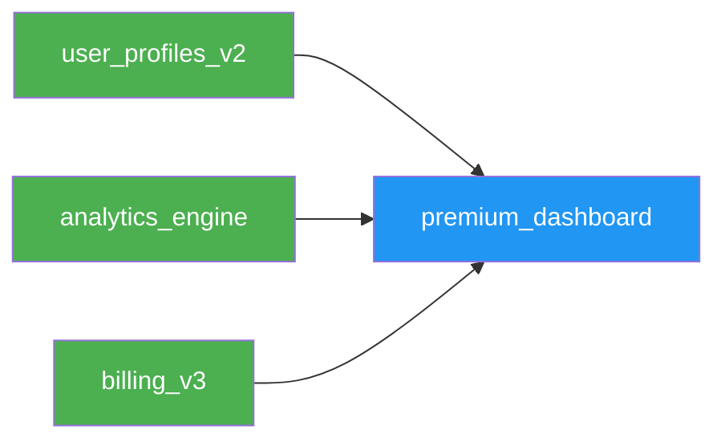
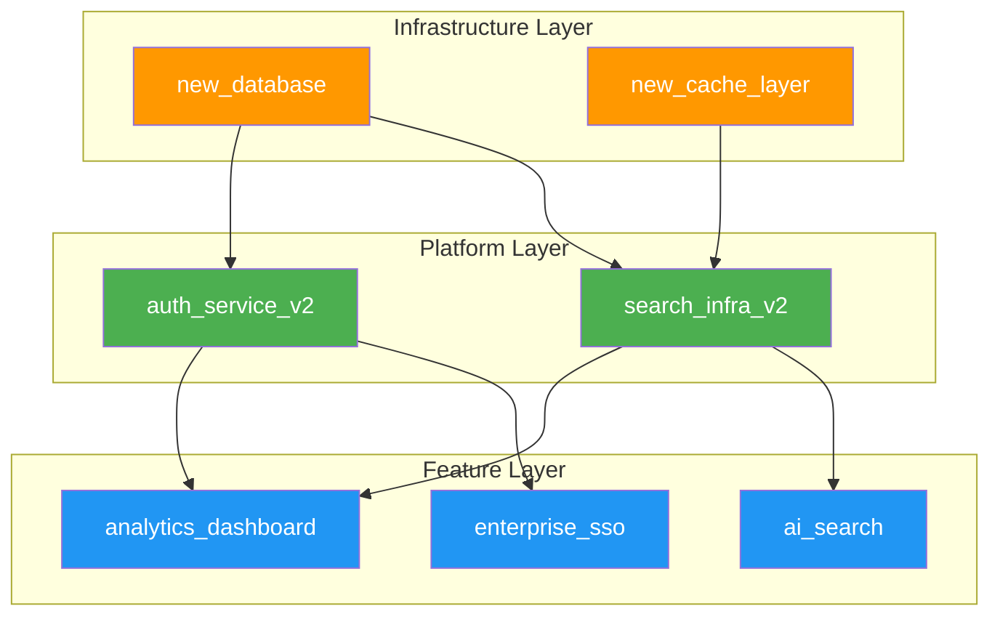
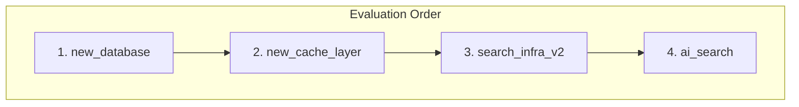
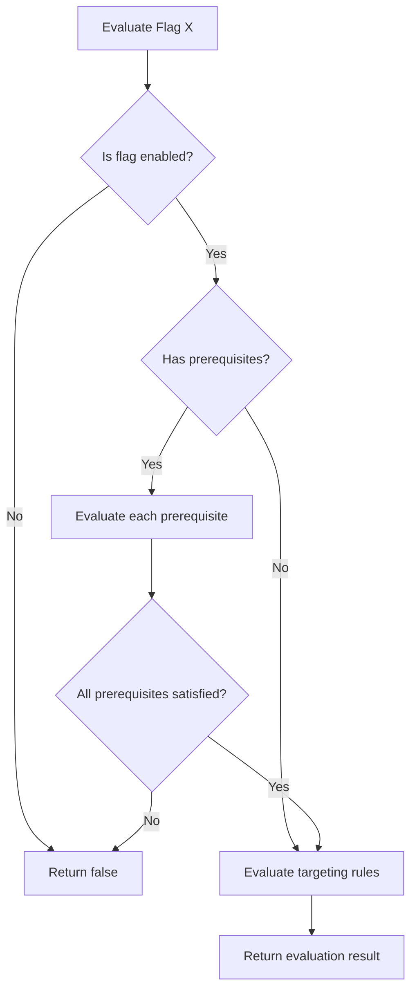
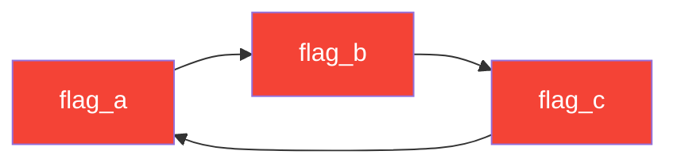
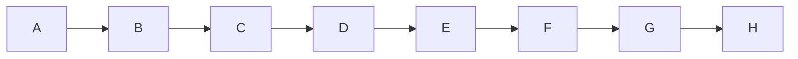

# How to Create Flag Prerequisites

Author: [nawazdhandala](https://github.com/nawazdhandala)

Tags: Feature Flags, Prerequisites, Dependencies, Development

Description: Learn how to implement flag prerequisites for dependent feature rollouts.

---

Feature flags are powerful on their own, but real-world applications often have features that depend on other features. A new checkout flow might require the payment gateway v2 to be enabled first. A premium dashboard needs the base analytics feature active before it makes sense. This is where flag prerequisites come in.

Flag prerequisites let you express "Flag A should only be enabled when Flag B is enabled." This creates a dependency chain that prevents broken states and simplifies rollout orchestration.

## Table of Contents

1. Understanding Flag Prerequisites
2. Prerequisite Flag Relationships
3. Dependency Graph Modeling
4. Evaluation Order
5. Circular Dependency Prevention
6. Implementation Examples
7. Testing Prerequisites
8. Documentation Practices
9. Common Pitfalls and Solutions

---

## 1. Understanding Flag Prerequisites

A prerequisite is a flag that must be enabled before another flag can take effect. Think of it as a gate: the dependent flag only evaluates to `true` if all its prerequisites are satisfied first.

| Term | Definition |
|------|------------|
| Prerequisite Flag | A flag that must be enabled for dependent flags to activate |
| Dependent Flag | A flag that requires one or more prerequisites to be met |
| Prerequisite Chain | A sequence of flags where each depends on the previous |
| Dependency Graph | The complete network of prerequisite relationships |

Real-world example: You're rolling out a new AI-powered search feature. It depends on the new search infrastructure being enabled, which itself depends on the new database being active.

```
new_database (prerequisite)
    └── new_search_infra (prerequisite)
            └── ai_search (dependent feature)
```

---

## 2. Prerequisite Flag Relationships

### Basic Prerequisite Relationship

The simplest case is a single prerequisite:


Here, `new_checkout_flow` will only evaluate to true if `payment_gateway_v2` is enabled.

### Multiple Prerequisites (AND Logic)

A flag can have multiple prerequisites that all must be satisfied:



The `premium_dashboard` flag requires all three prerequisites to be enabled.

### Modeling in Code

```typescript
interface FeatureFlag {
  key: string;
  enabled: boolean;
  prerequisites: Prerequisite[];
  targetingRules: TargetingRule[];
}

interface Prerequisite {
  flagKey: string;
  requiredVariation: string | boolean;
}

// Example flag configuration
const newCheckoutFlow: FeatureFlag = {
  key: 'new_checkout_flow',
  enabled: true,
  prerequisites: [
    { flagKey: 'payment_gateway_v2', requiredVariation: true }
  ],
  targetingRules: []
};

const premiumDashboard: FeatureFlag = {
  key: 'premium_dashboard',
  enabled: true,
  prerequisites: [
    { flagKey: 'user_profiles_v2', requiredVariation: true },
    { flagKey: 'analytics_engine', requiredVariation: true },
    { flagKey: 'billing_v3', requiredVariation: true }
  ],
  targetingRules: []
};
```

---

## 3. Dependency Graph Modeling

When you have many flags with prerequisites, you get a dependency graph. Modeling this correctly is essential for safe rollouts.

### Visualizing Complex Dependencies



### Building a Dependency Graph

```typescript
class DependencyGraph {
  private adjacencyList: Map<string, Set<string>> = new Map();
  private reverseList: Map<string, Set<string>> = new Map();

  addFlag(flagKey: string): void {
    if (!this.adjacencyList.has(flagKey)) {
      this.adjacencyList.set(flagKey, new Set());
      this.reverseList.set(flagKey, new Set());
    }
  }

  addPrerequisite(dependentFlag: string, prerequisiteFlag: string): void {
    this.addFlag(dependentFlag);
    this.addFlag(prerequisiteFlag);

    // dependentFlag depends on prerequisiteFlag
    this.adjacencyList.get(dependentFlag)!.add(prerequisiteFlag);
    // prerequisiteFlag is required by dependentFlag
    this.reverseList.get(prerequisiteFlag)!.add(dependentFlag);
  }

  getPrerequisites(flagKey: string): string[] {
    return Array.from(this.adjacencyList.get(flagKey) || []);
  }

  getDependents(flagKey: string): string[] {
    return Array.from(this.reverseList.get(flagKey) || []);
  }

  getAllPrerequisites(flagKey: string): string[] {
    const visited = new Set<string>();
    const result: string[] = [];

    const dfs = (key: string) => {
      for (const prereq of this.getPrerequisites(key)) {
        if (!visited.has(prereq)) {
          visited.add(prereq);
          dfs(prereq);
          result.push(prereq);
        }
      }
    };

    dfs(flagKey);
    return result;
  }
}

// Usage
const graph = new DependencyGraph();
graph.addPrerequisite('ai_search', 'search_infra_v2');
graph.addPrerequisite('search_infra_v2', 'new_database');
graph.addPrerequisite('search_infra_v2', 'new_cache_layer');

console.log(graph.getAllPrerequisites('ai_search'));
// Output: ['new_database', 'new_cache_layer', 'search_infra_v2']
```

---

## 4. Evaluation Order

The order in which you evaluate flags matters. Prerequisites must be evaluated before their dependents.

### Topological Sort for Evaluation Order



### Implementation

```typescript
class FlagEvaluator {
  private flags: Map<string, FeatureFlag> = new Map();
  private graph: DependencyGraph;
  private evaluationCache: Map<string, boolean> = new Map();

  constructor(flags: FeatureFlag[]) {
    this.graph = new DependencyGraph();

    for (const flag of flags) {
      this.flags.set(flag.key, flag);
      for (const prereq of flag.prerequisites) {
        this.graph.addPrerequisite(flag.key, prereq.flagKey);
      }
    }
  }

  getEvaluationOrder(): string[] {
    const visited = new Set<string>();
    const result: string[] = [];

    const visit = (flagKey: string) => {
      if (visited.has(flagKey)) return;
      visited.add(flagKey);

      const flag = this.flags.get(flagKey);
      if (flag) {
        for (const prereq of flag.prerequisites) {
          visit(prereq.flagKey);
        }
      }
      result.push(flagKey);
    };

    for (const flagKey of this.flags.keys()) {
      visit(flagKey);
    }

    return result;
  }

  evaluate(flagKey: string, context: EvaluationContext): boolean {
    // Check cache first
    const cacheKey = `${flagKey}:${JSON.stringify(context)}`;
    if (this.evaluationCache.has(cacheKey)) {
      return this.evaluationCache.get(cacheKey)!;
    }

    const flag = this.flags.get(flagKey);
    if (!flag) {
      return false;
    }

    // Check if flag is enabled at all
    if (!flag.enabled) {
      this.evaluationCache.set(cacheKey, false);
      return false;
    }

    // Check all prerequisites first
    for (const prereq of flag.prerequisites) {
      const prereqResult = this.evaluate(prereq.flagKey, context);
      if (prereqResult !== prereq.requiredVariation) {
        // Prerequisite not satisfied
        this.evaluationCache.set(cacheKey, false);
        return false;
      }
    }

    // All prerequisites satisfied, evaluate targeting rules
    const result = this.evaluateTargetingRules(flag, context);
    this.evaluationCache.set(cacheKey, result);
    return result;
  }

  private evaluateTargetingRules(
    flag: FeatureFlag,
    context: EvaluationContext
  ): boolean {
    // Simplified: check targeting rules
    for (const rule of flag.targetingRules) {
      if (this.matchesRule(rule, context)) {
        return rule.variation;
      }
    }
    return flag.enabled;
  }

  private matchesRule(
    rule: TargetingRule,
    context: EvaluationContext
  ): boolean {
    // Implementation depends on your rule structure
    return true;
  }

  clearCache(): void {
    this.evaluationCache.clear();
  }
}

interface EvaluationContext {
  userId?: string;
  email?: string;
  country?: string;
  plan?: string;
  [key: string]: any;
}

interface TargetingRule {
  conditions: Condition[];
  variation: boolean;
}

interface Condition {
  attribute: string;
  operator: 'equals' | 'contains' | 'startsWith' | 'in';
  value: any;
}
```

### Evaluation Flow Diagram



---

## 5. Circular Dependency Prevention

Circular dependencies will break your flag system. If Flag A requires Flag B, and Flag B requires Flag A, evaluation enters an infinite loop.

### Detecting Cycles



### Cycle Detection Algorithm

```typescript
class CycleDetector {
  private graph: DependencyGraph;

  constructor(graph: DependencyGraph) {
    this.graph = graph;
  }

  detectCycle(): string[] | null {
    const visited = new Set<string>();
    const recursionStack = new Set<string>();
    const path: string[] = [];

    const hasCycleDFS = (flagKey: string): boolean => {
      visited.add(flagKey);
      recursionStack.add(flagKey);
      path.push(flagKey);

      for (const prereq of this.graph.getPrerequisites(flagKey)) {
        if (!visited.has(prereq)) {
          if (hasCycleDFS(prereq)) {
            return true;
          }
        } else if (recursionStack.has(prereq)) {
          // Found cycle - return path from prereq to current
          const cycleStart = path.indexOf(prereq);
          path.push(prereq); // Complete the cycle
          return true;
        }
      }

      path.pop();
      recursionStack.delete(flagKey);
      return false;
    };

    for (const flagKey of this.getAllFlags()) {
      if (!visited.has(flagKey)) {
        if (hasCycleDFS(flagKey)) {
          // Extract just the cycle portion
          const cycleStart = path.indexOf(path[path.length - 1]);
          return path.slice(cycleStart);
        }
      }
    }

    return null;
  }

  private getAllFlags(): string[] {
    // Get all flag keys from the graph
    return Array.from(this.graph['adjacencyList'].keys());
  }
}

// Validation before adding prerequisites
class SafeDependencyGraph extends DependencyGraph {
  addPrerequisiteSafe(
    dependentFlag: string,
    prerequisiteFlag: string
  ): { success: boolean; error?: string } {
    // Temporarily add the edge
    super.addPrerequisite(dependentFlag, prerequisiteFlag);

    // Check for cycles
    const detector = new CycleDetector(this);
    const cycle = detector.detectCycle();

    if (cycle) {
      // Remove the edge we just added
      this['adjacencyList'].get(dependentFlag)?.delete(prerequisiteFlag);
      this['reverseList'].get(prerequisiteFlag)?.delete(dependentFlag);

      return {
        success: false,
        error: `Adding this prerequisite would create a cycle: ${cycle.join(' -> ')}`
      };
    }

    return { success: true };
  }
}

// Usage
const safeGraph = new SafeDependencyGraph();
safeGraph.addPrerequisiteSafe('flag_a', 'flag_b'); // OK
safeGraph.addPrerequisiteSafe('flag_b', 'flag_c'); // OK

const result = safeGraph.addPrerequisiteSafe('flag_c', 'flag_a');
if (!result.success) {
  console.error(result.error);
  // Output: Adding this prerequisite would create a cycle: flag_a -> flag_b -> flag_c -> flag_a
}
```

### Prevention at the API Level

```typescript
class FeatureFlagService {
  private graph: SafeDependencyGraph;
  private flags: Map<string, FeatureFlag>;

  async addPrerequisite(
    flagKey: string,
    prerequisiteKey: string
  ): Promise<void> {
    // Validate both flags exist
    if (!this.flags.has(flagKey)) {
      throw new Error(`Flag "${flagKey}" does not exist`);
    }
    if (!this.flags.has(prerequisiteKey)) {
      throw new Error(`Prerequisite flag "${prerequisiteKey}" does not exist`);
    }

    // Prevent self-reference
    if (flagKey === prerequisiteKey) {
      throw new Error('A flag cannot be its own prerequisite');
    }

    // Check for cycles
    const result = this.graph.addPrerequisiteSafe(flagKey, prerequisiteKey);
    if (!result.success) {
      throw new Error(result.error);
    }

    // Persist the change
    const flag = this.flags.get(flagKey)!;
    flag.prerequisites.push({
      flagKey: prerequisiteKey,
      requiredVariation: true
    });

    await this.persistFlag(flag);
  }

  private async persistFlag(flag: FeatureFlag): Promise<void> {
    // Save to database
  }
}
```

---

## 6. Implementation Examples

### Complete Flag Evaluation System

```typescript
// flag-system.ts
import { EventEmitter } from 'events';

interface FlagConfig {
  key: string;
  name: string;
  description: string;
  enabled: boolean;
  prerequisites: PrerequisiteConfig[];
  targeting: TargetingConfig;
  createdAt: Date;
  updatedAt: Date;
}

interface PrerequisiteConfig {
  flagKey: string;
  variation: boolean | string;
}

interface TargetingConfig {
  rules: TargetingRule[];
  defaultVariation: boolean | string;
}

interface TargetingRule {
  id: string;
  conditions: RuleCondition[];
  variation: boolean | string;
  rolloutPercentage?: number;
}

interface RuleCondition {
  attribute: string;
  operator: 'eq' | 'neq' | 'contains' | 'in' | 'gt' | 'lt';
  value: any;
}

interface UserContext {
  key: string;
  email?: string;
  name?: string;
  country?: string;
  plan?: string;
  custom?: Record<string, any>;
}

class FeatureFlagSystem extends EventEmitter {
  private flags: Map<string, FlagConfig> = new Map();
  private evaluationCache: Map<string, Map<string, boolean>> = new Map();

  constructor(initialFlags: FlagConfig[] = []) {
    super();
    for (const flag of initialFlags) {
      this.flags.set(flag.key, flag);
      this.evaluationCache.set(flag.key, new Map());
    }
  }

  evaluate(flagKey: string, user: UserContext): boolean {
    const cacheKey = this.getCacheKey(user);
    const flagCache = this.evaluationCache.get(flagKey);

    if (flagCache?.has(cacheKey)) {
      return flagCache.get(cacheKey)!;
    }

    const result = this.evaluateInternal(flagKey, user, new Set());

    if (!flagCache) {
      this.evaluationCache.set(flagKey, new Map());
    }
    this.evaluationCache.get(flagKey)!.set(cacheKey, result);

    this.emit('evaluation', {
      flagKey,
      user: user.key,
      result,
      timestamp: new Date()
    });

    return result;
  }

  private evaluateInternal(
    flagKey: string,
    user: UserContext,
    evaluating: Set<string>
  ): boolean {
    // Detect cycles during evaluation
    if (evaluating.has(flagKey)) {
      console.error(`Circular dependency detected for flag: ${flagKey}`);
      return false;
    }

    const flag = this.flags.get(flagKey);
    if (!flag) {
      return false;
    }

    if (!flag.enabled) {
      return false;
    }

    evaluating.add(flagKey);

    // Check prerequisites
    for (const prereq of flag.prerequisites) {
      const prereqResult = this.evaluateInternal(
        prereq.flagKey,
        user,
        evaluating
      );

      if (prereqResult !== prereq.variation) {
        evaluating.delete(flagKey);
        return false;
      }
    }

    evaluating.delete(flagKey);

    // Evaluate targeting rules
    return this.evaluateTargeting(flag.targeting, user);
  }

  private evaluateTargeting(
    targeting: TargetingConfig,
    user: UserContext
  ): boolean {
    for (const rule of targeting.rules) {
      if (this.matchesAllConditions(rule.conditions, user)) {
        // Handle percentage rollout
        if (rule.rolloutPercentage !== undefined) {
          const bucket = this.hashUserToPercentage(user.key, rule.id);
          if (bucket > rule.rolloutPercentage) {
            continue;
          }
        }
        return rule.variation as boolean;
      }
    }
    return targeting.defaultVariation as boolean;
  }

  private matchesAllConditions(
    conditions: RuleCondition[],
    user: UserContext
  ): boolean {
    return conditions.every(cond => this.matchesCondition(cond, user));
  }

  private matchesCondition(
    condition: RuleCondition,
    user: UserContext
  ): boolean {
    const value = this.getAttributeValue(user, condition.attribute);

    switch (condition.operator) {
      case 'eq':
        return value === condition.value;
      case 'neq':
        return value !== condition.value;
      case 'contains':
        return String(value).includes(condition.value);
      case 'in':
        return Array.isArray(condition.value) &&
               condition.value.includes(value);
      case 'gt':
        return Number(value) > Number(condition.value);
      case 'lt':
        return Number(value) < Number(condition.value);
      default:
        return false;
    }
  }

  private getAttributeValue(user: UserContext, attribute: string): any {
    if (attribute.startsWith('custom.')) {
      return user.custom?.[attribute.slice(7)];
    }
    return (user as any)[attribute];
  }

  private hashUserToPercentage(userKey: string, salt: string): number {
    const str = `${userKey}:${salt}`;
    let hash = 0;
    for (let i = 0; i < str.length; i++) {
      hash = ((hash << 5) - hash) + str.charCodeAt(i);
      hash = hash & hash;
    }
    return Math.abs(hash % 100);
  }

  private getCacheKey(user: UserContext): string {
    return JSON.stringify(user);
  }

  invalidateCache(flagKey?: string): void {
    if (flagKey) {
      this.evaluationCache.get(flagKey)?.clear();
    } else {
      for (const cache of this.evaluationCache.values()) {
        cache.clear();
      }
    }
  }

  updateFlag(flag: FlagConfig): void {
    this.flags.set(flag.key, flag);
    this.invalidateDependentCaches(flag.key);
    this.emit('flagUpdated', { flagKey: flag.key });
  }

  private invalidateDependentCaches(flagKey: string): void {
    // Invalidate this flag's cache
    this.evaluationCache.get(flagKey)?.clear();

    // Find and invalidate all flags that depend on this one
    for (const [key, flag] of this.flags) {
      if (flag.prerequisites.some(p => p.flagKey === flagKey)) {
        this.invalidateDependentCaches(key);
      }
    }
  }
}

// Usage example
const flagSystem = new FeatureFlagSystem([
  {
    key: 'new_database',
    name: 'New Database',
    description: 'Enable new PostgreSQL cluster',
    enabled: true,
    prerequisites: [],
    targeting: {
      rules: [],
      defaultVariation: true
    },
    createdAt: new Date(),
    updatedAt: new Date()
  },
  {
    key: 'search_v2',
    name: 'Search V2',
    description: 'New search infrastructure',
    enabled: true,
    prerequisites: [
      { flagKey: 'new_database', variation: true }
    ],
    targeting: {
      rules: [
        {
          id: 'beta-users',
          conditions: [
            { attribute: 'plan', operator: 'eq', value: 'enterprise' }
          ],
          variation: true
        }
      ],
      defaultVariation: false
    },
    createdAt: new Date(),
    updatedAt: new Date()
  },
  {
    key: 'ai_search',
    name: 'AI Search',
    description: 'AI-powered search results',
    enabled: true,
    prerequisites: [
      { flagKey: 'search_v2', variation: true }
    ],
    targeting: {
      rules: [
        {
          id: 'gradual-rollout',
          conditions: [],
          variation: true,
          rolloutPercentage: 25
        }
      ],
      defaultVariation: false
    },
    createdAt: new Date(),
    updatedAt: new Date()
  }
]);

// Evaluate flags
const user = { key: 'user-123', plan: 'enterprise' };

console.log('new_database:', flagSystem.evaluate('new_database', user)); // true
console.log('search_v2:', flagSystem.evaluate('search_v2', user));       // true (enterprise plan)
console.log('ai_search:', flagSystem.evaluate('ai_search', user));       // depends on rollout %

const freeUser = { key: 'user-456', plan: 'free' };
console.log('search_v2 (free):', flagSystem.evaluate('search_v2', freeUser)); // false
console.log('ai_search (free):', flagSystem.evaluate('ai_search', freeUser)); // false (prereq not met)
```

---

## 7. Testing Prerequisites

Testing flag prerequisites requires verifying the dependency chain works correctly.

### Unit Testing Prerequisites

```typescript
// flag-system.test.ts
import { describe, it, expect, beforeEach } from 'vitest';

describe('FeatureFlagSystem Prerequisites', () => {
  let flagSystem: FeatureFlagSystem;

  beforeEach(() => {
    flagSystem = new FeatureFlagSystem([
      {
        key: 'base_feature',
        name: 'Base Feature',
        description: '',
        enabled: true,
        prerequisites: [],
        targeting: { rules: [], defaultVariation: true },
        createdAt: new Date(),
        updatedAt: new Date()
      },
      {
        key: 'dependent_feature',
        name: 'Dependent Feature',
        description: '',
        enabled: true,
        prerequisites: [{ flagKey: 'base_feature', variation: true }],
        targeting: { rules: [], defaultVariation: true },
        createdAt: new Date(),
        updatedAt: new Date()
      }
    ]);
  });

  describe('when prerequisite is enabled', () => {
    it('should return true for dependent flag', () => {
      const user = { key: 'user-1' };
      expect(flagSystem.evaluate('dependent_feature', user)).toBe(true);
    });
  });

  describe('when prerequisite is disabled', () => {
    beforeEach(() => {
      flagSystem.updateFlag({
        key: 'base_feature',
        name: 'Base Feature',
        description: '',
        enabled: false,
        prerequisites: [],
        targeting: { rules: [], defaultVariation: false },
        createdAt: new Date(),
        updatedAt: new Date()
      });
    });

    it('should return false for dependent flag', () => {
      const user = { key: 'user-1' };
      expect(flagSystem.evaluate('dependent_feature', user)).toBe(false);
    });
  });

  describe('with multiple prerequisites', () => {
    beforeEach(() => {
      flagSystem = new FeatureFlagSystem([
        {
          key: 'prereq_a',
          name: 'Prereq A',
          description: '',
          enabled: true,
          prerequisites: [],
          targeting: { rules: [], defaultVariation: true },
          createdAt: new Date(),
          updatedAt: new Date()
        },
        {
          key: 'prereq_b',
          name: 'Prereq B',
          description: '',
          enabled: true,
          prerequisites: [],
          targeting: { rules: [], defaultVariation: true },
          createdAt: new Date(),
          updatedAt: new Date()
        },
        {
          key: 'feature_with_multiple_prereqs',
          name: 'Feature',
          description: '',
          enabled: true,
          prerequisites: [
            { flagKey: 'prereq_a', variation: true },
            { flagKey: 'prereq_b', variation: true }
          ],
          targeting: { rules: [], defaultVariation: true },
          createdAt: new Date(),
          updatedAt: new Date()
        }
      ]);
    });

    it('should return true when all prerequisites are met', () => {
      const user = { key: 'user-1' };
      expect(flagSystem.evaluate('feature_with_multiple_prereqs', user)).toBe(true);
    });

    it('should return false when any prerequisite is not met', () => {
      flagSystem.updateFlag({
        key: 'prereq_b',
        name: 'Prereq B',
        description: '',
        enabled: false,
        prerequisites: [],
        targeting: { rules: [], defaultVariation: false },
        createdAt: new Date(),
        updatedAt: new Date()
      });

      const user = { key: 'user-1' };
      expect(flagSystem.evaluate('feature_with_multiple_prereqs', user)).toBe(false);
    });
  });

  describe('with chained prerequisites', () => {
    beforeEach(() => {
      flagSystem = new FeatureFlagSystem([
        {
          key: 'level_1',
          name: 'Level 1',
          description: '',
          enabled: true,
          prerequisites: [],
          targeting: { rules: [], defaultVariation: true },
          createdAt: new Date(),
          updatedAt: new Date()
        },
        {
          key: 'level_2',
          name: 'Level 2',
          description: '',
          enabled: true,
          prerequisites: [{ flagKey: 'level_1', variation: true }],
          targeting: { rules: [], defaultVariation: true },
          createdAt: new Date(),
          updatedAt: new Date()
        },
        {
          key: 'level_3',
          name: 'Level 3',
          description: '',
          enabled: true,
          prerequisites: [{ flagKey: 'level_2', variation: true }],
          targeting: { rules: [], defaultVariation: true },
          createdAt: new Date(),
          updatedAt: new Date()
        }
      ]);
    });

    it('should evaluate entire chain', () => {
      const user = { key: 'user-1' };
      expect(flagSystem.evaluate('level_3', user)).toBe(true);
    });

    it('should fail if any link in chain is broken', () => {
      flagSystem.updateFlag({
        key: 'level_1',
        name: 'Level 1',
        description: '',
        enabled: false,
        prerequisites: [],
        targeting: { rules: [], defaultVariation: false },
        createdAt: new Date(),
        updatedAt: new Date()
      });

      const user = { key: 'user-1' };
      expect(flagSystem.evaluate('level_2', user)).toBe(false);
      expect(flagSystem.evaluate('level_3', user)).toBe(false);
    });
  });
});

describe('CycleDetector', () => {
  it('should detect simple cycles', () => {
    const graph = new DependencyGraph();
    graph.addPrerequisite('a', 'b');
    graph.addPrerequisite('b', 'c');
    graph.addPrerequisite('c', 'a');

    const detector = new CycleDetector(graph);
    const cycle = detector.detectCycle();

    expect(cycle).not.toBeNull();
    expect(cycle).toContain('a');
    expect(cycle).toContain('b');
    expect(cycle).toContain('c');
  });

  it('should return null for acyclic graphs', () => {
    const graph = new DependencyGraph();
    graph.addPrerequisite('a', 'b');
    graph.addPrerequisite('b', 'c');
    graph.addPrerequisite('a', 'c');

    const detector = new CycleDetector(graph);
    const cycle = detector.detectCycle();

    expect(cycle).toBeNull();
  });
});
```

### Integration Testing with Real Scenarios

```typescript
// integration.test.ts
describe('Feature Rollout Scenarios', () => {
  it('should support gradual infrastructure rollout', async () => {
    const flags = new FeatureFlagSystem([
      createFlag('database_v2', true, []),
      createFlag('api_v2', true, [{ flagKey: 'database_v2', variation: true }]),
      createFlag('frontend_v2', true, [{ flagKey: 'api_v2', variation: true }])
    ]);

    // Phase 1: Enable database
    expect(flags.evaluate('database_v2', testUser)).toBe(true);
    expect(flags.evaluate('api_v2', testUser)).toBe(true);
    expect(flags.evaluate('frontend_v2', testUser)).toBe(true);

    // Phase 2: Disable database (simulating rollback)
    flags.updateFlag(createFlag('database_v2', false, []));

    // All dependent flags should automatically return false
    expect(flags.evaluate('api_v2', testUser)).toBe(false);
    expect(flags.evaluate('frontend_v2', testUser)).toBe(false);
  });

  it('should handle partial rollouts with prerequisites', async () => {
    const flags = new FeatureFlagSystem([
      createFlagWithTargeting('premium_infra', true, [], {
        rules: [{
          id: 'enterprise-only',
          conditions: [{ attribute: 'plan', operator: 'eq', value: 'enterprise' }],
          variation: true
        }],
        defaultVariation: false
      }),
      createFlag('premium_feature', true, [
        { flagKey: 'premium_infra', variation: true }
      ])
    ]);

    const enterpriseUser = { key: 'e-1', plan: 'enterprise' };
    const freeUser = { key: 'f-1', plan: 'free' };

    expect(flags.evaluate('premium_feature', enterpriseUser)).toBe(true);
    expect(flags.evaluate('premium_feature', freeUser)).toBe(false);
  });
});

function createFlag(
  key: string,
  enabled: boolean,
  prerequisites: PrerequisiteConfig[]
): FlagConfig {
  return {
    key,
    name: key,
    description: '',
    enabled,
    prerequisites,
    targeting: { rules: [], defaultVariation: enabled },
    createdAt: new Date(),
    updatedAt: new Date()
  };
}

function createFlagWithTargeting(
  key: string,
  enabled: boolean,
  prerequisites: PrerequisiteConfig[],
  targeting: TargetingConfig
): FlagConfig {
  return {
    key,
    name: key,
    description: '',
    enabled,
    prerequisites,
    targeting,
    createdAt: new Date(),
    updatedAt: new Date()
  };
}

const testUser = { key: 'test-user-1' };
```

---

## 8. Documentation Practices

Good documentation makes prerequisites maintainable.

### Flag Documentation Template

```markdown
## Flag: ai_search

**Key:** `ai_search`
**Status:** Enabled
**Owner:** Search Team (@search-team)

### Description
Enables AI-powered search results using the new ML ranking model.

### Prerequisites
| Flag | Required State | Purpose |
|------|----------------|---------|
| `search_infra_v2` | enabled | New search infrastructure required |
| `ml_ranking_model` | enabled | ML model must be deployed |

### Dependency Graph
```
ml_ranking_model
    |
search_infra_v2
    |
ai_search <-- YOU ARE HERE
```

### Rollout Plan
1. Enable `search_infra_v2` for all users (done)
2. Enable `ml_ranking_model` for 10% (in progress)
3. Enable `ai_search` for enterprise users
4. Gradual rollout to all users

### Rollback Procedure
Disable `ai_search` first, then `ml_ranking_model` if needed.
Never disable `search_infra_v2` while dependents are active.

### Related Flags
- `search_infra_v2` - prerequisite
- `ml_ranking_model` - prerequisite
- `search_suggestions` - uses same infrastructure
```

### Generating Documentation Automatically

```typescript
class FlagDocumentationGenerator {
  private flags: Map<string, FlagConfig>;
  private graph: DependencyGraph;

  constructor(flags: FlagConfig[]) {
    this.flags = new Map(flags.map(f => [f.key, f]));
    this.graph = this.buildGraph(flags);
  }

  private buildGraph(flags: FlagConfig[]): DependencyGraph {
    const graph = new DependencyGraph();
    for (const flag of flags) {
      for (const prereq of flag.prerequisites) {
        graph.addPrerequisite(flag.key, prereq.flagKey);
      }
    }
    return graph;
  }

  generateMarkdown(flagKey: string): string {
    const flag = this.flags.get(flagKey);
    if (!flag) return '';

    const prereqs = flag.prerequisites;
    const dependents = this.graph.getDependents(flagKey);
    const allPrereqs = this.graph.getAllPrerequisites(flagKey);

    return `
## Flag: ${flag.name}

**Key:** \`${flag.key}\`
**Status:** ${flag.enabled ? 'Enabled' : 'Disabled'}
**Last Updated:** ${flag.updatedAt.toISOString()}

### Description
${flag.description}

### Prerequisites
${prereqs.length === 0 ? 'None' : prereqs.map(p =>
  `- \`${p.flagKey}\` must be ${p.variation}`
).join('\n')}

### Dependent Flags
${dependents.length === 0 ? 'None' : dependents.map(d =>
  `- \`${d}\``
).join('\n')}

### Full Dependency Chain
${allPrereqs.length === 0 ? 'No dependencies' :
  this.generateDependencyTree(flagKey)}

### Targeting Rules
${this.formatTargetingRules(flag.targeting)}
`.trim();
  }

  private generateDependencyTree(flagKey: string): string {
    const lines: string[] = [];
    const visited = new Set<string>();

    const traverse = (key: string, depth: number) => {
      const indent = '  '.repeat(depth);
      const marker = depth === 0 ? '' : '|-- ';
      lines.push(`${indent}${marker}${key}`);

      const prereqs = this.graph.getPrerequisites(key);
      for (const prereq of prereqs) {
        if (!visited.has(prereq)) {
          visited.add(prereq);
          traverse(prereq, depth + 1);
        }
      }
    };

    traverse(flagKey, 0);
    return '```\n' + lines.join('\n') + '\n```';
  }

  private formatTargetingRules(targeting: TargetingConfig): string {
    if (targeting.rules.length === 0) {
      return `Default: ${targeting.defaultVariation}`;
    }

    return targeting.rules.map(rule => {
      const conditions = rule.conditions.map(c =>
        `${c.attribute} ${c.operator} ${c.value}`
      ).join(' AND ');
      const rollout = rule.rolloutPercentage !== undefined
        ? ` (${rule.rolloutPercentage}% rollout)`
        : '';
      return `- If ${conditions}: ${rule.variation}${rollout}`;
    }).join('\n') + `\n- Default: ${targeting.defaultVariation}`;
  }

  generateDependencyDiagram(): string {
    const lines = ['```mermaid', 'flowchart TD'];
    const edges = new Set<string>();

    for (const [key, flag] of this.flags) {
      for (const prereq of flag.prerequisites) {
        const edge = `    ${prereq.flagKey}[${prereq.flagKey}] --> ${key}[${key}]`;
        edges.add(edge);
      }
    }

    lines.push(...edges);
    lines.push('```');
    return lines.join('\n');
  }
}

// Usage
const generator = new FlagDocumentationGenerator([...flags]);
console.log(generator.generateMarkdown('ai_search'));
console.log(generator.generateDependencyDiagram());
```

---

## 9. Common Pitfalls and Solutions

### Pitfall 1: Forgetting to Handle Missing Prerequisites

```typescript
// BAD: Crashes if prerequisite doesn't exist
evaluate(flagKey: string): boolean {
  const flag = this.flags.get(flagKey)!; // Might be undefined
  for (const prereq of flag.prerequisites) {
    const prereqFlag = this.flags.get(prereq.flagKey)!; // Might be undefined
    // ...
  }
}

// GOOD: Handle missing flags gracefully
evaluate(flagKey: string): boolean {
  const flag = this.flags.get(flagKey);
  if (!flag) {
    console.warn(`Flag "${flagKey}" not found, returning false`);
    return false;
  }

  for (const prereq of flag.prerequisites) {
    const prereqFlag = this.flags.get(prereq.flagKey);
    if (!prereqFlag) {
      console.warn(`Prerequisite "${prereq.flagKey}" not found for "${flagKey}"`);
      return false;
    }
    // ...
  }
}
```

### Pitfall 2: Not Invalidating Cache on Prerequisite Change

```typescript
// BAD: Only invalidates the changed flag
updateFlag(flag: FlagConfig): void {
  this.flags.set(flag.key, flag);
  this.cache.delete(flag.key); // Dependents still have stale values!
}

// GOOD: Invalidate entire dependency chain
updateFlag(flag: FlagConfig): void {
  this.flags.set(flag.key, flag);
  this.invalidateDependentCaches(flag.key);
}

private invalidateDependentCaches(flagKey: string): void {
  this.cache.delete(flagKey);
  for (const dependent of this.graph.getDependents(flagKey)) {
    this.invalidateDependentCaches(dependent);
  }
}
```

### Pitfall 3: Deep Prerequisite Chains Causing Performance Issues



```typescript
// SOLUTION: Limit chain depth and cache aggressively
const MAX_PREREQUISITE_DEPTH = 5;

private evaluateWithDepthLimit(
  flagKey: string,
  user: UserContext,
  depth: number = 0
): boolean {
  if (depth > MAX_PREREQUISITE_DEPTH) {
    console.error(`Prerequisite chain too deep for "${flagKey}"`);
    return false;
  }

  // ... evaluation logic with depth + 1 for recursive calls
}
```

### Pitfall 4: Inconsistent Prerequisite State Across Services

When multiple services evaluate flags independently, you can get inconsistent states.

```typescript
// SOLUTION: Use a centralized evaluation service or sync mechanism
class DistributedFlagEvaluator {
  private redis: RedisClient;
  private localCache: Map<string, CachedResult>;
  private syncInterval: number = 5000;

  async evaluate(flagKey: string, user: UserContext): Promise<boolean> {
    // Check local cache first
    const cached = this.localCache.get(this.cacheKey(flagKey, user));
    if (cached && !this.isExpired(cached)) {
      return cached.result;
    }

    // Evaluate and store in Redis for consistency
    const result = await this.evaluateAndSync(flagKey, user);
    return result;
  }

  private async evaluateAndSync(
    flagKey: string,
    user: UserContext
  ): Promise<boolean> {
    const lockKey = `lock:${flagKey}:${user.key}`;

    // Acquire distributed lock for consistent evaluation
    const lock = await this.redis.set(lockKey, '1', 'NX', 'EX', 1);
    if (lock) {
      const result = this.localEvaluate(flagKey, user);
      await this.redis.setex(
        this.cacheKey(flagKey, user),
        60,
        JSON.stringify({ result, timestamp: Date.now() })
      );
      return result;
    }

    // Another service is evaluating, wait for result
    return this.waitForResult(flagKey, user);
  }
}
```

---

## Summary

Flag prerequisites enable sophisticated feature rollout strategies by expressing dependencies between flags. Key takeaways:

| Concept | Implementation |
|---------|----------------|
| Prerequisite Relationships | Model with flag configurations referencing other flags |
| Dependency Graphs | Use adjacency lists to track relationships |
| Evaluation Order | Topological sort ensures prerequisites evaluate first |
| Cycle Prevention | Detect cycles before adding new prerequisites |
| Testing | Unit test chains, integration test rollout scenarios |
| Documentation | Generate dependency diagrams and maintain rollout plans |

When implementing prerequisites:

1. Always validate for cycles before adding new prerequisites
2. Invalidate caches for the entire dependency chain on updates
3. Handle missing flags gracefully
4. Limit chain depth for performance
5. Document dependencies and rollout procedures
6. Test both positive and negative prerequisite scenarios

Prerequisites transform feature flags from simple toggles into a powerful orchestration system for complex, dependent feature rollouts.

---

*Looking for a feature flag system with built-in prerequisite support? [OneUptime](https://oneuptime.com) provides feature flags as part of its comprehensive observability platform, helping you ship confidently with full visibility into your rollouts.*
