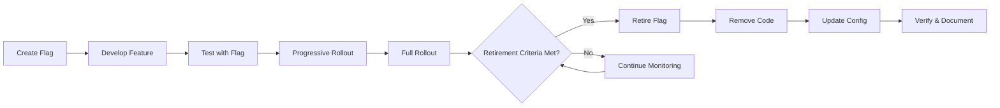
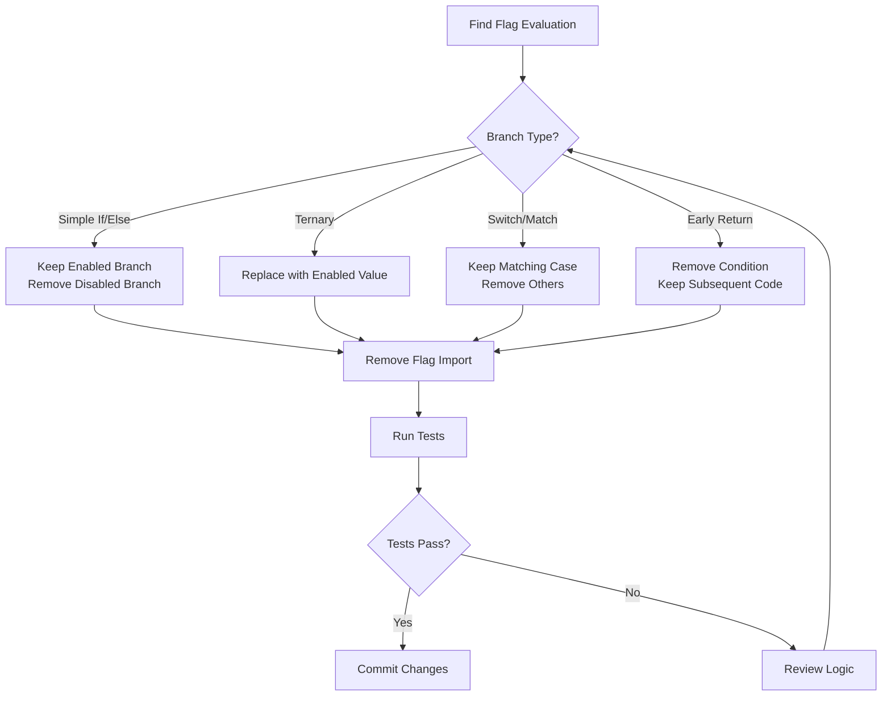
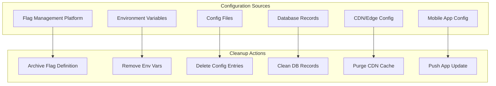
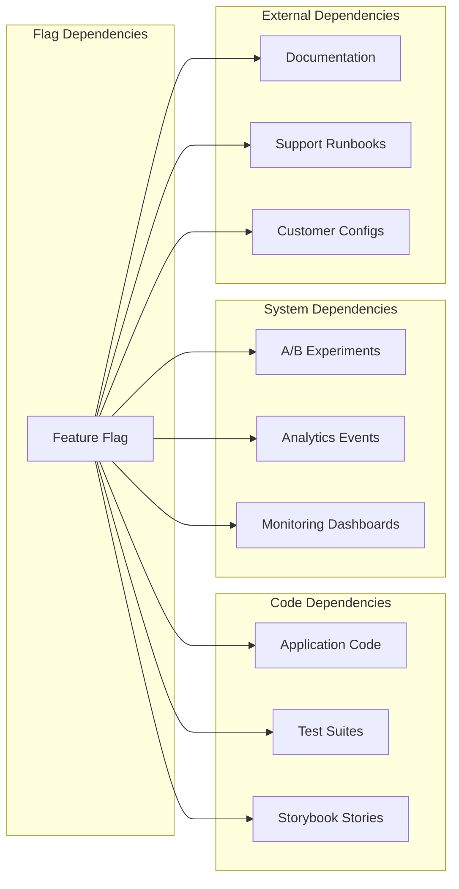
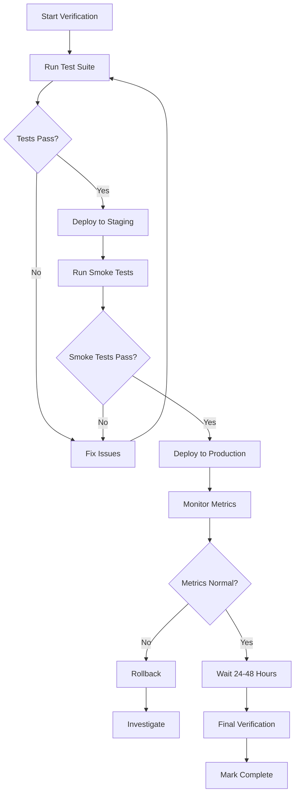
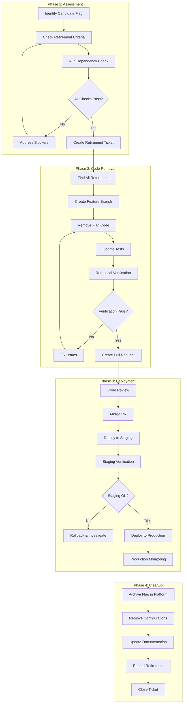

# How to Implement Flag Retirement

Author: [nawazdhandala](https://github.com/nawazdhandala)

Tags: Feature Flags, Lifecycle, Retirement, Cleanup

Description: Learn how to safely retire feature flags to reduce technical debt.

---

## Why Flag Retirement Matters

Feature flags are powerful tools for progressive delivery and risk mitigation, but they come with a hidden cost: technical debt. Every flag left in your codebase after serving its purpose adds complexity, increases cognitive load, and creates potential for bugs. A disciplined retirement process transforms flags from liabilities into assets.

Think of feature flags like scaffolding on a building. Essential during construction, but once the building is complete, leaving the scaffolding in place creates visual clutter, maintenance burden, and safety hazards. The same principle applies to your codebase.

---

## The Feature Flag Lifecycle

Before diving into retirement, understand where it fits in the complete lifecycle:



---

## Retirement Criteria

Not every flag is ready for retirement. Establish clear criteria before proceeding.

### Time-Based Criteria

```typescript
interface FlagRetirementCriteria {
  // Minimum time flag must be at 100% rollout
  minimumStableTime: Duration;

  // Maximum age before mandatory review
  maximumFlagAge: Duration;

  // Grace period after meeting criteria
  gracePeriod: Duration;
}

const defaultCriteria: FlagRetirementCriteria = {
  minimumStableTime: Duration.days(14),
  maximumFlagAge: Duration.days(90),
  gracePeriod: Duration.days(7),
};
```

### Behavioral Criteria

```typescript
interface FlagBehaviorCriteria {
  // Flag must be enabled for all users
  isFullyRolledOut: boolean;

  // No incidents related to this flag recently
  incidentFreeWindow: Duration;

  // No A/B test depending on this flag
  noActiveExperiments: boolean;

  // All dependent flags also retired or stable
  dependenciesResolved: boolean;
}

function isReadyForRetirement(
  flag: FeatureFlag,
  criteria: FlagRetirementCriteria & FlagBehaviorCriteria
): RetirementReadiness {
  const checks: CheckResult[] = [
    {
      name: 'fully_rolled_out',
      passed: flag.rolloutPercentage === 100,
      message: flag.rolloutPercentage === 100
        ? 'Flag is at 100% rollout'
        : `Flag is at ${flag.rolloutPercentage}% rollout`,
    },
    {
      name: 'stable_duration',
      passed: flag.stableSince &&
        daysSince(flag.stableSince) >= criteria.minimumStableTime.days,
      message: `Stable for ${daysSince(flag.stableSince)} days`,
    },
    {
      name: 'no_incidents',
      passed: flag.lastIncident === null ||
        daysSince(flag.lastIncident) >= criteria.incidentFreeWindow.days,
      message: flag.lastIncident
        ? `Last incident ${daysSince(flag.lastIncident)} days ago`
        : 'No incidents recorded',
    },
    {
      name: 'no_experiments',
      passed: flag.activeExperiments.length === 0,
      message: flag.activeExperiments.length === 0
        ? 'No active experiments'
        : `${flag.activeExperiments.length} active experiments`,
    },
  ];

  return {
    ready: checks.every(c => c.passed),
    checks,
    suggestedRetirementDate: calculateRetirementDate(flag, criteria),
  };
}
```

### Decision Matrix

| Criteria | Weight | Must Pass |
|----------|--------|-----------|
| 100% Rollout | High | Yes |
| 14+ Days Stable | High | Yes |
| No Active Incidents | High | Yes |
| No Active Experiments | Medium | Yes |
| Dependencies Resolved | Medium | Yes |
| Owner Approval | Low | Recommended |
| Documentation Updated | Low | Recommended |

---

## Code Removal Process

The most critical and error-prone step. Follow a systematic approach.

### Step 1: Identify All Flag References

```typescript
// Flag usage scanner
interface FlagReference {
  filePath: string;
  lineNumber: number;
  referenceType: 'evaluation' | 'definition' | 'test' | 'documentation';
  codeSnippet: string;
}

async function findFlagReferences(flagKey: string): Promise<FlagReference[]> {
  const references: FlagReference[] = [];

  // Search patterns for different reference types
  const patterns = [
    // Direct evaluation
    new RegExp(`isEnabled\\(['"]${flagKey}['"]\\)`, 'g'),
    new RegExp(`getFlag\\(['"]${flagKey}['"]\\)`, 'g'),
    new RegExp(`featureFlags\\.${flagKey}`, 'g'),

    // SDK variations
    new RegExp(`client\\.boolVariation\\(['"]${flagKey}['"]`, 'g'),
    new RegExp(`useFeatureFlag\\(['"]${flagKey}['"]\\)`, 'g'),

    // Configuration references
    new RegExp(`flag:\\s*['"]${flagKey}['"]`, 'g'),
    new RegExp(`"${flagKey}":\\s*(true|false)`, 'g'),
  ];

  // Scan codebase
  for (const pattern of patterns) {
    const matches = await searchCodebase(pattern);
    references.push(...matches);
  }

  return deduplicateReferences(references);
}

// Example output
const references = await findFlagReferences('new-checkout-flow');
console.log(references);
// [
//   { filePath: 'src/checkout/CheckoutPage.tsx', lineNumber: 45,
//     referenceType: 'evaluation', codeSnippet: 'if (isEnabled("new-checkout-flow"))' },
//   { filePath: 'src/checkout/__tests__/checkout.test.ts', lineNumber: 12,
//     referenceType: 'test', codeSnippet: 'mockFlag("new-checkout-flow", true)' },
//   { filePath: 'config/flags.yaml', lineNumber: 78,
//     referenceType: 'definition', codeSnippet: 'new-checkout-flow: enabled: true' },
// ]
```

### Step 2: Analyze Code Branches



### Step 3: Safe Code Transformation

```typescript
// Before: Code with feature flag
import { isEnabled } from '@company/feature-flags';

export function CheckoutPage() {
  const showNewCheckout = isEnabled('new-checkout-flow');

  if (showNewCheckout) {
    return <NewCheckoutFlow />;
  } else {
    return <LegacyCheckoutFlow />;
  }
}

// After: Flag retired (enabled branch kept)
export function CheckoutPage() {
  return <NewCheckoutFlow />;
}
```

```typescript
// Before: Ternary with flag
const buttonText = isEnabled('new-cta-copy')
  ? 'Start Free Trial'
  : 'Sign Up';

// After: Flag retired
const buttonText = 'Start Free Trial';
```

```typescript
// Before: Early return pattern
function processOrder(order: Order) {
  if (!isEnabled('order-validation-v2')) {
    return legacyValidation(order);
  }

  // New validation logic
  const validated = validateOrder(order);
  return processValidatedOrder(validated);
}

// After: Flag retired
function processOrder(order: Order) {
  const validated = validateOrder(order);
  return processValidatedOrder(validated);
}
```

### Step 4: Automated Code Removal Tool

```typescript
// Automated flag removal utility
interface RemovalResult {
  success: boolean;
  filesModified: string[];
  linesRemoved: number;
  warnings: string[];
}

async function removeFeatureFlag(
  flagKey: string,
  options: RemovalOptions = {}
): Promise<RemovalResult> {
  const {
    dryRun = true,
    keepBranch = 'enabled', // 'enabled' | 'disabled'
    createBackup = true,
  } = options;

  // Step 1: Find all references
  const references = await findFlagReferences(flagKey);

  if (references.length === 0) {
    return {
      success: true,
      filesModified: [],
      linesRemoved: 0,
      warnings: ['No references found for flag'],
    };
  }

  // Step 2: Group by file
  const fileGroups = groupBy(references, 'filePath');
  const result: RemovalResult = {
    success: true,
    filesModified: [],
    linesRemoved: 0,
    warnings: [],
  };

  // Step 3: Process each file
  for (const [filePath, refs] of Object.entries(fileGroups)) {
    if (createBackup && !dryRun) {
      await createFileBackup(filePath);
    }

    const ast = await parseFile(filePath);
    const transformer = new FlagRemovalTransformer(flagKey, keepBranch);
    const transformed = transformer.transform(ast);

    if (transformer.warnings.length > 0) {
      result.warnings.push(...transformer.warnings);
    }

    if (!dryRun) {
      await writeFile(filePath, generate(transformed));
      result.filesModified.push(filePath);
      result.linesRemoved += transformer.linesRemoved;
    } else {
      console.log(`[DRY RUN] Would modify: ${filePath}`);
      console.log(generateDiff(ast, transformed));
    }
  }

  return result;
}

// Usage
const result = await removeFeatureFlag('new-checkout-flow', {
  dryRun: false,
  keepBranch: 'enabled',
});

console.log(`Modified ${result.filesModified.length} files`);
console.log(`Removed ${result.linesRemoved} lines`);
```

---

## Configuration Cleanup

After code removal, clean up flag configurations across all environments.

### Configuration Sources to Check



### Configuration Cleanup Script

```typescript
interface ConfigCleanupResult {
  source: string;
  status: 'cleaned' | 'not_found' | 'error';
  details: string;
}

async function cleanupFlagConfiguration(
  flagKey: string
): Promise<ConfigCleanupResult[]> {
  const results: ConfigCleanupResult[] = [];

  // 1. Archive in flag management platform
  try {
    await flagManagementClient.archiveFlag(flagKey);
    results.push({
      source: 'Flag Management Platform',
      status: 'cleaned',
      details: `Flag ${flagKey} archived successfully`,
    });
  } catch (error) {
    results.push({
      source: 'Flag Management Platform',
      status: 'error',
      details: error.message,
    });
  }

  // 2. Remove from environment configs
  const environments = ['development', 'staging', 'production'];
  for (const env of environments) {
    const configPath = `config/${env}/flags.yaml`;
    const removed = await removeFromYaml(configPath, flagKey);
    results.push({
      source: `${env} config`,
      status: removed ? 'cleaned' : 'not_found',
      details: removed
        ? `Removed from ${configPath}`
        : `Not found in ${configPath}`,
    });
  }

  // 3. Clean database records
  const dbResult = await db.featureFlags.delete({
    where: { key: flagKey },
  });
  results.push({
    source: 'Database',
    status: dbResult.count > 0 ? 'cleaned' : 'not_found',
    details: `Deleted ${dbResult.count} records`,
  });

  // 4. Invalidate CDN cache
  await cdn.purgeCache({
    tags: [`flag:${flagKey}`],
  });
  results.push({
    source: 'CDN Cache',
    status: 'cleaned',
    details: 'Cache invalidated',
  });

  return results;
}
```

### YAML Configuration Removal

```yaml
# Before: config/production/flags.yaml
feature_flags:
  new-checkout-flow:
    enabled: true
    rollout_percentage: 100
    description: "New checkout experience"
    owner: "checkout-team"
    created_at: "2025-10-15"

  dark-mode:
    enabled: true
    rollout_percentage: 50
    description: "Dark mode UI"
    owner: "ui-team"
    created_at: "2025-11-01"

# After: new-checkout-flow retired
feature_flags:
  dark-mode:
    enabled: true
    rollout_percentage: 50
    description: "Dark mode UI"
    owner: "ui-team"
    created_at: "2025-11-01"
```

---

## Dependency Checking

Before removing a flag, verify no other systems depend on it.

### Dependency Types



### Comprehensive Dependency Check

```typescript
interface DependencyCheckResult {
  category: string;
  dependency: string;
  severity: 'blocker' | 'warning' | 'info';
  details: string;
  resolution: string;
}

async function checkFlagDependencies(
  flagKey: string
): Promise<DependencyCheckResult[]> {
  const results: DependencyCheckResult[] = [];

  // 1. Check for active A/B experiments
  const experiments = await experimentService.findByFlag(flagKey);
  for (const exp of experiments) {
    results.push({
      category: 'Experiments',
      dependency: exp.name,
      severity: exp.status === 'active' ? 'blocker' : 'info',
      details: `Experiment "${exp.name}" uses this flag (status: ${exp.status})`,
      resolution: exp.status === 'active'
        ? 'Complete or archive the experiment before retiring flag'
        : 'No action needed - experiment already completed',
    });
  }

  // 2. Check analytics event dependencies
  const analyticsEvents = await analyticsService.findEventsWithProperty(
    `flag_${flagKey}`
  );
  if (analyticsEvents.length > 0) {
    results.push({
      category: 'Analytics',
      dependency: 'Event Properties',
      severity: 'warning',
      details: `${analyticsEvents.length} analytics events reference this flag`,
      resolution: 'Update analytics schemas and dashboards',
    });
  }

  // 3. Check monitoring dashboards
  const dashboards = await monitoringService.findDashboardsWithQuery(flagKey);
  for (const dashboard of dashboards) {
    results.push({
      category: 'Monitoring',
      dependency: dashboard.name,
      severity: 'warning',
      details: `Dashboard "${dashboard.name}" references this flag`,
      resolution: 'Update or remove dashboard panels',
    });
  }

  // 4. Check for dependent flags
  const dependentFlags = await flagService.findDependentFlags(flagKey);
  for (const dep of dependentFlags) {
    results.push({
      category: 'Feature Flags',
      dependency: dep.key,
      severity: 'blocker',
      details: `Flag "${dep.key}" depends on this flag`,
      resolution: 'Retire dependent flag first or remove dependency',
    });
  }

  // 5. Check documentation
  const docs = await searchDocumentation(flagKey);
  if (docs.length > 0) {
    results.push({
      category: 'Documentation',
      dependency: 'Internal Docs',
      severity: 'info',
      details: `${docs.length} documentation pages mention this flag`,
      resolution: 'Update documentation after retirement',
    });
  }

  // 6. Check customer-specific configurations
  const customerConfigs = await customerService.findFlagOverrides(flagKey);
  if (customerConfigs.length > 0) {
    results.push({
      category: 'Customer Config',
      dependency: 'Customer Overrides',
      severity: 'blocker',
      details: `${customerConfigs.length} customers have specific overrides`,
      resolution: 'Migrate customer configurations before retirement',
    });
  }

  return results;
}

// Usage and reporting
const dependencies = await checkFlagDependencies('new-checkout-flow');

const blockers = dependencies.filter(d => d.severity === 'blocker');
if (blockers.length > 0) {
  console.log('Cannot retire flag. Blockers found:');
  blockers.forEach(b => console.log(`  - ${b.category}: ${b.details}`));
  process.exit(1);
}

const warnings = dependencies.filter(d => d.severity === 'warning');
if (warnings.length > 0) {
  console.log('Warnings (should be addressed):');
  warnings.forEach(w => console.log(`  - ${w.category}: ${w.details}`));
}
```

---

## Verification Steps

After removing code and configuration, verify the retirement was successful.

### Verification Checklist



### Automated Verification Script

```typescript
interface VerificationResult {
  step: string;
  status: 'passed' | 'failed' | 'skipped';
  duration: number;
  details: string;
}

async function verifyFlagRetirement(
  flagKey: string
): Promise<VerificationResult[]> {
  const results: VerificationResult[] = [];

  // 1. Verify no code references remain
  const codeRefs = await findFlagReferences(flagKey);
  results.push({
    step: 'Code Reference Check',
    status: codeRefs.length === 0 ? 'passed' : 'failed',
    duration: 0,
    details: codeRefs.length === 0
      ? 'No code references found'
      : `Found ${codeRefs.length} remaining references`,
  });

  // 2. Run full test suite
  const testStart = Date.now();
  const testResult = await runTestSuite();
  results.push({
    step: 'Test Suite',
    status: testResult.passed ? 'passed' : 'failed',
    duration: Date.now() - testStart,
    details: `${testResult.passed}/${testResult.total} tests passed`,
  });

  // 3. Build verification
  const buildStart = Date.now();
  const buildResult = await runBuild();
  results.push({
    step: 'Build Verification',
    status: buildResult.success ? 'passed' : 'failed',
    duration: Date.now() - buildStart,
    details: buildResult.success ? 'Build successful' : buildResult.error,
  });

  // 4. Verify flag removed from management platform
  const flagExists = await flagManagementClient.flagExists(flagKey);
  results.push({
    step: 'Flag Management Cleanup',
    status: !flagExists ? 'passed' : 'failed',
    duration: 0,
    details: !flagExists
      ? 'Flag archived/removed from platform'
      : 'Flag still exists in platform',
  });

  // 5. Verify no runtime evaluations
  const recentEvaluations = await flagManagementClient.getEvaluations(flagKey, {
    since: Duration.hours(24),
  });
  results.push({
    step: 'Runtime Evaluation Check',
    status: recentEvaluations.length === 0 ? 'passed' : 'failed',
    duration: 0,
    details: recentEvaluations.length === 0
      ? 'No recent evaluations'
      : `${recentEvaluations.length} evaluations in last 24h`,
  });

  return results;
}

// Generate verification report
async function generateVerificationReport(flagKey: string): Promise<string> {
  const results = await verifyFlagRetirement(flagKey);

  let report = `# Flag Retirement Verification Report\n\n`;
  report += `**Flag:** ${flagKey}\n`;
  report += `**Date:** ${new Date().toISOString()}\n\n`;
  report += `## Results\n\n`;
  report += `| Step | Status | Duration | Details |\n`;
  report += `|------|--------|----------|----------|\n`;

  for (const result of results) {
    const statusEmoji = result.status === 'passed' ? 'PASS' :
                        result.status === 'failed' ? 'FAIL' : 'SKIP';
    report += `| ${result.step} | ${statusEmoji} | ${result.duration}ms | ${result.details} |\n`;
  }

  const allPassed = results.every(r => r.status !== 'failed');
  report += `\n## Summary\n\n`;
  report += allPassed
    ? `All verification steps passed. Flag retirement complete.`
    : `Some verification steps failed. Review and address issues before marking complete.`;

  return report;
}
```

### Production Monitoring

```typescript
// Monitor key metrics after flag retirement
interface MonitoringConfig {
  flagKey: string;
  duration: Duration;
  alertThresholds: {
    errorRateIncrease: number; // percentage
    latencyIncrease: number;   // percentage
    throughputDecrease: number; // percentage
  };
}

async function monitorPostRetirement(config: MonitoringConfig): Promise<void> {
  const baselineMetrics = await getBaselineMetrics(config.flagKey);

  const monitor = setInterval(async () => {
    const currentMetrics = await getCurrentMetrics();

    // Check error rate
    const errorRateChange = calculateChange(
      baselineMetrics.errorRate,
      currentMetrics.errorRate
    );
    if (errorRateChange > config.alertThresholds.errorRateIncrease) {
      await sendAlert({
        severity: 'high',
        message: `Error rate increased by ${errorRateChange}% after retiring ${config.flagKey}`,
        suggestedAction: 'Review recent changes and consider rollback',
      });
    }

    // Check latency
    const latencyChange = calculateChange(
      baselineMetrics.p99Latency,
      currentMetrics.p99Latency
    );
    if (latencyChange > config.alertThresholds.latencyIncrease) {
      await sendAlert({
        severity: 'medium',
        message: `P99 latency increased by ${latencyChange}% after retiring ${config.flagKey}`,
        suggestedAction: 'Investigate performance regression',
      });
    }

    // Check throughput
    const throughputChange = calculateChange(
      baselineMetrics.throughput,
      currentMetrics.throughput
    );
    if (throughputChange < -config.alertThresholds.throughputDecrease) {
      await sendAlert({
        severity: 'medium',
        message: `Throughput decreased by ${Math.abs(throughputChange)}% after retiring ${config.flagKey}`,
        suggestedAction: 'Verify no functionality was accidentally removed',
      });
    }
  }, Duration.minutes(5).toMilliseconds());

  // Stop monitoring after duration
  setTimeout(() => {
    clearInterval(monitor);
    console.log(`Post-retirement monitoring complete for ${config.flagKey}`);
  }, config.duration.toMilliseconds());
}
```

---

## Documentation Updates

Maintain accurate records of retired flags for future reference.

### Retirement Record Schema

```typescript
interface FlagRetirementRecord {
  // Identification
  flagKey: string;
  flagName: string;

  // Timeline
  createdAt: Date;
  rolledOutAt: Date;
  retiredAt: Date;
  lifespanDays: number;

  // Context
  purpose: string;
  outcome: 'success' | 'rollback' | 'abandoned';
  outcomeNotes: string;

  // Impact
  filesModified: number;
  linesRemoved: number;
  testsRemoved: number;

  // Ownership
  createdBy: string;
  retiredBy: string;
  team: string;

  // References
  relatedTickets: string[];
  relatedPRs: string[];
  postmortem?: string;
}

// Store retirement record
async function recordFlagRetirement(
  record: FlagRetirementRecord
): Promise<void> {
  // Store in database
  await db.flagRetirementHistory.create({
    data: record,
  });

  // Update team metrics
  await metricsService.increment('flags_retired', {
    team: record.team,
    outcome: record.outcome,
  });

  // Update flag hygiene dashboard
  await dashboardService.updateFlagMetrics({
    activeFlags: await countActiveFlags(),
    retiredThisMonth: await countRetiredThisMonth(),
    averageLifespan: await calculateAverageLifespan(),
  });
}
```

### Changelog Entry

```markdown
## Flag Retirement Log

### 2026-01-30: new-checkout-flow

**Status:** Retired
**Outcome:** Success

**Summary:**
The new checkout flow feature flag was introduced on 2025-10-15 to enable
progressive rollout of the redesigned checkout experience. After 3 months
of successful operation at 100% rollout with no incidents, the flag has
been retired.

**Impact:**
- 12 files modified
- 287 lines of code removed
- 8 test cases consolidated
- 3 Storybook stories updated

**Metrics:**
- Checkout conversion: +4.2% (improvement retained)
- Cart abandonment: -2.8% (improvement retained)
- Page load time: No change

**Related:**
- Feature PR: #4521
- Retirement PR: #5834
- Original RFC: docs/rfcs/checkout-redesign.md

**Retired by:** @checkout-team
```

### Update Team Documentation

```typescript
async function updateDocumentation(
  flagKey: string,
  retirementRecord: FlagRetirementRecord
): Promise<void> {
  // 1. Update feature flag inventory
  await updateFlagInventory({
    action: 'archive',
    flagKey,
    record: retirementRecord,
  });

  // 2. Update runbooks that mentioned the flag
  const runbooks = await findRunbooksWithFlag(flagKey);
  for (const runbook of runbooks) {
    await createPR({
      title: `docs: Remove references to retired flag ${flagKey}`,
      body: `The feature flag \`${flagKey}\` has been retired.
             Removing references from runbook.`,
      files: [{
        path: runbook.path,
        content: removeFlag References(runbook.content, flagKey),
      }],
    });
  }

  // 3. Add to retirement changelog
  await appendToChangelog('docs/flag-retirement-log.md', retirementRecord);

  // 4. Notify relevant teams
  await notifyTeams({
    teams: [retirementRecord.team, 'platform-team'],
    message: `Flag ${flagKey} has been successfully retired`,
    details: retirementRecord,
  });
}
```

---

## Complete Retirement Workflow

Bringing it all together into an automated workflow.



### Automated Retirement Pipeline

```typescript
// Complete flag retirement orchestrator
class FlagRetirementPipeline {
  async execute(flagKey: string): Promise<RetirementResult> {
    const context: RetirementContext = {
      flagKey,
      startedAt: new Date(),
      steps: [],
    };

    try {
      // Phase 1: Assessment
      await this.runStep(context, 'Check Criteria', async () => {
        const readiness = await isReadyForRetirement(flagKey, defaultCriteria);
        if (!readiness.ready) {
          throw new Error(`Flag not ready: ${readiness.checks
            .filter(c => !c.passed)
            .map(c => c.message)
            .join(', ')}`);
        }
      });

      await this.runStep(context, 'Check Dependencies', async () => {
        const deps = await checkFlagDependencies(flagKey);
        const blockers = deps.filter(d => d.severity === 'blocker');
        if (blockers.length > 0) {
          throw new Error(`Blockers found: ${blockers
            .map(b => b.details)
            .join(', ')}`);
        }
        context.warnings = deps.filter(d => d.severity === 'warning');
      });

      // Phase 2: Code Removal
      await this.runStep(context, 'Find References', async () => {
        context.references = await findFlagReferences(flagKey);
      });

      await this.runStep(context, 'Create Branch', async () => {
        context.branch = `retire-flag/${flagKey}`;
        await git.createBranch(context.branch);
      });

      await this.runStep(context, 'Remove Code', async () => {
        context.removalResult = await removeFeatureFlag(flagKey, {
          dryRun: false,
          keepBranch: 'enabled',
        });
      });

      await this.runStep(context, 'Run Tests', async () => {
        const testResult = await runTestSuite();
        if (!testResult.passed) {
          throw new Error(`Tests failed: ${testResult.failures.join(', ')}`);
        }
      });

      await this.runStep(context, 'Create PR', async () => {
        context.pr = await github.createPullRequest({
          title: `chore: Retire feature flag ${flagKey}`,
          body: this.generatePRDescription(context),
          branch: context.branch,
          labels: ['flag-retirement', 'tech-debt'],
        });
      });

      // Phase 3 & 4 happen after PR merge (webhook-driven)
      return {
        success: true,
        context,
        nextSteps: [
          'Review and merge the PR',
          'Monitor production metrics post-deployment',
          'Configuration cleanup will happen automatically after merge',
        ],
      };

    } catch (error) {
      return {
        success: false,
        context,
        error: error.message,
        failedStep: context.steps[context.steps.length - 1],
      };
    }
  }

  private async runStep(
    context: RetirementContext,
    name: string,
    fn: () => Promise<void>
  ): Promise<void> {
    const step: StepResult = {
      name,
      startedAt: new Date(),
      status: 'running',
    };
    context.steps.push(step);

    try {
      await fn();
      step.status = 'completed';
      step.completedAt = new Date();
    } catch (error) {
      step.status = 'failed';
      step.error = error.message;
      step.completedAt = new Date();
      throw error;
    }
  }

  private generatePRDescription(context: RetirementContext): string {
    return `
## Flag Retirement: ${context.flagKey}

### Summary
This PR removes the feature flag \`${context.flagKey}\` which has been
at 100% rollout and stable for the required period.

### Changes
- Files modified: ${context.removalResult.filesModified.length}
- Lines removed: ${context.removalResult.linesRemoved}

### Verification
- [ ] All tests passing
- [ ] No remaining code references
- [ ] Ready for staging deployment

### Post-Merge Actions
- Archive flag in management platform
- Remove environment configurations
- Update documentation

### Warnings
${context.warnings?.length > 0
  ? context.warnings.map(w => `- ${w.details}`).join('\n')
  : 'None'}
    `.trim();
  }
}

// Usage
const pipeline = new FlagRetirementPipeline();
const result = await pipeline.execute('new-checkout-flow');

if (result.success) {
  console.log('Retirement PR created:', result.context.pr.url);
} else {
  console.error('Retirement failed:', result.error);
}
```

---

## Best Practices Summary

### Do

- Set retirement dates when creating flags
- Automate retirement criteria checks
- Maintain a flag inventory with ownership
- Run dependency checks before removal
- Keep detailed retirement records
- Monitor metrics after deployment

### Avoid

- Leaving flags without owners
- Manual-only retirement processes
- Skipping verification steps
- Removing flags without team coordination
- Forgetting to clean up configurations
- Ignoring documentation updates

### Flag Hygiene Metrics to Track

| Metric | Target | Description |
|--------|--------|-------------|
| Average Flag Lifespan | < 90 days | Time from creation to retirement |
| Flags > 90 Days | < 10% | Percentage of flags past recommended age |
| Monthly Retirement Rate | > 80% of eligible | Flags retired vs flags ready |
| Orphaned Flags | 0 | Flags without assigned owners |
| Failed Retirements | < 5% | Retirements requiring rollback |

---

## Conclusion

Flag retirement is as important as flag creation. A disciplined retirement process:

1. **Reduces technical debt** by keeping the codebase clean
2. **Improves maintainability** by removing conditional complexity
3. **Enhances performance** by eliminating unnecessary evaluations
4. **Strengthens security** by reducing attack surface
5. **Boosts developer productivity** by reducing cognitive load

Invest in automation early. The cost of building a robust retirement pipeline pays for itself within months through reduced manual effort and prevented incidents.

Remember: The best feature flag is one that gets retired on schedule.

For comprehensive feature flag management including lifecycle tracking and retirement workflows, consider using OneUptime's feature flag capabilities alongside your observability stack at [oneuptime.com](https://oneuptime.com).

---
