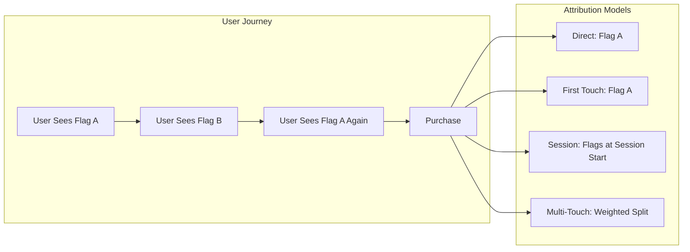
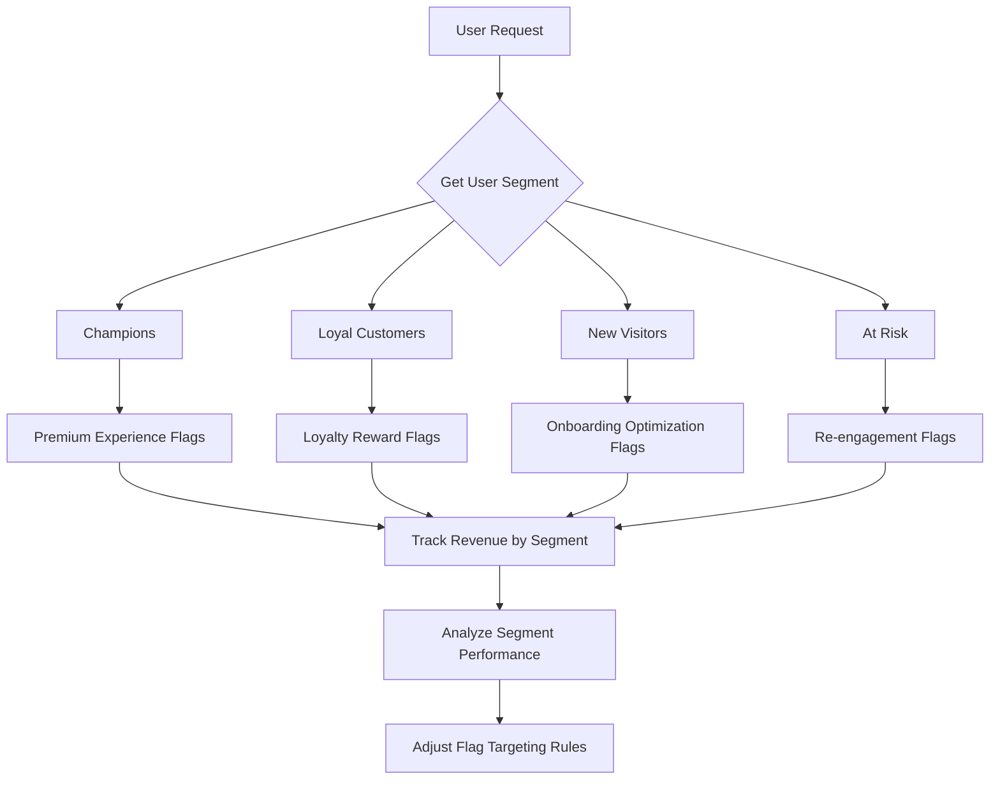
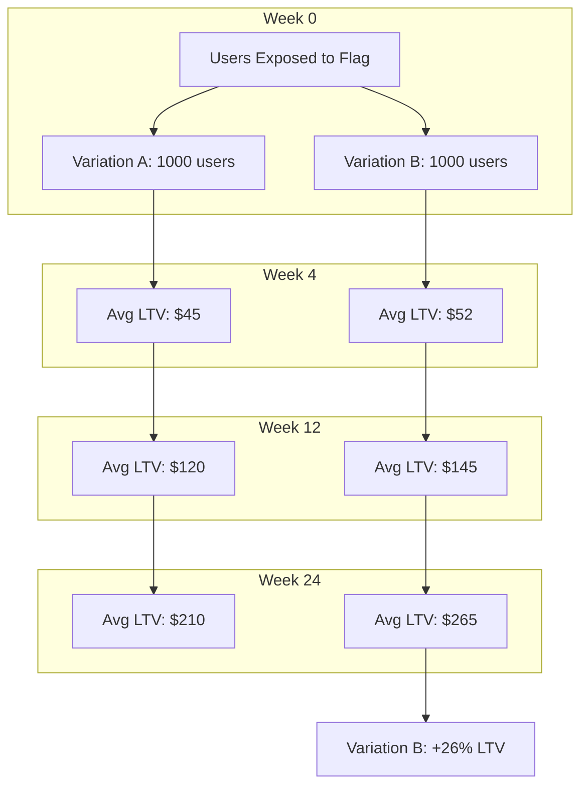
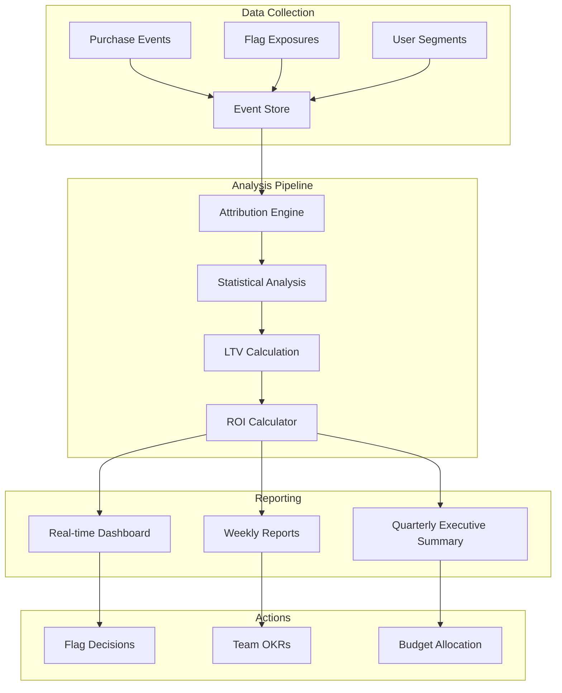

# How to Implement Flag Revenue Impact

Author: [nawazdhandala](https://github.com/nawazdhandala)

Tags: Feature Flags, Revenue, Analytics, Business Metrics

Description: Learn how to measure and analyze revenue impact of feature flags.

---

Feature flags are powerful for controlling rollouts and running experiments, but their true value emerges when you can measure their impact on revenue. This guide covers practical techniques for attributing revenue to feature flags, from basic purchase tracking to advanced lifetime value analysis.

## Why Measure Revenue Impact

Feature flags without revenue measurement are like A/B tests without results. You know something changed, but you cannot quantify whether the change was worth it. Revenue impact measurement answers critical questions:

- Did the new checkout flow increase conversions?
- Is the premium feature upsell effective?
- Which flag variations drive the highest customer lifetime value?
- What is the ROI of your experimentation program?

---

## Revenue Attribution Methods

Revenue attribution connects purchases to the feature flag state a user experienced. There are several approaches, each with trade-offs.

### Direct Attribution

The simplest method: record the flag state at the time of purchase.

```javascript
// Track purchase with flag context
async function trackPurchase(userId, order, flagService) {
  // Get current flag states for this user
  const flagStates = await flagService.getAllFlags(userId);

  const purchaseEvent = {
    eventType: 'purchase',
    userId,
    orderId: order.id,
    revenue: order.total,
    currency: order.currency,
    timestamp: new Date().toISOString(),

    // Capture flag states at purchase time
    flags: {
      checkoutRedesign: flagStates.get('checkout-redesign'),
      expressCheckout: flagStates.get('express-checkout'),
      upsellModule: flagStates.get('upsell-module'),
    },

    // Additional context for analysis
    metadata: {
      itemCount: order.items.length,
      paymentMethod: order.paymentMethod,
      deviceType: order.deviceType,
    },
  };

  await analyticsService.track(purchaseEvent);
}
```

### Session-Based Attribution

For longer purchase journeys, track the flag state when the user first entered the session.

```javascript
class SessionFlagTracker {
  constructor(flagService, sessionStore) {
    this.flagService = flagService;
    this.sessionStore = sessionStore;
  }

  async initializeSession(userId, sessionId) {
    // Capture flag states at session start
    const flagStates = await this.flagService.getAllFlags(userId);

    const sessionData = {
      sessionId,
      userId,
      startTime: Date.now(),
      initialFlags: Object.fromEntries(flagStates),
    };

    await this.sessionStore.set(sessionId, sessionData);
    return sessionData;
  }

  async trackPurchaseWithSession(sessionId, order) {
    const session = await this.sessionStore.get(sessionId);

    if (!session) {
      throw new Error('Session not found');
    }

    return {
      eventType: 'purchase',
      userId: session.userId,
      sessionId,
      revenue: order.total,

      // Use flags from session start for attribution
      attributedFlags: session.initialFlags,

      // Also capture current flags for comparison
      currentFlags: await this.flagService.getAllFlags(session.userId),

      // Time from session start to purchase
      timeToConversion: Date.now() - session.startTime,
    };
  }
}
```

### First-Touch Attribution

Attribute revenue to the flag state when the user first encountered a feature.

```javascript
class FirstTouchAttributor {
  constructor(flagService, storage) {
    this.flagService = flagService;
    this.storage = storage;
  }

  async recordFirstTouch(userId, flagKey, variation) {
    const key = `first-touch:${userId}:${flagKey}`;
    const existing = await this.storage.get(key);

    // Only record if this is truly the first touch
    if (!existing) {
      await this.storage.set(key, {
        variation,
        timestamp: Date.now(),
      });
    }

    return existing || { variation, timestamp: Date.now() };
  }

  async getFirstTouchVariations(userId, flagKeys) {
    const result = {};

    for (const flagKey of flagKeys) {
      const key = `first-touch:${userId}:${flagKey}`;
      const touch = await this.storage.get(key);

      if (touch) {
        result[flagKey] = touch.variation;
      }
    }

    return result;
  }

  async attributePurchase(userId, order, flagKeys) {
    const firstTouchVariations = await this.getFirstTouchVariations(userId, flagKeys);
    const currentVariations = {};

    for (const flagKey of flagKeys) {
      currentVariations[flagKey] = await this.flagService.getFlag(userId, flagKey);
    }

    return {
      eventType: 'purchase',
      userId,
      revenue: order.total,
      firstTouchAttribution: firstTouchVariations,
      lastTouchAttribution: currentVariations,
    };
  }
}
```

### Attribution Model Comparison



---

## Purchase Event Tracking

A robust purchase tracking system is the foundation of revenue impact analysis.

### Event Schema

```typescript
interface PurchaseEvent {
  // Core identifiers
  eventId: string;
  userId: string;
  anonymousId?: string;
  sessionId: string;

  // Revenue data
  revenue: number;
  currency: string;
  orderId: string;

  // Flag context
  flags: Record<string, {
    variation: string;
    evaluationTimestamp: number;
  }>;

  // Segmentation data
  userSegment?: string;
  cohort?: string;
  acquisitionChannel?: string;

  // Timing
  timestamp: string;
  serverTimestamp: string;

  // Additional context
  metadata: Record<string, unknown>;
}
```

### Implementation

```javascript
class PurchaseTracker {
  constructor(analyticsClient, flagService) {
    this.analytics = analyticsClient;
    this.flagService = flagService;
  }

  async trackPurchase(userId, order, context = {}) {
    // Gather all flag evaluations with timing
    const flagEvaluations = await this.gatherFlagContext(userId);

    const event = {
      eventId: crypto.randomUUID(),
      userId,
      sessionId: context.sessionId,

      revenue: this.normalizeRevenue(order.total, order.currency),
      currency: order.currency,
      orderId: order.id,

      flags: flagEvaluations,

      userSegment: await this.getUserSegment(userId),
      cohort: await this.getUserCohort(userId),
      acquisitionChannel: context.acquisitionChannel,

      timestamp: new Date().toISOString(),
      serverTimestamp: new Date().toISOString(),

      metadata: {
        items: order.items.map(item => ({
          sku: item.sku,
          quantity: item.quantity,
          price: item.price,
        })),
        paymentMethod: order.paymentMethod,
        isFirstPurchase: await this.isFirstPurchase(userId),
        deviceType: context.deviceType,
        browser: context.browser,
      },
    };

    // Send to analytics platform
    await this.analytics.track('purchase', event);

    // Also send to flag-specific revenue tracking
    await this.trackFlagRevenue(event);

    return event;
  }

  async gatherFlagContext(userId) {
    const relevantFlags = [
      'checkout-redesign',
      'express-checkout',
      'upsell-module',
      'pricing-tier',
      'discount-strategy',
    ];

    const evaluations = {};

    for (const flagKey of relevantFlags) {
      const startTime = Date.now();
      const variation = await this.flagService.getFlag(userId, flagKey);

      evaluations[flagKey] = {
        variation,
        evaluationTimestamp: startTime,
      };
    }

    return evaluations;
  }

  normalizeRevenue(amount, currency) {
    // Convert to cents/smallest unit to avoid floating point issues
    return Math.round(amount * 100);
  }

  async trackFlagRevenue(event) {
    // Aggregate revenue by flag variation for real-time dashboards
    for (const [flagKey, evaluation] of Object.entries(event.flags)) {
      await this.analytics.increment(`flag_revenue:${flagKey}:${evaluation.variation}`, event.revenue);
      await this.analytics.increment(`flag_purchases:${flagKey}:${evaluation.variation}`, 1);
    }
  }
}
```

### Handling Refunds

```javascript
async function trackRefund(userId, originalOrderId, refundAmount, reason) {
  // Fetch original purchase event
  const originalPurchase = await analyticsService.getEvent('purchase', originalOrderId);

  if (!originalPurchase) {
    console.warn(`Original purchase not found: ${originalOrderId}`);
    return;
  }

  const refundEvent = {
    eventType: 'refund',
    userId,
    originalOrderId,
    refundAmount: Math.round(refundAmount * 100),
    reason,
    timestamp: new Date().toISOString(),

    // Inherit flag context from original purchase
    flags: originalPurchase.flags,

    // Calculate net impact
    netRevenue: originalPurchase.revenue - Math.round(refundAmount * 100),
  };

  await analyticsService.track('refund', refundEvent);

  // Update flag revenue totals
  for (const [flagKey, evaluation] of Object.entries(refundEvent.flags)) {
    await analyticsService.decrement(
      `flag_revenue:${flagKey}:${evaluation.variation}`,
      Math.round(refundAmount * 100)
    );
  }
}
```

---

## Revenue Per User Segment

Analyzing revenue by user segment reveals which segments respond best to different flag variations.

### Segment Definition

```javascript
class UserSegmenter {
  constructor(userService, purchaseHistory) {
    this.userService = userService;
    this.purchaseHistory = purchaseHistory;
  }

  async getSegment(userId) {
    const user = await this.userService.getUser(userId);
    const history = await this.purchaseHistory.getHistory(userId);

    // Calculate engagement score
    const engagementScore = this.calculateEngagement(user, history);

    // Calculate monetary value
    const totalSpent = history.reduce((sum, p) => sum + p.revenue, 0);
    const avgOrderValue = totalSpent / (history.length || 1);

    // Segment by value and engagement
    if (totalSpent > 100000 && engagementScore > 80) {
      return 'champions';
    } else if (totalSpent > 50000) {
      return 'loyal_customers';
    } else if (avgOrderValue > 10000 && history.length < 3) {
      return 'potential_loyalists';
    } else if (history.length === 0) {
      return 'new_visitors';
    } else if (this.daysSinceLastPurchase(history) > 90) {
      return 'at_risk';
    } else {
      return 'regular';
    }
  }

  calculateEngagement(user, history) {
    const recency = this.daysSinceLastPurchase(history);
    const frequency = history.length;
    const loginFrequency = user.loginCount / this.daysSinceSignup(user);

    // RFM-inspired scoring
    let score = 0;
    score += recency < 30 ? 40 : recency < 60 ? 25 : recency < 90 ? 10 : 0;
    score += Math.min(frequency * 5, 30);
    score += Math.min(loginFrequency * 100, 30);

    return score;
  }

  daysSinceLastPurchase(history) {
    if (history.length === 0) return Infinity;
    const lastPurchase = Math.max(...history.map(p => new Date(p.timestamp).getTime()));
    return (Date.now() - lastPurchase) / (1000 * 60 * 60 * 24);
  }

  daysSinceSignup(user) {
    return (Date.now() - new Date(user.createdAt).getTime()) / (1000 * 60 * 60 * 24);
  }
}
```

### Segment Revenue Analysis

```javascript
class SegmentRevenueAnalyzer {
  constructor(analyticsClient) {
    this.analytics = analyticsClient;
  }

  async analyzeBySegment(flagKey, startDate, endDate) {
    const purchases = await this.analytics.query({
      eventType: 'purchase',
      dateRange: { start: startDate, end: endDate },
      groupBy: ['flags.' + flagKey + '.variation', 'userSegment'],
      metrics: ['sum(revenue)', 'count(*)', 'avg(revenue)'],
    });

    // Transform into segment-variation matrix
    const matrix = {};

    for (const row of purchases) {
      const segment = row.userSegment;
      const variation = row[`flags.${flagKey}.variation`];

      if (!matrix[segment]) {
        matrix[segment] = {};
      }

      matrix[segment][variation] = {
        totalRevenue: row['sum(revenue)'],
        purchaseCount: row['count(*)'],
        avgOrderValue: row['avg(revenue)'],
        revenuePerUser: row['sum(revenue)'] / await this.getUniqueUsers(segment, variation),
      };
    }

    return matrix;
  }

  generateSegmentReport(matrix, variations) {
    const report = {
      segments: {},
      recommendations: [],
    };

    for (const [segment, data] of Object.entries(matrix)) {
      // Find winning variation for this segment
      let winner = null;
      let highestRPU = 0;

      for (const variation of variations) {
        if (data[variation] && data[variation].revenuePerUser > highestRPU) {
          highestRPU = data[variation].revenuePerUser;
          winner = variation;
        }
      }

      report.segments[segment] = {
        data,
        recommendedVariation: winner,
        uplift: this.calculateUplift(data, winner, 'control'),
      };
    }

    return report;
  }

  calculateUplift(data, treatment, control) {
    if (!data[treatment] || !data[control]) return null;

    const treatmentRPU = data[treatment].revenuePerUser;
    const controlRPU = data[control].revenuePerUser;

    return ((treatmentRPU - controlRPU) / controlRPU) * 100;
  }
}
```

### Segment-Aware Flag Targeting



---

## Lifetime Value Analysis

Lifetime Value (LTV) analysis connects flag exposure to long-term revenue, not just immediate purchases.

### LTV Calculation

```javascript
class LTVCalculator {
  constructor(purchaseHistory, userService) {
    this.purchaseHistory = purchaseHistory;
    this.userService = userService;
  }

  async calculateLTV(userId, projectionMonths = 12) {
    const history = await this.purchaseHistory.getHistory(userId);
    const user = await this.userService.getUser(userId);

    if (history.length === 0) {
      return { historical: 0, projected: 0 };
    }

    const historicalLTV = history.reduce((sum, p) => sum + p.revenue, 0);

    // Calculate metrics for projection
    const customerAge = this.monthsSinceSignup(user);
    const purchaseFrequency = history.length / Math.max(customerAge, 1);
    const avgOrderValue = historicalLTV / history.length;
    const churnProbability = this.estimateChurnProbability(user, history);

    // Project future value
    let projectedValue = 0;
    let survivalProbability = 1 - churnProbability;

    for (let month = 1; month <= projectionMonths; month++) {
      const monthlyValue = purchaseFrequency * avgOrderValue * survivalProbability;
      projectedValue += monthlyValue;
      survivalProbability *= (1 - churnProbability); // Compound churn
    }

    return {
      historical: historicalLTV,
      projected: projectedValue,
      total: historicalLTV + projectedValue,
      metrics: {
        customerAge,
        purchaseFrequency,
        avgOrderValue,
        churnProbability,
      },
    };
  }

  monthsSinceSignup(user) {
    const days = (Date.now() - new Date(user.createdAt).getTime()) / (1000 * 60 * 60 * 24);
    return days / 30;
  }

  estimateChurnProbability(user, history) {
    // Simple churn model based on recency
    const daysSinceLast = history.length > 0
      ? (Date.now() - new Date(history[history.length - 1].timestamp).getTime()) / (1000 * 60 * 60 * 24)
      : Infinity;

    // Higher probability of churn as time since last purchase increases
    if (daysSinceLast > 180) return 0.8;
    if (daysSinceLast > 90) return 0.5;
    if (daysSinceLast > 30) return 0.2;
    return 0.1;
  }
}
```

### Flag Impact on LTV

```javascript
class FlagLTVAnalyzer {
  constructor(ltvCalculator, flagExposureStore, analyticsClient) {
    this.ltvCalculator = ltvCalculator;
    this.flagExposureStore = flagExposureStore;
    this.analytics = analyticsClient;
  }

  async analyzeFlagLTVImpact(flagKey, cohortDate) {
    // Get users exposed to each variation around the cohort date
    const exposures = await this.flagExposureStore.getExposures(flagKey, cohortDate);

    const variationLTVs = {};

    for (const [variation, userIds] of Object.entries(exposures)) {
      const ltvs = await Promise.all(
        userIds.map(userId => this.ltvCalculator.calculateLTV(userId))
      );

      variationLTVs[variation] = {
        userCount: userIds.length,
        avgLTV: ltvs.reduce((sum, ltv) => sum + ltv.total, 0) / ltvs.length,
        medianLTV: this.median(ltvs.map(l => l.total)),
        ltvDistribution: this.calculateDistribution(ltvs.map(l => l.total)),
      };
    }

    return this.compareVariations(variationLTVs);
  }

  compareVariations(variationLTVs) {
    const variations = Object.keys(variationLTVs);
    const control = variationLTVs['control'] || variationLTVs[variations[0]];

    const comparisons = {};

    for (const [variation, data] of Object.entries(variationLTVs)) {
      if (variation === 'control') continue;

      const ltvLift = ((data.avgLTV - control.avgLTV) / control.avgLTV) * 100;

      comparisons[variation] = {
        ...data,
        vsControl: {
          absoluteDifference: data.avgLTV - control.avgLTV,
          percentageLift: ltvLift,
          projectedAnnualImpact: (data.avgLTV - control.avgLTV) * data.userCount,
        },
      };
    }

    return {
      control,
      treatments: comparisons,
      recommendation: this.generateRecommendation(comparisons),
    };
  }

  median(values) {
    const sorted = [...values].sort((a, b) => a - b);
    const mid = Math.floor(sorted.length / 2);
    return sorted.length % 2 ? sorted[mid] : (sorted[mid - 1] + sorted[mid]) / 2;
  }

  calculateDistribution(values) {
    const sorted = [...values].sort((a, b) => a - b);
    return {
      p10: sorted[Math.floor(sorted.length * 0.1)],
      p25: sorted[Math.floor(sorted.length * 0.25)],
      p50: sorted[Math.floor(sorted.length * 0.5)],
      p75: sorted[Math.floor(sorted.length * 0.75)],
      p90: sorted[Math.floor(sorted.length * 0.9)],
    };
  }

  generateRecommendation(comparisons) {
    let bestVariation = 'control';
    let bestLift = 0;

    for (const [variation, data] of Object.entries(comparisons)) {
      if (data.vsControl.percentageLift > bestLift) {
        bestLift = data.vsControl.percentageLift;
        bestVariation = variation;
      }
    }

    return {
      recommendedVariation: bestVariation,
      expectedLiftPercent: bestLift,
      confidence: this.assessConfidence(comparisons[bestVariation]),
    };
  }

  assessConfidence(data) {
    // Simple confidence based on sample size
    if (data.userCount < 100) return 'low';
    if (data.userCount < 1000) return 'medium';
    return 'high';
  }
}
```

### LTV Cohort Tracking



---

## Statistical Significance for Revenue

Revenue data requires careful statistical treatment because of its typically skewed distribution.

### Basic Statistical Test

```javascript
class RevenueStatistics {
  // Welch's t-test for revenue comparison
  welchTTest(control, treatment) {
    const n1 = control.length;
    const n2 = treatment.length;

    const mean1 = this.mean(control);
    const mean2 = this.mean(treatment);

    const var1 = this.variance(control);
    const var2 = this.variance(treatment);

    const se = Math.sqrt(var1 / n1 + var2 / n2);
    const t = (mean2 - mean1) / se;

    // Welch-Satterthwaite degrees of freedom
    const df = Math.pow(var1 / n1 + var2 / n2, 2) / (
      Math.pow(var1 / n1, 2) / (n1 - 1) +
      Math.pow(var2 / n2, 2) / (n2 - 1)
    );

    const pValue = this.tDistributionPValue(Math.abs(t), df);

    return {
      controlMean: mean1,
      treatmentMean: mean2,
      difference: mean2 - mean1,
      percentChange: ((mean2 - mean1) / mean1) * 100,
      tStatistic: t,
      degreesOfFreedom: df,
      pValue,
      isSignificant: pValue < 0.05,
    };
  }

  mean(values) {
    return values.reduce((a, b) => a + b, 0) / values.length;
  }

  variance(values) {
    const m = this.mean(values);
    return values.reduce((sum, v) => sum + Math.pow(v - m, 2), 0) / (values.length - 1);
  }

  tDistributionPValue(t, df) {
    // Approximation for two-tailed p-value
    const x = df / (df + t * t);
    return this.incompleteBeta(df / 2, 0.5, x);
  }

  incompleteBeta(a, b, x) {
    // Simplified approximation
    if (x === 0) return 0;
    if (x === 1) return 1;

    // Use continued fraction approximation
    const bt = Math.exp(
      this.logGamma(a + b) - this.logGamma(a) - this.logGamma(b) +
      a * Math.log(x) + b * Math.log(1 - x)
    );

    return bt * this.betaCF(a, b, x) / a;
  }

  logGamma(x) {
    const c = [76.18009172947146, -86.50532032941677, 24.01409824083091,
      -1.231739572450155, 0.001208650973866179, -0.000005395239384953];

    let y = x;
    let tmp = x + 5.5;
    tmp -= (x + 0.5) * Math.log(tmp);
    let ser = 1.000000000190015;

    for (let j = 0; j < 6; j++) {
      ser += c[j] / ++y;
    }

    return -tmp + Math.log(2.5066282746310005 * ser / x);
  }

  betaCF(a, b, x) {
    const maxIterations = 100;
    const epsilon = 3e-7;

    let qab = a + b;
    let qap = a + 1;
    let qam = a - 1;
    let c = 1;
    let d = 1 - qab * x / qap;

    if (Math.abs(d) < 1e-30) d = 1e-30;
    d = 1 / d;
    let h = d;

    for (let m = 1; m <= maxIterations; m++) {
      let m2 = 2 * m;
      let aa = m * (b - m) * x / ((qam + m2) * (a + m2));
      d = 1 + aa * d;
      if (Math.abs(d) < 1e-30) d = 1e-30;
      c = 1 + aa / c;
      if (Math.abs(c) < 1e-30) c = 1e-30;
      d = 1 / d;
      h *= d * c;

      aa = -(a + m) * (qab + m) * x / ((a + m2) * (qap + m2));
      d = 1 + aa * d;
      if (Math.abs(d) < 1e-30) d = 1e-30;
      c = 1 + aa / c;
      if (Math.abs(c) < 1e-30) c = 1e-30;
      d = 1 / d;
      let del = d * c;
      h *= del;

      if (Math.abs(del - 1) < epsilon) break;
    }

    return h;
  }
}
```

### Bootstrap Confidence Intervals

For skewed revenue distributions, bootstrap methods provide more reliable confidence intervals.

```javascript
class BootstrapAnalyzer {
  constructor(iterations = 10000) {
    this.iterations = iterations;
  }

  calculateConfidenceInterval(control, treatment, confidenceLevel = 0.95) {
    const differences = [];

    for (let i = 0; i < this.iterations; i++) {
      const controlSample = this.resample(control);
      const treatmentSample = this.resample(treatment);

      const controlMean = this.mean(controlSample);
      const treatmentMean = this.mean(treatmentSample);

      differences.push(treatmentMean - controlMean);
    }

    differences.sort((a, b) => a - b);

    const alpha = 1 - confidenceLevel;
    const lowerIndex = Math.floor((alpha / 2) * this.iterations);
    const upperIndex = Math.floor((1 - alpha / 2) * this.iterations);

    const observedDiff = this.mean(treatment) - this.mean(control);

    return {
      observedDifference: observedDiff,
      confidenceInterval: {
        lower: differences[lowerIndex],
        upper: differences[upperIndex],
      },
      confidenceLevel,
      isSignificant: differences[lowerIndex] > 0 || differences[upperIndex] < 0,
      percentChange: (observedDiff / this.mean(control)) * 100,
    };
  }

  resample(arr) {
    const result = [];
    for (let i = 0; i < arr.length; i++) {
      result.push(arr[Math.floor(Math.random() * arr.length)]);
    }
    return result;
  }

  mean(values) {
    return values.reduce((a, b) => a + b, 0) / values.length;
  }
}
```

### Complete Revenue Significance Analysis

```javascript
class RevenueSignificanceAnalyzer {
  constructor() {
    this.stats = new RevenueStatistics();
    this.bootstrap = new BootstrapAnalyzer();
  }

  async analyzeExperiment(flagKey, startDate, endDate) {
    // Fetch revenue data grouped by variation
    const revenueData = await this.fetchRevenueByVariation(flagKey, startDate, endDate);

    const control = revenueData['control'];
    const results = {
      flagKey,
      dateRange: { start: startDate, end: endDate },
      control: this.summarize(control),
      treatments: {},
    };

    for (const [variation, revenues] of Object.entries(revenueData)) {
      if (variation === 'control') continue;

      // Run multiple statistical tests
      const tTest = this.stats.welchTTest(control, revenues);
      const bootstrap = this.bootstrap.calculateConfidenceInterval(control, revenues);

      results.treatments[variation] = {
        summary: this.summarize(revenues),
        tTest,
        bootstrap,
        recommendation: this.makeRecommendation(tTest, bootstrap),
      };
    }

    return results;
  }

  summarize(revenues) {
    const sorted = [...revenues].sort((a, b) => a - b);

    return {
      count: revenues.length,
      total: revenues.reduce((a, b) => a + b, 0),
      mean: this.stats.mean(revenues),
      median: sorted[Math.floor(sorted.length / 2)],
      stdDev: Math.sqrt(this.stats.variance(revenues)),
      percentiles: {
        p25: sorted[Math.floor(sorted.length * 0.25)],
        p75: sorted[Math.floor(sorted.length * 0.75)],
        p95: sorted[Math.floor(sorted.length * 0.95)],
      },
    };
  }

  makeRecommendation(tTest, bootstrap) {
    const isStatSig = tTest.isSignificant && bootstrap.isSignificant;
    const isPositive = tTest.difference > 0;

    if (!isStatSig) {
      return {
        action: 'continue',
        reason: 'Results not statistically significant yet',
        confidence: 'low',
      };
    }

    if (isPositive) {
      return {
        action: 'ship',
        reason: `Treatment shows ${tTest.percentChange.toFixed(1)}% revenue increase`,
        confidence: 'high',
      };
    }

    return {
      action: 'rollback',
      reason: `Treatment shows ${Math.abs(tTest.percentChange).toFixed(1)}% revenue decrease`,
      confidence: 'high',
    };
  }
}
```

### Sample Size Calculator

```javascript
function calculateRequiredSampleSize(
  baselineConversionRate,
  minimumDetectableEffect,
  statisticalPower = 0.8,
  significanceLevel = 0.05
) {
  // Z-scores for common values
  const zAlpha = 1.96;  // 95% confidence (two-tailed)
  const zBeta = 0.84;   // 80% power

  const p1 = baselineConversionRate;
  const p2 = baselineConversionRate * (1 + minimumDetectableEffect);
  const pBar = (p1 + p2) / 2;

  const numerator = Math.pow(zAlpha * Math.sqrt(2 * pBar * (1 - pBar)) +
    zBeta * Math.sqrt(p1 * (1 - p1) + p2 * (1 - p2)), 2);
  const denominator = Math.pow(p2 - p1, 2);

  const samplePerVariation = Math.ceil(numerator / denominator);

  return {
    perVariation: samplePerVariation,
    total: samplePerVariation * 2,
    assumptions: {
      baselineConversionRate,
      minimumDetectableEffect,
      statisticalPower,
      significanceLevel,
    },
  };
}

// Example usage
const sampleSize = calculateRequiredSampleSize(
  0.03,   // 3% baseline conversion rate
  0.10,   // 10% minimum detectable effect
);
// Output: { perVariation: 14751, total: 29502, ... }
```

---

## ROI Reporting

ROI reporting ties everything together, showing the business impact of your feature flag program.

### ROI Calculator

```javascript
class FlagROICalculator {
  constructor(revenueAnalyzer, costTracker) {
    this.revenueAnalyzer = revenueAnalyzer;
    this.costTracker = costTracker;
  }

  async calculateFlagROI(flagKey, startDate, endDate) {
    // Get revenue impact
    const revenueAnalysis = await this.revenueAnalyzer.analyzeExperiment(
      flagKey,
      startDate,
      endDate
    );

    // Find winning variation
    const winningVariation = this.findWinner(revenueAnalysis);

    if (!winningVariation) {
      return {
        flagKey,
        status: 'no_significant_winner',
        roi: null,
      };
    }

    const treatmentData = revenueAnalysis.treatments[winningVariation];
    const controlData = revenueAnalysis.control;

    // Calculate incremental revenue
    const incrementalRevenue = (treatmentData.summary.mean - controlData.mean) *
      treatmentData.summary.count;

    // Get costs
    const costs = await this.costTracker.getCosts(flagKey, startDate, endDate);

    // Calculate ROI
    const totalInvestment = costs.development + costs.infrastructure + costs.opportunity;
    const roi = ((incrementalRevenue - totalInvestment) / totalInvestment) * 100;

    return {
      flagKey,
      dateRange: { start: startDate, end: endDate },
      winningVariation,
      metrics: {
        incrementalRevenue,
        totalInvestment,
        roi,
        paybackPeriodDays: this.calculatePaybackPeriod(incrementalRevenue, totalInvestment, startDate, endDate),
      },
      breakdown: {
        revenue: {
          controlRevenue: controlData.total,
          treatmentRevenue: treatmentData.summary.total,
          incremental: incrementalRevenue,
        },
        costs,
        statistics: {
          percentLift: treatmentData.tTest.percentChange,
          pValue: treatmentData.tTest.pValue,
          confidenceInterval: treatmentData.bootstrap.confidenceInterval,
        },
      },
    };
  }

  findWinner(analysis) {
    for (const [variation, data] of Object.entries(analysis.treatments)) {
      if (data.recommendation.action === 'ship') {
        return variation;
      }
    }
    return null;
  }

  calculatePaybackPeriod(incrementalRevenue, investment, startDate, endDate) {
    const days = (new Date(endDate) - new Date(startDate)) / (1000 * 60 * 60 * 24);
    const dailyRevenue = incrementalRevenue / days;
    return Math.ceil(investment / dailyRevenue);
  }
}
```

### Dashboard Report Generation

```javascript
class ROIReportGenerator {
  constructor(roiCalculator, flagService) {
    this.roiCalculator = roiCalculator;
    this.flagService = flagService;
  }

  async generateQuarterlyReport(quarter, year) {
    const { startDate, endDate } = this.getQuarterDates(quarter, year);

    // Get all flags that were active during the quarter
    const flags = await this.flagService.getFlagsActiveInPeriod(startDate, endDate);

    const report = {
      period: { quarter, year, startDate, endDate },
      summary: {
        totalFlags: flags.length,
        flagsWithPositiveROI: 0,
        flagsWithNegativeROI: 0,
        flagsInconclusive: 0,
        totalIncrementalRevenue: 0,
        totalInvestment: 0,
        overallROI: 0,
      },
      flags: [],
    };

    for (const flag of flags) {
      const roi = await this.roiCalculator.calculateFlagROI(
        flag.key,
        startDate,
        endDate
      );

      report.flags.push(roi);

      if (roi.status === 'no_significant_winner') {
        report.summary.flagsInconclusive++;
      } else if (roi.metrics.roi > 0) {
        report.summary.flagsWithPositiveROI++;
        report.summary.totalIncrementalRevenue += roi.metrics.incrementalRevenue;
        report.summary.totalInvestment += roi.metrics.totalInvestment;
      } else {
        report.summary.flagsWithNegativeROI++;
        report.summary.totalIncrementalRevenue += roi.metrics.incrementalRevenue;
        report.summary.totalInvestment += roi.metrics.totalInvestment;
      }
    }

    // Calculate overall ROI
    if (report.summary.totalInvestment > 0) {
      report.summary.overallROI = (
        (report.summary.totalIncrementalRevenue - report.summary.totalInvestment) /
        report.summary.totalInvestment
      ) * 100;
    }

    // Sort flags by ROI
    report.flags.sort((a, b) => {
      const roiA = a.metrics?.roi ?? -Infinity;
      const roiB = b.metrics?.roi ?? -Infinity;
      return roiB - roiA;
    });

    return report;
  }

  getQuarterDates(quarter, year) {
    const quarters = {
      Q1: { start: '01-01', end: '03-31' },
      Q2: { start: '04-01', end: '06-30' },
      Q3: { start: '07-01', end: '09-30' },
      Q4: { start: '10-01', end: '12-31' },
    };

    return {
      startDate: `${year}-${quarters[quarter].start}`,
      endDate: `${year}-${quarters[quarter].end}`,
    };
  }

  formatForExecutives(report) {
    return {
      headline: `Feature Flag Program ROI: ${report.summary.overallROI.toFixed(0)}%`,
      keyMetrics: [
        {
          label: 'Incremental Revenue',
          value: this.formatCurrency(report.summary.totalIncrementalRevenue),
        },
        {
          label: 'Total Investment',
          value: this.formatCurrency(report.summary.totalInvestment),
        },
        {
          label: 'Net Impact',
          value: this.formatCurrency(
            report.summary.totalIncrementalRevenue - report.summary.totalInvestment
          ),
        },
      ],
      topPerformers: report.flags
        .filter(f => f.metrics?.roi > 0)
        .slice(0, 5)
        .map(f => ({
          flag: f.flagKey,
          roi: `${f.metrics.roi.toFixed(0)}%`,
          revenue: this.formatCurrency(f.metrics.incrementalRevenue),
        })),
      recommendations: this.generateRecommendations(report),
    };
  }

  formatCurrency(cents) {
    return new Intl.NumberFormat('en-US', {
      style: 'currency',
      currency: 'USD',
    }).format(cents / 100);
  }

  generateRecommendations(report) {
    const recommendations = [];

    const hitRate = report.summary.flagsWithPositiveROI / report.summary.totalFlags;

    if (hitRate < 0.3) {
      recommendations.push(
        'Consider improving hypothesis quality before launching experiments'
      );
    }

    if (report.summary.flagsInconclusive > report.summary.totalFlags * 0.5) {
      recommendations.push(
        'Many experiments are inconclusive. Review traffic allocation and run times'
      );
    }

    if (report.summary.overallROI > 100) {
      recommendations.push(
        'Strong program performance. Consider increasing experiment velocity'
      );
    }

    return recommendations;
  }
}
```

### Revenue Impact Dashboard



---

## Complete Integration Example

Here is a complete example integrating all components.

```javascript
// revenue-impact-service.js

class RevenueImpactService {
  constructor(config) {
    this.flagService = config.flagService;
    this.analytics = config.analyticsClient;
    this.storage = config.storage;

    // Initialize components
    this.purchaseTracker = new PurchaseTracker(this.analytics, this.flagService);
    this.segmenter = new UserSegmenter(config.userService, config.purchaseHistory);
    this.ltvCalculator = new LTVCalculator(config.purchaseHistory, config.userService);
    this.statsAnalyzer = new RevenueSignificanceAnalyzer();
    this.roiCalculator = new FlagROICalculator(this.statsAnalyzer, config.costTracker);
  }

  // Track a purchase with full flag context
  async trackPurchase(userId, order, context) {
    const segment = await this.segmenter.getSegment(userId);

    return this.purchaseTracker.trackPurchase(userId, order, {
      ...context,
      userSegment: segment,
    });
  }

  // Analyze revenue impact for a specific flag
  async analyzeFlagImpact(flagKey, options = {}) {
    const {
      startDate = this.defaultStartDate(),
      endDate = new Date().toISOString(),
      includeSegments = true,
      includeLTV = true,
    } = options;

    const results = {
      flagKey,
      dateRange: { start: startDate, end: endDate },
    };

    // Core revenue analysis
    results.revenueAnalysis = await this.statsAnalyzer.analyzeExperiment(
      flagKey,
      startDate,
      endDate
    );

    // Segment breakdown
    if (includeSegments) {
      const segmentAnalyzer = new SegmentRevenueAnalyzer(this.analytics);
      results.segmentAnalysis = await segmentAnalyzer.analyzeBySegment(
        flagKey,
        startDate,
        endDate
      );
    }

    // LTV impact
    if (includeLTV) {
      const ltvAnalyzer = new FlagLTVAnalyzer(
        this.ltvCalculator,
        this.storage,
        this.analytics
      );
      results.ltvAnalysis = await ltvAnalyzer.analyzeFlagLTVImpact(
        flagKey,
        startDate
      );
    }

    // ROI calculation
    results.roi = await this.roiCalculator.calculateFlagROI(
      flagKey,
      startDate,
      endDate
    );

    return results;
  }

  // Generate comprehensive report
  async generateReport(options = {}) {
    const reportGenerator = new ROIReportGenerator(
      this.roiCalculator,
      this.flagService
    );

    const { quarter, year } = options;
    const report = await reportGenerator.generateQuarterlyReport(quarter, year);

    return {
      full: report,
      executive: reportGenerator.formatForExecutives(report),
    };
  }

  defaultStartDate() {
    const date = new Date();
    date.setMonth(date.getMonth() - 1);
    return date.toISOString();
  }
}

// Usage
const revenueService = new RevenueImpactService({
  flagService,
  analyticsClient,
  storage,
  userService,
  purchaseHistory,
  costTracker,
});

// Track purchase
await revenueService.trackPurchase(userId, order, {
  sessionId,
  deviceType: 'mobile',
});

// Analyze flag
const impact = await revenueService.analyzeFlagImpact('checkout-redesign', {
  includeSegments: true,
  includeLTV: true,
});

// Generate quarterly report
const report = await revenueService.generateReport({
  quarter: 'Q1',
  year: 2026,
});
```

---

## Summary

| Component | Purpose | Key Metric |
|-----------|---------|------------|
| **Revenue Attribution** | Connect purchases to flag variations | Attribution accuracy |
| **Purchase Tracking** | Capture rich purchase context | Event completeness |
| **Segment Analysis** | Understand variation by user type | Segment-level ROI |
| **LTV Analysis** | Measure long-term value impact | LTV lift percentage |
| **Statistical Testing** | Validate results scientifically | Confidence level |
| **ROI Reporting** | Quantify program value | Overall program ROI |

Measuring revenue impact transforms feature flags from a release management tool into a strategic business driver. With proper attribution, statistical rigor, and clear reporting, you can make data-driven decisions about which features to ship, iterate on, or abandon.

The key is starting simple with direct attribution and basic statistics, then progressively adding sophistication as your program matures. Focus on the metrics that drive decisions in your organization, and ensure every report connects clearly to business outcomes.
