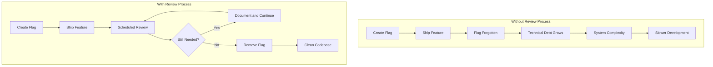
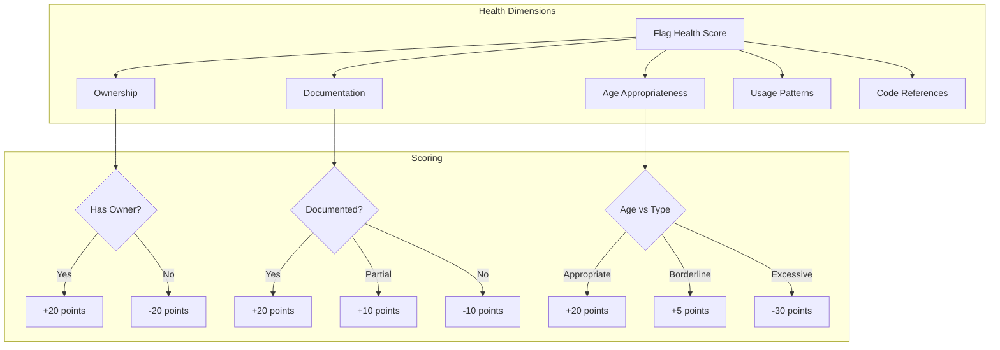
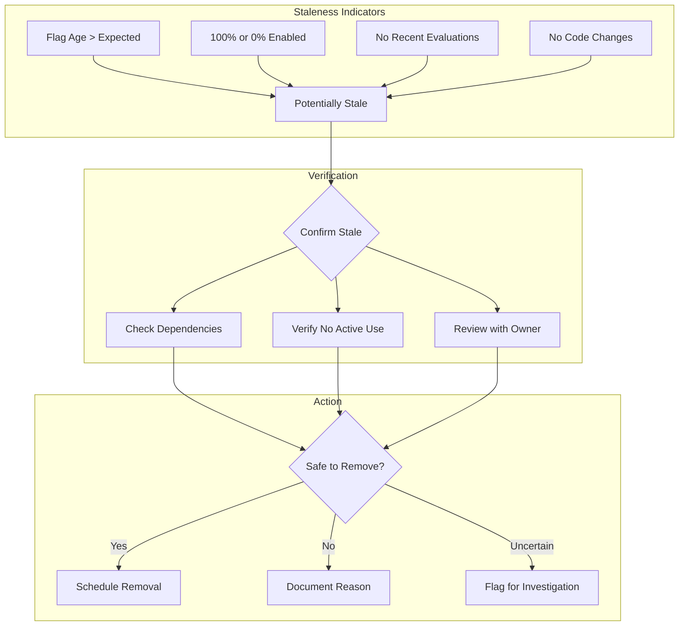
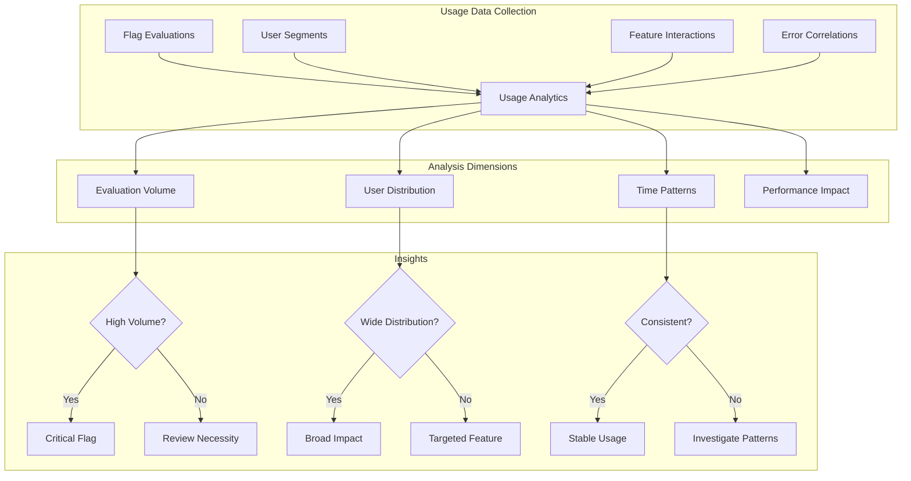
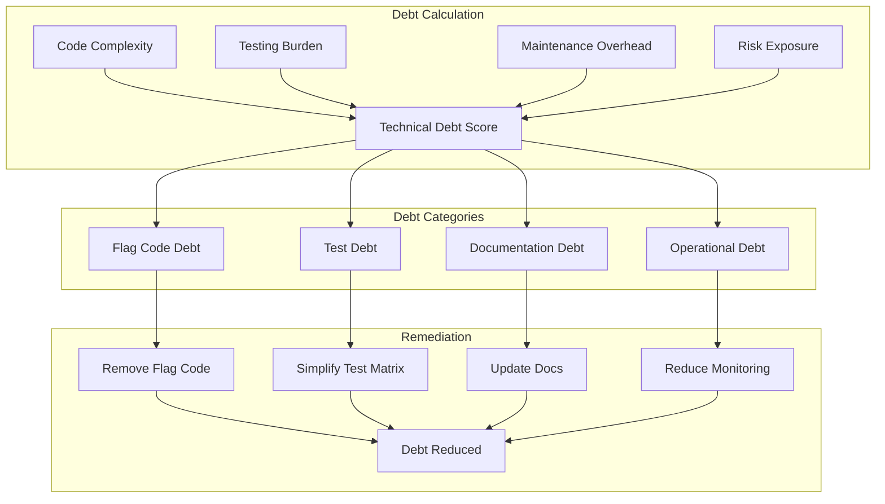
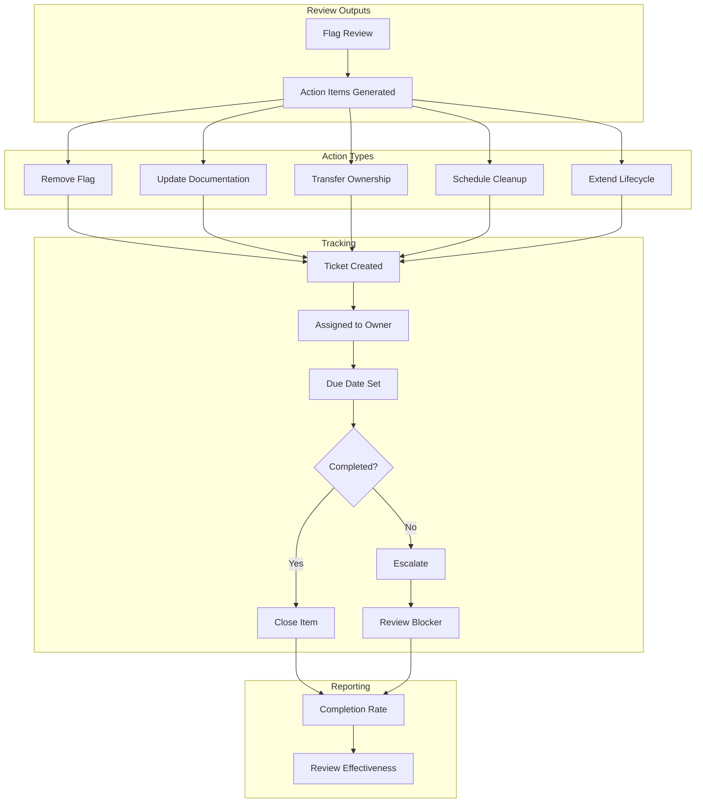
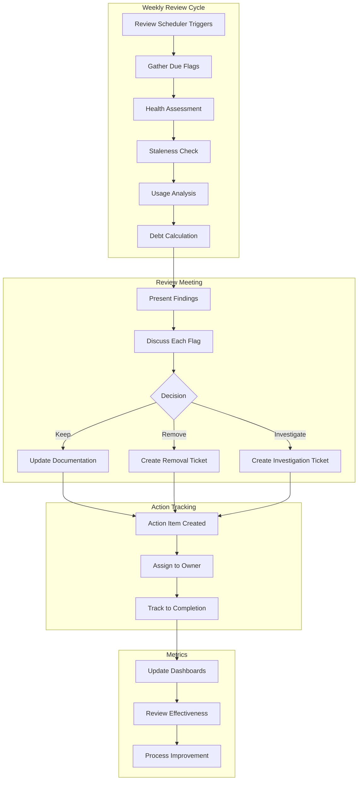

# How to Create Flag Review Processes

Author: [nawazdhandala](https://github.com/nawazdhandala)

Tags: Feature Flags, Review, Governance, Process

Description: Learn how to establish effective review processes for feature flags.

---

Feature flags are powerful tools for controlling software releases, but without proper governance, they can accumulate into technical debt that slows development and introduces risk. A well-designed flag review process ensures that flags serve their intended purpose, get cleaned up when no longer needed, and do not become a hidden liability in your codebase. This guide covers practical approaches to building comprehensive flag review processes.

## Why Flag Review Processes Matter

Feature flags often start as temporary mechanisms for controlling rollouts or running experiments. Without active management, they multiply quietly until teams face thousands of flags, many of which are stale, redundant, or permanently enabled. A structured review process prevents this accumulation and maintains a healthy flag ecosystem.



## Establishing Review Cadence

The foundation of any flag review process is establishing a consistent cadence for reviewing flags. Different flag types warrant different review frequencies based on their intended lifespan and risk profile.

### Review Frequency by Flag Type

| Flag Type | Typical Lifespan | Review Frequency | Primary Concern |
|-----------|------------------|------------------|-----------------|
| Release flags | Days to weeks | Weekly | Remove after rollout complete |
| Experiment flags | Weeks to months | Bi-weekly | Conclude experiment, analyze results |
| Ops flags | Months to permanent | Monthly | Validate still needed |
| Permission flags | Long-term | Quarterly | Audit access patterns |
| Kill switches | Permanent | Bi-annually | Verify still functional |

### Implementation

```python
from dataclasses import dataclass, field
from datetime import datetime, timedelta
from typing import Dict, List, Optional
from enum import Enum
import json

class FlagType(Enum):
    RELEASE = "release"
    EXPERIMENT = "experiment"
    OPS = "ops"
    PERMISSION = "permission"
    KILL_SWITCH = "kill_switch"

class ReviewStatus(Enum):
    PENDING = "pending"
    IN_PROGRESS = "in_progress"
    COMPLETED = "completed"
    OVERDUE = "overdue"

@dataclass
class Flag:
    """Represents a feature flag in the system."""
    id: str
    name: str
    flag_type: FlagType
    created_at: datetime
    created_by: str
    description: str
    owner_team: str
    last_reviewed: Optional[datetime] = None
    next_review: Optional[datetime] = None
    is_enabled: bool = False
    enabled_percentage: float = 0.0
    tags: List[str] = field(default_factory=list)
    metadata: Dict[str, any] = field(default_factory=dict)

@dataclass
class ReviewCycle:
    """Defines a review cycle configuration."""
    flag_type: FlagType
    frequency_days: int
    grace_period_days: int
    auto_escalate: bool = True
    escalation_contacts: List[str] = field(default_factory=list)

class FlagReviewScheduler:
    """Manages review scheduling for feature flags."""

    # Default review frequencies by flag type
    DEFAULT_FREQUENCIES = {
        FlagType.RELEASE: 7,       # Weekly
        FlagType.EXPERIMENT: 14,   # Bi-weekly
        FlagType.OPS: 30,          # Monthly
        FlagType.PERMISSION: 90,   # Quarterly
        FlagType.KILL_SWITCH: 180, # Bi-annually
    }

    GRACE_PERIODS = {
        FlagType.RELEASE: 3,
        FlagType.EXPERIMENT: 7,
        FlagType.OPS: 14,
        FlagType.PERMISSION: 30,
        FlagType.KILL_SWITCH: 30,
    }

    def __init__(self):
        self.flags: Dict[str, Flag] = {}
        self.review_cycles: Dict[FlagType, ReviewCycle] = {}
        self._initialize_default_cycles()

    def _initialize_default_cycles(self):
        """Set up default review cycles for each flag type."""
        for flag_type in FlagType:
            self.review_cycles[flag_type] = ReviewCycle(
                flag_type=flag_type,
                frequency_days=self.DEFAULT_FREQUENCIES[flag_type],
                grace_period_days=self.GRACE_PERIODS[flag_type]
            )

    def register_flag(self, flag: Flag) -> None:
        """Register a new flag and schedule its first review."""
        self.flags[flag.id] = flag

        # Schedule initial review based on flag type
        frequency = self.review_cycles[flag.flag_type].frequency_days
        flag.next_review = flag.created_at + timedelta(days=frequency)

    def get_flags_due_for_review(
        self,
        as_of: datetime = None
    ) -> Dict[str, List[Flag]]:
        """
        Get all flags that are due for review.

        Returns flags grouped by status: due, overdue, upcoming.
        """
        check_date = as_of or datetime.utcnow()

        result = {
            'overdue': [],
            'due': [],
            'upcoming': []  # Due within next 7 days
        }

        for flag in self.flags.values():
            if flag.next_review is None:
                continue

            grace_period = self.review_cycles[flag.flag_type].grace_period_days
            overdue_date = flag.next_review + timedelta(days=grace_period)

            if check_date > overdue_date:
                result['overdue'].append(flag)
            elif check_date >= flag.next_review:
                result['due'].append(flag)
            elif flag.next_review - check_date <= timedelta(days=7):
                result['upcoming'].append(flag)

        # Sort by next review date
        for category in result:
            result[category].sort(key=lambda f: f.next_review)

        return result

    def complete_review(
        self,
        flag_id: str,
        reviewed_by: str,
        notes: str = "",
        action_taken: str = "none"
    ) -> Flag:
        """
        Mark a flag review as complete and schedule next review.

        Args:
            flag_id: ID of the flag being reviewed
            reviewed_by: Who performed the review
            notes: Review notes
            action_taken: Action taken (none, updated, scheduled_removal, removed)
        """
        flag = self.flags.get(flag_id)
        if not flag:
            raise ValueError(f"Flag {flag_id} not found")

        now = datetime.utcnow()
        flag.last_reviewed = now

        # Schedule next review unless flag was removed
        if action_taken != "removed":
            frequency = self.review_cycles[flag.flag_type].frequency_days
            flag.next_review = now + timedelta(days=frequency)

            # Store review history in metadata
            if 'review_history' not in flag.metadata:
                flag.metadata['review_history'] = []

            flag.metadata['review_history'].append({
                'date': now.isoformat(),
                'reviewed_by': reviewed_by,
                'notes': notes,
                'action_taken': action_taken
            })
        else:
            flag.next_review = None

        return flag

    def get_review_calendar(
        self,
        start_date: datetime,
        end_date: datetime
    ) -> Dict[str, List[Flag]]:
        """
        Generate a calendar view of upcoming reviews.

        Useful for planning team capacity around reviews.
        """
        calendar = {}

        current = start_date
        while current <= end_date:
            date_key = current.strftime('%Y-%m-%d')
            calendar[date_key] = []
            current += timedelta(days=1)

        for flag in self.flags.values():
            if flag.next_review and start_date <= flag.next_review <= end_date:
                date_key = flag.next_review.strftime('%Y-%m-%d')
                calendar[date_key].append(flag)

        return calendar

    def generate_review_report(self) -> Dict[str, any]:
        """Generate a summary report of review status."""
        now = datetime.utcnow()
        due_flags = self.get_flags_due_for_review(now)

        # Count by flag type
        type_counts = {ft.value: 0 for ft in FlagType}
        for flag in self.flags.values():
            type_counts[flag.flag_type.value] += 1

        # Calculate review health
        total_flags = len(self.flags)
        overdue_count = len(due_flags['overdue'])
        review_health = (
            (total_flags - overdue_count) / total_flags * 100
            if total_flags > 0 else 100
        )

        return {
            'generated_at': now.isoformat(),
            'total_flags': total_flags,
            'flags_by_type': type_counts,
            'review_status': {
                'overdue': len(due_flags['overdue']),
                'due_now': len(due_flags['due']),
                'upcoming_7_days': len(due_flags['upcoming'])
            },
            'review_health_percent': round(review_health, 1),
            'overdue_flags': [
                {'id': f.id, 'name': f.name, 'next_review': f.next_review.isoformat()}
                for f in due_flags['overdue']
            ]
        }


# Example usage
scheduler = FlagReviewScheduler()

# Register some flags
scheduler.register_flag(Flag(
    id="flag-001",
    name="new_checkout_flow",
    flag_type=FlagType.RELEASE,
    created_at=datetime(2026, 1, 15),
    created_by="alice@example.com",
    description="New checkout experience with streamlined steps",
    owner_team="checkout-team",
    is_enabled=True,
    enabled_percentage=50.0
))

scheduler.register_flag(Flag(
    id="flag-002",
    name="pricing_experiment_q1",
    flag_type=FlagType.EXPERIMENT,
    created_at=datetime(2026, 1, 1),
    created_by="bob@example.com",
    description="Q1 pricing tier experiment",
    owner_team="growth-team",
    is_enabled=True,
    enabled_percentage=10.0
))

scheduler.register_flag(Flag(
    id="flag-003",
    name="emergency_rate_limiter",
    flag_type=FlagType.KILL_SWITCH,
    created_at=datetime(2025, 6, 1),
    created_by="ops@example.com",
    description="Emergency rate limiting for API endpoints",
    owner_team="platform-team",
    is_enabled=False
))

# Check what is due for review
due_flags = scheduler.get_flags_due_for_review(datetime(2026, 1, 30))
print("Flags due for review:")
for category, flags in due_flags.items():
    print(f"  {category}: {len(flags)} flags")
    for flag in flags:
        print(f"    - {flag.name} (due: {flag.next_review})")

# Generate review report
report = scheduler.generate_review_report()
print(f"\nReview Health: {report['review_health_percent']}%")
```

## Flag Health Assessment

Beyond scheduling, a robust review process includes assessing the health of each flag. Healthy flags have clear ownership, appropriate documentation, and reasonable age relative to their type.



### Health Assessment Implementation

```python
from dataclasses import dataclass
from datetime import datetime, timedelta
from typing import Dict, List, Tuple, Optional
from enum import Enum

class HealthLevel(Enum):
    EXCELLENT = "excellent"
    GOOD = "good"
    FAIR = "fair"
    POOR = "poor"
    CRITICAL = "critical"

@dataclass
class HealthDimension:
    """Individual health dimension score."""
    name: str
    score: int  # -50 to +50
    max_score: int
    status: str
    details: str

@dataclass
class FlagHealthReport:
    """Complete health assessment for a flag."""
    flag_id: str
    flag_name: str
    overall_score: int  # 0 to 100
    health_level: HealthLevel
    dimensions: List[HealthDimension]
    recommendations: List[str]
    assessed_at: datetime

class FlagHealthAssessor:
    """Assess the health of feature flags."""

    # Age thresholds by flag type (in days)
    AGE_THRESHOLDS = {
        FlagType.RELEASE: {'healthy': 14, 'warning': 30, 'critical': 60},
        FlagType.EXPERIMENT: {'healthy': 30, 'warning': 60, 'critical': 90},
        FlagType.OPS: {'healthy': 90, 'warning': 180, 'critical': 365},
        FlagType.PERMISSION: {'healthy': 180, 'warning': 365, 'critical': 730},
        FlagType.KILL_SWITCH: {'healthy': 365, 'warning': 730, 'critical': 1095},
    }

    def __init__(self):
        self.code_references: Dict[str, int] = {}  # flag_id -> reference count
        self.usage_stats: Dict[str, Dict] = {}     # flag_id -> usage data

    def register_code_references(self, flag_id: str, count: int):
        """Register the number of code references for a flag."""
        self.code_references[flag_id] = count

    def register_usage_stats(
        self,
        flag_id: str,
        evaluations_24h: int,
        unique_users_24h: int,
        last_evaluation: Optional[datetime] = None
    ):
        """Register usage statistics for a flag."""
        self.usage_stats[flag_id] = {
            'evaluations_24h': evaluations_24h,
            'unique_users_24h': unique_users_24h,
            'last_evaluation': last_evaluation
        }

    def assess_flag(self, flag: Flag) -> FlagHealthReport:
        """
        Perform comprehensive health assessment on a flag.

        Evaluates multiple dimensions and produces an overall health score.
        """
        dimensions = []
        recommendations = []
        now = datetime.utcnow()

        # 1. Ownership assessment
        ownership_dim = self._assess_ownership(flag)
        dimensions.append(ownership_dim)
        if ownership_dim.score < 15:
            recommendations.append(
                f"Assign a clear owner to flag '{flag.name}'"
            )

        # 2. Documentation assessment
        docs_dim = self._assess_documentation(flag)
        dimensions.append(docs_dim)
        if docs_dim.score < 10:
            recommendations.append(
                f"Add description and purpose documentation for '{flag.name}'"
            )

        # 3. Age assessment
        age_dim = self._assess_age(flag, now)
        dimensions.append(age_dim)
        if age_dim.score < 0:
            recommendations.append(
                f"Flag '{flag.name}' is older than expected for type "
                f"'{flag.flag_type.value}'. Consider cleanup or reclassification."
            )

        # 4. Usage assessment
        usage_dim = self._assess_usage(flag, now)
        dimensions.append(usage_dim)
        if usage_dim.score < 5:
            recommendations.append(
                f"Flag '{flag.name}' shows low or no recent usage. "
                f"Verify it is still needed."
            )

        # 5. Code references assessment
        code_dim = self._assess_code_references(flag)
        dimensions.append(code_dim)
        if code_dim.score < 5 and flag.is_enabled:
            recommendations.append(
                f"Flag '{flag.name}' has few code references but is enabled. "
                f"Check if it can be removed."
            )

        # Calculate overall score (0-100)
        total_score = sum(d.score for d in dimensions)
        max_possible = sum(d.max_score for d in dimensions)
        # Normalize to 0-100 scale, handling negative scores
        overall_score = max(0, min(100, int((total_score / max_possible) * 100)))

        # Determine health level
        health_level = self._score_to_health_level(overall_score)

        return FlagHealthReport(
            flag_id=flag.id,
            flag_name=flag.name,
            overall_score=overall_score,
            health_level=health_level,
            dimensions=dimensions,
            recommendations=recommendations,
            assessed_at=now
        )

    def _assess_ownership(self, flag: Flag) -> HealthDimension:
        """Assess flag ownership clarity."""
        score = 0
        details = []

        if flag.owner_team:
            score += 10
            details.append(f"Owned by: {flag.owner_team}")
        else:
            score -= 10
            details.append("No owner team assigned")

        if flag.created_by:
            score += 5
            details.append(f"Created by: {flag.created_by}")
        else:
            details.append("Creator unknown")

        # Check if owner team is still valid (would need team registry)
        # For now, assume valid if present
        if flag.owner_team:
            score += 5

        return HealthDimension(
            name="Ownership",
            score=score,
            max_score=20,
            status="good" if score >= 15 else "needs_attention",
            details="; ".join(details)
        )

    def _assess_documentation(self, flag: Flag) -> HealthDimension:
        """Assess flag documentation quality."""
        score = 0
        details = []

        # Check description
        if flag.description and len(flag.description) > 20:
            score += 8
            details.append("Has detailed description")
        elif flag.description:
            score += 4
            details.append("Has brief description")
        else:
            score -= 5
            details.append("Missing description")

        # Check for tags
        if flag.tags and len(flag.tags) >= 2:
            score += 6
            details.append(f"Tagged: {', '.join(flag.tags[:3])}")
        elif flag.tags:
            score += 3
            details.append("Has some tags")
        else:
            details.append("No tags")

        # Check for metadata (purpose, expected lifespan, etc.)
        if flag.metadata.get('purpose'):
            score += 3
            details.append("Purpose documented")

        if flag.metadata.get('expected_removal_date'):
            score += 3
            details.append("Removal date planned")

        return HealthDimension(
            name="Documentation",
            score=score,
            max_score=20,
            status="good" if score >= 15 else "needs_attention",
            details="; ".join(details)
        )

    def _assess_age(self, flag: Flag, now: datetime) -> HealthDimension:
        """Assess if flag age is appropriate for its type."""
        age_days = (now - flag.created_at).days
        thresholds = self.AGE_THRESHOLDS[flag.flag_type]

        if age_days <= thresholds['healthy']:
            score = 20
            status = "healthy"
            details = f"Age ({age_days}d) is appropriate for {flag.flag_type.value}"
        elif age_days <= thresholds['warning']:
            score = 10
            status = "aging"
            details = f"Age ({age_days}d) is getting long for {flag.flag_type.value}"
        elif age_days <= thresholds['critical']:
            score = -10
            status = "old"
            details = f"Age ({age_days}d) exceeds expected lifespan for {flag.flag_type.value}"
        else:
            score = -30
            status = "stale"
            details = f"Age ({age_days}d) is critically long for {flag.flag_type.value}"

        return HealthDimension(
            name="Age Appropriateness",
            score=score,
            max_score=20,
            status=status,
            details=details
        )

    def _assess_usage(self, flag: Flag, now: datetime) -> HealthDimension:
        """Assess flag usage patterns."""
        stats = self.usage_stats.get(flag.id, {})

        if not stats:
            return HealthDimension(
                name="Usage Patterns",
                score=0,
                max_score=20,
                status="unknown",
                details="No usage data available"
            )

        score = 0
        details = []

        evaluations = stats.get('evaluations_24h', 0)
        unique_users = stats.get('unique_users_24h', 0)
        last_eval = stats.get('last_evaluation')

        # Assess evaluation volume
        if evaluations > 1000:
            score += 8
            details.append(f"Active: {evaluations:,} evals/24h")
        elif evaluations > 100:
            score += 5
            details.append(f"Moderate: {evaluations:,} evals/24h")
        elif evaluations > 0:
            score += 2
            details.append(f"Low: {evaluations:,} evals/24h")
        else:
            score -= 5
            details.append("No evaluations in 24h")

        # Assess user reach
        if unique_users > 100:
            score += 6
            details.append(f"{unique_users:,} unique users")
        elif unique_users > 10:
            score += 3
            details.append(f"{unique_users:,} unique users")

        # Assess recency
        if last_eval:
            hours_since = (now - last_eval).total_seconds() / 3600
            if hours_since < 1:
                score += 6
                details.append("Recently evaluated")
            elif hours_since < 24:
                score += 4
                details.append(f"Last eval {hours_since:.0f}h ago")
            else:
                score += 1
                details.append(f"Last eval {hours_since/24:.0f}d ago")

        return HealthDimension(
            name="Usage Patterns",
            score=score,
            max_score=20,
            status="active" if score >= 10 else "low_usage",
            details="; ".join(details)
        )

    def _assess_code_references(self, flag: Flag) -> HealthDimension:
        """Assess code reference patterns."""
        ref_count = self.code_references.get(flag.id, -1)

        if ref_count < 0:
            return HealthDimension(
                name="Code References",
                score=0,
                max_score=20,
                status="unknown",
                details="Code reference data not available"
            )

        if ref_count == 0 and not flag.is_enabled:
            # No references and disabled - likely safe to remove
            score = 15
            status = "ready_for_removal"
            details = "No code references, flag disabled - safe to remove"
        elif ref_count == 0 and flag.is_enabled:
            # No references but enabled - suspicious
            score = 0
            status = "suspicious"
            details = "No code references but flag is enabled"
        elif ref_count <= 3:
            score = 10
            status = "minimal"
            details = f"{ref_count} code reference(s) - consider consolidation"
        elif ref_count <= 10:
            score = 15
            status = "normal"
            details = f"{ref_count} code references"
        else:
            score = 10
            status = "widespread"
            details = f"{ref_count} code references - may be hard to remove"

        return HealthDimension(
            name="Code References",
            score=score,
            max_score=20,
            status=status,
            details=details
        )

    def _score_to_health_level(self, score: int) -> HealthLevel:
        """Convert numeric score to health level."""
        if score >= 80:
            return HealthLevel.EXCELLENT
        elif score >= 60:
            return HealthLevel.GOOD
        elif score >= 40:
            return HealthLevel.FAIR
        elif score >= 20:
            return HealthLevel.POOR
        else:
            return HealthLevel.CRITICAL

    def assess_all_flags(
        self,
        flags: List[Flag]
    ) -> Dict[str, any]:
        """
        Assess health of all flags and generate summary report.
        """
        reports = [self.assess_flag(flag) for flag in flags]

        # Group by health level
        by_health = {level.value: [] for level in HealthLevel}
        for report in reports:
            by_health[report.health_level.value].append(report)

        # Calculate averages
        avg_score = (
            sum(r.overall_score for r in reports) / len(reports)
            if reports else 0
        )

        # Collect all recommendations
        all_recommendations = []
        for report in reports:
            for rec in report.recommendations:
                all_recommendations.append({
                    'flag_id': report.flag_id,
                    'flag_name': report.flag_name,
                    'recommendation': rec
                })

        return {
            'assessed_at': datetime.utcnow().isoformat(),
            'total_flags': len(flags),
            'average_health_score': round(avg_score, 1),
            'by_health_level': {
                level: len(flags_list)
                for level, flags_list in by_health.items()
            },
            'critical_flags': [
                {'id': r.flag_id, 'name': r.flag_name, 'score': r.overall_score}
                for r in by_health['critical']
            ],
            'recommendations': all_recommendations[:20]  # Top 20 recommendations
        }


# Example usage
assessor = FlagHealthAssessor()

# Register usage data
assessor.register_usage_stats(
    "flag-001",
    evaluations_24h=50000,
    unique_users_24h=5000,
    last_evaluation=datetime.utcnow() - timedelta(minutes=5)
)

assessor.register_code_references("flag-001", 7)

# Assess a flag
flag = Flag(
    id="flag-001",
    name="new_checkout_flow",
    flag_type=FlagType.RELEASE,
    created_at=datetime(2026, 1, 15),
    created_by="alice@example.com",
    description="New checkout experience with streamlined steps",
    owner_team="checkout-team",
    is_enabled=True,
    enabled_percentage=50.0,
    tags=["checkout", "ux", "q1-release"]
)

report = assessor.assess_flag(flag)

print(f"Flag: {report.flag_name}")
print(f"Health Score: {report.overall_score}/100 ({report.health_level.value})")
print("\nDimensions:")
for dim in report.dimensions:
    print(f"  {dim.name}: {dim.score}/{dim.max_score} ({dim.status})")
    print(f"    {dim.details}")

if report.recommendations:
    print("\nRecommendations:")
    for rec in report.recommendations:
        print(f"  - {rec}")
```

## Stale Flag Identification

Identifying stale flags is crucial for maintaining a clean flag ecosystem. Stale flags are those that have outlived their purpose but remain in the codebase, adding complexity and cognitive overhead.



### Stale Flag Detection Implementation

```python
from dataclasses import dataclass
from datetime import datetime, timedelta
from typing import Dict, List, Optional, Set
from enum import Enum

class StalenessReason(Enum):
    AGE_EXCEEDED = "age_exceeded"
    FULLY_ROLLED_OUT = "fully_rolled_out"
    FULLY_DISABLED = "fully_disabled"
    NO_EVALUATIONS = "no_evaluations"
    NO_CODE_CHANGES = "no_code_changes"
    EXPERIMENT_CONCLUDED = "experiment_concluded"
    OWNER_DEPARTED = "owner_departed"

@dataclass
class StalenessIndicator:
    """An indicator that a flag may be stale."""
    reason: StalenessReason
    severity: str  # low, medium, high
    details: str
    detected_at: datetime

@dataclass
class StaleFlag:
    """A flag identified as potentially stale."""
    flag: Flag
    indicators: List[StalenessIndicator]
    staleness_score: float  # 0-100, higher = more likely stale
    recommended_action: str
    safe_to_remove: bool

class StaleFlagDetector:
    """Detect and report on stale feature flags."""

    def __init__(self):
        # Tracking data
        self.last_code_change: Dict[str, datetime] = {}
        self.last_evaluation: Dict[str, datetime] = {}
        self.departed_owners: Set[str] = set()

    def register_code_change(self, flag_id: str, changed_at: datetime):
        """Record when flag-related code was last changed."""
        self.last_code_change[flag_id] = changed_at

    def register_evaluation(self, flag_id: str, evaluated_at: datetime):
        """Record when a flag was last evaluated."""
        current = self.last_evaluation.get(flag_id)
        if current is None or evaluated_at > current:
            self.last_evaluation[flag_id] = evaluated_at

    def register_departed_owner(self, owner_email: str):
        """Register an owner who has left the organization."""
        self.departed_owners.add(owner_email)

    def detect_staleness(
        self,
        flag: Flag,
        as_of: datetime = None
    ) -> Optional[StaleFlag]:
        """
        Analyze a flag for staleness indicators.

        Returns a StaleFlag object if any staleness is detected,
        None if the flag appears healthy.
        """
        now = as_of or datetime.utcnow()
        indicators = []

        # Check 1: Age exceeded for flag type
        age_indicator = self._check_age(flag, now)
        if age_indicator:
            indicators.append(age_indicator)

        # Check 2: Fully rolled out (100% enabled)
        rollout_indicator = self._check_rollout_status(flag, now)
        if rollout_indicator:
            indicators.append(rollout_indicator)

        # Check 3: No recent evaluations
        eval_indicator = self._check_evaluations(flag, now)
        if eval_indicator:
            indicators.append(eval_indicator)

        # Check 4: No recent code changes
        code_indicator = self._check_code_changes(flag, now)
        if code_indicator:
            indicators.append(code_indicator)

        # Check 5: Owner departed
        owner_indicator = self._check_owner_status(flag)
        if owner_indicator:
            indicators.append(owner_indicator)

        # Check 6: Experiment-specific checks
        if flag.flag_type == FlagType.EXPERIMENT:
            exp_indicator = self._check_experiment_status(flag, now)
            if exp_indicator:
                indicators.append(exp_indicator)

        if not indicators:
            return None

        # Calculate staleness score
        staleness_score = self._calculate_staleness_score(indicators)

        # Determine recommended action and safety
        action, safe = self._determine_action(flag, indicators, staleness_score)

        return StaleFlag(
            flag=flag,
            indicators=indicators,
            staleness_score=staleness_score,
            recommended_action=action,
            safe_to_remove=safe
        )

    def _check_age(
        self,
        flag: Flag,
        now: datetime
    ) -> Optional[StalenessIndicator]:
        """Check if flag has exceeded expected age."""
        age_days = (now - flag.created_at).days
        thresholds = FlagHealthAssessor.AGE_THRESHOLDS[flag.flag_type]

        if age_days > thresholds['critical']:
            return StalenessIndicator(
                reason=StalenessReason.AGE_EXCEEDED,
                severity="high",
                details=f"Flag is {age_days} days old, exceeds critical threshold of {thresholds['critical']} days for {flag.flag_type.value}",
                detected_at=now
            )
        elif age_days > thresholds['warning']:
            return StalenessIndicator(
                reason=StalenessReason.AGE_EXCEEDED,
                severity="medium",
                details=f"Flag is {age_days} days old, exceeds warning threshold of {thresholds['warning']} days for {flag.flag_type.value}",
                detected_at=now
            )
        return None

    def _check_rollout_status(
        self,
        flag: Flag,
        now: datetime
    ) -> Optional[StalenessIndicator]:
        """Check for flags that are fully rolled out or disabled."""
        # Skip kill switches - they're supposed to be 0% or 100%
        if flag.flag_type == FlagType.KILL_SWITCH:
            return None

        if flag.enabled_percentage == 100 and flag.is_enabled:
            # Check how long it has been at 100%
            # For now, flag any release flag at 100%
            if flag.flag_type == FlagType.RELEASE:
                return StalenessIndicator(
                    reason=StalenessReason.FULLY_ROLLED_OUT,
                    severity="high",
                    details="Release flag at 100% - feature is fully rolled out, flag can likely be removed",
                    detected_at=now
                )
            else:
                return StalenessIndicator(
                    reason=StalenessReason.FULLY_ROLLED_OUT,
                    severity="medium",
                    details="Flag at 100% - consider if flag is still needed",
                    detected_at=now
                )

        if flag.enabled_percentage == 0 and not flag.is_enabled:
            # Flag completely disabled
            if flag.flag_type != FlagType.KILL_SWITCH:
                return StalenessIndicator(
                    reason=StalenessReason.FULLY_DISABLED,
                    severity="medium",
                    details="Flag is fully disabled - verify if it should be removed",
                    detected_at=now
                )

        return None

    def _check_evaluations(
        self,
        flag: Flag,
        now: datetime
    ) -> Optional[StalenessIndicator]:
        """Check for flags with no recent evaluations."""
        last_eval = self.last_evaluation.get(flag.id)

        if last_eval is None:
            return StalenessIndicator(
                reason=StalenessReason.NO_EVALUATIONS,
                severity="medium",
                details="No evaluation data recorded - verify flag is being used",
                detected_at=now
            )

        days_since_eval = (now - last_eval).days

        if days_since_eval > 30:
            return StalenessIndicator(
                reason=StalenessReason.NO_EVALUATIONS,
                severity="high",
                details=f"No evaluations in {days_since_eval} days - flag may be dead code",
                detected_at=now
            )
        elif days_since_eval > 7:
            return StalenessIndicator(
                reason=StalenessReason.NO_EVALUATIONS,
                severity="low",
                details=f"No evaluations in {days_since_eval} days",
                detected_at=now
            )

        return None

    def _check_code_changes(
        self,
        flag: Flag,
        now: datetime
    ) -> Optional[StalenessIndicator]:
        """Check for flags with no recent code changes."""
        last_change = self.last_code_change.get(flag.id)

        if last_change is None:
            return None  # No data, skip this check

        days_since_change = (now - last_change).days

        # Different thresholds by flag type
        thresholds = {
            FlagType.RELEASE: 14,
            FlagType.EXPERIMENT: 30,
            FlagType.OPS: 90,
            FlagType.PERMISSION: 180,
            FlagType.KILL_SWITCH: 365,
        }

        threshold = thresholds[flag.flag_type]

        if days_since_change > threshold * 2:
            return StalenessIndicator(
                reason=StalenessReason.NO_CODE_CHANGES,
                severity="medium",
                details=f"No code changes in {days_since_change} days - flag may be finalized",
                detected_at=now
            )

        return None

    def _check_owner_status(
        self,
        flag: Flag
    ) -> Optional[StalenessIndicator]:
        """Check if flag owner has departed."""
        if flag.created_by in self.departed_owners:
            return StalenessIndicator(
                reason=StalenessReason.OWNER_DEPARTED,
                severity="medium",
                details=f"Flag creator ({flag.created_by}) has left - needs new ownership",
                detected_at=datetime.utcnow()
            )
        return None

    def _check_experiment_status(
        self,
        flag: Flag,
        now: datetime
    ) -> Optional[StalenessIndicator]:
        """Check experiment-specific staleness."""
        # Check for expected end date
        expected_end = flag.metadata.get('experiment_end_date')
        if expected_end:
            end_date = datetime.fromisoformat(expected_end)
            if now > end_date + timedelta(days=7):
                return StalenessIndicator(
                    reason=StalenessReason.EXPERIMENT_CONCLUDED,
                    severity="high",
                    details=f"Experiment passed end date ({expected_end}) - conclude and clean up",
                    detected_at=now
                )

        # Check for results documented
        if not flag.metadata.get('experiment_results'):
            age_days = (now - flag.created_at).days
            if age_days > 60:
                return StalenessIndicator(
                    reason=StalenessReason.EXPERIMENT_CONCLUDED,
                    severity="medium",
                    details="Experiment running >60 days with no documented results",
                    detected_at=now
                )

        return None

    def _calculate_staleness_score(
        self,
        indicators: List[StalenessIndicator]
    ) -> float:
        """Calculate overall staleness score from indicators."""
        severity_weights = {'low': 15, 'medium': 30, 'high': 50}

        total = sum(severity_weights[i.severity] for i in indicators)

        # Cap at 100
        return min(100, total)

    def _determine_action(
        self,
        flag: Flag,
        indicators: List[StalenessIndicator],
        score: float
    ) -> tuple[str, bool]:
        """Determine recommended action based on staleness analysis."""
        reasons = {i.reason for i in indicators}

        # Fully rolled out release flags are safest to remove
        if (StalenessReason.FULLY_ROLLED_OUT in reasons and
            flag.flag_type == FlagType.RELEASE):
            return "Remove flag and hardcode enabled path", True

        # Fully disabled non-kill-switch flags
        if (StalenessReason.FULLY_DISABLED in reasons and
            flag.flag_type != FlagType.KILL_SWITCH):
            return "Remove flag and disabled code path", True

        # No evaluations suggests dead code
        if StalenessReason.NO_EVALUATIONS in reasons:
            return "Verify flag usage in code, consider removal", False

        # High staleness score
        if score >= 70:
            return "Schedule flag for removal in next sprint", False

        # Medium staleness
        if score >= 40:
            return "Review flag with owner, document decision", False

        # Low staleness
        return "Monitor, review in next cycle", False

    def scan_all_flags(
        self,
        flags: List[Flag]
    ) -> Dict[str, any]:
        """
        Scan all flags for staleness and generate report.
        """
        now = datetime.utcnow()
        stale_flags = []

        for flag in flags:
            result = self.detect_staleness(flag, now)
            if result:
                stale_flags.append(result)

        # Sort by staleness score
        stale_flags.sort(key=lambda sf: sf.staleness_score, reverse=True)

        # Group by recommended action
        by_action = {}
        for sf in stale_flags:
            action = sf.recommended_action
            if action not in by_action:
                by_action[action] = []
            by_action[action].append(sf)

        # Calculate statistics
        safe_to_remove = [sf for sf in stale_flags if sf.safe_to_remove]

        return {
            'scanned_at': now.isoformat(),
            'total_flags_scanned': len(flags),
            'stale_flags_found': len(stale_flags),
            'safe_to_remove_count': len(safe_to_remove),
            'stale_percentage': round(len(stale_flags) / len(flags) * 100, 1) if flags else 0,
            'by_severity': {
                'high': len([sf for sf in stale_flags if sf.staleness_score >= 70]),
                'medium': len([sf for sf in stale_flags if 40 <= sf.staleness_score < 70]),
                'low': len([sf for sf in stale_flags if sf.staleness_score < 40])
            },
            'flags_safe_to_remove': [
                {
                    'id': sf.flag.id,
                    'name': sf.flag.name,
                    'score': sf.staleness_score,
                    'action': sf.recommended_action
                }
                for sf in safe_to_remove
            ],
            'top_stale_flags': [
                {
                    'id': sf.flag.id,
                    'name': sf.flag.name,
                    'score': sf.staleness_score,
                    'reasons': [i.reason.value for i in sf.indicators],
                    'action': sf.recommended_action
                }
                for sf in stale_flags[:10]
            ]
        }


# Example usage
detector = StaleFlagDetector()

# Register some tracking data
detector.register_evaluation("flag-001", datetime.utcnow() - timedelta(hours=1))
detector.register_code_change("flag-001", datetime.utcnow() - timedelta(days=5))
detector.register_departed_owner("former@example.com")

# Create a stale flag example
stale_flag = Flag(
    id="flag-old-001",
    name="legacy_payment_flow",
    flag_type=FlagType.RELEASE,
    created_at=datetime(2025, 6, 1),  # Very old for a release flag
    created_by="former@example.com",
    description="Original payment flow",
    owner_team="payments-team",
    is_enabled=True,
    enabled_percentage=100.0
)

result = detector.detect_staleness(stale_flag)
if result:
    print(f"Stale flag detected: {result.flag.name}")
    print(f"Staleness score: {result.staleness_score}")
    print(f"Safe to remove: {result.safe_to_remove}")
    print(f"Recommended action: {result.recommended_action}")
    print("\nIndicators:")
    for indicator in result.indicators:
        print(f"  - [{indicator.severity}] {indicator.reason.value}: {indicator.details}")
```

## Usage Analysis

Understanding how flags are actually used in production is essential for making informed decisions during reviews. Usage analysis reveals patterns that static code analysis cannot.



### Usage Analysis Implementation

```python
from dataclasses import dataclass, field
from datetime import datetime, timedelta
from typing import Dict, List, Optional, Tuple
from collections import defaultdict
import statistics

@dataclass
class EvaluationEvent:
    """A single flag evaluation event."""
    flag_id: str
    timestamp: datetime
    user_id: str
    result: bool  # True = flag enabled for this evaluation
    context: Dict[str, any] = field(default_factory=dict)
    latency_ms: float = 0.0

@dataclass
class UsageMetrics:
    """Aggregated usage metrics for a flag."""
    flag_id: str
    period_start: datetime
    period_end: datetime
    total_evaluations: int
    unique_users: int
    enabled_rate: float  # Percentage of evaluations returning true
    avg_latency_ms: float
    p99_latency_ms: float
    evaluations_by_hour: Dict[int, int]
    evaluations_by_day: Dict[str, int]
    top_user_segments: List[Tuple[str, int]]

@dataclass
class UsageAnomaly:
    """An anomaly detected in usage patterns."""
    flag_id: str
    anomaly_type: str
    detected_at: datetime
    details: str
    severity: str

class FlagUsageAnalyzer:
    """Analyze feature flag usage patterns."""

    def __init__(self):
        self.events: List[EvaluationEvent] = []

    def record_evaluation(self, event: EvaluationEvent):
        """Record a flag evaluation event."""
        self.events.append(event)

    def analyze_flag_usage(
        self,
        flag_id: str,
        start: datetime,
        end: datetime
    ) -> UsageMetrics:
        """
        Analyze usage patterns for a specific flag over a time period.
        """
        # Filter events for this flag and period
        relevant_events = [
            e for e in self.events
            if e.flag_id == flag_id
            and start <= e.timestamp < end
        ]

        if not relevant_events:
            return UsageMetrics(
                flag_id=flag_id,
                period_start=start,
                period_end=end,
                total_evaluations=0,
                unique_users=0,
                enabled_rate=0,
                avg_latency_ms=0,
                p99_latency_ms=0,
                evaluations_by_hour={},
                evaluations_by_day={},
                top_user_segments=[]
            )

        # Calculate basic metrics
        total_evals = len(relevant_events)
        unique_users = len(set(e.user_id for e in relevant_events))
        enabled_count = sum(1 for e in relevant_events if e.result)
        enabled_rate = enabled_count / total_evals * 100

        # Latency metrics
        latencies = [e.latency_ms for e in relevant_events if e.latency_ms > 0]
        avg_latency = statistics.mean(latencies) if latencies else 0
        sorted_latencies = sorted(latencies)
        p99_index = int(len(sorted_latencies) * 0.99)
        p99_latency = sorted_latencies[p99_index] if sorted_latencies else 0

        # Time distribution
        by_hour = defaultdict(int)
        by_day = defaultdict(int)
        for event in relevant_events:
            by_hour[event.timestamp.hour] += 1
            by_day[event.timestamp.strftime('%Y-%m-%d')] += 1

        # User segment analysis
        segment_counts = defaultdict(int)
        for event in relevant_events:
            segment = event.context.get('user_segment', 'unknown')
            segment_counts[segment] += 1

        top_segments = sorted(
            segment_counts.items(),
            key=lambda x: x[1],
            reverse=True
        )[:5]

        return UsageMetrics(
            flag_id=flag_id,
            period_start=start,
            period_end=end,
            total_evaluations=total_evals,
            unique_users=unique_users,
            enabled_rate=enabled_rate,
            avg_latency_ms=avg_latency,
            p99_latency_ms=p99_latency,
            evaluations_by_hour=dict(by_hour),
            evaluations_by_day=dict(by_day),
            top_user_segments=top_segments
        )

    def detect_usage_anomalies(
        self,
        flag_id: str,
        baseline_start: datetime,
        baseline_end: datetime,
        current_start: datetime,
        current_end: datetime
    ) -> List[UsageAnomaly]:
        """
        Detect anomalies by comparing current usage to baseline.
        """
        anomalies = []
        now = datetime.utcnow()

        baseline = self.analyze_flag_usage(flag_id, baseline_start, baseline_end)
        current = self.analyze_flag_usage(flag_id, current_start, current_end)

        if baseline.total_evaluations == 0:
            return anomalies

        # Check for significant volume change
        volume_change = (
            (current.total_evaluations - baseline.total_evaluations)
            / baseline.total_evaluations * 100
        )

        if abs(volume_change) > 50:
            direction = "increase" if volume_change > 0 else "decrease"
            anomalies.append(UsageAnomaly(
                flag_id=flag_id,
                anomaly_type="volume_change",
                detected_at=now,
                details=f"Evaluation volume {direction}d by {abs(volume_change):.0f}%",
                severity="medium" if abs(volume_change) < 100 else "high"
            ))

        # Check for enabled rate change
        rate_change = current.enabled_rate - baseline.enabled_rate
        if abs(rate_change) > 10:
            anomalies.append(UsageAnomaly(
                flag_id=flag_id,
                anomaly_type="enabled_rate_change",
                detected_at=now,
                details=f"Enabled rate changed from {baseline.enabled_rate:.1f}% to {current.enabled_rate:.1f}%",
                severity="medium"
            ))

        # Check for latency degradation
        if baseline.avg_latency_ms > 0:
            latency_change = (
                (current.avg_latency_ms - baseline.avg_latency_ms)
                / baseline.avg_latency_ms * 100
            )
            if latency_change > 50:
                anomalies.append(UsageAnomaly(
                    flag_id=flag_id,
                    anomaly_type="latency_degradation",
                    detected_at=now,
                    details=f"Evaluation latency increased by {latency_change:.0f}%",
                    severity="high" if latency_change > 100 else "medium"
                ))

        # Check for user distribution change
        if baseline.unique_users > 0:
            user_change = (
                (current.unique_users - baseline.unique_users)
                / baseline.unique_users * 100
            )
            if abs(user_change) > 30:
                anomalies.append(UsageAnomaly(
                    flag_id=flag_id,
                    anomaly_type="user_distribution_change",
                    detected_at=now,
                    details=f"Unique users changed by {user_change:.0f}%",
                    severity="low"
                ))

        return anomalies

    def generate_usage_report(
        self,
        flag_ids: List[str],
        period_days: int = 7
    ) -> Dict[str, any]:
        """
        Generate comprehensive usage report for multiple flags.
        """
        end = datetime.utcnow()
        start = end - timedelta(days=period_days)

        flag_reports = {}
        low_usage_flags = []
        high_usage_flags = []

        for flag_id in flag_ids:
            metrics = self.analyze_flag_usage(flag_id, start, end)
            flag_reports[flag_id] = {
                'total_evaluations': metrics.total_evaluations,
                'unique_users': metrics.unique_users,
                'enabled_rate': round(metrics.enabled_rate, 1),
                'avg_latency_ms': round(metrics.avg_latency_ms, 2),
                'peak_hour': max(
                    metrics.evaluations_by_hour.items(),
                    key=lambda x: x[1],
                    default=(0, 0)
                )[0] if metrics.evaluations_by_hour else None
            }

            # Categorize by usage
            if metrics.total_evaluations < 100:
                low_usage_flags.append(flag_id)
            elif metrics.total_evaluations > 100000:
                high_usage_flags.append(flag_id)

        return {
            'report_generated': datetime.utcnow().isoformat(),
            'period': {
                'start': start.isoformat(),
                'end': end.isoformat(),
                'days': period_days
            },
            'summary': {
                'flags_analyzed': len(flag_ids),
                'low_usage_flags': len(low_usage_flags),
                'high_usage_flags': len(high_usage_flags)
            },
            'flags': flag_reports,
            'low_usage_flag_ids': low_usage_flags,
            'high_usage_flag_ids': high_usage_flags
        }


# Example usage
analyzer = FlagUsageAnalyzer()

# Simulate evaluation events
import random

base_time = datetime.utcnow() - timedelta(days=7)
for i in range(10000):
    analyzer.record_evaluation(EvaluationEvent(
        flag_id="flag-001",
        timestamp=base_time + timedelta(minutes=random.randint(0, 10080)),
        user_id=f"user-{random.randint(1, 500)}",
        result=random.random() < 0.5,
        context={'user_segment': random.choice(['free', 'pro', 'enterprise'])},
        latency_ms=random.uniform(0.5, 5.0)
    ))

# Analyze usage
metrics = analyzer.analyze_flag_usage(
    "flag-001",
    datetime.utcnow() - timedelta(days=7),
    datetime.utcnow()
)

print(f"Flag Usage Analysis for flag-001:")
print(f"  Total Evaluations: {metrics.total_evaluations:,}")
print(f"  Unique Users: {metrics.unique_users:,}")
print(f"  Enabled Rate: {metrics.enabled_rate:.1f}%")
print(f"  Avg Latency: {metrics.avg_latency_ms:.2f}ms")
print(f"  P99 Latency: {metrics.p99_latency_ms:.2f}ms")
print(f"  Top Segments: {metrics.top_user_segments}")
```

## Technical Debt Review

Feature flags contribute to technical debt when they remain in the codebase longer than necessary. A dedicated technical debt review process helps quantify and address this debt systematically.



### Technical Debt Assessment Implementation

```python
from dataclasses import dataclass
from datetime import datetime, timedelta
from typing import Dict, List, Optional
from enum import Enum

class DebtCategory(Enum):
    CODE_COMPLEXITY = "code_complexity"
    TEST_BURDEN = "test_burden"
    DOCUMENTATION = "documentation"
    OPERATIONAL = "operational"

@dataclass
class DebtItem:
    """A single item of technical debt."""
    category: DebtCategory
    description: str
    estimated_hours: float  # Hours to remediate
    priority: str  # low, medium, high, critical
    flag_ids: List[str]

@dataclass
class FlagDebtAssessment:
    """Technical debt assessment for a flag."""
    flag_id: str
    flag_name: str
    total_debt_hours: float
    debt_items: List[DebtItem]
    debt_score: int  # 0-100, higher = more debt
    recommendation: str

class TechnicalDebtAnalyzer:
    """Analyze technical debt associated with feature flags."""

    # Estimated hours per debt type
    DEBT_ESTIMATES = {
        'code_branch': 1.0,        # Per code branch added by flag
        'test_case': 0.5,          # Per additional test case
        'stale_flag': 2.0,         # Base cost for a stale flag
        'undocumented': 1.0,       # Missing documentation
        'complex_targeting': 1.5,  # Complex targeting rules
        'dashboard_config': 0.5,   # Dashboard/monitoring config
    }

    def __init__(self):
        self.code_branches: Dict[str, int] = {}      # flag_id -> branch count
        self.test_cases: Dict[str, int] = {}         # flag_id -> test count
        self.targeting_rules: Dict[str, int] = {}    # flag_id -> rule count

    def register_code_analysis(
        self,
        flag_id: str,
        branch_count: int,
        conditional_complexity: int = 0
    ):
        """Register code analysis results for a flag."""
        self.code_branches[flag_id] = branch_count + conditional_complexity

    def register_test_analysis(
        self,
        flag_id: str,
        test_case_count: int
    ):
        """Register test analysis results for a flag."""
        self.test_cases[flag_id] = test_case_count

    def register_targeting_rules(
        self,
        flag_id: str,
        rule_count: int
    ):
        """Register targeting rule complexity for a flag."""
        self.targeting_rules[flag_id] = rule_count

    def assess_flag_debt(self, flag: Flag) -> FlagDebtAssessment:
        """
        Assess technical debt for a single flag.
        """
        debt_items = []
        total_hours = 0

        # 1. Code complexity debt
        branches = self.code_branches.get(flag.id, 0)
        if branches > 0:
            hours = branches * self.DEBT_ESTIMATES['code_branch']
            total_hours += hours
            debt_items.append(DebtItem(
                category=DebtCategory.CODE_COMPLEXITY,
                description=f"{branches} code branches to remove when flag is cleaned up",
                estimated_hours=hours,
                priority="medium" if branches < 5 else "high",
                flag_ids=[flag.id]
            ))

        # 2. Test burden debt
        tests = self.test_cases.get(flag.id, 0)
        if tests > 0:
            hours = tests * self.DEBT_ESTIMATES['test_case']
            total_hours += hours
            debt_items.append(DebtItem(
                category=DebtCategory.TEST_BURDEN,
                description=f"{tests} test cases to update/remove when flag is cleaned up",
                estimated_hours=hours,
                priority="low" if tests < 10 else "medium",
                flag_ids=[flag.id]
            ))

        # 3. Documentation debt
        if not flag.description or len(flag.description) < 20:
            hours = self.DEBT_ESTIMATES['undocumented']
            total_hours += hours
            debt_items.append(DebtItem(
                category=DebtCategory.DOCUMENTATION,
                description="Flag lacks adequate documentation",
                estimated_hours=hours,
                priority="low",
                flag_ids=[flag.id]
            ))

        # 4. Targeting complexity debt
        rules = self.targeting_rules.get(flag.id, 0)
        if rules > 3:
            hours = (rules - 3) * self.DEBT_ESTIMATES['complex_targeting']
            total_hours += hours
            debt_items.append(DebtItem(
                category=DebtCategory.OPERATIONAL,
                description=f"{rules} targeting rules increase operational complexity",
                estimated_hours=hours,
                priority="medium",
                flag_ids=[flag.id]
            ))

        # 5. Staleness debt
        age_days = (datetime.utcnow() - flag.created_at).days
        thresholds = FlagHealthAssessor.AGE_THRESHOLDS[flag.flag_type]

        if age_days > thresholds['warning']:
            multiplier = min(3, age_days / thresholds['warning'])
            hours = self.DEBT_ESTIMATES['stale_flag'] * multiplier
            total_hours += hours
            debt_items.append(DebtItem(
                category=DebtCategory.CODE_COMPLEXITY,
                description=f"Flag is {age_days} days old, exceeds expected lifespan",
                estimated_hours=hours,
                priority="high" if age_days > thresholds['critical'] else "medium",
                flag_ids=[flag.id]
            ))

        # Calculate debt score (0-100)
        # Base on hours, with diminishing returns
        debt_score = min(100, int(total_hours * 10))

        # Generate recommendation
        recommendation = self._generate_recommendation(
            flag, debt_items, debt_score
        )

        return FlagDebtAssessment(
            flag_id=flag.id,
            flag_name=flag.name,
            total_debt_hours=total_hours,
            debt_items=debt_items,
            debt_score=debt_score,
            recommendation=recommendation
        )

    def _generate_recommendation(
        self,
        flag: Flag,
        items: List[DebtItem],
        score: int
    ) -> str:
        """Generate actionable recommendation based on debt assessment."""
        if score < 20:
            return "Low debt. Maintain current status, review in next cycle."

        high_priority = [i for i in items if i.priority in ('high', 'critical')]

        if score >= 60:
            if flag.enabled_percentage == 100:
                return "High debt with 100% rollout. Prioritize flag removal this sprint."
            elif flag.enabled_percentage == 0:
                return "High debt with flag disabled. Remove flag and related code."
            else:
                return "High debt. Plan flag conclusion and cleanup within 2 weeks."

        if high_priority:
            return f"Address {len(high_priority)} high-priority debt item(s) in next sprint."

        return "Moderate debt. Schedule cleanup for next maintenance window."

    def generate_debt_report(
        self,
        flags: List[Flag]
    ) -> Dict[str, any]:
        """
        Generate comprehensive technical debt report for all flags.
        """
        assessments = [self.assess_flag_debt(flag) for flag in flags]

        total_debt_hours = sum(a.total_debt_hours for a in assessments)
        avg_debt_score = (
            sum(a.debt_score for a in assessments) / len(assessments)
            if assessments else 0
        )

        # Categorize by debt level
        high_debt = [a for a in assessments if a.debt_score >= 60]
        medium_debt = [a for a in assessments if 30 <= a.debt_score < 60]
        low_debt = [a for a in assessments if a.debt_score < 30]

        # Aggregate by category
        category_hours = {cat.value: 0 for cat in DebtCategory}
        for assessment in assessments:
            for item in assessment.debt_items:
                category_hours[item.category.value] += item.estimated_hours

        # Find highest debt flags
        top_debt_flags = sorted(
            assessments,
            key=lambda a: a.debt_score,
            reverse=True
        )[:10]

        return {
            'generated_at': datetime.utcnow().isoformat(),
            'summary': {
                'total_flags': len(flags),
                'total_debt_hours': round(total_debt_hours, 1),
                'average_debt_score': round(avg_debt_score, 1),
                'high_debt_flags': len(high_debt),
                'medium_debt_flags': len(medium_debt),
                'low_debt_flags': len(low_debt)
            },
            'debt_by_category': category_hours,
            'top_debt_flags': [
                {
                    'flag_id': a.flag_id,
                    'flag_name': a.flag_name,
                    'debt_score': a.debt_score,
                    'debt_hours': round(a.total_debt_hours, 1),
                    'recommendation': a.recommendation
                }
                for a in top_debt_flags
            ],
            'immediate_actions': [
                {
                    'flag_id': a.flag_id,
                    'flag_name': a.flag_name,
                    'action': a.recommendation
                }
                for a in high_debt
            ]
        }


# Example usage
debt_analyzer = TechnicalDebtAnalyzer()

# Register analysis results
debt_analyzer.register_code_analysis("flag-001", branch_count=3, conditional_complexity=2)
debt_analyzer.register_test_analysis("flag-001", test_case_count=8)
debt_analyzer.register_targeting_rules("flag-001", rule_count=2)

# Assess debt for a flag
flag = Flag(
    id="flag-001",
    name="new_checkout_flow",
    flag_type=FlagType.RELEASE,
    created_at=datetime(2026, 1, 15),
    created_by="alice@example.com",
    description="New checkout experience",
    owner_team="checkout-team",
    is_enabled=True,
    enabled_percentage=100.0
)

assessment = debt_analyzer.assess_flag_debt(flag)

print(f"Technical Debt Assessment for {assessment.flag_name}:")
print(f"  Debt Score: {assessment.debt_score}/100")
print(f"  Total Hours to Remediate: {assessment.total_debt_hours:.1f}")
print(f"  Recommendation: {assessment.recommendation}")
print("\n  Debt Items:")
for item in assessment.debt_items:
    print(f"    [{item.priority}] {item.category.value}: {item.description}")
    print(f"           Estimated: {item.estimated_hours:.1f} hours")
```

## Action Item Tracking

Reviews are only valuable if they lead to action. A systematic approach to tracking action items ensures that review findings translate into actual improvements.



### Action Item Tracking Implementation

```python
from dataclasses import dataclass, field
from datetime import datetime, timedelta
from typing import Dict, List, Optional
from enum import Enum
import uuid

class ActionType(Enum):
    REMOVE_FLAG = "remove_flag"
    UPDATE_DOCUMENTATION = "update_documentation"
    TRANSFER_OWNERSHIP = "transfer_ownership"
    SCHEDULE_CLEANUP = "schedule_cleanup"
    EXTEND_LIFECYCLE = "extend_lifecycle"
    INVESTIGATE = "investigate"
    UPDATE_TARGETING = "update_targeting"
    ADD_MONITORING = "add_monitoring"

class ActionStatus(Enum):
    PENDING = "pending"
    IN_PROGRESS = "in_progress"
    BLOCKED = "blocked"
    COMPLETED = "completed"
    CANCELLED = "cancelled"
    OVERDUE = "overdue"

class ActionPriority(Enum):
    LOW = "low"
    MEDIUM = "medium"
    HIGH = "high"
    CRITICAL = "critical"

@dataclass
class ActionItem:
    """An action item from a flag review."""
    id: str
    flag_id: str
    flag_name: str
    action_type: ActionType
    description: str
    priority: ActionPriority
    status: ActionStatus
    assigned_to: str
    created_at: datetime
    due_date: datetime
    completed_at: Optional[datetime] = None
    blocked_reason: Optional[str] = None
    notes: List[str] = field(default_factory=list)
    review_id: Optional[str] = None

@dataclass
class ReviewSession:
    """A flag review session that generates action items."""
    id: str
    conducted_at: datetime
    conducted_by: str
    flags_reviewed: List[str]
    action_items: List[str]  # Action item IDs
    summary: str

class ActionItemTracker:
    """Track and manage action items from flag reviews."""

    def __init__(self):
        self.action_items: Dict[str, ActionItem] = {}
        self.review_sessions: Dict[str, ReviewSession] = {}

    def create_action_item(
        self,
        flag_id: str,
        flag_name: str,
        action_type: ActionType,
        description: str,
        priority: ActionPriority,
        assigned_to: str,
        due_days: int = 14,
        review_id: Optional[str] = None
    ) -> ActionItem:
        """Create a new action item."""
        item_id = str(uuid.uuid4())[:8]
        now = datetime.utcnow()

        item = ActionItem(
            id=item_id,
            flag_id=flag_id,
            flag_name=flag_name,
            action_type=action_type,
            description=description,
            priority=priority,
            status=ActionStatus.PENDING,
            assigned_to=assigned_to,
            created_at=now,
            due_date=now + timedelta(days=due_days),
            review_id=review_id
        )

        self.action_items[item_id] = item
        return item

    def update_status(
        self,
        item_id: str,
        new_status: ActionStatus,
        note: str = ""
    ) -> ActionItem:
        """Update the status of an action item."""
        item = self.action_items.get(item_id)
        if not item:
            raise ValueError(f"Action item {item_id} not found")

        item.status = new_status

        if new_status == ActionStatus.COMPLETED:
            item.completed_at = datetime.utcnow()

        if note:
            item.notes.append(f"[{datetime.utcnow().isoformat()}] {note}")

        return item

    def mark_blocked(
        self,
        item_id: str,
        reason: str
    ) -> ActionItem:
        """Mark an action item as blocked."""
        item = self.action_items.get(item_id)
        if not item:
            raise ValueError(f"Action item {item_id} not found")

        item.status = ActionStatus.BLOCKED
        item.blocked_reason = reason
        item.notes.append(f"[{datetime.utcnow().isoformat()}] Blocked: {reason}")

        return item

    def get_items_by_assignee(
        self,
        assignee: str
    ) -> List[ActionItem]:
        """Get all action items for an assignee."""
        return [
            item for item in self.action_items.values()
            if item.assigned_to == assignee
            and item.status not in (ActionStatus.COMPLETED, ActionStatus.CANCELLED)
        ]

    def get_overdue_items(
        self,
        as_of: datetime = None
    ) -> List[ActionItem]:
        """Get all overdue action items."""
        check_date = as_of or datetime.utcnow()

        overdue = []
        for item in self.action_items.values():
            if item.status in (ActionStatus.COMPLETED, ActionStatus.CANCELLED):
                continue
            if item.due_date < check_date:
                item.status = ActionStatus.OVERDUE
                overdue.append(item)

        return overdue

    def record_review_session(
        self,
        conducted_by: str,
        flags_reviewed: List[str],
        action_item_ids: List[str],
        summary: str
    ) -> ReviewSession:
        """Record a completed review session."""
        session_id = str(uuid.uuid4())[:8]

        session = ReviewSession(
            id=session_id,
            conducted_at=datetime.utcnow(),
            conducted_by=conducted_by,
            flags_reviewed=flags_reviewed,
            action_items=action_item_ids,
            summary=summary
        )

        self.review_sessions[session_id] = session
        return session

    def generate_action_report(self) -> Dict[str, any]:
        """Generate a report on action item status."""
        now = datetime.utcnow()

        # Check for overdue items first
        self.get_overdue_items(now)

        # Count by status
        by_status = {status.value: 0 for status in ActionStatus}
        for item in self.action_items.values():
            by_status[item.status.value] += 1

        # Count by priority
        by_priority = {priority.value: 0 for priority in ActionPriority}
        for item in self.action_items.values():
            if item.status not in (ActionStatus.COMPLETED, ActionStatus.CANCELLED):
                by_priority[item.priority.value] += 1

        # Calculate completion metrics
        total_items = len(self.action_items)
        completed = by_status['completed']
        completion_rate = (completed / total_items * 100) if total_items > 0 else 0

        # Find items needing attention
        critical_pending = [
            item for item in self.action_items.values()
            if item.priority == ActionPriority.CRITICAL
            and item.status in (ActionStatus.PENDING, ActionStatus.OVERDUE)
        ]

        blocked_items = [
            item for item in self.action_items.values()
            if item.status == ActionStatus.BLOCKED
        ]

        # Calculate average time to completion
        completed_items = [
            item for item in self.action_items.values()
            if item.status == ActionStatus.COMPLETED
            and item.completed_at
        ]

        avg_completion_days = 0
        if completed_items:
            completion_times = [
                (item.completed_at - item.created_at).days
                for item in completed_items
            ]
            avg_completion_days = sum(completion_times) / len(completion_times)

        return {
            'generated_at': now.isoformat(),
            'summary': {
                'total_items': total_items,
                'completion_rate': round(completion_rate, 1),
                'average_completion_days': round(avg_completion_days, 1)
            },
            'by_status': by_status,
            'by_priority': by_priority,
            'needs_attention': {
                'critical_pending': [
                    {
                        'id': item.id,
                        'flag_name': item.flag_name,
                        'description': item.description,
                        'due_date': item.due_date.isoformat()
                    }
                    for item in critical_pending
                ],
                'blocked': [
                    {
                        'id': item.id,
                        'flag_name': item.flag_name,
                        'blocked_reason': item.blocked_reason
                    }
                    for item in blocked_items
                ],
                'overdue': [
                    {
                        'id': item.id,
                        'flag_name': item.flag_name,
                        'due_date': item.due_date.isoformat(),
                        'assigned_to': item.assigned_to
                    }
                    for item in self.action_items.values()
                    if item.status == ActionStatus.OVERDUE
                ]
            }
        }

    def generate_team_report(
        self,
        team_members: List[str]
    ) -> Dict[str, any]:
        """Generate action item report by team member."""
        report = {
            'generated_at': datetime.utcnow().isoformat(),
            'team_members': {}
        }

        for member in team_members:
            items = self.get_items_by_assignee(member)
            completed = [
                item for item in self.action_items.values()
                if item.assigned_to == member
                and item.status == ActionStatus.COMPLETED
            ]

            report['team_members'][member] = {
                'pending_items': len(items),
                'completed_items': len(completed),
                'items': [
                    {
                        'id': item.id,
                        'flag_name': item.flag_name,
                        'action_type': item.action_type.value,
                        'priority': item.priority.value,
                        'status': item.status.value,
                        'due_date': item.due_date.isoformat()
                    }
                    for item in items
                ]
            }

        return report


# Example usage
tracker = ActionItemTracker()

# Create action items from a review
item1 = tracker.create_action_item(
    flag_id="flag-old-001",
    flag_name="legacy_payment_flow",
    action_type=ActionType.REMOVE_FLAG,
    description="Remove legacy payment flag - feature fully rolled out for 60 days",
    priority=ActionPriority.HIGH,
    assigned_to="alice@example.com",
    due_days=7
)

item2 = tracker.create_action_item(
    flag_id="flag-002",
    flag_name="pricing_experiment_q1",
    action_type=ActionType.UPDATE_DOCUMENTATION,
    description="Document experiment results and conclusions",
    priority=ActionPriority.MEDIUM,
    assigned_to="bob@example.com",
    due_days=14
)

item3 = tracker.create_action_item(
    flag_id="flag-003",
    flag_name="emergency_rate_limiter",
    action_type=ActionType.TRANSFER_OWNERSHIP,
    description="Transfer ownership from departed engineer",
    priority=ActionPriority.HIGH,
    assigned_to="charlie@example.com",
    due_days=7
)

# Record the review session
session = tracker.record_review_session(
    conducted_by="tech-lead@example.com",
    flags_reviewed=["flag-old-001", "flag-002", "flag-003"],
    action_item_ids=[item1.id, item2.id, item3.id],
    summary="Q1 flag review - 3 flags reviewed, 3 action items created"
)

# Update some statuses
tracker.update_status(item1.id, ActionStatus.IN_PROGRESS, "Started flag removal PR")
tracker.mark_blocked(item3.id, "Need to identify new owner team first")

# Generate reports
report = tracker.generate_action_report()
print("Action Item Report:")
print(f"  Total Items: {report['summary']['total_items']}")
print(f"  Completion Rate: {report['summary']['completion_rate']}%")
print(f"  By Status: {report['by_status']}")
print(f"\n  Critical Pending: {len(report['needs_attention']['critical_pending'])}")
print(f"  Blocked: {len(report['needs_attention']['blocked'])}")
```

## Putting It All Together

A comprehensive flag review process combines all these elements into a cohesive workflow. Here is how to integrate them effectively.



### Complete Review Process Implementation

```python
from dataclasses import dataclass
from datetime import datetime, timedelta
from typing import Dict, List, Optional, Tuple

@dataclass
class ReviewPackage:
    """Complete review package for a flag."""
    flag: Flag
    health_report: FlagHealthReport
    staleness_result: Optional[StaleFlag]
    usage_metrics: UsageMetrics
    debt_assessment: FlagDebtAssessment
    recommended_actions: List[ActionType]
    review_priority: int  # 1 = highest priority

class FlagReviewOrchestrator:
    """
    Orchestrates the complete flag review process.

    Integrates all review components into a cohesive workflow.
    """

    def __init__(
        self,
        scheduler: FlagReviewScheduler,
        health_assessor: FlagHealthAssessor,
        stale_detector: StaleFlagDetector,
        usage_analyzer: FlagUsageAnalyzer,
        debt_analyzer: TechnicalDebtAnalyzer,
        action_tracker: ActionItemTracker
    ):
        self.scheduler = scheduler
        self.health_assessor = health_assessor
        self.stale_detector = stale_detector
        self.usage_analyzer = usage_analyzer
        self.debt_analyzer = debt_analyzer
        self.action_tracker = action_tracker

    def prepare_review(
        self,
        flags: List[Flag] = None,
        as_of: datetime = None
    ) -> List[ReviewPackage]:
        """
        Prepare comprehensive review packages for flags.

        If no flags specified, reviews all flags due for review.
        """
        now = as_of or datetime.utcnow()

        # Get flags to review
        if flags is None:
            due_flags = self.scheduler.get_flags_due_for_review(now)
            flags_to_review = due_flags['overdue'] + due_flags['due']
        else:
            flags_to_review = flags

        packages = []

        for flag in flags_to_review:
            # Gather all assessments
            health = self.health_assessor.assess_flag(flag)
            staleness = self.stale_detector.detect_staleness(flag, now)
            usage = self.usage_analyzer.analyze_flag_usage(
                flag.id,
                now - timedelta(days=30),
                now
            )
            debt = self.debt_analyzer.assess_flag_debt(flag)

            # Determine recommended actions
            actions = self._determine_actions(flag, health, staleness, usage, debt)

            # Calculate review priority
            priority = self._calculate_priority(health, staleness, debt)

            packages.append(ReviewPackage(
                flag=flag,
                health_report=health,
                staleness_result=staleness,
                usage_metrics=usage,
                debt_assessment=debt,
                recommended_actions=actions,
                review_priority=priority
            ))

        # Sort by priority
        packages.sort(key=lambda p: p.review_priority)

        return packages

    def _determine_actions(
        self,
        flag: Flag,
        health: FlagHealthReport,
        staleness: Optional[StaleFlag],
        usage: UsageMetrics,
        debt: FlagDebtAssessment
    ) -> List[ActionType]:
        """Determine recommended actions based on all assessments."""
        actions = []

        # Stale flags should be removed or investigated
        if staleness and staleness.safe_to_remove:
            actions.append(ActionType.REMOVE_FLAG)
        elif staleness:
            actions.append(ActionType.INVESTIGATE)

        # Poor health needs attention
        if health.health_level in (HealthLevel.POOR, HealthLevel.CRITICAL):
            if any('owner' in r.lower() for r in health.recommendations):
                actions.append(ActionType.TRANSFER_OWNERSHIP)
            if any('document' in r.lower() for r in health.recommendations):
                actions.append(ActionType.UPDATE_DOCUMENTATION)

        # Low usage warrants investigation
        if usage.total_evaluations < 100 and flag.is_enabled:
            if ActionType.INVESTIGATE not in actions:
                actions.append(ActionType.INVESTIGATE)

        # High debt should be scheduled for cleanup
        if debt.debt_score >= 60:
            if ActionType.REMOVE_FLAG not in actions:
                actions.append(ActionType.SCHEDULE_CLEANUP)

        # Ensure at least one action
        if not actions:
            actions.append(ActionType.EXTEND_LIFECYCLE)

        return actions

    def _calculate_priority(
        self,
        health: FlagHealthReport,
        staleness: Optional[StaleFlag],
        debt: FlagDebtAssessment
    ) -> int:
        """
        Calculate review priority (1 = highest).

        Combines multiple signals into single priority score.
        """
        score = 0

        # Health impact (0-30)
        health_scores = {
            HealthLevel.CRITICAL: 30,
            HealthLevel.POOR: 20,
            HealthLevel.FAIR: 10,
            HealthLevel.GOOD: 5,
            HealthLevel.EXCELLENT: 0
        }
        score += health_scores[health.health_level]

        # Staleness impact (0-30)
        if staleness:
            score += min(30, int(staleness.staleness_score * 0.3))

        # Debt impact (0-30)
        score += min(30, int(debt.debt_score * 0.3))

        # Invert so higher score = lower priority number
        return max(1, 100 - score)

    def conduct_review(
        self,
        package: ReviewPackage,
        reviewer: str,
        decision: str,
        notes: str = ""
    ) -> List[ActionItem]:
        """
        Conduct a review for a single flag and create action items.

        Args:
            package: The review package for the flag
            reviewer: Who is conducting the review
            decision: keep, remove, investigate, or extend
            notes: Additional review notes
        """
        action_items = []
        flag = package.flag

        if decision == "remove":
            item = self.action_tracker.create_action_item(
                flag_id=flag.id,
                flag_name=flag.name,
                action_type=ActionType.REMOVE_FLAG,
                description=f"Remove flag per review: {notes or 'No longer needed'}",
                priority=ActionPriority.HIGH,
                assigned_to=flag.created_by or "unassigned",
                due_days=14
            )
            action_items.append(item)

        elif decision == "investigate":
            item = self.action_tracker.create_action_item(
                flag_id=flag.id,
                flag_name=flag.name,
                action_type=ActionType.INVESTIGATE,
                description=f"Investigate flag: {notes or 'Requires further analysis'}",
                priority=ActionPriority.MEDIUM,
                assigned_to=flag.created_by or "unassigned",
                due_days=7
            )
            action_items.append(item)

        elif decision == "extend":
            # Document why flag is being extended
            item = self.action_tracker.create_action_item(
                flag_id=flag.id,
                flag_name=flag.name,
                action_type=ActionType.EXTEND_LIFECYCLE,
                description=f"Lifecycle extended: {notes or 'Still in active use'}",
                priority=ActionPriority.LOW,
                assigned_to=flag.created_by or "unassigned",
                due_days=30
            )
            action_items.append(item)

        # Create additional items based on recommendations
        for rec in package.health_report.recommendations:
            if "owner" in rec.lower() and decision != "remove":
                item = self.action_tracker.create_action_item(
                    flag_id=flag.id,
                    flag_name=flag.name,
                    action_type=ActionType.TRANSFER_OWNERSHIP,
                    description=rec,
                    priority=ActionPriority.MEDIUM,
                    assigned_to="team-lead",
                    due_days=14
                )
                action_items.append(item)
            elif "document" in rec.lower() and decision != "remove":
                item = self.action_tracker.create_action_item(
                    flag_id=flag.id,
                    flag_name=flag.name,
                    action_type=ActionType.UPDATE_DOCUMENTATION,
                    description=rec,
                    priority=ActionPriority.LOW,
                    assigned_to=flag.created_by or "unassigned",
                    due_days=14
                )
                action_items.append(item)

        # Mark review as complete
        self.scheduler.complete_review(
            flag.id,
            reviewer,
            notes,
            action_taken=decision
        )

        return action_items

    def generate_review_summary(
        self,
        packages: List[ReviewPackage]
    ) -> Dict[str, any]:
        """Generate summary report for a batch of reviews."""
        if not packages:
            return {'status': 'no_flags_to_review'}

        # Aggregate statistics
        health_counts = {level.value: 0 for level in HealthLevel}
        stale_count = 0
        total_debt_hours = 0

        for pkg in packages:
            health_counts[pkg.health_report.health_level.value] += 1
            if pkg.staleness_result:
                stale_count += 1
            total_debt_hours += pkg.debt_assessment.total_debt_hours

        # Identify critical flags
        critical_flags = [
            pkg for pkg in packages
            if pkg.review_priority <= 20
        ]

        return {
            'generated_at': datetime.utcnow().isoformat(),
            'flags_to_review': len(packages),
            'health_distribution': health_counts,
            'stale_flags': stale_count,
            'total_debt_hours': round(total_debt_hours, 1),
            'critical_flags': [
                {
                    'id': pkg.flag.id,
                    'name': pkg.flag.name,
                    'priority': pkg.review_priority,
                    'recommended_actions': [a.value for a in pkg.recommended_actions]
                }
                for pkg in critical_flags
            ],
            'all_flags': [
                {
                    'id': pkg.flag.id,
                    'name': pkg.flag.name,
                    'health': pkg.health_report.health_level.value,
                    'health_score': pkg.health_report.overall_score,
                    'is_stale': pkg.staleness_result is not None,
                    'debt_hours': round(pkg.debt_assessment.total_debt_hours, 1),
                    'priority': pkg.review_priority,
                    'recommended_actions': [a.value for a in pkg.recommended_actions]
                }
                for pkg in packages
            ]
        }


# Example: Complete review workflow
def run_weekly_review():
    """
    Example of running a complete weekly flag review.
    """
    # Initialize all components
    scheduler = FlagReviewScheduler()
    health_assessor = FlagHealthAssessor()
    stale_detector = StaleFlagDetector()
    usage_analyzer = FlagUsageAnalyzer()
    debt_analyzer = TechnicalDebtAnalyzer()
    action_tracker = ActionItemTracker()

    # Create orchestrator
    orchestrator = FlagReviewOrchestrator(
        scheduler=scheduler,
        health_assessor=health_assessor,
        stale_detector=stale_detector,
        usage_analyzer=usage_analyzer,
        debt_analyzer=debt_analyzer,
        action_tracker=action_tracker
    )

    # Register sample flags
    flags = [
        Flag(
            id="flag-001",
            name="new_checkout_flow",
            flag_type=FlagType.RELEASE,
            created_at=datetime(2026, 1, 15),
            created_by="alice@example.com",
            description="New checkout experience",
            owner_team="checkout-team",
            is_enabled=True,
            enabled_percentage=100.0
        ),
        Flag(
            id="flag-002",
            name="pricing_experiment",
            flag_type=FlagType.EXPERIMENT,
            created_at=datetime(2025, 11, 1),
            created_by="bob@example.com",
            description="Q4 pricing experiment",
            owner_team="growth-team",
            is_enabled=True,
            enabled_percentage=10.0
        ),
    ]

    for flag in flags:
        scheduler.register_flag(flag)

    # Prepare reviews
    packages = orchestrator.prepare_review(flags)

    # Generate summary
    summary = orchestrator.generate_review_summary(packages)

    print("Weekly Flag Review Summary")
    print("=" * 50)
    print(f"Flags to Review: {summary['flags_to_review']}")
    print(f"Stale Flags: {summary['stale_flags']}")
    print(f"Total Debt Hours: {summary['total_debt_hours']}")
    print(f"\nHealth Distribution: {summary['health_distribution']}")

    print("\nFlags for Review:")
    for flag_info in summary['all_flags']:
        print(f"  - {flag_info['name']}")
        print(f"    Health: {flag_info['health']} ({flag_info['health_score']}/100)")
        print(f"    Stale: {flag_info['is_stale']}")
        print(f"    Debt: {flag_info['debt_hours']} hours")
        print(f"    Actions: {flag_info['recommended_actions']}")

    return orchestrator, packages


# Run the example
orchestrator, packages = run_weekly_review()
```

## Key Takeaways

Building effective flag review processes requires a systematic approach that combines multiple assessment dimensions:

1. **Establish consistent cadence**: Different flag types warrant different review frequencies. Release flags need weekly attention while kill switches can be reviewed bi-annually.

2. **Assess flag health holistically**: Health is multi-dimensional, including ownership, documentation, age appropriateness, usage patterns, and code references. No single metric tells the whole story.

3. **Actively hunt for stale flags**: Stale flags do not announce themselves. Use automated detection based on age thresholds, rollout status, evaluation patterns, and code changes.

4. **Ground decisions in usage data**: Usage analysis reveals what static analysis cannot. Flags with no evaluations or minimal user reach may be candidates for removal regardless of other factors.

5. **Quantify technical debt**: Technical debt from flags is real and measurable. Track code branches, test cases, and operational complexity to make informed cleanup decisions.

6. **Track actions to completion**: Reviews without follow-through are theater. Systematic action tracking ensures review findings translate into actual improvements.

7. **Iterate on the process**: The review process itself should be reviewed. Track metrics like completion rates, time to action, and debt reduction to continuously improve.

By implementing these practices, teams can maintain a healthy flag ecosystem that supports rapid iteration without accumulating hidden complexity. The goal is not to minimize flag usage, but to ensure that every flag serves its purpose and is removed when that purpose is fulfilled.

## Further Reading

- LaunchDarkly: Feature Flag Best Practices
- Optimizely: Experimentation Governance
- Atlassian: Technical Debt Management
- Google SRE: Release Engineering
