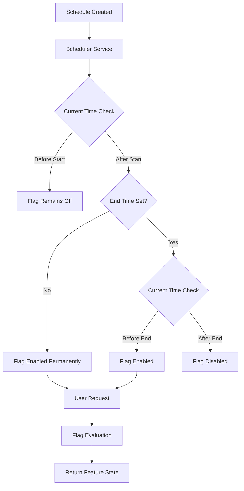
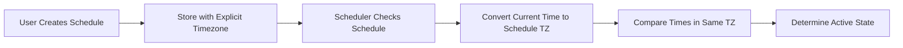
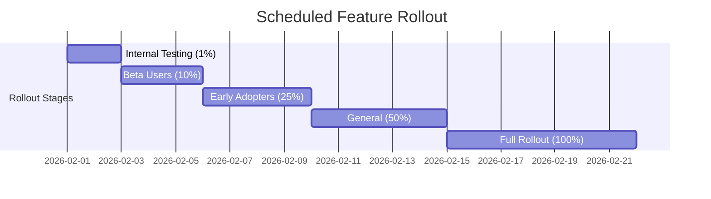
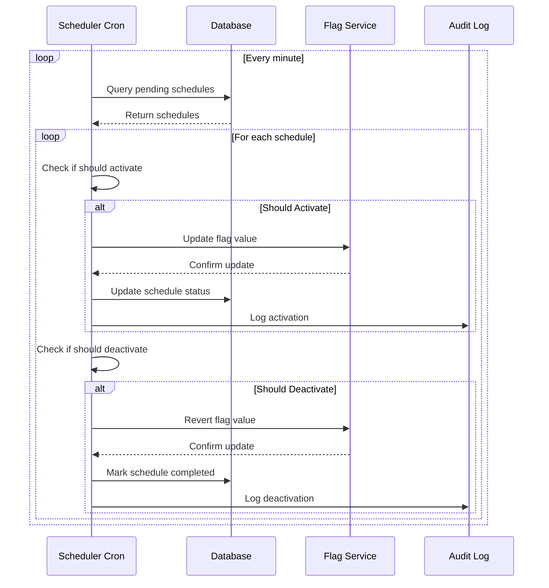
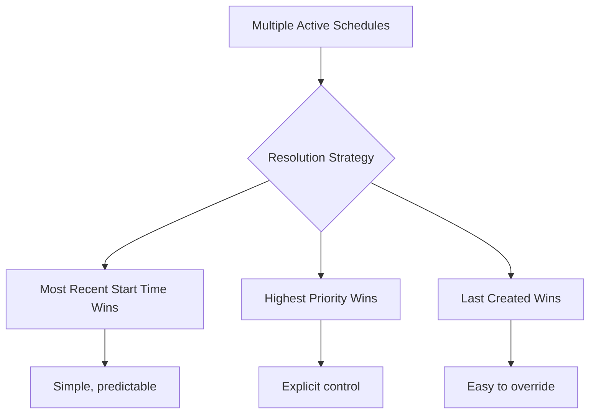
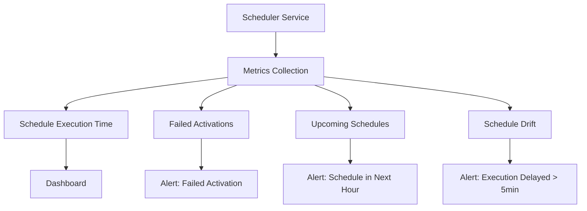

# How to Implement Flag Scheduling

Author: [nawazdhandala](https://github.com/nawazdhandala)

Tags: Feature Flags, Scheduling, Automation, Release Management

Description: Learn how to schedule feature flag activations for time-based releases, maintenance windows, and coordinated rollouts.

---

## Why Schedule Feature Flags?

Not every feature release should happen the moment code hits production. Many releases need to coordinate with marketing campaigns, regional business hours, maintenance windows, or compliance requirements. Flag scheduling lets you deploy code anytime while controlling exactly when users see new features.

Instead of waking up at 3 AM for a midnight release or manually toggling flags during business hours, you can schedule activations in advance. The system handles the timing while you focus on other work.

---

## Common Use Cases for Scheduled Flags

### 1. Marketing Campaign Launches

You want a new feature to go live exactly when an email blast or social media campaign starts. Deploy the code days before, then schedule the flag to activate at the campaign launch time.

### 2. Regional Business Hours

Rolling out a feature that affects checkout flows? Schedule it to activate during low-traffic hours for each region to minimize impact if something goes wrong.

### 3. Maintenance Windows

Enable debug logging or diagnostic features during scheduled maintenance, then automatically disable them when the window closes.

### 4. Compliance and Regulatory Requirements

Some features must activate on specific dates to meet legal or contractual obligations. Scheduling ensures you hit those deadlines without manual intervention.

### 5. Coordinated Multi-Service Releases

When multiple services need to enable features simultaneously, scheduling synchronizes the activation across your infrastructure.

---

## Scheduling Architecture

A flag scheduling system needs several components working together: a scheduler, a time service, the flag evaluation engine, and an audit log.



---

## Designing the Schedule Data Model

A robust scheduling system needs to handle start times, end times, timezones, and recurrence patterns. Here is a data model that covers most use cases:

```typescript
// flag-schedule.ts
// Data model for feature flag scheduling

interface FlagSchedule {
  id: string;
  flagId: string;
  name: string;
  description: string;

  // Timing configuration
  startAt: Date;           // When the flag should activate
  endAt: Date | null;      // When the flag should deactivate (null = permanent)
  timezone: string;        // IANA timezone (e.g., "America/New_York")

  // Recurrence for repeating schedules
  recurrence: RecurrencePattern | null;

  // What the flag should do when active
  activeValue: boolean | string | number | object;
  inactiveValue: boolean | string | number | object;

  // Metadata
  createdBy: string;
  createdAt: Date;
  updatedAt: Date;
  status: ScheduleStatus;
}

enum ScheduleStatus {
  PENDING = 'pending',      // Not yet started
  ACTIVE = 'active',        // Currently within scheduled window
  COMPLETED = 'completed',  // End time has passed
  CANCELLED = 'cancelled'   // Manually cancelled
}

interface RecurrencePattern {
  type: 'daily' | 'weekly' | 'monthly';
  interval: number;        // Every N days/weeks/months
  daysOfWeek?: number[];   // For weekly: 0=Sunday, 6=Saturday
  dayOfMonth?: number;     // For monthly: 1-31
  endAfter?: Date;         // When recurrence stops
  maxOccurrences?: number; // Maximum number of occurrences
}
```

---

## Implementing Time-Based Activation

The core of flag scheduling is determining whether a schedule is currently active. This requires careful handling of timezones and edge cases.

```python
# flag_scheduler.py
# Core scheduling logic for feature flags

from datetime import datetime, timedelta
from dataclasses import dataclass
from typing import Optional, Any
from enum import Enum
from zoneinfo import ZoneInfo


class ScheduleStatus(Enum):
    PENDING = "pending"
    ACTIVE = "active"
    COMPLETED = "completed"
    CANCELLED = "cancelled"


@dataclass
class FlagSchedule:
    """Represents a scheduled activation window for a feature flag."""
    id: str
    flag_id: str
    start_at: datetime
    end_at: Optional[datetime]
    timezone: str
    active_value: Any
    inactive_value: Any
    status: ScheduleStatus


def is_schedule_active(schedule: FlagSchedule) -> bool:
    """
    Determine if a schedule is currently active.

    Args:
        schedule: The schedule to evaluate

    Returns:
        True if the current time falls within the scheduled window
    """
    # Skip cancelled schedules
    if schedule.status == ScheduleStatus.CANCELLED:
        return False

    # Get current time in the schedule's timezone
    tz = ZoneInfo(schedule.timezone)
    now = datetime.now(tz)

    # Convert schedule times to the same timezone for comparison
    start_time = schedule.start_at.astimezone(tz)

    # Check if we have passed the start time
    if now < start_time:
        return False

    # If no end time, schedule is active once started
    if schedule.end_at is None:
        return True

    # Check if we are before the end time
    end_time = schedule.end_at.astimezone(tz)
    return now < end_time


def evaluate_flag_with_schedule(
    flag_id: str,
    schedules: list[FlagSchedule],
    default_value: Any
) -> Any:
    """
    Evaluate a flag considering all its schedules.

    The most recently started active schedule takes precedence.

    Args:
        flag_id: The flag to evaluate
        schedules: All schedules for this flag
        default_value: Value to return if no schedule is active

    Returns:
        The flag value based on active schedules
    """
    # Filter to only schedules for this flag
    flag_schedules = [s for s in schedules if s.flag_id == flag_id]

    # Find all currently active schedules
    active_schedules = [s for s in flag_schedules if is_schedule_active(s)]

    if not active_schedules:
        return default_value

    # If multiple schedules are active, use the one that started most recently
    # This allows overriding a long-running schedule with a short-term one
    most_recent = max(active_schedules, key=lambda s: s.start_at)

    return most_recent.active_value


# Example usage
if __name__ == "__main__":
    # Create a schedule for a Black Friday sale feature
    black_friday_schedule = FlagSchedule(
        id="sched_001",
        flag_id="black-friday-banner",
        start_at=datetime(2026, 11, 27, 0, 0, 0, tzinfo=ZoneInfo("America/New_York")),
        end_at=datetime(2026, 11, 30, 23, 59, 59, tzinfo=ZoneInfo("America/New_York")),
        timezone="America/New_York",
        active_value=True,
        inactive_value=False,
        status=ScheduleStatus.PENDING
    )

    # Check if the schedule is active
    is_active = is_schedule_active(black_friday_schedule)
    print(f"Black Friday banner active: {is_active}")
```

---

## Handling Timezones Correctly

Timezone handling is one of the trickiest parts of flag scheduling. A schedule set for "9 AM" means different things in New York, London, and Tokyo. Your system must be explicit about which timezone applies.



### Best Practices for Timezone Handling

1. **Always store times in UTC** with an explicit timezone reference
2. **Convert to the schedule's timezone** when evaluating
3. **Display times in the user's local timezone** in the UI
4. **Handle daylight saving time transitions** by using proper timezone libraries

```typescript
// timezone-handling.ts
// Proper timezone handling for flag schedules

import { DateTime } from 'luxon';

interface ScheduleConfig {
  startAt: string;      // ISO 8601 string in UTC
  endAt: string | null;
  timezone: string;     // IANA timezone identifier
}

/**
 * Check if a schedule is currently active, properly handling timezones.
 */
function isScheduleActiveWithTimezone(config: ScheduleConfig): boolean {
  // Parse the UTC times
  const startUtc = DateTime.fromISO(config.startAt, { zone: 'utc' });
  const endUtc = config.endAt
    ? DateTime.fromISO(config.endAt, { zone: 'utc' })
    : null;

  // Get current time in the schedule's timezone
  const nowInScheduleTz = DateTime.now().setZone(config.timezone);

  // Convert start and end to the schedule's timezone for logging
  const startInTz = startUtc.setZone(config.timezone);
  const endInTz = endUtc?.setZone(config.timezone);

  console.log(`Schedule timezone: ${config.timezone}`);
  console.log(`Start time (local): ${startInTz.toFormat('yyyy-MM-dd HH:mm:ss ZZZZ')}`);
  console.log(`Current time (local): ${nowInScheduleTz.toFormat('yyyy-MM-dd HH:mm:ss ZZZZ')}`);

  // Compare using UTC timestamps to avoid DST issues
  const nowUtc = DateTime.utc();

  if (nowUtc < startUtc) {
    return false;
  }

  if (endUtc && nowUtc >= endUtc) {
    return false;
  }

  return true;
}

/**
 * Create a schedule with proper timezone handling.
 * Takes local time in a specific timezone and converts to UTC for storage.
 */
function createSchedule(
  localStartTime: string,  // e.g., "2026-03-15 09:00:00"
  localEndTime: string | null,
  timezone: string
): ScheduleConfig {
  // Parse the local time in the specified timezone
  const startLocal = DateTime.fromFormat(
    localStartTime,
    'yyyy-MM-dd HH:mm:ss',
    { zone: timezone }
  );

  const endLocal = localEndTime
    ? DateTime.fromFormat(localEndTime, 'yyyy-MM-dd HH:mm:ss', { zone: timezone })
    : null;

  // Convert to UTC for storage
  return {
    startAt: startLocal.toUTC().toISO(),
    endAt: endLocal?.toUTC().toISO() ?? null,
    timezone: timezone
  };
}

// Example: Create a schedule for 9 AM Tokyo time
const tokyoSchedule = createSchedule(
  '2026-03-15 09:00:00',
  '2026-03-15 18:00:00',
  'Asia/Tokyo'
);

console.log('Stored schedule:', tokyoSchedule);
// startAt will be stored as "2026-03-15T00:00:00.000Z" (9 AM Tokyo = midnight UTC)
```

---

## Scheduled Rollout Patterns

Combining scheduling with percentage rollouts creates powerful release patterns. You can schedule a gradual increase in rollout percentage over time.



### Implementing Scheduled Percentage Increases

```python
# scheduled_rollout.py
# Scheduled percentage rollout implementation

from datetime import datetime, timedelta
from dataclasses import dataclass
from typing import List
from zoneinfo import ZoneInfo


@dataclass
class RolloutStage:
    """A single stage in a scheduled rollout."""
    percentage: int
    start_at: datetime
    description: str


@dataclass
class ScheduledRollout:
    """A complete scheduled rollout plan with multiple stages."""
    flag_id: str
    stages: List[RolloutStage]
    timezone: str

    def get_current_percentage(self) -> int:
        """
        Get the current rollout percentage based on the schedule.

        Returns:
            The percentage of users who should see the feature
        """
        tz = ZoneInfo(self.timezone)
        now = datetime.now(tz)

        # Sort stages by start time
        sorted_stages = sorted(self.stages, key=lambda s: s.start_at)

        # Find the most recent stage that has started
        current_percentage = 0
        for stage in sorted_stages:
            stage_time = stage.start_at.astimezone(tz)
            if now >= stage_time:
                current_percentage = stage.percentage
            else:
                break

        return current_percentage


def create_standard_rollout(
    flag_id: str,
    start_date: datetime,
    timezone: str
) -> ScheduledRollout:
    """
    Create a standard 2-week rollout schedule.

    This follows a common pattern:
    - Day 1: 1% (canary)
    - Day 3: 10% (early validation)
    - Day 5: 25% (broader testing)
    - Day 8: 50% (half of users)
    - Day 12: 100% (full rollout)
    """
    stages = [
        RolloutStage(
            percentage=1,
            start_at=start_date,
            description="Canary release"
        ),
        RolloutStage(
            percentage=10,
            start_at=start_date + timedelta(days=2),
            description="Early validation"
        ),
        RolloutStage(
            percentage=25,
            start_at=start_date + timedelta(days=4),
            description="Broader testing"
        ),
        RolloutStage(
            percentage=50,
            start_at=start_date + timedelta(days=7),
            description="Half rollout"
        ),
        RolloutStage(
            percentage=100,
            start_at=start_date + timedelta(days=11),
            description="Full rollout"
        ),
    ]

    return ScheduledRollout(
        flag_id=flag_id,
        stages=stages,
        timezone=timezone
    )


# Example usage
start = datetime(2026, 2, 1, 9, 0, 0, tzinfo=ZoneInfo("America/Los_Angeles"))
rollout = create_standard_rollout("new-checkout-flow", start, "America/Los_Angeles")

print(f"Current rollout percentage: {rollout.get_current_percentage()}%")
```

---

## Building the Scheduler Service

The scheduler service runs continuously, checking for schedules that need to be activated or deactivated.



### Scheduler Implementation

```typescript
// scheduler-service.ts
// Background service that processes flag schedules

interface Schedule {
  id: string;
  flagId: string;
  startAt: Date;
  endAt: Date | null;
  timezone: string;
  activeValue: unknown;
  inactiveValue: unknown;
  status: 'pending' | 'active' | 'completed' | 'cancelled';
  lastProcessedAt: Date | null;
}

interface FlagService {
  updateFlagValue(flagId: string, value: unknown): Promise<void>;
}

interface ScheduleRepository {
  findPendingSchedules(): Promise<Schedule[]>;
  findActiveSchedules(): Promise<Schedule[]>;
  updateStatus(id: string, status: string): Promise<void>;
  updateLastProcessed(id: string, timestamp: Date): Promise<void>;
}

interface AuditLogger {
  log(event: string, details: Record<string, unknown>): Promise<void>;
}

class FlagSchedulerService {
  private flagService: FlagService;
  private repository: ScheduleRepository;
  private auditLogger: AuditLogger;
  private isRunning: boolean = false;
  private intervalId: NodeJS.Timeout | null = null;

  constructor(
    flagService: FlagService,
    repository: ScheduleRepository,
    auditLogger: AuditLogger
  ) {
    this.flagService = flagService;
    this.repository = repository;
    this.auditLogger = auditLogger;
  }

  /**
   * Start the scheduler, processing schedules every minute.
   */
  start(): void {
    if (this.isRunning) {
      console.log('Scheduler is already running');
      return;
    }

    this.isRunning = true;
    console.log('Starting flag scheduler service');

    // Process immediately on start
    this.processSchedules();

    // Then process every minute
    this.intervalId = setInterval(() => {
      this.processSchedules();
    }, 60 * 1000);
  }

  /**
   * Stop the scheduler gracefully.
   */
  stop(): void {
    if (this.intervalId) {
      clearInterval(this.intervalId);
      this.intervalId = null;
    }
    this.isRunning = false;
    console.log('Scheduler service stopped');
  }

  /**
   * Process all schedules, activating and deactivating as needed.
   */
  private async processSchedules(): Promise<void> {
    const now = new Date();
    console.log(`Processing schedules at ${now.toISOString()}`);

    try {
      // Process pending schedules that should now be active
      await this.activatePendingSchedules(now);

      // Process active schedules that should now be completed
      await this.deactivateExpiredSchedules(now);
    } catch (error) {
      console.error('Error processing schedules:', error);
      await this.auditLogger.log('scheduler_error', {
        error: String(error),
        timestamp: now.toISOString()
      });
    }
  }

  /**
   * Find and activate schedules whose start time has passed.
   */
  private async activatePendingSchedules(now: Date): Promise<void> {
    const pendingSchedules = await this.repository.findPendingSchedules();

    for (const schedule of pendingSchedules) {
      if (now >= schedule.startAt) {
        console.log(`Activating schedule ${schedule.id} for flag ${schedule.flagId}`);

        // Update the flag value
        await this.flagService.updateFlagValue(
          schedule.flagId,
          schedule.activeValue
        );

        // Update schedule status
        await this.repository.updateStatus(schedule.id, 'active');
        await this.repository.updateLastProcessed(schedule.id, now);

        // Log the activation
        await this.auditLogger.log('schedule_activated', {
          scheduleId: schedule.id,
          flagId: schedule.flagId,
          activeValue: schedule.activeValue,
          activatedAt: now.toISOString()
        });
      }
    }
  }

  /**
   * Find and deactivate schedules whose end time has passed.
   */
  private async deactivateExpiredSchedules(now: Date): Promise<void> {
    const activeSchedules = await this.repository.findActiveSchedules();

    for (const schedule of activeSchedules) {
      // Skip schedules without an end time (they run indefinitely)
      if (!schedule.endAt) {
        continue;
      }

      if (now >= schedule.endAt) {
        console.log(`Deactivating schedule ${schedule.id} for flag ${schedule.flagId}`);

        // Revert the flag to its inactive value
        await this.flagService.updateFlagValue(
          schedule.flagId,
          schedule.inactiveValue
        );

        // Mark schedule as completed
        await this.repository.updateStatus(schedule.id, 'completed');
        await this.repository.updateLastProcessed(schedule.id, now);

        // Log the deactivation
        await this.auditLogger.log('schedule_completed', {
          scheduleId: schedule.id,
          flagId: schedule.flagId,
          inactiveValue: schedule.inactiveValue,
          completedAt: now.toISOString()
        });
      }
    }
  }
}
```

---

## Handling Edge Cases

Flag scheduling introduces several edge cases that require careful handling.

### 1. Overlapping Schedules

When multiple schedules affect the same flag at the same time, you need a clear precedence rule.



```python
# overlapping_schedules.py
# Handling overlapping schedule conflicts

from dataclasses import dataclass
from datetime import datetime
from typing import List, Optional
from enum import IntEnum


class SchedulePriority(IntEnum):
    """Priority levels for resolving schedule conflicts."""
    LOW = 1
    NORMAL = 2
    HIGH = 3
    CRITICAL = 4  # Emergency overrides


@dataclass
class PrioritizedSchedule:
    """A schedule with explicit priority for conflict resolution."""
    id: str
    flag_id: str
    start_at: datetime
    end_at: Optional[datetime]
    value: any
    priority: SchedulePriority
    created_at: datetime


def resolve_schedule_conflict(
    schedules: List[PrioritizedSchedule]
) -> Optional[PrioritizedSchedule]:
    """
    Resolve conflicts between multiple active schedules.

    Resolution order:
    1. Highest priority wins
    2. If same priority, most recent start time wins
    3. If same start time, most recently created wins

    Args:
        schedules: List of currently active schedules

    Returns:
        The winning schedule, or None if list is empty
    """
    if not schedules:
        return None

    # Sort by priority (descending), then start_at (descending), then created_at (descending)
    sorted_schedules = sorted(
        schedules,
        key=lambda s: (s.priority, s.start_at, s.created_at),
        reverse=True
    )

    return sorted_schedules[0]
```

### 2. Server Time Drift

Different servers might have slightly different times, causing inconsistent behavior. Use a centralized time source or accept small timing variations.

```typescript
// time-synchronization.ts
// Handling time drift in distributed systems

interface TimeProvider {
  getCurrentTime(): Date;
}

/**
 * A time provider that adds tolerance for server time drift.
 * Schedules activate slightly early to account for clock differences.
 */
class DriftTolerantTimeProvider implements TimeProvider {
  private driftToleranceMs: number;

  constructor(driftToleranceSeconds: number = 30) {
    this.driftToleranceMs = driftToleranceSeconds * 1000;
  }

  getCurrentTime(): Date {
    // Add drift tolerance to current time
    // This means schedules activate slightly early
    return new Date(Date.now() + this.driftToleranceMs);
  }
}

/**
 * Check if a schedule should be considered active,
 * accounting for potential time drift between servers.
 */
function isActiveWithDriftTolerance(
  schedule: { startAt: Date; endAt: Date | null },
  toleranceSeconds: number = 30
): boolean {
  const now = Date.now();
  const toleranceMs = toleranceSeconds * 1000;

  // Activate slightly early (within tolerance of start time)
  const effectiveStart = schedule.startAt.getTime() - toleranceMs;

  if (now < effectiveStart) {
    return false;
  }

  // Deactivate slightly late (within tolerance of end time)
  if (schedule.endAt) {
    const effectiveEnd = schedule.endAt.getTime() + toleranceMs;
    if (now > effectiveEnd) {
      return false;
    }
  }

  return true;
}
```

### 3. Missed Schedules

If the scheduler service is down when a schedule should activate, you need to handle the missed activation when the service recovers.

```python
# missed_schedule_recovery.py
# Recovery logic for schedules missed during downtime

from datetime import datetime, timedelta
from typing import List
from dataclasses import dataclass


@dataclass
class MissedSchedulePolicy:
    """Policy for handling schedules that were missed during downtime."""
    max_late_activation_hours: int = 24  # How late can we still activate?
    activate_if_still_within_window: bool = True
    log_missed_schedules: bool = True


def recover_missed_schedules(
    schedules: List[dict],
    last_processed_at: datetime,
    policy: MissedSchedulePolicy
) -> tuple[List[dict], List[dict]]:
    """
    Recover schedules that should have activated during downtime.

    Args:
        schedules: All pending schedules
        last_processed_at: When the scheduler last ran
        policy: How to handle missed schedules

    Returns:
        Tuple of (schedules_to_activate, schedules_to_skip)
    """
    now = datetime.utcnow()
    max_late = timedelta(hours=policy.max_late_activation_hours)

    to_activate = []
    to_skip = []

    for schedule in schedules:
        start_at = schedule['start_at']
        end_at = schedule.get('end_at')

        # Schedule should have started between last processing and now
        if start_at > last_processed_at and start_at <= now:
            time_since_start = now - start_at

            # Check if schedule is too late to activate
            if time_since_start > max_late:
                to_skip.append({
                    **schedule,
                    'skip_reason': f'Missed by {time_since_start}, exceeds max late activation'
                })
                continue

            # Check if schedule window has already ended
            if end_at and now > end_at:
                if policy.activate_if_still_within_window:
                    to_skip.append({
                        **schedule,
                        'skip_reason': 'Schedule window has already ended'
                    })
                continue

            # Schedule can be activated
            to_activate.append(schedule)

    return to_activate, to_skip
```

---

## API Design for Schedule Management

A well-designed API makes it easy to create, modify, and query schedules.

```typescript
// schedule-api.ts
// REST API endpoints for flag schedule management

interface CreateScheduleRequest {
  flagId: string;
  name: string;
  description?: string;
  startAt: string;           // ISO 8601 datetime
  endAt?: string;            // ISO 8601 datetime (optional)
  timezone: string;          // IANA timezone
  activeValue: unknown;
  inactiveValue?: unknown;
  priority?: 'low' | 'normal' | 'high' | 'critical';
}

interface ScheduleResponse {
  id: string;
  flagId: string;
  name: string;
  description: string;
  startAt: string;
  endAt: string | null;
  timezone: string;
  activeValue: unknown;
  inactiveValue: unknown;
  priority: string;
  status: string;
  createdBy: string;
  createdAt: string;
  updatedAt: string;
}

// Example API endpoints

// POST /api/flags/{flagId}/schedules
// Create a new schedule for a flag
async function createSchedule(
  flagId: string,
  request: CreateScheduleRequest
): Promise<ScheduleResponse> {
  // Validate the request
  validateScheduleRequest(request);

  // Check for conflicts with existing schedules
  const conflicts = await findConflictingSchedules(flagId, request);
  if (conflicts.length > 0) {
    throw new Error(`Schedule conflicts with existing schedules: ${conflicts.map(c => c.id).join(', ')}`);
  }

  // Create the schedule
  const schedule = await scheduleRepository.create({
    ...request,
    flagId,
    status: 'pending',
    createdAt: new Date().toISOString()
  });

  return schedule;
}

// GET /api/flags/{flagId}/schedules
// List all schedules for a flag
async function listSchedules(
  flagId: string,
  filters?: { status?: string; startAfter?: string; startBefore?: string }
): Promise<ScheduleResponse[]> {
  return scheduleRepository.findByFlag(flagId, filters);
}

// PATCH /api/schedules/{scheduleId}
// Modify an existing schedule (only if not yet started)
async function updateSchedule(
  scheduleId: string,
  updates: Partial<CreateScheduleRequest>
): Promise<ScheduleResponse> {
  const existing = await scheduleRepository.findById(scheduleId);

  if (existing.status !== 'pending') {
    throw new Error('Cannot modify a schedule that has already started');
  }

  return scheduleRepository.update(scheduleId, updates);
}

// DELETE /api/schedules/{scheduleId}
// Cancel a schedule
async function cancelSchedule(scheduleId: string): Promise<void> {
  const existing = await scheduleRepository.findById(scheduleId);

  if (existing.status === 'completed') {
    throw new Error('Cannot cancel a completed schedule');
  }

  // If schedule is active, revert the flag to inactive value
  if (existing.status === 'active') {
    await flagService.updateFlagValue(existing.flagId, existing.inactiveValue);
  }

  await scheduleRepository.updateStatus(scheduleId, 'cancelled');
}

function validateScheduleRequest(request: CreateScheduleRequest): void {
  const startAt = new Date(request.startAt);
  const now = new Date();

  // Start time must be in the future
  if (startAt <= now) {
    throw new Error('Schedule start time must be in the future');
  }

  // End time must be after start time
  if (request.endAt) {
    const endAt = new Date(request.endAt);
    if (endAt <= startAt) {
      throw new Error('Schedule end time must be after start time');
    }
  }

  // Validate timezone
  try {
    Intl.DateTimeFormat(undefined, { timeZone: request.timezone });
  } catch {
    throw new Error(`Invalid timezone: ${request.timezone}`);
  }
}
```

---

## Integrating with CI/CD Pipelines

Automate schedule creation as part of your deployment pipeline.

```yaml
# .github/workflows/deploy-with-scheduled-flag.yml
# GitHub Actions workflow that creates a flag schedule as part of deployment

name: Deploy with Scheduled Flag Activation

on:
  push:
    branches: [main]

jobs:
  deploy:
    runs-on: ubuntu-latest
    steps:
      - name: Checkout code
        uses: actions/checkout@v4

      - name: Deploy application
        run: |
          # Your deployment steps here
          ./deploy.sh

      - name: Schedule feature flag activation
        env:
          FLAG_API_TOKEN: ${{ secrets.FLAG_SERVICE_TOKEN }}
          FLAG_API_URL: ${{ vars.FLAG_SERVICE_URL }}
        run: |
          # Calculate activation time (2 hours from now)
          ACTIVATION_TIME=$(date -u -d "+2 hours" +"%Y-%m-%dT%H:%M:%SZ")

          # Create the schedule via API
          curl -X POST "${FLAG_API_URL}/api/flags/new-feature/schedules" \
            -H "Authorization: Bearer ${FLAG_API_TOKEN}" \
            -H "Content-Type: application/json" \
            -d "{
              \"name\": \"Post-deploy activation\",
              \"description\": \"Activate feature after deployment verification\",
              \"startAt\": \"${ACTIVATION_TIME}\",
              \"timezone\": \"UTC\",
              \"activeValue\": true,
              \"inactiveValue\": false,
              \"priority\": \"normal\"
            }"

      - name: Notify team
        run: |
          echo "Feature flag 'new-feature' scheduled to activate at ${ACTIVATION_TIME}"
```

---

## Monitoring and Alerting

Track schedule execution and alert when things go wrong.



### Key Metrics to Track

| Metric | Description | Alert Threshold |
|--------|-------------|-----------------|
| `schedule.activation.latency` | Time between scheduled start and actual activation | > 60 seconds |
| `schedule.execution.failures` | Number of failed schedule executions | > 0 |
| `schedule.pending.count` | Schedules waiting to activate | Context-dependent |
| `schedule.overdue.count` | Schedules past start time but not yet activated | > 0 |

```python
# schedule_metrics.py
# Metrics collection for flag scheduling

from dataclasses import dataclass
from datetime import datetime, timedelta
from typing import List
import time


@dataclass
class ScheduleMetrics:
    """Metrics for monitoring schedule execution health."""
    total_pending: int
    total_active: int
    total_completed_today: int
    total_failed_today: int
    avg_activation_latency_ms: float
    schedules_due_next_hour: int
    overdue_schedules: int


def collect_schedule_metrics(
    schedules: List[dict],
    execution_logs: List[dict]
) -> ScheduleMetrics:
    """
    Collect metrics about schedule execution.

    Args:
        schedules: All schedules in the system
        execution_logs: Log entries from schedule executions

    Returns:
        Aggregated metrics for monitoring
    """
    now = datetime.utcnow()
    today_start = now.replace(hour=0, minute=0, second=0, microsecond=0)
    next_hour = now + timedelta(hours=1)

    # Count schedules by status
    pending = [s for s in schedules if s['status'] == 'pending']
    active = [s for s in schedules if s['status'] == 'active']

    # Count completions and failures today
    today_logs = [
        log for log in execution_logs
        if log['timestamp'] >= today_start
    ]
    completed_today = len([l for l in today_logs if l['result'] == 'success'])
    failed_today = len([l for l in today_logs if l['result'] == 'failure'])

    # Calculate average activation latency
    successful_logs = [l for l in today_logs if l['result'] == 'success']
    if successful_logs:
        latencies = [
            (l['executed_at'] - l['scheduled_for']).total_seconds() * 1000
            for l in successful_logs
        ]
        avg_latency = sum(latencies) / len(latencies)
    else:
        avg_latency = 0.0

    # Count schedules due in the next hour
    due_next_hour = len([
        s for s in pending
        if s['start_at'] <= next_hour
    ])

    # Count overdue schedules (should have started but still pending)
    overdue = len([
        s for s in pending
        if s['start_at'] < now
    ])

    return ScheduleMetrics(
        total_pending=len(pending),
        total_active=len(active),
        total_completed_today=completed_today,
        total_failed_today=failed_today,
        avg_activation_latency_ms=avg_latency,
        schedules_due_next_hour=due_next_hour,
        overdue_schedules=overdue
    )
```

---

## Summary

Flag scheduling transforms feature flags from simple toggles into powerful release management tools. By implementing time-based activation, you gain:

1. **Precise Release Timing** - Launch features at exactly the right moment, coordinated with marketing, regional hours, or compliance requirements.

2. **Reduced Manual Intervention** - Schedule activations in advance and let the system handle the timing automatically.

3. **Timezone Awareness** - Activate features during appropriate local hours for different regions.

4. **Graduated Rollouts** - Combine scheduling with percentage rollouts for time-based gradual releases.

5. **Audit Trail** - Track every scheduled activation and deactivation for compliance and debugging.

6. **CI/CD Integration** - Automate schedule creation as part of your deployment pipeline.

When implementing flag scheduling, pay special attention to timezone handling, overlapping schedule resolution, and recovery from missed schedules. A well-designed scheduling system makes releases predictable and reduces the stress of coordinating deployments with business events.

---

## Further Reading

- [How to Build Flag Lifecycle Management](https://oneuptime.com/blog/post/2026-01-30-flag-lifecycle-management/view)
- [How to Implement Percentage Rollout Flags](https://oneuptime.com/blog/post/2026-01-30-percentage-rollout-flags/view)
- [Plan Scheduled Maintenance with OneUptime](https://oneuptime.com/blog/post/2025-10-27-manage-scheduled-maintenance-with-oneuptime/view)
