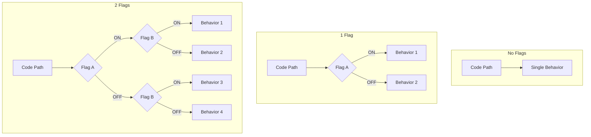
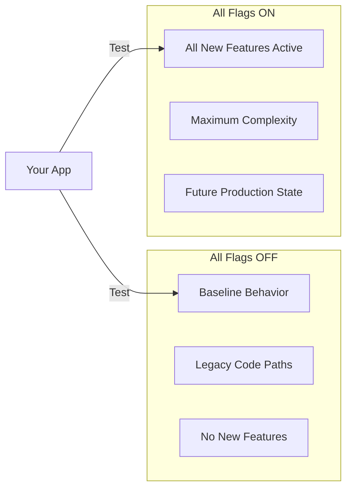
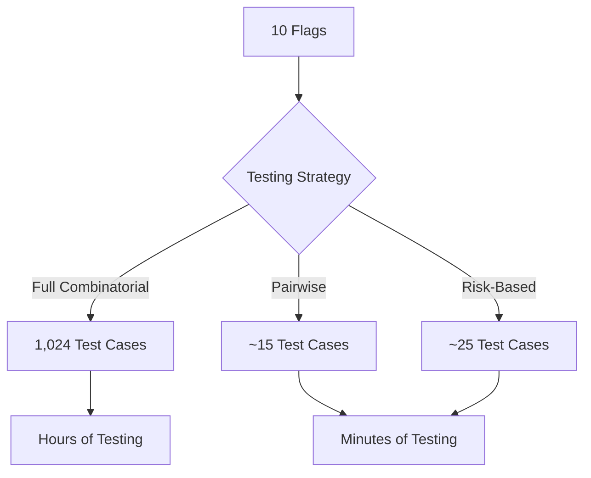
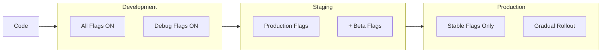
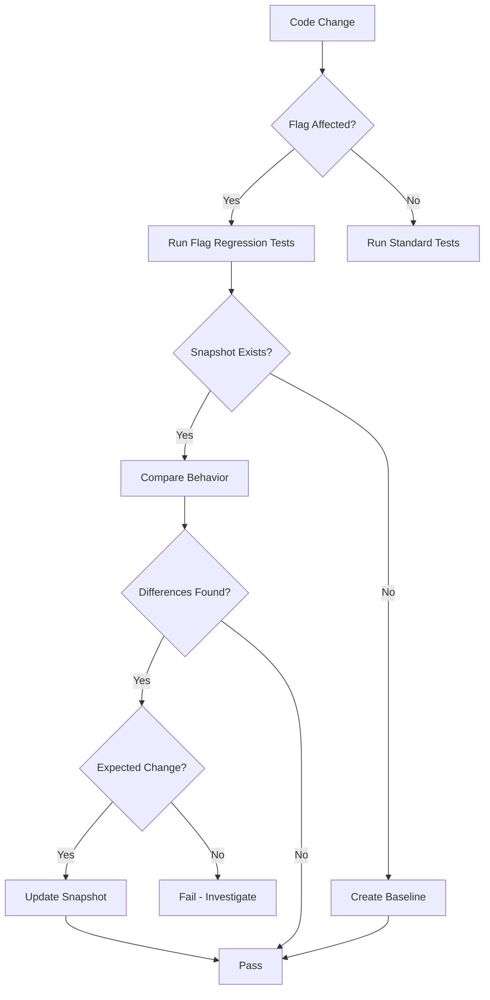
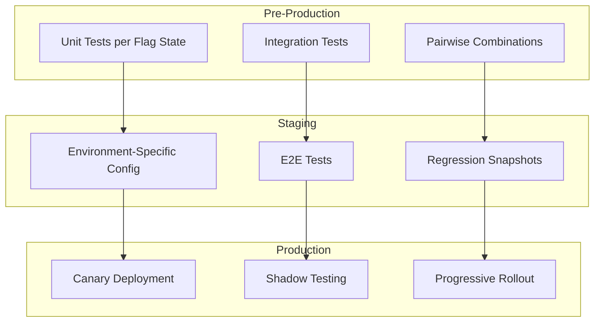

# How to Implement Flag Testing Strategies

Author: [nawazdhandala](https://github.com/nawazdhandala)

Tags: Feature Flags, Testing, QA, Development

Description: Learn how to test feature flags across all possible states and configurations.

---

Feature flags unlock powerful deployment patterns, but they also multiply your testing complexity. Each flag creates a branch in your code path. Two flags mean four possible states. Ten flags mean over a thousand combinations. Without a testing strategy, bugs hide in flag combinations you never anticipated.

This guide covers practical strategies for testing feature flags systematically, from generating test matrices to validating production deployments.

## Understanding the Testing Challenge

Feature flags create combinatorial complexity. Every flag doubles your potential code paths.



### The Math of Flag Combinations

| Number of Flags | Possible States |
|----------------|-----------------|
| 1 | 2 |
| 2 | 4 |
| 3 | 8 |
| 5 | 32 |
| 10 | 1,024 |
| 20 | 1,048,576 |

Testing every combination becomes impossible quickly. You need smart strategies to cover critical paths without exhaustive testing.

## Testing Matrix Generation

A testing matrix maps out which flag combinations to test. Start by identifying flag dependencies and critical paths.

### Basic Matrix Generator

```typescript
interface FeatureFlag {
  name: string;
  values: boolean[];
  dependencies?: string[];
}

interface TestCase {
  flags: Record<string, boolean>;
  description: string;
}

function generateTestMatrix(flags: FeatureFlag[]): TestCase[] {
  const testCases: TestCase[] = [];

  // Generate all combinations
  function generateCombinations(
    index: number,
    current: Record<string, boolean>
  ): void {
    if (index === flags.length) {
      testCases.push({
        flags: { ...current },
        description: describeFlags(current)
      });
      return;
    }

    const flag = flags[index];
    for (const value of flag.values) {
      current[flag.name] = value;
      generateCombinations(index + 1, current);
    }
  }

  generateCombinations(0, {});
  return testCases;
}

function describeFlags(flags: Record<string, boolean>): string {
  return Object.entries(flags)
    .map(([name, value]) => `${name}=${value ? 'ON' : 'OFF'}`)
    .join(', ');
}

// Usage
const flags: FeatureFlag[] = [
  { name: 'newCheckout', values: [true, false] },
  { name: 'darkMode', values: [true, false] },
  { name: 'betaFeatures', values: [true, false] }
];

const matrix = generateTestMatrix(flags);
console.log(`Generated ${matrix.length} test cases`);
// Output: Generated 8 test cases
```

### Dependency-Aware Matrix

Some flags only matter when other flags are enabled. Filter out impossible combinations.

```typescript
interface FlagDependency {
  flag: string;
  requiresFlag: string;
  requiresValue: boolean;
}

function generateDependencyAwareMatrix(
  flags: FeatureFlag[],
  dependencies: FlagDependency[]
): TestCase[] {
  const allCombinations = generateTestMatrix(flags);

  return allCombinations.filter(testCase => {
    for (const dep of dependencies) {
      const flagValue = testCase.flags[dep.flag];
      const requiredFlagValue = testCase.flags[dep.requiresFlag];

      // If dependent flag is enabled but required flag doesn't match
      if (flagValue && requiredFlagValue !== dep.requiresValue) {
        return false;
      }
    }
    return true;
  });
}

// Usage
const dependencies: FlagDependency[] = [
  // newCheckoutV2 only works when newCheckout is enabled
  { flag: 'newCheckoutV2', requiresFlag: 'newCheckout', requiresValue: true }
];

const filteredMatrix = generateDependencyAwareMatrix(flags, dependencies);
```

### Priority-Based Matrix

Assign priorities to flag combinations based on risk and usage.

```typescript
interface PrioritizedTestCase extends TestCase {
  priority: 'critical' | 'high' | 'medium' | 'low';
  reason: string;
}

function prioritizeTestCases(
  testCases: TestCase[],
  productionConfig: Record<string, boolean>,
  rolloutConfig: Record<string, boolean>
): PrioritizedTestCase[] {
  return testCases.map(testCase => {
    // Production state is critical
    if (matchesConfig(testCase.flags, productionConfig)) {
      return {
        ...testCase,
        priority: 'critical',
        reason: 'Current production configuration'
      };
    }

    // Rollout target is high priority
    if (matchesConfig(testCase.flags, rolloutConfig)) {
      return {
        ...testCase,
        priority: 'high',
        reason: 'Target rollout configuration'
      };
    }

    // All flags ON or OFF are high priority
    const allOn = Object.values(testCase.flags).every(v => v === true);
    const allOff = Object.values(testCase.flags).every(v => v === false);
    if (allOn || allOff) {
      return {
        ...testCase,
        priority: 'high',
        reason: allOn ? 'All flags enabled' : 'All flags disabled'
      };
    }

    return {
      ...testCase,
      priority: 'medium',
      reason: 'Standard combination'
    };
  });
}

function matchesConfig(
  flags: Record<string, boolean>,
  config: Record<string, boolean>
): boolean {
  return Object.entries(config).every(
    ([key, value]) => flags[key] === value
  );
}
```

## All-Flags-On/Off Testing

The simplest strategy: test with everything enabled and everything disabled.



### Implementation

```typescript
class FlagTestRunner {
  private flagService: FeatureFlagService;
  private testSuite: TestSuite;

  constructor(flagService: FeatureFlagService, testSuite: TestSuite) {
    this.flagService = flagService;
    this.testSuite = testSuite;
  }

  async runAllFlagsOn(): Promise<TestResult> {
    console.log('Running tests with ALL FLAGS ON');

    const originalFlags = await this.flagService.getAllFlags();

    try {
      // Enable all flags
      const allFlags = await this.flagService.listFlags();
      for (const flag of allFlags) {
        await this.flagService.setFlag(flag.name, true);
      }

      // Run test suite
      const result = await this.testSuite.run();

      return {
        configuration: 'ALL_FLAGS_ON',
        passed: result.passed,
        failed: result.failed,
        duration: result.duration
      };
    } finally {
      // Restore original state
      await this.flagService.restoreFlags(originalFlags);
    }
  }

  async runAllFlagsOff(): Promise<TestResult> {
    console.log('Running tests with ALL FLAGS OFF');

    const originalFlags = await this.flagService.getAllFlags();

    try {
      // Disable all flags
      const allFlags = await this.flagService.listFlags();
      for (const flag of allFlags) {
        await this.flagService.setFlag(flag.name, false);
      }

      // Run test suite
      const result = await this.testSuite.run();

      return {
        configuration: 'ALL_FLAGS_OFF',
        passed: result.passed,
        failed: result.failed,
        duration: result.duration
      };
    } finally {
      // Restore original state
      await this.flagService.restoreFlags(originalFlags);
    }
  }

  async runBothExtremes(): Promise<TestResult[]> {
    const results: TestResult[] = [];

    results.push(await this.runAllFlagsOff());
    results.push(await this.runAllFlagsOn());

    return results;
  }
}
```

### Jest Integration

```typescript
// jest.setup.ts
import { FeatureFlagService } from './services/featureFlags';

declare global {
  var testFlagState: 'all-on' | 'all-off' | 'default';
}

beforeAll(async () => {
  const flagState = process.env.FLAG_TEST_STATE || 'default';

  if (flagState === 'all-on') {
    await FeatureFlagService.enableAllFlags();
  } else if (flagState === 'all-off') {
    await FeatureFlagService.disableAllFlags();
  }

  global.testFlagState = flagState as any;
});

afterAll(async () => {
  await FeatureFlagService.restoreDefaults();
});
```

```json
// package.json
{
  "scripts": {
    "test": "jest",
    "test:flags-on": "FLAG_TEST_STATE=all-on jest",
    "test:flags-off": "FLAG_TEST_STATE=all-off jest",
    "test:all-flag-states": "npm run test:flags-off && npm run test:flags-on && npm run test"
  }
}
```

## Combinatorial Testing

Full combinatorial testing is expensive. Use pairwise testing to reduce combinations while maintaining coverage.

### Pairwise Testing

Pairwise testing ensures every pair of flag values is tested at least once. This catches most bugs while dramatically reducing test count.



### Pairwise Generator

```typescript
interface PairwiseConfig {
  flags: string[];
  values: boolean[];
}

function generatePairwiseTests(config: PairwiseConfig): TestCase[] {
  const { flags, values } = config;
  const pairs: Set<string> = new Set();
  const testCases: TestCase[] = [];

  // Generate all required pairs
  for (let i = 0; i < flags.length; i++) {
    for (let j = i + 1; j < flags.length; j++) {
      for (const v1 of values) {
        for (const v2 of values) {
          pairs.add(`${flags[i]}:${v1},${flags[j]}:${v2}`);
        }
      }
    }
  }

  // Greedily generate test cases that cover pairs
  while (pairs.size > 0) {
    const testCase: Record<string, boolean> = {};
    let coveredCount = 0;

    // Try to cover as many pairs as possible
    for (const flag of flags) {
      let bestValue = values[0];
      let bestCoverage = 0;

      for (const value of values) {
        const tempCase = { ...testCase, [flag]: value };
        const coverage = countCoveredPairs(tempCase, pairs, flags);
        if (coverage > bestCoverage) {
          bestCoverage = coverage;
          bestValue = value;
        }
      }

      testCase[flag] = bestValue;
    }

    // Remove covered pairs
    removeCoveredPairs(testCase, pairs, flags);

    testCases.push({
      flags: testCase,
      description: describeFlags(testCase)
    });
  }

  return testCases;
}

function countCoveredPairs(
  testCase: Record<string, boolean>,
  pairs: Set<string>,
  flags: string[]
): number {
  let count = 0;
  const definedFlags = Object.keys(testCase);

  for (let i = 0; i < definedFlags.length; i++) {
    for (let j = i + 1; j < definedFlags.length; j++) {
      const f1 = definedFlags[i];
      const f2 = definedFlags[j];
      const pair = `${f1}:${testCase[f1]},${f2}:${testCase[f2]}`;
      if (pairs.has(pair)) count++;
    }
  }

  return count;
}

function removeCoveredPairs(
  testCase: Record<string, boolean>,
  pairs: Set<string>,
  flags: string[]
): void {
  for (let i = 0; i < flags.length; i++) {
    for (let j = i + 1; j < flags.length; j++) {
      const f1 = flags[i];
      const f2 = flags[j];
      if (testCase[f1] !== undefined && testCase[f2] !== undefined) {
        pairs.delete(`${f1}:${testCase[f1]},${f2}:${testCase[f2]}`);
      }
    }
  }
}
```

### Using Existing Pairwise Tools

For production use, leverage established tools like `pict` or `allpairs`.

```bash
# Install Microsoft PICT
brew install pict

# Create model file
cat > flags.model << EOF
newCheckout: ON, OFF
darkMode: ON, OFF
betaFeatures: ON, OFF
newPayment: ON, OFF
analyticsV2: ON, OFF
EOF

# Generate pairwise combinations
pict flags.model
```

Output:

```
newCheckout darkMode betaFeatures newPayment analyticsV2
OFF         ON       OFF          ON         OFF
ON          OFF      ON           OFF        ON
ON          ON       OFF          OFF        OFF
OFF         OFF      ON           ON         ON
ON          ON       ON           ON         OFF
OFF         OFF      OFF          OFF        ON
```

## Environment-Specific Tests

Different environments need different flag configurations. Test each environment's specific setup.



### Environment Configuration

```typescript
interface EnvironmentConfig {
  name: string;
  flags: Record<string, boolean>;
  testSuites: string[];
}

const environments: EnvironmentConfig[] = [
  {
    name: 'development',
    flags: {
      newCheckout: true,
      darkMode: true,
      betaFeatures: true,
      debugMode: true,
      experimentalApi: true
    },
    testSuites: ['unit', 'integration']
  },
  {
    name: 'staging',
    flags: {
      newCheckout: true,
      darkMode: true,
      betaFeatures: true,
      debugMode: false,
      experimentalApi: false
    },
    testSuites: ['unit', 'integration', 'e2e']
  },
  {
    name: 'production',
    flags: {
      newCheckout: true,
      darkMode: true,
      betaFeatures: false,
      debugMode: false,
      experimentalApi: false
    },
    testSuites: ['unit', 'integration', 'e2e', 'smoke']
  }
];
```

### Environment Test Runner

```typescript
class EnvironmentTestRunner {
  async runEnvironmentTests(
    envName: string
  ): Promise<EnvironmentTestResult> {
    const env = environments.find(e => e.name === envName);
    if (!env) {
      throw new Error(`Unknown environment: ${envName}`);
    }

    console.log(`Testing ${env.name} environment configuration`);
    console.log(`Flags: ${JSON.stringify(env.flags, null, 2)}`);

    // Configure flags for this environment
    await this.configureFlags(env.flags);

    const results: TestSuiteResult[] = [];

    for (const suite of env.testSuites) {
      console.log(`Running ${suite} tests...`);
      const result = await this.runTestSuite(suite);
      results.push(result);
    }

    return {
      environment: env.name,
      flagConfiguration: env.flags,
      suiteResults: results,
      overallPassed: results.every(r => r.passed)
    };
  }

  async runAllEnvironments(): Promise<EnvironmentTestResult[]> {
    const results: EnvironmentTestResult[] = [];

    for (const env of environments) {
      const result = await this.runEnvironmentTests(env.name);
      results.push(result);
    }

    return results;
  }

  private async configureFlags(
    flags: Record<string, boolean>
  ): Promise<void> {
    for (const [flag, value] of Object.entries(flags)) {
      await FeatureFlagService.setFlag(flag, value);
    }
  }

  private async runTestSuite(suite: string): Promise<TestSuiteResult> {
    // Implementation depends on your test framework
    const jest = require('jest');
    const result = await jest.runCLI(
      { testPathPattern: `.*\\.${suite}\\.test\\.ts$` },
      [process.cwd()]
    );

    return {
      name: suite,
      passed: result.results.success,
      numPassed: result.results.numPassedTests,
      numFailed: result.results.numFailedTests
    };
  }
}
```

### CI/CD Pipeline Integration

```yaml
# .github/workflows/flag-tests.yml
name: Feature Flag Tests

on:
  push:
    branches: [main, develop]
  pull_request:
    branches: [main]

jobs:
  test-flag-configurations:
    runs-on: ubuntu-latest
    strategy:
      matrix:
        environment: [development, staging, production]
        flag-state: [default, all-on, all-off]

    steps:
      - uses: actions/checkout@v4

      - name: Setup Node.js
        uses: actions/setup-node@v4
        with:
          node-version: '20'

      - name: Install dependencies
        run: npm ci

      - name: Run tests for ${{ matrix.environment }} with ${{ matrix.flag-state }}
        run: |
          npm run test:flags -- \
            --environment=${{ matrix.environment }} \
            --flag-state=${{ matrix.flag-state }}
        env:
          FLAG_ENVIRONMENT: ${{ matrix.environment }}
          FLAG_TEST_STATE: ${{ matrix.flag-state }}

      - name: Upload test results
        uses: actions/upload-artifact@v4
        with:
          name: test-results-${{ matrix.environment }}-${{ matrix.flag-state }}
          path: coverage/
```

## Regression Testing

Ensure flag changes don't break existing functionality. Track behavior changes across flag states.

### Behavioral Snapshot Testing

```typescript
interface BehaviorSnapshot {
  testName: string;
  flagConfiguration: Record<string, boolean>;
  output: any;
  timestamp: Date;
}

class FlagRegressionTester {
  private snapshotDir: string;

  constructor(snapshotDir: string = '.flag-snapshots') {
    this.snapshotDir = snapshotDir;
  }

  async captureSnapshot(
    testName: string,
    flagConfig: Record<string, boolean>,
    testFn: () => Promise<any>
  ): Promise<BehaviorSnapshot> {
    await this.configureFlags(flagConfig);

    const output = await testFn();

    const snapshot: BehaviorSnapshot = {
      testName,
      flagConfiguration: flagConfig,
      output,
      timestamp: new Date()
    };

    await this.saveSnapshot(snapshot);
    return snapshot;
  }

  async verifyAgainstSnapshot(
    testName: string,
    flagConfig: Record<string, boolean>,
    testFn: () => Promise<any>
  ): Promise<RegressionResult> {
    const savedSnapshot = await this.loadSnapshot(testName, flagConfig);

    if (!savedSnapshot) {
      return {
        status: 'no-baseline',
        message: 'No baseline snapshot found. Run with --update-snapshots.'
      };
    }

    await this.configureFlags(flagConfig);
    const currentOutput = await testFn();

    const differences = this.compareOutputs(
      savedSnapshot.output,
      currentOutput
    );

    if (differences.length === 0) {
      return { status: 'passed', message: 'Output matches baseline' };
    }

    return {
      status: 'failed',
      message: 'Output differs from baseline',
      differences
    };
  }

  private compareOutputs(expected: any, actual: any): Difference[] {
    const differences: Difference[] = [];

    function compare(path: string, exp: any, act: any) {
      if (typeof exp !== typeof act) {
        differences.push({
          path,
          expected: exp,
          actual: act,
          type: 'type-mismatch'
        });
        return;
      }

      if (typeof exp === 'object' && exp !== null) {
        const allKeys = new Set([
          ...Object.keys(exp),
          ...Object.keys(act)
        ]);

        for (const key of allKeys) {
          compare(`${path}.${key}`, exp[key], act[key]);
        }
      } else if (exp !== act) {
        differences.push({
          path,
          expected: exp,
          actual: act,
          type: 'value-mismatch'
        });
      }
    }

    compare('root', expected, actual);
    return differences;
  }

  private async configureFlags(
    flags: Record<string, boolean>
  ): Promise<void> {
    for (const [flag, value] of Object.entries(flags)) {
      await FeatureFlagService.setFlag(flag, value);
    }
  }

  private async saveSnapshot(snapshot: BehaviorSnapshot): Promise<void> {
    const filename = this.getSnapshotFilename(
      snapshot.testName,
      snapshot.flagConfiguration
    );
    await fs.writeFile(filename, JSON.stringify(snapshot, null, 2));
  }

  private async loadSnapshot(
    testName: string,
    flagConfig: Record<string, boolean>
  ): Promise<BehaviorSnapshot | null> {
    const filename = this.getSnapshotFilename(testName, flagConfig);
    try {
      const content = await fs.readFile(filename, 'utf-8');
      return JSON.parse(content);
    } catch {
      return null;
    }
  }

  private getSnapshotFilename(
    testName: string,
    flagConfig: Record<string, boolean>
  ): string {
    const configHash = this.hashConfig(flagConfig);
    return `${this.snapshotDir}/${testName}-${configHash}.json`;
  }

  private hashConfig(config: Record<string, boolean>): string {
    const sorted = Object.keys(config).sort();
    const str = sorted.map(k => `${k}:${config[k]}`).join(',');
    return crypto.createHash('md5').update(str).digest('hex').slice(0, 8);
  }
}
```

### Regression Test Workflow



## Production Testing Strategies

Testing in production requires careful strategies to minimize risk while validating real-world behavior.

### Canary Testing with Flags

```typescript
interface CanaryConfig {
  flag: string;
  rolloutPercentage: number;
  metrics: string[];
  thresholds: Record<string, number>;
  rollbackOnFailure: boolean;
}

class CanaryTester {
  private metricsService: MetricsService;
  private flagService: FeatureFlagService;
  private alertService: AlertService;

  async runCanaryTest(config: CanaryConfig): Promise<CanaryResult> {
    console.log(`Starting canary test for ${config.flag}`);
    console.log(`Rollout: ${config.rolloutPercentage}%`);

    // Enable flag for percentage of users
    await this.flagService.setRolloutPercentage(
      config.flag,
      config.rolloutPercentage
    );

    // Collect baseline metrics
    const baselineMetrics = await this.collectMetrics(
      config.metrics,
      'control'
    );

    // Wait for sufficient data
    await this.wait(config.observationPeriodMinutes * 60 * 1000);

    // Collect canary metrics
    const canaryMetrics = await this.collectMetrics(
      config.metrics,
      'canary'
    );

    // Compare metrics
    const comparison = this.compareMetrics(
      baselineMetrics,
      canaryMetrics,
      config.thresholds
    );

    if (!comparison.passed && config.rollbackOnFailure) {
      console.log('Canary failed, rolling back...');
      await this.flagService.setRolloutPercentage(config.flag, 0);
      await this.alertService.sendAlert({
        severity: 'high',
        title: `Canary rollback: ${config.flag}`,
        details: comparison.failures
      });
    }

    return {
      flag: config.flag,
      passed: comparison.passed,
      baselineMetrics,
      canaryMetrics,
      comparison
    };
  }

  private async collectMetrics(
    metricNames: string[],
    cohort: string
  ): Promise<Record<string, number>> {
    const metrics: Record<string, number> = {};

    for (const name of metricNames) {
      metrics[name] = await this.metricsService.query(name, { cohort });
    }

    return metrics;
  }

  private compareMetrics(
    baseline: Record<string, number>,
    canary: Record<string, number>,
    thresholds: Record<string, number>
  ): MetricsComparison {
    const failures: string[] = [];

    for (const [metric, threshold] of Object.entries(thresholds)) {
      const baselineValue = baseline[metric];
      const canaryValue = canary[metric];
      const change = ((canaryValue - baselineValue) / baselineValue) * 100;

      if (Math.abs(change) > threshold) {
        failures.push(
          `${metric}: ${change.toFixed(2)}% change exceeds ${threshold}% threshold`
        );
      }
    }

    return {
      passed: failures.length === 0,
      failures
    };
  }

  private wait(ms: number): Promise<void> {
    return new Promise(resolve => setTimeout(resolve, ms));
  }
}
```

### Shadow Testing

Test new flag behavior without affecting users by running both code paths.

```typescript
class ShadowTester {
  async shadowTest<T>(
    flagName: string,
    controlFn: () => Promise<T>,
    experimentFn: () => Promise<T>
  ): Promise<T> {
    // Always run control (returns to user)
    const controlPromise = controlFn();

    // Run experiment in background (logged only)
    const experimentPromise = experimentFn()
      .then(result => {
        this.logExperimentResult(flagName, 'success', result);
        return result;
      })
      .catch(error => {
        this.logExperimentResult(flagName, 'error', error);
        return null;
      });

    // Wait for control result (user-facing)
    const controlResult = await controlPromise;

    // Compare results asynchronously (don't block response)
    experimentPromise.then(experimentResult => {
      if (experimentResult !== null) {
        this.compareResults(flagName, controlResult, experimentResult);
      }
    });

    return controlResult;
  }

  private compareResults(
    flagName: string,
    control: any,
    experiment: any
  ): void {
    const match = JSON.stringify(control) === JSON.stringify(experiment);

    this.metrics.increment('shadow_test_total', { flag: flagName });

    if (!match) {
      this.metrics.increment('shadow_test_mismatch', { flag: flagName });
      this.logger.warn('Shadow test mismatch', {
        flag: flagName,
        control,
        experiment
      });
    }
  }

  private logExperimentResult(
    flagName: string,
    status: string,
    result: any
  ): void {
    this.logger.info('Shadow experiment result', {
      flag: flagName,
      status,
      result: status === 'success' ? result : result.message
    });
  }
}
```

### Progressive Rollout Testing

```typescript
interface RolloutStage {
  percentage: number;
  duration: string;
  successCriteria: SuccessCriteria;
}

interface SuccessCriteria {
  errorRateMax: number;
  latencyP99Max: number;
  customMetrics?: Record<string, { min?: number; max?: number }>;
}

class ProgressiveRolloutTester {
  private stages: RolloutStage[] = [
    {
      percentage: 1,
      duration: '15m',
      successCriteria: { errorRateMax: 0.01, latencyP99Max: 500 }
    },
    {
      percentage: 5,
      duration: '30m',
      successCriteria: { errorRateMax: 0.01, latencyP99Max: 500 }
    },
    {
      percentage: 25,
      duration: '1h',
      successCriteria: { errorRateMax: 0.01, latencyP99Max: 500 }
    },
    {
      percentage: 50,
      duration: '2h',
      successCriteria: { errorRateMax: 0.01, latencyP99Max: 500 }
    },
    {
      percentage: 100,
      duration: '24h',
      successCriteria: { errorRateMax: 0.01, latencyP99Max: 500 }
    }
  ];

  async executeRollout(flagName: string): Promise<RolloutResult> {
    const results: StageResult[] = [];

    for (const stage of this.stages) {
      console.log(`Rolling out ${flagName} to ${stage.percentage}%`);

      await this.flagService.setRolloutPercentage(flagName, stage.percentage);

      const stageResult = await this.monitorStage(flagName, stage);
      results.push(stageResult);

      if (!stageResult.passed) {
        console.log(`Stage failed at ${stage.percentage}%, rolling back`);
        await this.rollback(flagName);

        return {
          completed: false,
          finalPercentage: stage.percentage,
          stageResults: results,
          rollbackReason: stageResult.failureReason
        };
      }
    }

    return {
      completed: true,
      finalPercentage: 100,
      stageResults: results
    };
  }

  private async monitorStage(
    flagName: string,
    stage: RolloutStage
  ): Promise<StageResult> {
    const duration = this.parseDuration(stage.duration);
    const checkInterval = Math.min(duration / 10, 60000); // Check every 10% of duration, max 1 minute
    const checks: MetricsCheck[] = [];

    const startTime = Date.now();

    while (Date.now() - startTime < duration) {
      const metrics = await this.collectMetrics(flagName);

      const check: MetricsCheck = {
        timestamp: new Date(),
        errorRate: metrics.errorRate,
        latencyP99: metrics.latencyP99,
        passed: this.meetsSuccessCriteria(metrics, stage.successCriteria)
      };

      checks.push(check);

      if (!check.passed) {
        return {
          percentage: stage.percentage,
          passed: false,
          failureReason: this.getFailureReason(metrics, stage.successCriteria),
          checks
        };
      }

      await this.wait(checkInterval);
    }

    return {
      percentage: stage.percentage,
      passed: true,
      checks
    };
  }

  private meetsSuccessCriteria(
    metrics: Metrics,
    criteria: SuccessCriteria
  ): boolean {
    if (metrics.errorRate > criteria.errorRateMax) return false;
    if (metrics.latencyP99 > criteria.latencyP99Max) return false;
    return true;
  }

  private async rollback(flagName: string): Promise<void> {
    await this.flagService.setRolloutPercentage(flagName, 0);
    await this.alertService.sendAlert({
      severity: 'critical',
      title: `Rollout rollback: ${flagName}`,
      message: 'Automatic rollback triggered due to failed success criteria'
    });
  }

  private parseDuration(duration: string): number {
    const match = duration.match(/^(\d+)(m|h|d)$/);
    if (!match) throw new Error(`Invalid duration: ${duration}`);

    const value = parseInt(match[1]);
    const unit = match[2];

    switch (unit) {
      case 'm': return value * 60 * 1000;
      case 'h': return value * 60 * 60 * 1000;
      case 'd': return value * 24 * 60 * 60 * 1000;
      default: throw new Error(`Unknown unit: ${unit}`);
    }
  }

  private wait(ms: number): Promise<void> {
    return new Promise(resolve => setTimeout(resolve, ms));
  }
}
```

### Production Test Dashboard

```typescript
interface FlagTestDashboard {
  flags: FlagStatus[];
  recentTests: TestResult[];
  activeRollouts: RolloutStatus[];
  alerts: Alert[];
}

class FlagTestMonitor {
  async getDashboard(): Promise<FlagTestDashboard> {
    const [flags, recentTests, activeRollouts, alerts] = await Promise.all([
      this.getFlagStatuses(),
      this.getRecentTests(),
      this.getActiveRollouts(),
      this.getAlerts()
    ]);

    return { flags, recentTests, activeRollouts, alerts };
  }

  async getFlagStatuses(): Promise<FlagStatus[]> {
    const flags = await this.flagService.listFlags();

    return Promise.all(flags.map(async flag => {
      const metrics = await this.getMetricsForFlag(flag.name);
      const lastTest = await this.getLastTestResult(flag.name);

      return {
        name: flag.name,
        enabled: flag.enabled,
        rolloutPercentage: flag.rolloutPercentage,
        errorRate: metrics.errorRate,
        latencyP99: metrics.latencyP99,
        lastTestPassed: lastTest?.passed,
        lastTestTime: lastTest?.timestamp
      };
    }));
  }

  async generateReport(): Promise<string> {
    const dashboard = await this.getDashboard();

    let report = '# Feature Flag Test Report\n\n';
    report += `Generated: ${new Date().toISOString()}\n\n`;

    report += '## Flag Status\n\n';
    report += '| Flag | Enabled | Rollout | Error Rate | Last Test |\n';
    report += '|------|---------|---------|------------|----------|\n';

    for (const flag of dashboard.flags) {
      report += `| ${flag.name} | ${flag.enabled ? 'Yes' : 'No'} | `;
      report += `${flag.rolloutPercentage}% | ${(flag.errorRate * 100).toFixed(2)}% | `;
      report += `${flag.lastTestPassed ? 'Passed' : 'Failed'} |\n`;
    }

    report += '\n## Active Rollouts\n\n';
    for (const rollout of dashboard.activeRollouts) {
      report += `- **${rollout.flag}**: ${rollout.currentPercentage}% `;
      report += `(Stage ${rollout.currentStage}/${rollout.totalStages})\n`;
    }

    report += '\n## Recent Alerts\n\n';
    for (const alert of dashboard.alerts) {
      report += `- [${alert.severity}] ${alert.title}: ${alert.message}\n`;
    }

    return report;
  }
}
```

## Best Practices Summary



### Testing Checklist

- [ ] Generate test matrix for all active flags
- [ ] Run all-flags-on and all-flags-off tests
- [ ] Use pairwise testing for large flag sets
- [ ] Test environment-specific configurations
- [ ] Capture behavior snapshots for regression detection
- [ ] Implement canary testing for production deployments
- [ ] Set up shadow testing for critical features
- [ ] Configure progressive rollout with automatic rollback
- [ ] Monitor flag-specific metrics in production
- [ ] Document flag dependencies and testing requirements

### Key Principles

1. **Test the extremes first**: All-on and all-off catch most issues
2. **Use pairwise for scale**: Full combinatorial is impractical beyond 5 flags
3. **Environment parity matters**: Test each environment's actual configuration
4. **Automate regression detection**: Behavioral snapshots catch unexpected changes
5. **Production is the final test**: Canary and shadow testing validate real-world behavior
6. **Always have a rollback plan**: Automatic rollback on metric degradation

---

Feature flags are powerful but require disciplined testing. Start with simple strategies like all-on/all-off testing, then progressively add complexity as your flag count grows. The goal is confidence that any flag combination works correctly without testing every possible state.
