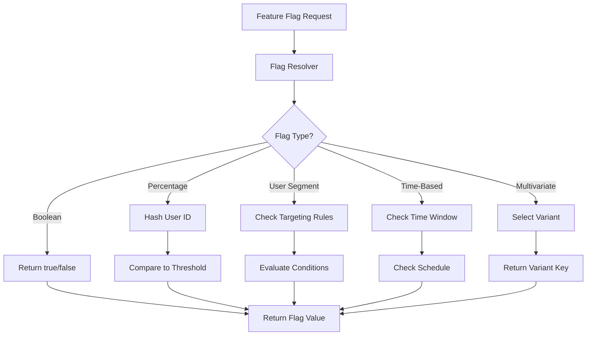
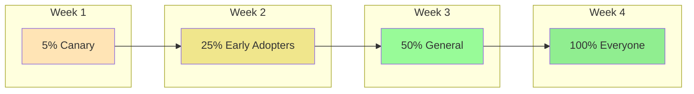
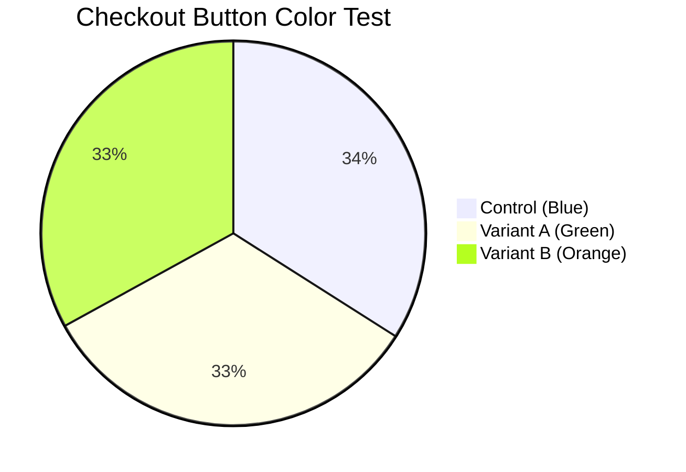
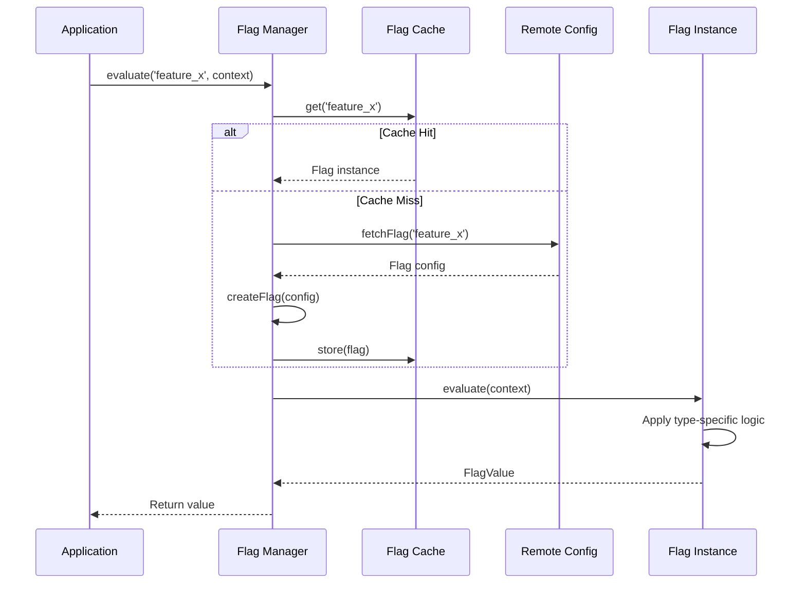

# How to Implement Flag Types Design

Author: [nawazdhandala](https://github.com/nawazdhandala)

Tags: Feature Flags, DevOps, Release Management, CI/CD

Description: Learn how to design and implement different flag types for feature management, including boolean, percentage, user-targeted, and time-based flags with practical code examples.

---

Feature flags are more than simple on/off switches. A well-designed flag type system gives you granular control over feature rollouts, A/B testing, and operational toggles. This guide walks through implementing a comprehensive flag type system that scales from simple toggles to sophisticated targeting rules.

## Why Flag Types Matter

| Flag Type | Use Case | Example |
|-----------|----------|---------|
| Boolean | Kill switches, simple feature toggles | `maintenance_mode: true` |
| Percentage | Gradual rollouts, canary releases | Roll out to 10% of users |
| User Segment | Beta testers, enterprise customers | Enable for premium tier only |
| Time-Based | Scheduled releases, limited promotions | Black Friday sale activation |
| Multivariate | A/B testing, experimentation | Test three checkout flows |

## Flag Type Architecture

A flexible flag system needs to evaluate different flag types through a consistent interface while supporting type-specific logic.



## Core Flag Interface

Start with a base interface that all flag types implement. This ensures consistent evaluation regardless of the underlying flag type.

```typescript
// Define the possible flag value types
type FlagValue = boolean | string | number | Record<string, unknown>;

// Context passed during flag evaluation
interface EvaluationContext {
  userId?: string;
  email?: string;
  userAttributes?: Record<string, string | number | boolean>;
  timestamp?: Date;
}

// Base interface for all flag types
interface Flag {
  key: string;
  type: FlagType;
  defaultValue: FlagValue;
  enabled: boolean;
  evaluate(context: EvaluationContext): FlagValue;
}

// Supported flag types
enum FlagType {
  BOOLEAN = 'boolean',
  PERCENTAGE = 'percentage',
  USER_SEGMENT = 'user_segment',
  TIME_BASED = 'time_based',
  MULTIVARIATE = 'multivariate',
}
```

## Boolean Flags

The simplest flag type returns true or false. Use these for kill switches, maintenance modes, and simple feature toggles.

```typescript
class BooleanFlag implements Flag {
  key: string;
  type: FlagType = FlagType.BOOLEAN;
  defaultValue: boolean;
  enabled: boolean;
  value: boolean;

  constructor(config: {
    key: string;
    defaultValue: boolean;
    enabled: boolean;
    value: boolean;
  }) {
    this.key = config.key;
    this.defaultValue = config.defaultValue;
    this.enabled = config.enabled;
    this.value = config.value;
  }

  // Boolean flags ignore context - they return the same value for everyone
  evaluate(_context: EvaluationContext): boolean {
    // If flag is disabled, return the default value
    if (!this.enabled) {
      return this.defaultValue;
    }
    return this.value;
  }
}

// Usage example
const maintenanceMode = new BooleanFlag({
  key: 'maintenance_mode',
  defaultValue: false,
  enabled: true,
  value: false,
});

// Simple check
if (maintenanceMode.evaluate({})) {
  showMaintenancePage();
}
```

## Percentage Flags

Percentage flags enable gradual rollouts by hashing the user ID and comparing it to a threshold. The hash ensures the same user always gets the same result (sticky assignment).

```typescript
import crypto from 'crypto';

class PercentageFlag implements Flag {
  key: string;
  type: FlagType = FlagType.PERCENTAGE;
  defaultValue: boolean;
  enabled: boolean;
  percentage: number;
  salt: string;

  constructor(config: {
    key: string;
    defaultValue: boolean;
    enabled: boolean;
    percentage: number;
    salt?: string;
  }) {
    this.key = config.key;
    this.defaultValue = config.defaultValue;
    this.enabled = config.enabled;
    // Clamp percentage between 0 and 100
    this.percentage = Math.max(0, Math.min(100, config.percentage));
    // Salt ensures different flags produce different distributions
    this.salt = config.salt || config.key;
  }

  // Generate a deterministic hash between 0-100 for a given user
  private hashUser(userId: string): number {
    const input = `${this.salt}:${userId}`;
    const hash = crypto.createHash('md5').update(input).digest('hex');
    // Take first 8 hex characters and convert to number
    const hashInt = parseInt(hash.substring(0, 8), 16);
    // Normalize to 0-100 range
    return (hashInt % 10000) / 100;
  }

  evaluate(context: EvaluationContext): boolean {
    if (!this.enabled) {
      return this.defaultValue;
    }

    // Require userId for percentage-based evaluation
    if (!context.userId) {
      console.warn(`PercentageFlag ${this.key}: No userId provided, returning default`);
      return this.defaultValue;
    }

    const userHash = this.hashUser(context.userId);
    return userHash < this.percentage;
  }
}

// Example: Roll out new checkout to 25% of users
const newCheckout = new PercentageFlag({
  key: 'new_checkout_flow',
  defaultValue: false,
  enabled: true,
  percentage: 25,
});

// Same user always gets the same result
const showNewCheckout = newCheckout.evaluate({ userId: 'user_123' });
```

## Percentage Rollout Visualization

This diagram shows how percentage flags enable controlled rollouts over time.



## User Segment Flags

User segment flags evaluate targeting rules based on user attributes. This enables features for specific user groups like beta testers, enterprise customers, or users in certain regions.

```typescript
// Supported operators for targeting conditions
type Operator = 'equals' | 'not_equals' | 'contains' | 'in' | 'not_in' | 'gt' | 'lt' | 'gte' | 'lte';

// A single targeting condition
interface TargetingCondition {
  attribute: string;
  operator: Operator;
  value: string | number | boolean | string[];
}

// A rule combines multiple conditions with AND logic
interface TargetingRule {
  conditions: TargetingCondition[];
  value: FlagValue;
}

class UserSegmentFlag implements Flag {
  key: string;
  type: FlagType = FlagType.USER_SEGMENT;
  defaultValue: FlagValue;
  enabled: boolean;
  rules: TargetingRule[];

  constructor(config: {
    key: string;
    defaultValue: FlagValue;
    enabled: boolean;
    rules: TargetingRule[];
  }) {
    this.key = config.key;
    this.defaultValue = config.defaultValue;
    this.enabled = config.enabled;
    this.rules = config.rules;
  }

  // Evaluate a single condition against the context
  private evaluateCondition(
    condition: TargetingCondition,
    context: EvaluationContext
  ): boolean {
    // Get the attribute value from context
    let attributeValue: unknown;

    if (condition.attribute === 'userId') {
      attributeValue = context.userId;
    } else if (condition.attribute === 'email') {
      attributeValue = context.email;
    } else {
      attributeValue = context.userAttributes?.[condition.attribute];
    }

    // If attribute is missing, condition fails
    if (attributeValue === undefined) {
      return false;
    }

    // Evaluate based on operator
    switch (condition.operator) {
      case 'equals':
        return attributeValue === condition.value;

      case 'not_equals':
        return attributeValue !== condition.value;

      case 'contains':
        return String(attributeValue).includes(String(condition.value));

      case 'in':
        return Array.isArray(condition.value) &&
               condition.value.includes(attributeValue as string);

      case 'not_in':
        return Array.isArray(condition.value) &&
               !condition.value.includes(attributeValue as string);

      case 'gt':
        return Number(attributeValue) > Number(condition.value);

      case 'lt':
        return Number(attributeValue) < Number(condition.value);

      case 'gte':
        return Number(attributeValue) >= Number(condition.value);

      case 'lte':
        return Number(attributeValue) <= Number(condition.value);

      default:
        return false;
    }
  }

  // Evaluate a rule (all conditions must pass)
  private evaluateRule(rule: TargetingRule, context: EvaluationContext): boolean {
    return rule.conditions.every(condition =>
      this.evaluateCondition(condition, context)
    );
  }

  evaluate(context: EvaluationContext): FlagValue {
    if (!this.enabled) {
      return this.defaultValue;
    }

    // Check rules in order, return first matching rule's value
    for (const rule of this.rules) {
      if (this.evaluateRule(rule, context)) {
        return rule.value;
      }
    }

    // No rules matched, return default
    return this.defaultValue;
  }
}

// Example: Enable advanced analytics for enterprise customers
const advancedAnalytics = new UserSegmentFlag({
  key: 'advanced_analytics',
  defaultValue: false,
  enabled: true,
  rules: [
    {
      // Rule 1: Enterprise tier users
      conditions: [
        { attribute: 'tier', operator: 'equals', value: 'enterprise' }
      ],
      value: true,
    },
    {
      // Rule 2: Beta testers on any tier
      conditions: [
        { attribute: 'beta_tester', operator: 'equals', value: true }
      ],
      value: true,
    },
    {
      // Rule 3: Users with more than 1000 API calls
      conditions: [
        { attribute: 'api_calls', operator: 'gte', value: 1000 }
      ],
      value: true,
    },
  ],
});

// Usage
const showAdvanced = advancedAnalytics.evaluate({
  userId: 'user_456',
  userAttributes: {
    tier: 'professional',
    beta_tester: true,
  },
});
```

## Time-Based Flags

Time-based flags activate features during specific time windows. Use these for scheduled releases, limited-time promotions, or features that should only be available during business hours.

```typescript
interface TimeWindow {
  startTime: Date;
  endTime: Date;
  timezone?: string;
}

class TimeBasedFlag implements Flag {
  key: string;
  type: FlagType = FlagType.TIME_BASED;
  defaultValue: FlagValue;
  enabled: boolean;
  windows: TimeWindow[];
  valueWhenActive: FlagValue;

  constructor(config: {
    key: string;
    defaultValue: FlagValue;
    enabled: boolean;
    windows: TimeWindow[];
    valueWhenActive: FlagValue;
  }) {
    this.key = config.key;
    this.defaultValue = config.defaultValue;
    this.enabled = config.enabled;
    this.windows = config.windows;
    this.valueWhenActive = config.valueWhenActive;
  }

  // Check if current time falls within any active window
  private isWithinWindow(timestamp: Date): boolean {
    return this.windows.some(window => {
      const now = timestamp.getTime();
      const start = window.startTime.getTime();
      const end = window.endTime.getTime();
      return now >= start && now <= end;
    });
  }

  evaluate(context: EvaluationContext): FlagValue {
    if (!this.enabled) {
      return this.defaultValue;
    }

    // Use provided timestamp or current time
    const timestamp = context.timestamp || new Date();

    if (this.isWithinWindow(timestamp)) {
      return this.valueWhenActive;
    }

    return this.defaultValue;
  }
}

// Example: Black Friday sale banner
const blackFridaySale = new TimeBasedFlag({
  key: 'black_friday_sale',
  defaultValue: false,
  enabled: true,
  windows: [
    {
      startTime: new Date('2026-11-27T00:00:00Z'),
      endTime: new Date('2026-11-30T23:59:59Z'),
    },
  ],
  valueWhenActive: true,
});

// Example: Feature available only during business hours
const liveChatSupport = new TimeBasedFlag({
  key: 'live_chat_support',
  defaultValue: false,
  enabled: true,
  windows: [
    {
      // Monday-Friday 9 AM - 6 PM (simplified example)
      startTime: new Date('2026-01-01T09:00:00Z'),
      endTime: new Date('2026-12-31T18:00:00Z'),
    },
  ],
  valueWhenActive: true,
});
```

## Multivariate Flags

Multivariate flags return one of several variants, enabling A/B/n testing. Each variant has a weight that determines its distribution.

```typescript
interface Variant {
  key: string;
  value: FlagValue;
  weight: number;
}

class MultivariateFlag implements Flag {
  key: string;
  type: FlagType = FlagType.MULTIVARIATE;
  defaultValue: FlagValue;
  enabled: boolean;
  variants: Variant[];
  salt: string;

  constructor(config: {
    key: string;
    defaultValue: FlagValue;
    enabled: boolean;
    variants: Variant[];
    salt?: string;
  }) {
    this.key = config.key;
    this.defaultValue = config.defaultValue;
    this.enabled = config.enabled;
    this.variants = config.variants;
    this.salt = config.salt || config.key;

    // Validate that weights sum to 100
    const totalWeight = this.variants.reduce((sum, v) => sum + v.weight, 0);
    if (Math.abs(totalWeight - 100) > 0.01) {
      console.warn(`MultivariateFlag ${this.key}: Variant weights sum to ${totalWeight}, expected 100`);
    }
  }

  // Generate a deterministic hash between 0-100 for a given user
  private hashUser(userId: string): number {
    const input = `${this.salt}:${userId}`;
    const hash = crypto.createHash('md5').update(input).digest('hex');
    const hashInt = parseInt(hash.substring(0, 8), 16);
    return (hashInt % 10000) / 100;
  }

  evaluate(context: EvaluationContext): FlagValue {
    if (!this.enabled) {
      return this.defaultValue;
    }

    if (!context.userId) {
      console.warn(`MultivariateFlag ${this.key}: No userId provided, returning default`);
      return this.defaultValue;
    }

    const userHash = this.hashUser(context.userId);

    // Walk through variants and find where user lands
    let cumulativeWeight = 0;
    for (const variant of this.variants) {
      cumulativeWeight += variant.weight;
      if (userHash < cumulativeWeight) {
        return variant.value;
      }
    }

    // Fallback (should not reach here if weights sum to 100)
    return this.defaultValue;
  }

  // Get the variant key for analytics tracking
  getVariantKey(context: EvaluationContext): string | null {
    if (!this.enabled || !context.userId) {
      return null;
    }

    const userHash = this.hashUser(context.userId);
    let cumulativeWeight = 0;

    for (const variant of this.variants) {
      cumulativeWeight += variant.weight;
      if (userHash < cumulativeWeight) {
        return variant.key;
      }
    }

    return null;
  }
}

// Example: A/B test checkout button color
const checkoutButtonTest = new MultivariateFlag({
  key: 'checkout_button_color',
  defaultValue: 'blue',
  enabled: true,
  variants: [
    { key: 'control', value: 'blue', weight: 34 },
    { key: 'variant_a', value: 'green', weight: 33 },
    { key: 'variant_b', value: 'orange', weight: 33 },
  ],
});

// Get the button color for a user
const buttonColor = checkoutButtonTest.evaluate({ userId: 'user_789' });

// Track which variant for analytics
const variantKey = checkoutButtonTest.getVariantKey({ userId: 'user_789' });
analytics.track('checkout_button_shown', { variant: variantKey });
```

## Multivariate Distribution Visualization



## Flag Manager

A flag manager provides a unified interface to fetch, cache, and evaluate flags. It handles flag type routing and caching.

```typescript
class FlagManager {
  private flags: Map<string, Flag> = new Map();
  private refreshInterval: NodeJS.Timeout | null = null;

  // Register a flag
  register(flag: Flag): void {
    this.flags.set(flag.key, flag);
  }

  // Evaluate a flag by key
  evaluate(flagKey: string, context: EvaluationContext): FlagValue {
    const flag = this.flags.get(flagKey);

    if (!flag) {
      console.warn(`Flag not found: ${flagKey}`);
      return false;
    }

    try {
      return flag.evaluate(context);
    } catch (error) {
      console.error(`Error evaluating flag ${flagKey}:`, error);
      return flag.defaultValue;
    }
  }

  // Get boolean flag value with type safety
  getBool(flagKey: string, context: EvaluationContext): boolean {
    const value = this.evaluate(flagKey, context);
    return Boolean(value);
  }

  // Get string flag value with type safety
  getString(flagKey: string, context: EvaluationContext): string {
    const value = this.evaluate(flagKey, context);
    return String(value);
  }

  // Get number flag value with type safety
  getNumber(flagKey: string, context: EvaluationContext): number {
    const value = this.evaluate(flagKey, context);
    return Number(value);
  }

  // Load flags from configuration
  loadFromConfig(configs: FlagConfig[]): void {
    for (const config of configs) {
      const flag = this.createFlag(config);
      if (flag) {
        this.register(flag);
      }
    }
  }

  // Factory method to create the appropriate flag type
  private createFlag(config: FlagConfig): Flag | null {
    switch (config.type) {
      case FlagType.BOOLEAN:
        return new BooleanFlag(config as BooleanFlagConfig);
      case FlagType.PERCENTAGE:
        return new PercentageFlag(config as PercentageFlagConfig);
      case FlagType.USER_SEGMENT:
        return new UserSegmentFlag(config as UserSegmentFlagConfig);
      case FlagType.TIME_BASED:
        return new TimeBasedFlag(config as TimeBasedFlagConfig);
      case FlagType.MULTIVARIATE:
        return new MultivariateFlag(config as MultivariateFlagConfig);
      default:
        console.warn(`Unknown flag type: ${config.type}`);
        return null;
    }
  }

  // Start periodic refresh from remote source
  startPeriodicRefresh(fetchFlags: () => Promise<FlagConfig[]>, intervalMs: number = 30000): void {
    this.refreshInterval = setInterval(async () => {
      try {
        const configs = await fetchFlags();
        this.loadFromConfig(configs);
      } catch (error) {
        console.error('Failed to refresh flags:', error);
      }
    }, intervalMs);
  }

  // Stop periodic refresh
  stopPeriodicRefresh(): void {
    if (this.refreshInterval) {
      clearInterval(this.refreshInterval);
      this.refreshInterval = null;
    }
  }
}

// Usage
const flagManager = new FlagManager();

// Register flags
flagManager.register(maintenanceMode);
flagManager.register(newCheckout);
flagManager.register(advancedAnalytics);

// Evaluate
const context = {
  userId: 'user_123',
  userAttributes: { tier: 'enterprise' },
};

if (flagManager.getBool('maintenance_mode', context)) {
  renderMaintenancePage();
} else if (flagManager.getBool('new_checkout_flow', context)) {
  renderNewCheckout();
} else {
  renderLegacyCheckout();
}
```

## Flag Evaluation Flow

This diagram shows the complete evaluation flow when a flag is requested.



## Combining Flag Types

Real-world scenarios often require combining multiple flag types. Here is how to implement a flag that uses percentage rollout within a user segment.

```typescript
class SegmentedPercentageFlag implements Flag {
  key: string;
  type: FlagType = FlagType.PERCENTAGE;
  defaultValue: FlagValue;
  enabled: boolean;

  // Segment targeting
  segmentRules: TargetingRule[];

  // Percentage within each segment
  percentage: number;
  salt: string;

  constructor(config: {
    key: string;
    defaultValue: FlagValue;
    enabled: boolean;
    segmentRules: TargetingRule[];
    percentage: number;
    salt?: string;
  }) {
    this.key = config.key;
    this.defaultValue = config.defaultValue;
    this.enabled = config.enabled;
    this.segmentRules = config.segmentRules;
    this.percentage = config.percentage;
    this.salt = config.salt || config.key;
  }

  private hashUser(userId: string): number {
    const input = `${this.salt}:${userId}`;
    const hash = crypto.createHash('md5').update(input).digest('hex');
    const hashInt = parseInt(hash.substring(0, 8), 16);
    return (hashInt % 10000) / 100;
  }

  private matchesSegment(context: EvaluationContext): boolean {
    // If no segment rules, everyone is in the segment
    if (this.segmentRules.length === 0) {
      return true;
    }

    // Check if user matches any segment rule
    for (const rule of this.segmentRules) {
      const matches = rule.conditions.every(condition => {
        const value = context.userAttributes?.[condition.attribute];
        // Simplified condition check
        return value === condition.value;
      });
      if (matches) {
        return true;
      }
    }

    return false;
  }

  evaluate(context: EvaluationContext): FlagValue {
    if (!this.enabled) {
      return this.defaultValue;
    }

    // First check if user is in the target segment
    if (!this.matchesSegment(context)) {
      return this.defaultValue;
    }

    // Then apply percentage rollout within the segment
    if (!context.userId) {
      return this.defaultValue;
    }

    const userHash = this.hashUser(context.userId);
    return userHash < this.percentage;
  }
}

// Example: Roll out to 50% of enterprise customers only
const enterpriseBetaFeature = new SegmentedPercentageFlag({
  key: 'enterprise_beta_feature',
  defaultValue: false,
  enabled: true,
  segmentRules: [
    {
      conditions: [
        { attribute: 'tier', operator: 'equals', value: 'enterprise' }
      ],
      value: true,
    },
  ],
  percentage: 50,
});
```

## Flag Configuration Storage

Store flag configurations in a format that supports all flag types.

```typescript
interface FlagConfig {
  key: string;
  type: FlagType;
  enabled: boolean;
  defaultValue: FlagValue;

  // Type-specific fields
  value?: boolean;                    // Boolean
  percentage?: number;                // Percentage
  rules?: TargetingRule[];            // UserSegment
  windows?: TimeWindow[];             // TimeBased
  variants?: Variant[];               // Multivariate
  valueWhenActive?: FlagValue;        // TimeBased
  salt?: string;                      // Percentage, Multivariate
}

// Example configuration file (flags.json)
const flagsConfig: FlagConfig[] = [
  {
    key: 'dark_mode',
    type: FlagType.BOOLEAN,
    enabled: true,
    defaultValue: false,
    value: true,
  },
  {
    key: 'new_dashboard',
    type: FlagType.PERCENTAGE,
    enabled: true,
    defaultValue: false,
    percentage: 25,
    salt: 'dashboard-2026',
  },
  {
    key: 'premium_features',
    type: FlagType.USER_SEGMENT,
    enabled: true,
    defaultValue: false,
    rules: [
      {
        conditions: [
          { attribute: 'plan', operator: 'in', value: ['pro', 'enterprise'] }
        ],
        value: true,
      },
    ],
  },
  {
    key: 'holiday_theme',
    type: FlagType.TIME_BASED,
    enabled: true,
    defaultValue: false,
    windows: [
      {
        startTime: new Date('2026-12-20T00:00:00Z'),
        endTime: new Date('2026-12-31T23:59:59Z'),
      },
    ],
    valueWhenActive: true,
  },
  {
    key: 'pricing_page_variant',
    type: FlagType.MULTIVARIATE,
    enabled: true,
    defaultValue: 'control',
    variants: [
      { key: 'control', value: 'control', weight: 50 },
      { key: 'simple', value: 'simple', weight: 25 },
      { key: 'detailed', value: 'detailed', weight: 25 },
    ],
  },
];
```

## Best Practices

| Practice | Description |
|----------|-------------|
| Use meaningful keys | `checkout_new_flow` instead of `flag_123` |
| Set sensible defaults | Default should be the safe, existing behavior |
| Add kill switches | Every feature should have a way to turn it off instantly |
| Track evaluations | Log flag evaluations for debugging and analytics |
| Clean up old flags | Remove flags once features are fully rolled out |
| Test flag combinations | Ensure flags interact correctly with each other |

## Common Pitfalls

| Pitfall | Problem | Solution |
|---------|---------|----------|
| Missing userId | Percentage flags return default for anonymous users | Implement anonymous ID generation |
| Stale configuration | Cached flags become outdated | Implement periodic refresh or push updates |
| Weight mismatch | Multivariate weights do not sum to 100 | Validate on configuration load |
| Time zone issues | Time-based flags fire at wrong times | Always use UTC and convert on display |
| Complex rules | Targeting rules become unmaintainable | Keep rules simple, use segments for reuse |

## Testing Flags

Write tests that verify flag behavior across different contexts.

```typescript
import { describe, it, expect } from 'vitest';

describe('PercentageFlag', () => {
  const flag = new PercentageFlag({
    key: 'test_feature',
    defaultValue: false,
    enabled: true,
    percentage: 50,
    salt: 'test-salt',
  });

  it('returns consistent results for the same user', () => {
    const context = { userId: 'user_123' };
    const result1 = flag.evaluate(context);
    const result2 = flag.evaluate(context);
    expect(result1).toBe(result2);
  });

  it('returns default when disabled', () => {
    const disabledFlag = new PercentageFlag({
      key: 'disabled_feature',
      defaultValue: false,
      enabled: false,
      percentage: 100,
    });
    expect(disabledFlag.evaluate({ userId: 'user_123' })).toBe(false);
  });

  it('returns default when no userId provided', () => {
    expect(flag.evaluate({})).toBe(false);
  });

  it('distributes roughly 50% at 50% threshold', () => {
    // Test with many users to verify distribution
    let enabled = 0;
    const total = 10000;

    for (let i = 0; i < total; i++) {
      if (flag.evaluate({ userId: `user_${i}` })) {
        enabled++;
      }
    }

    // Allow 5% margin of error
    const ratio = enabled / total;
    expect(ratio).toBeGreaterThan(0.45);
    expect(ratio).toBeLessThan(0.55);
  });
});
```

## Summary

A well-designed flag type system provides the flexibility to handle diverse feature management scenarios:

- **Boolean flags** for simple on/off toggles and kill switches
- **Percentage flags** for gradual rollouts with sticky user assignment
- **User segment flags** for targeting specific user groups
- **Time-based flags** for scheduled releases and promotions
- **Multivariate flags** for A/B testing with multiple variants

Start with boolean flags for basic feature toggles, then add percentage-based rollouts as you gain confidence. Use targeting rules for beta programs and experiments. The key is building a consistent evaluation interface that makes it easy to swap flag types without changing application code.

