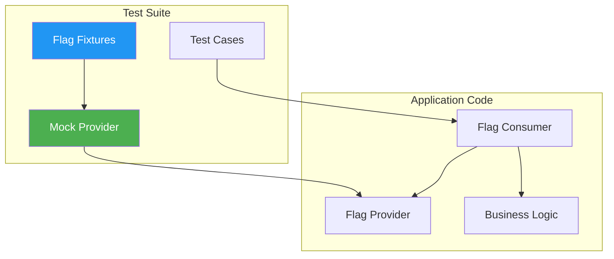
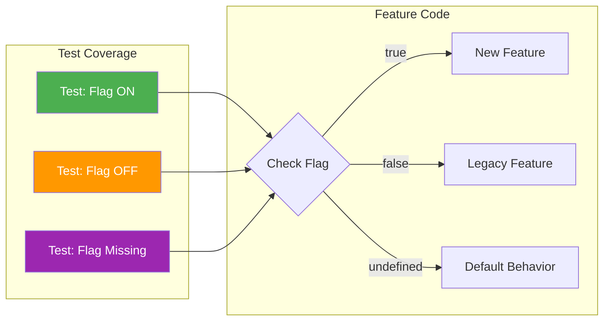
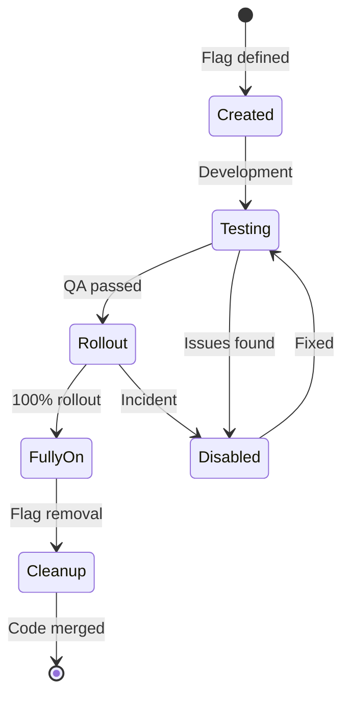
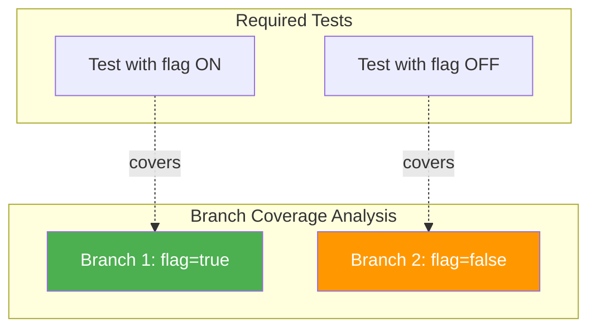

# How to Create Flag Unit Testing

Author: [nawazdhandala](https://github.com/nawazdhandala)

Tags: Feature Flags, Unit Testing, TDD, Development

Description: Learn how to write effective unit tests for feature flag implementations.

---

Feature flags are powerful tools for controlling feature rollouts, A/B testing, and managing risk in production. However, they introduce conditional logic that can easily become a testing blind spot. This guide covers comprehensive strategies for unit testing feature flag implementations to ensure your code behaves correctly regardless of flag state.

## Why Test Feature Flags?

Feature flags create branching logic that doubles your testing surface:

| Without Flags | With Flags |
|--------------|------------|
| 1 code path | 2+ code paths per flag |
| Simple assertions | State-dependent assertions |
| Static behavior | Dynamic behavior |
| Single deployment | Multiple configurations |

Untested flag logic leads to:
- **Silent failures** when flags toggle unexpectedly
- **Dead code** accumulating after flags are removed
- **Integration bugs** from flag interaction effects
- **Production incidents** from untested flag states

## Feature Flag Testing Architecture



## Mocking Flag Providers

The foundation of flag testing is controlling flag state through mocks. Never rely on actual flag provider connections in unit tests.

### Creating a Mock Flag Provider

This mock provider allows tests to control flag values without connecting to LaunchDarkly, Split, or other services. It implements the same interface as your real provider.

```javascript
// src/flags/mock-flag-provider.js
class MockFlagProvider {
  constructor() {
    // Store flag overrides set by tests
    this.flags = new Map();
    // Store default values for flags not explicitly set
    this.defaults = new Map();
  }

  // Set a flag value for testing
  setFlag(flagKey, value) {
    this.flags.set(flagKey, value);
    return this; // Allow chaining
  }

  // Set multiple flags at once
  setFlags(flagMap) {
    Object.entries(flagMap).forEach(([key, value]) => {
      this.flags.set(key, value);
    });
    return this;
  }

  // Get a flag value - returns override, then default, then fallback
  getFlag(flagKey, defaultValue = false) {
    if (this.flags.has(flagKey)) {
      return this.flags.get(flagKey);
    }
    if (this.defaults.has(flagKey)) {
      return this.defaults.get(flagKey);
    }
    return defaultValue;
  }

  // Reset all flags between tests
  reset() {
    this.flags.clear();
    return this;
  }

  // Set default values that apply when no override exists
  setDefaults(defaultMap) {
    Object.entries(defaultMap).forEach(([key, value]) => {
      this.defaults.set(key, value);
    });
    return this;
  }
}

module.exports = { MockFlagProvider };
```

### Using the Mock in Tests

```javascript
const { MockFlagProvider } = require('../src/flags/mock-flag-provider');
const { CheckoutService } = require('../src/services/checkout');

describe('CheckoutService', () => {
  let flagProvider;
  let checkoutService;

  beforeEach(() => {
    // Create fresh mock for each test
    flagProvider = new MockFlagProvider();
    // Inject mock provider into service
    checkoutService = new CheckoutService(flagProvider);
  });

  it('should use new payment flow when flag enabled', async () => {
    // Arrange - enable the flag
    flagProvider.setFlag('new-payment-flow', true);

    // Act
    const result = await checkoutService.processPayment({
      amount: 100,
      customerId: 'cus_123',
    });

    // Assert - verify new flow behavior
    expect(result.processor).toBe('stripe-v2');
    expect(result.features).toContain('3d-secure');
  });

  it('should use legacy payment flow when flag disabled', async () => {
    // Arrange - disable the flag
    flagProvider.setFlag('new-payment-flow', false);

    // Act
    const result = await checkoutService.processPayment({
      amount: 100,
      customerId: 'cus_123',
    });

    // Assert - verify legacy flow behavior
    expect(result.processor).toBe('stripe-v1');
    expect(result.features).not.toContain('3d-secure');
  });
});
```

## Testing Both Paths

Every feature flag creates at least two code paths. You must test both the enabled and disabled states systematically.

### The Both-Paths Pattern



### Parametrized Tests for Flag States

Use parametrized tests to ensure both paths are tested with the same rigor. This pattern makes it impossible to accidentally test only one state.

```javascript
describe('SearchService', () => {
  // Define test cases for both flag states
  const flagStates = [
    { flagValue: true, description: 'enabled', expectedEngine: 'elasticsearch' },
    { flagValue: false, description: 'disabled', expectedEngine: 'postgres' },
  ];

  // Run same test logic for each flag state
  flagStates.forEach(({ flagValue, description, expectedEngine }) => {
    describe(`when new-search-engine flag is ${description}`, () => {
      let flagProvider;
      let searchService;

      beforeEach(() => {
        flagProvider = new MockFlagProvider();
        flagProvider.setFlag('new-search-engine', flagValue);
        searchService = new SearchService(flagProvider);
      });

      it(`should use ${expectedEngine} for queries`, async () => {
        const result = await searchService.search('test query');
        expect(result.engine).toBe(expectedEngine);
      });

      it('should return consistent result format', async () => {
        const result = await searchService.search('test query');
        // Both paths should return the same shape
        expect(result).toHaveProperty('items');
        expect(result).toHaveProperty('total');
        expect(result).toHaveProperty('page');
      });

      it('should handle empty results', async () => {
        const result = await searchService.search('nonexistent-term-xyz');
        expect(result.items).toEqual([]);
        expect(result.total).toBe(0);
      });
    });
  });
});
```

### Testing Multiple Flags Interaction

When multiple flags affect the same feature, test their combinations:

```javascript
describe('NotificationService with multiple flags', () => {
  // Generate all combinations of flag states
  const flagCombinations = [
    { emailV2: false, pushEnabled: false },
    { emailV2: false, pushEnabled: true },
    { emailV2: true, pushEnabled: false },
    { emailV2: true, pushEnabled: true },
  ];

  flagCombinations.forEach(({ emailV2, pushEnabled }) => {
    describe(`emailV2=${emailV2}, pushEnabled=${pushEnabled}`, () => {
      let flagProvider;
      let notificationService;

      beforeEach(() => {
        flagProvider = new MockFlagProvider();
        flagProvider.setFlags({
          'email-v2': emailV2,
          'push-notifications': pushEnabled,
        });
        notificationService = new NotificationService(flagProvider);
      });

      it('should send notifications through correct channels', async () => {
        const result = await notificationService.notify('user_123', 'Hello');

        // Verify email version
        if (emailV2) {
          expect(result.emailProvider).toBe('sendgrid');
        } else {
          expect(result.emailProvider).toBe('ses');
        }

        // Verify push notification state
        expect(result.pushSent).toBe(pushEnabled);
      });
    });
  });
});
```

## Flag State Fixtures

Organize flag configurations into reusable fixtures that represent realistic scenarios.

### Creating Flag Fixtures

```javascript
// tests/fixtures/flag-fixtures.js

// Represents production defaults before any rollout
const productionDefaults = {
  'new-checkout': false,
  'dark-mode': false,
  'beta-features': false,
  'analytics-v2': true,  // Already fully rolled out
};

// Represents state during gradual rollout
const partialRollout = {
  'new-checkout': true,  // Being tested
  'dark-mode': false,
  'beta-features': false,
  'analytics-v2': true,
};

// Represents all features enabled (internal testing)
const allFeaturesEnabled = {
  'new-checkout': true,
  'dark-mode': true,
  'beta-features': true,
  'analytics-v2': true,
};

// Represents beta user configuration
const betaUserFlags = {
  'new-checkout': true,
  'dark-mode': true,
  'beta-features': true,
  'analytics-v2': true,
};

// Represents flags during an incident (kill switches activated)
const incidentMode = {
  'new-checkout': false,  // Kill switch activated
  'dark-mode': false,
  'beta-features': false,
  'analytics-v2': false,  // Rolled back
};

module.exports = {
  productionDefaults,
  partialRollout,
  allFeaturesEnabled,
  betaUserFlags,
  incidentMode,
};
```

### Using Fixtures in Tests

```javascript
const fixtures = require('./fixtures/flag-fixtures');
const { MockFlagProvider } = require('../src/flags/mock-flag-provider');

describe('Application with different flag configurations', () => {
  describe('production defaults', () => {
    let flagProvider;

    beforeEach(() => {
      flagProvider = new MockFlagProvider();
      flagProvider.setFlags(fixtures.productionDefaults);
    });

    it('should show legacy checkout', async () => {
      const app = new Application(flagProvider);
      const checkout = await app.getCheckout();
      expect(checkout.version).toBe('v1');
    });
  });

  describe('beta user experience', () => {
    let flagProvider;

    beforeEach(() => {
      flagProvider = new MockFlagProvider();
      flagProvider.setFlags(fixtures.betaUserFlags);
    });

    it('should show all beta features', async () => {
      const app = new Application(flagProvider);
      expect(await app.hasFeature('new-checkout')).toBe(true);
      expect(await app.hasFeature('dark-mode')).toBe(true);
      expect(await app.hasFeature('beta-features')).toBe(true);
    });
  });

  describe('incident mode', () => {
    let flagProvider;

    beforeEach(() => {
      flagProvider = new MockFlagProvider();
      flagProvider.setFlags(fixtures.incidentMode);
    });

    it('should disable all experimental features', async () => {
      const app = new Application(flagProvider);
      // All kill switches should be active
      expect(await app.hasFeature('new-checkout')).toBe(false);
      expect(await app.hasFeature('analytics-v2')).toBe(false);
    });
  });
});
```

## Test Organization Patterns

Organize flag tests to make coverage gaps visible and maintenance easier.

### Folder Structure

```
tests/
  flags/
    __fixtures__/
      flag-states.js
      user-segments.js
    __mocks__/
      flag-provider.js
    new-checkout.test.js      # Tests for new-checkout flag
    dark-mode.test.js         # Tests for dark-mode flag
    flag-interactions.test.js # Tests for flag combinations
  integration/
    flag-rollout.test.js      # End-to-end flag tests
```

### Test Naming Convention

Use descriptive names that indicate flag state:

```javascript
describe('CheckoutPage', () => {
  describe('[FLAG: new-checkout = ON]', () => {
    it('should render new checkout form', () => {});
    it('should validate card with Stripe Elements', () => {});
    it('should show express checkout options', () => {});
  });

  describe('[FLAG: new-checkout = OFF]', () => {
    it('should render legacy checkout form', () => {});
    it('should validate card with custom validator', () => {});
    it('should hide express checkout options', () => {});
  });

  describe('[FLAG: new-checkout = MISSING]', () => {
    it('should default to legacy checkout', () => {});
    it('should log warning about missing flag', () => {});
  });
});
```

### Testing Flag Lifecycle



Create tests that match each lifecycle stage:

```javascript
describe('Feature Flag Lifecycle Tests', () => {
  describe('Stage: Development (flag in testing)', () => {
    it('should work when flag is enabled', () => {});
    it('should work when flag is disabled', () => {});
  });

  describe('Stage: Rollout (gradual enablement)', () => {
    it('should handle percentage-based rollout', () => {});
    it('should be consistent for same user', () => {});
  });

  describe('Stage: Cleanup (flag removal)', () => {
    it('should work without flag check (pre-removal test)', () => {});
  });
});
```

## Coverage Considerations

Feature flags can hide code from coverage tools. Use these strategies to ensure complete coverage.

### Coverage Configuration

```javascript
// jest.config.js
module.exports = {
  collectCoverageFrom: [
    'src/**/*.js',
    '!src/**/*.test.js',
  ],
  coverageThreshold: {
    global: {
      branches: 90,  // Important: branch coverage catches untested flag paths
      functions: 90,
      lines: 90,
      statements: 90,
    },
  },
};
```

### Branch Coverage for Flags



Ensure both branches are tested:

```javascript
// src/services/pricing.js
class PricingService {
  constructor(flagProvider) {
    this.flags = flagProvider;
  }

  calculateDiscount(amount, userTier) {
    // Branch 1: New discount algorithm
    if (this.flags.getFlag('new-discount-algorithm')) {
      return this.newDiscountCalculation(amount, userTier);
    }
    // Branch 2: Legacy discount algorithm
    return this.legacyDiscountCalculation(amount, userTier);
  }
}

// tests/pricing.test.js
describe('PricingService.calculateDiscount', () => {
  // Test Branch 1
  it('should use new algorithm when flag enabled', () => {
    const flagProvider = new MockFlagProvider();
    flagProvider.setFlag('new-discount-algorithm', true);
    const service = new PricingService(flagProvider);

    const discount = service.calculateDiscount(100, 'gold');
    expect(discount).toBe(15); // New algorithm result
  });

  // Test Branch 2
  it('should use legacy algorithm when flag disabled', () => {
    const flagProvider = new MockFlagProvider();
    flagProvider.setFlag('new-discount-algorithm', false);
    const service = new PricingService(flagProvider);

    const discount = service.calculateDiscount(100, 'gold');
    expect(discount).toBe(10); // Legacy algorithm result
  });
});
```

### Tracking Flag Coverage

Create a custom reporter to track which flags have test coverage:

```javascript
// tests/utils/flag-coverage-tracker.js
class FlagCoverageTracker {
  constructor() {
    this.testedFlags = new Map();
  }

  recordFlagTest(flagName, state) {
    if (!this.testedFlags.has(flagName)) {
      this.testedFlags.set(flagName, new Set());
    }
    this.testedFlags.get(flagName).add(state);
  }

  getReport() {
    const report = {};
    this.testedFlags.forEach((states, flag) => {
      report[flag] = {
        testedStates: Array.from(states),
        hasBothStates: states.has(true) && states.has(false),
      };
    });
    return report;
  }

  getMissingCoverage() {
    const missing = [];
    this.testedFlags.forEach((states, flag) => {
      if (!states.has(true)) missing.push(`${flag}: missing ON test`);
      if (!states.has(false)) missing.push(`${flag}: missing OFF test`);
    });
    return missing;
  }
}

module.exports = { FlagCoverageTracker };
```

## Edge Case Testing

Feature flags introduce unique edge cases that require specific testing strategies.

### Testing Default Values

What happens when a flag doesn't exist or the provider fails?

```javascript
describe('Flag edge cases', () => {
  describe('missing flag', () => {
    it('should use default value when flag not defined', () => {
      const flagProvider = new MockFlagProvider();
      // Note: 'undefined-flag' is never set

      const service = new FeatureService(flagProvider);
      const result = service.getFeature('undefined-flag');

      // Should fall back to safe default
      expect(result).toBe(false);
    });

    it('should use provided default when flag missing', () => {
      const flagProvider = new MockFlagProvider();

      // getFlag with explicit default
      const value = flagProvider.getFlag('missing-flag', 'custom-default');
      expect(value).toBe('custom-default');
    });
  });

  describe('flag provider errors', () => {
    it('should handle provider timeout gracefully', async () => {
      const flagProvider = new MockFlagProvider();
      // Simulate timeout
      flagProvider.getFlag = jest.fn().mockImplementation(() => {
        throw new Error('Provider timeout');
      });

      const service = new FeatureService(flagProvider);

      // Should not throw, should use safe default
      expect(() => service.getFeature('any-flag')).not.toThrow();
    });

    it('should log errors when provider fails', async () => {
      const consoleSpy = jest.spyOn(console, 'error');
      const flagProvider = new MockFlagProvider();
      flagProvider.getFlag = jest.fn().mockImplementation(() => {
        throw new Error('Connection failed');
      });

      const service = new FeatureService(flagProvider);
      service.getFeature('any-flag');

      expect(consoleSpy).toHaveBeenCalledWith(
        expect.stringContaining('Flag provider error')
      );
    });
  });
});
```

### Testing Flag Value Types

Flags can be boolean, string, number, or JSON. Test type handling:

```javascript
describe('Flag value types', () => {
  let flagProvider;

  beforeEach(() => {
    flagProvider = new MockFlagProvider();
  });

  it('should handle boolean flags', () => {
    flagProvider.setFlag('bool-flag', true);
    expect(flagProvider.getFlag('bool-flag')).toBe(true);

    flagProvider.setFlag('bool-flag', false);
    expect(flagProvider.getFlag('bool-flag')).toBe(false);
  });

  it('should handle string flags', () => {
    flagProvider.setFlag('string-flag', 'variant-a');
    expect(flagProvider.getFlag('string-flag')).toBe('variant-a');
  });

  it('should handle numeric flags', () => {
    flagProvider.setFlag('number-flag', 42);
    expect(flagProvider.getFlag('number-flag')).toBe(42);
  });

  it('should handle JSON flags', () => {
    const config = {
      maxRetries: 3,
      timeout: 5000,
      endpoints: ['primary', 'backup'],
    };
    flagProvider.setFlag('json-flag', config);
    expect(flagProvider.getFlag('json-flag')).toEqual(config);
  });

  it('should handle null and undefined', () => {
    flagProvider.setFlag('null-flag', null);
    expect(flagProvider.getFlag('null-flag')).toBeNull();

    // Undefined flag should return default
    expect(flagProvider.getFlag('undefined-flag', 'default')).toBe('default');
  });
});
```

### Testing User Targeting

When flags target specific users or segments:

```javascript
describe('User-targeted flags', () => {
  let flagProvider;

  beforeEach(() => {
    flagProvider = new MockFlagProvider();
  });

  it('should return different values for different users', () => {
    // Mock user-specific flag evaluation
    flagProvider.getFlagForUser = jest.fn().mockImplementation((flag, userId) => {
      const betaUsers = ['user_beta1', 'user_beta2'];
      if (flag === 'beta-feature' && betaUsers.includes(userId)) {
        return true;
      }
      return false;
    });

    expect(flagProvider.getFlagForUser('beta-feature', 'user_beta1')).toBe(true);
    expect(flagProvider.getFlagForUser('beta-feature', 'user_regular')).toBe(false);
  });

  it('should handle percentage rollouts consistently', () => {
    // User should always get same value (consistent hashing)
    flagProvider.getFlagForUser = jest.fn().mockImplementation((flag, userId) => {
      // Simulate percentage rollout with consistent hashing
      const hash = userId.split('').reduce((a, b) => a + b.charCodeAt(0), 0);
      return hash % 100 < 50; // 50% rollout
    });

    const user1Result1 = flagProvider.getFlagForUser('rollout-flag', 'user_123');
    const user1Result2 = flagProvider.getFlagForUser('rollout-flag', 'user_123');

    // Same user should get same result
    expect(user1Result1).toBe(user1Result2);
  });
});
```

### Testing Flag Changes at Runtime

```javascript
describe('Runtime flag changes', () => {
  it('should reflect flag changes immediately', () => {
    const flagProvider = new MockFlagProvider();
    const service = new DynamicService(flagProvider);

    // Initial state
    flagProvider.setFlag('feature-x', false);
    expect(service.isFeatureEnabled('feature-x')).toBe(false);

    // Change flag at runtime
    flagProvider.setFlag('feature-x', true);
    expect(service.isFeatureEnabled('feature-x')).toBe(true);
  });

  it('should handle rapid flag toggles', () => {
    const flagProvider = new MockFlagProvider();
    const service = new DynamicService(flagProvider);
    const results = [];

    // Rapid toggles
    for (let i = 0; i < 10; i++) {
      flagProvider.setFlag('toggle-flag', i % 2 === 0);
      results.push(service.isFeatureEnabled('toggle-flag'));
    }

    // Should alternate correctly
    expect(results).toEqual([true, false, true, false, true, false, true, false, true, false]);
  });
});
```

## Complete Test Suite Example

Here is a comprehensive test suite demonstrating all patterns:

```javascript
// tests/feature-flags.test.js
const { MockFlagProvider } = require('./mocks/flag-provider');
const { PaymentService } = require('../src/services/payment');
const fixtures = require('./fixtures/flag-fixtures');

describe('PaymentService Feature Flag Tests', () => {
  let flagProvider;
  let paymentService;

  // Setup fresh instances before each test
  beforeEach(() => {
    flagProvider = new MockFlagProvider();
    paymentService = new PaymentService(flagProvider);
  });

  // ===========================================
  // SECTION 1: Both Paths Testing
  // ===========================================
  describe('new-payment-processor flag', () => {
    describe('[FLAG: ON]', () => {
      beforeEach(() => {
        flagProvider.setFlag('new-payment-processor', true);
      });

      it('should use Stripe v2 API', async () => {
        const result = await paymentService.processPayment(1000, 'cus_123');
        expect(result.processor).toBe('stripe-v2');
      });

      it('should support 3D Secure', async () => {
        const result = await paymentService.processPayment(1000, 'cus_123');
        expect(result.supports3DS).toBe(true);
      });

      it('should return new receipt format', async () => {
        const result = await paymentService.processPayment(1000, 'cus_123');
        expect(result.receipt).toHaveProperty('qrCode');
      });
    });

    describe('[FLAG: OFF]', () => {
      beforeEach(() => {
        flagProvider.setFlag('new-payment-processor', false);
      });

      it('should use Stripe v1 API', async () => {
        const result = await paymentService.processPayment(1000, 'cus_123');
        expect(result.processor).toBe('stripe-v1');
      });

      it('should not support 3D Secure', async () => {
        const result = await paymentService.processPayment(1000, 'cus_123');
        expect(result.supports3DS).toBe(false);
      });

      it('should return legacy receipt format', async () => {
        const result = await paymentService.processPayment(1000, 'cus_123');
        expect(result.receipt).not.toHaveProperty('qrCode');
      });
    });
  });

  // ===========================================
  // SECTION 2: Fixture-Based Testing
  // ===========================================
  describe('with production defaults', () => {
    beforeEach(() => {
      flagProvider.setFlags(fixtures.productionDefaults);
    });

    it('should use all legacy features', async () => {
      const result = await paymentService.processPayment(1000, 'cus_123');
      expect(result.processor).toBe('stripe-v1');
    });
  });

  describe('with beta user flags', () => {
    beforeEach(() => {
      flagProvider.setFlags(fixtures.betaUserFlags);
    });

    it('should use all new features', async () => {
      const result = await paymentService.processPayment(1000, 'cus_123');
      expect(result.processor).toBe('stripe-v2');
    });
  });

  // ===========================================
  // SECTION 3: Edge Case Testing
  // ===========================================
  describe('edge cases', () => {
    it('should use default when flag missing', async () => {
      // Flag not set - should use safe default
      const result = await paymentService.processPayment(1000, 'cus_123');
      expect(result.processor).toBe('stripe-v1'); // Default to legacy
    });

    it('should handle provider errors gracefully', async () => {
      flagProvider.getFlag = jest.fn().mockImplementation(() => {
        throw new Error('Provider unavailable');
      });

      // Should not throw, should use default
      const result = await paymentService.processPayment(1000, 'cus_123');
      expect(result.processor).toBe('stripe-v1');
    });

    it('should handle null flag values', async () => {
      flagProvider.setFlag('new-payment-processor', null);

      const result = await paymentService.processPayment(1000, 'cus_123');
      // Null should be treated as falsy
      expect(result.processor).toBe('stripe-v1');
    });
  });

  // ===========================================
  // SECTION 4: Flag Interaction Testing
  // ===========================================
  describe('flag interactions', () => {
    it('should handle multiple flags correctly', async () => {
      flagProvider.setFlags({
        'new-payment-processor': true,
        'enhanced-fraud-detection': true,
      });

      const result = await paymentService.processPayment(1000, 'cus_123');

      expect(result.processor).toBe('stripe-v2');
      expect(result.fraudCheck).toBe('enhanced');
    });

    it('should handle conflicting flags gracefully', async () => {
      flagProvider.setFlags({
        'new-payment-processor': true,
        'force-legacy-mode': true, // Override flag
      });

      const result = await paymentService.processPayment(1000, 'cus_123');

      // force-legacy-mode should take precedence
      expect(result.processor).toBe('stripe-v1');
    });
  });
});
```

## Summary

| Pattern | Purpose |
|---------|---------|
| **Mock Provider** | Control flag state in tests |
| **Both Paths Testing** | Ensure all branches are covered |
| **Flag Fixtures** | Reusable flag configurations |
| **Test Organization** | Clear structure for flag tests |
| **Coverage Tracking** | Identify untested flag states |
| **Edge Case Testing** | Handle failures gracefully |

Effective feature flag testing requires treating flags as first-class citizens in your test strategy. By mocking providers, testing both paths, using fixtures, and covering edge cases, you ensure your application behaves correctly regardless of flag state. This discipline prevents production incidents and makes flag cleanup much safer.
