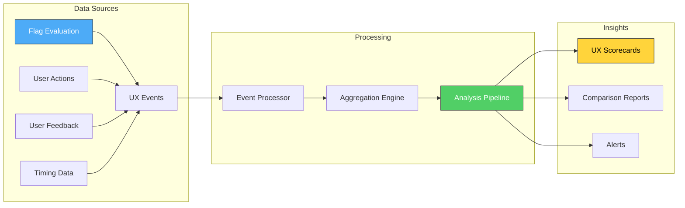
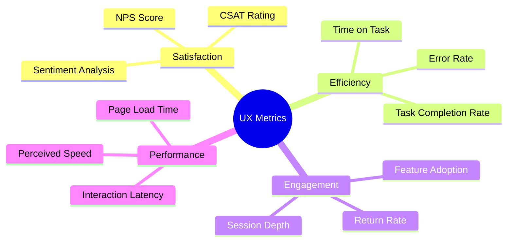
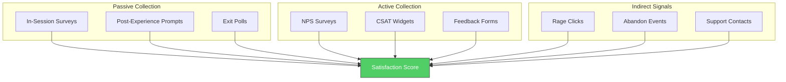
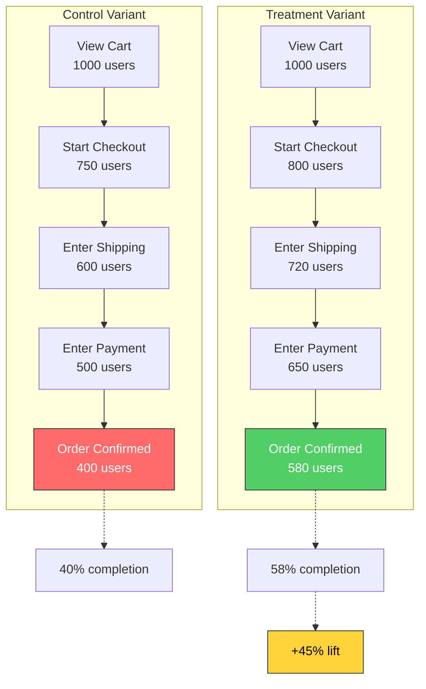
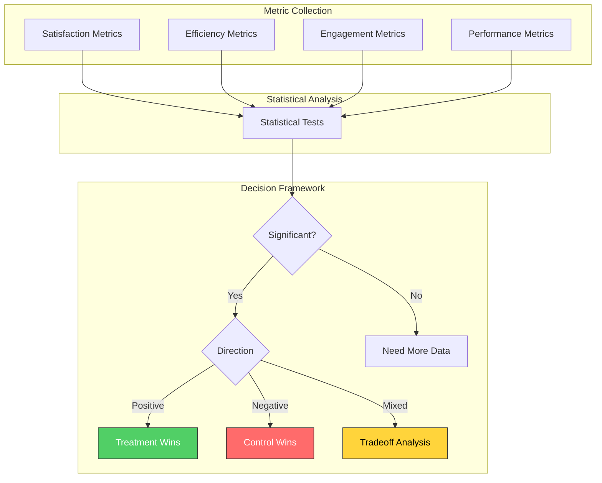
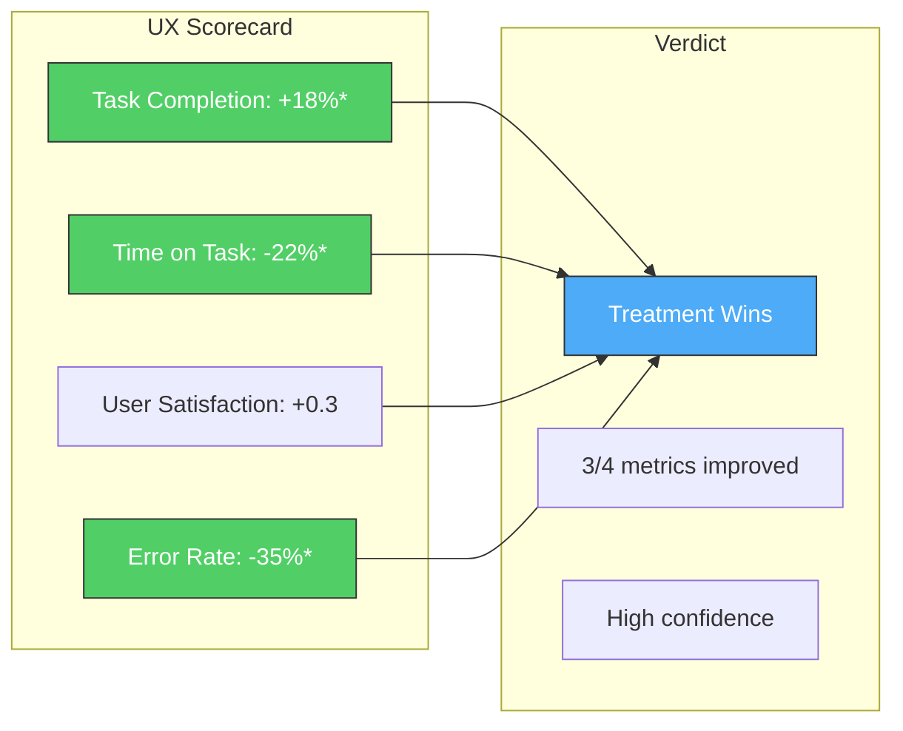
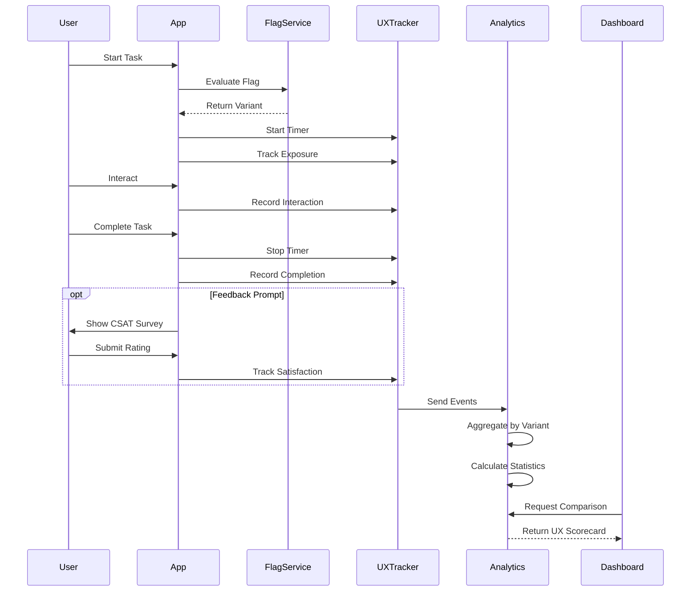

# How to Create Flag User Experience Impact

Author: [nawazdhandala](https://github.com/nawazdhandala)

Tags: Feature Flags, UX, Analytics, User Research

Description: Learn how to measure user experience impact of feature flags.

---

Feature flags are powerful tools for controlling feature rollouts, but their real value emerges when you measure how they affect user experience. This guide covers practical techniques for quantifying UX impact, from defining metrics to collecting feedback and running meaningful A/B comparisons. When you connect flag states to user outcomes, you transform guesswork into data-driven product decisions.

## Why Measure UX Impact of Feature Flags

Shipping a feature is only half the battle. Understanding whether users actually benefit from it is what separates successful product teams from those who ship blindly. Feature flags create natural experiment boundaries that let you compare user experience across different cohorts.

Without UX impact measurement, you might:

- Keep a feature that frustrates users because metrics look flat
- Remove a feature that improves satisfaction but does not show up in conversion numbers
- Miss opportunities to iterate because you lack specific feedback
- Make decisions based on loudest voices instead of representative data

With proper UX measurement, every flag becomes an opportunity to learn what actually helps users accomplish their goals.

## The UX Impact Measurement Framework

Measuring user experience impact requires capturing data at multiple touchpoints. Here is the high-level architecture:



The framework has three stages:

1. **Data Sources:** Capture flag states, user behaviors, feedback signals, and performance metrics
2. **Processing:** Connect events to flag variants and compute aggregate metrics
3. **Insights:** Generate scorecards, comparisons, and alerts that drive decisions

## Defining UX Metrics

Before collecting data, you need to define what user experience means for your product. UX metrics fall into several categories, each measuring different aspects of the user journey.

### Core UX Metric Categories



### UX Metrics Interface

Define a structured approach to tracking UX metrics:

```typescript
interface UXMetric {
  // Unique identifier for this metric
  metricKey: string;

  // Human-readable name
  name: string;

  // What aspect of UX this measures
  category: 'satisfaction' | 'efficiency' | 'engagement' | 'performance';

  // How to calculate this metric
  aggregationType: 'average' | 'median' | 'percentile' | 'rate' | 'count';

  // What direction is better
  direction: 'higher_is_better' | 'lower_is_better';

  // Unit of measurement
  unit: string;

  // Minimum sample size for statistical validity
  minimumSampleSize: number;
}

const uxMetricDefinitions: UXMetric[] = [
  {
    metricKey: 'task_completion_rate',
    name: 'Task Completion Rate',
    category: 'efficiency',
    aggregationType: 'rate',
    direction: 'higher_is_better',
    unit: 'percentage',
    minimumSampleSize: 100,
  },
  {
    metricKey: 'time_on_task',
    name: 'Time on Task',
    category: 'efficiency',
    aggregationType: 'median',
    direction: 'lower_is_better',
    unit: 'seconds',
    minimumSampleSize: 50,
  },
  {
    metricKey: 'user_satisfaction_score',
    name: 'User Satisfaction Score',
    category: 'satisfaction',
    aggregationType: 'average',
    direction: 'higher_is_better',
    unit: 'score (1-5)',
    minimumSampleSize: 30,
  },
  {
    metricKey: 'error_rate',
    name: 'User Error Rate',
    category: 'efficiency',
    aggregationType: 'rate',
    direction: 'lower_is_better',
    unit: 'percentage',
    minimumSampleSize: 100,
  },
  {
    metricKey: 'interaction_latency_p95',
    name: 'Interaction Latency (P95)',
    category: 'performance',
    aggregationType: 'percentile',
    direction: 'lower_is_better',
    unit: 'milliseconds',
    minimumSampleSize: 200,
  },
];
```

## User Satisfaction Tracking

User satisfaction is the most direct measure of UX impact. It captures how users feel about their experience, which behavioral metrics often miss.

### Satisfaction Collection Points



### Implementing Satisfaction Tracking

```typescript
interface SatisfactionEvent {
  eventId: string;
  userId: string;
  sessionId: string;
  timestamp: Date;

  // Survey response
  surveyType: 'nps' | 'csat' | 'thumbs' | 'stars' | 'custom';
  score: number;
  maxScore: number;

  // Context
  flagKey?: string;
  variant?: string;
  trigger: 'post_task' | 'time_based' | 'exit_intent' | 'manual';

  // Optional qualitative feedback
  comment?: string;
  tags?: string[];
}

class SatisfactionTracker {
  private eventQueue: SatisfactionEvent[] = [];
  private surveyShownMap = new Map<string, number>();
  private minSurveyInterval = 7 * 24 * 60 * 60 * 1000; // 7 days

  constructor(
    private eventEndpoint: string,
    private flagContext: { flagKey: string; variant: string }
  ) {}

  // Check if we should show a survey to this user
  shouldShowSurvey(userId: string): boolean {
    const lastShown = this.surveyShownMap.get(userId);
    if (lastShown && Date.now() - lastShown < this.minSurveyInterval) {
      return false;
    }
    return true;
  }

  // Track NPS response (-10 to 10 scale normalized to 0-10)
  trackNPS(
    userId: string,
    sessionId: string,
    score: number,
    comment?: string
  ): void {
    this.trackSatisfaction({
      userId,
      sessionId,
      surveyType: 'nps',
      score: Math.max(0, Math.min(10, score)),
      maxScore: 10,
      trigger: 'post_task',
      comment,
    });
  }

  // Track CSAT response (1-5 scale)
  trackCSAT(
    userId: string,
    sessionId: string,
    score: number,
    comment?: string
  ): void {
    this.trackSatisfaction({
      userId,
      sessionId,
      surveyType: 'csat',
      score: Math.max(1, Math.min(5, score)),
      maxScore: 5,
      trigger: 'post_task',
      comment,
    });
  }

  // Track simple thumbs up/down
  trackThumbsVote(
    userId: string,
    sessionId: string,
    isPositive: boolean
  ): void {
    this.trackSatisfaction({
      userId,
      sessionId,
      surveyType: 'thumbs',
      score: isPositive ? 1 : 0,
      maxScore: 1,
      trigger: 'manual',
    });
  }

  private trackSatisfaction(
    data: Omit<SatisfactionEvent, 'eventId' | 'timestamp' | 'flagKey' | 'variant'>
  ): void {
    const event: SatisfactionEvent = {
      eventId: this.generateId(),
      timestamp: new Date(),
      flagKey: this.flagContext.flagKey,
      variant: this.flagContext.variant,
      ...data,
    };

    this.eventQueue.push(event);
    this.surveyShownMap.set(data.userId, Date.now());
    this.flush();
  }

  private async flush(): Promise<void> {
    if (this.eventQueue.length === 0) return;

    const events = [...this.eventQueue];
    this.eventQueue = [];

    try {
      await fetch(this.eventEndpoint, {
        method: 'POST',
        headers: { 'Content-Type': 'application/json' },
        body: JSON.stringify({ events }),
      });
    } catch (error) {
      this.eventQueue = [...events, ...this.eventQueue];
      console.error('Failed to flush satisfaction events:', error);
    }
  }

  private generateId(): string {
    return `sat_${Date.now()}_${Math.random().toString(36).substr(2, 9)}`;
  }
}
```

### Calculating NPS by Flag Variant

```sql
-- Calculate NPS score by flag variant
WITH nps_responses AS (
  SELECT
    flag_key,
    variant,
    user_id,
    score,
    CASE
      WHEN score >= 9 THEN 'promoter'
      WHEN score >= 7 THEN 'passive'
      ELSE 'detractor'
    END as category
  FROM satisfaction_events
  WHERE survey_type = 'nps'
    AND timestamp >= CURRENT_DATE - INTERVAL '30 days'
),
nps_counts AS (
  SELECT
    flag_key,
    variant,
    COUNT(*) as total_responses,
    COUNT(*) FILTER (WHERE category = 'promoter') as promoters,
    COUNT(*) FILTER (WHERE category = 'detractor') as detractors
  FROM nps_responses
  GROUP BY flag_key, variant
)
SELECT
  flag_key,
  variant,
  total_responses,
  promoters,
  detractors,
  ROUND(
    ((promoters::float / total_responses) - (detractors::float / total_responses)) * 100,
    1
  ) as nps_score
FROM nps_counts
WHERE total_responses >= 30
ORDER BY flag_key, nps_score DESC;
```

## Task Completion Rate Tracking

Task completion rate measures whether users can accomplish their goals. It is one of the most actionable UX metrics because it directly reflects whether a feature works.

### Defining Tasks and Funnels

```typescript
interface TaskDefinition {
  taskKey: string;
  name: string;
  description: string;

  // Steps in the funnel
  steps: Array<{
    stepKey: string;
    name: string;
    eventType: string;
    isRequired: boolean;
  }>;

  // What counts as completion
  completionEvent: string;

  // Maximum time to complete (for timeout)
  maxDurationMs: number;
}

const checkoutTask: TaskDefinition = {
  taskKey: 'checkout_flow',
  name: 'Complete Checkout',
  description: 'User completes a purchase from cart to confirmation',
  steps: [
    { stepKey: 'view_cart', name: 'View Cart', eventType: 'cart_viewed', isRequired: true },
    { stepKey: 'start_checkout', name: 'Start Checkout', eventType: 'checkout_started', isRequired: true },
    { stepKey: 'enter_shipping', name: 'Enter Shipping', eventType: 'shipping_entered', isRequired: true },
    { stepKey: 'enter_payment', name: 'Enter Payment', eventType: 'payment_entered', isRequired: true },
    { stepKey: 'confirm_order', name: 'Confirm Order', eventType: 'order_confirmed', isRequired: true },
  ],
  completionEvent: 'order_confirmed',
  maxDurationMs: 30 * 60 * 1000, // 30 minutes
};
```

### Task Completion Tracker

```typescript
interface TaskAttempt {
  attemptId: string;
  taskKey: string;
  userId: string;
  sessionId: string;
  flagKey: string;
  variant: string;
  startTime: Date;
  endTime?: Date;
  status: 'in_progress' | 'completed' | 'abandoned' | 'timeout';
  stepsCompleted: string[];
  lastStep: string;
  errorCount: number;
}

class TaskCompletionTracker {
  private activeAttempts = new Map<string, TaskAttempt>();
  private taskDefinitions = new Map<string, TaskDefinition>();
  private completedAttempts: TaskAttempt[] = [];

  constructor(private flagContext: { flagKey: string; variant: string }) {}

  registerTask(definition: TaskDefinition): void {
    this.taskDefinitions.set(definition.taskKey, definition);
  }

  // Called when user starts a task
  startTask(taskKey: string, userId: string, sessionId: string): string {
    const attemptId = this.generateId();
    const attempt: TaskAttempt = {
      attemptId,
      taskKey,
      userId,
      sessionId,
      flagKey: this.flagContext.flagKey,
      variant: this.flagContext.variant,
      startTime: new Date(),
      status: 'in_progress',
      stepsCompleted: [],
      lastStep: '',
      errorCount: 0,
    };

    this.activeAttempts.set(attemptId, attempt);

    // Set timeout for task abandonment
    const definition = this.taskDefinitions.get(taskKey);
    if (definition) {
      setTimeout(() => {
        this.checkTimeout(attemptId, definition.maxDurationMs);
      }, definition.maxDurationMs);
    }

    return attemptId;
  }

  // Called when user completes a step
  recordStep(attemptId: string, stepKey: string): void {
    const attempt = this.activeAttempts.get(attemptId);
    if (!attempt) return;

    if (!attempt.stepsCompleted.includes(stepKey)) {
      attempt.stepsCompleted.push(stepKey);
    }
    attempt.lastStep = stepKey;

    // Check if task is complete
    const definition = this.taskDefinitions.get(attempt.taskKey);
    if (definition && stepKey === definition.completionEvent.replace('_', '')) {
      this.completeTask(attemptId, 'completed');
    }
  }

  // Called when user encounters an error
  recordError(attemptId: string): void {
    const attempt = this.activeAttempts.get(attemptId);
    if (attempt) {
      attempt.errorCount++;
    }
  }

  // Called when user explicitly abandons
  abandonTask(attemptId: string): void {
    this.completeTask(attemptId, 'abandoned');
  }

  private completeTask(
    attemptId: string,
    status: 'completed' | 'abandoned' | 'timeout'
  ): void {
    const attempt = this.activeAttempts.get(attemptId);
    if (!attempt) return;

    attempt.endTime = new Date();
    attempt.status = status;

    this.completedAttempts.push(attempt);
    this.activeAttempts.delete(attemptId);
  }

  private checkTimeout(attemptId: string, maxDuration: number): void {
    const attempt = this.activeAttempts.get(attemptId);
    if (attempt && attempt.status === 'in_progress') {
      const elapsed = Date.now() - attempt.startTime.getTime();
      if (elapsed >= maxDuration) {
        this.completeTask(attemptId, 'timeout');
      }
    }
  }

  // Get completion rate by variant
  getCompletionRateByVariant(taskKey: string): Map<string, number> {
    const variantStats = new Map<string, { total: number; completed: number }>();

    for (const attempt of this.completedAttempts) {
      if (attempt.taskKey !== taskKey) continue;

      const stats = variantStats.get(attempt.variant) || { total: 0, completed: 0 };
      stats.total++;
      if (attempt.status === 'completed') {
        stats.completed++;
      }
      variantStats.set(attempt.variant, stats);
    }

    const rates = new Map<string, number>();
    for (const [variant, stats] of variantStats) {
      rates.set(variant, stats.total > 0 ? stats.completed / stats.total : 0);
    }

    return rates;
  }

  private generateId(): string {
    return `task_${Date.now()}_${Math.random().toString(36).substr(2, 9)}`;
  }
}
```

### Funnel Visualization



## Time-on-Task Analysis

Time-on-task measures how long users take to complete actions. Faster is usually better, but context matters. A longer time reading documentation might be fine, while a longer checkout time signals friction.

### Time Tracking Implementation

```typescript
interface TimeOnTaskEvent {
  eventId: string;
  userId: string;
  sessionId: string;
  flagKey: string;
  variant: string;

  taskKey: string;
  startTime: Date;
  endTime: Date;
  durationMs: number;

  // Context
  wasSuccessful: boolean;
  interactionCount: number;
  errorCount: number;
}

class TimeOnTaskTracker {
  private taskStarts = new Map<string, { startTime: Date; interactionCount: number; errorCount: number }>();
  private events: TimeOnTaskEvent[] = [];

  constructor(private flagContext: { flagKey: string; variant: string }) {}

  // Call when user begins a timed task
  startTimer(userId: string, sessionId: string, taskKey: string): string {
    const timerKey = `${userId}:${sessionId}:${taskKey}`;
    this.taskStarts.set(timerKey, {
      startTime: new Date(),
      interactionCount: 0,
      errorCount: 0,
    });
    return timerKey;
  }

  // Track interactions during the task
  recordInteraction(timerKey: string): void {
    const task = this.taskStarts.get(timerKey);
    if (task) {
      task.interactionCount++;
    }
  }

  // Track errors during the task
  recordError(timerKey: string): void {
    const task = this.taskStarts.get(timerKey);
    if (task) {
      task.errorCount++;
    }
  }

  // Call when task completes
  stopTimer(
    userId: string,
    sessionId: string,
    taskKey: string,
    wasSuccessful: boolean
  ): TimeOnTaskEvent | null {
    const timerKey = `${userId}:${sessionId}:${taskKey}`;
    const taskData = this.taskStarts.get(timerKey);

    if (!taskData) return null;

    const endTime = new Date();
    const event: TimeOnTaskEvent = {
      eventId: this.generateId(),
      userId,
      sessionId,
      flagKey: this.flagContext.flagKey,
      variant: this.flagContext.variant,
      taskKey,
      startTime: taskData.startTime,
      endTime,
      durationMs: endTime.getTime() - taskData.startTime.getTime(),
      wasSuccessful,
      interactionCount: taskData.interactionCount,
      errorCount: taskData.errorCount,
    };

    this.events.push(event);
    this.taskStarts.delete(timerKey);

    return event;
  }

  // Calculate statistics by variant
  getTimeStats(taskKey: string): Map<string, TimeStats> {
    const variantTimes = new Map<string, number[]>();

    for (const event of this.events) {
      if (event.taskKey !== taskKey || !event.wasSuccessful) continue;

      const times = variantTimes.get(event.variant) || [];
      times.push(event.durationMs);
      variantTimes.set(event.variant, times);
    }

    const stats = new Map<string, TimeStats>();
    for (const [variant, times] of variantTimes) {
      stats.set(variant, this.calculateStats(times));
    }

    return stats;
  }

  private calculateStats(times: number[]): TimeStats {
    if (times.length === 0) {
      return { mean: 0, median: 0, p75: 0, p95: 0, stdDev: 0, count: 0 };
    }

    const sorted = [...times].sort((a, b) => a - b);
    const mean = times.reduce((a, b) => a + b, 0) / times.length;

    const median = sorted[Math.floor(sorted.length / 2)];
    const p75 = sorted[Math.floor(sorted.length * 0.75)];
    const p95 = sorted[Math.floor(sorted.length * 0.95)];

    const variance = times.reduce((sum, t) => sum + Math.pow(t - mean, 2), 0) / times.length;
    const stdDev = Math.sqrt(variance);

    return { mean, median, p75, p95, stdDev, count: times.length };
  }

  private generateId(): string {
    return `tot_${Date.now()}_${Math.random().toString(36).substr(2, 9)}`;
  }
}

interface TimeStats {
  mean: number;
  median: number;
  p75: number;
  p95: number;
  stdDev: number;
  count: number;
}
```

### Time-on-Task Analysis Query

```sql
-- Analyze time-on-task by flag variant with percentiles
WITH task_times AS (
  SELECT
    flag_key,
    variant,
    task_key,
    duration_ms,
    was_successful
  FROM time_on_task_events
  WHERE timestamp >= CURRENT_DATE - INTERVAL '14 days'
    AND was_successful = true
)
SELECT
  flag_key,
  variant,
  task_key,
  COUNT(*) as sample_size,
  ROUND(AVG(duration_ms) / 1000, 2) as avg_seconds,
  ROUND(PERCENTILE_CONT(0.5) WITHIN GROUP (ORDER BY duration_ms) / 1000, 2) as median_seconds,
  ROUND(PERCENTILE_CONT(0.75) WITHIN GROUP (ORDER BY duration_ms) / 1000, 2) as p75_seconds,
  ROUND(PERCENTILE_CONT(0.95) WITHIN GROUP (ORDER BY duration_ms) / 1000, 2) as p95_seconds
FROM task_times
GROUP BY flag_key, variant, task_key
HAVING COUNT(*) >= 50
ORDER BY flag_key, task_key, median_seconds;
```

## User Feedback Collection

Quantitative metrics tell you what happened. Qualitative feedback tells you why. Collecting user feedback alongside flag data provides context that numbers alone cannot offer.

### Feedback Collection System

```typescript
interface FeedbackEvent {
  feedbackId: string;
  userId: string;
  sessionId: string;
  timestamp: Date;

  flagKey: string;
  variant: string;

  // Feedback content
  feedbackType: 'bug_report' | 'feature_request' | 'complaint' | 'praise' | 'question';
  message: string;
  category?: string;

  // Context
  pageUrl: string;
  userAgent: string;

  // Sentiment analysis result
  sentiment?: 'positive' | 'neutral' | 'negative';
  sentimentScore?: number;
}

class FeedbackCollector {
  private feedbackQueue: FeedbackEvent[] = [];

  constructor(
    private eventEndpoint: string,
    private flagContext: { flagKey: string; variant: string }
  ) {}

  collectFeedback(
    userId: string,
    sessionId: string,
    feedbackType: FeedbackEvent['feedbackType'],
    message: string,
    category?: string
  ): void {
    const event: FeedbackEvent = {
      feedbackId: this.generateId(),
      userId,
      sessionId,
      timestamp: new Date(),
      flagKey: this.flagContext.flagKey,
      variant: this.flagContext.variant,
      feedbackType,
      message,
      category,
      pageUrl: typeof window !== 'undefined' ? window.location.href : '',
      userAgent: typeof navigator !== 'undefined' ? navigator.userAgent : '',
    };

    // Add basic sentiment analysis
    event.sentiment = this.analyzeSentiment(message);
    event.sentimentScore = this.calculateSentimentScore(message);

    this.feedbackQueue.push(event);
    this.flush();
  }

  // Simple keyword-based sentiment analysis
  private analyzeSentiment(text: string): 'positive' | 'neutral' | 'negative' {
    const lower = text.toLowerCase();

    const positiveWords = ['love', 'great', 'awesome', 'excellent', 'helpful', 'easy', 'fast', 'perfect'];
    const negativeWords = ['hate', 'terrible', 'awful', 'frustrating', 'broken', 'slow', 'confusing', 'bug'];

    const positiveCount = positiveWords.filter(w => lower.includes(w)).length;
    const negativeCount = negativeWords.filter(w => lower.includes(w)).length;

    if (positiveCount > negativeCount) return 'positive';
    if (negativeCount > positiveCount) return 'negative';
    return 'neutral';
  }

  private calculateSentimentScore(text: string): number {
    const lower = text.toLowerCase();

    const positiveWords = ['love', 'great', 'awesome', 'excellent', 'helpful', 'easy', 'fast', 'perfect'];
    const negativeWords = ['hate', 'terrible', 'awful', 'frustrating', 'broken', 'slow', 'confusing', 'bug'];

    const positiveCount = positiveWords.filter(w => lower.includes(w)).length;
    const negativeCount = negativeWords.filter(w => lower.includes(w)).length;

    const total = positiveCount + negativeCount;
    if (total === 0) return 0;

    return (positiveCount - negativeCount) / total;
  }

  private async flush(): Promise<void> {
    if (this.feedbackQueue.length === 0) return;

    const events = [...this.feedbackQueue];
    this.feedbackQueue = [];

    try {
      await fetch(this.eventEndpoint, {
        method: 'POST',
        headers: { 'Content-Type': 'application/json' },
        body: JSON.stringify({ events }),
      });
    } catch (error) {
      this.feedbackQueue = [...events, ...this.feedbackQueue];
      console.error('Failed to flush feedback events:', error);
    }
  }

  private generateId(): string {
    return `fb_${Date.now()}_${Math.random().toString(36).substr(2, 9)}`;
  }
}
```

### Feedback Analysis by Variant

```sql
-- Analyze feedback sentiment by flag variant
WITH feedback_summary AS (
  SELECT
    flag_key,
    variant,
    feedback_type,
    sentiment,
    COUNT(*) as count,
    AVG(sentiment_score) as avg_sentiment_score
  FROM feedback_events
  WHERE timestamp >= CURRENT_DATE - INTERVAL '30 days'
  GROUP BY flag_key, variant, feedback_type, sentiment
)
SELECT
  flag_key,
  variant,
  COUNT(*) FILTER (WHERE sentiment = 'positive') as positive_count,
  COUNT(*) FILTER (WHERE sentiment = 'neutral') as neutral_count,
  COUNT(*) FILTER (WHERE sentiment = 'negative') as negative_count,
  ROUND(AVG(avg_sentiment_score), 3) as overall_sentiment,
  ROUND(
    COUNT(*) FILTER (WHERE sentiment = 'positive')::float /
    NULLIF(COUNT(*), 0) * 100,
    1
  ) as positive_percentage
FROM feedback_summary
GROUP BY flag_key, variant
ORDER BY flag_key, positive_percentage DESC;
```

## A/B UX Comparison

The ultimate goal of UX measurement is comparing variants to determine which provides a better user experience. This requires combining multiple metrics into a coherent picture.

### UX Comparison Framework



### UX Comparison Calculator

```typescript
interface UXComparisonResult {
  flagKey: string;
  controlVariant: string;
  treatmentVariant: string;

  metrics: Array<{
    metricKey: string;
    name: string;
    controlValue: number;
    treatmentValue: number;
    lift: number;
    liftPercentage: number;
    pValue: number;
    isSignificant: boolean;
    isImprovement: boolean;
  }>;

  overallAssessment: {
    winner: 'control' | 'treatment' | 'inconclusive';
    confidence: number;
    summary: string;
    significantImprovements: string[];
    significantRegressions: string[];
    tradeoffs: string[];
  };
}

class UXComparisonEngine {
  constructor(private metricDefinitions: UXMetric[]) {}

  compareVariants(
    flagKey: string,
    controlData: Map<string, MetricData>,
    treatmentData: Map<string, MetricData>
  ): UXComparisonResult {
    const metrics: UXComparisonResult['metrics'] = [];

    for (const definition of this.metricDefinitions) {
      const control = controlData.get(definition.metricKey);
      const treatment = treatmentData.get(definition.metricKey);

      if (!control || !treatment) continue;

      const lift = treatment.value - control.value;
      const liftPercentage = control.value !== 0 ? (lift / control.value) * 100 : 0;

      // Calculate statistical significance
      const pValue = this.calculatePValue(control, treatment, definition);
      const isSignificant = pValue < 0.05;

      // Determine if this is an improvement based on metric direction
      const isPositiveLift = lift > 0;
      const isImprovement =
        (definition.direction === 'higher_is_better' && isPositiveLift) ||
        (definition.direction === 'lower_is_better' && !isPositiveLift);

      metrics.push({
        metricKey: definition.metricKey,
        name: definition.name,
        controlValue: control.value,
        treatmentValue: treatment.value,
        lift,
        liftPercentage,
        pValue,
        isSignificant,
        isImprovement,
      });
    }

    // Generate overall assessment
    const overallAssessment = this.generateAssessment(metrics);

    return {
      flagKey,
      controlVariant: 'control',
      treatmentVariant: 'treatment',
      metrics,
      overallAssessment,
    };
  }

  private calculatePValue(
    control: MetricData,
    treatment: MetricData,
    definition: UXMetric
  ): number {
    // For rates, use two-proportion z-test
    if (definition.aggregationType === 'rate') {
      return this.twoProportionZTest(
        control.conversions,
        control.sampleSize,
        treatment.conversions,
        treatment.sampleSize
      );
    }

    // For continuous metrics, use Welch's t-test
    return this.welchsTTest(
      control.value,
      control.stdDev,
      control.sampleSize,
      treatment.value,
      treatment.stdDev,
      treatment.sampleSize
    );
  }

  private twoProportionZTest(
    c1: number,
    n1: number,
    c2: number,
    n2: number
  ): number {
    const p1 = c1 / n1;
    const p2 = c2 / n2;
    const pooledP = (c1 + c2) / (n1 + n2);

    const se = Math.sqrt(pooledP * (1 - pooledP) * (1 / n1 + 1 / n2));
    const z = (p2 - p1) / se;

    return this.zToPValue(z);
  }

  private welchsTTest(
    mean1: number,
    std1: number,
    n1: number,
    mean2: number,
    std2: number,
    n2: number
  ): number {
    const se = Math.sqrt((std1 * std1) / n1 + (std2 * std2) / n2);
    const t = (mean2 - mean1) / se;

    // Approximate p-value using normal distribution for large samples
    return this.zToPValue(t);
  }

  private zToPValue(z: number): number {
    const absZ = Math.abs(z);
    // Approximation of two-tailed p-value
    return 2 * (1 - this.normalCDF(absZ));
  }

  private normalCDF(z: number): number {
    const a1 = 0.254829592;
    const a2 = -0.284496736;
    const a3 = 1.421413741;
    const a4 = -1.453152027;
    const a5 = 1.061405429;
    const p = 0.3275911;

    const sign = z < 0 ? -1 : 1;
    z = Math.abs(z) / Math.sqrt(2);

    const t = 1.0 / (1.0 + p * z);
    const y = 1.0 - (((((a5 * t + a4) * t) + a3) * t + a2) * t + a1) * t * Math.exp(-z * z);

    return 0.5 * (1.0 + sign * y);
  }

  private generateAssessment(
    metrics: UXComparisonResult['metrics']
  ): UXComparisonResult['overallAssessment'] {
    const significantImprovements = metrics
      .filter(m => m.isSignificant && m.isImprovement)
      .map(m => m.name);

    const significantRegressions = metrics
      .filter(m => m.isSignificant && !m.isImprovement)
      .map(m => m.name);

    const tradeoffs: string[] = [];
    if (significantImprovements.length > 0 && significantRegressions.length > 0) {
      tradeoffs.push(
        `Treatment improves ${significantImprovements.join(', ')} but regresses ${significantRegressions.join(', ')}`
      );
    }

    // Determine winner
    let winner: 'control' | 'treatment' | 'inconclusive' = 'inconclusive';
    let confidence = 0;

    if (significantImprovements.length > 0 && significantRegressions.length === 0) {
      winner = 'treatment';
      confidence = significantImprovements.length / metrics.length;
    } else if (significantRegressions.length > 0 && significantImprovements.length === 0) {
      winner = 'control';
      confidence = significantRegressions.length / metrics.length;
    }

    // Generate summary
    let summary = '';
    if (winner === 'treatment') {
      summary = `Treatment variant shows significant improvements in ${significantImprovements.length} metric(s) with no regressions.`;
    } else if (winner === 'control') {
      summary = `Control variant performs better. Treatment shows regressions in ${significantRegressions.length} metric(s).`;
    } else if (tradeoffs.length > 0) {
      summary = `Mixed results with tradeoffs. Consider business priorities to decide.`;
    } else {
      summary = `No statistically significant differences detected. Consider running longer or increasing sample size.`;
    }

    return {
      winner,
      confidence,
      summary,
      significantImprovements,
      significantRegressions,
      tradeoffs,
    };
  }
}

interface MetricData {
  value: number;
  stdDev: number;
  sampleSize: number;
  conversions: number;
}
```

### UX Comparison Dashboard



## Building the Complete UX Analytics Pipeline

Here is how all the pieces fit together:



## Practical Integration Example

Here is a complete example integrating all UX tracking into a React application:

```typescript
import React, { useEffect, useContext, createContext } from 'react';

// Create context for UX tracking
interface UXTrackingContextType {
  trackTaskStart: (taskKey: string) => string;
  trackTaskStep: (attemptId: string, stepKey: string) => void;
  trackTaskComplete: (attemptId: string, success: boolean) => void;
  trackSatisfaction: (score: number, comment?: string) => void;
  trackFeedback: (type: string, message: string) => void;
}

const UXTrackingContext = createContext<UXTrackingContextType | null>(null);

// Provider component
export function UXTrackingProvider({
  children,
  flagKey,
  variant,
  userId,
  sessionId,
}: {
  children: React.ReactNode;
  flagKey: string;
  variant: string;
  userId: string;
  sessionId: string;
}) {
  const taskTracker = new TaskCompletionTracker({ flagKey, variant });
  const timeTracker = new TimeOnTaskTracker({ flagKey, variant });
  const satisfactionTracker = new SatisfactionTracker('/api/satisfaction', { flagKey, variant });
  const feedbackCollector = new FeedbackCollector('/api/feedback', { flagKey, variant });

  const value: UXTrackingContextType = {
    trackTaskStart: (taskKey: string) => {
      const attemptId = taskTracker.startTask(taskKey, userId, sessionId);
      timeTracker.startTimer(userId, sessionId, taskKey);
      return attemptId;
    },

    trackTaskStep: (attemptId: string, stepKey: string) => {
      taskTracker.recordStep(attemptId, stepKey);
    },

    trackTaskComplete: (attemptId: string, success: boolean) => {
      const taskKey = attemptId.split('_')[0];
      timeTracker.stopTimer(userId, sessionId, taskKey, success);
    },

    trackSatisfaction: (score: number, comment?: string) => {
      satisfactionTracker.trackCSAT(userId, sessionId, score, comment);
    },

    trackFeedback: (type: string, message: string) => {
      feedbackCollector.collectFeedback(
        userId,
        sessionId,
        type as any,
        message
      );
    },
  };

  return (
    <UXTrackingContext.Provider value={value}>
      {children}
    </UXTrackingContext.Provider>
  );
}

// Hook for components to use
export function useUXTracking() {
  const context = useContext(UXTrackingContext);
  if (!context) {
    throw new Error('useUXTracking must be used within UXTrackingProvider');
  }
  return context;
}

// Example usage in a checkout component
function CheckoutFlow() {
  const { trackTaskStart, trackTaskStep, trackTaskComplete, trackSatisfaction } = useUXTracking();
  const [attemptId, setAttemptId] = React.useState<string>('');

  useEffect(() => {
    const id = trackTaskStart('checkout_flow');
    setAttemptId(id);
  }, []);

  const handleShippingComplete = () => {
    trackTaskStep(attemptId, 'shipping_entered');
  };

  const handlePaymentComplete = () => {
    trackTaskStep(attemptId, 'payment_entered');
  };

  const handleOrderComplete = () => {
    trackTaskStep(attemptId, 'order_confirmed');
    trackTaskComplete(attemptId, true);

    // Show satisfaction survey after successful checkout
    setTimeout(() => {
      // Prompt user for feedback
    }, 2000);
  };

  return (
    <div>
      {/* Checkout UI */}
    </div>
  );
}
```

## Key Takeaways

1. **Define metrics before experimenting.** Decide what success looks like for each flag before collecting data. This prevents cherry-picking metrics after the fact.

2. **Combine quantitative and qualitative data.** Numbers show what happened, but feedback explains why. Both are essential for good decisions.

3. **Use multiple UX dimensions.** Task completion, time-on-task, satisfaction, and performance each reveal different aspects of user experience.

4. **Wait for statistical significance.** Early results are often misleading. Commit to sample sizes before peeking at results.

5. **Watch for tradeoffs.** A change that improves one metric might hurt another. Make explicit decisions about which tradeoffs are acceptable.

6. **Automate the pipeline.** Manual data collection does not scale. Build systems that capture UX data automatically as part of your flag evaluation flow.

## Next Steps

1. **Audit current metrics.** List every metric you track today and map each to a UX dimension. Identify gaps.

2. **Instrument one task.** Pick your most important user journey and add full task completion tracking with time-on-task measurement.

3. **Add satisfaction collection.** Implement post-task CSAT surveys for your instrumented journey.

4. **Build comparison reports.** Create automated reports that compare UX metrics across flag variants.

5. **Set up alerts.** Configure notifications when UX metrics regress significantly during a flag rollout.

When you measure UX impact systematically, feature flags become more than deployment tools. They become a framework for continuous product improvement, where every change is an opportunity to learn what actually helps users succeed.

**Related Reading:**

- [How to Create Flag Analytics](https://oneuptime.com/blog/post/2026-01-30-flag-analytics/view)
- [SRE Metrics to Track](https://oneuptime.com/blog/post/2025-11-28-sre-metrics-to-track/view)
- [Traces and Spans in OpenTelemetry](https://oneuptime.com/blog/post/2025-08-27-traces-and-spans-in-opentelemetry/view)
