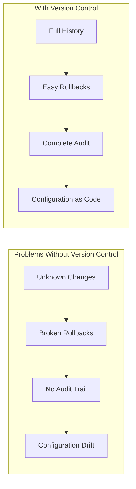
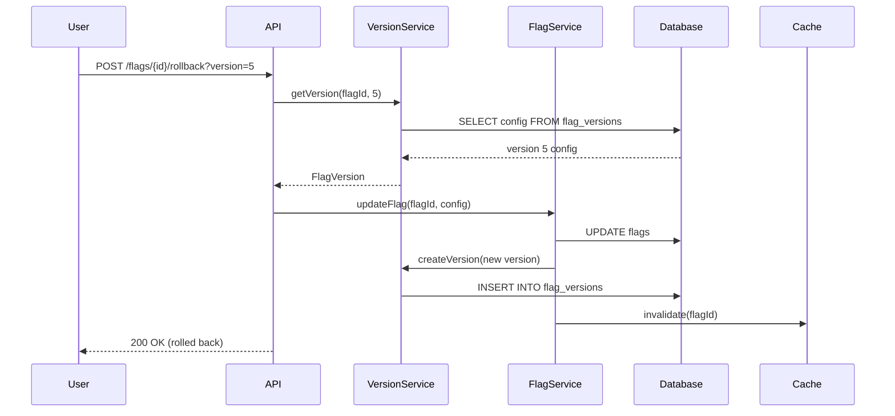
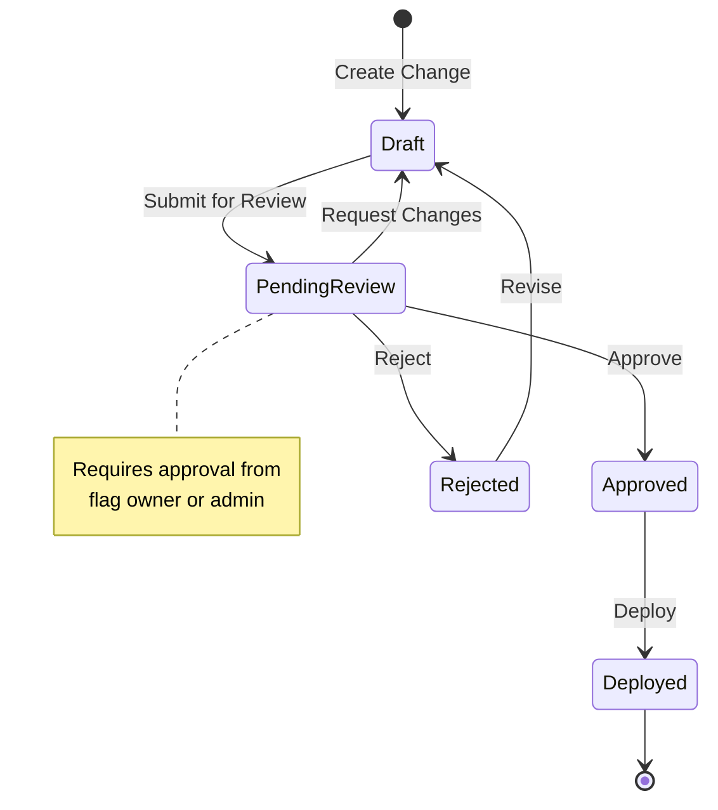
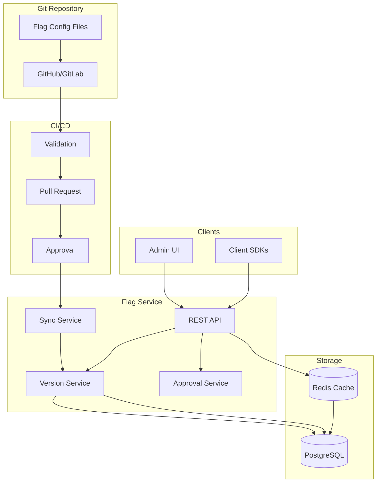

# How to Build Flag Version Control

Author: [nawazdhandala](https://github.com/nawazdhandala)

Tags: Feature Flags, Version Control, Git, DevOps

Description: Learn how to version control feature flag configurations effectively.

---

Feature flags are powerful, but without version control, they become a liability. Who changed the flag? When? Why? This guide shows you how to build robust version control for your feature flag configurations.

## Why Version Control Feature Flags?



Key benefits:
1. **Audit Trail** - Every change is tracked with who, when, and why
2. **Rollback Capability** - Instantly revert to any previous state
3. **Diff Visualization** - See exactly what changed between versions
4. **Approval Workflows** - Require review before production changes
5. **Environment Consistency** - Sync flags across environments reliably

## GitOps for Feature Flags

### Configuration as Code

Store your feature flags in Git, not just a database:

```yaml
# flags/production/user-features.yaml
apiVersion: flags.example.com/v1
kind: FeatureFlagConfig
metadata:
  name: user-features
  environment: production
spec:
  flags:
    - name: new-checkout-flow
      enabled: true
      percentage: 25
      rules:
        - attribute: user.tier
          operator: equals
          value: premium
          enabled: true

    - name: dark-mode
      enabled: true
      percentage: 100

    - name: ai-recommendations
      enabled: false
      metadata:
        ticket: FEAT-1234
        owner: team-growth
```

### Directory Structure

```
feature-flags/
├── environments/
│   ├── development/
│   │   ├── api-flags.yaml
│   │   ├── ui-flags.yaml
│   │   └── experiments.yaml
│   ├── staging/
│   │   ├── api-flags.yaml
│   │   ├── ui-flags.yaml
│   │   └── experiments.yaml
│   └── production/
│       ├── api-flags.yaml
│       ├── ui-flags.yaml
│       └── experiments.yaml
├── schemas/
│   └── flag-schema.json
├── .github/
│   └── workflows/
│       ├── validate.yml
│       └── deploy.yml
└── README.md
```

### Flag Schema Validation

```json
{
  "$schema": "http://json-schema.org/draft-07/schema#",
  "type": "object",
  "properties": {
    "apiVersion": {
      "type": "string",
      "pattern": "^flags\\.example\\.com/v[0-9]+$"
    },
    "kind": {
      "type": "string",
      "enum": ["FeatureFlagConfig"]
    },
    "metadata": {
      "type": "object",
      "properties": {
        "name": { "type": "string" },
        "environment": {
          "type": "string",
          "enum": ["development", "staging", "production"]
        }
      },
      "required": ["name", "environment"]
    },
    "spec": {
      "type": "object",
      "properties": {
        "flags": {
          "type": "array",
          "items": {
            "type": "object",
            "properties": {
              "name": { "type": "string", "pattern": "^[a-z][a-z0-9-]*$" },
              "enabled": { "type": "boolean" },
              "percentage": { "type": "number", "minimum": 0, "maximum": 100 },
              "rules": { "type": "array" },
              "metadata": { "type": "object" }
            },
            "required": ["name", "enabled"]
          }
        }
      }
    }
  }
}
```

## Version History Tracking

### Database Schema

```sql
-- Flag versions table
CREATE TABLE flag_versions (
    id UUID PRIMARY KEY DEFAULT gen_random_uuid(),
    flag_id UUID NOT NULL REFERENCES flags(id),
    version INTEGER NOT NULL,
    config JSONB NOT NULL,
    created_at TIMESTAMP WITH TIME ZONE DEFAULT NOW(),
    created_by UUID REFERENCES users(id),
    commit_sha VARCHAR(40),
    commit_message TEXT,

    UNIQUE(flag_id, version)
);

-- Flag changes audit log
CREATE TABLE flag_audit_log (
    id UUID PRIMARY KEY DEFAULT gen_random_uuid(),
    flag_id UUID NOT NULL REFERENCES flags(id),
    action VARCHAR(50) NOT NULL,
    old_value JSONB,
    new_value JSONB,
    changed_at TIMESTAMP WITH TIME ZONE DEFAULT NOW(),
    changed_by UUID REFERENCES users(id),
    change_reason TEXT,
    source VARCHAR(50), -- 'api', 'git', 'ui'
    metadata JSONB
);

-- Index for fast lookups
CREATE INDEX idx_flag_versions_flag_id ON flag_versions(flag_id, version DESC);
CREATE INDEX idx_flag_audit_log_flag_id ON flag_audit_log(flag_id, changed_at DESC);
```

### Version Tracking Service

```typescript
// services/flag-version.service.ts
import { Injectable } from '@nestjs/common';
import { InjectRepository } from '@nestjs/typeorm';
import { Repository } from 'typeorm';
import { FlagVersion } from './entities/flag-version.entity';
import { FlagAuditLog } from './entities/flag-audit-log.entity';

interface FlagConfig {
  name: string;
  enabled: boolean;
  percentage?: number;
  rules?: FlagRule[];
  metadata?: Record<string, unknown>;
}

interface VersionDiff {
  field: string;
  oldValue: unknown;
  newValue: unknown;
}

@Injectable()
export class FlagVersionService {
  constructor(
    @InjectRepository(FlagVersion)
    private versionRepo: Repository<FlagVersion>,
    @InjectRepository(FlagAuditLog)
    private auditRepo: Repository<FlagAuditLog>,
  ) {}

  async createVersion(
    flagId: string,
    config: FlagConfig,
    userId: string,
    options: {
      commitSha?: string;
      commitMessage?: string;
      changeReason?: string;
    } = {}
  ): Promise<FlagVersion> {
    // Get the latest version number
    const latestVersion = await this.versionRepo.findOne({
      where: { flagId },
      order: { version: 'DESC' },
    });

    const newVersionNumber = (latestVersion?.version ?? 0) + 1;

    // Create new version
    const newVersion = this.versionRepo.create({
      flagId,
      version: newVersionNumber,
      config,
      createdBy: userId,
      commitSha: options.commitSha,
      commitMessage: options.commitMessage,
    });

    await this.versionRepo.save(newVersion);

    // Create audit log entry
    await this.auditRepo.save({
      flagId,
      action: latestVersion ? 'UPDATE' : 'CREATE',
      oldValue: latestVersion?.config ?? null,
      newValue: config,
      changedBy: userId,
      changeReason: options.changeReason,
      source: options.commitSha ? 'git' : 'api',
      metadata: {
        version: newVersionNumber,
        commitSha: options.commitSha,
      },
    });

    return newVersion;
  }

  async getVersionHistory(
    flagId: string,
    limit: number = 50
  ): Promise<FlagVersion[]> {
    return this.versionRepo.find({
      where: { flagId },
      order: { version: 'DESC' },
      take: limit,
      relations: ['createdByUser'],
    });
  }

  async getVersion(flagId: string, version: number): Promise<FlagVersion | null> {
    return this.versionRepo.findOne({
      where: { flagId, version },
      relations: ['createdByUser'],
    });
  }

  async diffVersions(
    flagId: string,
    fromVersion: number,
    toVersion: number
  ): Promise<VersionDiff[]> {
    const [from, to] = await Promise.all([
      this.getVersion(flagId, fromVersion),
      this.getVersion(flagId, toVersion),
    ]);

    if (!from || !to) {
      throw new Error('Version not found');
    }

    return this.computeDiff(from.config, to.config);
  }

  private computeDiff(
    oldConfig: FlagConfig,
    newConfig: FlagConfig
  ): VersionDiff[] {
    const diffs: VersionDiff[] = [];
    const allKeys = new Set([
      ...Object.keys(oldConfig),
      ...Object.keys(newConfig),
    ]);

    for (const key of allKeys) {
      const oldValue = oldConfig[key as keyof FlagConfig];
      const newValue = newConfig[key as keyof FlagConfig];

      if (JSON.stringify(oldValue) !== JSON.stringify(newValue)) {
        diffs.push({
          field: key,
          oldValue,
          newValue,
        });
      }
    }

    return diffs;
  }
}
```

## Rollback Capabilities



### Rollback Controller

```typescript
// controllers/flag.controller.ts
import { Controller, Post, Param, Query, Body, UseGuards } from '@nestjs/common';
import { FlagService } from '../services/flag.service';
import { FlagVersionService } from '../services/flag-version.service';
import { AuthGuard } from '../guards/auth.guard';
import { RoleGuard } from '../guards/role.guard';
import { Roles } from '../decorators/roles.decorator';
import { CurrentUser } from '../decorators/current-user.decorator';

interface RollbackDto {
  reason: string;
}

@Controller('flags')
@UseGuards(AuthGuard, RoleGuard)
export class FlagController {
  constructor(
    private flagService: FlagService,
    private versionService: FlagVersionService,
  ) {}

  @Post(':id/rollback')
  @Roles('admin', 'flag-manager')
  async rollbackFlag(
    @Param('id') flagId: string,
    @Query('version') targetVersion: number,
    @Body() dto: RollbackDto,
    @CurrentUser() user: User,
  ) {
    // Get the target version
    const version = await this.versionService.getVersion(flagId, targetVersion);

    if (!version) {
      throw new NotFoundException(`Version ${targetVersion} not found`);
    }

    // Get current version for audit
    const currentFlag = await this.flagService.getFlag(flagId);

    // Apply the rollback
    const updatedFlag = await this.flagService.updateFlag(flagId, version.config, {
      userId: user.id,
      changeReason: `Rollback to version ${targetVersion}: ${dto.reason}`,
      source: 'rollback',
    });

    // Log the rollback action
    await this.versionService.logRollback({
      flagId,
      fromVersion: currentFlag.currentVersion,
      toVersion: targetVersion,
      userId: user.id,
      reason: dto.reason,
    });

    return {
      success: true,
      message: `Rolled back to version ${targetVersion}`,
      flag: updatedFlag,
    };
  }

  @Post(':id/restore-snapshot')
  @Roles('admin')
  async restoreFromSnapshot(
    @Param('id') flagId: string,
    @Body() dto: { snapshotId: string; reason: string },
    @CurrentUser() user: User,
  ) {
    const snapshot = await this.versionService.getSnapshot(dto.snapshotId);

    if (!snapshot) {
      throw new NotFoundException('Snapshot not found');
    }

    // Restore all flags from the snapshot
    const results = await Promise.all(
      snapshot.flags.map(flagConfig =>
        this.flagService.updateFlag(flagConfig.id, flagConfig.config, {
          userId: user.id,
          changeReason: `Restored from snapshot ${dto.snapshotId}: ${dto.reason}`,
          source: 'snapshot-restore',
        })
      )
    );

    return {
      success: true,
      restoredFlags: results.length,
      snapshotId: dto.snapshotId,
    };
  }
}
```

### Safe Rollback with Validation

```typescript
// services/rollback.service.ts
import { Injectable, BadRequestException } from '@nestjs/common';

interface RollbackValidation {
  isValid: boolean;
  warnings: string[];
  errors: string[];
}

@Injectable()
export class RollbackService {
  async validateRollback(
    flagId: string,
    targetVersion: number
  ): Promise<RollbackValidation> {
    const warnings: string[] = [];
    const errors: string[] = [];

    const [currentFlag, targetVersionData] = await Promise.all([
      this.flagService.getFlag(flagId),
      this.versionService.getVersion(flagId, targetVersion),
    ]);

    if (!targetVersionData) {
      errors.push(`Version ${targetVersion} does not exist`);
      return { isValid: false, warnings, errors };
    }

    // Check if rolling back to a very old version
    const versionAge = currentFlag.currentVersion - targetVersion;
    if (versionAge > 10) {
      warnings.push(
        `Rolling back ${versionAge} versions. Consider reviewing intermediate changes.`
      );
    }

    // Check for schema compatibility
    const schemaVersion = targetVersionData.config.schemaVersion;
    if (schemaVersion && schemaVersion < this.getCurrentSchemaVersion()) {
      warnings.push(
        `Target version uses an older schema (v${schemaVersion}). ` +
        `Migration may be applied automatically.`
      );
    }

    // Check for dependent flags
    const dependentFlags = await this.getDependentFlags(flagId);
    if (dependentFlags.length > 0) {
      warnings.push(
        `${dependentFlags.length} flag(s) depend on this flag: ` +
        dependentFlags.map(f => f.name).join(', ')
      );
    }

    // Check if the target version was a known-bad state
    const auditLogs = await this.versionService.getAuditLogs(flagId, {
      version: targetVersion,
    });

    const wasRolledBackFrom = auditLogs.some(
      log => log.action === 'ROLLBACK' && log.metadata?.fromVersion === targetVersion
    );

    if (wasRolledBackFrom) {
      warnings.push(
        'This version was previously rolled back from. ' +
        'Consider if the original issues have been resolved.'
      );
    }

    return {
      isValid: errors.length === 0,
      warnings,
      errors,
    };
  }

  async performRollback(
    flagId: string,
    targetVersion: number,
    options: {
      userId: string;
      reason: string;
      skipValidation?: boolean;
    }
  ) {
    if (!options.skipValidation) {
      const validation = await this.validateRollback(flagId, targetVersion);

      if (!validation.isValid) {
        throw new BadRequestException({
          message: 'Rollback validation failed',
          errors: validation.errors,
        });
      }
    }

    // Perform the rollback within a transaction
    return this.database.transaction(async (tx) => {
      const targetVersionData = await this.versionService.getVersion(
        flagId,
        targetVersion
      );

      // Update the flag
      await tx.update('flags', {
        config: targetVersionData.config,
        updated_at: new Date(),
        updated_by: options.userId,
      }).where({ id: flagId });

      // Create new version (rollback creates a new version)
      const newVersion = await this.versionService.createVersion(
        flagId,
        targetVersionData.config,
        options.userId,
        {
          changeReason: options.reason,
          metadata: {
            rollbackFromVersion: targetVersionData.version,
            action: 'ROLLBACK',
          },
        }
      );

      // Invalidate caches
      await this.cacheService.invalidate(`flag:${flagId}`);

      return newVersion;
    });
  }
}
```

## Diff Visualization

### Computing Detailed Diffs

```typescript
// services/diff.service.ts
import { diff as deepDiff } from 'deep-diff';

interface DiffResult {
  kind: 'N' | 'D' | 'E' | 'A';  // New, Deleted, Edited, Array
  path: string[];
  lhs?: unknown;  // Left-hand side (old)
  rhs?: unknown;  // Right-hand side (new)
  index?: number; // For array changes
  item?: DiffResult; // For array item changes
}

interface FormattedDiff {
  field: string;
  type: 'added' | 'removed' | 'changed';
  oldValue?: unknown;
  newValue?: unknown;
  description: string;
}

@Injectable()
export class DiffService {
  computeDiff(oldConfig: unknown, newConfig: unknown): FormattedDiff[] {
    const differences = deepDiff(oldConfig, newConfig) || [];

    return differences.map(diff => this.formatDiff(diff));
  }

  private formatDiff(diff: DiffResult): FormattedDiff {
    const path = diff.path?.join('.') || 'root';

    switch (diff.kind) {
      case 'N':
        return {
          field: path,
          type: 'added',
          newValue: diff.rhs,
          description: `Added ${path}: ${JSON.stringify(diff.rhs)}`,
        };

      case 'D':
        return {
          field: path,
          type: 'removed',
          oldValue: diff.lhs,
          description: `Removed ${path}: ${JSON.stringify(diff.lhs)}`,
        };

      case 'E':
        return {
          field: path,
          type: 'changed',
          oldValue: diff.lhs,
          newValue: diff.rhs,
          description: `Changed ${path}: ${JSON.stringify(diff.lhs)} -> ${JSON.stringify(diff.rhs)}`,
        };

      case 'A':
        return {
          field: `${path}[${diff.index}]`,
          type: diff.item?.kind === 'N' ? 'added' : 'removed',
          oldValue: diff.item?.lhs,
          newValue: diff.item?.rhs,
          description: `Array ${path} modified at index ${diff.index}`,
        };

      default:
        return {
          field: path,
          type: 'changed',
          description: `Unknown change at ${path}`,
        };
    }
  }

  generateDiffHtml(oldConfig: unknown, newConfig: unknown): string {
    const diffs = this.computeDiff(oldConfig, newConfig);

    const oldYaml = yaml.dump(oldConfig);
    const newYaml = yaml.dump(newConfig);

    // Generate unified diff
    const unifiedDiff = createTwoFilesPatch(
      'old',
      'new',
      oldYaml,
      newYaml,
      'Previous Version',
      'New Version'
    );

    // Convert to HTML with syntax highlighting
    return this.diffToHtml(unifiedDiff);
  }

  private diffToHtml(unifiedDiff: string): string {
    const lines = unifiedDiff.split('\n');

    return lines.map(line => {
      if (line.startsWith('+') && !line.startsWith('+++')) {
        return `<span class="diff-added">${this.escapeHtml(line)}</span>`;
      } else if (line.startsWith('-') && !line.startsWith('---')) {
        return `<span class="diff-removed">${this.escapeHtml(line)}</span>`;
      } else if (line.startsWith('@@')) {
        return `<span class="diff-info">${this.escapeHtml(line)}</span>`;
      }
      return `<span class="diff-context">${this.escapeHtml(line)}</span>`;
    }).join('\n');
  }

  private escapeHtml(text: string): string {
    return text
      .replace(/&/g, '&amp;')
      .replace(/</g, '&lt;')
      .replace(/>/g, '&gt;');
  }
}
```

### Diff API Endpoint

```typescript
// controllers/diff.controller.ts
@Controller('flags/:id/diff')
export class DiffController {
  @Get()
  async getDiff(
    @Param('id') flagId: string,
    @Query('from') fromVersion: number,
    @Query('to') toVersion: number,
    @Query('format') format: 'json' | 'html' | 'unified' = 'json',
  ) {
    const [fromConfig, toConfig] = await Promise.all([
      this.versionService.getVersion(flagId, fromVersion),
      this.versionService.getVersion(flagId, toVersion),
    ]);

    if (!fromConfig || !toConfig) {
      throw new NotFoundException('Version not found');
    }

    switch (format) {
      case 'html':
        return {
          html: this.diffService.generateDiffHtml(
            fromConfig.config,
            toConfig.config
          ),
        };

      case 'unified':
        return {
          diff: this.diffService.generateUnifiedDiff(
            fromConfig.config,
            toConfig.config
          ),
        };

      default:
        return {
          fromVersion,
          toVersion,
          changes: this.diffService.computeDiff(
            fromConfig.config,
            toConfig.config
          ),
        };
    }
  }
}
```

## Change Approval Workflows



### Change Request Model

```typescript
// entities/flag-change-request.entity.ts
import { Entity, Column, ManyToOne, CreateDateColumn } from 'typeorm';

export enum ChangeRequestStatus {
  DRAFT = 'draft',
  PENDING_REVIEW = 'pending_review',
  APPROVED = 'approved',
  REJECTED = 'rejected',
  DEPLOYED = 'deployed',
  CANCELLED = 'cancelled',
}

@Entity('flag_change_requests')
export class FlagChangeRequest {
  @PrimaryGeneratedColumn('uuid')
  id: string;

  @Column('uuid')
  flagId: string;

  @ManyToOne(() => Flag)
  flag: Flag;

  @Column('jsonb')
  proposedConfig: Record<string, unknown>;

  @Column('jsonb', { nullable: true })
  currentConfig: Record<string, unknown>;

  @Column({
    type: 'enum',
    enum: ChangeRequestStatus,
    default: ChangeRequestStatus.DRAFT,
  })
  status: ChangeRequestStatus;

  @Column('text')
  description: string;

  @Column('text', { nullable: true })
  reviewComment: string;

  @Column('uuid')
  requestedBy: string;

  @ManyToOne(() => User)
  requestedByUser: User;

  @Column('uuid', { nullable: true })
  reviewedBy: string;

  @ManyToOne(() => User)
  reviewedByUser: User;

  @CreateDateColumn()
  createdAt: Date;

  @Column({ type: 'timestamp', nullable: true })
  reviewedAt: Date;

  @Column({ type: 'timestamp', nullable: true })
  deployedAt: Date;

  @Column('jsonb', { default: {} })
  metadata: {
    environment?: string;
    urgency?: 'low' | 'medium' | 'high' | 'critical';
    relatedTicket?: string;
    requiredApprovers?: string[];
  };
}
```

### Approval Workflow Service

```typescript
// services/approval-workflow.service.ts
import { Injectable, ForbiddenException } from '@nestjs/common';
import { InjectRepository } from '@nestjs/typeorm';
import { Repository } from 'typeorm';

@Injectable()
export class ApprovalWorkflowService {
  constructor(
    @InjectRepository(FlagChangeRequest)
    private changeRequestRepo: Repository<FlagChangeRequest>,
    private notificationService: NotificationService,
    private flagService: FlagService,
  ) {}

  async createChangeRequest(
    flagId: string,
    proposedConfig: Record<string, unknown>,
    userId: string,
    options: {
      description: string;
      environment: string;
      urgency?: 'low' | 'medium' | 'high' | 'critical';
      relatedTicket?: string;
    }
  ): Promise<FlagChangeRequest> {
    const currentFlag = await this.flagService.getFlag(flagId);

    // Determine required approvers based on environment and urgency
    const requiredApprovers = await this.getRequiredApprovers(
      flagId,
      options.environment,
      options.urgency
    );

    const changeRequest = this.changeRequestRepo.create({
      flagId,
      proposedConfig,
      currentConfig: currentFlag.config,
      status: ChangeRequestStatus.DRAFT,
      description: options.description,
      requestedBy: userId,
      metadata: {
        environment: options.environment,
        urgency: options.urgency || 'medium',
        relatedTicket: options.relatedTicket,
        requiredApprovers,
      },
    });

    return this.changeRequestRepo.save(changeRequest);
  }

  async submitForReview(
    changeRequestId: string,
    userId: string
  ): Promise<FlagChangeRequest> {
    const changeRequest = await this.changeRequestRepo.findOne({
      where: { id: changeRequestId },
      relations: ['flag', 'requestedByUser'],
    });

    if (!changeRequest) {
      throw new NotFoundException('Change request not found');
    }

    if (changeRequest.requestedBy !== userId) {
      throw new ForbiddenException('Only the requester can submit for review');
    }

    if (changeRequest.status !== ChangeRequestStatus.DRAFT) {
      throw new BadRequestException('Can only submit draft requests');
    }

    // Validate the proposed config
    await this.flagService.validateConfig(changeRequest.proposedConfig);

    changeRequest.status = ChangeRequestStatus.PENDING_REVIEW;
    await this.changeRequestRepo.save(changeRequest);

    // Notify approvers
    await this.notificationService.notifyApprovers({
      changeRequestId,
      flagName: changeRequest.flag.name,
      requestedBy: changeRequest.requestedByUser.name,
      description: changeRequest.description,
      environment: changeRequest.metadata.environment,
      urgency: changeRequest.metadata.urgency,
    });

    return changeRequest;
  }

  async approveChangeRequest(
    changeRequestId: string,
    reviewerId: string,
    comment?: string
  ): Promise<FlagChangeRequest> {
    const changeRequest = await this.changeRequestRepo.findOne({
      where: { id: changeRequestId },
    });

    if (!changeRequest) {
      throw new NotFoundException('Change request not found');
    }

    // Check if reviewer is allowed to approve
    const canApprove = await this.canUserApprove(
      reviewerId,
      changeRequest
    );

    if (!canApprove) {
      throw new ForbiddenException('You are not authorized to approve this request');
    }

    // Check for self-approval (usually not allowed for production)
    if (
      changeRequest.requestedBy === reviewerId &&
      changeRequest.metadata.environment === 'production'
    ) {
      throw new ForbiddenException('Cannot self-approve production changes');
    }

    changeRequest.status = ChangeRequestStatus.APPROVED;
    changeRequest.reviewedBy = reviewerId;
    changeRequest.reviewedAt = new Date();
    changeRequest.reviewComment = comment;

    await this.changeRequestRepo.save(changeRequest);

    // Notify requester
    await this.notificationService.notifyApproved(changeRequest);

    return changeRequest;
  }

  async deployApprovedChange(
    changeRequestId: string,
    userId: string
  ): Promise<void> {
    const changeRequest = await this.changeRequestRepo.findOne({
      where: { id: changeRequestId },
    });

    if (changeRequest.status !== ChangeRequestStatus.APPROVED) {
      throw new BadRequestException('Change request must be approved before deployment');
    }

    // Apply the change
    await this.flagService.updateFlag(
      changeRequest.flagId,
      changeRequest.proposedConfig,
      {
        userId,
        changeReason: `Deployed via change request ${changeRequestId}: ${changeRequest.description}`,
        changeRequestId,
      }
    );

    changeRequest.status = ChangeRequestStatus.DEPLOYED;
    changeRequest.deployedAt = new Date();
    await this.changeRequestRepo.save(changeRequest);
  }

  private async getRequiredApprovers(
    flagId: string,
    environment: string,
    urgency?: string
  ): Promise<string[]> {
    const flag = await this.flagService.getFlag(flagId);
    const approvers: string[] = [];

    // Flag owner is always a valid approver
    if (flag.ownerId) {
      approvers.push(flag.ownerId);
    }

    // Production requires additional approvers
    if (environment === 'production') {
      const admins = await this.userService.getAdmins();
      approvers.push(...admins.map(a => a.id));
    }

    // Critical changes require multiple approvers
    if (urgency === 'critical') {
      const seniorEngineers = await this.userService.getSeniorEngineers();
      approvers.push(...seniorEngineers.map(e => e.id));
    }

    return [...new Set(approvers)]; // Remove duplicates
  }
}
```

### GitHub PR Integration

```yaml
# .github/workflows/flag-review.yml
name: Feature Flag Review

on:
  pull_request:
    paths:
      - 'feature-flags/**'

jobs:
  validate:
    runs-on: ubuntu-latest
    steps:
      - uses: actions/checkout@v4

      - name: Validate Flag Schema
        run: |
          npm install ajv-cli
          npx ajv validate -s schemas/flag-schema.json -d "feature-flags/**/*.yaml"

      - name: Check for Breaking Changes
        run: |
          # Get changed files
          CHANGED=$(git diff --name-only origin/main...HEAD | grep "feature-flags/")

          for file in $CHANGED; do
            echo "Checking $file for breaking changes..."

            # Get the old version
            git show origin/main:$file > /tmp/old.yaml 2>/dev/null || echo "{}" > /tmp/old.yaml

            # Compare
            node scripts/check-breaking-changes.js /tmp/old.yaml $file
          done

      - name: Generate Diff Summary
        run: |
          node scripts/generate-diff-summary.js > diff-summary.md

      - name: Post PR Comment
        uses: actions/github-script@v7
        with:
          script: |
            const fs = require('fs');
            const summary = fs.readFileSync('diff-summary.md', 'utf8');

            github.rest.issues.createComment({
              owner: context.repo.owner,
              repo: context.repo.repo,
              issue_number: context.issue.number,
              body: `## Feature Flag Changes\n\n${summary}`
            });

  require-approval:
    runs-on: ubuntu-latest
    if: contains(github.event.pull_request.labels.*.name, 'production-flags')
    steps:
      - name: Check for Production Flag Approval
        uses: actions/github-script@v7
        with:
          script: |
            const reviews = await github.rest.pulls.listReviews({
              owner: context.repo.owner,
              repo: context.repo.repo,
              pull_number: context.issue.number,
            });

            const approved = reviews.data.some(
              r => r.state === 'APPROVED' &&
                   ['admin', 'flag-admin'].includes(r.author_association)
            );

            if (!approved) {
              core.setFailed('Production flag changes require approval from an admin');
            }
```

## Sync Flags from Git

```typescript
// services/git-sync.service.ts
import { Injectable, Logger } from '@nestjs/common';
import * as yaml from 'js-yaml';
import * as fs from 'fs/promises';
import * as path from 'path';
import simpleGit, { SimpleGit } from 'simple-git';

@Injectable()
export class GitSyncService {
  private readonly logger = new Logger(GitSyncService.name);
  private git: SimpleGit;

  constructor(
    private flagService: FlagService,
    private versionService: FlagVersionService,
  ) {
    this.git = simpleGit();
  }

  async syncFromRepository(
    repoPath: string,
    environment: string,
    options: {
      branch?: string;
      dryRun?: boolean;
    } = {}
  ): Promise<SyncResult> {
    const result: SyncResult = {
      created: [],
      updated: [],
      deleted: [],
      unchanged: [],
      errors: [],
    };

    try {
      // Pull latest changes
      if (options.branch) {
        await this.git.cwd(repoPath).checkout(options.branch);
      }
      await this.git.cwd(repoPath).pull();

      // Get current commit info
      const log = await this.git.cwd(repoPath).log({ maxCount: 1 });
      const commitSha = log.latest?.hash;
      const commitMessage = log.latest?.message;

      // Read flag files
      const flagsDir = path.join(repoPath, 'environments', environment);
      const files = await fs.readdir(flagsDir);

      const yamlFiles = files.filter(f => f.endsWith('.yaml') || f.endsWith('.yml'));

      for (const file of yamlFiles) {
        try {
          const content = await fs.readFile(
            path.join(flagsDir, file),
            'utf-8'
          );
          const config = yaml.load(content) as FlagFileConfig;

          for (const flag of config.spec.flags) {
            const syncResult = await this.syncFlag(
              flag,
              environment,
              {
                commitSha,
                commitMessage,
                dryRun: options.dryRun,
              }
            );

            result[syncResult.action].push(flag.name);
          }
        } catch (error) {
          result.errors.push({
            file,
            error: error.message,
          });
        }
      }

      // Handle deleted flags
      const existingFlags = await this.flagService.getFlagsByEnvironment(environment);
      const gitFlagNames = new Set(
        yamlFiles.flatMap(f => {
          const content = yaml.load(
            fs.readFileSync(path.join(flagsDir, f), 'utf-8')
          ) as FlagFileConfig;
          return content.spec.flags.map(f => f.name);
        })
      );

      for (const flag of existingFlags) {
        if (!gitFlagNames.has(flag.name) && flag.source === 'git') {
          if (!options.dryRun) {
            await this.flagService.archiveFlag(flag.id, {
              reason: 'Removed from Git repository',
              commitSha,
            });
          }
          result.deleted.push(flag.name);
        }
      }

    } catch (error) {
      this.logger.error('Sync failed', error);
      throw error;
    }

    return result;
  }

  private async syncFlag(
    flag: FlagConfig,
    environment: string,
    options: {
      commitSha?: string;
      commitMessage?: string;
      dryRun?: boolean;
    }
  ): Promise<{ action: 'created' | 'updated' | 'unchanged' }> {
    const existingFlag = await this.flagService.findByName(flag.name, environment);

    if (!existingFlag) {
      // Create new flag
      if (!options.dryRun) {
        await this.flagService.createFlag({
          ...flag,
          environment,
          source: 'git',
        }, {
          commitSha: options.commitSha,
          commitMessage: options.commitMessage,
        });
      }
      return { action: 'created' };
    }

    // Check if config changed
    if (JSON.stringify(existingFlag.config) === JSON.stringify(flag)) {
      return { action: 'unchanged' };
    }

    // Update existing flag
    if (!options.dryRun) {
      await this.flagService.updateFlag(existingFlag.id, flag, {
        commitSha: options.commitSha,
        commitMessage: options.commitMessage,
        source: 'git',
      });
    }

    return { action: 'updated' };
  }
}
```

## Complete System Architecture



## Best Practices

### 1. Use Semantic Versioning for Flag Schemas

```yaml
apiVersion: flags.example.com/v2  # Bump when breaking changes
kind: FeatureFlagConfig
metadata:
  schemaVersion: "2.1.0"  # Semantic version for config structure
```

### 2. Include Metadata in Every Change

```typescript
// Always provide context for changes
await flagService.updateFlag(flagId, newConfig, {
  userId: currentUser.id,
  changeReason: 'Increasing rollout from 10% to 25% based on positive metrics',
  relatedTicket: 'FEAT-1234',
  source: 'ui',
});
```

### 3. Implement Automatic Snapshots

```typescript
// Create daily snapshots for disaster recovery
@Cron('0 0 * * *')
async createDailySnapshot() {
  const allFlags = await this.flagService.getAllFlags();

  await this.snapshotService.create({
    name: `daily-${new Date().toISOString().split('T')[0]}`,
    flags: allFlags,
    type: 'automatic',
  });

  // Clean up old snapshots (keep last 30 days)
  await this.snapshotService.pruneOldSnapshots(30);
}
```

### 4. Set Up Alerts for Critical Changes

```typescript
// Alert on production flag changes
async updateFlag(flagId: string, config: FlagConfig, options: UpdateOptions) {
  const flag = await this.getFlag(flagId);

  if (flag.environment === 'production') {
    await this.alertService.send({
      channel: 'flag-changes',
      severity: 'info',
      message: `Production flag "${flag.name}" updated by ${options.userId}`,
      details: {
        changes: this.diffService.computeDiff(flag.config, config),
        reason: options.changeReason,
      },
    });
  }

  // Continue with update...
}
```

---

Version control transforms feature flags from a potential liability into a reliable, auditable system. Start with Git-based configuration, add version tracking, and implement approval workflows for production changes. Your future self will thank you when you need to answer "what changed and why?"
