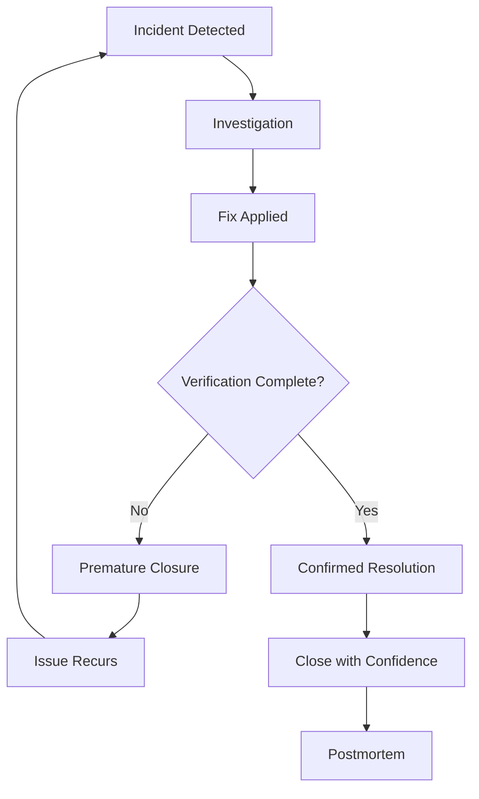
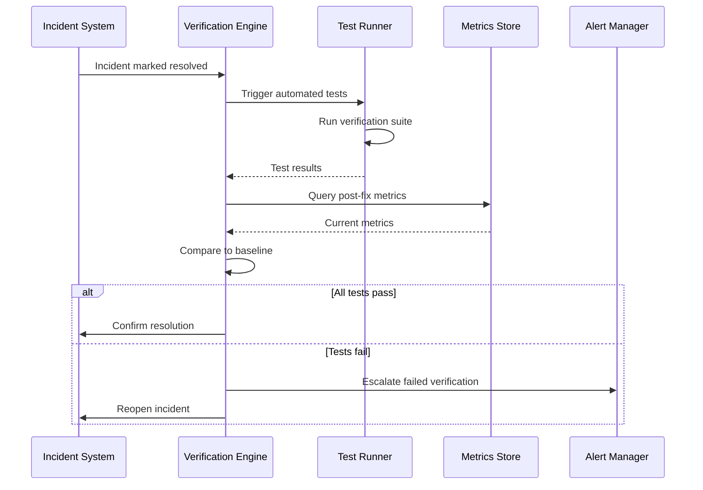
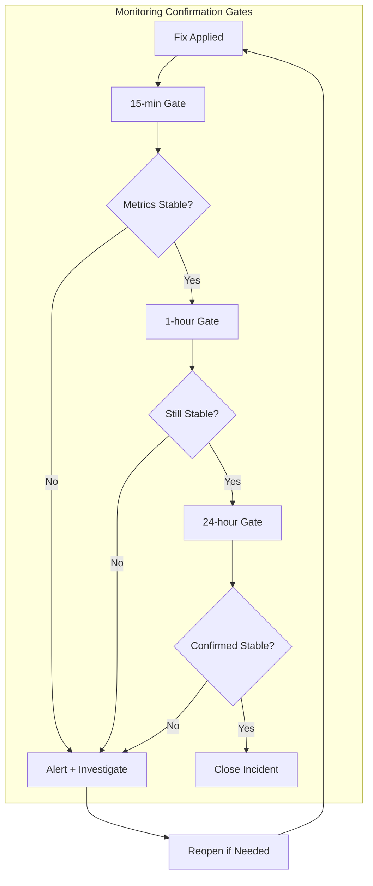
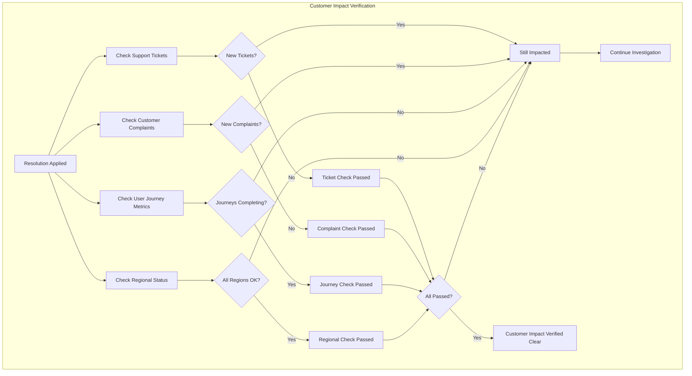
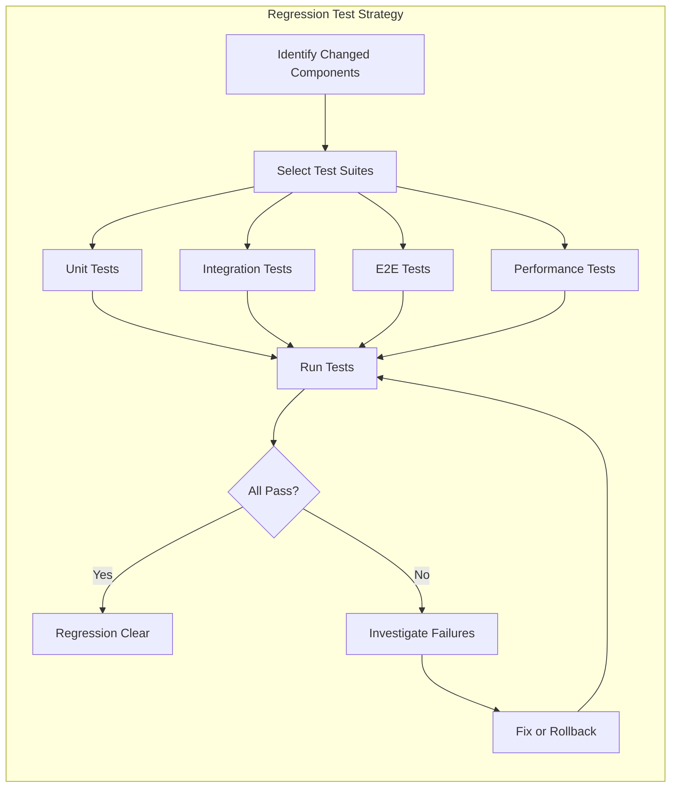
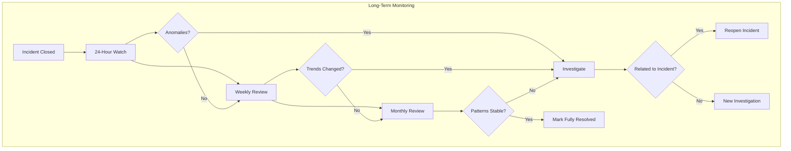

# How to Build Follow-Up Verification

Author: [nawazdhandala](https://github.com/nawazdhandala)

Tags: Incident Management, Verification, SRE, Quality

Description: Learn how to verify that incident resolutions are effective and complete.

---

After an incident is resolved, the real work begins. Follow-up verification ensures that your fix actually works, that customers are no longer affected, and that the same issue will not resurface. Without systematic verification, teams often discover that their "resolved" incidents were not truly fixed, leading to customer frustration and eroded trust. This guide covers how to build a comprehensive follow-up verification system that confirms incident resolutions are effective and complete.

## Why Follow-Up Verification Matters

Many incident management processes focus heavily on detection and resolution but neglect verification. This creates several problems:

- **False positives in resolution**: The fix addressed symptoms but not the root cause
- **Partial fixes**: Some users or regions remain affected
- **Regression risk**: The fix may break again under different conditions
- **Customer impact gaps**: Internal metrics recover but customer experience lags



## Verification Checklist Design

A structured verification checklist ensures no critical step is missed. Design your checklist to cover technical, customer, and process dimensions.

### Building the Verification Framework

```python
from dataclasses import dataclass, field
from datetime import datetime, timedelta
from typing import List, Optional, Callable, Dict
from enum import Enum
import asyncio

class VerificationStatus(Enum):
    PENDING = "pending"
    IN_PROGRESS = "in_progress"
    PASSED = "passed"
    FAILED = "failed"
    SKIPPED = "skipped"

class VerificationPriority(Enum):
    CRITICAL = 1  # Must pass before closing
    HIGH = 2      # Should pass, escalate if not
    MEDIUM = 3    # Best effort verification
    LOW = 4       # Nice to have confirmation

@dataclass
class VerificationItem:
    """A single verification check in the checklist."""
    id: str
    name: str
    description: str
    priority: VerificationPriority
    check_function: Optional[Callable] = None
    timeout_minutes: int = 30
    status: VerificationStatus = VerificationStatus.PENDING
    result_details: str = ""
    verified_at: Optional[datetime] = None
    verified_by: Optional[str] = None

    def mark_passed(self, details: str = "", verified_by: str = None):
        self.status = VerificationStatus.PASSED
        self.result_details = details
        self.verified_at = datetime.utcnow()
        self.verified_by = verified_by

    def mark_failed(self, details: str = "", verified_by: str = None):
        self.status = VerificationStatus.FAILED
        self.result_details = details
        self.verified_at = datetime.utcnow()
        self.verified_by = verified_by


@dataclass
class VerificationChecklist:
    """Complete verification checklist for an incident."""
    incident_id: str
    created_at: datetime = field(default_factory=datetime.utcnow)
    items: List[VerificationItem] = field(default_factory=list)

    def add_item(self, item: VerificationItem):
        self.items.append(item)

    def get_critical_items(self) -> List[VerificationItem]:
        return [i for i in self.items if i.priority == VerificationPriority.CRITICAL]

    def all_critical_passed(self) -> bool:
        critical = self.get_critical_items()
        return all(i.status == VerificationStatus.PASSED for i in critical)

    def completion_percentage(self) -> float:
        if not self.items:
            return 100.0
        completed = sum(1 for i in self.items
                       if i.status in [VerificationStatus.PASSED, VerificationStatus.SKIPPED])
        return (completed / len(self.items)) * 100

    def can_close_incident(self) -> tuple[bool, str]:
        """Determine if the incident can be safely closed."""
        if not self.all_critical_passed():
            failed_critical = [i.name for i in self.get_critical_items()
                              if i.status != VerificationStatus.PASSED]
            return False, f"Critical verifications pending: {', '.join(failed_critical)}"

        pending_high = [i for i in self.items
                       if i.priority == VerificationPriority.HIGH
                       and i.status == VerificationStatus.PENDING]
        if pending_high:
            return True, f"Warning: {len(pending_high)} high-priority items still pending"

        return True, "All critical verifications passed"


def create_standard_checklist(incident_id: str, incident_type: str) -> VerificationChecklist:
    """Create a standard verification checklist based on incident type."""
    checklist = VerificationChecklist(incident_id=incident_id)

    # Universal verification items
    checklist.add_item(VerificationItem(
        id="sys-metrics",
        name="System Metrics Normal",
        description="Verify all system metrics (CPU, memory, latency) are within normal ranges",
        priority=VerificationPriority.CRITICAL
    ))

    checklist.add_item(VerificationItem(
        id="error-rates",
        name="Error Rates Baseline",
        description="Confirm error rates have returned to pre-incident baseline",
        priority=VerificationPriority.CRITICAL
    ))

    checklist.add_item(VerificationItem(
        id="customer-reports",
        name="Customer Reports Resolved",
        description="Verify no new customer reports of the same issue",
        priority=VerificationPriority.HIGH
    ))

    # Type-specific verification items
    if incident_type == "outage":
        checklist.add_item(VerificationItem(
            id="service-availability",
            name="Service Availability",
            description="Confirm all affected services are responding to health checks",
            priority=VerificationPriority.CRITICAL
        ))
        checklist.add_item(VerificationItem(
            id="synthetic-tests",
            name="Synthetic Tests Passing",
            description="Run full synthetic test suite and confirm all tests pass",
            priority=VerificationPriority.CRITICAL
        ))

    elif incident_type == "performance":
        checklist.add_item(VerificationItem(
            id="latency-p99",
            name="P99 Latency Normal",
            description="Verify P99 latency is within SLO thresholds",
            priority=VerificationPriority.CRITICAL
        ))
        checklist.add_item(VerificationItem(
            id="throughput",
            name="Throughput Recovered",
            description="Confirm request throughput matches expected levels",
            priority=VerificationPriority.HIGH
        ))

    elif incident_type == "data":
        checklist.add_item(VerificationItem(
            id="data-integrity",
            name="Data Integrity Verified",
            description="Run data integrity checks on affected tables/collections",
            priority=VerificationPriority.CRITICAL
        ))
        checklist.add_item(VerificationItem(
            id="replication-lag",
            name="Replication Caught Up",
            description="Verify database replication lag is zero",
            priority=VerificationPriority.CRITICAL
        ))

    # Always include regression test
    checklist.add_item(VerificationItem(
        id="regression-test",
        name="Regression Test Suite",
        description="Run targeted regression tests for affected components",
        priority=VerificationPriority.HIGH
    ))

    return checklist


# Example usage
checklist = create_standard_checklist("INC-2024-001", "outage")
print(f"Created checklist with {len(checklist.items)} verification items")

# Verify items as work progresses
checklist.items[0].mark_passed("All metrics within normal range", "oncall@example.com")
checklist.items[1].mark_passed("Error rate at 0.01%, below baseline of 0.02%", "oncall@example.com")

can_close, message = checklist.can_close_incident()
print(f"Can close: {can_close}")
print(f"Message: {message}")
print(f"Completion: {checklist.completion_percentage():.1f}%")
```

This framework provides a structured approach to verification that adapts to different incident types while ensuring critical checks are never skipped.

## Automated Verification Tests

Manual verification is error-prone and time-consuming. Automated verification tests provide consistent, repeatable confirmation that fixes are working.



### Implementing Automated Verification

```python
import asyncio
import aiohttp
from dataclasses import dataclass
from datetime import datetime, timedelta
from typing import List, Optional, Dict, Any
from enum import Enum
import json

class TestResult(Enum):
    PASSED = "passed"
    FAILED = "failed"
    ERROR = "error"
    TIMEOUT = "timeout"

@dataclass
class VerificationTestResult:
    """Result of a single verification test."""
    test_name: str
    result: TestResult
    duration_ms: float
    details: Dict[str, Any]
    timestamp: datetime = None

    def __post_init__(self):
        if self.timestamp is None:
            self.timestamp = datetime.utcnow()


class AutomatedVerificationRunner:
    """Run automated verification tests after incident resolution."""

    def __init__(self, config: Dict[str, Any]):
        self.config = config
        self.results: List[VerificationTestResult] = []

    async def verify_endpoint_health(
        self,
        endpoint: str,
        expected_status: int = 200,
        timeout_seconds: float = 10.0
    ) -> VerificationTestResult:
        """Verify an endpoint is responding correctly."""
        start_time = asyncio.get_event_loop().time()

        try:
            timeout = aiohttp.ClientTimeout(total=timeout_seconds)
            async with aiohttp.ClientSession(timeout=timeout) as session:
                async with session.get(endpoint) as response:
                    duration = (asyncio.get_event_loop().time() - start_time) * 1000

                    if response.status == expected_status:
                        return VerificationTestResult(
                            test_name=f"endpoint_health:{endpoint}",
                            result=TestResult.PASSED,
                            duration_ms=duration,
                            details={
                                "status_code": response.status,
                                "expected": expected_status
                            }
                        )
                    else:
                        return VerificationTestResult(
                            test_name=f"endpoint_health:{endpoint}",
                            result=TestResult.FAILED,
                            duration_ms=duration,
                            details={
                                "status_code": response.status,
                                "expected": expected_status,
                                "reason": f"Expected {expected_status}, got {response.status}"
                            }
                        )
        except asyncio.TimeoutError:
            return VerificationTestResult(
                test_name=f"endpoint_health:{endpoint}",
                result=TestResult.TIMEOUT,
                duration_ms=timeout_seconds * 1000,
                details={"reason": "Request timed out"}
            )
        except Exception as e:
            return VerificationTestResult(
                test_name=f"endpoint_health:{endpoint}",
                result=TestResult.ERROR,
                duration_ms=(asyncio.get_event_loop().time() - start_time) * 1000,
                details={"reason": str(e)}
            )

    async def verify_metric_threshold(
        self,
        metric_name: str,
        current_value: float,
        threshold: float,
        comparison: str = "less_than"
    ) -> VerificationTestResult:
        """Verify a metric is within acceptable thresholds."""
        if comparison == "less_than":
            passed = current_value < threshold
        elif comparison == "less_than_or_equal":
            passed = current_value <= threshold
        elif comparison == "greater_than":
            passed = current_value > threshold
        elif comparison == "greater_than_or_equal":
            passed = current_value >= threshold
        elif comparison == "equals":
            passed = abs(current_value - threshold) < 0.0001
        else:
            passed = False

        return VerificationTestResult(
            test_name=f"metric_threshold:{metric_name}",
            result=TestResult.PASSED if passed else TestResult.FAILED,
            duration_ms=0,
            details={
                "metric": metric_name,
                "current_value": current_value,
                "threshold": threshold,
                "comparison": comparison,
                "passed": passed
            }
        )

    async def verify_error_rate(
        self,
        service: str,
        window_minutes: int = 15,
        max_error_rate: float = 0.01
    ) -> VerificationTestResult:
        """Verify service error rate is below threshold."""
        # In production, this would query your metrics system
        # Simulated metrics query
        error_rate = await self._query_error_rate(service, window_minutes)

        return VerificationTestResult(
            test_name=f"error_rate:{service}",
            result=TestResult.PASSED if error_rate <= max_error_rate else TestResult.FAILED,
            duration_ms=0,
            details={
                "service": service,
                "window_minutes": window_minutes,
                "error_rate": error_rate,
                "max_allowed": max_error_rate
            }
        )

    async def _query_error_rate(self, service: str, window_minutes: int) -> float:
        """Query error rate from metrics system."""
        # This would integrate with Prometheus, Datadog, or similar
        # Placeholder implementation
        return 0.005

    async def run_verification_suite(
        self,
        incident_id: str,
        affected_services: List[str],
        affected_endpoints: List[str]
    ) -> Dict[str, Any]:
        """Run complete verification suite for an incident."""
        self.results = []

        # Test all affected endpoints
        endpoint_tasks = [
            self.verify_endpoint_health(endpoint)
            for endpoint in affected_endpoints
        ]

        # Test error rates for affected services
        error_rate_tasks = [
            self.verify_error_rate(service)
            for service in affected_services
        ]

        # Run all tests concurrently
        all_results = await asyncio.gather(
            *endpoint_tasks,
            *error_rate_tasks,
            return_exceptions=True
        )

        for result in all_results:
            if isinstance(result, VerificationTestResult):
                self.results.append(result)
            else:
                # Handle exceptions
                self.results.append(VerificationTestResult(
                    test_name="unknown",
                    result=TestResult.ERROR,
                    duration_ms=0,
                    details={"error": str(result)}
                ))

        # Generate summary
        passed = sum(1 for r in self.results if r.result == TestResult.PASSED)
        failed = sum(1 for r in self.results if r.result == TestResult.FAILED)
        errors = sum(1 for r in self.results if r.result in [TestResult.ERROR, TestResult.TIMEOUT])

        return {
            "incident_id": incident_id,
            "timestamp": datetime.utcnow().isoformat(),
            "summary": {
                "total_tests": len(self.results),
                "passed": passed,
                "failed": failed,
                "errors": errors,
                "success_rate": (passed / len(self.results) * 100) if self.results else 0
            },
            "all_passed": failed == 0 and errors == 0,
            "results": [
                {
                    "test": r.test_name,
                    "result": r.result.value,
                    "duration_ms": r.duration_ms,
                    "details": r.details
                }
                for r in self.results
            ]
        }


# Example usage
async def verify_incident_resolution():
    runner = AutomatedVerificationRunner(config={})

    results = await runner.run_verification_suite(
        incident_id="INC-2024-001",
        affected_services=["api-gateway", "user-service", "order-service"],
        affected_endpoints=[
            "https://api.example.com/health",
            "https://api.example.com/v1/users/health",
            "https://api.example.com/v1/orders/health"
        ]
    )

    print(json.dumps(results, indent=2))
    return results

# Run the verification
# asyncio.run(verify_incident_resolution())
```

## Monitoring Confirmation

Automated tests catch immediate issues, but continuous monitoring confirms the fix remains effective over time. Implement monitoring gates that must pass before incident closure is finalized.



### Implementing Monitoring Gates

```python
from dataclasses import dataclass, field
from datetime import datetime, timedelta
from typing import List, Optional, Callable, Dict
from enum import Enum
import asyncio

class GateStatus(Enum):
    PENDING = "pending"
    ACTIVE = "active"
    PASSED = "passed"
    FAILED = "failed"

@dataclass
class MonitoringGate:
    """A time-based monitoring checkpoint."""
    name: str
    duration_minutes: int
    metrics_to_check: List[str]
    thresholds: Dict[str, float]
    status: GateStatus = GateStatus.PENDING
    started_at: Optional[datetime] = None
    completed_at: Optional[datetime] = None
    failure_reason: Optional[str] = None

    def start(self):
        self.status = GateStatus.ACTIVE
        self.started_at = datetime.utcnow()

    def is_duration_complete(self) -> bool:
        if not self.started_at:
            return False
        elapsed = datetime.utcnow() - self.started_at
        return elapsed >= timedelta(minutes=self.duration_minutes)

    def mark_passed(self):
        self.status = GateStatus.PASSED
        self.completed_at = datetime.utcnow()

    def mark_failed(self, reason: str):
        self.status = GateStatus.FAILED
        self.completed_at = datetime.utcnow()
        self.failure_reason = reason


class MonitoringConfirmationSystem:
    """System to confirm incident resolution through monitoring gates."""

    def __init__(self, metrics_client):
        self.metrics = metrics_client
        self.gates: List[MonitoringGate] = []

    def setup_standard_gates(self, incident_id: str, service: str):
        """Set up standard monitoring gates for verification."""

        # 15-minute immediate stability check
        self.gates.append(MonitoringGate(
            name="immediate_stability",
            duration_minutes=15,
            metrics_to_check=["error_rate", "latency_p99", "availability"],
            thresholds={
                "error_rate": 0.01,      # 1% max error rate
                "latency_p99": 500,       # 500ms max P99 latency
                "availability": 0.999     # 99.9% min availability
            }
        ))

        # 1-hour extended stability check
        self.gates.append(MonitoringGate(
            name="extended_stability",
            duration_minutes=60,
            metrics_to_check=["error_rate", "latency_p99", "throughput"],
            thresholds={
                "error_rate": 0.005,      # Tighter threshold for longer window
                "latency_p99": 400,
                "throughput": 0.9         # 90% of baseline throughput
            }
        ))

        # 24-hour final confirmation (for critical incidents)
        self.gates.append(MonitoringGate(
            name="final_confirmation",
            duration_minutes=1440,  # 24 hours
            metrics_to_check=["error_rate", "slo_compliance"],
            thresholds={
                "error_rate": 0.001,
                "slo_compliance": 0.999
            }
        ))

    async def check_gate_metrics(self, gate: MonitoringGate, service: str) -> tuple[bool, str]:
        """Check if all metrics pass the gate thresholds."""
        for metric_name in gate.metrics_to_check:
            threshold = gate.thresholds.get(metric_name)
            if threshold is None:
                continue

            # Query current metric value
            current_value = await self.metrics.query(
                metric=metric_name,
                service=service,
                window_minutes=gate.duration_minutes
            )

            # Check against threshold
            if metric_name in ["error_rate"]:
                # Lower is better
                if current_value > threshold:
                    return False, f"{metric_name} ({current_value:.4f}) exceeds threshold ({threshold})"
            else:
                # Higher is better (availability, throughput, etc.)
                if current_value < threshold:
                    return False, f"{metric_name} ({current_value:.4f}) below threshold ({threshold})"

        return True, "All metrics within thresholds"

    async def run_gate_monitoring(
        self,
        incident_id: str,
        service: str,
        on_gate_passed: Callable = None,
        on_gate_failed: Callable = None
    ):
        """Run through all monitoring gates sequentially."""

        for gate in self.gates:
            print(f"Starting gate: {gate.name} ({gate.duration_minutes} minutes)")
            gate.start()

            # Monitor during gate duration
            check_interval = min(60, gate.duration_minutes // 4)  # Check at least 4 times

            while not gate.is_duration_complete():
                # Check metrics periodically
                passed, message = await self.check_gate_metrics(gate, service)

                if not passed:
                    gate.mark_failed(message)
                    print(f"Gate {gate.name} FAILED: {message}")
                    if on_gate_failed:
                        await on_gate_failed(incident_id, gate, message)
                    return False

                # Wait before next check
                await asyncio.sleep(check_interval * 60)

            # Final check at gate completion
            passed, message = await self.check_gate_metrics(gate, service)

            if passed:
                gate.mark_passed()
                print(f"Gate {gate.name} PASSED")
                if on_gate_passed:
                    await on_gate_passed(incident_id, gate)
            else:
                gate.mark_failed(message)
                print(f"Gate {gate.name} FAILED: {message}")
                if on_gate_failed:
                    await on_gate_failed(incident_id, gate, message)
                return False

        print("All monitoring gates passed - incident resolution confirmed")
        return True

    def get_gate_summary(self) -> Dict:
        """Get summary of all gate statuses."""
        return {
            "gates": [
                {
                    "name": g.name,
                    "status": g.status.value,
                    "duration_minutes": g.duration_minutes,
                    "started_at": g.started_at.isoformat() if g.started_at else None,
                    "completed_at": g.completed_at.isoformat() if g.completed_at else None,
                    "failure_reason": g.failure_reason
                }
                for g in self.gates
            ],
            "overall_status": "passed" if all(g.status == GateStatus.PASSED for g in self.gates)
                             else "failed" if any(g.status == GateStatus.FAILED for g in self.gates)
                             else "in_progress"
        }


# Mock metrics client for demonstration
class MockMetricsClient:
    async def query(self, metric: str, service: str, window_minutes: int) -> float:
        # Simulated metric values
        mock_values = {
            "error_rate": 0.002,
            "latency_p99": 250,
            "availability": 0.9995,
            "throughput": 0.95,
            "slo_compliance": 0.9992
        }
        return mock_values.get(metric, 0.0)


# Example usage
async def run_monitoring_confirmation():
    metrics = MockMetricsClient()
    system = MonitoringConfirmationSystem(metrics)
    system.setup_standard_gates("INC-2024-001", "api-gateway")

    # In production, this would run for hours
    # For demo, just show the setup
    print("Monitoring gates configured:")
    for gate in system.gates:
        print(f"  - {gate.name}: {gate.duration_minutes} minutes")
```

## Customer Impact Verification

Technical metrics may recover before customer experience does. Implement explicit customer impact verification to ensure real users are no longer affected.



### Customer Impact Verification Implementation

```python
from dataclasses import dataclass
from datetime import datetime, timedelta
from typing import List, Optional, Dict
from enum import Enum
import asyncio

class ImpactStatus(Enum):
    CLEAR = "clear"
    ONGOING = "ongoing"
    UNKNOWN = "unknown"

@dataclass
class SupportTicketMetrics:
    """Metrics from support ticket system."""
    new_tickets_last_hour: int
    related_tickets_count: int
    baseline_hourly_tickets: float

@dataclass
class UserJourneyMetrics:
    """Metrics for critical user journeys."""
    journey_name: str
    completion_rate: float
    baseline_completion_rate: float
    error_rate: float
    affected_users_count: int

@dataclass
class RegionalStatus:
    """Status by geographic region."""
    region: str
    status: ImpactStatus
    latency_ms: float
    error_rate: float


class CustomerImpactVerifier:
    """Verify customer impact has been resolved."""

    def __init__(self, support_client, analytics_client, monitoring_client):
        self.support = support_client
        self.analytics = analytics_client
        self.monitoring = monitoring_client

    async def check_support_tickets(
        self,
        incident_keywords: List[str],
        lookback_hours: int = 2
    ) -> tuple[ImpactStatus, Dict]:
        """Check support ticket trends related to the incident."""

        # Query support system for related tickets
        metrics = await self.support.get_ticket_metrics(
            keywords=incident_keywords,
            since=datetime.utcnow() - timedelta(hours=lookback_hours)
        )

        # Compare to baseline
        ticket_ratio = metrics.new_tickets_last_hour / max(metrics.baseline_hourly_tickets, 1)

        if ticket_ratio <= 1.2:  # Within 20% of baseline
            status = ImpactStatus.CLEAR
        elif ticket_ratio <= 2.0:
            status = ImpactStatus.UNKNOWN
        else:
            status = ImpactStatus.ONGOING

        return status, {
            "new_tickets": metrics.new_tickets_last_hour,
            "baseline": metrics.baseline_hourly_tickets,
            "ratio": ticket_ratio,
            "related_count": metrics.related_tickets_count
        }

    async def check_user_journeys(
        self,
        journey_names: List[str],
        min_completion_rate: float = 0.95
    ) -> tuple[ImpactStatus, List[Dict]]:
        """Verify critical user journeys are completing successfully."""

        results = []
        overall_status = ImpactStatus.CLEAR

        for journey_name in journey_names:
            metrics = await self.analytics.get_journey_metrics(journey_name)

            # Check if completion rate is acceptable
            completion_ok = metrics.completion_rate >= min_completion_rate
            within_baseline = metrics.completion_rate >= (metrics.baseline_completion_rate * 0.95)

            if completion_ok and within_baseline:
                journey_status = ImpactStatus.CLEAR
            elif metrics.affected_users_count > 0:
                journey_status = ImpactStatus.ONGOING
                overall_status = ImpactStatus.ONGOING
            else:
                journey_status = ImpactStatus.UNKNOWN
                if overall_status == ImpactStatus.CLEAR:
                    overall_status = ImpactStatus.UNKNOWN

            results.append({
                "journey": journey_name,
                "status": journey_status.value,
                "completion_rate": metrics.completion_rate,
                "baseline": metrics.baseline_completion_rate,
                "affected_users": metrics.affected_users_count
            })

        return overall_status, results

    async def check_regional_status(
        self,
        service: str,
        regions: List[str]
    ) -> tuple[ImpactStatus, List[Dict]]:
        """Verify all regions are healthy."""

        results = []
        overall_status = ImpactStatus.CLEAR

        for region in regions:
            status = await self.monitoring.get_regional_status(service, region)

            region_ok = status.status == ImpactStatus.CLEAR

            results.append({
                "region": region,
                "status": status.status.value,
                "latency_ms": status.latency_ms,
                "error_rate": status.error_rate
            })

            if not region_ok:
                overall_status = status.status

        return overall_status, results

    async def verify_customer_impact(
        self,
        incident_id: str,
        incident_keywords: List[str],
        affected_journeys: List[str],
        affected_regions: List[str],
        service: str
    ) -> Dict:
        """Run complete customer impact verification."""

        # Run all checks concurrently
        ticket_task = self.check_support_tickets(incident_keywords)
        journey_task = self.check_user_journeys(affected_journeys)
        region_task = self.check_regional_status(service, affected_regions)

        (ticket_status, ticket_details), \
        (journey_status, journey_details), \
        (region_status, region_details) = await asyncio.gather(
            ticket_task, journey_task, region_task
        )

        # Determine overall impact status
        statuses = [ticket_status, journey_status, region_status]

        if all(s == ImpactStatus.CLEAR for s in statuses):
            overall = ImpactStatus.CLEAR
            recommendation = "Customer impact verified clear. Safe to close incident."
        elif any(s == ImpactStatus.ONGOING for s in statuses):
            overall = ImpactStatus.ONGOING
            recommendation = "Customer impact still ongoing. Continue investigation."
        else:
            overall = ImpactStatus.UNKNOWN
            recommendation = "Customer impact unclear. Manual verification recommended."

        return {
            "incident_id": incident_id,
            "timestamp": datetime.utcnow().isoformat(),
            "overall_status": overall.value,
            "recommendation": recommendation,
            "checks": {
                "support_tickets": {
                    "status": ticket_status.value,
                    "details": ticket_details
                },
                "user_journeys": {
                    "status": journey_status.value,
                    "details": journey_details
                },
                "regional_status": {
                    "status": region_status.value,
                    "details": region_details
                }
            }
        }


# Usage example with mock clients
class MockSupportClient:
    async def get_ticket_metrics(self, keywords, since) -> SupportTicketMetrics:
        return SupportTicketMetrics(
            new_tickets_last_hour=5,
            related_tickets_count=12,
            baseline_hourly_tickets=8.0
        )

class MockAnalyticsClient:
    async def get_journey_metrics(self, journey_name) -> UserJourneyMetrics:
        return UserJourneyMetrics(
            journey_name=journey_name,
            completion_rate=0.98,
            baseline_completion_rate=0.97,
            error_rate=0.02,
            affected_users_count=0
        )

class MockMonitoringClient:
    async def get_regional_status(self, service, region) -> RegionalStatus:
        return RegionalStatus(
            region=region,
            status=ImpactStatus.CLEAR,
            latency_ms=150.0,
            error_rate=0.001
        )
```

## Regression Testing

Before closing an incident, verify that the fix does not introduce new issues. Targeted regression testing focuses on components affected by the fix.



### Regression Test Runner Implementation

```python
from dataclasses import dataclass, field
from datetime import datetime
from typing import List, Dict, Optional, Set
from enum import Enum
import asyncio
import subprocess
import json

class TestSuiteType(Enum):
    UNIT = "unit"
    INTEGRATION = "integration"
    E2E = "e2e"
    PERFORMANCE = "performance"
    SMOKE = "smoke"

@dataclass
class TestSuite:
    """A collection of related tests."""
    name: str
    suite_type: TestSuiteType
    test_command: str
    affected_components: Set[str]
    timeout_seconds: int = 300
    required_for_release: bool = True

@dataclass
class TestRunResult:
    """Result of running a test suite."""
    suite_name: str
    suite_type: TestSuiteType
    passed: bool
    total_tests: int
    passed_tests: int
    failed_tests: int
    skipped_tests: int
    duration_seconds: float
    failure_details: List[Dict] = field(default_factory=list)


class RegressionTestRunner:
    """Run targeted regression tests for incident verification."""

    def __init__(self, test_suites: List[TestSuite]):
        self.test_suites = {suite.name: suite for suite in test_suites}
        self.results: List[TestRunResult] = []

    def select_suites_for_components(
        self,
        changed_components: Set[str],
        include_types: List[TestSuiteType] = None
    ) -> List[TestSuite]:
        """Select test suites that cover the changed components."""

        selected = []

        for suite in self.test_suites.values():
            # Check if suite covers any changed component
            if suite.affected_components & changed_components:
                # Filter by type if specified
                if include_types is None or suite.suite_type in include_types:
                    selected.append(suite)

        # Sort by priority: unit -> integration -> e2e -> performance
        type_order = {
            TestSuiteType.UNIT: 0,
            TestSuiteType.SMOKE: 1,
            TestSuiteType.INTEGRATION: 2,
            TestSuiteType.E2E: 3,
            TestSuiteType.PERFORMANCE: 4
        }
        selected.sort(key=lambda s: type_order.get(s.suite_type, 99))

        return selected

    async def run_test_suite(self, suite: TestSuite) -> TestRunResult:
        """Run a single test suite and collect results."""

        start_time = datetime.utcnow()

        try:
            # Run the test command
            process = await asyncio.create_subprocess_shell(
                suite.test_command,
                stdout=asyncio.subprocess.PIPE,
                stderr=asyncio.subprocess.PIPE
            )

            try:
                stdout, stderr = await asyncio.wait_for(
                    process.communicate(),
                    timeout=suite.timeout_seconds
                )
            except asyncio.TimeoutError:
                process.kill()
                return TestRunResult(
                    suite_name=suite.name,
                    suite_type=suite.suite_type,
                    passed=False,
                    total_tests=0,
                    passed_tests=0,
                    failed_tests=0,
                    skipped_tests=0,
                    duration_seconds=suite.timeout_seconds,
                    failure_details=[{"error": "Test suite timed out"}]
                )

            duration = (datetime.utcnow() - start_time).total_seconds()

            # Parse test results (format depends on test framework)
            # This is a simplified example
            if process.returncode == 0:
                return TestRunResult(
                    suite_name=suite.name,
                    suite_type=suite.suite_type,
                    passed=True,
                    total_tests=10,  # Would parse from output
                    passed_tests=10,
                    failed_tests=0,
                    skipped_tests=0,
                    duration_seconds=duration
                )
            else:
                return TestRunResult(
                    suite_name=suite.name,
                    suite_type=suite.suite_type,
                    passed=False,
                    total_tests=10,
                    passed_tests=8,
                    failed_tests=2,
                    skipped_tests=0,
                    duration_seconds=duration,
                    failure_details=[
                        {"error": stderr.decode()[:500]}
                    ]
                )

        except Exception as e:
            return TestRunResult(
                suite_name=suite.name,
                suite_type=suite.suite_type,
                passed=False,
                total_tests=0,
                passed_tests=0,
                failed_tests=0,
                skipped_tests=0,
                duration_seconds=0,
                failure_details=[{"error": str(e)}]
            )

    async def run_regression_tests(
        self,
        changed_components: Set[str],
        fail_fast: bool = False
    ) -> Dict:
        """Run all relevant regression tests."""

        # Select relevant test suites
        suites = self.select_suites_for_components(changed_components)

        if not suites:
            return {
                "status": "skipped",
                "message": "No test suites found for changed components",
                "changed_components": list(changed_components)
            }

        self.results = []

        # Run test suites
        for suite in suites:
            print(f"Running {suite.suite_type.value} tests: {suite.name}")
            result = await self.run_test_suite(suite)
            self.results.append(result)

            # Stop early if fail_fast and test failed
            if fail_fast and not result.passed and suite.required_for_release:
                print(f"Fail fast: {suite.name} failed, stopping regression tests")
                break

        # Generate summary
        all_passed = all(r.passed for r in self.results if
                        self.test_suites[r.suite_name].required_for_release)

        total_tests = sum(r.total_tests for r in self.results)
        total_passed = sum(r.passed_tests for r in self.results)
        total_failed = sum(r.failed_tests for r in self.results)

        return {
            "status": "passed" if all_passed else "failed",
            "summary": {
                "suites_run": len(self.results),
                "suites_passed": sum(1 for r in self.results if r.passed),
                "total_tests": total_tests,
                "tests_passed": total_passed,
                "tests_failed": total_failed,
                "total_duration_seconds": sum(r.duration_seconds for r in self.results)
            },
            "results": [
                {
                    "suite": r.suite_name,
                    "type": r.suite_type.value,
                    "passed": r.passed,
                    "tests": f"{r.passed_tests}/{r.total_tests}",
                    "duration_seconds": r.duration_seconds,
                    "failures": r.failure_details if not r.passed else []
                }
                for r in self.results
            ],
            "recommendation": (
                "All regression tests passed. Safe to proceed." if all_passed
                else "Regression tests failed. Review failures before proceeding."
            )
        }


# Example test suite configuration
def create_test_runner() -> RegressionTestRunner:
    suites = [
        TestSuite(
            name="api-unit-tests",
            suite_type=TestSuiteType.UNIT,
            test_command="npm test -- --testPathPattern=api",
            affected_components={"api-gateway", "api-service"},
            timeout_seconds=120,
            required_for_release=True
        ),
        TestSuite(
            name="database-integration",
            suite_type=TestSuiteType.INTEGRATION,
            test_command="npm run test:integration:db",
            affected_components={"database", "data-service"},
            timeout_seconds=300,
            required_for_release=True
        ),
        TestSuite(
            name="checkout-e2e",
            suite_type=TestSuiteType.E2E,
            test_command="npm run test:e2e:checkout",
            affected_components={"checkout-service", "payment-service", "cart-service"},
            timeout_seconds=600,
            required_for_release=True
        ),
        TestSuite(
            name="load-test-basic",
            suite_type=TestSuiteType.PERFORMANCE,
            test_command="k6 run load-test.js",
            affected_components={"api-gateway", "api-service"},
            timeout_seconds=900,
            required_for_release=False  # Not blocking
        )
    ]

    return RegressionTestRunner(suites)


# Usage
async def run_regression_verification():
    runner = create_test_runner()

    # Components affected by the incident fix
    changed = {"api-gateway", "database"}

    results = await runner.run_regression_tests(changed)
    print(json.dumps(results, indent=2))
```

## Long-Term Monitoring

Some issues only manifest over extended periods. Implement long-term monitoring to catch delayed regressions and confirm the fix is stable.



### Long-Term Monitoring Implementation

```python
from dataclasses import dataclass
from datetime import datetime, timedelta
from typing import List, Dict, Optional, Callable
from enum import Enum
import asyncio

class ReviewPeriod(Enum):
    DAILY = 1
    WEEKLY = 7
    MONTHLY = 30

@dataclass
class LongTermAlert:
    """Alert generated during long-term monitoring."""
    timestamp: datetime
    metric: str
    current_value: float
    baseline_value: float
    deviation_percent: float
    severity: str
    message: str

@dataclass
class LongTermReview:
    """Results of a long-term review checkpoint."""
    review_period: ReviewPeriod
    review_date: datetime
    incident_id: str
    metrics_checked: List[str]
    anomalies_found: List[LongTermAlert]
    trends_stable: bool
    recommendation: str


class LongTermMonitor:
    """Monitor for delayed regressions and stability confirmation."""

    def __init__(self, metrics_client, baseline_store):
        self.metrics = metrics_client
        self.baselines = baseline_store
        self.alerts: List[LongTermAlert] = []
        self.reviews: List[LongTermReview] = []

    async def capture_baseline(
        self,
        incident_id: str,
        service: str,
        metrics: List[str]
    ) -> Dict[str, float]:
        """Capture baseline metrics after incident resolution."""

        baseline = {}

        for metric in metrics:
            # Get average over 24 hours post-resolution
            value = await self.metrics.get_average(
                metric=metric,
                service=service,
                window_hours=24
            )
            baseline[metric] = value

        # Store baseline for future comparison
        await self.baselines.store(incident_id, baseline)

        return baseline

    async def check_for_regression(
        self,
        incident_id: str,
        service: str,
        metrics: List[str],
        deviation_threshold: float = 0.20  # 20% deviation
    ) -> List[LongTermAlert]:
        """Check if metrics have deviated from post-resolution baseline."""

        # Retrieve stored baseline
        baseline = await self.baselines.get(incident_id)
        if not baseline:
            return []

        alerts = []

        for metric in metrics:
            baseline_value = baseline.get(metric)
            if baseline_value is None:
                continue

            # Get current value
            current_value = await self.metrics.get_current(
                metric=metric,
                service=service
            )

            # Calculate deviation
            if baseline_value != 0:
                deviation = abs(current_value - baseline_value) / baseline_value
            else:
                deviation = 1.0 if current_value != 0 else 0.0

            # Check if deviation exceeds threshold
            if deviation > deviation_threshold:
                alert = LongTermAlert(
                    timestamp=datetime.utcnow(),
                    metric=metric,
                    current_value=current_value,
                    baseline_value=baseline_value,
                    deviation_percent=deviation * 100,
                    severity="warning" if deviation < 0.5 else "critical",
                    message=f"{metric} has deviated {deviation*100:.1f}% from baseline"
                )
                alerts.append(alert)
                self.alerts.append(alert)

        return alerts

    async def analyze_trends(
        self,
        incident_id: str,
        service: str,
        metrics: List[str],
        window_days: int = 7
    ) -> Dict[str, Dict]:
        """Analyze metric trends over time."""

        trends = {}

        for metric in metrics:
            # Get metric values over window
            values = await self.metrics.get_series(
                metric=metric,
                service=service,
                window_days=window_days
            )

            if not values:
                continue

            # Calculate trend statistics
            avg = sum(values) / len(values)
            min_val = min(values)
            max_val = max(values)
            variance = sum((v - avg) ** 2 for v in values) / len(values)

            # Calculate trend direction (simple linear regression)
            n = len(values)
            if n > 1:
                x_mean = (n - 1) / 2
                y_mean = avg
                numerator = sum((i - x_mean) * (values[i] - y_mean) for i in range(n))
                denominator = sum((i - x_mean) ** 2 for i in range(n))
                slope = numerator / denominator if denominator != 0 else 0
            else:
                slope = 0

            trends[metric] = {
                "average": avg,
                "min": min_val,
                "max": max_val,
                "variance": variance,
                "trend": "increasing" if slope > 0.01 else "decreasing" if slope < -0.01 else "stable"
            }

        return trends

    async def run_periodic_review(
        self,
        incident_id: str,
        service: str,
        metrics: List[str],
        period: ReviewPeriod
    ) -> LongTermReview:
        """Run a periodic review for an incident."""

        # Check for regressions
        alerts = await self.check_for_regression(incident_id, service, metrics)

        # Analyze trends
        trends = await self.analyze_trends(
            incident_id, service, metrics,
            window_days=period.value
        )

        # Determine if trends are stable
        stable = all(
            t.get("trend") == "stable"
            for t in trends.values()
        )

        # Generate recommendation
        if alerts:
            recommendation = f"Found {len(alerts)} anomalies. Investigate potential regression."
        elif not stable:
            recommendation = "Metrics showing drift. Monitor closely."
        else:
            recommendation = "All metrics stable. No signs of regression."

        review = LongTermReview(
            review_period=period,
            review_date=datetime.utcnow(),
            incident_id=incident_id,
            metrics_checked=metrics,
            anomalies_found=alerts,
            trends_stable=stable,
            recommendation=recommendation
        )

        self.reviews.append(review)
        return review

    async def schedule_monitoring(
        self,
        incident_id: str,
        service: str,
        metrics: List[str],
        on_alert: Callable = None
    ):
        """Schedule long-term monitoring for an incident."""

        # Day 1-7: Daily checks
        for day in range(7):
            await asyncio.sleep(86400)  # 24 hours
            review = await self.run_periodic_review(
                incident_id, service, metrics, ReviewPeriod.DAILY
            )
            if review.anomalies_found and on_alert:
                await on_alert(incident_id, review)

        # Week 2-4: Weekly checks
        for week in range(3):
            await asyncio.sleep(604800)  # 7 days
            review = await self.run_periodic_review(
                incident_id, service, metrics, ReviewPeriod.WEEKLY
            )
            if review.anomalies_found and on_alert:
                await on_alert(incident_id, review)

        # Month 2+: Monthly checks (optional)
        await asyncio.sleep(2592000)  # 30 days
        final_review = await self.run_periodic_review(
            incident_id, service, metrics, ReviewPeriod.MONTHLY
        )

        if final_review.trends_stable and not final_review.anomalies_found:
            print(f"Incident {incident_id} marked as fully resolved after long-term monitoring")

        return self.reviews


# Example usage
class MockMetricsClientLongTerm:
    async def get_average(self, metric, service, window_hours):
        return 0.001  # 0.1% error rate baseline

    async def get_current(self, metric, service):
        return 0.0012  # Slight increase

    async def get_series(self, metric, service, window_days):
        # Simulated stable metrics
        import random
        base = 0.001
        return [base + random.uniform(-0.0002, 0.0002) for _ in range(window_days * 24)]


class MockBaselineStore:
    def __init__(self):
        self.data = {}

    async def store(self, incident_id, baseline):
        self.data[incident_id] = baseline

    async def get(self, incident_id):
        return self.data.get(incident_id, {})
```

## Putting It All Together

Here is a complete verification orchestrator that combines all verification components into a unified workflow:

```python
from dataclasses import dataclass
from datetime import datetime
from typing import Dict, List, Optional
from enum import Enum
import asyncio
import json

class VerificationPhase(Enum):
    CHECKLIST = "checklist"
    AUTOMATED_TESTS = "automated_tests"
    MONITORING_GATES = "monitoring_gates"
    CUSTOMER_IMPACT = "customer_impact"
    REGRESSION_TESTS = "regression_tests"
    LONG_TERM = "long_term"

@dataclass
class PhaseResult:
    phase: VerificationPhase
    passed: bool
    details: Dict
    timestamp: datetime


class VerificationOrchestrator:
    """Orchestrate complete incident resolution verification."""

    def __init__(self, config: Dict):
        self.config = config
        self.phase_results: List[PhaseResult] = []

    async def run_full_verification(
        self,
        incident_id: str,
        service: str,
        incident_type: str,
        changed_components: set,
        affected_endpoints: List[str],
        affected_journeys: List[str],
        regions: List[str]
    ) -> Dict:
        """Run complete verification workflow."""

        verification_start = datetime.utcnow()

        # Phase 1: Verification Checklist
        checklist = create_standard_checklist(incident_id, incident_type)
        # In production, items would be verified through integrations
        checklist_passed = checklist.all_critical_passed()

        self.phase_results.append(PhaseResult(
            phase=VerificationPhase.CHECKLIST,
            passed=checklist_passed,
            details={"completion": checklist.completion_percentage()},
            timestamp=datetime.utcnow()
        ))

        if not checklist_passed:
            return self._generate_report(incident_id, "failed", "Checklist verification failed")

        # Phase 2: Automated Tests
        test_runner = AutomatedVerificationRunner(config={})
        test_results = await test_runner.run_verification_suite(
            incident_id=incident_id,
            affected_services=[service],
            affected_endpoints=affected_endpoints
        )

        self.phase_results.append(PhaseResult(
            phase=VerificationPhase.AUTOMATED_TESTS,
            passed=test_results["all_passed"],
            details=test_results["summary"],
            timestamp=datetime.utcnow()
        ))

        if not test_results["all_passed"]:
            return self._generate_report(incident_id, "failed", "Automated tests failed")

        # Phase 3: Customer Impact Verification
        impact_verifier = CustomerImpactVerifier(
            MockSupportClient(), MockAnalyticsClient(), MockMonitoringClient()
        )
        impact_results = await impact_verifier.verify_customer_impact(
            incident_id=incident_id,
            incident_keywords=[incident_type, service],
            affected_journeys=affected_journeys,
            affected_regions=regions,
            service=service
        )

        impact_clear = impact_results["overall_status"] == "clear"

        self.phase_results.append(PhaseResult(
            phase=VerificationPhase.CUSTOMER_IMPACT,
            passed=impact_clear,
            details=impact_results["checks"],
            timestamp=datetime.utcnow()
        ))

        if not impact_clear:
            return self._generate_report(incident_id, "blocked", "Customer impact not yet clear")

        # Phase 4: Regression Tests
        regression_runner = create_test_runner()
        regression_results = await regression_runner.run_regression_tests(changed_components)

        regression_passed = regression_results["status"] == "passed"

        self.phase_results.append(PhaseResult(
            phase=VerificationPhase.REGRESSION_TESTS,
            passed=regression_passed,
            details=regression_results["summary"],
            timestamp=datetime.utcnow()
        ))

        if not regression_passed:
            return self._generate_report(incident_id, "failed", "Regression tests failed")

        # All immediate verifications passed
        verification_duration = (datetime.utcnow() - verification_start).total_seconds()

        return self._generate_report(
            incident_id,
            "passed",
            "All verification phases passed",
            {
                "verification_duration_seconds": verification_duration,
                "phases_completed": len(self.phase_results),
                "ready_for_closure": True,
                "long_term_monitoring": "scheduled"
            }
        )

    def _generate_report(
        self,
        incident_id: str,
        status: str,
        message: str,
        extra: Dict = None
    ) -> Dict:
        """Generate verification report."""

        report = {
            "incident_id": incident_id,
            "verification_status": status,
            "message": message,
            "timestamp": datetime.utcnow().isoformat(),
            "phases": [
                {
                    "phase": r.phase.value,
                    "passed": r.passed,
                    "timestamp": r.timestamp.isoformat(),
                    "details": r.details
                }
                for r in self.phase_results
            ]
        }

        if extra:
            report.update(extra)

        return report


# Example: Running full verification
async def verify_incident():
    orchestrator = VerificationOrchestrator(config={})

    results = await orchestrator.run_full_verification(
        incident_id="INC-2024-001",
        service="api-gateway",
        incident_type="outage",
        changed_components={"api-gateway", "load-balancer"},
        affected_endpoints=[
            "https://api.example.com/health",
            "https://api.example.com/v1/status"
        ],
        affected_journeys=["checkout", "login"],
        regions=["us-east-1", "eu-west-1"]
    )

    print(json.dumps(results, indent=2))
    return results

# asyncio.run(verify_incident())
```

## Key Takeaways

Building effective follow-up verification requires a multi-layered approach:

1. **Structured checklists**: Ensure no critical verification step is missed by using prioritized, incident-type-specific checklists that must be completed before closure.

2. **Automated testing**: Reduce human error and speed up verification with automated tests that run immediately after resolution and catch obvious issues.

3. **Monitoring gates**: Time-based stability checks confirm the fix remains effective over progressively longer periods before declaring success.

4. **Customer-centric verification**: Technical metrics are not enough. Verify that support tickets, user journeys, and regional performance all confirm customer impact is resolved.

5. **Regression testing**: Targeted regression tests ensure the fix does not introduce new problems in related components.

6. **Long-term monitoring**: Some issues take days or weeks to resurface. Scheduled reviews catch delayed regressions and confirm lasting stability.

By implementing these verification patterns, teams can close incidents with confidence, knowing that resolutions are truly effective and complete. This reduces customer frustration from recurring issues and builds organizational trust in the incident management process.

## Further Reading

- Google SRE Book: Postmortem Culture
- Incident Management Handbook by PagerDuty
- Chaos Engineering: Building Confidence in System Behavior
- Testing in Production: the safe way by Cindy Sridharan
