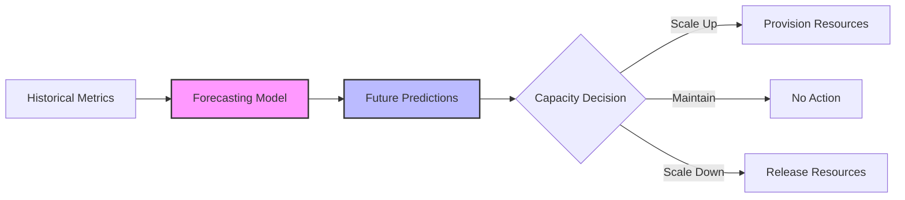
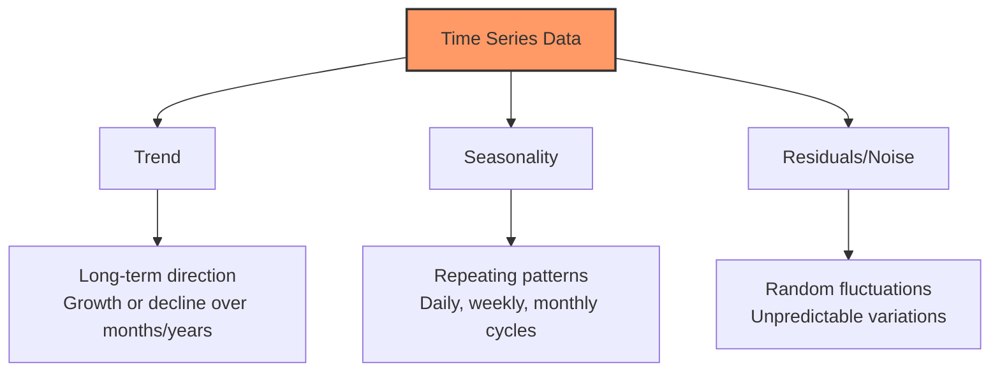
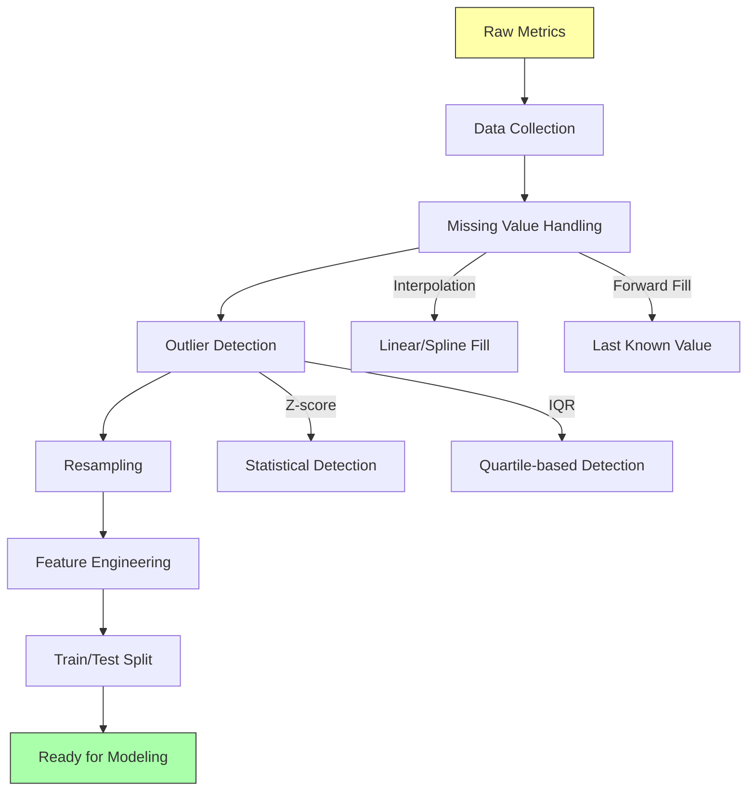
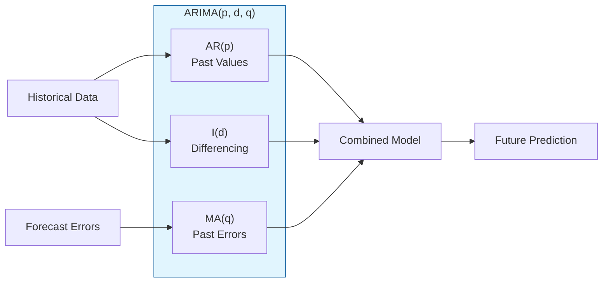
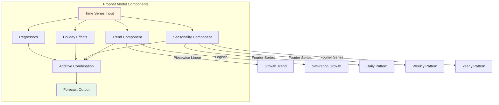
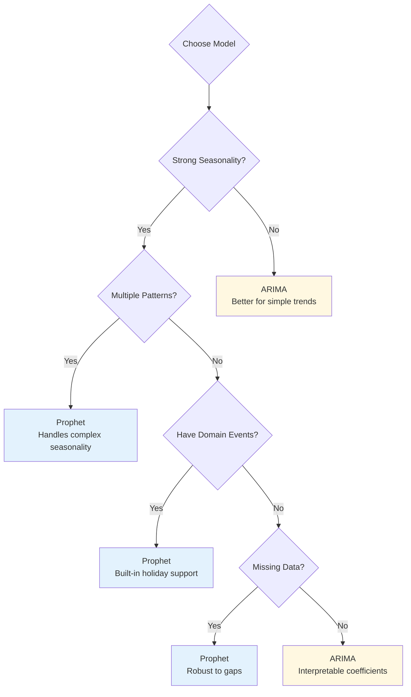
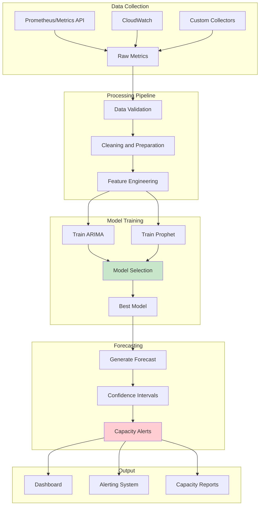
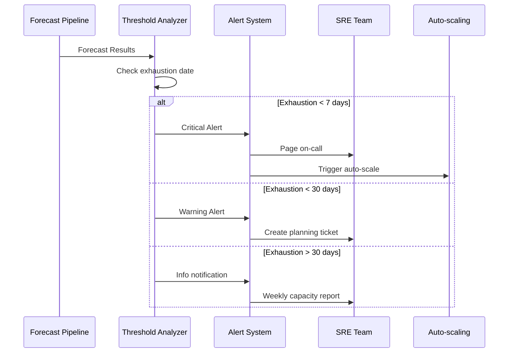

# How to Build Forecasting Models

Author: [nawazdhandala](https://github.com/nawazdhandala)

Tags: Capacity Planning, Machine Learning, SRE, Analytics

Description: Learn how to build forecasting models for predicting resource needs and capacity requirements.

---

> Capacity planning is not about guessing. It is about using data to predict the future with confidence. **Forecasting models transform historical metrics into actionable infrastructure decisions.**

Running out of capacity during a traffic spike is a nightmare scenario for any SRE. Over-provisioning burns money. The sweet spot lies in accurate forecasting, predicting resource needs before they become emergencies.

This guide walks you through building forecasting models for capacity planning, from basic time series concepts to production-ready implementations using ARIMA and Prophet.

---

## 1. Why Forecasting Matters for Capacity Planning

Traditional capacity planning relies on rules of thumb: "Add 20% buffer" or "Scale when CPU hits 70%." These approaches fail because they:

- React to problems instead of preventing them
- Ignore seasonal patterns (daily, weekly, monthly cycles)
- Cannot account for growth trends
- Waste money on over-provisioning or cause outages from under-provisioning

**Forecasting shifts you from reactive to proactive.** By modeling historical patterns, you can predict:

- When you will exhaust current capacity
- How much additional resources you need for upcoming events
- Seasonal demand fluctuations
- Long-term growth trajectories



---

## 2. Understanding Time Series Data

Before building models, you need to understand the structure of time series data. Capacity metrics like CPU utilization, memory usage, request rates, and disk I/O are all time series, sequences of data points indexed by time.

### Components of Time Series

Every time series can be decomposed into fundamental components:



| Component | Description | Example in Capacity Planning |
|-----------|-------------|------------------------------|
| Trend | Long-term increase or decrease | User growth driving higher baseline load |
| Seasonality | Regular, predictable patterns | Higher traffic during business hours |
| Cyclical | Irregular longer-term fluctuations | Economic cycles affecting usage |
| Residual | Random noise after removing other components | Unpredictable spikes |

### Stationarity: The Foundation of Forecasting

Most forecasting models assume your data is **stationary**, meaning statistical properties like mean and variance remain constant over time. Real-world capacity data is rarely stationary out of the box.

```python
# Check stationarity using the Augmented Dickey-Fuller test
# A p-value < 0.05 suggests the data is stationary

import pandas as pd
from statsmodels.tsa.stattools import adfuller

def check_stationarity(timeseries: pd.Series) -> dict:
    """
    Perform the Augmented Dickey-Fuller test for stationarity.

    Args:
        timeseries: A pandas Series with datetime index

    Returns:
        Dictionary containing test results and interpretation
    """
    # Run the ADF test
    result = adfuller(timeseries.dropna())

    # Extract and organize results
    output = {
        'test_statistic': result[0],
        'p_value': result[1],
        'lags_used': result[2],
        'observations': result[3],
        'critical_values': result[4],
        'is_stationary': result[1] < 0.05
    }

    # Print human-readable interpretation
    print(f"ADF Statistic: {result[0]:.4f}")
    print(f"p-value: {result[1]:.4f}")
    print("Critical Values:")
    for key, value in result[4].items():
        print(f"  {key}: {value:.4f}")

    if output['is_stationary']:
        print("\nResult: Data appears to be stationary (p < 0.05)")
    else:
        print("\nResult: Data appears to be non-stationary (p >= 0.05)")
        print("Consider differencing or transformation before modeling.")

    return output
```

---

## 3. Data Preparation Pipeline

Quality forecasts require quality data. Before feeding metrics into any model, you need a robust preparation pipeline.



### Complete Data Preparation Example

```python
# Complete data preparation pipeline for capacity forecasting
# This handles common issues in infrastructure metrics

import pandas as pd
import numpy as np
from typing import Tuple, Optional

def prepare_capacity_data(
    df: pd.DataFrame,
    metric_column: str,
    timestamp_column: str = 'timestamp',
    resample_freq: str = '1H',
    outlier_threshold: float = 3.0
) -> pd.DataFrame:
    """
    Prepare raw capacity metrics for forecasting.

    Args:
        df: Raw dataframe with timestamps and metric values
        metric_column: Name of the column containing the metric to forecast
        timestamp_column: Name of the timestamp column
        resample_freq: Frequency for resampling (e.g., '1H', '15T', '1D')
        outlier_threshold: Z-score threshold for outlier detection

    Returns:
        Cleaned and prepared DataFrame ready for modeling
    """
    # Create a copy to avoid modifying the original
    data = df.copy()

    # Step 1: Parse timestamps and set as index
    data[timestamp_column] = pd.to_datetime(data[timestamp_column])
    data = data.set_index(timestamp_column)
    data = data.sort_index()

    # Step 2: Resample to regular intervals
    # Use mean aggregation. Adjust based on your metric type
    data = data[[metric_column]].resample(resample_freq).mean()

    # Step 3: Handle missing values
    # First, identify gaps
    missing_count = data[metric_column].isna().sum()
    print(f"Missing values before interpolation: {missing_count}")

    # Interpolate small gaps (up to 6 periods)
    # For larger gaps, forward fill then backward fill
    data[metric_column] = data[metric_column].interpolate(
        method='time',
        limit=6
    )
    data[metric_column] = data[metric_column].fillna(method='ffill')
    data[metric_column] = data[metric_column].fillna(method='bfill')

    # Step 4: Detect and handle outliers using Z-score
    mean_val = data[metric_column].mean()
    std_val = data[metric_column].std()
    z_scores = np.abs((data[metric_column] - mean_val) / std_val)

    # Replace outliers with rolling median
    outlier_mask = z_scores > outlier_threshold
    outlier_count = outlier_mask.sum()
    print(f"Outliers detected: {outlier_count}")

    if outlier_count > 0:
        # Use rolling median to replace outliers
        rolling_median = data[metric_column].rolling(
            window=24,  # Adjust based on your data frequency
            center=True,
            min_periods=1
        ).median()
        data.loc[outlier_mask, metric_column] = rolling_median[outlier_mask]

    # Step 5: Add time-based features for later analysis
    data['hour'] = data.index.hour
    data['day_of_week'] = data.index.dayofweek
    data['month'] = data.index.month
    data['is_weekend'] = data['day_of_week'].isin([5, 6]).astype(int)

    print(f"Final dataset: {len(data)} observations")
    print(f"Date range: {data.index.min()} to {data.index.max()}")

    return data


def train_test_split_timeseries(
    data: pd.DataFrame,
    test_size: float = 0.2
) -> Tuple[pd.DataFrame, pd.DataFrame]:
    """
    Split time series data preserving temporal order.

    Unlike random splits, time series must maintain chronological order
    to avoid data leakage from the future.

    Args:
        data: Prepared DataFrame with datetime index
        test_size: Fraction of data to use for testing (0.0 to 1.0)

    Returns:
        Tuple of (train_data, test_data)
    """
    # Calculate split point
    split_idx = int(len(data) * (1 - test_size))

    train = data.iloc[:split_idx].copy()
    test = data.iloc[split_idx:].copy()

    print(f"Training set: {len(train)} observations")
    print(f"  From: {train.index.min()}")
    print(f"  To:   {train.index.max()}")
    print(f"Test set: {len(test)} observations")
    print(f"  From: {test.index.min()}")
    print(f"  To:   {test.index.max()}")

    return train, test
```

---

## 4. ARIMA: The Classical Approach

ARIMA (AutoRegressive Integrated Moving Average) is the workhorse of time series forecasting. It combines three components:

- **AR (AutoRegressive)**: Uses past values to predict future values
- **I (Integrated)**: Differencing to achieve stationarity
- **MA (Moving Average)**: Uses past forecast errors



### Choosing ARIMA Parameters

The parameters (p, d, q) control the model behavior:

| Parameter | Name | How to Determine |
|-----------|------|------------------|
| p | AR order | Partial Autocorrelation Function (PACF) cutoff |
| d | Differencing | Number of differences needed for stationarity |
| q | MA order | Autocorrelation Function (ACF) cutoff |

### Complete ARIMA Implementation

```python
# ARIMA implementation for capacity forecasting
# Includes automatic parameter selection and diagnostics

import pandas as pd
import numpy as np
from statsmodels.tsa.arima.model import ARIMA
from statsmodels.tsa.stattools import acf, pacf
import warnings
from typing import Tuple, Dict, Any

def find_optimal_arima_params(
    series: pd.Series,
    max_p: int = 5,
    max_d: int = 2,
    max_q: int = 5
) -> Tuple[int, int, int]:
    """
    Find optimal ARIMA parameters using AIC criterion.

    This performs a grid search over possible parameter combinations
    and returns the combination with the lowest AIC score.

    Args:
        series: Time series data to model
        max_p: Maximum AR order to test
        max_d: Maximum differencing order to test
        max_q: Maximum MA order to test

    Returns:
        Tuple of (p, d, q) representing optimal parameters
    """
    best_aic = float('inf')
    best_params = (0, 0, 0)

    # Suppress convergence warnings during grid search
    warnings.filterwarnings('ignore')

    total_combinations = (max_p + 1) * (max_d + 1) * (max_q + 1)
    tested = 0

    print("Searching for optimal ARIMA parameters...")
    print(f"Testing {total_combinations} combinations")

    for p in range(max_p + 1):
        for d in range(max_d + 1):
            for q in range(max_q + 1):
                tested += 1
                try:
                    # Fit ARIMA model
                    model = ARIMA(series, order=(p, d, q))
                    fitted = model.fit()

                    # Check if this is the best model so far
                    if fitted.aic < best_aic:
                        best_aic = fitted.aic
                        best_params = (p, d, q)
                        print(f"  New best: ARIMA{best_params} AIC={best_aic:.2f}")

                except Exception:
                    # Skip invalid parameter combinations
                    continue

    warnings.filterwarnings('default')

    print(f"\nOptimal parameters: ARIMA{best_params}")
    print(f"Best AIC: {best_aic:.2f}")

    return best_params


class CapacityARIMAForecaster:
    """
    ARIMA-based forecaster for capacity planning.

    This class provides a complete workflow for training ARIMA models
    on capacity metrics and generating forecasts with confidence intervals.
    """

    def __init__(self, order: Tuple[int, int, int] = None):
        """
        Initialize the forecaster.

        Args:
            order: ARIMA order (p, d, q). If None, will be determined automatically.
        """
        self.order = order
        self.model = None
        self.fitted_model = None
        self.training_data = None

    def fit(self, data: pd.Series, auto_order: bool = True) -> 'CapacityARIMAForecaster':
        """
        Fit the ARIMA model to training data.

        Args:
            data: Time series of capacity metrics
            auto_order: If True and order is None, automatically find optimal parameters

        Returns:
            Self for method chaining
        """
        self.training_data = data.copy()

        # Determine order if not specified
        if self.order is None and auto_order:
            self.order = find_optimal_arima_params(data)
        elif self.order is None:
            # Default to simple ARIMA(1,1,1)
            self.order = (1, 1, 1)
            print(f"Using default order: ARIMA{self.order}")

        # Fit the model
        print(f"\nFitting ARIMA{self.order} model...")
        self.model = ARIMA(data, order=self.order)
        self.fitted_model = self.model.fit()

        # Print model summary
        print("\nModel Summary:")
        print(f"  AIC: {self.fitted_model.aic:.2f}")
        print(f"  BIC: {self.fitted_model.bic:.2f}")

        return self

    def forecast(
        self,
        steps: int,
        confidence_level: float = 0.95
    ) -> pd.DataFrame:
        """
        Generate forecast with confidence intervals.

        Args:
            steps: Number of future periods to forecast
            confidence_level: Confidence level for prediction intervals

        Returns:
            DataFrame with columns: forecast, lower_bound, upper_bound
        """
        if self.fitted_model is None:
            raise ValueError("Model must be fit before forecasting. Call fit() first.")

        # Generate forecast
        forecast_result = self.fitted_model.get_forecast(steps=steps)

        # Extract predictions and confidence intervals
        predictions = forecast_result.predicted_mean
        conf_int = forecast_result.conf_int(alpha=1 - confidence_level)

        # Create result DataFrame
        result = pd.DataFrame({
            'forecast': predictions,
            'lower_bound': conf_int.iloc[:, 0],
            'upper_bound': conf_int.iloc[:, 1]
        })

        # Ensure no negative values for capacity metrics
        result['forecast'] = result['forecast'].clip(lower=0)
        result['lower_bound'] = result['lower_bound'].clip(lower=0)

        return result

    def evaluate(self, test_data: pd.Series) -> Dict[str, float]:
        """
        Evaluate model performance on test data.

        Args:
            test_data: Actual values to compare against

        Returns:
            Dictionary of evaluation metrics
        """
        # Generate predictions for test period
        predictions = self.forecast(len(test_data))['forecast']
        predictions.index = test_data.index

        # Calculate error metrics
        errors = test_data - predictions

        metrics = {
            'mae': np.abs(errors).mean(),
            'rmse': np.sqrt((errors ** 2).mean()),
            'mape': (np.abs(errors) / test_data * 100).mean(),
            'mpe': (errors / test_data * 100).mean()
        }

        print("\nModel Evaluation Metrics:")
        print(f"  MAE  (Mean Absolute Error):      {metrics['mae']:.2f}")
        print(f"  RMSE (Root Mean Square Error):   {metrics['rmse']:.2f}")
        print(f"  MAPE (Mean Absolute % Error):    {metrics['mape']:.2f}%")
        print(f"  MPE  (Mean Percentage Error):    {metrics['mpe']:.2f}%")

        return metrics


# Example usage
if __name__ == "__main__":
    # Generate sample capacity data (simulating CPU utilization)
    np.random.seed(42)
    dates = pd.date_range(start='2025-01-01', periods=720, freq='H')

    # Create realistic pattern: trend + daily seasonality + noise
    trend = np.linspace(40, 55, 720)
    daily_pattern = 15 * np.sin(2 * np.pi * np.arange(720) / 24)
    noise = np.random.normal(0, 3, 720)

    cpu_data = pd.Series(
        trend + daily_pattern + noise,
        index=dates,
        name='cpu_utilization'
    )

    # Split data
    train_size = int(len(cpu_data) * 0.8)
    train = cpu_data[:train_size]
    test = cpu_data[train_size:]

    # Create and train forecaster
    forecaster = CapacityARIMAForecaster()
    forecaster.fit(train, auto_order=True)

    # Generate forecast
    forecast_result = forecaster.forecast(steps=len(test))
    forecast_result.index = test.index

    # Evaluate
    metrics = forecaster.evaluate(test)
```

---

## 5. Prophet: Modern Forecasting for Capacity Planning

Prophet, developed by Meta, excels at forecasting time series with strong seasonal patterns, exactly what you see in infrastructure metrics. It handles:

- Multiple seasonalities (daily, weekly, yearly)
- Holiday effects
- Missing data
- Trend changes



### Prophet Implementation for Capacity Planning

```python
# Prophet-based forecasting for capacity planning
# Handles seasonality and special events automatically

import pandas as pd
import numpy as np
from prophet import Prophet
from typing import Dict, List, Optional, Any

class CapacityProphetForecaster:
    """
    Prophet-based forecaster optimized for infrastructure metrics.

    Prophet excels at capturing multiple seasonality patterns common
    in capacity data: daily cycles, weekly patterns, and special events.
    """

    def __init__(
        self,
        daily_seasonality: bool = True,
        weekly_seasonality: bool = True,
        yearly_seasonality: bool = False,
        changepoint_prior_scale: float = 0.05,
        seasonality_prior_scale: float = 10.0
    ):
        """
        Initialize Prophet forecaster with capacity-optimized defaults.

        Args:
            daily_seasonality: Enable daily seasonal patterns
            weekly_seasonality: Enable weekly seasonal patterns
            yearly_seasonality: Enable yearly patterns (disable for short histories)
            changepoint_prior_scale: Flexibility of trend changes (higher = more flexible)
            seasonality_prior_scale: Strength of seasonality (higher = stronger)
        """
        self.model = Prophet(
            daily_seasonality=daily_seasonality,
            weekly_seasonality=weekly_seasonality,
            yearly_seasonality=yearly_seasonality,
            changepoint_prior_scale=changepoint_prior_scale,
            seasonality_prior_scale=seasonality_prior_scale
        )
        self.fitted = False
        self.training_data = None

    def add_capacity_events(
        self,
        events_df: pd.DataFrame
    ) -> 'CapacityProphetForecaster':
        """
        Add known events that affect capacity (deployments, sales, etc.).

        Args:
            events_df: DataFrame with columns 'holiday' (name), 'ds' (date),
                      and optionally 'lower_window', 'upper_window'

        Returns:
            Self for method chaining
        """
        # Add events as holidays in Prophet terminology
        self.model = Prophet(
            holidays=events_df,
            daily_seasonality=self.model.daily_seasonality,
            weekly_seasonality=self.model.weekly_seasonality,
            yearly_seasonality=self.model.yearly_seasonality
        )
        return self

    def add_custom_seasonality(
        self,
        name: str,
        period: float,
        fourier_order: int
    ) -> 'CapacityProphetForecaster':
        """
        Add custom seasonality pattern (e.g., monthly billing cycles).

        Args:
            name: Name for the seasonality component
            period: Period in days (e.g., 30.5 for monthly)
            fourier_order: Complexity of the pattern (higher = more complex)

        Returns:
            Self for method chaining
        """
        self.model.add_seasonality(
            name=name,
            period=period,
            fourier_order=fourier_order
        )
        return self

    def prepare_data(self, data: pd.Series) -> pd.DataFrame:
        """
        Convert time series to Prophet's expected format.

        Prophet requires specific column names: 'ds' for dates, 'y' for values.

        Args:
            data: Time series with datetime index

        Returns:
            DataFrame formatted for Prophet
        """
        df = pd.DataFrame({
            'ds': data.index,
            'y': data.values
        })
        return df

    def fit(self, data: pd.Series) -> 'CapacityProphetForecaster':
        """
        Fit the Prophet model to training data.

        Args:
            data: Time series of capacity metrics

        Returns:
            Self for method chaining
        """
        self.training_data = data.copy()
        prophet_df = self.prepare_data(data)

        print("Fitting Prophet model...")
        print(f"  Training observations: {len(prophet_df)}")
        print(f"  Date range: {prophet_df['ds'].min()} to {prophet_df['ds'].max()}")

        # Fit the model (suppress Stan output)
        self.model.fit(prophet_df)
        self.fitted = True

        print("Model fitted successfully.")
        return self

    def forecast(
        self,
        periods: int,
        freq: str = 'H',
        include_history: bool = False
    ) -> pd.DataFrame:
        """
        Generate forecast for future periods.

        Args:
            periods: Number of future periods to forecast
            freq: Frequency of predictions ('H'=hourly, 'D'=daily, etc.)
            include_history: Include fitted values for historical period

        Returns:
            DataFrame with forecast, trend, and seasonality components
        """
        if not self.fitted:
            raise ValueError("Model must be fit before forecasting. Call fit() first.")

        # Create future dataframe
        future = self.model.make_future_dataframe(
            periods=periods,
            freq=freq,
            include_history=include_history
        )

        # Generate predictions
        forecast = self.model.predict(future)

        # Select relevant columns
        result = forecast[[
            'ds', 'yhat', 'yhat_lower', 'yhat_upper',
            'trend', 'trend_lower', 'trend_upper'
        ]].copy()

        # Rename for clarity
        result.columns = [
            'timestamp', 'forecast', 'lower_bound', 'upper_bound',
            'trend', 'trend_lower', 'trend_upper'
        ]

        # Ensure no negative values (capacity cannot be negative)
        result['forecast'] = result['forecast'].clip(lower=0)
        result['lower_bound'] = result['lower_bound'].clip(lower=0)

        # Set timestamp as index
        result = result.set_index('timestamp')

        return result

    def evaluate(self, test_data: pd.Series) -> Dict[str, float]:
        """
        Evaluate model performance on test data.

        Args:
            test_data: Actual values to compare against

        Returns:
            Dictionary of evaluation metrics
        """
        # Generate forecast for test period length
        forecast = self.forecast(
            periods=len(test_data),
            include_history=False
        )

        # Align indices
        predictions = forecast['forecast'].values
        actuals = test_data.values

        # Calculate metrics
        errors = actuals - predictions

        metrics = {
            'mae': np.abs(errors).mean(),
            'rmse': np.sqrt((errors ** 2).mean()),
            'mape': (np.abs(errors) / np.abs(actuals) * 100).mean(),
            'coverage': self._calculate_coverage(test_data, forecast)
        }

        print("\nProphet Model Evaluation:")
        print(f"  MAE  (Mean Absolute Error):      {metrics['mae']:.2f}")
        print(f"  RMSE (Root Mean Square Error):   {metrics['rmse']:.2f}")
        print(f"  MAPE (Mean Absolute % Error):    {metrics['mape']:.2f}%")
        print(f"  Coverage (% within bounds):      {metrics['coverage']:.1f}%")

        return metrics

    def _calculate_coverage(
        self,
        actuals: pd.Series,
        forecast: pd.DataFrame
    ) -> float:
        """Calculate what percentage of actuals fall within prediction bounds."""
        actual_values = actuals.values
        lower = forecast['lower_bound'].values
        upper = forecast['upper_bound'].values

        within_bounds = ((actual_values >= lower) & (actual_values <= upper)).sum()
        coverage = (within_bounds / len(actual_values)) * 100

        return coverage

    def get_capacity_exhaustion_date(
        self,
        threshold: float,
        max_periods: int = 8760  # One year of hourly data
    ) -> Optional[pd.Timestamp]:
        """
        Predict when capacity will exceed a given threshold.

        This is crucial for capacity planning, knowing when you will
        run out of headroom.

        Args:
            threshold: Capacity threshold to check against
            max_periods: Maximum periods to forecast ahead

        Returns:
            Timestamp when threshold is expected to be exceeded, or None
        """
        forecast = self.forecast(periods=max_periods, include_history=False)

        # Find first point where forecast exceeds threshold
        exceeds_threshold = forecast['forecast'] > threshold

        if exceeds_threshold.any():
            exhaustion_date = forecast.index[exceeds_threshold][0]
            days_until = (exhaustion_date - pd.Timestamp.now()).days

            print(f"\nCapacity Exhaustion Prediction:")
            print(f"  Threshold: {threshold}")
            print(f"  Exhaustion date: {exhaustion_date}")
            print(f"  Days until exhaustion: {days_until}")

            return exhaustion_date
        else:
            print(f"\nCapacity will not exceed {threshold} within forecast period.")
            return None


# Example usage with Prophet
if __name__ == "__main__":
    # Generate sample data with realistic patterns
    np.random.seed(42)
    dates = pd.date_range(start='2025-01-01', periods=2160, freq='H')  # 90 days

    # Create multi-seasonal pattern
    # Daily pattern: low at night, high during business hours
    daily = 20 * np.sin(2 * np.pi * (np.arange(2160) - 6) / 24)

    # Weekly pattern: lower on weekends
    weekly = 10 * np.sin(2 * np.pi * np.arange(2160) / (24 * 7))

    # Growth trend
    trend = np.linspace(50, 65, 2160)

    # Random noise
    noise = np.random.normal(0, 3, 2160)

    memory_usage = pd.Series(
        trend + daily + weekly + noise,
        index=dates,
        name='memory_percent'
    )

    # Split data
    train = memory_usage[:'2025-03-15']
    test = memory_usage['2025-03-15':]

    # Create and train Prophet forecaster
    forecaster = CapacityProphetForecaster(
        daily_seasonality=True,
        weekly_seasonality=True
    )

    # Add monthly seasonality for billing cycles
    forecaster.add_custom_seasonality(
        name='monthly',
        period=30.5,
        fourier_order=5
    )

    # Fit model
    forecaster.fit(train)

    # Generate forecast
    forecast_result = forecaster.forecast(periods=len(test))

    # Evaluate
    metrics = forecaster.evaluate(test)

    # Check when we will hit 85% capacity
    exhaustion_date = forecaster.get_capacity_exhaustion_date(threshold=85)
```

---

## 6. Comparing ARIMA and Prophet

Both models have their strengths. Choose based on your specific needs:



| Aspect | ARIMA | Prophet |
|--------|-------|---------|
| Seasonality | Manual configuration | Automatic detection |
| Missing data | Requires preprocessing | Handles natively |
| Special events | Manual dummy variables | Built-in holiday support |
| Interpretability | Statistical coefficients | Component decomposition |
| Ease of use | Requires expertise | Beginner-friendly |
| Customization | Very flexible | Moderate flexibility |
| Speed | Fast | Slower on large datasets |
| Best for | Simple patterns, short-term | Complex seasonality, long-term |

---

## 7. Building a Production Forecasting Pipeline

Moving from notebooks to production requires robust automation.



### Production Pipeline Implementation

```python
# Production-ready capacity forecasting pipeline
# Combines ARIMA and Prophet with automatic model selection

import pandas as pd
import numpy as np
from typing import Dict, List, Optional, Tuple, Any
from dataclasses import dataclass
from datetime import datetime, timedelta
import logging

# Configure logging
logging.basicConfig(
    level=logging.INFO,
    format='%(asctime)s - %(name)s - %(levelname)s - %(message)s'
)
logger = logging.getLogger('capacity_forecaster')


@dataclass
class ForecastResult:
    """Container for forecast results with metadata."""
    metric_name: str
    model_type: str
    forecast_df: pd.DataFrame
    metrics: Dict[str, float]
    exhaustion_date: Optional[datetime]
    generated_at: datetime

    def to_dict(self) -> Dict[str, Any]:
        """Convert to dictionary for JSON serialization."""
        return {
            'metric_name': self.metric_name,
            'model_type': self.model_type,
            'forecast': self.forecast_df.to_dict(),
            'metrics': self.metrics,
            'exhaustion_date': str(self.exhaustion_date) if self.exhaustion_date else None,
            'generated_at': str(self.generated_at)
        }


class CapacityForecastingPipeline:
    """
    Production pipeline for capacity forecasting.

    This pipeline:
    1. Validates and prepares incoming data
    2. Trains both ARIMA and Prophet models
    3. Automatically selects the best performing model
    4. Generates forecasts with confidence intervals
    5. Calculates capacity exhaustion dates
    """

    def __init__(
        self,
        capacity_thresholds: Dict[str, float] = None,
        forecast_horizon_hours: int = 168,  # One week default
        retrain_interval_hours: int = 24
    ):
        """
        Initialize the forecasting pipeline.

        Args:
            capacity_thresholds: Dict mapping metric names to threshold values
            forecast_horizon_hours: How far ahead to forecast
            retrain_interval_hours: How often to retrain models
        """
        self.capacity_thresholds = capacity_thresholds or {
            'cpu_percent': 85.0,
            'memory_percent': 90.0,
            'disk_percent': 85.0,
            'network_utilization': 80.0
        }
        self.forecast_horizon = forecast_horizon_hours
        self.retrain_interval = retrain_interval_hours
        self.models = {}  # Store trained models
        self.last_train_time = {}

    def validate_data(self, data: pd.Series) -> Tuple[bool, List[str]]:
        """
        Validate input data quality.

        Args:
            data: Time series to validate

        Returns:
            Tuple of (is_valid, list of issues)
        """
        issues = []

        # Check minimum data points
        if len(data) < 168:  # Less than one week of hourly data
            issues.append(f"Insufficient data: {len(data)} points (minimum 168)")

        # Check for datetime index
        if not isinstance(data.index, pd.DatetimeIndex):
            issues.append("Index must be DatetimeIndex")

        # Check for excessive missing values
        missing_pct = data.isna().sum() / len(data) * 100
        if missing_pct > 20:
            issues.append(f"Too many missing values: {missing_pct:.1f}%")

        # Check for constant values (no variation)
        if data.std() < 0.001:
            issues.append("Data has no variation (constant values)")

        # Check for future dates
        if data.index.max() > pd.Timestamp.now():
            issues.append("Data contains future timestamps")

        is_valid = len(issues) == 0

        if not is_valid:
            logger.warning(f"Data validation failed: {issues}")
        else:
            logger.info("Data validation passed")

        return is_valid, issues

    def prepare_data(self, data: pd.Series) -> pd.Series:
        """
        Clean and prepare data for modeling.

        Args:
            data: Raw time series

        Returns:
            Cleaned time series
        """
        # Sort by index
        data = data.sort_index()

        # Remove duplicates (keep last)
        data = data[~data.index.duplicated(keep='last')]

        # Interpolate missing values
        data = data.interpolate(method='time', limit=6)
        data = data.fillna(method='ffill').fillna(method='bfill')

        # Clip extreme outliers (beyond 4 standard deviations)
        mean_val = data.mean()
        std_val = data.std()
        lower_bound = mean_val - 4 * std_val
        upper_bound = mean_val + 4 * std_val
        data = data.clip(lower=lower_bound, upper=upper_bound)

        logger.info(f"Data prepared: {len(data)} points, range [{data.min():.2f}, {data.max():.2f}]")

        return data

    def train_and_select_model(
        self,
        data: pd.Series,
        metric_name: str
    ) -> Tuple[Any, str, Dict[str, float]]:
        """
        Train both models and select the best performer.

        Args:
            data: Training data
            metric_name: Name of the metric being forecasted

        Returns:
            Tuple of (best_model, model_type, evaluation_metrics)
        """
        # Split data for evaluation
        split_idx = int(len(data) * 0.8)
        train = data.iloc[:split_idx]
        test = data.iloc[split_idx:]

        results = {}

        # Train ARIMA
        try:
            logger.info("Training ARIMA model...")
            from statsmodels.tsa.arima.model import ARIMA

            # Use simple ARIMA(1,1,1) for speed in production
            arima_model = ARIMA(train, order=(1, 1, 1))
            arima_fitted = arima_model.fit()

            # Evaluate
            arima_forecast = arima_fitted.forecast(steps=len(test))
            arima_mae = np.abs(test.values - arima_forecast.values).mean()

            results['arima'] = {
                'model': arima_fitted,
                'mae': arima_mae
            }
            logger.info(f"ARIMA MAE: {arima_mae:.2f}")

        except Exception as e:
            logger.warning(f"ARIMA training failed: {e}")

        # Train Prophet
        try:
            logger.info("Training Prophet model...")
            from prophet import Prophet

            prophet_df = pd.DataFrame({
                'ds': train.index,
                'y': train.values
            })

            prophet_model = Prophet(
                daily_seasonality=True,
                weekly_seasonality=True,
                yearly_seasonality=False
            )
            prophet_model.fit(prophet_df)

            # Evaluate
            future = prophet_model.make_future_dataframe(
                periods=len(test),
                freq='H',
                include_history=False
            )
            prophet_forecast = prophet_model.predict(future)
            prophet_mae = np.abs(test.values - prophet_forecast['yhat'].values).mean()

            results['prophet'] = {
                'model': prophet_model,
                'mae': prophet_mae
            }
            logger.info(f"Prophet MAE: {prophet_mae:.2f}")

        except Exception as e:
            logger.warning(f"Prophet training failed: {e}")

        # Select best model
        if not results:
            raise ValueError("All models failed to train")

        best_type = min(results.keys(), key=lambda k: results[k]['mae'])
        best_model = results[best_type]['model']
        best_mae = results[best_type]['mae']

        logger.info(f"Selected model: {best_type} (MAE: {best_mae:.2f})")

        # Retrain best model on full data
        if best_type == 'arima':
            full_model = ARIMA(data, order=(1, 1, 1))
            best_model = full_model.fit()
        else:
            full_df = pd.DataFrame({'ds': data.index, 'y': data.values})
            best_model = Prophet(
                daily_seasonality=True,
                weekly_seasonality=True,
                yearly_seasonality=False
            )
            best_model.fit(full_df)

        return best_model, best_type, {'mae': best_mae}

    def generate_forecast(
        self,
        model: Any,
        model_type: str,
        last_timestamp: pd.Timestamp
    ) -> pd.DataFrame:
        """
        Generate forecast from trained model.

        Args:
            model: Trained model (ARIMA or Prophet)
            model_type: Type of model ('arima' or 'prophet')
            last_timestamp: Last timestamp in training data

        Returns:
            DataFrame with forecast, lower_bound, upper_bound
        """
        if model_type == 'arima':
            forecast_result = model.get_forecast(steps=self.forecast_horizon)
            predictions = forecast_result.predicted_mean
            conf_int = forecast_result.conf_int()

            # Create date range for forecast
            forecast_dates = pd.date_range(
                start=last_timestamp + timedelta(hours=1),
                periods=self.forecast_horizon,
                freq='H'
            )

            result = pd.DataFrame({
                'forecast': predictions.values,
                'lower_bound': conf_int.iloc[:, 0].values,
                'upper_bound': conf_int.iloc[:, 1].values
            }, index=forecast_dates)

        else:  # Prophet
            future = model.make_future_dataframe(
                periods=self.forecast_horizon,
                freq='H',
                include_history=False
            )
            prophet_forecast = model.predict(future)

            result = pd.DataFrame({
                'forecast': prophet_forecast['yhat'].values,
                'lower_bound': prophet_forecast['yhat_lower'].values,
                'upper_bound': prophet_forecast['yhat_upper'].values
            }, index=prophet_forecast['ds'].values)

        # Ensure non-negative values
        result = result.clip(lower=0)

        return result

    def find_exhaustion_date(
        self,
        forecast_df: pd.DataFrame,
        threshold: float
    ) -> Optional[pd.Timestamp]:
        """
        Find when capacity threshold will be exceeded.

        Args:
            forecast_df: Forecast DataFrame
            threshold: Capacity threshold

        Returns:
            Timestamp of threshold breach or None
        """
        exceeds = forecast_df['forecast'] > threshold

        if exceeds.any():
            return pd.Timestamp(forecast_df.index[exceeds][0])
        return None

    def run(
        self,
        data: pd.Series,
        metric_name: str
    ) -> ForecastResult:
        """
        Execute the full forecasting pipeline.

        Args:
            data: Time series of capacity metric
            metric_name: Name of the metric

        Returns:
            ForecastResult with all outputs
        """
        logger.info(f"Starting forecast pipeline for {metric_name}")

        # Validate
        is_valid, issues = self.validate_data(data)
        if not is_valid:
            raise ValueError(f"Data validation failed: {issues}")

        # Prepare
        clean_data = self.prepare_data(data)

        # Train and select
        model, model_type, metrics = self.train_and_select_model(
            clean_data,
            metric_name
        )

        # Generate forecast
        forecast_df = self.generate_forecast(
            model,
            model_type,
            clean_data.index.max()
        )

        # Find exhaustion date
        threshold = self.capacity_thresholds.get(metric_name, 85.0)
        exhaustion_date = self.find_exhaustion_date(forecast_df, threshold)

        if exhaustion_date:
            days_until = (exhaustion_date - pd.Timestamp.now()).days
            logger.warning(
                f"Capacity threshold ({threshold}) will be exceeded "
                f"on {exhaustion_date} ({days_until} days)"
            )

        # Store model for reuse
        self.models[metric_name] = {
            'model': model,
            'type': model_type
        }
        self.last_train_time[metric_name] = datetime.now()

        result = ForecastResult(
            metric_name=metric_name,
            model_type=model_type,
            forecast_df=forecast_df,
            metrics=metrics,
            exhaustion_date=exhaustion_date,
            generated_at=datetime.now()
        )

        logger.info(f"Forecast complete for {metric_name}")

        return result


# Example: Running the pipeline
if __name__ == "__main__":
    # Simulate fetching metrics from monitoring system
    np.random.seed(42)
    dates = pd.date_range(
        start='2025-01-01',
        end='2025-01-30',
        freq='H'
    )

    # Simulate CPU utilization with realistic patterns
    trend = np.linspace(55, 70, len(dates))
    daily = 15 * np.sin(2 * np.pi * (np.arange(len(dates)) - 8) / 24)
    weekly = 5 * np.sin(2 * np.pi * np.arange(len(dates)) / (24 * 7))
    noise = np.random.normal(0, 2, len(dates))

    cpu_data = pd.Series(
        trend + daily + weekly + noise,
        index=dates,
        name='cpu_percent'
    )

    # Create and run pipeline
    pipeline = CapacityForecastingPipeline(
        capacity_thresholds={'cpu_percent': 85.0},
        forecast_horizon_hours=168
    )

    result = pipeline.run(cpu_data, 'cpu_percent')

    print("\n" + "=" * 50)
    print("FORECAST RESULTS")
    print("=" * 50)
    print(f"Metric: {result.metric_name}")
    print(f"Model: {result.model_type}")
    print(f"MAE: {result.metrics['mae']:.2f}")
    if result.exhaustion_date:
        print(f"Capacity Exhaustion: {result.exhaustion_date}")
    else:
        print("Capacity Exhaustion: Not within forecast horizon")
    print("\nForecast Preview (first 24 hours):")
    print(result.forecast_df.head(24))
```

---

## 8. Alerting on Capacity Forecasts

Forecasts are only valuable if they trigger action. Integrate forecasting with your alerting system.



### Alert Configuration Example

```python
# Capacity forecast alerting configuration
# Integrates with common alerting systems

from dataclasses import dataclass
from enum import Enum
from typing import Callable, Optional
from datetime import datetime, timedelta
import json

class AlertSeverity(Enum):
    """Alert severity levels."""
    INFO = "info"
    WARNING = "warning"
    CRITICAL = "critical"


@dataclass
class CapacityAlert:
    """Represents a capacity planning alert."""
    severity: AlertSeverity
    metric_name: str
    current_value: float
    threshold: float
    exhaustion_date: Optional[datetime]
    days_until_exhaustion: Optional[int]
    forecast_confidence: float
    recommended_action: str

    def to_dict(self) -> dict:
        """Convert to dictionary for JSON/webhook payloads."""
        return {
            'severity': self.severity.value,
            'metric_name': self.metric_name,
            'current_value': self.current_value,
            'threshold': self.threshold,
            'exhaustion_date': str(self.exhaustion_date) if self.exhaustion_date else None,
            'days_until_exhaustion': self.days_until_exhaustion,
            'forecast_confidence': self.forecast_confidence,
            'recommended_action': self.recommended_action
        }


class CapacityAlertManager:
    """
    Manages capacity planning alerts based on forecast results.

    Configurable thresholds for different severity levels
    and integration with external alerting systems.
    """

    def __init__(
        self,
        critical_days: int = 7,
        warning_days: int = 30,
        info_days: int = 90
    ):
        """
        Initialize alert manager.

        Args:
            critical_days: Days until exhaustion for critical alert
            warning_days: Days until exhaustion for warning alert
            info_days: Days until exhaustion for info notification
        """
        self.critical_days = critical_days
        self.warning_days = warning_days
        self.info_days = info_days
        self.alert_handlers = []

    def register_handler(
        self,
        handler: Callable[[CapacityAlert], None]
    ) -> None:
        """
        Register an alert handler function.

        Args:
            handler: Function that takes a CapacityAlert and processes it
        """
        self.alert_handlers.append(handler)

    def evaluate_forecast(
        self,
        metric_name: str,
        current_value: float,
        threshold: float,
        exhaustion_date: Optional[datetime],
        model_mae: float
    ) -> Optional[CapacityAlert]:
        """
        Evaluate a forecast and generate an alert if needed.

        Args:
            metric_name: Name of the capacity metric
            current_value: Current value of the metric
            threshold: Capacity threshold
            exhaustion_date: Predicted exhaustion date
            model_mae: Model's mean absolute error (for confidence)

        Returns:
            CapacityAlert if alert threshold met, None otherwise
        """
        # Calculate confidence based on model accuracy
        # Lower MAE = higher confidence
        confidence = max(0, min(100, 100 - model_mae * 2))

        if exhaustion_date is None:
            # No exhaustion predicted within forecast horizon
            return None

        days_until = (exhaustion_date - datetime.now()).days

        # Determine severity and recommended action
        if days_until <= self.critical_days:
            severity = AlertSeverity.CRITICAL
            action = (
                f"IMMEDIATE ACTION REQUIRED: {metric_name} will exceed "
                f"{threshold} in {days_until} days. Scale resources now."
            )
        elif days_until <= self.warning_days:
            severity = AlertSeverity.WARNING
            action = (
                f"Plan capacity increase for {metric_name}. "
                f"Threshold breach expected in {days_until} days."
            )
        elif days_until <= self.info_days:
            severity = AlertSeverity.INFO
            action = (
                f"Monitor {metric_name} growth. "
                f"Capacity planning needed within {days_until} days."
            )
        else:
            return None

        alert = CapacityAlert(
            severity=severity,
            metric_name=metric_name,
            current_value=current_value,
            threshold=threshold,
            exhaustion_date=exhaustion_date,
            days_until_exhaustion=days_until,
            forecast_confidence=confidence,
            recommended_action=action
        )

        # Dispatch to handlers
        for handler in self.alert_handlers:
            try:
                handler(alert)
            except Exception as e:
                print(f"Alert handler error: {e}")

        return alert


# Example alert handlers
def slack_handler(alert: CapacityAlert) -> None:
    """Send alert to Slack webhook."""
    severity_emoji = {
        AlertSeverity.CRITICAL: ":rotating_light:",
        AlertSeverity.WARNING: ":warning:",
        AlertSeverity.INFO: ":information_source:"
    }

    payload = {
        "text": f"{severity_emoji[alert.severity]} Capacity Alert: {alert.metric_name}",
        "blocks": [
            {
                "type": "section",
                "text": {
                    "type": "mrkdwn",
                    "text": (
                        f"*{alert.severity.value.upper()}*: {alert.metric_name}\n"
                        f"Current: {alert.current_value:.1f}% | Threshold: {alert.threshold}%\n"
                        f"Days until threshold: {alert.days_until_exhaustion}\n"
                        f"Confidence: {alert.forecast_confidence:.0f}%"
                    )
                }
            },
            {
                "type": "section",
                "text": {
                    "type": "mrkdwn",
                    "text": f"*Recommended Action:*\n{alert.recommended_action}"
                }
            }
        ]
    }

    # In production, send to actual webhook
    print(f"Slack alert payload: {json.dumps(payload, indent=2)}")


def pagerduty_handler(alert: CapacityAlert) -> None:
    """Create PagerDuty incident for critical alerts."""
    if alert.severity != AlertSeverity.CRITICAL:
        return

    payload = {
        "routing_key": "YOUR_INTEGRATION_KEY",
        "event_action": "trigger",
        "payload": {
            "summary": f"Capacity Critical: {alert.metric_name} exhaustion in {alert.days_until_exhaustion} days",
            "severity": "critical",
            "source": "capacity-forecaster",
            "custom_details": alert.to_dict()
        }
    }

    # In production, POST to PagerDuty Events API
    print(f"PagerDuty payload: {json.dumps(payload, indent=2)}")


# Usage example
if __name__ == "__main__":
    # Create alert manager
    alert_manager = CapacityAlertManager(
        critical_days=7,
        warning_days=30
    )

    # Register handlers
    alert_manager.register_handler(slack_handler)
    alert_manager.register_handler(pagerduty_handler)

    # Evaluate a forecast result
    alert = alert_manager.evaluate_forecast(
        metric_name="cpu_percent",
        current_value=72.5,
        threshold=85.0,
        exhaustion_date=datetime.now() + timedelta(days=5),
        model_mae=3.2
    )

    if alert:
        print(f"\nGenerated Alert: {alert.severity.value}")
```

---

## 9. Best Practices for Production Forecasting

### Data Collection

1. **Collect at appropriate granularity**: Hourly data for most metrics, 5-minute for volatile metrics
2. **Retain sufficient history**: Minimum 3 months, ideally 1 year for seasonal patterns
3. **Include metadata**: Deployments, incidents, and scaling events affect patterns

### Model Management

1. **Retrain regularly**: Daily or weekly, depending on data volatility
2. **Version models**: Track model performance over time
3. **Ensemble when possible**: Combine multiple models for robustness

### Forecast Interpretation

1. **Always include confidence intervals**: Point forecasts are misleading
2. **Account for growth uncertainty**: Multiply upper bounds by 1.2 for safety margin
3. **Validate against actuals**: Track forecast accuracy and adjust

```python
# Key metrics to track for forecast quality

def track_forecast_accuracy(
    actuals: pd.Series,
    predictions: pd.Series
) -> dict:
    """
    Calculate comprehensive forecast accuracy metrics.

    These metrics help you understand if your forecasts
    are reliable enough for capacity planning decisions.
    """
    errors = actuals - predictions
    abs_errors = np.abs(errors)

    metrics = {
        # Mean Absolute Error: Average magnitude of errors
        'mae': abs_errors.mean(),

        # Root Mean Square Error: Penalizes large errors
        'rmse': np.sqrt((errors ** 2).mean()),

        # Mean Absolute Percentage Error: Relative accuracy
        'mape': (abs_errors / actuals * 100).mean(),

        # Bias: Systematic over/under prediction
        'bias': errors.mean(),

        # Tracking Signal: Detects systematic drift
        'tracking_signal': errors.sum() / abs_errors.mean()
    }

    # Interpretation guide
    print("Forecast Accuracy Report")
    print("=" * 40)
    print(f"MAE:  {metrics['mae']:.2f}")
    print(f"RMSE: {metrics['rmse']:.2f}")
    print(f"MAPE: {metrics['mape']:.1f}%")
    print(f"Bias: {metrics['bias']:.2f}")
    print(f"Tracking Signal: {metrics['tracking_signal']:.2f}")

    # Quality assessment
    if metrics['mape'] < 10:
        print("\nQuality: EXCELLENT. Forecasts highly reliable")
    elif metrics['mape'] < 20:
        print("\nQuality: GOOD. Forecasts suitable for planning")
    elif metrics['mape'] < 30:
        print("\nQuality: FAIR. Use with caution, increase safety margins")
    else:
        print("\nQuality: POOR. Investigate data quality and model fit")

    return metrics
```

---

## Summary

Building forecasting models for capacity planning transforms infrastructure management from reactive firefighting to proactive planning. Key takeaways:

1. **Start with data quality**: Clean, consistent metrics are the foundation of accurate forecasts

2. **Understand your patterns**: Decompose time series into trend, seasonality, and noise components

3. **Choose the right model**: ARIMA for simple patterns, Prophet for complex seasonality

4. **Automate the pipeline**: Production systems need continuous retraining and validation

5. **Act on forecasts**: Connect predictions to alerting and automation systems

6. **Validate continuously**: Track forecast accuracy and adjust models accordingly

The goal is not perfect predictions. It is reducing uncertainty enough to make confident infrastructure decisions. Even forecasts with 20% error are infinitely better than guessing.

---

**Related Reading:**
- [SRE Metrics to Track](https://oneuptime.com/blog/post/2025-11-28-sre-metrics-to-track/view)
- [Basics of Profiling: Turning CPU and Memory Hotspots into Action](https://oneuptime.com/blog/post/2025-09-09-basics-of-profiling/view)
- [What is Toil and How to Eliminate It](https://oneuptime.com/blog/post/2025-10-01-what-is-toil-and-how-to-eliminate-it/view)

---

*Need to monitor capacity metrics and set up intelligent alerting? OneUptime provides comprehensive infrastructure monitoring with built-in analytics. Send your metrics to OneUptime and stay ahead of capacity constraints.*
