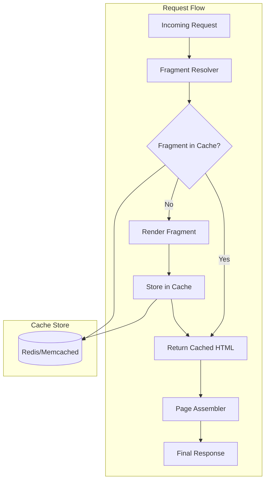
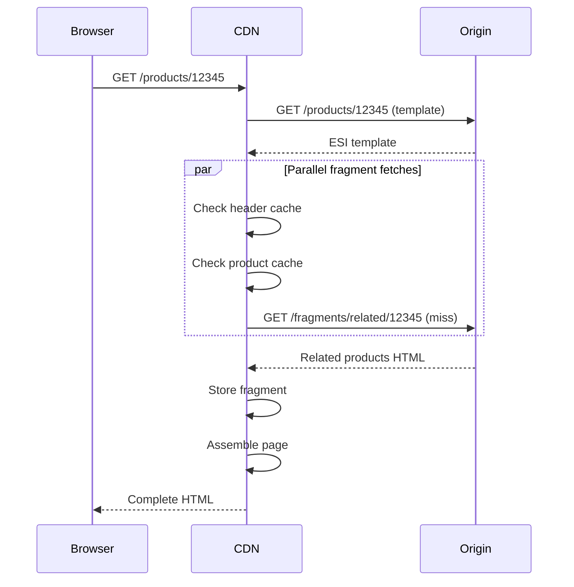

# How to Create Fragment Cache Design

Author: [nawazdhandala](https://github.com/nawazdhandala)

Tags: Caching, Fragment, HTML, Web Performance

Description: Learn to create fragment cache design for caching partial page content and components.

---

Full page caching works until your pages contain user-specific data. When a header shows "Welcome, Alice" while the rest of the page is identical for everyone, caching the entire response becomes impossible. Fragment caching solves this by storing individual pieces of a page separately, letting you cache what can be cached and regenerate what must stay dynamic.

## What is Fragment Caching?

Fragment caching stores discrete chunks of rendered HTML rather than entire pages. Each fragment has its own cache key, TTL, and invalidation rules. When a request arrives, your application assembles the page by fetching cached fragments and rendering only the uncached portions.

This approach sits between two extremes:

| Caching Strategy | Cache Granularity | Best For | Limitation |
| --- | --- | --- | --- |
| Full Page Cache | Entire response | Static pages, CDN edge | Breaks on any personalization |
| No Cache | Nothing cached | Highly dynamic apps | High server load, slow responses |
| Fragment Cache | Individual components | Mixed content pages | Requires assembly logic |

Fragment caching shines when pages share common elements (navigation, sidebars, product cards) across requests but also contain user-specific or time-sensitive sections.

## Architecture Overview

A typical fragment cache setup involves three layers: the application code that identifies cacheable fragments, a cache store for persistence, and an assembly layer that stitches everything together.



The fragment resolver checks each component against the cache. Cache hits return immediately. Cache misses trigger rendering, store the result, and then return. The page assembler collects all fragments and produces the final HTML.

## Defining Fragment Boundaries

Good fragment boundaries follow these principles:

1. **Self-contained rendering**: A fragment should not depend on sibling fragments to render correctly
2. **Independent invalidation**: Changes to one fragment should not require invalidating others
3. **Consistent cache keys**: The same input data should always produce the same cache key

Common fragment candidates include navigation menus, product listings, user dashboards (excluding personalized greetings), sidebar widgets, and footer content.

Here is a basic fragment definition in a Node.js application using Redis as the cache store.

```javascript
// fragment-cache.js
const Redis = require('ioredis');
const crypto = require('crypto');

class FragmentCache {
    constructor(redisUrl) {
        this.redis = new Redis(redisUrl);
        this.defaultTTL = 3600; // 1 hour in seconds
    }

    // Generate a deterministic cache key from fragment name and parameters
    generateKey(fragmentName, params = {}) {
        const sortedParams = JSON.stringify(params, Object.keys(params).sort());
        const hash = crypto.createHash('md5').update(sortedParams).digest('hex');
        return `fragment:${fragmentName}:${hash}`;
    }

    // Fetch fragment from cache or render it
    async getOrRender(fragmentName, params, renderFn, ttl = this.defaultTTL) {
        const key = this.generateKey(fragmentName, params);

        // Try cache first
        const cached = await this.redis.get(key);
        if (cached) {
            return { html: cached, fromCache: true };
        }

        // Cache miss: render the fragment
        const html = await renderFn(params);

        // Store with expiration
        await this.redis.setex(key, ttl, html);

        return { html, fromCache: false };
    }

    // Invalidate a specific fragment
    async invalidate(fragmentName, params = {}) {
        const key = this.generateKey(fragmentName, params);
        await this.redis.del(key);
    }

    // Invalidate all fragments matching a pattern
    async invalidatePattern(pattern) {
        const keys = await this.redis.keys(`fragment:${pattern}:*`);
        if (keys.length > 0) {
            await this.redis.del(...keys);
        }
    }
}

module.exports = FragmentCache;
```

## Cache Key Design

Cache keys determine whether two requests can share a cached fragment. A poorly designed key leads to either cache pollution (serving wrong content) or cache fragmentation (too many unique keys, low hit rate).

The cache key should include every variable that affects the rendered output.

| Variable Type | Include in Key | Example |
| --- | --- | --- |
| Content identifiers | Yes | `productId`, `categoryId` |
| Locale/language | Yes | `en-US`, `fr-FR` |
| User role (not user ID) | Sometimes | `admin`, `member`, `guest` |
| Feature flags | Yes | `newCheckoutEnabled` |
| Timestamps | Rarely | Only for time-bucketed content |

Avoid including user IDs in cache keys unless the fragment truly differs per user. A "Recently Viewed" widget needs the user ID; a product description does not.

```javascript
// Good: Key based on content, not user
const productFragment = await cache.getOrRender(
    'product-card',
    { productId: 12345, locale: 'en-US' },
    renderProductCard
);

// Bad: User ID in key kills cache hit rate
const productFragment = await cache.getOrRender(
    'product-card',
    { productId: 12345, userId: currentUser.id }, // Avoid this
    renderProductCard
);
```

## Fragment Assembly Patterns

Once you have cached fragments, you need to assemble them into complete pages. There are two primary patterns: server-side assembly and client-side assembly.

### Server-Side Assembly

The server fetches all fragments in parallel, combines them, and sends a complete HTML response. This approach works well for SEO and initial page load performance.

```javascript
// page-assembler.js
async function assemblePage(fragments, layout) {
    // Fetch all fragments in parallel
    const results = await Promise.all(
        fragments.map(f => cache.getOrRender(f.name, f.params, f.render, f.ttl))
    );

    // Build a map of fragment names to HTML
    const fragmentMap = {};
    fragments.forEach((f, i) => {
        fragmentMap[f.name] = results[i].html;
    });

    // Replace placeholders in layout with fragment HTML
    let html = layout;
    for (const [name, content] of Object.entries(fragmentMap)) {
        html = html.replace(`{{fragment:${name}}}`, content);
    }

    return html;
}

// Usage in an Express route
app.get('/products/:id', async (req, res) => {
    const productId = req.params.id;

    const page = await assemblePage([
        { name: 'header', params: {}, render: renderHeader, ttl: 3600 },
        { name: 'product-detail', params: { productId }, render: renderProduct, ttl: 300 },
        { name: 'related-products', params: { productId }, render: renderRelated, ttl: 600 },
        { name: 'footer', params: {}, render: renderFooter, ttl: 3600 }
    ], pageLayout);

    res.send(page);
});
```

### Client-Side Assembly with Edge-Side Includes (ESI)

For CDN-level caching, Edge-Side Includes let you define fragment boundaries in HTML. The CDN assembles fragments at the edge, reducing origin load.

```html
<!-- Product page template with ESI tags -->
<!DOCTYPE html>
<html>
<head>
    <title>Product Details</title>
</head>
<body>
    <esi:include src="/fragments/header" ttl="3600" />

    <main>
        <esi:include src="/fragments/product/12345" ttl="300" />
        <esi:include src="/fragments/related/12345" ttl="600" />
    </main>

    <esi:include src="/fragments/footer" ttl="3600" />
</body>
</html>
```

The flow with ESI looks like this:



## Invalidation Strategies

Cache invalidation is famously difficult. Fragment caching makes it more manageable by limiting the blast radius of each invalidation event.

### Time-Based Expiration

Set reasonable TTLs based on how frequently content changes. Static elements like footers can have long TTLs (hours). Product prices might need shorter TTLs (minutes).

### Event-Driven Invalidation

When content changes, publish an event that triggers targeted invalidation.

```javascript
// When a product is updated, invalidate related fragments
async function onProductUpdate(productId) {
    await Promise.all([
        cache.invalidate('product-detail', { productId }),
        cache.invalidate('product-card', { productId }),
        cache.invalidatePattern(`related-products:*`) // Invalidate all related sections
    ]);
}

// Subscribe to product update events
eventBus.on('product.updated', onProductUpdate);
```

### Version-Based Keys

Include a version number in cache keys. Incrementing the version effectively invalidates all old entries without explicit deletion.

```javascript
const CACHE_VERSION = 'v3';

generateKey(fragmentName, params) {
    const sortedParams = JSON.stringify(params, Object.keys(params).sort());
    const hash = crypto.createHash('md5').update(sortedParams).digest('hex');
    return `fragment:${CACHE_VERSION}:${fragmentName}:${hash}`;
}
```

## Monitoring Fragment Cache Performance

Track these metrics to understand whether your fragment cache is working.

| Metric | What It Tells You | Target |
| --- | --- | --- |
| Hit rate per fragment | Which fragments benefit from caching | Above 80% for stable content |
| Cache latency | Overhead of cache lookups | Under 5ms p99 |
| Fragment render time | Cost of cache misses | Varies by fragment complexity |
| Memory usage | Cache size growth | Stable, not unbounded |
| Invalidation rate | How often content changes | Low for cacheable fragments |

Integrate these metrics with your observability stack. Tools like OneUptime can alert you when hit rates drop or render times spike, indicating potential issues with cache key design or invalidation logic.

## Common Pitfalls

**Over-fragmentation**: Too many small fragments add assembly overhead. Group related elements that always appear together.

**Under-fragmentation**: Large fragments with any dynamic element become uncacheable. Split them into static and dynamic portions.

**Cache stampede**: When a popular fragment expires, hundreds of requests might try to regenerate it simultaneously. Implement locking or stale-while-revalidate patterns.

```javascript
// Simple stampede protection with locking
async getOrRenderWithLock(fragmentName, params, renderFn, ttl) {
    const key = this.generateKey(fragmentName, params);
    const lockKey = `lock:${key}`;

    const cached = await this.redis.get(key);
    if (cached) return { html: cached, fromCache: true };

    // Try to acquire lock
    const acquired = await this.redis.set(lockKey, '1', 'NX', 'EX', 5);

    if (!acquired) {
        // Another process is rendering, wait and retry
        await new Promise(r => setTimeout(r, 100));
        return this.getOrRenderWithLock(fragmentName, params, renderFn, ttl);
    }

    const html = await renderFn(params);
    await this.redis.setex(key, ttl, html);
    await this.redis.del(lockKey);

    return { html, fromCache: false };
}
```

## When to Use Fragment Caching

Fragment caching fits when your pages have a mix of stable and dynamic content, when full-page caching is impossible due to personalization, and when you can clearly define boundaries between independent components. Start with the slowest-rendering or most frequently requested fragments, measure the impact, and expand from there.

The goal is not to cache everything. The goal is to cache the right things with keys that maximize hit rates and invalidation rules that keep content fresh. Get those right, and your servers will thank you.
