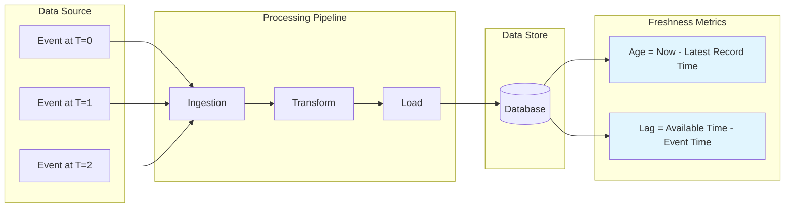
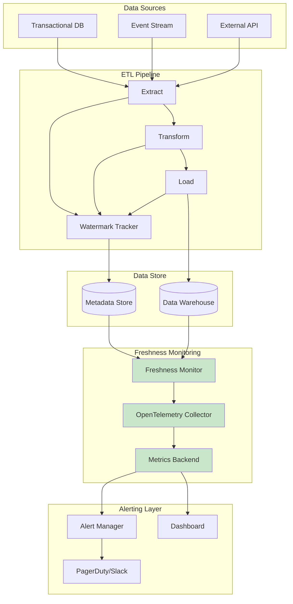

# How to Build Freshness SLOs

Author: [nawazdhandala](https://github.com/nawazdhandala)

Tags: SRE, SLO, Freshness, DataPipeline

Description: Learn how to define and implement freshness SLOs to ensure your data pipelines deliver timely, reliable data to downstream consumers.

---

## Why Freshness Matters

Availability and latency SLOs dominate most SRE conversations. But for data-driven systems, there is a third pillar that deserves equal attention: freshness. A dashboard showing yesterday's revenue is technically available, but if your finance team needs hourly updates, that data is stale and unreliable for decision-making.

Freshness SLOs help you answer a simple question: Is my data current enough for its intended use?

This post covers how to define freshness SLIs, choose between age-based and lag-based metrics, instrument your pipelines, and alert on stale data before it impacts your users.

---

## What is a Freshness SLI?

A Freshness Service Level Indicator (SLI) measures how current your data is relative to its source. Unlike availability (is it up?) or latency (is it fast?), freshness asks: is this data still useful?

The formal definition:

```
Freshness SLI = (Time periods where data age < threshold) / (Total time periods) * 100
```

For example, if your SLO states "data must be no older than 15 minutes, 99% of the time," your freshness SLI tracks how often you meet that 15-minute threshold.

---

## Age-Based vs Lag-Based Metrics

Two common approaches exist for measuring freshness. Each has distinct use cases.

### Age-Based Freshness

Age-based freshness measures the difference between now and the timestamp of the most recent record.

```python
# Age-based freshness calculation
# Measures how old the newest data point is

from datetime import datetime, timezone

def calculate_data_age(last_record_timestamp: datetime) -> float:
    """
    Calculate the age of data in seconds.

    Args:
        last_record_timestamp: Timestamp of the most recent record (UTC)

    Returns:
        Age in seconds
    """
    now = datetime.now(timezone.utc)
    age = (now - last_record_timestamp).total_seconds()
    return age

def is_data_fresh(last_record_timestamp: datetime, threshold_seconds: float) -> bool:
    """
    Check if data meets freshness threshold.

    Args:
        last_record_timestamp: Timestamp of the most recent record
        threshold_seconds: Maximum acceptable age in seconds

    Returns:
        True if data is fresh, False if stale
    """
    age = calculate_data_age(last_record_timestamp)
    return age <= threshold_seconds
```

**Best for:** Real-time dashboards, streaming data, user-facing features where absolute currency matters.

### Lag-Based Freshness

Lag-based freshness measures the delay between when an event occurred and when it becomes available downstream.

```python
# Lag-based freshness calculation
# Measures processing delay through a pipeline

from datetime import datetime, timezone
from typing import Optional

def calculate_processing_lag(
    event_timestamp: datetime,
    available_timestamp: datetime
) -> float:
    """
    Calculate the processing lag for a single event.

    Args:
        event_timestamp: When the event originally occurred
        available_timestamp: When the event became queryable downstream

    Returns:
        Lag in seconds
    """
    lag = (available_timestamp - event_timestamp).total_seconds()
    return lag

def calculate_pipeline_lag(
    source_watermark: datetime,
    sink_watermark: Optional[datetime]
) -> float:
    """
    Calculate lag using watermarks (common in streaming systems).

    Watermarks represent the latest event time processed at each stage.

    Args:
        source_watermark: Latest event time at the source
        sink_watermark: Latest event time at the destination

    Returns:
        Lag in seconds, or infinity if sink has no data
    """
    if sink_watermark is None:
        return float('inf')

    lag = (source_watermark - sink_watermark).total_seconds()
    return max(0, lag)  # Lag cannot be negative
```

**Best for:** ETL pipelines, batch processing, data warehouses where you care about end-to-end processing time.

---

## How Freshness Measurement Works

The following diagram shows how freshness is measured at different points in a typical data pipeline.



---

## Instrumenting Data Pipeline Freshness

Here is a complete example of instrumenting a data pipeline with freshness metrics using OpenTelemetry.

```python
# Freshness instrumentation for data pipelines
# Uses OpenTelemetry for metrics collection

from datetime import datetime, timezone
from opentelemetry import metrics
from opentelemetry.sdk.metrics import MeterProvider
from opentelemetry.sdk.metrics.export import PeriodicExportingMetricReader
from opentelemetry.exporter.otlp.proto.grpc.metric_exporter import OTLPMetricExporter

# Initialize OpenTelemetry metrics
exporter = OTLPMetricExporter(endpoint="http://localhost:4317")
reader = PeriodicExportingMetricReader(exporter, export_interval_millis=10000)
provider = MeterProvider(metric_readers=[reader])
metrics.set_meter_provider(provider)

# Create meter for freshness metrics
meter = metrics.get_meter("data.pipeline.freshness")

# Define freshness gauges
# Gauges are ideal for freshness because we want the current value, not a sum
data_age_gauge = meter.create_gauge(
    name="data.freshness.age_seconds",
    description="Age of the most recent record in seconds",
    unit="s"
)

processing_lag_gauge = meter.create_gauge(
    name="data.freshness.lag_seconds",
    description="Processing lag from source to destination in seconds",
    unit="s"
)

# Counter for freshness SLI tracking
freshness_checks = meter.create_counter(
    name="data.freshness.checks_total",
    description="Total number of freshness checks performed"
)

freshness_violations = meter.create_counter(
    name="data.freshness.violations_total",
    description="Number of freshness threshold violations"
)


class FreshnessMonitor:
    """
    Monitors and reports data freshness metrics.

    Tracks both age-based and lag-based freshness, emitting metrics
    that can be used to build SLO dashboards and alerts.
    """

    def __init__(self, pipeline_name: str, freshness_threshold_seconds: float):
        """
        Initialize the freshness monitor.

        Args:
            pipeline_name: Name of the pipeline for metric labels
            freshness_threshold_seconds: SLO threshold for freshness
        """
        self.pipeline_name = pipeline_name
        self.threshold = freshness_threshold_seconds
        self.labels = {"pipeline": pipeline_name}

    def record_freshness(
        self,
        last_record_time: datetime,
        last_event_time: datetime,
        available_time: datetime
    ) -> dict:
        """
        Record freshness metrics for the current state.

        Args:
            last_record_time: Timestamp of the most recent record
            last_event_time: Original event time of the most recent record
            available_time: When the record became available downstream

        Returns:
            Dictionary with freshness measurements and SLI status
        """
        now = datetime.now(timezone.utc)

        # Calculate age-based freshness
        age_seconds = (now - last_record_time).total_seconds()

        # Calculate lag-based freshness
        lag_seconds = (available_time - last_event_time).total_seconds()

        # Record metrics with pipeline label
        data_age_gauge.set(age_seconds, self.labels)
        processing_lag_gauge.set(lag_seconds, self.labels)

        # Track SLI
        freshness_checks.add(1, self.labels)

        is_fresh = age_seconds <= self.threshold
        if not is_fresh:
            freshness_violations.add(1, self.labels)

        return {
            "age_seconds": age_seconds,
            "lag_seconds": lag_seconds,
            "threshold_seconds": self.threshold,
            "is_fresh": is_fresh,
            "pipeline": self.pipeline_name
        }


# Example usage
if __name__ == "__main__":
    # Create monitor with 15-minute freshness threshold
    monitor = FreshnessMonitor(
        pipeline_name="orders_to_warehouse",
        freshness_threshold_seconds=900  # 15 minutes
    )

    # Simulate recording freshness for a pipeline
    result = monitor.record_freshness(
        last_record_time=datetime(2026, 1, 30, 10, 45, 0, tzinfo=timezone.utc),
        last_event_time=datetime(2026, 1, 30, 10, 40, 0, tzinfo=timezone.utc),
        available_time=datetime(2026, 1, 30, 10, 45, 0, tzinfo=timezone.utc)
    )

    print(f"Data age: {result['age_seconds']} seconds")
    print(f"Processing lag: {result['lag_seconds']} seconds")
    print(f"Is fresh: {result['is_fresh']}")
```

---

## Tracking Freshness Across Multiple Tables

Most data platforms have many tables with different freshness requirements. Here is how to track them systematically.

```python
# Multi-table freshness tracking
# Useful for data warehouses with many tables

from dataclasses import dataclass
from datetime import datetime, timezone
from typing import Dict, List, Optional
import json

@dataclass
class TableFreshnessConfig:
    """Configuration for a single table's freshness SLO."""
    table_name: str
    threshold_seconds: float
    owner_team: str
    criticality: str  # "critical", "high", "medium", "low"


@dataclass
class FreshnessResult:
    """Result of a freshness check for one table."""
    table_name: str
    last_updated: datetime
    age_seconds: float
    threshold_seconds: float
    is_fresh: bool
    owner_team: str


class DataWarehouseFreshnessTracker:
    """
    Tracks freshness across multiple tables in a data warehouse.

    Provides rollup metrics and identifies which tables are violating SLOs.
    """

    def __init__(self, configs: List[TableFreshnessConfig]):
        """
        Initialize tracker with table configurations.

        Args:
            configs: List of freshness configurations for each table
        """
        self.configs = {c.table_name: c for c in configs}

    def check_table_freshness(
        self,
        table_name: str,
        last_updated: datetime
    ) -> Optional[FreshnessResult]:
        """
        Check freshness for a single table.

        Args:
            table_name: Name of the table to check
            last_updated: Timestamp of the last update to the table

        Returns:
            FreshnessResult or None if table not configured
        """
        config = self.configs.get(table_name)
        if not config:
            return None

        now = datetime.now(timezone.utc)
        age_seconds = (now - last_updated).total_seconds()
        is_fresh = age_seconds <= config.threshold_seconds

        return FreshnessResult(
            table_name=table_name,
            last_updated=last_updated,
            age_seconds=age_seconds,
            threshold_seconds=config.threshold_seconds,
            is_fresh=is_fresh,
            owner_team=config.owner_team
        )

    def check_all_tables(
        self,
        table_timestamps: Dict[str, datetime]
    ) -> Dict[str, any]:
        """
        Check freshness for all configured tables.

        Args:
            table_timestamps: Dictionary mapping table names to last update times

        Returns:
            Summary with overall SLI and list of violations
        """
        results = []
        violations = []

        for table_name, last_updated in table_timestamps.items():
            result = self.check_table_freshness(table_name, last_updated)
            if result:
                results.append(result)
                if not result.is_fresh:
                    violations.append(result)

        # Calculate overall freshness SLI
        total = len(results)
        fresh_count = sum(1 for r in results if r.is_fresh)
        sli_percentage = (fresh_count / total * 100) if total > 0 else 100.0

        return {
            "total_tables": total,
            "fresh_tables": fresh_count,
            "stale_tables": len(violations),
            "freshness_sli_percentage": sli_percentage,
            "violations": [
                {
                    "table": v.table_name,
                    "age_seconds": v.age_seconds,
                    "threshold_seconds": v.threshold_seconds,
                    "owner_team": v.owner_team
                }
                for v in violations
            ]
        }


# Example configuration
configs = [
    TableFreshnessConfig("orders", threshold_seconds=300, owner_team="commerce", criticality="critical"),
    TableFreshnessConfig("inventory", threshold_seconds=600, owner_team="supply", criticality="high"),
    TableFreshnessConfig("page_views", threshold_seconds=900, owner_team="analytics", criticality="medium"),
    TableFreshnessConfig("user_profiles", threshold_seconds=3600, owner_team="identity", criticality="medium"),
]

tracker = DataWarehouseFreshnessTracker(configs)
```

---

## Alerting on Stale Data

Freshness alerts require different strategies than availability alerts. Here is a practical approach.

```yaml
# Prometheus alerting rules for freshness SLOs
# Place in your alerting rules configuration

groups:
  - name: freshness_slos
    interval: 1m
    rules:
      # Alert when data age exceeds threshold
      - alert: DataFreshnessViolation
        expr: |
          data_freshness_age_seconds > on(pipeline) group_left()
          data_freshness_threshold_seconds
        for: 5m
        labels:
          severity: warning
        annotations:
          summary: "Data freshness SLO violation for {{ $labels.pipeline }}"
          description: |
            Pipeline {{ $labels.pipeline }} has data that is
            {{ $value | humanizeDuration }} old, exceeding the threshold.

      # Alert on sustained freshness burn rate
      - alert: FreshnessBurnRateHigh
        expr: |
          (
            sum(rate(data_freshness_violations_total[1h])) by (pipeline)
            /
            sum(rate(data_freshness_checks_total[1h])) by (pipeline)
          ) > 0.10
        for: 15m
        labels:
          severity: critical
        annotations:
          summary: "High freshness violation rate for {{ $labels.pipeline }}"
          description: |
            Pipeline {{ $labels.pipeline }} is violating freshness SLO
            more than 10% of the time over the past hour.

      # Alert when no data has arrived (complete staleness)
      - alert: DataPipelineStalled
        expr: |
          time() - data_freshness_last_record_timestamp > 1800
        for: 5m
        labels:
          severity: critical
        annotations:
          summary: "No new data for {{ $labels.pipeline }} in 30 minutes"
          description: |
            Pipeline {{ $labels.pipeline }} appears stalled.
            Last record arrived at {{ $value | humanizeTimestamp }}.
```

---

## Freshness SLO Architecture

The following diagram shows a complete freshness monitoring architecture.



---

## Choosing Your Freshness Threshold

Freshness thresholds should be driven by business requirements, not technical convenience. Ask these questions:

1. **Who consumes this data?** A real-time fraud detection system needs sub-second freshness. A weekly business report can tolerate hours.

2. **What decisions depend on this data?** If stale data leads to incorrect automated actions, set aggressive thresholds.

3. **What is the source cadence?** If your source only updates hourly, a 5-minute freshness SLO is impossible.

4. **What is your pipeline capacity?** Set thresholds you can actually meet under normal load with margin for spikes.

| Use Case | Typical Threshold | Rationale |
|----------|------------------|-----------|
| Real-time dashboards | 1-5 minutes | Users expect current data |
| Operational reporting | 15-30 minutes | Balance currency with stability |
| Analytics warehouse | 1-4 hours | Batch processing constraints |
| Compliance reporting | 24 hours | Daily regulatory requirements |
| Historical archives | 7 days | Archival, not operational |

---

## Common Pitfalls

**Measuring at the wrong point.** Freshness measured at ingestion does not reflect what users see. Measure at the consumption layer.

**Ignoring partial staleness.** One fresh table and one stale table does not average to "somewhat fresh." Track per-table SLIs.

**Setting unrealistic thresholds.** A 1-minute SLO for a batch pipeline running every 30 minutes will always fail.

**Alerting on every violation.** Use burn rates and sustained violations to avoid alert fatigue.

**Forgetting timezone issues.** Always use UTC internally. Timezone confusion causes false freshness violations.

---

## Summary

Freshness SLOs fill a critical gap between availability and latency. They answer whether your data is current enough to be useful.

Key takeaways:

- **Define freshness SLIs** using age-based or lag-based metrics depending on your use case
- **Instrument at the consumption layer** where users actually access data
- **Track per-table or per-pipeline** to identify specific problem areas
- **Alert on burn rates** rather than individual violations to reduce noise
- **Set thresholds based on business needs**, not technical convenience

Freshness is often the forgotten SLO. But for data platforms, it is the difference between data that drives decisions and data that drives frustration.

---

**About OneUptime:** We help engineering teams build comprehensive SLO programs covering availability, latency, and freshness. Our platform connects telemetry from OpenTelemetry to actionable dashboards and alerts. Learn more at [OneUptime.com](https://oneuptime.com).

**Related Reading:**

- [18 SRE Metrics Worth Tracking (And Why)](https://oneuptime.com/blog/post/2025-11-28-sre-metrics-to-track/view)
- [The Five Stages of SRE Maturity](https://oneuptime.com/blog/post/2025-09-01-the-five-stages-of-sre-maturity/view)
- [What is SLA, SLI and SLO's?](https://oneuptime.com/blog/post/2023-06-12-sli-sla-slo/view)
