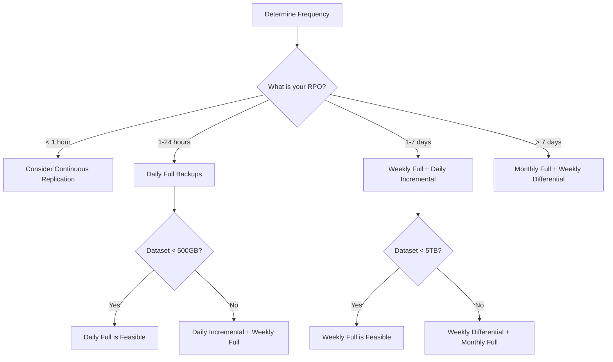
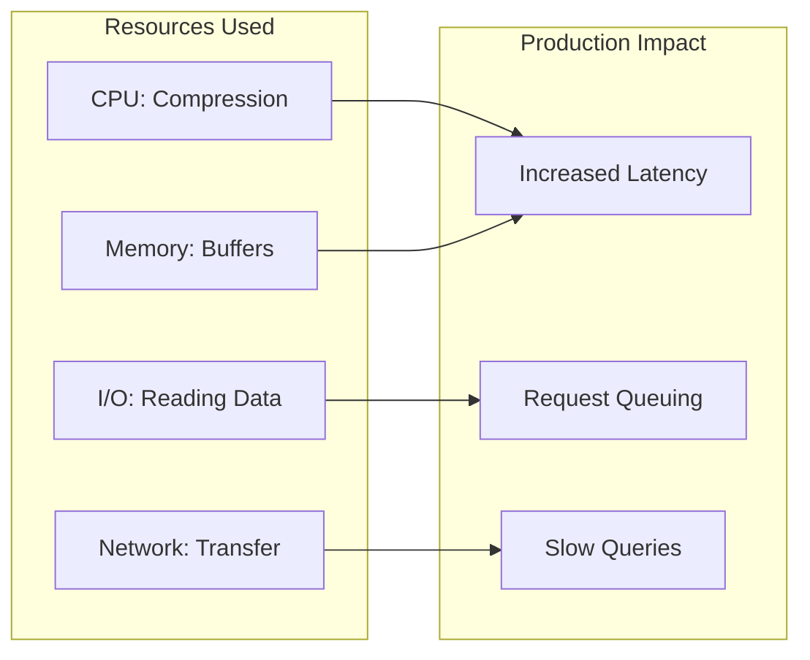
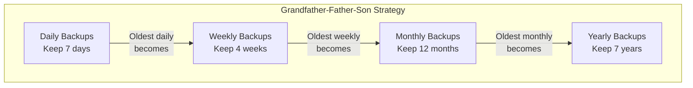
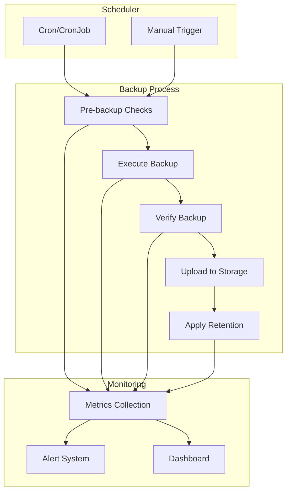
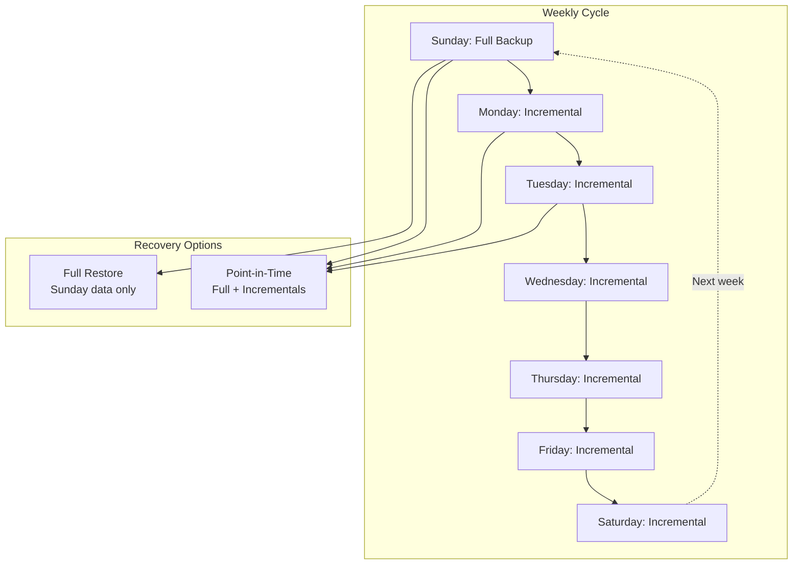

# How to Implement Full Backup Scheduling

Author: [nawazdhandala](https://github.com/nawazdhandala)

Tags: Backup, Disaster Recovery, SRE, Data Protection

Description: Learn how to schedule full backups effectively for comprehensive data protection.

---

Full backups are the foundation of any data protection strategy. Unlike incremental or differential backups, a full backup captures your entire dataset, providing a complete recovery point that stands on its own. This guide covers everything you need to know about implementing full backup scheduling - from choosing the right frequency to automating the entire process.

---

## TL;DR

- Full backups capture complete datasets and serve as recovery baselines
- Schedule full backups during low-activity windows to minimize performance impact
- Plan retention periods based on compliance requirements and storage capacity
- Automate verification to ensure backup integrity
- Combine full backups with incremental strategies for optimal protection

---

## What is a Full Backup?

A full backup is a complete copy of all selected data at a specific point in time. Unlike incremental backups (which only capture changes since the last backup) or differential backups (changes since the last full backup), a full backup contains everything needed for restoration.

```mermaid
flowchart TB
    subgraph Full Backup
        F1[Complete Dataset]
        F2[All Files & Data]
        F3[Single Recovery Point]
    end

    subgraph Incremental
        I1[Changes Only]
        I2[Since Last Backup]
        I3[Chain Required]
    end

    subgraph Differential
        D1[Changes Only]
        D2[Since Last Full]
        D3[Full + Diff Required]
    end

    Recovery[Recovery Scenario] --> Full Backup
    Recovery --> Incremental
    Recovery --> Differential

    Full Backup -->|Restore from| Single[Single Backup File]
    Incremental -->|Restore from| Chain[Full + All Incrementals]
    Differential -->|Restore from| Pair[Full + Latest Diff]
```

### Benefits of Full Backups

- **Simplest restoration**: No dependency on previous backups
- **Complete data capture**: Every file and database record included
- **Recovery baseline**: Foundation for incremental/differential strategies
- **Compliance friendly**: Easy to verify and audit

### Trade-offs

- **Longer backup time**: More data to copy
- **Higher storage consumption**: Each backup is a complete copy
- **Greater resource usage**: Network, CPU, and I/O intensive

---

## Full Backup Frequency

Choosing the right backup frequency depends on several factors: data change rate, recovery point objectives (RPO), storage capacity, and backup window availability.

### Common Full Backup Schedules

```
Daily Full Backups:
├── Best for: Small datasets, critical systems
├── Storage impact: High
├── Recovery point: Up to 24 hours data loss
└── Use case: Financial systems, healthcare records

Weekly Full Backups:
├── Best for: Medium datasets, typical enterprise
├── Storage impact: Moderate
├── Recovery point: Combined with daily incrementals
└── Use case: Most production databases, file servers

Monthly Full Backups:
├── Best for: Large datasets, archival systems
├── Storage impact: Lower
├── Recovery point: Combined with weekly differentials
└── Use case: Data warehouses, cold storage
```

### Determining Your Frequency

Consider these questions:

1. **What is your RPO?** How much data can you afford to lose?
2. **How large is your dataset?** Can you complete a full backup in your window?
3. **What is your storage budget?** How many full backups can you retain?
4. **What are your compliance requirements?** Do regulations mandate specific intervals?



---

## Backup Window Optimization

The backup window is the time available to complete backups without impacting production workloads. Optimizing this window is crucial for full backups.

### Identifying Your Backup Window

Most organizations schedule backups during periods of low activity:

```bash
# Analyze database activity patterns (PostgreSQL example)
# This query shows hourly transaction counts to identify low-activity periods

psql -c "
SELECT
    extract(hour from xact_start) as hour,
    count(*) as transaction_count
FROM pg_stat_activity
WHERE xact_start > now() - interval '7 days'
GROUP BY hour
ORDER BY transaction_count ASC
LIMIT 10;
"
```

### Typical Backup Windows

```
Business Applications:
├── Window: 11 PM - 6 AM local time (7 hours)
├── Peak avoidance: Business hours
└── Consideration: Batch jobs, reporting

24/7 Operations:
├── Window: Lowest traffic period (analyze logs)
├── Peak avoidance: Geographic peak times
└── Consideration: Use read replicas for backup

Global Systems:
├── Window: May not exist (always someone working)
├── Solution: Backup from secondary/replica
└── Consideration: Cross-region replication lag
```

### Backup Window Calculation

Calculate whether your full backup fits in the available window:

```python
def calculate_backup_window(data_size_gb, throughput_mbps, compression_ratio=2.0):
    """
    Calculate time required for a full backup.

    Args:
        data_size_gb: Total data size in gigabytes
        throughput_mbps: Expected backup throughput in MB/s
        compression_ratio: Expected compression ratio (default 2:1)

    Returns:
        Dictionary with backup time estimates
    """
    # Effective data size after compression
    compressed_size_gb = data_size_gb / compression_ratio

    # Convert to MB for calculation
    compressed_size_mb = compressed_size_gb * 1024

    # Calculate time in seconds
    backup_time_seconds = compressed_size_mb / throughput_mbps

    # Convert to hours
    backup_time_hours = backup_time_seconds / 3600

    return {
        "original_size_gb": data_size_gb,
        "compressed_size_gb": round(compressed_size_gb, 2),
        "throughput_mbps": throughput_mbps,
        "estimated_hours": round(backup_time_hours, 2),
        "fits_8_hour_window": backup_time_hours <= 8,
        "fits_4_hour_window": backup_time_hours <= 4
    }

# Example: 2TB database with 100 MB/s throughput
result = calculate_backup_window(2000, 100, compression_ratio=2.5)
print(f"Backup will take approximately {result['estimated_hours']} hours")
print(f"Fits in 8-hour window: {result['fits_8_hour_window']}")
```

### Strategies When Backups Exceed the Window

If your full backup exceeds the available window:

1. **Increase throughput**: Faster storage, better network, parallel streams
2. **Improve compression**: More aggressive compression settings
3. **Use snapshots**: Storage-level snapshots for instant point-in-time copies
4. **Backup from replicas**: Offload backup work to secondary systems
5. **Split backups**: Backup different datasets on different days

---

## Resource Impact Management

Full backups consume significant resources. Managing this impact ensures production systems remain responsive.

### Understanding Backup Resource Usage



### Resource Throttling

Limit backup resource consumption to protect production workloads:

**PostgreSQL pg_dump with throttling:**

```bash
#!/bin/bash
# full-backup-throttled.sh
# Performs a full PostgreSQL backup with resource throttling

# Configuration
DATABASE="production_db"
BACKUP_DIR="/backups/postgres"
DATE=$(date +%Y%m%d_%H%M%S)
BACKUP_FILE="${BACKUP_DIR}/full_backup_${DATE}.dump"

# Resource limits
NICE_LEVEL=19           # Lowest CPU priority
IONICE_CLASS=3          # Idle I/O priority
BANDWIDTH_LIMIT="50m"   # 50 MB/s max throughput

# Create backup with resource constraints
# nice: Lower CPU scheduling priority
# ionice: Set I/O scheduling to idle class
# pv: Pipe viewer with rate limiting for bandwidth control

nice -n ${NICE_LEVEL} ionice -c ${IONICE_CLASS} \
    pg_dump -Fc ${DATABASE} | \
    pv -L ${BANDWIDTH_LIMIT} > ${BACKUP_FILE}

# Verify backup integrity
pg_restore --list ${BACKUP_FILE} > /dev/null 2>&1
if [ $? -eq 0 ]; then
    echo "Backup completed and verified: ${BACKUP_FILE}"
    echo "Size: $(du -h ${BACKUP_FILE} | cut -f1)"
else
    echo "ERROR: Backup verification failed"
    exit 1
fi
```

**MySQL with resource limits:**

```bash
#!/bin/bash
# mysql-backup-throttled.sh
# Full MySQL backup with resource management

DATABASE="production"
BACKUP_DIR="/backups/mysql"
DATE=$(date +%Y%m%d_%H%M%S)

# Use single-transaction for InnoDB consistency without locking
# --quick: Don't buffer entire tables in memory
# Throttle with pv

nice -n 19 ionice -c 3 \
    mysqldump --single-transaction --quick \
    --routines --triggers --events \
    ${DATABASE} | \
    pv -L 30m | \
    gzip -6 > "${BACKUP_DIR}/${DATABASE}_full_${DATE}.sql.gz"
```

### Monitoring Backup Impact

Track system performance during backups:

```yaml
# Prometheus alerts for backup impact monitoring
apiVersion: monitoring.coreos.com/v1
kind: PrometheusRule
metadata:
  name: backup-impact-alerts
spec:
  groups:
    - name: backup-impact
      rules:
        - alert: HighCPUDuringBackup
          expr: |
            (node_cpu_seconds_total{mode="idle"} < 0.2)
            and on(instance) (backup_job_running == 1)
          for: 15m
          labels:
            severity: warning
          annotations:
            summary: "High CPU usage during backup window"

        - alert: HighIOWaitDuringBackup
          expr: |
            (node_cpu_seconds_total{mode="iowait"} > 0.3)
            and on(instance) (backup_job_running == 1)
          for: 10m
          labels:
            severity: warning
          annotations:
            summary: "High I/O wait during backup - may impact production"
```

---

## Retention Period Planning

Retention periods determine how long you keep full backups. This decision balances recovery needs, compliance requirements, and storage costs.

### Retention Strategies



### Implementing GFS Retention

```python
#!/usr/bin/env python3
"""
backup_retention.py
Implements Grandfather-Father-Son backup retention policy.
"""

import os
from datetime import datetime, timedelta
from pathlib import Path

class BackupRetention:
    def __init__(self, backup_dir,
                 daily_keep=7,
                 weekly_keep=4,
                 monthly_keep=12,
                 yearly_keep=7):
        """
        Initialize retention policy.

        Args:
            backup_dir: Directory containing backup files
            daily_keep: Number of daily backups to retain
            weekly_keep: Number of weekly backups to retain
            monthly_keep: Number of monthly backups to retain
            yearly_keep: Number of yearly backups to retain
        """
        self.backup_dir = Path(backup_dir)
        self.daily_keep = daily_keep
        self.weekly_keep = weekly_keep
        self.monthly_keep = monthly_keep
        self.yearly_keep = yearly_keep

    def get_backup_date(self, filename):
        """Extract date from backup filename (format: backup_YYYYMMDD_HHMMSS.*)"""
        try:
            date_part = filename.split('_')[1]
            return datetime.strptime(date_part, '%Y%m%d')
        except (IndexError, ValueError):
            return None

    def categorize_backups(self, backups):
        """
        Categorize backups into daily, weekly, monthly, yearly buckets.

        Returns dict with backups to keep and delete.
        """
        now = datetime.now()

        # Sort backups by date (newest first)
        dated_backups = []
        for backup in backups:
            date = self.get_backup_date(backup.name)
            if date:
                dated_backups.append((date, backup))

        dated_backups.sort(key=lambda x: x[0], reverse=True)

        keep = set()

        # Keep last N daily backups
        daily_cutoff = now - timedelta(days=self.daily_keep)
        daily_count = 0
        for date, backup in dated_backups:
            if date >= daily_cutoff and daily_count < self.daily_keep:
                keep.add(backup)
                daily_count += 1

        # Keep one backup per week for last N weeks (Sunday backups)
        weekly_count = 0
        seen_weeks = set()
        for date, backup in dated_backups:
            week_key = date.isocalendar()[:2]  # (year, week)
            if week_key not in seen_weeks and weekly_count < self.weekly_keep:
                keep.add(backup)
                seen_weeks.add(week_key)
                weekly_count += 1

        # Keep one backup per month for last N months (1st of month backup)
        monthly_count = 0
        seen_months = set()
        for date, backup in dated_backups:
            month_key = (date.year, date.month)
            if month_key not in seen_months and monthly_count < self.monthly_keep:
                keep.add(backup)
                seen_months.add(month_key)
                monthly_count += 1

        # Keep one backup per year for last N years (Jan 1st backup)
        yearly_count = 0
        seen_years = set()
        for date, backup in dated_backups:
            if date.year not in seen_years and yearly_count < self.yearly_keep:
                keep.add(backup)
                seen_years.add(date.year)
                yearly_count += 1

        delete = set(b for _, b in dated_backups) - keep

        return {
            'keep': list(keep),
            'delete': list(delete),
            'stats': {
                'total': len(dated_backups),
                'keeping': len(keep),
                'deleting': len(delete)
            }
        }

    def apply_retention(self, dry_run=True):
        """Apply retention policy to backup directory."""
        backups = list(self.backup_dir.glob('backup_*.dump')) + \
                  list(self.backup_dir.glob('backup_*.sql.gz'))

        result = self.categorize_backups(backups)

        print(f"Retention Policy Results:")
        print(f"  Total backups: {result['stats']['total']}")
        print(f"  Keeping: {result['stats']['keeping']}")
        print(f"  Deleting: {result['stats']['deleting']}")

        if not dry_run:
            for backup in result['delete']:
                print(f"  Removing: {backup.name}")
                backup.unlink()
        else:
            print("\n  (Dry run - no files deleted)")
            for backup in result['delete']:
                print(f"  Would delete: {backup.name}")

        return result

# Usage
if __name__ == "__main__":
    retention = BackupRetention(
        backup_dir="/backups/postgres",
        daily_keep=7,
        weekly_keep=4,
        monthly_keep=12,
        yearly_keep=7
    )

    # Preview what would be deleted
    retention.apply_retention(dry_run=True)

    # Actually apply retention (uncomment to run)
    # retention.apply_retention(dry_run=False)
```

### Storage Calculation

Estimate storage requirements for your retention policy:

```python
def calculate_storage_requirements(
    full_backup_size_gb,
    compression_ratio=2.0,
    daily_backups=7,
    weekly_backups=4,
    monthly_backups=12,
    yearly_backups=7,
    growth_rate_percent=10
):
    """
    Calculate total storage needed for backup retention.

    Returns storage requirements including growth projection.
    """
    compressed_size = full_backup_size_gb / compression_ratio

    # Total backups (some overlap between categories, estimate ~80% unique)
    total_backups = (daily_backups + weekly_backups +
                     monthly_backups + yearly_backups) * 0.8

    # Current storage need
    current_storage_gb = compressed_size * total_backups

    # Project 1 year growth
    future_size = full_backup_size_gb * (1 + growth_rate_percent/100)
    future_storage_gb = (future_size / compression_ratio) * total_backups

    return {
        "current_backup_size_gb": round(compressed_size, 2),
        "total_backups_estimated": int(total_backups),
        "current_storage_needed_gb": round(current_storage_gb, 2),
        "projected_storage_1yr_gb": round(future_storage_gb, 2),
        "recommended_capacity_gb": round(future_storage_gb * 1.25, 2)  # 25% buffer
    }

# Example: 500GB database
result = calculate_storage_requirements(
    full_backup_size_gb=500,
    compression_ratio=2.5,
    daily_backups=7,
    weekly_backups=4,
    monthly_backups=12,
    yearly_backups=7
)

print(f"Storage Requirements:")
print(f"  Per backup: {result['current_backup_size_gb']} GB")
print(f"  Current total: {result['current_storage_needed_gb']} GB")
print(f"  Projected (1 year): {result['projected_storage_1yr_gb']} GB")
print(f"  Recommended capacity: {result['recommended_capacity_gb']} GB")
```

---

## Verification Scheduling

Backups are worthless if they cannot be restored. Regular verification ensures backup integrity and restoration capability.

### Verification Levels

```
Level 1 - File Integrity (Every Backup):
├── Checksum validation
├── File size verification
└── Format validation

Level 2 - Restore Test (Weekly):
├── Extract to temporary location
├── Verify data structures
└── Query sample data

Level 3 - Full Recovery Drill (Monthly):
├── Complete restoration to test environment
├── Application connectivity test
└── Data integrity validation
└── Performance benchmarking
```

### Automated Verification Script

```bash
#!/bin/bash
# verify-backup.sh
# Automated backup verification with multiple levels

set -e

BACKUP_FILE=$1
VERIFICATION_LEVEL=${2:-1}
TEMP_DIR="/tmp/backup_verify_$$"
REPORT_FILE="/var/log/backup-verification.log"

log() {
    echo "$(date '+%Y-%m-%d %H:%M:%S') - $1" | tee -a ${REPORT_FILE}
}

cleanup() {
    rm -rf ${TEMP_DIR}
}
trap cleanup EXIT

mkdir -p ${TEMP_DIR}

log "Starting verification of ${BACKUP_FILE} at level ${VERIFICATION_LEVEL}"

# Level 1: File Integrity
level_1_verify() {
    log "Level 1: Checking file integrity..."

    # Check file exists and has content
    if [ ! -s "${BACKUP_FILE}" ]; then
        log "ERROR: Backup file is empty or missing"
        return 1
    fi

    # Verify checksum if available
    if [ -f "${BACKUP_FILE}.sha256" ]; then
        sha256sum -c "${BACKUP_FILE}.sha256" || {
            log "ERROR: Checksum verification failed"
            return 1
        }
        log "Checksum verified successfully"
    fi

    # Check file format based on extension
    case "${BACKUP_FILE}" in
        *.dump)
            pg_restore --list "${BACKUP_FILE}" > /dev/null 2>&1 || {
                log "ERROR: PostgreSQL dump format validation failed"
                return 1
            }
            log "PostgreSQL dump format validated"
            ;;
        *.sql.gz)
            gunzip -t "${BACKUP_FILE}" || {
                log "ERROR: Gzip integrity check failed"
                return 1
            }
            log "Gzip file integrity validated"
            ;;
    esac

    log "Level 1 verification PASSED"
    return 0
}

# Level 2: Restore Test
level_2_verify() {
    log "Level 2: Performing restore test..."

    level_1_verify || return 1

    case "${BACKUP_FILE}" in
        *.dump)
            # Create temporary database for restore test
            TEST_DB="verify_test_$$"
            createdb ${TEST_DB}

            # Restore to test database
            pg_restore -d ${TEST_DB} "${BACKUP_FILE}" > /dev/null 2>&1 || {
                dropdb ${TEST_DB}
                log "ERROR: Restore to test database failed"
                return 1
            }

            # Run basic queries to verify data
            TABLES=$(psql -t -c "SELECT count(*) FROM information_schema.tables WHERE table_schema='public'" ${TEST_DB})
            log "Restored ${TABLES} tables successfully"

            # Cleanup
            dropdb ${TEST_DB}
            ;;
        *.sql.gz)
            # Extract and validate SQL syntax
            gunzip -c "${BACKUP_FILE}" | head -1000 > ${TEMP_DIR}/sample.sql
            if grep -q "CREATE TABLE\|INSERT INTO" ${TEMP_DIR}/sample.sql; then
                log "SQL structure validated"
            else
                log "WARNING: Could not find expected SQL statements"
            fi
            ;;
    esac

    log "Level 2 verification PASSED"
    return 0
}

# Level 3: Full Recovery Drill
level_3_verify() {
    log "Level 3: Full recovery drill..."

    level_2_verify || return 1

    # This would typically involve:
    # 1. Spinning up a test environment
    # 2. Restoring the full backup
    # 3. Running application tests
    # 4. Measuring recovery time

    RECOVERY_START=$(date +%s)

    # Simulate full restore (actual implementation depends on environment)
    case "${BACKUP_FILE}" in
        *.dump)
            TEST_DB="recovery_drill_$$"
            createdb ${TEST_DB}
            pg_restore -d ${TEST_DB} "${BACKUP_FILE}"

            # Record row counts for validation
            psql -t -c "
                SELECT schemaname, tablename, n_live_tup
                FROM pg_stat_user_tables
                ORDER BY n_live_tup DESC
                LIMIT 10
            " ${TEST_DB} > ${TEMP_DIR}/row_counts.txt

            log "Top tables by row count:"
            cat ${TEMP_DIR}/row_counts.txt | while read line; do
                log "  ${line}"
            done

            dropdb ${TEST_DB}
            ;;
    esac

    RECOVERY_END=$(date +%s)
    RECOVERY_TIME=$((RECOVERY_END - RECOVERY_START))

    log "Recovery completed in ${RECOVERY_TIME} seconds"
    log "Level 3 verification PASSED"

    return 0
}

# Run verification at specified level
case ${VERIFICATION_LEVEL} in
    1) level_1_verify ;;
    2) level_2_verify ;;
    3) level_3_verify ;;
    *)
        log "Invalid verification level: ${VERIFICATION_LEVEL}"
        exit 1
        ;;
esac

exit $?
```

### Verification Schedule

```yaml
# Kubernetes CronJob for backup verification
apiVersion: batch/v1
kind: CronJob
metadata:
  name: backup-verify-daily
  namespace: backup-system
spec:
  schedule: "0 8 * * *"  # Daily at 8 AM (after overnight backups)
  jobTemplate:
    spec:
      template:
        spec:
          containers:
            - name: verify
              image: postgres:15
              command:
                - /bin/bash
                - -c
                - |
                  # Find latest backup
                  LATEST=$(ls -t /backups/*.dump | head -1)

                  # Level 1 verification for all daily backups
                  /scripts/verify-backup.sh "$LATEST" 1

                  # Level 2 verification on Sundays
                  if [ $(date +%u) -eq 7 ]; then
                    /scripts/verify-backup.sh "$LATEST" 2
                  fi
              volumeMounts:
                - name: backups
                  mountPath: /backups
                - name: scripts
                  mountPath: /scripts
          volumes:
            - name: backups
              persistentVolumeClaim:
                claimName: backup-pvc
            - name: scripts
              configMap:
                name: backup-scripts
                defaultMode: 0755
          restartPolicy: OnFailure
```

---

## Automation Setup

Automating full backup scheduling ensures consistency and reduces human error.

### Complete Backup Automation System



### Production-Ready Backup Script

```bash
#!/bin/bash
# automated-full-backup.sh
# Complete automated full backup solution

set -euo pipefail

# Configuration
BACKUP_NAME="${BACKUP_NAME:-database}"
BACKUP_DIR="${BACKUP_DIR:-/backups}"
DATABASE_URL="${DATABASE_URL:-}"
S3_BUCKET="${S3_BUCKET:-}"
RETENTION_DAYS="${RETENTION_DAYS:-30}"
HEARTBEAT_URL="${HEARTBEAT_URL:-}"  # OneUptime monitoring endpoint
SLACK_WEBHOOK="${SLACK_WEBHOOK:-}"

# Derived variables
DATE=$(date +%Y%m%d_%H%M%S)
BACKUP_FILE="${BACKUP_DIR}/${BACKUP_NAME}_full_${DATE}.dump"
LOG_FILE="${BACKUP_DIR}/logs/${BACKUP_NAME}_${DATE}.log"
LOCK_FILE="/tmp/${BACKUP_NAME}_backup.lock"

# Logging function
log() {
    local level=$1
    shift
    echo "$(date '+%Y-%m-%d %H:%M:%S') [${level}] $*" | tee -a "${LOG_FILE}"
}

# Send notification
notify() {
    local status=$1
    local message=$2

    # Send to OneUptime if configured
    if [ -n "${HEARTBEAT_URL}" ]; then
        curl -s -X POST "${HEARTBEAT_URL}" \
            -H "Content-Type: application/json" \
            -d "{\"status\":\"${status}\",\"message\":\"${message}\",\"backup\":\"${BACKUP_NAME}\",\"timestamp\":\"$(date -Iseconds)\"}" || true
    fi

    # Send to Slack if configured
    if [ -n "${SLACK_WEBHOOK}" ]; then
        local color="good"
        [ "${status}" = "failed" ] && color="danger"

        curl -s -X POST "${SLACK_WEBHOOK}" \
            -H "Content-Type: application/json" \
            -d "{\"attachments\":[{\"color\":\"${color}\",\"title\":\"Backup ${status}: ${BACKUP_NAME}\",\"text\":\"${message}\"}]}" || true
    fi
}

# Cleanup on exit
cleanup() {
    rm -f "${LOCK_FILE}"
    log "INFO" "Cleanup completed"
}
trap cleanup EXIT

# Check for existing backup process
check_lock() {
    if [ -f "${LOCK_FILE}" ]; then
        local pid=$(cat "${LOCK_FILE}")
        if kill -0 "${pid}" 2>/dev/null; then
            log "ERROR" "Backup already running (PID: ${pid})"
            exit 1
        fi
    fi
    echo $$ > "${LOCK_FILE}"
}

# Pre-backup checks
pre_backup_checks() {
    log "INFO" "Running pre-backup checks..."

    # Check disk space (require 20% free)
    local free_percent=$(df "${BACKUP_DIR}" | tail -1 | awk '{print 100-$5}' | tr -d '%')
    if [ "${free_percent}" -lt 20 ]; then
        log "ERROR" "Insufficient disk space: ${free_percent}% free"
        notify "failed" "Insufficient disk space for backup"
        exit 1
    fi

    # Check database connectivity
    if [ -n "${DATABASE_URL}" ]; then
        pg_isready -d "${DATABASE_URL}" > /dev/null 2>&1 || {
            log "ERROR" "Database is not accessible"
            notify "failed" "Database connectivity check failed"
            exit 1
        }
    fi

    log "INFO" "Pre-backup checks passed"
}

# Execute backup
execute_backup() {
    log "INFO" "Starting full backup..."
    notify "started" "Full backup started"

    local start_time=$(date +%s)

    # Create backup directory
    mkdir -p "${BACKUP_DIR}" "${BACKUP_DIR}/logs"

    # Execute backup with resource throttling
    nice -n 19 ionice -c 3 \
        pg_dump -Fc -v "${DATABASE_URL}" 2>> "${LOG_FILE}" > "${BACKUP_FILE}"

    local end_time=$(date +%s)
    local duration=$((end_time - start_time))
    local size=$(du -h "${BACKUP_FILE}" | cut -f1)

    log "INFO" "Backup completed in ${duration} seconds, size: ${size}"

    # Create checksum
    sha256sum "${BACKUP_FILE}" > "${BACKUP_FILE}.sha256"

    echo "${duration}" > "${BACKUP_DIR}/.last_backup_duration"
    echo "${size}" > "${BACKUP_DIR}/.last_backup_size"
}

# Verify backup
verify_backup() {
    log "INFO" "Verifying backup..."

    # Check file integrity
    sha256sum -c "${BACKUP_FILE}.sha256" || {
        log "ERROR" "Backup checksum verification failed"
        notify "failed" "Backup verification failed - checksum mismatch"
        exit 1
    }

    # Verify dump format
    pg_restore --list "${BACKUP_FILE}" > /dev/null 2>&1 || {
        log "ERROR" "Backup format verification failed"
        notify "failed" "Backup verification failed - invalid format"
        exit 1
    }

    log "INFO" "Backup verification passed"
}

# Upload to remote storage
upload_backup() {
    if [ -z "${S3_BUCKET}" ]; then
        log "INFO" "No remote storage configured, skipping upload"
        return
    fi

    log "INFO" "Uploading to ${S3_BUCKET}..."

    aws s3 cp "${BACKUP_FILE}" "s3://${S3_BUCKET}/${BACKUP_NAME}/" \
        --storage-class STANDARD_IA
    aws s3 cp "${BACKUP_FILE}.sha256" "s3://${S3_BUCKET}/${BACKUP_NAME}/"

    log "INFO" "Upload completed"
}

# Apply retention policy
apply_retention() {
    log "INFO" "Applying retention policy (${RETENTION_DAYS} days)..."

    # Local cleanup
    find "${BACKUP_DIR}" -name "${BACKUP_NAME}_full_*.dump" -mtime +${RETENTION_DAYS} -delete
    find "${BACKUP_DIR}" -name "${BACKUP_NAME}_full_*.sha256" -mtime +${RETENTION_DAYS} -delete

    # Remote cleanup
    if [ -n "${S3_BUCKET}" ]; then
        local cutoff_date=$(date -d "${RETENTION_DAYS} days ago" +%Y-%m-%d)
        aws s3 ls "s3://${S3_BUCKET}/${BACKUP_NAME}/" | while read -r line; do
            local file_date=$(echo "$line" | awk '{print $1}')
            local file_name=$(echo "$line" | awk '{print $4}')
            if [[ "${file_date}" < "${cutoff_date}" ]]; then
                aws s3 rm "s3://${S3_BUCKET}/${BACKUP_NAME}/${file_name}"
                log "INFO" "Deleted old backup: ${file_name}"
            fi
        done
    fi

    log "INFO" "Retention policy applied"
}

# Main execution
main() {
    mkdir -p "${BACKUP_DIR}/logs"

    log "INFO" "============================================"
    log "INFO" "Full Backup Started: ${BACKUP_NAME}"
    log "INFO" "============================================"

    check_lock
    pre_backup_checks
    execute_backup
    verify_backup
    upload_backup
    apply_retention

    local duration=$(cat "${BACKUP_DIR}/.last_backup_duration")
    local size=$(cat "${BACKUP_DIR}/.last_backup_size")

    notify "completed" "Full backup completed in ${duration}s, size: ${size}"

    log "INFO" "============================================"
    log "INFO" "Full Backup Completed Successfully"
    log "INFO" "============================================"
}

main "$@"
```

### Kubernetes Deployment

```yaml
# full-backup-cronjob.yaml
apiVersion: v1
kind: ConfigMap
metadata:
  name: backup-config
  namespace: backup-system
data:
  BACKUP_NAME: "production-db"
  RETENTION_DAYS: "30"
  DATABASE_URL: "postgresql://backup_user@db-host:5432/production"
---
apiVersion: v1
kind: Secret
metadata:
  name: backup-secrets
  namespace: backup-system
type: Opaque
stringData:
  AWS_ACCESS_KEY_ID: "your-access-key"
  AWS_SECRET_ACCESS_KEY: "your-secret-key"
  HEARTBEAT_URL: "https://oneuptime.com/heartbeat/your-monitor-id"
  SLACK_WEBHOOK: "https://hooks.slack.com/services/..."
---
apiVersion: batch/v1
kind: CronJob
metadata:
  name: full-backup-daily
  namespace: backup-system
spec:
  schedule: "0 2 * * *"  # Daily at 2 AM
  concurrencyPolicy: Forbid
  successfulJobsHistoryLimit: 7
  failedJobsHistoryLimit: 3
  jobTemplate:
    spec:
      backoffLimit: 2
      template:
        spec:
          containers:
            - name: backup
              image: postgres:15
              command: ["/scripts/automated-full-backup.sh"]
              envFrom:
                - configMapRef:
                    name: backup-config
                - secretRef:
                    name: backup-secrets
              env:
                - name: S3_BUCKET
                  value: "my-backup-bucket"
                - name: BACKUP_DIR
                  value: "/backups"
              volumeMounts:
                - name: backup-storage
                  mountPath: /backups
                - name: scripts
                  mountPath: /scripts
              resources:
                requests:
                  memory: "512Mi"
                  cpu: "500m"
                limits:
                  memory: "2Gi"
                  cpu: "2000m"
          volumes:
            - name: backup-storage
              persistentVolumeClaim:
                claimName: backup-pvc
            - name: scripts
              configMap:
                name: backup-scripts
                defaultMode: 0755
          restartPolicy: OnFailure
```

---

## Backup Strategy Integration

Full backups work best as part of a comprehensive backup strategy combining multiple backup types.



### Combined Backup Schedule

```bash
#!/bin/bash
# backup-scheduler.sh
# Intelligent backup scheduling based on day of week

DAY_OF_WEEK=$(date +%u)  # 1=Monday, 7=Sunday
DAY_OF_MONTH=$(date +%d)

case ${DAY_OF_WEEK} in
    7)  # Sunday - Full backup
        /scripts/automated-full-backup.sh
        ;;
    *)  # Other days - Incremental backup
        /scripts/incremental-backup.sh
        ;;
esac

# Monthly archive on 1st of month
if [ "${DAY_OF_MONTH}" = "01" ]; then
    /scripts/archive-monthly-backup.sh
fi
```

---

## Best Practices Summary

### Full Backup Scheduling Checklist

1. **Frequency Planning**
   - Match backup frequency to RPO requirements
   - Account for data growth in window calculations
   - Plan for seasonal or periodic data spikes

2. **Window Optimization**
   - Identify lowest-activity periods through monitoring
   - Use read replicas to avoid production impact
   - Implement parallel backup streams for large datasets

3. **Resource Management**
   - Apply CPU and I/O throttling during backups
   - Monitor system performance during backup windows
   - Set up alerts for backup-induced performance issues

4. **Retention Planning**
   - Implement GFS or similar retention strategy
   - Calculate storage requirements including growth
   - Automate retention policy enforcement

5. **Verification**
   - Verify every backup at minimum level
   - Schedule weekly restore tests
   - Conduct monthly full recovery drills

6. **Automation**
   - Use robust scripts with error handling
   - Implement monitoring and alerting
   - Document recovery procedures

---

## Conclusion

Implementing effective full backup scheduling requires balancing multiple factors: recovery requirements, available resources, storage capacity, and operational constraints. The key principles are:

- **Schedule strategically**: Choose backup windows that minimize production impact
- **Plan for growth**: Account for data growth in storage and window calculations
- **Verify consistently**: Regular verification ensures backups are actually recoverable
- **Automate everything**: Remove human error through comprehensive automation
- **Monitor continuously**: Track backup health and performance metrics

A well-implemented full backup strategy provides the foundation for data protection and disaster recovery. Combined with incremental backups and proper retention policies, full backups ensure you can recover from any data loss scenario with confidence.

Start with your most critical systems, establish reliable backup patterns, and expand coverage as your processes mature. Your future self will thank you when disaster recovery becomes a routine operation rather than a crisis.

---

*For more information on backup monitoring, see our guide on [Monitoring Backup Jobs with OneUptime](/blog/post/2025-09-25-monitoring-backup-jobs-with-oneuptime/view).*
