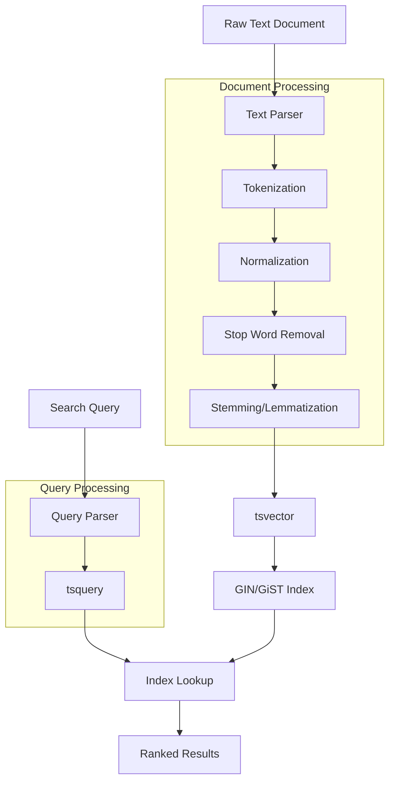
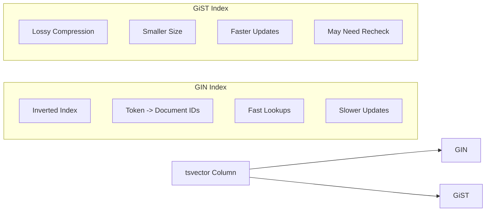

# How to Implement Full-Text Index Design

Author: [nawazdhandala](https://github.com/nawazdhandala)

Tags: Database, Full-Text Search, Indexing, PostgreSQL

Description: Learn to implement full-text index design for efficient text search capabilities in databases.

---

Full-text search is a fundamental feature in modern applications. Whether you are building a product catalog, a documentation site, or a log search system, users expect fast and relevant search results. Traditional SQL LIKE queries fall short when searching large text datasets. This is where full-text indexes come in. In this guide, we will explore how to design and implement full-text indexes in PostgreSQL, covering the core concepts, practical implementations, and optimization strategies.

## Why Full-Text Indexes Matter

Standard B-tree indexes work well for exact matches and range queries, but they struggle with text search. Consider searching for "database optimization" in a million articles using LIKE:

```sql
-- This query performs a full table scan
SELECT * FROM articles WHERE content LIKE '%database optimization%';
```

This approach has several problems:

- Full table scan on every query
- No ranking of results by relevance
- Case sensitivity issues
- Cannot handle word variations (optimize, optimizing, optimized)

Full-text indexes solve these problems by pre-processing text into searchable tokens and building specialized index structures for fast retrieval.

## Full-Text Search Architecture

Here is how full-text search works at a high level:



## Core Concepts in PostgreSQL Full-Text Search

PostgreSQL provides two main data types for full-text search:

| Data Type | Purpose | Example |
|-----------|---------|---------|
| `tsvector` | Stores processed document text as sorted lexemes | `'database':1 'optim':2 'perform':3` |
| `tsquery` | Represents a search query with operators | `'database' & 'optimization'` |

### Creating tsvector from Text

The `to_tsvector` function converts text into a searchable format. It tokenizes the text, removes stop words, and applies stemming.

```sql
-- Basic tsvector creation
SELECT to_tsvector('english', 'Database optimization improves performance significantly');

-- Result: 'databas':1 'improv':3 'optim':2 'perform':4 'signific':5
```

Notice how "optimization" becomes "optim" and "improves" becomes "improv". This stemming allows matching word variations.

### Creating tsquery for Search

The `to_tsquery` and `plainto_tsquery` functions create search queries.

```sql
-- Structured query with operators
SELECT to_tsquery('english', 'database & optimization');

-- Plain text query (automatically adds AND between words)
SELECT plainto_tsquery('english', 'database optimization');

-- Phrase search (words must appear adjacent)
SELECT phraseto_tsquery('english', 'database optimization');
```

## Implementing Full-Text Search

Let us build a practical full-text search implementation for an articles table.

### Step 1: Create the Table with Search Column

Adding a dedicated tsvector column improves query performance by avoiding on-the-fly conversion.

```sql
-- Create articles table with full-text search support
CREATE TABLE articles (
    id SERIAL PRIMARY KEY,
    title VARCHAR(255) NOT NULL,
    content TEXT NOT NULL,
    author VARCHAR(100),
    created_at TIMESTAMP DEFAULT CURRENT_TIMESTAMP,
    -- Dedicated column for search vector
    search_vector tsvector
);

-- Create GIN index on the search vector column
CREATE INDEX idx_articles_search ON articles USING GIN (search_vector);
```

### Step 2: Populate the Search Vector

You can combine multiple columns with different weights for relevance ranking.

```sql
-- Update existing rows with search vectors
-- Weight A (title) is more important than Weight B (content)
UPDATE articles SET search_vector =
    setweight(to_tsvector('english', coalesce(title, '')), 'A') ||
    setweight(to_tsvector('english', coalesce(content, '')), 'B');
```

PostgreSQL supports four weight levels for ranking:

| Weight | Label | Typical Use |
|--------|-------|-------------|
| A | Highest | Title, headings |
| B | High | Abstract, summary |
| C | Medium | Body content |
| D | Lowest | Metadata, tags |

### Step 3: Automate Search Vector Updates

Create a trigger to keep the search vector synchronized with content changes.

```sql
-- Function to update search vector on insert/update
CREATE OR REPLACE FUNCTION articles_search_vector_trigger()
RETURNS TRIGGER AS $$
BEGIN
    NEW.search_vector :=
        setweight(to_tsvector('english', coalesce(NEW.title, '')), 'A') ||
        setweight(to_tsvector('english', coalesce(NEW.content, '')), 'B');
    RETURN NEW;
END;
$$ LANGUAGE plpgsql;

-- Create trigger for automatic updates
CREATE TRIGGER articles_search_update
    BEFORE INSERT OR UPDATE ON articles
    FOR EACH ROW
    EXECUTE FUNCTION articles_search_vector_trigger();
```

### Step 4: Query with Ranking

Use `ts_rank` or `ts_rank_cd` to sort results by relevance.

```sql
-- Search with relevance ranking
SELECT
    id,
    title,
    ts_rank(search_vector, query) AS rank,
    ts_headline('english', content, query,
        'StartSel=<mark>, StopSel=</mark>, MaxWords=50') AS snippet
FROM
    articles,
    plainto_tsquery('english', 'database performance') AS query
WHERE
    search_vector @@ query
ORDER BY
    rank DESC
LIMIT 20;
```

## Index Types for Full-Text Search

PostgreSQL offers two index types for full-text search, each with different trade-offs.



### GIN vs GiST Comparison

| Aspect | GIN | GiST |
|--------|-----|------|
| Index Size | Larger | Smaller |
| Build Time | Slower | Faster |
| Query Speed | Faster | Slower |
| Update Speed | Slower | Faster |
| Best For | Read-heavy workloads | Write-heavy workloads |

For most applications, GIN indexes provide better search performance. Use GiST when you have frequent updates and can tolerate slightly slower queries.

```sql
-- GIN index (recommended for most cases)
CREATE INDEX idx_search_gin ON articles USING GIN (search_vector);

-- GiST index (for write-heavy workloads)
CREATE INDEX idx_search_gist ON articles USING GiST (search_vector);
```

## Application Layer Implementation

Here is how to implement full-text search in a Node.js application with proper parameterization.

```typescript
// Full-text search implementation in TypeScript
import { Pool } from 'pg';

interface SearchResult {
    id: number;
    title: string;
    rank: number;
    snippet: string;
}

interface SearchOptions {
    limit?: number;
    offset?: number;
    language?: string;
}

class ArticleSearchService {
    private pool: Pool;

    constructor(connectionString: string) {
        this.pool = new Pool({ connectionString });
    }

    // Search articles with full-text search
    async search(
        query: string,
        options: SearchOptions = {}
    ): Promise<SearchResult[]> {
        const { limit = 20, offset = 0, language = 'english' } = options;

        // Sanitize and prepare the search query
        const sanitizedQuery = this.sanitizeSearchQuery(query);

        if (!sanitizedQuery) {
            return [];
        }

        const sql = `
            SELECT
                id,
                title,
                ts_rank(search_vector, plainto_tsquery($1, $2)) AS rank,
                ts_headline($1, content, plainto_tsquery($1, $2),
                    'StartSel=<mark>, StopSel=</mark>, MaxWords=50, MinWords=20'
                ) AS snippet
            FROM articles
            WHERE search_vector @@ plainto_tsquery($1, $2)
            ORDER BY rank DESC
            LIMIT $3 OFFSET $4
        `;

        const result = await this.pool.query(sql, [
            language,
            sanitizedQuery,
            limit,
            offset
        ]);

        return result.rows;
    }

    // Sanitize search query to prevent injection
    private sanitizeSearchQuery(query: string): string {
        // Remove special characters that could break tsquery
        return query
            .replace(/[&|!():*]/g, ' ')
            .trim()
            .substring(0, 200); // Limit query length
    }

    // Advanced search with boolean operators
    async advancedSearch(
        mustInclude: string[],
        shouldInclude: string[],
        mustExclude: string[]
    ): Promise<SearchResult[]> {
        // Build tsquery with explicit operators
        const mustTerms = mustInclude.map(t => `${t}`).join(' & ');
        const shouldTerms = shouldInclude.map(t => `${t}`).join(' | ');
        const excludeTerms = mustExclude.map(t => `!${t}`).join(' & ');

        let queryParts = [];
        if (mustTerms) queryParts.push(`(${mustTerms})`);
        if (shouldTerms) queryParts.push(`(${shouldTerms})`);
        if (excludeTerms) queryParts.push(`(${excludeTerms})`);

        const tsqueryString = queryParts.join(' & ');

        const sql = `
            SELECT
                id,
                title,
                ts_rank(search_vector, to_tsquery('english', $1)) AS rank
            FROM articles
            WHERE search_vector @@ to_tsquery('english', $1)
            ORDER BY rank DESC
            LIMIT 50
        `;

        const result = await this.pool.query(sql, [tsqueryString]);
        return result.rows;
    }
}
```

## Performance Optimization Strategies

### 1. Partial Indexes for Filtered Searches

If you frequently search within a subset of data, create a partial index.

```sql
-- Index only published articles
CREATE INDEX idx_search_published ON articles
USING GIN (search_vector)
WHERE status = 'published';

-- Query uses the partial index automatically
SELECT * FROM articles
WHERE search_vector @@ plainto_tsquery('english', 'database')
AND status = 'published';
```

### 2. Covering Indexes

Include frequently accessed columns in the index to avoid table lookups.

```sql
-- Include title and created_at in the index
CREATE INDEX idx_search_covering ON articles
USING GIN (search_vector)
INCLUDE (title, created_at);
```

### 3. Configuration Tuning

Adjust PostgreSQL settings for better full-text search performance.

```sql
-- Increase work memory for complex text searches
SET work_mem = '256MB';

-- Check index usage with EXPLAIN
EXPLAIN ANALYZE
SELECT * FROM articles
WHERE search_vector @@ plainto_tsquery('english', 'database optimization');
```

## Handling Multiple Languages

For multilingual content, store the language per document and use the appropriate dictionary.

```sql
-- Add language column
ALTER TABLE articles ADD COLUMN language VARCHAR(20) DEFAULT 'english';

-- Create language-aware search function
CREATE OR REPLACE FUNCTION search_articles(
    search_text TEXT,
    search_language TEXT DEFAULT 'english'
)
RETURNS TABLE(id INT, title VARCHAR, rank REAL) AS $$
BEGIN
    RETURN QUERY
    SELECT
        a.id,
        a.title,
        ts_rank(a.search_vector, plainto_tsquery(search_language, search_text))
    FROM articles a
    WHERE a.search_vector @@ plainto_tsquery(search_language, search_text)
    AND a.language = search_language
    ORDER BY 3 DESC;
END;
$$ LANGUAGE plpgsql;
```

## Monitoring and Maintenance

Track index health and search performance with these queries.

```sql
-- Check index size
SELECT
    indexrelname AS index_name,
    pg_size_pretty(pg_relation_size(indexrelid)) AS index_size
FROM pg_stat_user_indexes
WHERE indexrelname LIKE '%search%';

-- Monitor search query performance
SELECT
    query,
    calls,
    mean_exec_time,
    rows
FROM pg_stat_statements
WHERE query LIKE '%search_vector%'
ORDER BY mean_exec_time DESC
LIMIT 10;

-- Reindex if performance degrades
REINDEX INDEX CONCURRENTLY idx_articles_search;
```

## Best Practices

1. **Use dedicated tsvector columns** rather than computing vectors at query time
2. **Choose GIN indexes** for read-heavy workloads and GiST for write-heavy scenarios
3. **Apply weights** to prioritize title matches over body content
4. **Limit result sets** to prevent memory issues with large result sets
5. **Use ts_headline sparingly** as it requires reading the full text column
6. **Monitor index bloat** and reindex periodically in high-update environments
7. **Test with realistic data** since performance varies significantly with dataset size

## Conclusion

Full-text indexes transform how applications handle text search. By using PostgreSQL's built-in full-text search capabilities with proper index design, you can deliver fast, relevant search results without external search engines. Start with the basics: create a tsvector column, add a GIN index, and use triggers to keep everything synchronized. As your needs grow, apply weights for relevance tuning, implement partial indexes for filtered searches, and monitor performance to maintain optimal query times.

The techniques covered here scale well for most applications. For extremely large datasets or complex search requirements, you might consider dedicated search engines like Elasticsearch, but PostgreSQL's full-text search handles millions of documents efficiently when properly configured.
