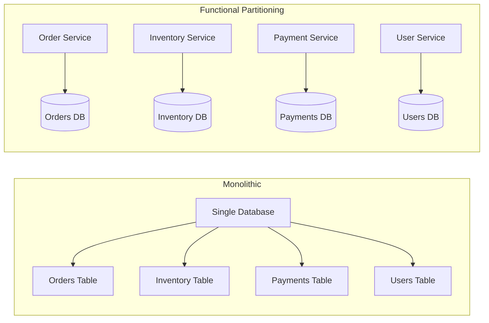
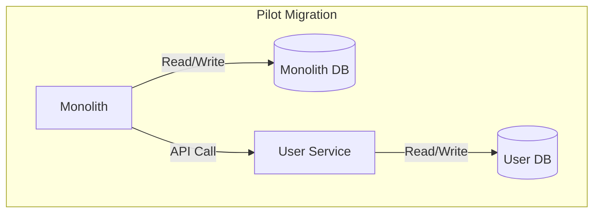
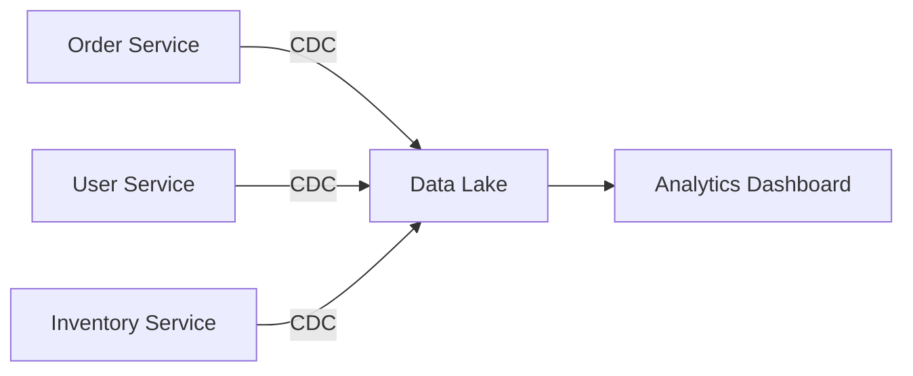

# How to Build Functional Partitioning

Author: [nawazdhandala](https://github.com/nawazdhandala)

Tags: Database, Partitioning, Microservices, Architecture

Description: Learn to build functional partitioning for separating data by business domain and function.

---

When a single database becomes the bottleneck for multiple features, the answer is not always vertical scaling or adding read replicas. Functional partitioning splits your data by business domain so that each service owns its slice. This approach reduces contention, simplifies scaling, and aligns your data layer with your team structure.

## What is Functional Partitioning?

Functional partitioning divides data based on business function rather than row count or key range. Instead of sharding a monolithic `orders` table across ten nodes, you separate `orders`, `inventory`, `payments`, and `shipping` into dedicated data stores. Each domain gets its own database (or schema), and cross-domain queries become explicit API calls.

This differs from horizontal partitioning (sharding), which splits the same table across multiple nodes by a partition key. Functional partitioning is about boundaries, not distribution.



## When to Use Functional Partitioning

Not every system needs this. Functional partitioning works best when you observe specific pain points.

| Signal | What It Means | Why Partitioning Helps |
| --- | --- | --- |
| Lock contention across tables | Transactions from unrelated features block each other | Separate databases eliminate cross-domain locks |
| Schema changes slow everyone down | One team's migration blocks deployments | Each domain evolves independently |
| Scaling is all-or-nothing | You cannot scale payments without scaling everything | Resources scale per function |
| On-call is a nightmare | Any DB issue affects all features | Blast radius shrinks to one domain |
| Teams step on each other | Shared tables cause merge conflicts and coordination overhead | Clear ownership boundaries |

If you have a small team and a modest data footprint, a well-indexed monolithic database is simpler. Functional partitioning introduces operational complexity that only pays off at scale.

## Core Principles

Before splitting, establish rules that keep the system coherent.

**1. Define Bounded Contexts**

Each partition maps to a bounded context from your domain model. The `Order` service owns everything about order lifecycle. It does not query the `User` table directly; it calls the User service API or caches what it needs locally.

**2. No Cross-Database Joins**

Once you split, `JOIN orders.items ON inventory.products` is gone. Data retrieval across domains happens via service-to-service calls or event-driven synchronization. This is the trade-off: you lose SQL convenience for operational independence.

**3. Embrace Eventual Consistency**

When a user places an order, inventory must decrement. In a monolith, you wrap both in a transaction. With functional partitioning, you publish an `OrderPlaced` event and the Inventory service reacts. Accept that inventory might be briefly inconsistent, and design compensation logic for failures.

**4. Own Your Data Completely**

Each service is the single source of truth for its domain. Other services may cache or replicate subsets, but they never write directly. This prevents hidden coupling and makes debugging straightforward.

## Step-by-Step Implementation

Here is how to migrate from a monolithic database to functionally partitioned services.

### Step 1: Map Your Domain

Start by listing every table and identifying which business function owns it. Some tables belong to multiple domains (like an `audit_log`); those either become shared infrastructure or get duplicated per domain.

The following table shows a sample mapping for an e-commerce system.

| Table | Owner Domain | Notes |
| --- | --- | --- |
| users | User | Authentication and profile |
| orders | Order | Order lifecycle and history |
| order_items | Order | Line items per order |
| products | Catalog | Product metadata |
| inventory | Inventory | Stock levels and reservations |
| payments | Payment | Transaction records |
| shipments | Shipping | Tracking and delivery |

### Step 2: Create Service Boundaries

For each domain, spin up a dedicated service with its own database. Start with one domain (usually the least coupled one) as a pilot.



### Step 3: Implement the Strangler Pattern

Do not rewrite everything at once. Use the strangler pattern to gradually redirect traffic. The following example shows a Node.js API gateway that routes user requests to the new service while other requests still hit the monolith.

```typescript
// api-gateway/routes.ts
import express from "express";
import { createProxyMiddleware } from "http-proxy-middleware";

const app = express();

// Route user-related requests to the new User service
app.use(
  "/api/users",
  createProxyMiddleware({
    target: "http://user-service:3001",
    changeOrigin: true,
  })
);

// Everything else still goes to the monolith
app.use(
  "/api",
  createProxyMiddleware({
    target: "http://monolith:3000",
    changeOrigin: true,
  })
);

app.listen(8080);
```

### Step 4: Migrate Data

Copy data from the monolith to the new service's database. Run dual writes temporarily to keep both in sync, then cut over reads.

```typescript
// order-service/sync.ts
import { MonolithDB, OrderDB } from "./db";

// Dual-write during migration period
export async function createOrder(orderData: OrderInput) {
  // Write to new database first
  const order = await OrderDB.orders.create(orderData);

  // Write to legacy database for backward compatibility
  await MonolithDB.orders.create({
    ...orderData,
    id: order.id,
  });

  return order;
}

// After migration is verified, remove the MonolithDB write
```

### Step 5: Replace Joins with APIs

Where the monolith joined tables, the new architecture calls APIs. This code shows how the Order service fetches user details.

```typescript
// order-service/orders.ts
import { httpClient } from "./http";
import { OrderDB } from "./db";

interface OrderWithUser {
  id: string;
  userId: string;
  items: OrderItem[];
  user: UserDetails;
}

export async function getOrderWithUser(
  orderId: string
): Promise<OrderWithUser> {
  // Fetch order from local database
  const order = await OrderDB.orders.findById(orderId);

  // Fetch user from User service API
  const user = await httpClient.get<UserDetails>(
    `http://user-service/api/users/${order.userId}`
  );

  return {
    ...order,
    user,
  };
}
```

### Step 6: Implement Event-Driven Communication

For operations that span domains, publish events instead of making synchronous calls. The following example uses a message queue to notify Inventory when an order is placed.

```typescript
// order-service/events.ts
import { MessageQueue } from "./queue";

export async function placeOrder(orderData: OrderInput) {
  // Create order in local database
  const order = await OrderDB.orders.create(orderData);

  // Publish event for other services
  await MessageQueue.publish("order.placed", {
    orderId: order.id,
    items: order.items.map((item) => ({
      productId: item.productId,
      quantity: item.quantity,
    })),
    timestamp: new Date().toISOString(),
  });

  return order;
}
```

The Inventory service subscribes and updates stock levels.

```typescript
// inventory-service/handlers.ts
import { MessageQueue } from "./queue";
import { InventoryDB } from "./db";

MessageQueue.subscribe("order.placed", async (event) => {
  // Decrement inventory for each item
  for (const item of event.items) {
    await InventoryDB.inventory.decrement(item.productId, item.quantity);
  }

  // Publish confirmation event
  await MessageQueue.publish("inventory.reserved", {
    orderId: event.orderId,
    timestamp: new Date().toISOString(),
  });
});
```

## Handling Cross-Domain Queries

Reporting and analytics often need data from multiple domains. You have three options.

**1. API Composition**

A backend-for-frontend (BFF) layer aggregates data from multiple services. This works for low-volume, user-facing queries.

**2. Materialized Views**

Services publish events to a data warehouse or search index (Elasticsearch, ClickHouse) that pre-joins data for analytics. Dashboards query the warehouse, not the operational databases.

**3. Change Data Capture**

Tools like Debezium stream database changes to a central data lake. Analytics teams query the lake without impacting production services.



## Common Pitfalls

**Distributed Transactions**

Avoid two-phase commits across services. They create tight coupling and fail under network partitions. Use sagas with compensating transactions instead.

**Chatty Services**

If one request triggers ten service calls, your latency will suffer. Cache aggressively, denormalize where it makes sense, and batch requests.

**Inconsistent Data Formats**

Define shared schemas (Protobuf, JSON Schema) for events and API contracts. Version them carefully.

**Ignoring Observability**

Distributed tracing is mandatory. Without it, debugging a failed order that spans four services becomes guesswork. Instrument every service with OpenTelemetry and correlate traces across boundaries.

## Measuring Success

Track these metrics to validate that partitioning is working.

| Metric | Target | Why It Matters |
| --- | --- | --- |
| P99 latency per service | Below SLO threshold | Each domain should meet its own SLO independently |
| Deployment frequency | Increases | Teams deploy without waiting for others |
| Incident blast radius | Single domain | Outages affect one feature, not the whole product |
| Cross-team coordination meetings | Decreases | APIs replace meetings |

---

Functional partitioning is not free. You trade SQL joins for API calls, transactions for eventual consistency, and a single database for many. The payoff is a system where teams move independently, failures stay contained, and scaling happens where you need it. Start with one domain, prove the pattern, and expand from there.
