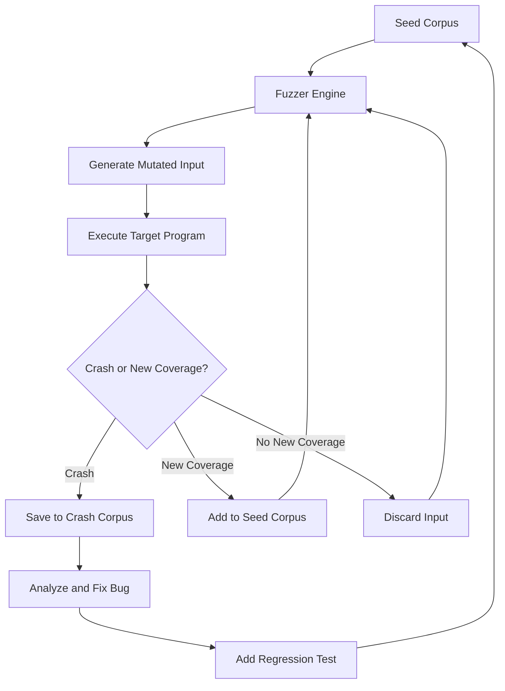

# How to Create Fuzz Testing Integration

Author: [nawazdhandala](https://github.com/nawazdhandala)

Tags: Testing, Fuzzing, Security, Automation

Description: Learn to integrate fuzz testing into your development workflow to discover input validation vulnerabilities before attackers do.

---

Fuzz testing finds bugs that traditional unit tests miss. By bombarding your code with malformed, unexpected, and random inputs, fuzzers uncover edge cases that lead to crashes, memory corruption, and security vulnerabilities. This guide covers how to integrate fuzzing into your input validation pipeline.

## What is Fuzz Testing?

Fuzz testing (fuzzing) automatically generates semi-random inputs and feeds them to your program, monitoring for crashes, hangs, assertions, or undefined behavior. Unlike unit tests that verify expected behavior, fuzzers explore the unexpected.

| Approach | Unit Testing | Fuzz Testing |
|----------|--------------|--------------|
| **Inputs** | Predefined test cases | Auto-generated mutations |
| **Coverage** | Known scenarios | Unknown edge cases |
| **Goal** | Verify correctness | Find crashes and bugs |
| **Scale** | Hundreds of tests | Millions of inputs |
| **Discovers** | Regression bugs | Security vulnerabilities |

## Fuzzing Workflow Overview

The following diagram shows how coverage-guided fuzzing works:



## Coverage-Guided Fuzzing

Coverage-guided fuzzers track which code paths each input exercises. When a mutated input reaches new code, the fuzzer saves it and uses it as a basis for future mutations. This creates a feedback loop that systematically explores program behavior.

### Key Concepts

| Term | Definition |
|------|------------|
| **Seed Corpus** | Initial inputs the fuzzer mutates |
| **Mutation** | Small changes to existing inputs |
| **Coverage** | Code paths exercised by inputs |
| **Crash Corpus** | Inputs that caused failures |
| **Sanitizer** | Tool detecting memory errors |

## AFL (American Fuzzy Lop)

AFL is one of the most popular coverage-guided fuzzers. It uses compile-time instrumentation to track coverage and evolutionary algorithms to generate effective test inputs.

### Installing AFL++

AFL++ is the actively maintained fork of AFL with additional features:

```bash
# Install AFL++ on Ubuntu/Debian
sudo apt-get update
sudo apt-get install -y afl++

# Or build from source for latest features
git clone https://github.com/AFLplusplus/AFLplusplus
cd AFLplusplus
make distrib
sudo make install
```

### Compiling with AFL Instrumentation

AFL needs to instrument your code to track coverage. Use the AFL compiler wrappers:

```bash
# Compile C code with AFL instrumentation
# afl-clang-fast provides faster instrumentation than afl-gcc
afl-clang-fast -o my_parser my_parser.c

# Compile C++ code
afl-clang-fast++ -o my_parser my_parser.cpp

# Enable AddressSanitizer for memory error detection
# This catches buffer overflows, use-after-free, etc.
AFL_USE_ASAN=1 afl-clang-fast -o my_parser_asan my_parser.c
```

### Creating a Fuzz Target

Your fuzz target should read input and pass it to the function under test. AFL feeds input through stdin or a file:

```c
// fuzz_target.c
// This is the entry point AFL will use to test your parser
#include <stdio.h>
#include <stdlib.h>
#include <string.h>
#include "parser.h"

int main(int argc, char *argv[]) {
    // Read input from file (AFL provides input via file argument)
    FILE *f = fopen(argv[1], "rb");
    if (!f) return 1;

    // Get file size
    fseek(f, 0, SEEK_END);
    long size = ftell(f);
    fseek(f, 0, SEEK_SET);

    // Allocate buffer and read input
    // AFL will mutate this input trying to trigger bugs
    char *buffer = malloc(size + 1);
    if (!buffer) {
        fclose(f);
        return 1;
    }

    fread(buffer, 1, size, f);
    buffer[size] = '\0';
    fclose(f);

    // Call the function we want to fuzz
    // Any crash here will be captured by AFL
    parse_input(buffer, size);

    free(buffer);
    return 0;
}
```

### Building a Seed Corpus

Start with valid inputs that exercise different code paths. Better seeds lead to faster coverage:

```bash
# Create seed corpus directory
mkdir -p corpus/seeds

# Add minimal valid inputs that exercise different features
# Each file should be small but trigger different parsing paths
echo '{"name": "test"}' > corpus/seeds/valid_json.txt
echo '{"items": [1, 2, 3]}' > corpus/seeds/array.txt
echo '{"nested": {"key": "value"}}' > corpus/seeds/nested.txt

# Add edge cases you already know about
echo '{}' > corpus/seeds/empty_object.txt
echo '""' > corpus/seeds/empty_string.txt
```

### Running AFL

```bash
# Run AFL with the seed corpus
# -i: input corpus directory
# -o: output directory for findings
# -m none: disable memory limit (needed for ASAN)
afl-fuzz -i corpus/seeds -o corpus/findings -m none -- ./my_parser @@

# The @@ is replaced with the input filename by AFL
# AFL will show a dashboard with coverage stats and crash count
```

### AFL Dashboard Explained

```
       american fuzzy lop ++4.00c (my_parser)

   process timing          overall results
  -----------------       -----------------
        run time : 0 days, 1 hrs, 23 min    cycles done : 42
   last new find : 0 days, 0 hrs, 2 min     corpus count : 1847
last uniq crash : 0 days, 0 hrs, 15 min   saved crashes : 3
 last uniq hang : none seen yet         saved hangs : 0

   cycle progress            map coverage
  -----------------         -----------------
  now processing : 1203     map density : 4.21%
  runs timed out : 0        count coverage : 6.18 bits/tuple

   stage progress            findings in depth
  -----------------         -----------------
  now trying : havoc        favored items : 423
 stage execs : 12.3k        new edges on : 847
```

## libFuzzer

libFuzzer is LLVM's built-in fuzzing engine. It runs in-process, making it faster for small targets. It is particularly well-suited for testing libraries.

### Writing a libFuzzer Target

libFuzzer targets implement `LLVMFuzzerTestOneInput`:

```c
// fuzz_json_parser.c
// libFuzzer will call this function with mutated inputs
#include <stdint.h>
#include <stddef.h>
#include <string.h>
#include "json_parser.h"

// This function is called repeatedly by libFuzzer
// data: pointer to fuzzed input bytes
// size: length of the input
// Return 0 to indicate success (non-zero for fatal errors only)
int LLVMFuzzerTestOneInput(const uint8_t *data, size_t size) {
    // Ignore inputs that are too large
    // This prevents slowdowns from pathological inputs
    if (size > 1024 * 1024) {
        return 0;
    }

    // Create null-terminated string for the parser
    // Many parsers expect null-terminated strings
    char *input = malloc(size + 1);
    if (!input) return 0;

    memcpy(input, data, size);
    input[size] = '\0';

    // Create parser context
    json_parser_t *parser = json_parser_create();
    if (parser) {
        // Parse the fuzzed input
        // Any crash, hang, or sanitizer error will be captured
        json_parse(parser, input, size);
        json_parser_destroy(parser);
    }

    free(input);
    return 0;  // Always return 0 unless fatal error
}
```

### Compiling with libFuzzer

```bash
# Compile with libFuzzer and sanitizers
# -fsanitize=fuzzer: Link libFuzzer
# -fsanitize=address: Enable AddressSanitizer
# -fsanitize=undefined: Enable UndefinedBehaviorSanitizer
clang -g -O1 -fsanitize=fuzzer,address,undefined \
    fuzz_json_parser.c json_parser.c -o fuzz_json

# For C++ projects
clang++ -g -O1 -fsanitize=fuzzer,address,undefined \
    fuzz_json_parser.cpp json_parser.cpp -o fuzz_json
```

### Running libFuzzer

```bash
# Run with a corpus directory
# libFuzzer will save interesting inputs here
mkdir -p corpus
./fuzz_json corpus/

# Run with additional options
./fuzz_json corpus/ \
    -max_len=10000 \          # Maximum input length
    -timeout=5 \              # Per-input timeout in seconds
    -jobs=4 \                 # Number of parallel jobs
    -workers=4 \              # Number of worker processes
    -dict=json.dict           # Dictionary of tokens to use
```

### Creating a Dictionary

Dictionaries help the fuzzer generate structured inputs faster:

```
# json.dict
# Common JSON tokens for the fuzzer to use in mutations
# This dramatically speeds up coverage for format-aware fuzzing

# Structural tokens
"{"
"}"
"["
"]"
":"
","

# Keywords
"true"
"false"
"null"

# Common keys
"\"name\""
"\"value\""
"\"type\""
"\"data\""
"\"id\""

# Escape sequences
"\\\""
"\\\\"
"\\n"
"\\t"
"\\u0000"

# Edge case numbers
"0"
"-1"
"9999999999999999999"
"1e308"
"-1e308"
```

## Fuzzing Input Validation Functions

Here is a complete example of fuzzing an email validation function:

```c
// email_validator.h
#ifndef EMAIL_VALIDATOR_H
#define EMAIL_VALIDATOR_H

#include <stdbool.h>
#include <stddef.h>

// Validation result codes
typedef enum {
    EMAIL_VALID = 0,
    EMAIL_INVALID_FORMAT,
    EMAIL_TOO_LONG,
    EMAIL_EMPTY,
    EMAIL_INVALID_CHAR
} email_result_t;

// Validate an email address
// Returns EMAIL_VALID if the email is valid
email_result_t validate_email(const char *email, size_t len);

#endif
```

```c
// email_validator.c
#include "email_validator.h"
#include <string.h>
#include <ctype.h>

#define MAX_EMAIL_LENGTH 254
#define MAX_LOCAL_LENGTH 64
#define MAX_DOMAIN_LENGTH 255

email_result_t validate_email(const char *email, size_t len) {
    if (!email || len == 0) {
        return EMAIL_EMPTY;
    }

    if (len > MAX_EMAIL_LENGTH) {
        return EMAIL_TOO_LONG;
    }

    // Find the @ symbol
    const char *at = memchr(email, '@', len);
    if (!at) {
        return EMAIL_INVALID_FORMAT;
    }

    size_t local_len = at - email;
    size_t domain_len = len - local_len - 1;

    // Validate local part length
    if (local_len == 0 || local_len > MAX_LOCAL_LENGTH) {
        return EMAIL_INVALID_FORMAT;
    }

    // Validate domain length
    if (domain_len == 0 || domain_len > MAX_DOMAIN_LENGTH) {
        return EMAIL_INVALID_FORMAT;
    }

    // Check for valid characters in local part
    for (size_t i = 0; i < local_len; i++) {
        char c = email[i];
        if (!isalnum(c) && c != '.' && c != '_' && c != '-' && c != '+') {
            return EMAIL_INVALID_CHAR;
        }
    }

    // Check domain has at least one dot
    const char *dot = memchr(at + 1, '.', domain_len);
    if (!dot) {
        return EMAIL_INVALID_FORMAT;
    }

    return EMAIL_VALID;
}
```

```c
// fuzz_email.c
// Fuzz target for email validation
#include <stdint.h>
#include <stddef.h>
#include "email_validator.h"

int LLVMFuzzerTestOneInput(const uint8_t *data, size_t size) {
    // Treat input as a potential email address
    // The fuzzer will generate all kinds of malformed inputs
    validate_email((const char *)data, size);

    // We do not check the return value because we want to test
    // that the function handles ALL inputs without crashing
    return 0;
}
```

## Fuzzing in Go

Go has built-in fuzzing support since Go 1.18:

```go
// validator_test.go
package validator

import (
    "testing"
    "unicode/utf8"
)

// FuzzValidateUsername tests the username validator with random inputs
// Go fuzzing functions must start with Fuzz and take *testing.F
func FuzzValidateUsername(f *testing.F) {
    // Add seed corpus entries
    // These are starting points for mutation
    f.Add("validuser")
    f.Add("user_123")
    f.Add("a]b[c")           // Special characters
    f.Add("")                // Empty string
    f.Add("a]b]c]d]e]f]g]h") // Repeated special chars

    // The fuzz function receives mutated inputs
    f.Fuzz(func(t *testing.T, username string) {
        // Validate should never panic regardless of input
        result := ValidateUsername(username)

        // Property-based checks that should always hold
        if !utf8.ValidString(username) {
            // Invalid UTF-8 should always be rejected
            if result.Valid {
                t.Errorf("Invalid UTF-8 was accepted: %q", username)
            }
        }

        if len(username) > MaxUsernameLength && result.Valid {
            t.Errorf("Oversized username accepted: len=%d", len(username))
        }
    })
}

// FuzzParseJSON tests JSON parsing for crashes
func FuzzParseJSON(f *testing.F) {
    // Seed with valid JSON structures
    f.Add([]byte(`{"key": "value"}`))
    f.Add([]byte(`[1, 2, 3]`))
    f.Add([]byte(`null`))
    f.Add([]byte(`"string"`))

    f.Fuzz(func(t *testing.T, data []byte) {
        // Parse should never panic
        // We only care about crashes, not parse errors
        _, _ = ParseJSON(data)
    })
}
```

Running Go fuzz tests:

```bash
# Run fuzzing for 30 seconds
go test -fuzz=FuzzValidateUsername -fuzztime=30s

# Run until manually stopped (for longer fuzzing sessions)
go test -fuzz=FuzzValidateUsername

# Run with coverage report
go test -fuzz=FuzzValidateUsername -fuzztime=1m -cover

# Fuzz a specific package
go test -fuzz=Fuzz ./pkg/validator/...
```

## Fuzzing in Rust

Rust has excellent fuzzing support through cargo-fuzz:

```bash
# Install cargo-fuzz
cargo install cargo-fuzz

# Initialize fuzzing for your project
cd my_project
cargo fuzz init

# Create a new fuzz target
cargo fuzz add parse_input
```

```rust
// fuzz/fuzz_targets/parse_input.rs
// Fuzz target for a Rust input parser

#![no_main]

use libfuzzer_sys::fuzz_target;
use my_project::parser::parse_input;

// This macro creates the fuzzing entry point
// arbitrary: use the Arbitrary trait to generate structured inputs
fuzz_target!(|data: &[u8]| {
    // Convert bytes to string if valid UTF-8
    if let Ok(input) = std::str::from_utf8(data) {
        // Parse should handle any input without panicking
        let _ = parse_input(input);
    }
});
```

For more structured fuzzing, use the `Arbitrary` trait:

```rust
// fuzz/fuzz_targets/structured_fuzz.rs
#![no_main]

use libfuzzer_sys::fuzz_target;
use arbitrary::Arbitrary;

// Define a structured input type
// The fuzzer will generate valid instances of this struct
#[derive(Debug, Arbitrary)]
struct FuzzInput {
    name: String,
    age: u8,
    email: Option<String>,
    tags: Vec<String>,
}

fuzz_target!(|input: FuzzInput| {
    // Fuzzer generates structured data matching our schema
    // This is more effective than raw bytes for complex inputs
    let _ = my_project::process_user(
        &input.name,
        input.age,
        input.email.as_deref(),
        &input.tags,
    );
});
```

Running Rust fuzz tests:

```bash
# Run the fuzz target
cargo +nightly fuzz run parse_input

# Run with additional sanitizers
cargo +nightly fuzz run parse_input -- -sanitizer=address

# Run for a specific duration
cargo +nightly fuzz run parse_input -- -max_total_time=300

# List crashes found
cargo +nightly fuzz list
```

## CI/CD Integration

### GitHub Actions Workflow

```yaml
# .github/workflows/fuzz.yml
name: Fuzz Testing

on:
  # Run on schedule for continuous fuzzing
  schedule:
    - cron: '0 2 * * *'  # Daily at 2 AM UTC
  # Run on PRs that modify parser code
  pull_request:
    paths:
      - 'src/parser/**'
      - 'fuzz/**'
  # Allow manual triggering
  workflow_dispatch:
    inputs:
      duration:
        description: 'Fuzzing duration in seconds'
        required: false
        default: '300'

jobs:
  fuzz-libfuzzer:
    runs-on: ubuntu-latest
    steps:
      - uses: actions/checkout@v4

      - name: Install dependencies
        run: |
          sudo apt-get update
          sudo apt-get install -y clang llvm

      - name: Build fuzz targets
        run: |
          # Compile all fuzz targets with sanitizers
          clang -g -O1 -fsanitize=fuzzer,address,undefined \
            fuzz/fuzz_json.c src/json_parser.c \
            -o fuzz_json

      - name: Download existing corpus
        uses: actions/cache@v4
        with:
          path: corpus
          key: fuzz-corpus-${{ github.sha }}
          restore-keys: |
            fuzz-corpus-

      - name: Run fuzzer
        run: |
          mkdir -p corpus/json
          # Run for specified duration (default 5 minutes)
          timeout ${{ github.event.inputs.duration || 300 }} \
            ./fuzz_json corpus/json/ \
            -max_total_time=${{ github.event.inputs.duration || 300 }} \
            || true  # Don't fail on timeout

      - name: Upload crashes
        if: always()
        uses: actions/upload-artifact@v4
        with:
          name: fuzz-crashes
          path: |
            crash-*
            corpus/json/crash-*
          if-no-files-found: ignore

      - name: Save corpus
        uses: actions/cache/save@v4
        if: always()
        with:
          path: corpus
          key: fuzz-corpus-${{ github.sha }}

  fuzz-go:
    runs-on: ubuntu-latest
    steps:
      - uses: actions/checkout@v4

      - uses: actions/setup-go@v5
        with:
          go-version: '1.22'

      - name: Run Go fuzzing
        run: |
          # Run each fuzz target for 1 minute
          go test -fuzz=FuzzValidateEmail -fuzztime=1m ./pkg/validator/
          go test -fuzz=FuzzParseConfig -fuzztime=1m ./pkg/config/

      - name: Upload testdata
        if: failure()
        uses: actions/upload-artifact@v4
        with:
          name: go-fuzz-testdata
          path: '**/testdata/fuzz/**'
```

### OSS-Fuzz Integration

For open-source projects, Google's OSS-Fuzz provides free continuous fuzzing:

```yaml
# project.yaml for OSS-Fuzz
homepage: "https://github.com/your-org/your-project"
language: c
primary_contact: "security@your-org.com"
sanitizers:
  - address
  - undefined
  - memory
architectures:
  - x86_64
fuzzing_engines:
  - libfuzzer
  - afl
  - honggfuzz
```

```bash
# Dockerfile for OSS-Fuzz build
FROM gcr.io/oss-fuzz-base/base-builder

RUN apt-get update && apt-get install -y make cmake

COPY . $SRC/your-project
WORKDIR $SRC/your-project

COPY build.sh $SRC/
```

```bash
# build.sh for OSS-Fuzz
#!/bin/bash -eu

# Build the project with fuzzing instrumentation
mkdir build && cd build
cmake .. -DFUZZ=ON
make -j$(nproc)

# Copy fuzz targets to $OUT
cp fuzz_* $OUT/

# Copy seed corpus
zip -j $OUT/fuzz_json_seed_corpus.zip seeds/json/*

# Copy dictionaries
cp dicts/*.dict $OUT/
```

## Processing Fuzzer Findings

When the fuzzer finds crashes, you need to analyze and fix them:

```bash
# Reproduce a crash found by libFuzzer
./fuzz_json crash-abc123def

# Get a stack trace with symbols
ASAN_OPTIONS=symbolize=1 ./fuzz_json crash-abc123def

# Minimize the crash input (find smallest reproducer)
./fuzz_json crash-abc123def -minimize_crash=1 -max_total_time=60

# Create a regression test from the crash
cp crash-abc123def tests/regression/crash_001.txt
```

### Triaging Crashes

```python
#!/usr/bin/env python3
# triage_crashes.py
# Script to deduplicate and categorize fuzzer crashes

import os
import subprocess
import hashlib
from pathlib import Path

def get_crash_signature(binary, crash_file):
    """Run crash and extract stack trace signature."""
    env = os.environ.copy()
    env['ASAN_OPTIONS'] = 'symbolize=1'

    result = subprocess.run(
        [binary, crash_file],
        capture_output=True,
        env=env,
        timeout=10
    )

    # Extract key frames from stack trace
    stderr = result.stderr.decode('utf-8', errors='ignore')
    frames = []
    for line in stderr.split('\n'):
        if '#' in line and ' in ' in line:
            # Extract function name from stack frame
            func = line.split(' in ')[1].split(' ')[0]
            frames.append(func)
            if len(frames) >= 5:  # Top 5 frames
                break

    return hashlib.md5('|'.join(frames).encode()).hexdigest()[:8]


def triage_crashes(binary, crash_dir):
    """Group crashes by stack trace signature."""
    crashes = {}

    for crash_file in Path(crash_dir).glob('crash-*'):
        try:
            sig = get_crash_signature(binary, str(crash_file))
            if sig not in crashes:
                crashes[sig] = []
            crashes[sig].append(crash_file)
        except Exception as e:
            print(f"Error processing {crash_file}: {e}")

    print(f"Found {len(crashes)} unique crash signatures:")
    for sig, files in crashes.items():
        print(f"  {sig}: {len(files)} crashes")
        print(f"    Example: {files[0]}")

    return crashes


if __name__ == '__main__':
    import sys
    triage_crashes(sys.argv[1], sys.argv[2])
```

## Best Practices

| Practice | Description |
|----------|-------------|
| **Start with valid inputs** | Seeds should cover different code paths |
| **Use sanitizers** | ASAN, MSAN, UBSAN catch more bugs |
| **Create dictionaries** | Format-aware tokens speed up coverage |
| **Minimize crashes** | Smaller inputs are easier to debug |
| **Save corpus** | Accumulated corpus improves future runs |
| **Run continuously** | More time means more coverage |
| **Fix bugs quickly** | Crashes block finding new bugs |

## Summary

Fuzz testing integration catches vulnerabilities that slip through traditional testing:

| Component | Tool Options |
|-----------|--------------|
| **C/C++** | AFL++, libFuzzer, honggfuzz |
| **Go** | Native go test -fuzz |
| **Rust** | cargo-fuzz, afl.rs |
| **CI/CD** | GitHub Actions, OSS-Fuzz |
| **Sanitizers** | ASAN, MSAN, UBSAN |

Start with your input parsing and validation functions. Add fuzzing to your CI pipeline. The bugs fuzzers find are often the same ones attackers exploit.
