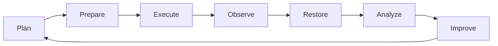
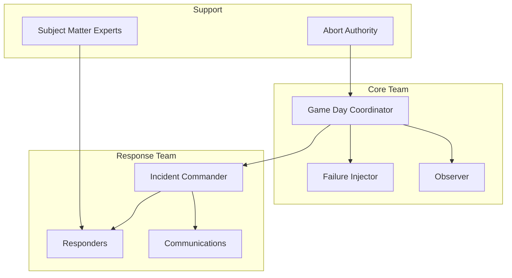
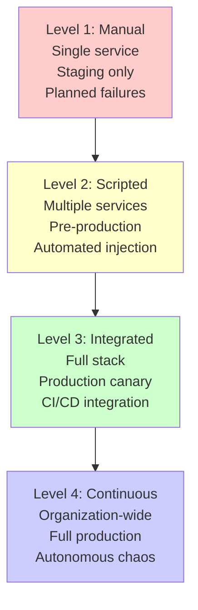

# How to Create Game Day Exercises

Author: [nawazdhandala](https://github.com/nawazdhandala)

Tags: SRE, Chaos Engineering, Reliability, DevOps, Incident Response, Game Days

Description: A practical guide to designing and running game day exercises that stress-test your systems, train your teams, and uncover hidden weaknesses before real incidents strike.

---

## What Are Game Day Exercises?

Game days are controlled experiments where engineering teams intentionally introduce failures into their systems to test resilience, validate runbooks, and practice incident response. Think of them as fire drills for your infrastructure. Unlike chaos engineering, which often runs continuously in production, game days are scheduled events with clear objectives, safety controls, and team-wide participation.

The concept originated at Amazon Web Services, where teams regularly simulate outages to ensure they can handle real failures gracefully. Today, organizations from Netflix to Google use game days as a core reliability practice.

> "The best time to practice for an outage is before it happens."

---

## Why Run Game Days?

Game days deliver value that regular testing cannot:

| Benefit | Description |
|---------|-------------|
| **Validate assumptions** | That "highly available" database cluster might not failover as smoothly as you think |
| **Train responders** | New team members get hands-on experience without the pressure of real incidents |
| **Test runbooks** | Discover outdated or incomplete documentation before it matters |
| **Build confidence** | Teams that have practiced failure respond more calmly during real outages |
| **Find hidden dependencies** | Reveal unexpected coupling between services |
| **Measure recovery time** | Get actual data on how long restoration takes |

---

## The Game Day Lifecycle

A successful game day follows a structured process from planning through analysis.



---

## Step 1: Define Your Hypothesis

Every game day starts with a hypothesis. This transforms a random failure injection into a scientific experiment.

**Template:**
> "We believe that when [specific failure occurs], the system will [expected behavior], and users will experience [expected impact]. Recovery will take approximately [time estimate]."

**Example hypotheses:**

- "When the primary database becomes unavailable, our application will failover to the replica within 30 seconds with zero data loss."
- "When the payment service returns 500 errors, the checkout flow will gracefully degrade and show users a retry option."
- "When we lose an availability zone, traffic will redistribute to healthy zones within 60 seconds."

---

## Step 2: Choose Your Failure Scenarios

Start simple and increase complexity over time. Here are common categories of failures to simulate:

### Infrastructure Failures

| Scenario | How to Simulate | What to Observe |
|----------|-----------------|-----------------|
| Server crash | Terminate instance | Auto-scaling response, traffic redistribution |
| Network partition | iptables rules, security groups | Service isolation behavior, split-brain handling |
| Disk full | Fill disk with dummy data | Alerting, log rotation, graceful degradation |
| High latency | Traffic control (tc) commands | Timeout handling, circuit breakers |
| DNS failure | Modify resolv.conf or block DNS | Caching behavior, retry logic |

### Application Failures

| Scenario | How to Simulate | What to Observe |
|----------|-----------------|-----------------|
| Memory leak | Allocate memory gradually | OOM killer behavior, pod restarts |
| CPU spike | Stress testing tools | Throttling, autoscaling triggers |
| Dependency timeout | Add artificial delay | Circuit breaker activation |
| Error spike | Return errors from endpoints | Alerting, user experience |

### Data Failures

| Scenario | How to Simulate | What to Observe |
|----------|-----------------|-----------------|
| Database failover | Promote replica, demote primary | Connection handling, data consistency |
| Cache invalidation | Flush Redis/Memcached | Cold start performance, thundering herd |
| Corrupted messages | Inject malformed data | Error handling, dead letter queues |

---

## Step 3: Plan Safety Controls

Game days should stress your systems, not break your business. Define abort criteria and blast radius limits.

### The Abort Criteria Checklist

The following Python script demonstrates how to implement automated abort criteria monitoring during game day exercises.

```python
# game_day_monitor.py
# This script monitors key metrics and automatically triggers abort if thresholds are exceeded

import time
from dataclasses import dataclass
from typing import Callable

@dataclass
class AbortCriteria:
    """Defines conditions that should trigger immediate game day termination."""

    # Error rate threshold (percentage)
    max_error_rate: float = 5.0

    # Latency threshold (milliseconds)
    max_p99_latency_ms: int = 2000

    # Customer impact threshold (affected users)
    max_affected_users: int = 100

    # Duration limit (seconds)
    max_duration_seconds: int = 1800  # 30 minutes

    # Revenue impact threshold (dollars per minute)
    max_revenue_impact_per_min: float = 1000.0


class GameDayMonitor:
    """Monitors system health during game day and triggers abort when needed."""

    def __init__(self, criteria: AbortCriteria, metrics_client):
        self.criteria = criteria
        self.metrics = metrics_client
        self.start_time = None
        self.abort_triggered = False
        self.abort_reason = None

    def start(self):
        """Begin monitoring for abort conditions."""
        self.start_time = time.time()
        print("Game day monitoring started")

    def check_abort_conditions(self) -> bool:
        """
        Check all abort criteria and return True if any are breached.
        This should be called continuously during the game day exercise.
        """

        # Check error rate
        current_error_rate = self.metrics.get_error_rate_percent()
        if current_error_rate > self.criteria.max_error_rate:
            self._trigger_abort(f"Error rate {current_error_rate}% exceeds threshold")
            return True

        # Check latency
        current_p99 = self.metrics.get_p99_latency_ms()
        if current_p99 > self.criteria.max_p99_latency_ms:
            self._trigger_abort(f"P99 latency {current_p99}ms exceeds threshold")
            return True

        # Check duration
        elapsed = time.time() - self.start_time
        if elapsed > self.criteria.max_duration_seconds:
            self._trigger_abort("Maximum game day duration exceeded")
            return True

        # Check affected users
        affected = self.metrics.get_affected_user_count()
        if affected > self.criteria.max_affected_users:
            self._trigger_abort(f"Affected users ({affected}) exceeds threshold")
            return True

        return False

    def _trigger_abort(self, reason: str):
        """Record abort and prepare for rollback."""
        self.abort_triggered = True
        self.abort_reason = reason
        print(f"ABORT TRIGGERED: {reason}")
```

### Blast Radius Controls

Limit the scope of your experiments using these techniques.

This Kubernetes configuration shows how to target game day experiments to a specific subset of pods using labels.

```yaml
# game-day-target-selector.yaml
# Use labels to isolate game day targets from production traffic

apiVersion: v1
kind: Pod
metadata:
  name: api-server-gameday
  labels:
    app: api-server
    # This label marks pods eligible for game day experiments
    gameday-eligible: "true"
    # Environment isolation
    environment: staging
    # Canary percentage for gradual rollout
    canary-group: "5-percent"
spec:
  containers:
  - name: api-server
    image: api-server:latest
    env:
    # Feature flag for game day mode
    - name: GAMEDAY_MODE
      value: "enabled"
    # Reduces impact by limiting throughput
    - name: MAX_CONCURRENT_REQUESTS
      value: "100"
```

---

## Step 4: Assemble Your Team

Game days require clear roles. This structure scales from small teams to organization-wide exercises.



### Role Definitions

| Role | Responsibilities |
|------|------------------|
| **Game Day Coordinator** | Plans exercise, sets objectives, manages timeline |
| **Failure Injector** | Executes the failure injection scripts |
| **Observer** | Documents everything, captures metrics, notes surprises |
| **Incident Commander** | Leads the response team (may not know what failure is coming) |
| **Responders** | Engineers who diagnose and mitigate the issue |
| **Communications** | Updates stakeholders, manages status page |
| **Subject Matter Experts** | Available for escalation on specific systems |
| **Abort Authority** | Can call off the exercise immediately |

---

## Step 5: Create Your Runbook

Document everything before the exercise begins. This template covers the essentials.

```markdown
# Game Day Runbook Template

## Exercise Overview
- **Date:** 2026-01-30
- **Duration:** 2 hours (10:00 AM - 12:00 PM EST)
- **Objective:** Validate database failover procedures
- **Hypothesis:** Primary DB failure triggers automatic failover within 30 seconds

## Participants
- Coordinator: Jane Smith
- Failure Injector: Bob Chen
- Incident Commander: Alice Wong
- Observers: Dev Team A

## Pre-Exercise Checklist
- [ ] All participants briefed
- [ ] Monitoring dashboards ready
- [ ] Rollback procedures tested
- [ ] Stakeholders notified
- [ ] Abort criteria defined and understood
- [ ] Recording tools ready (screen capture, timeline)

## Failure Injection Steps
1. Verify baseline metrics (5 minutes)
2. Announce exercise start
3. Execute: `kubectl delete pod postgres-primary-0`
4. Start timer
5. Observe response team actions
6. Record time to detection
7. Record time to mitigation

## Success Criteria
- Automatic failover completes < 30 seconds
- No data loss confirmed via checksum
- Application reconnects without manual intervention
- Alerts fire within 60 seconds

## Abort Criteria
- Error rate exceeds 10%
- Failover does not begin within 2 minutes
- Data inconsistency detected
- Any production customer impact

## Rollback Procedure
1. Stop failure injection
2. Execute: `./scripts/restore-primary.sh`
3. Verify data consistency
4. Confirm all services healthy
```

---

## Step 6: Execute the Game Day

### Timeline Structure

A typical two-hour game day follows this structure:

```mermaid
gantt
    title Game Day Timeline
    dateFormat HH:mm
    axisFormat %H:%M

    section Preparation
    Team briefing           :prep1, 10:00, 15m
    Baseline metrics        :prep2, after prep1, 10m

    section Execution
    Failure injection       :exec1, 10:25, 5m
    Response observation    :exec2, after exec1, 45m

    section Recovery
    System restoration      :rec1, 11:15, 20m
    Verification           :rec2, after rec1, 15m

    section Analysis
    Hot debrief            :ana1, 11:50, 30m
```



### Communication Script

Use clear, consistent language during the exercise.

```
[10:00] COORDINATOR: "Game day exercise starting. This is a drill.
        All participants confirm ready status."

[10:25] COORDINATOR: "Injecting failure in 60 seconds. Response team,
        your exercise begins now."

[10:26] INJECTOR: "Failure injected. Timer started."

[10:28] OBSERVER: "Alert fired at 10:27:45. Detection time: 1 minute 45 seconds."

[11:15] COORDINATOR: "Exercise complete. Beginning restoration phase."

[11:50] COORDINATOR: "Hot debrief starting. What did we learn?"
```

---

## Step 7: Capture Everything

Document observations in real-time. This data drives improvements.

### Metrics to Collect

The following shell script demonstrates how to capture metrics snapshots before, during, and after a game day exercise.

```bash
#!/bin/bash
# capture_gameday_metrics.sh
# Captures snapshots of key metrics during game day exercises

TIMESTAMP=$(date +%Y%m%d_%H%M%S)
OUTPUT_DIR="./gameday_data/${TIMESTAMP}"
mkdir -p "${OUTPUT_DIR}"

echo "Capturing game day metrics at ${TIMESTAMP}"

# Capture current error rates from your monitoring system
# Replace with your actual metrics endpoint
curl -s "http://metrics.internal/api/v1/query?query=rate(http_requests_total{status=~'5..'}[5m])" \
    > "${OUTPUT_DIR}/error_rate.json"

# Capture latency percentiles
curl -s "http://metrics.internal/api/v1/query?query=histogram_quantile(0.99,rate(http_request_duration_seconds_bucket[5m]))" \
    > "${OUTPUT_DIR}/latency_p99.json"

# Capture current pod status in Kubernetes
kubectl get pods -A -o json > "${OUTPUT_DIR}/pod_status.json"

# Capture recent events
kubectl get events -A --sort-by='.lastTimestamp' -o json > "${OUTPUT_DIR}/events.json"

# Capture node resource usage
kubectl top nodes > "${OUTPUT_DIR}/node_resources.txt"
kubectl top pods -A > "${OUTPUT_DIR}/pod_resources.txt"

echo "Metrics captured to ${OUTPUT_DIR}"
```

### Timeline Template

| Time | Event | Actor | Observation |
|------|-------|-------|-------------|
| 10:26:00 | Failure injected | Injector | Primary database pod terminated |
| 10:26:15 | Alert fired | System | PagerDuty notification received |
| 10:26:45 | Commander paged | System | IC acknowledges page |
| 10:27:30 | Diagnosis started | Responder | Checking database cluster status |
| 10:28:00 | Root cause identified | Responder | "Primary pod missing" |
| 10:28:30 | Failover observed | Observer | Replica promoted to primary |
| 10:29:00 | Application reconnected | System | Connection pool reestablished |

---

## Step 8: Conduct the Debrief

The debrief transforms raw experience into actionable improvements. Hold it immediately while memories are fresh.

### Debrief Agenda

1. **What happened?** (Facts only, no judgment)
2. **What went well?** (Reinforce good practices)
3. **What surprised us?** (Unexpected behaviors)
4. **Where did we struggle?** (Process or tooling gaps)
5. **What will we change?** (Concrete action items)

### Sample Findings

| Category | Finding | Action Item | Owner | Due Date |
|----------|---------|-------------|-------|----------|
| Detection | Alert fired 90 seconds after failure (target: 60s) | Tune alert threshold | Alice | Feb 7 |
| Runbook | Step 4 referenced deprecated command | Update runbook | Bob | Feb 3 |
| Recovery | Manual DNS update required | Automate DNS failover | Carol | Feb 14 |
| Communication | Stakeholders confused by status updates | Create template messages | Dan | Feb 7 |

---

## Automating Game Days with Chaos Tools

Once you have mastered manual game days, consider automation. These tools integrate game day patterns into your CI/CD pipeline.

### Chaos Mesh Example

This Kubernetes manifest demonstrates how to use Chaos Mesh to automatically inject pod failures during scheduled game day windows.

```yaml
# chaos-mesh-pod-failure.yaml
# Defines a scheduled chaos experiment using Chaos Mesh
# This will terminate random pods in the target namespace

apiVersion: chaos-mesh.org/v1alpha1
kind: PodChaos
metadata:
  name: gameday-pod-failure
  namespace: chaos-testing
spec:
  # Action type: pod-failure terminates pods
  action: pod-failure

  # How the experiment operates
  mode: one  # Affect one random pod matching selector

  # Target selection
  selector:
    namespaces:
      - production
    labelSelectors:
      app: api-server
      gameday-eligible: "true"

  # Duration of the chaos effect
  duration: "60s"

  # Schedule for automatic execution (optional)
  # Runs every Wednesday at 2 PM
  scheduler:
    cron: "0 14 * * 3"
```

### Litmus Chaos Example

This configuration shows how to set up a database failure experiment using LitmusChaos for Kubernetes.

```yaml
# litmus-db-chaos.yaml
# Database chaos experiment using LitmusChaos

apiVersion: litmuschaos.io/v1alpha1
kind: ChaosEngine
metadata:
  name: gameday-db-chaos
  namespace: litmus
spec:
  # Application under test
  appinfo:
    appns: database
    applabel: "app=postgres"
    appkind: statefulset

  # Do not delete resources after experiment
  jobCleanUpPolicy: retain

  # Chaos experiment configuration
  experiments:
    - name: pod-delete
      spec:
        components:
          env:
            # Target container
            - name: TARGET_CONTAINER
              value: postgres

            # Number of pods to target
            - name: TOTAL_CHAOS_DURATION
              value: "60"

            # Interval between pod deletions
            - name: CHAOS_INTERVAL
              value: "10"

            # Force delete without grace period
            - name: FORCE
              value: "false"
```

---

## Game Day Maturity Model

Progress through these levels as your practice matures:



| Level | Environment | Scope | Frequency |
|-------|-------------|-------|-----------|
| 1 - Manual | Staging | Single service | Monthly |
| 2 - Scripted | Pre-production | Multiple services | Bi-weekly |
| 3 - Integrated | Production (canary) | Full stack | Weekly |
| 4 - Continuous | Production | Organization-wide | Daily |

---

## Common Pitfalls to Avoid

**Starting too big.** Your first game day should be simple. Terminate a single non-critical pod in staging. Build confidence before testing payment systems in production.

**Skipping the hypothesis.** Without a hypothesis, you are just breaking things randomly. Define what you expect to happen so you can learn when reality differs.

**Forgetting stakeholders.** Nothing damages trust faster than surprise outages. Notify customer support, sales, and leadership before any production exercise.

**Not practicing rollback.** Test your abort procedures before you need them. A game day that cannot be stopped is not a game day, it is just an outage.

**Blaming people.** Game days expose gaps in systems, not failures in individuals. Maintain a blameless culture or people will hide problems instead of fixing them.

**Never graduating to production.** Staging environments lie. Eventually, you must test in production with real traffic, real data, and real stakes.

---

## Your First Game Day: A 30-Minute Exercise

Not ready for a full game day? Start with this minimal exercise.

### Prerequisites
- One service running in staging
- Basic monitoring in place
- Two engineers with 30 minutes

### Exercise

1. **Hypothesis (2 min):** "When we terminate the API pod, Kubernetes will restart it within 30 seconds, and no requests will fail."

2. **Baseline (3 min):** Check current pod status and error rate.

3. **Inject (1 min):** `kubectl delete pod api-server-xyz`

4. **Observe (10 min):** Watch pod recreation, check for failed requests, note any alerts.

5. **Restore (5 min):** Verify new pod is healthy and serving traffic.

6. **Debrief (9 min):** What happened? What surprised you? What would you do differently?

---

## Conclusion

Game days transform theoretical reliability into proven resilience. They expose assumptions, train teams, and build the muscle memory that keeps systems running when real failures occur.

Start small. Run your first exercise in staging with a simple pod termination. Document everything. Learn from what breaks. Then gradually increase scope, complexity, and realism until you are confident your systems can handle whatever production throws at them.

The organizations that practice failure regularly are the ones that handle it gracefully when it matters.

Your future on-call self will thank you for every game day you run today.

---

## Related Resources

- [The Five Stages of SRE Maturity](https://oneuptime.com/blog/post/2025-09-01-the-five-stages-of-sre-maturity/view)
- [The Ultimate SRE Reliability Checklist](https://oneuptime.com/blog/post/2025-09-10-sre-checklist/view)
- [Effective Incident Postmortem Templates](https://oneuptime.com/blog/post/2025-09-09-effective-incident-postmortem-templates-ready-to-use-examples/view)
- [What is Toil and How to Eliminate It](https://oneuptime.com/blog/post/2025-10-01-what-is-toil-and-how-to-eliminate-it/view)

**About OneUptime:** OneUptime provides the observability foundation you need for effective game days. Monitor your systems during chaos experiments with unified metrics, logs, and traces. Track SLOs, manage incidents, and communicate status, all in one platform. Learn more at [oneuptime.com](https://oneuptime.com).
