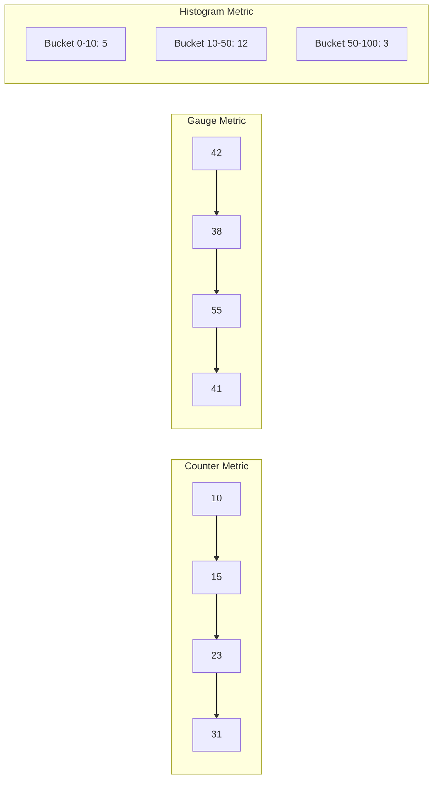
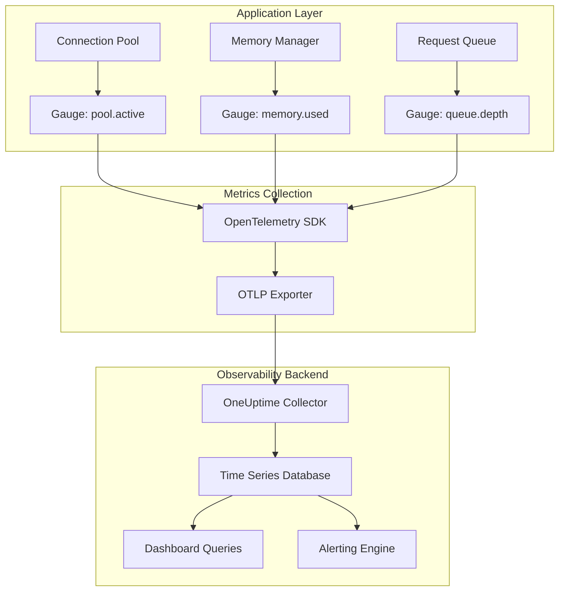
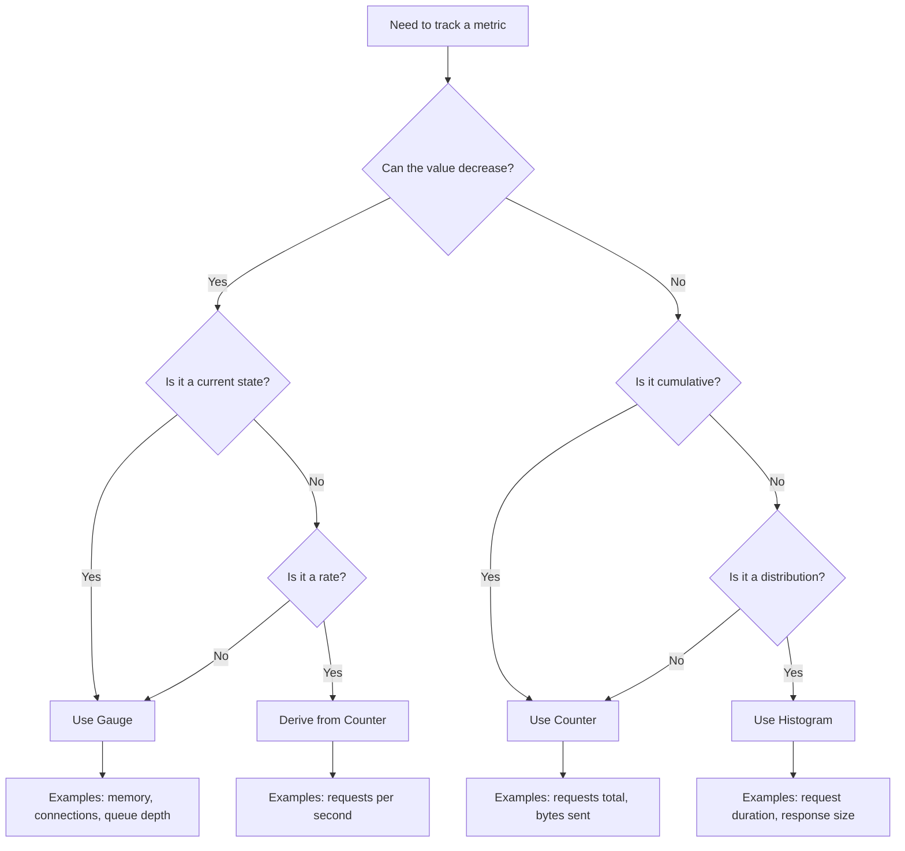

# How to Implement Gauge Metrics Design

Author: [nawazdhandala](https://github.com/nawazdhandala)

Tags: Metrics, Gauges, Prometheus, Current Values

Description: Learn to implement gauge metrics design for tracking point-in-time values.

---

Gauge metrics represent the simplest yet most misunderstood metric type in observability. Unlike counters that only go up, gauges capture the current state of something at any moment: memory usage, active connections, queue depth, or temperature readings. Getting gauge design right can mean the difference between actionable dashboards and misleading noise.

This guide covers the fundamentals of gauge metrics, when to use them, and practical implementation patterns across different languages and frameworks.

---

## What Makes a Gauge Different

The defining characteristic of a gauge is that its value can go up or down arbitrarily. Counters accumulate over time. Histograms track distributions. Gauges simply report "what is the value right now?"



This distinction matters because gauges capture instantaneous state. When you query a gauge, you get the most recent value recorded, not a sum or rate.

---

## When to Use Gauges

Gauges fit specific use cases where you need to know the current value of something, not how fast it changed. Common applications include:

| Use Case | Example Metric | Why Gauge |
|----------|---------------|-----------|
| Resource utilization | Memory usage in bytes | Value fluctuates up and down |
| Connection pools | Active database connections | Connections open and close |
| Queue depth | Messages waiting in queue | Messages arrive and get processed |
| Cache statistics | Items in cache | Items added and evicted |
| Temperature readings | CPU temperature | Physical measurements vary continuously |
| Saturation indicators | Thread pool saturation percentage | Percentage changes based on load |

If you find yourself wanting to calculate rates from a gauge, you probably want a counter instead. Gauges answer "how much right now" while counters answer "how many total."

---

## Basic Gauge Implementation in Node.js

The OpenTelemetry SDK provides gauge instruments through its metrics API. Here is a basic setup for tracking active connections.

```typescript
// metrics/gauges.ts
import { metrics } from '@opentelemetry/api';

// Create a meter for your service
const meter = metrics.getMeter('connection-service', '1.0.0');

// Create an observable gauge for active connections
// Observable gauges are read when metrics are collected
const activeConnectionsGauge = meter.createObservableGauge('connections.active', {
  description: 'Number of currently active connections',
  unit: '1',
});

// Track the current connection count
let connectionCount = 0;

// Register a callback that reports the current value
activeConnectionsGauge.addCallback((result) => {
  result.observe(connectionCount, {
    'service.type': 'database',
  });
});

// Functions to update the gauge value
export function connectionOpened(): void {
  connectionCount++;
}

export function connectionClosed(): void {
  connectionCount--;
}
```

The observable gauge pattern works well when you want to report values only during metric collection. For metrics that need immediate updates, use the synchronous gauge approach.

---

## Gauge Architecture in a Typical System

The following diagram shows how gauge metrics flow from your application to storage and visualization.



Each gauge reports its current value at collection intervals. The time series database stores these snapshots, allowing you to query historical values and trends.

---

## Implementing Gauges in Python with OpenTelemetry

Python applications follow a similar pattern. This example demonstrates tracking memory usage and queue depth.

```python
# metrics/gauges.py
from opentelemetry import metrics
from opentelemetry.sdk.metrics import MeterProvider
from opentelemetry.sdk.metrics.export import PeriodicExportingMetricReader
from opentelemetry.exporter.otlp.proto.grpc.metric_exporter import OTLPMetricExporter
import psutil
from collections import deque

# Configure the meter provider with OTLP export
exporter = OTLPMetricExporter(
    endpoint="https://oneuptime.com/otlp",
    headers={"x-oneuptime-token": "your-token"}
)
reader = PeriodicExportingMetricReader(exporter, export_interval_millis=10000)
provider = MeterProvider(metric_readers=[reader])
metrics.set_meter_provider(provider)

# Create a meter
meter = metrics.get_meter("queue-service", "1.0.0")

# Shared queue for demonstration
message_queue = deque()

# Create observable gauges with callbacks
def get_memory_usage(options):
    """Report current memory usage in bytes"""
    memory = psutil.Process().memory_info()
    yield metrics.Observation(
        value=memory.rss,
        attributes={"memory.type": "rss"}
    )

def get_queue_depth(options):
    """Report current queue depth"""
    yield metrics.Observation(
        value=len(message_queue),
        attributes={"queue.name": "messages"}
    )

# Register the gauges
memory_gauge = meter.create_observable_gauge(
    name="process.memory.usage",
    description="Current memory usage of the process",
    unit="By",
    callbacks=[get_memory_usage]
)

queue_gauge = meter.create_observable_gauge(
    name="queue.depth",
    description="Number of messages waiting in queue",
    unit="1",
    callbacks=[get_queue_depth]
)
```

The callback-based approach ensures you always report the freshest value at collection time, rather than a potentially stale cached value.

---

## Gauge vs Counter Decision Flow

Choosing between gauge and counter trips up many developers. This decision flow helps clarify when each type applies.



The key question is whether the value represents cumulative totals or current state. Active connections are current state. Total requests processed is cumulative.

---

## Common Gauge Patterns

Several patterns emerge when implementing gauges in production systems. Here are the most useful ones.

### Resource Pool Monitoring

Track utilization of bounded resources like connection pools or thread pools.

```typescript
// Track pool utilization as a percentage gauge
const poolUtilization = meter.createObservableGauge('pool.utilization', {
  description: 'Connection pool utilization percentage',
  unit: '%',
});

poolUtilization.addCallback((result) => {
  const active = pool.getActiveConnections();
  const max = pool.getMaxConnections();
  const utilization = (active / max) * 100;

  result.observe(utilization, {
    'pool.name': 'primary',
    'pool.max_size': max.toString(),
  });
});
```

### Periodic Snapshot Gauges

Some values need periodic recalculation rather than continuous tracking.

```typescript
// Snapshot gauge updated on an interval
const diskUsage = meter.createObservableGauge('disk.usage', {
  description: 'Disk usage in bytes',
  unit: 'By',
});

// Cache the last reading
let lastDiskReading = 0;

// Update every 30 seconds to avoid expensive syscalls
setInterval(async () => {
  const stats = await getDiskStats('/data');
  lastDiskReading = stats.used;
}, 30000);

diskUsage.addCallback((result) => {
  result.observe(lastDiskReading, {
    'disk.mount_point': '/data',
  });
});
```

### Multi-Dimensional Gauges

Use labels to create multiple gauge series from one instrument.

```typescript
// Track memory across multiple cache regions
const cacheSize = meter.createObservableGauge('cache.size', {
  description: 'Items in cache by region',
  unit: '1',
});

cacheSize.addCallback((result) => {
  // Report each cache region separately
  for (const [region, cache] of cacheRegions.entries()) {
    result.observe(cache.size(), {
      'cache.region': region,
      'cache.type': cache.type,
    });
  }
});
```

---

## Setting Up Alerts on Gauge Metrics

Gauges require different alerting strategies than counters. With counters, you typically alert on rate of change. With gauges, you alert on absolute values or sustained conditions.

```yaml
# Example alerting rules for gauge metrics
alerts:
  # Alert when memory usage exceeds threshold
  - name: HighMemoryUsage
    condition: process.memory.usage > 1073741824  # 1GB
    duration: 5m
    severity: warning
    message: "Memory usage above 1GB for 5 minutes"

  # Alert when connection pool is saturated
  - name: ConnectionPoolExhausted
    condition: pool.utilization > 90
    duration: 2m
    severity: critical
    message: "Connection pool above 90% utilization"

  # Alert when queue depth indicates backlog
  - name: QueueBacklog
    condition: queue.depth > 1000
    duration: 10m
    severity: warning
    message: "Message queue backlog exceeds 1000 items"
```

The duration clause is important for gauges. Transient spikes are often normal. Sustained high values indicate real problems.

---

## Gauge Pitfalls to Avoid

Several common mistakes lead to misleading gauge data.

**Reporting stale values:** Always read the current state at collection time. Cached values can mislead during incidents.

**Missing labels:** Without proper labels, you cannot distinguish between multiple instances of the same service.

**Incorrect units:** Document and use consistent units. Mixing bytes and kilobytes causes confusion.

**Aggregating gauges incorrectly:** Summing gauges across instances rarely makes sense. If each instance reports memory usage, the sum is meaningless. Average or max usually provides better insight.

**Using gauges for rates:** If you need requests per second, use a counter and let your query system calculate the rate. Gauges for rates require constant recalculation and can miss spikes between samples.

---

## Summary

Gauge metrics capture point-in-time values that can increase or decrease. They answer questions about current state rather than cumulative totals. Effective gauge implementation requires:

1. Choosing gauges for values that fluctuate bidirectionally
2. Using observable gauges to report fresh values at collection time
3. Adding meaningful labels for filtering and grouping
4. Setting alerts based on absolute thresholds with duration clauses
5. Avoiding common pitfalls like stale values and incorrect aggregation

When designed properly, gauge metrics provide essential visibility into resource utilization, saturation, and system health. Combined with counters and histograms, they complete your metrics instrumentation story.

---

**Related Reading:**

- [18 SRE Metrics Worth Tracking (And Why)](https://oneuptime.com/blog/post/2025-11-28-sre-metrics-to-track/view)
- [Logs, Metrics and Traces: The Three Pillars of Observability](https://oneuptime.com/blog/post/2025-08-20-three-pillars-of-observability-logs-metrics-traces/view)
- [What is the OpenTelemetry Collector and Why Use One](https://oneuptime.com/blog/post/2025-09-18-what-is-opentelemetry-collector-and-why-use-one/view)
