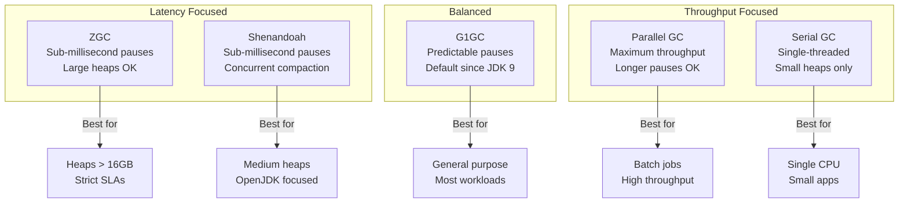
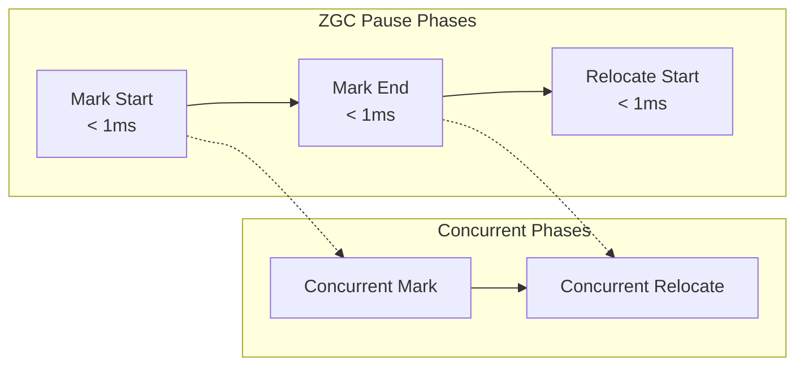
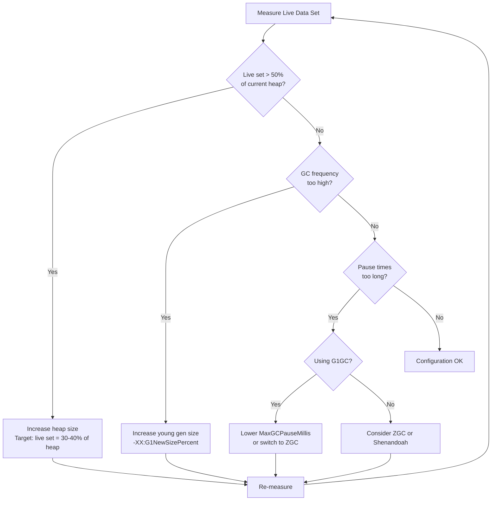

# How to Create GC Tuning Best Practices

Author: [nawazdhandala](https://github.com/nawazdhandala)

Tags: JVM, Garbage Collection, Performance, Tuning

Description: A practical guide to JVM garbage collection tuning covering G1GC, ZGC, Shenandoah, heap sizing strategies, and pause time optimization with real-world configuration examples.

---

Garbage collection tuning is one of those topics that sounds intimidating but follows predictable patterns once you understand what the JVM is actually doing. The goal is simple: keep your application responsive while letting the JVM reclaim unused memory efficiently.

This guide covers the modern GC algorithms (G1GC, ZGC, Shenandoah), when to use each, and how to configure them for different workload types.

---

## Understanding GC Fundamentals

Before diving into tuning, you need to understand what garbage collectors are optimizing for. Every GC makes tradeoffs between three competing goals:

| Goal | Description | Who Cares Most |
|------|-------------|----------------|
| Throughput | Percentage of time spent doing actual work vs GC work | Batch processing, data pipelines |
| Latency | Duration of GC pauses that stop application threads | Web services, trading systems |
| Footprint | Total memory consumed by the heap and GC overhead | Containerized workloads, dense deployments |

You cannot maximize all three. Pick one primary goal and one secondary goal, then accept compromise on the third.

---

## GC Algorithm Comparison

Here is how the major GC algorithms compare across different dimensions:



### Quick Selection Guide

| Workload Type | Recommended GC | Why |
|---------------|----------------|-----|
| Web services, APIs | G1GC or ZGC | Predictable response times matter |
| Microservices in containers | G1GC | Good balance of footprint and latency |
| Large heap applications (>32GB) | ZGC | Pause times stay constant regardless of heap size |
| Latency-critical trading systems | ZGC or Shenandoah | Sub-millisecond pauses |
| Batch processing, ETL | Parallel GC | Maximum throughput, pauses acceptable |
| Small CLI tools | Serial GC | Minimal overhead for short-lived processes |

---

## G1GC Configuration

G1GC (Garbage First) is the default collector since JDK 9 and works well for most applications. It divides the heap into regions and prioritizes collecting regions with the most garbage.

### Basic G1GC Setup

```bash
java \
  -XX:+UseG1GC \
  -Xms4g \
  -Xmx4g \
  -XX:MaxGCPauseMillis=200 \
  -XX:G1HeapRegionSize=16m \
  -jar application.jar
```

### G1GC Tuning Parameters

| Parameter | Default | Description | When to Adjust |
|-----------|---------|-------------|----------------|
| `-XX:MaxGCPauseMillis` | 200ms | Target maximum pause time | Lower for latency-sensitive apps (100-150ms typical) |
| `-XX:G1HeapRegionSize` | Auto (1-32MB) | Size of each heap region | Set explicitly for heaps > 8GB |
| `-XX:InitiatingHeapOccupancyPercent` | 45% | When to start concurrent marking | Lower if you see "to-space exhausted" |
| `-XX:G1ReservePercent` | 10% | Reserved space for promotion failures | Increase if seeing allocation failures |
| `-XX:G1NewSizePercent` | 5% | Minimum young generation size | Increase for allocation-heavy workloads |
| `-XX:G1MaxNewSizePercent` | 60% | Maximum young generation size | Decrease if old gen collections are frequent |

### Production G1GC Configuration

```bash
java \
  -XX:+UseG1GC \
  -Xms8g \
  -Xmx8g \
  -XX:MaxGCPauseMillis=150 \
  -XX:G1HeapRegionSize=16m \
  -XX:InitiatingHeapOccupancyPercent=35 \
  -XX:G1ReservePercent=15 \
  -XX:+ParallelRefProcEnabled \
  -XX:+UseStringDeduplication \
  -Xlog:gc*:file=/var/log/app/gc.log:time,uptime:filecount=5,filesize=100m \
  -jar application.jar
```

---

## ZGC Configuration

ZGC is designed for applications that need sub-millisecond pause times regardless of heap size. It performs most GC work concurrently with application threads.

### ZGC Characteristics



### Basic ZGC Setup

```bash
java \
  -XX:+UseZGC \
  -Xms16g \
  -Xmx16g \
  -XX:SoftMaxHeapSize=14g \
  -jar application.jar
```

### ZGC Tuning Parameters

| Parameter | Default | Description | When to Adjust |
|-----------|---------|-------------|----------------|
| `-XX:SoftMaxHeapSize` | Same as Xmx | Target heap size (GC more aggressive above this) | Set 10-20% below Xmx for breathing room |
| `-XX:ZCollectionInterval` | 0 (disabled) | Force GC every N seconds | Enable for consistent memory profile |
| `-XX:ZAllocationSpikeTolerance` | 2.0 | How aggressive to be during allocation spikes | Increase if seeing allocation stalls |
| `-XX:ZFragmentationLimit` | 25% | When to relocate for fragmentation | Lower if memory is tight |
| `-XX:ConcGCThreads` | Auto | Number of concurrent GC threads | Usually leave at default |

### Production ZGC Configuration

```bash
java \
  -XX:+UseZGC \
  -XX:+ZGenerational \
  -Xms32g \
  -Xmx32g \
  -XX:SoftMaxHeapSize=28g \
  -XX:ZAllocationSpikeTolerance=3.0 \
  -XX:+UseLargePages \
  -XX:+UseTransparentHugePages \
  -Xlog:gc*:file=/var/log/app/gc.log:time,uptime:filecount=5,filesize=100m \
  -jar application.jar
```

Note: ZGC Generational mode (`-XX:+ZGenerational`) is available in JDK 21+ and improves performance for most workloads by separating young and old generation collection.

---

## Shenandoah Configuration

Shenandoah is another low-pause collector that performs concurrent compaction. It is available in OpenJDK and some other distributions.

### Basic Shenandoah Setup

```bash
java \
  -XX:+UseShenandoahGC \
  -Xms8g \
  -Xmx8g \
  -XX:ShenandoahGCHeuristics=adaptive \
  -jar application.jar
```

### Shenandoah Heuristics Modes

| Mode | Use Case | Behavior |
|------|----------|----------|
| `adaptive` | Default, most workloads | Balances throughput and latency dynamically |
| `compact` | Memory-constrained environments | More aggressive compaction |
| `static` | Predictable workloads | Fixed cycle timing |
| `aggressive` | Testing only | Continuously runs GC (for finding bugs) |

### Production Shenandoah Configuration

```bash
java \
  -XX:+UseShenandoahGC \
  -Xms12g \
  -Xmx12g \
  -XX:ShenandoahGCHeuristics=adaptive \
  -XX:ShenandoahMinFreeThreshold=10 \
  -XX:ShenandoahAllocationThreshold=10 \
  -XX:+ShenandoahAllocFailureALot \
  -Xlog:gc*:file=/var/log/app/gc.log:time,uptime:filecount=5,filesize=100m \
  -jar application.jar
```

---

## Heap Sizing Strategies

Getting heap size right is often more important than choosing GC algorithms. Too small and you trigger frequent collections. Too large and you waste memory and extend pause times (for non-concurrent collectors).

### Heap Sizing Decision Flow



### Container-Specific Heap Sizing

When running in containers, the JVM needs to respect container memory limits:

```bash
java \
  -XX:+UseContainerSupport \
  -XX:MaxRAMPercentage=75.0 \
  -XX:InitialRAMPercentage=50.0 \
  -XX:MinRAMPercentage=50.0 \
  -jar application.jar
```

| Parameter | Recommended Value | Why |
|-----------|-------------------|-----|
| `MaxRAMPercentage` | 70-75% | Leave room for off-heap memory, metaspace, thread stacks |
| `InitialRAMPercentage` | 50-70% | Start with reasonable size to avoid early resizing |
| `MinRAMPercentage` | Same as Initial | Prevents heap shrinking under memory pressure |

---

## Pause Time Tuning

For latency-sensitive applications, controlling pause times is critical. Here is a systematic approach:

### Step 1: Measure Current State

Enable GC logging to understand your baseline:

```bash
-Xlog:gc*:file=gc.log:time,uptime,level,tags:filecount=5,filesize=100m
```

Key metrics to extract:
- Average pause time
- P99 pause time
- Pause frequency
- Time spent in GC vs application

### Step 2: Set Realistic Targets

| Application Type | Target P99 Pause | Recommended GC |
|------------------|------------------|----------------|
| Trading systems | < 1ms | ZGC |
| Real-time gaming | < 10ms | ZGC or Shenandoah |
| Web APIs | < 50ms | G1GC tuned or ZGC |
| Interactive apps | < 100ms | G1GC |
| Background services | < 500ms | G1GC default |
| Batch processing | No limit | Parallel GC |

### Step 3: Iterative Tuning

For G1GC, start with these adjustments:

```bash
# Start with conservative pause target
-XX:MaxGCPauseMillis=150

# If pauses still exceed target, try:
# 1. Lower InitiatingHeapOccupancyPercent (start GC earlier)
-XX:InitiatingHeapOccupancyPercent=30

# 2. Increase G1ReservePercent (more buffer space)
-XX:G1ReservePercent=15

# 3. Enable parallel reference processing
-XX:+ParallelRefProcEnabled

# 4. If still not meeting targets, switch to ZGC
```

---

## Common Tuning Mistakes

| Mistake | Why It's Wrong | What to Do Instead |
|---------|----------------|-------------------|
| Setting Xms != Xmx | Causes heap resizing overhead | Set them equal for production |
| Over-tuning young gen | JVM's adaptive sizing usually knows better | Only override with measured justification |
| Ignoring metaspace | Causes unexpected OOM | Set `-XX:MetaspaceSize` and `-XX:MaxMetaspaceSize` |
| Disabling adaptive sizing | Removes JVM's ability to optimize | Keep `-XX:+UseAdaptiveSizePolicy` (default) |
| Using deprecated flags | Flags change between JVM versions | Check your JVM version's documentation |
| Tuning without metrics | Guessing rarely works | Always measure before and after changes |

---

## Monitoring GC Performance

Configure comprehensive GC logging for production:

```bash
-Xlog:gc*=info,gc+heap=debug,gc+phases=debug:file=/var/log/app/gc.log:time,uptime,level,tags:filecount=10,filesize=100m
```

### Key Metrics to Monitor

| Metric | Healthy Range | Action if Exceeded |
|--------|---------------|-------------------|
| GC pause time P99 | Below your SLA target | Tune pause target or switch GC |
| GC throughput | > 95% for batch, > 98% for services | Increase heap or reduce allocation rate |
| Allocation rate | Stable, not climbing | Investigate code for allocation hotspots |
| Promotion rate | Low and stable | Check for objects living too long in young gen |
| Live data set | < 40% of heap | Heap size is appropriate |

### Useful JVM Diagnostics Commands

```bash
# Print current GC configuration
jcmd <pid> VM.flags

# Force GC and print heap statistics
jcmd <pid> GC.heap_info

# Print class histogram (top memory consumers)
jcmd <pid> GC.class_histogram

# Trigger heap dump for analysis
jcmd <pid> GC.heap_dump /tmp/heap.hprof
```

---

## Putting It All Together: Example Configurations

### Web Service (Spring Boot)

```bash
java \
  -XX:+UseG1GC \
  -Xms4g -Xmx4g \
  -XX:MaxGCPauseMillis=100 \
  -XX:+UseStringDeduplication \
  -XX:+ParallelRefProcEnabled \
  -XX:MetaspaceSize=256m \
  -XX:MaxMetaspaceSize=512m \
  -Xlog:gc*:file=/var/log/app/gc.log:time:filecount=5,filesize=50m \
  -jar app.jar
```

### High-Throughput Data Processing

```bash
java \
  -XX:+UseParallelGC \
  -Xms16g -Xmx16g \
  -XX:ParallelGCThreads=8 \
  -XX:+UseNUMA \
  -XX:+AlwaysPreTouch \
  -Xlog:gc*:file=/var/log/app/gc.log:time:filecount=5,filesize=50m \
  -jar processor.jar
```

### Low-Latency Service (JDK 21+)

```bash
java \
  -XX:+UseZGC \
  -XX:+ZGenerational \
  -Xms32g -Xmx32g \
  -XX:SoftMaxHeapSize=28g \
  -XX:+UseLargePages \
  -XX:+AlwaysPreTouch \
  -Xlog:gc*:file=/var/log/app/gc.log:time:filecount=5,filesize=50m \
  -jar trading-service.jar
```

### Kubernetes Container

```bash
java \
  -XX:+UseContainerSupport \
  -XX:MaxRAMPercentage=75.0 \
  -XX:InitialRAMPercentage=75.0 \
  -XX:+UseG1GC \
  -XX:MaxGCPauseMillis=150 \
  -Xlog:gc*:stdout:time \
  -jar app.jar
```

---

## Summary

GC tuning follows a predictable process:

1. **Understand your workload**: Is latency or throughput more important?
2. **Choose the right collector**: G1GC for most cases, ZGC for strict latency requirements, Parallel GC for batch processing.
3. **Size your heap correctly**: Live data should be 30-40% of total heap.
4. **Measure before tuning**: Enable GC logging and establish baselines.
5. **Make incremental changes**: Adjust one parameter at a time and measure impact.
6. **Monitor continuously**: GC behavior changes with traffic patterns and code changes.

The best GC configuration is one you understand and can explain. Avoid copying configurations from the internet without understanding why each flag exists.

---

**Related Reading:**
- [Basics of Profiling: Turning CPU & Memory Hotspots into Action](https://oneuptime.com/blog/post/2025-09-09-basics-of-profiling/view)
- [Node.js Memory Optimization: Prevent Leaks](https://oneuptime.com/blog/post/2026-01-06-nodejs-memory-optimization-prevent-leaks/view)
- [SRE Metrics to Track](https://oneuptime.com/blog/post/2025-11-28-sre-metrics-to-track/view)

---

*Running JVM applications in production? OneUptime provides unified monitoring for your JVM metrics, application traces, and logs. Catch GC issues before they impact users with real-time alerts and dashboards.*
