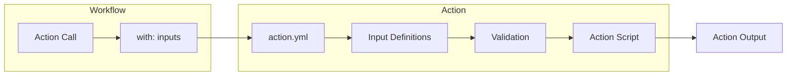
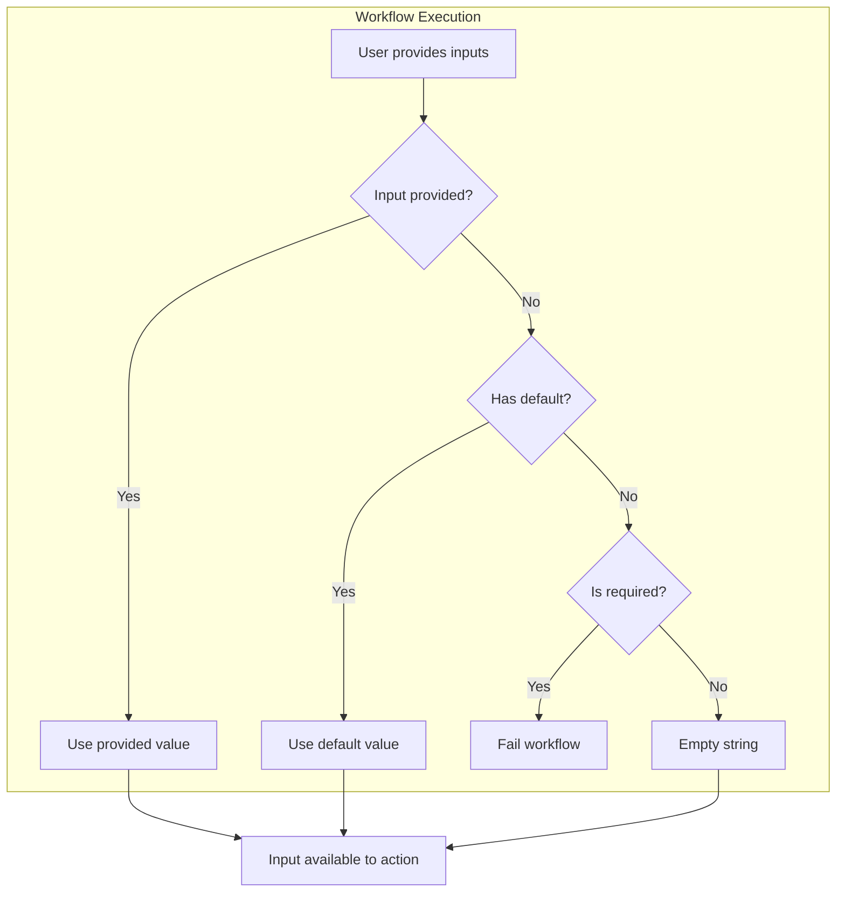
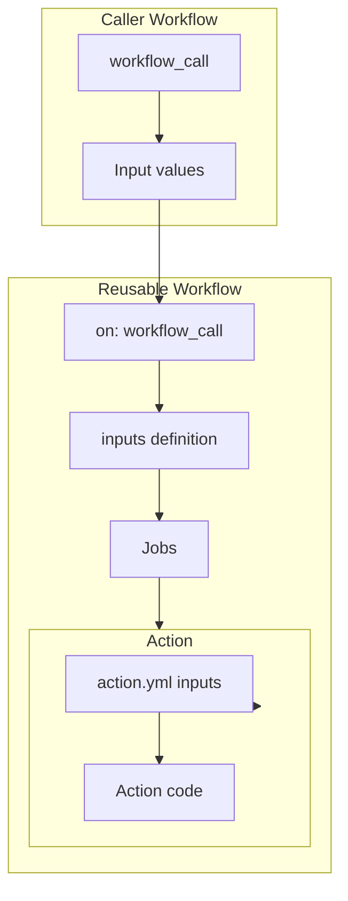

# How to Implement GitHub Actions Action Inputs

Author: [nawazdhandala](https://github.com/nawazdhandala)

Tags: GitHub Actions, CI/CD, Inputs, Automation

Description: Learn how to define, validate, and use inputs in custom GitHub Actions to create flexible and reusable automation workflows.

---

Custom GitHub Actions become powerful when they accept inputs. Inputs let users configure your action's behavior without modifying the source code. This guide covers everything from basic input definitions to advanced validation patterns.

## Understanding Action Inputs

Inputs are parameters that users pass to your action when they call it in a workflow. They work like function arguments, making your action configurable and reusable across different projects.



## Basic Input Definition in action.yml

Every custom action needs an `action.yml` file at its root. Here's how to define inputs:

```yaml
name: 'Deploy Application'
description: 'Deploys an application to the specified environment'
author: 'Your Team'

inputs:
  environment:
    description: 'Target deployment environment (staging, production)'
    required: true
  version:
    description: 'Application version to deploy'
    required: true
  dry-run:
    description: 'Run without making actual changes'
    required: false
    default: 'false'
  timeout:
    description: 'Deployment timeout in seconds'
    required: false
    default: '300'

runs:
  using: 'node20'
  main: 'dist/index.js'
```

### Input Properties

| Property | Purpose | Required |
|----------|---------|----------|
| description | Human-readable explanation of the input | Yes |
| required | Whether the input must be provided | No (defaults to false) |
| default | Value used when input is not provided | No |
| deprecationMessage | Warning shown when input is used | No |

## How Input Processing Works



## Using Inputs in Different Action Types

### JavaScript/TypeScript Actions

```javascript
// src/index.js
const core = require('@actions/core');

async function run() {
  try {
    // Get required inputs
    const environment = core.getInput('environment', { required: true });
    const version = core.getInput('version', { required: true });

    // Get optional inputs with defaults
    const dryRun = core.getInput('dry-run') === 'true';
    const timeout = parseInt(core.getInput('timeout'), 10);

    core.info(`Deploying version ${version} to ${environment}`);
    core.info(`Dry run: ${dryRun}, Timeout: ${timeout}s`);

    if (dryRun) {
      core.info('Dry run mode - no changes will be made');
      return;
    }

    // Perform deployment logic
    await deploy(environment, version, timeout);

    core.setOutput('deployed-version', version);
  } catch (error) {
    core.setFailed(`Action failed: ${error.message}`);
  }
}

run();
```

### Composite Actions

Composite actions pass inputs using the `${{ inputs.name }}` syntax:

```yaml
name: 'Build and Test'
description: 'Builds the project and runs tests'

inputs:
  node-version:
    description: 'Node.js version to use'
    required: false
    default: '20'
  working-directory:
    description: 'Directory containing package.json'
    required: false
    default: '.'
  skip-tests:
    description: 'Skip running tests'
    required: false
    default: 'false'

runs:
  using: 'composite'
  steps:
    - name: Setup Node.js
      uses: actions/setup-node@v4
      with:
        node-version: ${{ inputs.node-version }}

    - name: Install dependencies
      shell: bash
      working-directory: ${{ inputs.working-directory }}
      run: npm ci

    - name: Run tests
      if: inputs.skip-tests != 'true'
      shell: bash
      working-directory: ${{ inputs.working-directory }}
      run: npm test
```

### Docker Actions

Docker actions receive inputs as environment variables prefixed with `INPUT_`:

```yaml
# action.yml
name: 'Container Security Scan'
description: 'Scans container images for vulnerabilities'

inputs:
  image:
    description: 'Container image to scan'
    required: true
  severity:
    description: 'Minimum severity to report (LOW, MEDIUM, HIGH, CRITICAL)'
    required: false
    default: 'HIGH'
  fail-on-findings:
    description: 'Fail the action if vulnerabilities are found'
    required: false
    default: 'true'

runs:
  using: 'docker'
  image: 'Dockerfile'
```

```bash
#!/bin/bash
# entrypoint.sh

# Inputs are available as uppercase environment variables with INPUT_ prefix
IMAGE="${INPUT_IMAGE}"
SEVERITY="${INPUT_SEVERITY:-HIGH}"
FAIL_ON_FINDINGS="${INPUT_FAIL_ON_FINDINGS:-true}"

echo "Scanning image: ${IMAGE}"
echo "Minimum severity: ${SEVERITY}"

# Run your scanning logic
trivy image --severity "${SEVERITY}" "${IMAGE}"
SCAN_EXIT_CODE=$?

if [ "${FAIL_ON_FINDINGS}" = "true" ] && [ ${SCAN_EXIT_CODE} -ne 0 ]; then
  echo "::error::Vulnerabilities found in image"
  exit 1
fi
```

## Input Validation Strategies

### Validate in JavaScript Actions

```javascript
const core = require('@actions/core');

function validateInputs() {
  const errors = [];

  // Validate environment
  const environment = core.getInput('environment', { required: true });
  const validEnvironments = ['development', 'staging', 'production'];
  if (!validEnvironments.includes(environment)) {
    errors.push(`Invalid environment: ${environment}. Must be one of: ${validEnvironments.join(', ')}`);
  }

  // Validate version format (semver)
  const version = core.getInput('version', { required: true });
  const semverRegex = /^v?\d+\.\d+\.\d+(-[\w.]+)?(\+[\w.]+)?$/;
  if (!semverRegex.test(version)) {
    errors.push(`Invalid version format: ${version}. Expected semantic version (e.g., 1.2.3 or v1.2.3)`);
  }

  // Validate timeout range
  const timeout = parseInt(core.getInput('timeout'), 10);
  if (isNaN(timeout) || timeout < 30 || timeout > 3600) {
    errors.push(`Invalid timeout: ${timeout}. Must be between 30 and 3600 seconds`);
  }

  // Validate URL format
  const webhookUrl = core.getInput('webhook-url');
  if (webhookUrl) {
    try {
      new URL(webhookUrl);
    } catch {
      errors.push(`Invalid webhook URL: ${webhookUrl}`);
    }
  }

  if (errors.length > 0) {
    throw new Error(`Input validation failed:\n${errors.join('\n')}`);
  }

  return { environment, version, timeout, webhookUrl };
}
```

### Validate in Composite Actions

```yaml
name: 'Validated Deploy'
description: 'Deploy with input validation'

inputs:
  environment:
    description: 'Target environment'
    required: true
  replicas:
    description: 'Number of replicas (1-10)'
    required: false
    default: '2'

runs:
  using: 'composite'
  steps:
    - name: Validate environment
      shell: bash
      run: |
        VALID_ENVS="development staging production"
        if [[ ! " ${VALID_ENVS} " =~ " ${{ inputs.environment }} " ]]; then
          echo "::error::Invalid environment '${{ inputs.environment }}'. Must be one of: ${VALID_ENVS}"
          exit 1
        fi

    - name: Validate replicas
      shell: bash
      run: |
        REPLICAS="${{ inputs.replicas }}"
        if ! [[ "${REPLICAS}" =~ ^[0-9]+$ ]] || [ "${REPLICAS}" -lt 1 ] || [ "${REPLICAS}" -gt 10 ]; then
          echo "::error::Invalid replicas '${REPLICAS}'. Must be a number between 1 and 10"
          exit 1
        fi

    - name: Deploy
      shell: bash
      run: |
        echo "Deploying to ${{ inputs.environment }} with ${{ inputs.replicas }} replicas"
```

## Working with Complex Input Types

### Boolean Inputs

GitHub Actions treats all inputs as strings. Handle booleans carefully:

```javascript
// Correct way to handle boolean inputs
const dryRun = core.getInput('dry-run').toLowerCase() === 'true';

// Also handle common truthy values
function parseBoolean(input) {
  const value = input.toLowerCase().trim();
  return ['true', 'yes', '1', 'on'].includes(value);
}
```

### Array and Object Inputs

Pass complex data as JSON strings:

```yaml
# action.yml
inputs:
  labels:
    description: 'JSON array of labels to apply'
    required: false
    default: '[]'
  config:
    description: 'JSON configuration object'
    required: false
    default: '{}'
```

```javascript
// Parse JSON inputs
function parseJsonInput(name, defaultValue) {
  const input = core.getInput(name);
  if (!input) return defaultValue;

  try {
    return JSON.parse(input);
  } catch (error) {
    throw new Error(`Invalid JSON for input '${name}': ${error.message}`);
  }
}

const labels = parseJsonInput('labels', []);
const config = parseJsonInput('config', {});
```

Usage in workflow:

```yaml
- uses: your-org/your-action@v1
  with:
    labels: '["bug", "priority:high", "team:backend"]'
    config: |
      {
        "retries": 3,
        "timeout": 30,
        "features": ["cache", "logging"]
      }
```

### Multi-line Inputs

```yaml
# action.yml
inputs:
  script:
    description: 'Script to execute'
    required: true
  ignore-paths:
    description: 'Paths to ignore (one per line)'
    required: false
```

```javascript
// Handle multi-line input
const script = core.getInput('script');
const ignorePaths = core.getInput('ignore-paths')
  .split('\n')
  .map(line => line.trim())
  .filter(line => line.length > 0);
```

Usage:

```yaml
- uses: your-org/your-action@v1
  with:
    script: |
      echo "Starting deployment"
      npm run build
      npm run deploy
    ignore-paths: |
      node_modules
      .git
      dist
```

## Deprecating Inputs

When evolving your action, deprecate old inputs gracefully:

```yaml
inputs:
  server-url:
    description: 'Server URL for deployment'
    required: false
  # Deprecated - use server-url instead
  url:
    description: 'DEPRECATED: Use server-url instead'
    required: false
    deprecationMessage: 'The url input is deprecated. Use server-url instead.'
```

Handle deprecated inputs in code:

```javascript
function getServerUrl() {
  const serverUrl = core.getInput('server-url');
  const deprecatedUrl = core.getInput('url');

  if (deprecatedUrl && !serverUrl) {
    core.warning('The "url" input is deprecated and will be removed in v3. Use "server-url" instead.');
    return deprecatedUrl;
  }

  return serverUrl;
}
```

## Input Flow in Reusable Workflows



### Reusable Workflow with Inputs

```yaml
# .github/workflows/deploy-reusable.yml
name: Reusable Deploy

on:
  workflow_call:
    inputs:
      environment:
        description: 'Deployment environment'
        required: true
        type: string
      version:
        description: 'Version to deploy'
        required: true
        type: string
      notify:
        description: 'Send notifications'
        required: false
        type: boolean
        default: true

jobs:
  deploy:
    runs-on: ubuntu-latest
    environment: ${{ inputs.environment }}
    steps:
      - uses: actions/checkout@v4

      - name: Deploy
        uses: your-org/deploy-action@v1
        with:
          environment: ${{ inputs.environment }}
          version: ${{ inputs.version }}

      - name: Notify
        if: inputs.notify
        run: echo "Deployment complete"
```

## Complete Action Example

Here's a full example of a well-structured action with comprehensive input handling:

```yaml
# action.yml
name: 'Application Deployer'
description: 'Deploys applications with validation, rollback support, and notifications'
author: 'Your Team'

branding:
  icon: 'upload-cloud'
  color: 'blue'

inputs:
  # Required inputs
  environment:
    description: 'Target environment (development, staging, production)'
    required: true
  version:
    description: 'Application version (semver format)'
    required: true

  # Optional inputs with defaults
  replicas:
    description: 'Number of replicas to deploy'
    required: false
    default: '2'
  health-check-path:
    description: 'Path for health check endpoint'
    required: false
    default: '/health'
  timeout:
    description: 'Deployment timeout in seconds'
    required: false
    default: '300'

  # Feature flags
  dry-run:
    description: 'Simulate deployment without making changes'
    required: false
    default: 'false'
  enable-rollback:
    description: 'Automatically rollback on failure'
    required: false
    default: 'true'
  skip-health-check:
    description: 'Skip post-deployment health check'
    required: false
    default: 'false'

  # Notification settings
  slack-webhook:
    description: 'Slack webhook URL for notifications'
    required: false
  notify-on-success:
    description: 'Send notification on successful deployment'
    required: false
    default: 'true'
  notify-on-failure:
    description: 'Send notification on failed deployment'
    required: false
    default: 'true'

  # Advanced configuration
  extra-args:
    description: 'Additional arguments as JSON object'
    required: false
    default: '{}'

outputs:
  deployment-id:
    description: 'Unique identifier for this deployment'
  deployment-url:
    description: 'URL of the deployed application'
  duration:
    description: 'Deployment duration in seconds'

runs:
  using: 'node20'
  main: 'dist/index.js'
```

```javascript
// src/index.js
const core = require('@actions/core');
const { v4: uuidv4 } = require('uuid');

const VALID_ENVIRONMENTS = ['development', 'staging', 'production'];
const SEMVER_REGEX = /^v?\d+\.\d+\.\d+(-[\w.]+)?(\+[\w.]+)?$/;

function parseBoolean(value) {
  return ['true', 'yes', '1', 'on'].includes(value.toLowerCase().trim());
}

function parseJson(input, defaultValue) {
  if (!input) return defaultValue;
  try {
    return JSON.parse(input);
  } catch (error) {
    throw new Error(`Invalid JSON: ${error.message}`);
  }
}

function validateInputs() {
  const errors = [];

  // Required inputs
  const environment = core.getInput('environment', { required: true });
  const version = core.getInput('version', { required: true });

  // Validate environment
  if (!VALID_ENVIRONMENTS.includes(environment)) {
    errors.push(`Invalid environment '${environment}'. Must be: ${VALID_ENVIRONMENTS.join(', ')}`);
  }

  // Validate version
  if (!SEMVER_REGEX.test(version)) {
    errors.push(`Invalid version '${version}'. Must be semver format (e.g., 1.2.3)`);
  }

  // Validate replicas
  const replicasStr = core.getInput('replicas');
  const replicas = parseInt(replicasStr, 10);
  if (isNaN(replicas) || replicas < 1 || replicas > 100) {
    errors.push(`Invalid replicas '${replicasStr}'. Must be 1-100`);
  }

  // Validate timeout
  const timeoutStr = core.getInput('timeout');
  const timeout = parseInt(timeoutStr, 10);
  if (isNaN(timeout) || timeout < 30 || timeout > 3600) {
    errors.push(`Invalid timeout '${timeoutStr}'. Must be 30-3600 seconds`);
  }

  // Validate Slack webhook URL if provided
  const slackWebhook = core.getInput('slack-webhook');
  if (slackWebhook) {
    try {
      const url = new URL(slackWebhook);
      if (!url.hostname.includes('slack.com')) {
        errors.push('Slack webhook must be a valid Slack URL');
      }
    } catch {
      errors.push(`Invalid Slack webhook URL: ${slackWebhook}`);
    }
  }

  // Validate extra-args JSON
  const extraArgsStr = core.getInput('extra-args');
  let extraArgs = {};
  try {
    extraArgs = parseJson(extraArgsStr, {});
  } catch (error) {
    errors.push(`Invalid extra-args: ${error.message}`);
  }

  if (errors.length > 0) {
    throw new Error(`Input validation failed:\n- ${errors.join('\n- ')}`);
  }

  return {
    environment,
    version,
    replicas,
    healthCheckPath: core.getInput('health-check-path'),
    timeout,
    dryRun: parseBoolean(core.getInput('dry-run')),
    enableRollback: parseBoolean(core.getInput('enable-rollback')),
    skipHealthCheck: parseBoolean(core.getInput('skip-health-check')),
    slackWebhook,
    notifyOnSuccess: parseBoolean(core.getInput('notify-on-success')),
    notifyOnFailure: parseBoolean(core.getInput('notify-on-failure')),
    extraArgs,
  };
}

async function run() {
  const startTime = Date.now();
  const deploymentId = uuidv4();

  try {
    core.info('Validating inputs...');
    const inputs = validateInputs();

    core.info(`Deployment ID: ${deploymentId}`);
    core.info(`Environment: ${inputs.environment}`);
    core.info(`Version: ${inputs.version}`);
    core.info(`Replicas: ${inputs.replicas}`);
    core.info(`Dry run: ${inputs.dryRun}`);

    if (inputs.dryRun) {
      core.info('Dry run mode enabled - no changes will be made');
      core.setOutput('deployment-id', deploymentId);
      core.setOutput('deployment-url', `https://${inputs.environment}.example.com`);
      core.setOutput('duration', Math.round((Date.now() - startTime) / 1000));
      return;
    }

    // Perform deployment logic here
    await performDeployment(inputs);

    // Set outputs
    const duration = Math.round((Date.now() - startTime) / 1000);
    core.setOutput('deployment-id', deploymentId);
    core.setOutput('deployment-url', `https://${inputs.environment}.example.com`);
    core.setOutput('duration', duration);

    core.info(`Deployment completed in ${duration} seconds`);

  } catch (error) {
    const duration = Math.round((Date.now() - startTime) / 1000);
    core.setOutput('deployment-id', deploymentId);
    core.setOutput('duration', duration);
    core.setFailed(`Deployment failed: ${error.message}`);
  }
}

async function performDeployment(inputs) {
  // Your deployment logic here
  core.info('Deploying application...');
}

run();
```

## Usage in Workflows

```yaml
name: Deploy Application

on:
  push:
    branches: [main]
  workflow_dispatch:
    inputs:
      environment:
        description: 'Target environment'
        required: true
        type: choice
        options:
          - development
          - staging
          - production

jobs:
  deploy:
    runs-on: ubuntu-latest
    steps:
      - uses: actions/checkout@v4

      - name: Deploy to environment
        uses: your-org/application-deployer@v1
        with:
          environment: ${{ github.event.inputs.environment || 'development' }}
          version: ${{ github.sha }}
          replicas: 3
          timeout: 600
          enable-rollback: true
          slack-webhook: ${{ secrets.SLACK_WEBHOOK }}
          extra-args: |
            {
              "feature-flags": ["new-ui", "dark-mode"],
              "region": "us-east-1"
            }
```

## Best Practices

1. **Always provide descriptions** - Clear descriptions help users understand what each input does
2. **Set sensible defaults** - Make your action work out of the box when possible
3. **Validate early** - Check inputs at the start of your action to fail fast
4. **Use clear naming** - Input names should be self-documenting (`deployment-timeout` not `dt`)
5. **Document constraints** - Mention valid values, ranges, and formats in descriptions
6. **Handle missing inputs gracefully** - Use defaults and provide helpful error messages
7. **Mask sensitive inputs** - Use `core.setSecret()` for tokens and credentials
8. **Deprecate, dont remove** - Use `deprecationMessage` when renaming or removing inputs

---

Well-designed inputs make your GitHub Actions flexible and user-friendly. Start with required inputs only, add optional ones as your action matures, and always validate inputs before using them. Clear documentation in your action.yml helps users understand how to configure your action correctly.
