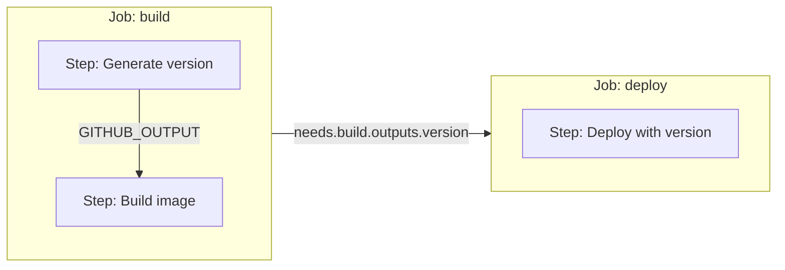
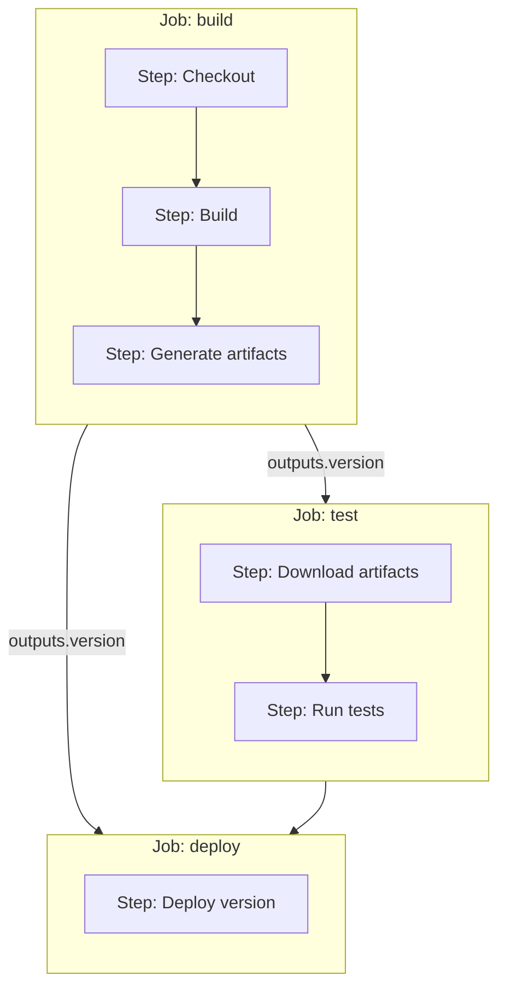
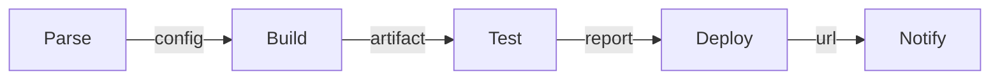

# How to Create GitHub Actions Action Outputs

Author: [nawazdhandala](https://github.com/nawazdhandala)

Tags: GitHub Actions, CI/CD, Outputs, Automation

Description: Learn how to define, set, and consume outputs in GitHub Actions to pass data between steps, jobs, and reusable workflows.

---

Outputs are how GitHub Actions steps and jobs communicate. A build step can export a version string, and downstream steps or jobs can consume it. Here's everything you need to wire up outputs correctly.

## How Outputs Flow Through a Workflow



Outputs move in two directions:
1. **Between steps** within the same job using `GITHUB_OUTPUT`
2. **Between jobs** using the `outputs` block and `needs` context

## Setting Outputs in a Step

The modern way to set outputs uses the `GITHUB_OUTPUT` environment file. The old `set-output` command is deprecated.

### Basic Output

```yaml
jobs:
  build:
    runs-on: ubuntu-latest
    steps:
      - name: Generate version
        id: version  # Required to reference this step's outputs
        run: |
          VERSION="1.0.${{ github.run_number }}"
          echo "version=$VERSION" >> "$GITHUB_OUTPUT"

      - name: Use version
        run: |
          echo "Building version: ${{ steps.version.outputs.version }}"
```

Key points:
- The step needs an `id` to be referenced
- Write to `$GITHUB_OUTPUT` using `name=value` format
- Access with `${{ steps.<step-id>.outputs.<name> }}`

### Multiple Outputs

```yaml
      - name: Extract metadata
        id: meta
        run: |
          echo "sha_short=$(git rev-parse --short HEAD)" >> "$GITHUB_OUTPUT"
          echo "branch=$(echo ${GITHUB_REF#refs/heads/})" >> "$GITHUB_OUTPUT"
          echo "timestamp=$(date -u +%Y%m%d%H%M%S)" >> "$GITHUB_OUTPUT"
```

### Multiline Outputs

For values spanning multiple lines, use a delimiter:

```yaml
      - name: Get changelog
        id: changelog
        run: |
          CHANGELOG=$(git log --oneline -5)
          {
            echo "changelog<<EOF"
            echo "$CHANGELOG"
            echo "EOF"
          } >> "$GITHUB_OUTPUT"
```

The pattern is:
```
name<<DELIMITER
content
DELIMITER
```

## Defining Outputs in action.yml

When building a custom action, declare outputs in your `action.yml`:

### Composite Action Example

```yaml
# action.yml
name: 'Build and Tag'
description: 'Builds the project and outputs version info'

inputs:
  prefix:
    description: 'Version prefix'
    required: false
    default: 'v'

outputs:
  version:
    description: 'The generated version string'
    value: ${{ steps.generate.outputs.version }}
  image_tag:
    description: 'Full image tag for the build'
    value: ${{ steps.generate.outputs.image_tag }}

runs:
  using: 'composite'
  steps:
    - name: Generate version info
      id: generate
      shell: bash
      run: |
        VERSION="${{ inputs.prefix }}1.0.${{ github.run_number }}"
        echo "version=$VERSION" >> "$GITHUB_OUTPUT"
        echo "image_tag=myapp:$VERSION" >> "$GITHUB_OUTPUT"
```

### JavaScript Action Example

```yaml
# action.yml
name: 'Parse Config'
description: 'Parses configuration and outputs values'

outputs:
  environment:
    description: 'Target environment'
  replicas:
    description: 'Number of replicas'

runs:
  using: 'node20'
  main: 'index.js'
```

In your JavaScript action:

```javascript
// index.js
const core = require('@actions/core');

async function run() {
  const config = JSON.parse(process.env.CONFIG || '{}');

  core.setOutput('environment', config.env || 'development');
  core.setOutput('replicas', config.replicas || 1);
}

run();
```

### Docker Action Example

```yaml
# action.yml
name: 'Security Scan'
description: 'Scans for vulnerabilities'

outputs:
  vulnerabilities:
    description: 'Number of vulnerabilities found'
  report_path:
    description: 'Path to the scan report'

runs:
  using: 'docker'
  image: 'Dockerfile'
```

In your Docker entrypoint script:

```bash
#!/bin/bash
# entrypoint.sh

VULN_COUNT=$(run-scanner --count-only)
REPORT="/tmp/scan-report.json"
run-scanner --output "$REPORT"

echo "vulnerabilities=$VULN_COUNT" >> "$GITHUB_OUTPUT"
echo "report_path=$REPORT" >> "$GITHUB_OUTPUT"
```

## Passing Outputs Between Jobs

Jobs run on separate runners. To share data, explicitly declare job outputs.



### Job Output Declaration

```yaml
jobs:
  build:
    runs-on: ubuntu-latest
    outputs:
      version: ${{ steps.version.outputs.version }}
      artifact_name: ${{ steps.version.outputs.artifact_name }}
    steps:
      - name: Generate version
        id: version
        run: |
          VERSION="1.0.${{ github.run_number }}"
          echo "version=$VERSION" >> "$GITHUB_OUTPUT"
          echo "artifact_name=myapp-$VERSION" >> "$GITHUB_OUTPUT"

      - name: Build
        run: ./build.sh

  test:
    needs: build
    runs-on: ubuntu-latest
    steps:
      - name: Run tests
        run: |
          echo "Testing version: ${{ needs.build.outputs.version }}"

  deploy:
    needs: [build, test]
    runs-on: ubuntu-latest
    steps:
      - name: Deploy
        run: |
          echo "Deploying ${{ needs.build.outputs.artifact_name }}"
```

### Matrix Job Outputs

When using a matrix strategy, outputs from the last completed job in the matrix are used:

```yaml
jobs:
  build:
    runs-on: ubuntu-latest
    strategy:
      matrix:
        platform: [linux, windows, macos]
    outputs:
      # This captures output from one matrix job (non-deterministic)
      version: ${{ steps.version.outputs.version }}
    steps:
      - id: version
        run: echo "version=1.0.0" >> "$GITHUB_OUTPUT"
```

For reliable matrix outputs, use artifacts or a separate aggregation job.

## Reusable Workflow Outputs

Reusable workflows can expose outputs to calling workflows.

### Reusable Workflow Definition

```yaml
# .github/workflows/build-reusable.yml
name: Reusable Build

on:
  workflow_call:
    inputs:
      environment:
        required: true
        type: string
    outputs:
      version:
        description: 'Built version'
        value: ${{ jobs.build.outputs.version }}
      image:
        description: 'Docker image reference'
        value: ${{ jobs.build.outputs.image }}

jobs:
  build:
    runs-on: ubuntu-latest
    outputs:
      version: ${{ steps.build.outputs.version }}
      image: ${{ steps.build.outputs.image }}
    steps:
      - name: Build
        id: build
        run: |
          VERSION="1.0.${{ github.run_number }}"
          IMAGE="ghcr.io/myorg/myapp:$VERSION"
          echo "version=$VERSION" >> "$GITHUB_OUTPUT"
          echo "image=$IMAGE" >> "$GITHUB_OUTPUT"
```

### Calling Workflow

```yaml
# .github/workflows/deploy.yml
name: Deploy

on:
  push:
    branches: [main]

jobs:
  build:
    uses: ./.github/workflows/build-reusable.yml
    with:
      environment: production

  deploy:
    needs: build
    runs-on: ubuntu-latest
    steps:
      - name: Deploy image
        run: |
          echo "Deploying ${{ needs.build.outputs.image }}"
          kubectl set image deployment/myapp app=${{ needs.build.outputs.image }}
```

## Output Chaining Patterns

### Sequential Processing Pipeline



```yaml
jobs:
  parse:
    runs-on: ubuntu-latest
    outputs:
      config: ${{ steps.parse.outputs.config }}
    steps:
      - id: parse
        run: |
          CONFIG=$(cat config.json | jq -c .)
          echo "config=$CONFIG" >> "$GITHUB_OUTPUT"

  build:
    needs: parse
    runs-on: ubuntu-latest
    outputs:
      artifact: ${{ steps.build.outputs.artifact }}
    steps:
      - id: build
        run: |
          CONFIG='${{ needs.parse.outputs.config }}'
          ARTIFACT="build-${{ github.sha }}.tar.gz"
          echo "artifact=$ARTIFACT" >> "$GITHUB_OUTPUT"

  test:
    needs: build
    runs-on: ubuntu-latest
    outputs:
      passed: ${{ steps.test.outputs.passed }}
    steps:
      - id: test
        run: |
          echo "passed=true" >> "$GITHUB_OUTPUT"

  deploy:
    needs: [build, test]
    if: needs.test.outputs.passed == 'true'
    runs-on: ubuntu-latest
    outputs:
      url: ${{ steps.deploy.outputs.url }}
    steps:
      - id: deploy
        run: |
          echo "url=https://app.example.com" >> "$GITHUB_OUTPUT"
```

### Conditional Job Based on Output

```yaml
jobs:
  check:
    runs-on: ubuntu-latest
    outputs:
      should_deploy: ${{ steps.check.outputs.should_deploy }}
    steps:
      - id: check
        run: |
          if [[ "${{ github.ref }}" == "refs/heads/main" ]]; then
            echo "should_deploy=true" >> "$GITHUB_OUTPUT"
          else
            echo "should_deploy=false" >> "$GITHUB_OUTPUT"
          fi

  deploy:
    needs: check
    if: needs.check.outputs.should_deploy == 'true'
    runs-on: ubuntu-latest
    steps:
      - run: echo "Deploying..."
```

## Common Patterns and Examples

### Version Extraction from Package Files

```yaml
      - name: Extract version from package.json
        id: package
        run: |
          VERSION=$(jq -r .version package.json)
          echo "version=$VERSION" >> "$GITHUB_OUTPUT"
```

### Git-Based Version Generation

```yaml
      - name: Generate version from git
        id: git_version
        run: |
          TAG=$(git describe --tags --always --dirty 2>/dev/null || echo "0.0.0")
          SHA=$(git rev-parse --short HEAD)
          BRANCH=${GITHUB_REF#refs/heads/}
          echo "tag=$TAG" >> "$GITHUB_OUTPUT"
          echo "sha=$SHA" >> "$GITHUB_OUTPUT"
          echo "branch=$BRANCH" >> "$GITHUB_OUTPUT"
```

### Changed Files Detection

```yaml
      - name: Detect changes
        id: changes
        run: |
          if git diff --name-only HEAD~1 | grep -q "^src/"; then
            echo "src_changed=true" >> "$GITHUB_OUTPUT"
          else
            echo "src_changed=false" >> "$GITHUB_OUTPUT"
          fi

          if git diff --name-only HEAD~1 | grep -q "^docs/"; then
            echo "docs_changed=true" >> "$GITHUB_OUTPUT"
          else
            echo "docs_changed=false" >> "$GITHUB_OUTPUT"
          fi
```

### JSON Output for Complex Data

```yaml
      - name: Generate build metadata
        id: metadata
        run: |
          METADATA=$(jq -n \
            --arg sha "${{ github.sha }}" \
            --arg ref "${{ github.ref }}" \
            --arg run "${{ github.run_number }}" \
            '{sha: $sha, ref: $ref, run: $run}')
          echo "metadata=$METADATA" >> "$GITHUB_OUTPUT"

      - name: Use metadata
        run: |
          echo '${{ steps.metadata.outputs.metadata }}' | jq .
```

## Debugging Outputs

### Print All Step Outputs

```yaml
      - name: Debug outputs
        run: |
          echo "Version: ${{ steps.version.outputs.version }}"
          echo "All outputs: ${{ toJSON(steps.version.outputs) }}"
```

### Validate Output Was Set

```yaml
      - name: Validate required output
        run: |
          if [[ -z "${{ steps.build.outputs.artifact }}" ]]; then
            echo "Error: artifact output not set"
            exit 1
          fi
```

## Best Practices

1. **Always set an id** on steps that produce outputs you need to reference
2. **Use descriptive output names** that indicate what data they contain
3. **Quote values** when writing to `GITHUB_OUTPUT` if they might contain special characters
4. **Validate outputs** before using them in critical steps
5. **Document outputs** in your action.yml with clear descriptions
6. **Use JSON** for complex structured data that needs to preserve formatting
7. **Keep outputs small** since there are size limits (1MB per output)

---

Outputs connect the stages of your CI/CD pipeline. Start with step outputs within a job, then expand to job outputs when you need to share data across runners. For complex pipelines, reusable workflows with declared outputs keep your configuration maintainable.
