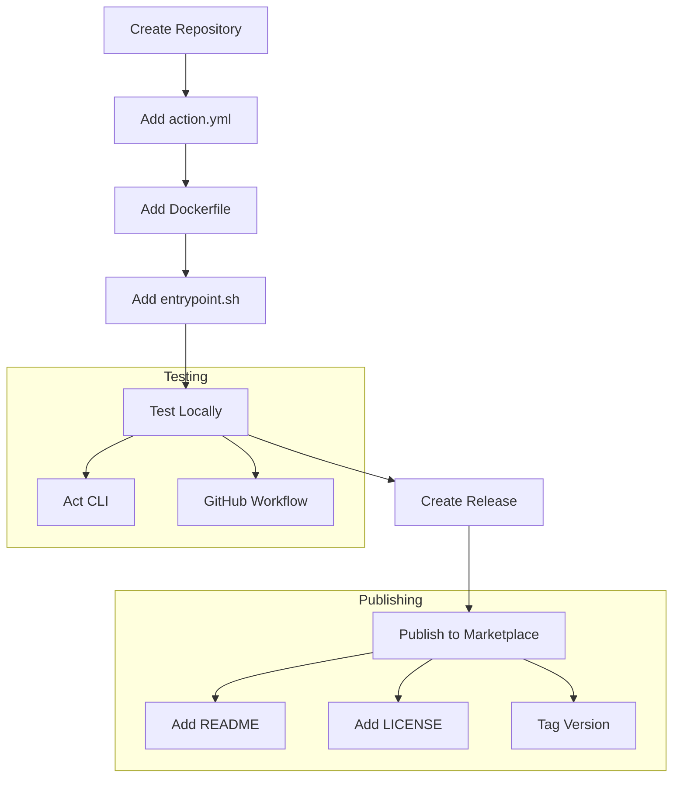

# How to Implement GitHub Actions Container Actions

Author: [nawazdhandala](https://www.github.com/nawazdhandala)

Tags: GitHub Actions, CI/CD, Docker, DevOps, Automation

Description: Learn how to build custom GitHub Actions using Docker containers, enabling you to package complex logic, dependencies, and tools into reusable workflow steps.

---

Container actions let you bundle any language, runtime, or toolchain into a single GitHub Action. Unlike JavaScript actions that run directly on the runner, container actions execute inside Docker, giving you complete control over the environment.

## Why Use Container Actions?

```mermaid
flowchart LR
    subgraph JavaScript Action
        JS[Node.js Runtime]
        JSCode[Action Code]
        JS --> JSCode
    end

    subgraph Container Action
        Docker[Docker Container]
        Any[Any Language/Tool]
        Deps[All Dependencies]
        Docker --> Any
        Docker --> Deps
    end

    Runner[GitHub Runner] --> JavaScript Action
    Runner --> Container Action
```

| Use Case | JavaScript Action | Container Action |
|----------|------------------|------------------|
| Simple automation | Best choice | Overkill |
| Complex dependencies | Difficult | Easy |
| Non-Node.js languages | Not possible | Full support |
| System-level tools | Limited | Full access |
| Reproducible builds | Runner-dependent | Fully isolated |
| Cold start time | Fast | Slower (image pull) |

## Anatomy of a Container Action

A container action requires three files:

```
my-action/
  action.yml      # Action metadata
  Dockerfile      # Container definition
  entrypoint.sh   # Script that runs inside the container
```

### The Action Metadata File

The action.yml file defines inputs, outputs, and tells GitHub to run this action in a container.

```yaml
# action.yml - Defines the action interface and runtime
name: 'Database Migration Action'
description: 'Runs database migrations using Flyway'
author: 'Your Name'

# Define inputs that users can pass to this action
inputs:
  database-url:
    description: 'Database connection URL'
    required: true
  migration-path:
    description: 'Path to migration files'
    required: false
    default: 'db/migrations'
  dry-run:
    description: 'Preview migrations without applying'
    required: false
    default: 'false'

# Define outputs that other steps can use
outputs:
  applied-count:
    description: 'Number of migrations applied'
  current-version:
    description: 'Current schema version after migration'

# Specify that this action runs in a Docker container
runs:
  using: 'docker'
  image: 'Dockerfile'
  args:
    - ${{ inputs.database-url }}
    - ${{ inputs.migration-path }}
    - ${{ inputs.dry-run }}
```

### The Dockerfile

The Dockerfile sets up your execution environment with all necessary tools and dependencies.

```dockerfile
# Dockerfile - Container environment for the action
# Use a specific version for reproducible builds
FROM flyway/flyway:10.0

# Install additional tools needed by the action
RUN apt-get update && apt-get install -y \
    jq \
    curl \
    && rm -rf /var/lib/apt/lists/*

# Copy the entrypoint script into the container
COPY entrypoint.sh /entrypoint.sh

# Make the script executable
RUN chmod +x /entrypoint.sh

# Set the entrypoint - this runs when the container starts
ENTRYPOINT ["/entrypoint.sh"]
```

### The Entrypoint Script

The entrypoint script receives inputs as arguments and performs the actual work.

```bash
#!/bin/bash
# entrypoint.sh - Main logic for the action
set -e  # Exit immediately if a command fails

# Arguments passed from action.yml
DATABASE_URL="$1"
MIGRATION_PATH="$2"
DRY_RUN="$3"

echo "Starting database migration..."
echo "Migration path: $MIGRATION_PATH"

# Build the Flyway command based on inputs
FLYWAY_CMD="flyway -url=$DATABASE_URL -locations=filesystem:$MIGRATION_PATH"

if [ "$DRY_RUN" = "true" ]; then
    echo "Running in dry-run mode (info only)"
    $FLYWAY_CMD info
else
    echo "Applying migrations..."
    $FLYWAY_CMD migrate
fi

# Get current version and count of applied migrations
VERSION=$($FLYWAY_CMD info -outputType=json | jq -r '.schemaVersion')
COUNT=$($FLYWAY_CMD info -outputType=json | jq '[.migrations[] | select(.state == "Success")] | length')

# Set outputs using the GITHUB_OUTPUT environment file
# Other workflow steps can access these values
echo "applied-count=$COUNT" >> $GITHUB_OUTPUT
echo "current-version=$VERSION" >> $GITHUB_OUTPUT

echo "Migration complete. Version: $VERSION, Applied: $COUNT"
```

## Building a Real-World Container Action

Let us build a container action that performs security scanning on container images.

### Project Structure

```
security-scan-action/
  action.yml
  Dockerfile
  entrypoint.sh
  scripts/
    parse-results.py
```

### Action Definition

This action wraps Trivy scanner with custom reporting and threshold enforcement.

```yaml
# action.yml - Security scanning action configuration
name: 'Container Security Scan'
description: 'Scans container images for vulnerabilities using Trivy'
author: 'Security Team'

branding:
  icon: 'shield'
  color: 'blue'

inputs:
  image:
    description: 'Container image to scan (e.g., nginx:latest)'
    required: true
  severity:
    description: 'Minimum severity to report (CRITICAL, HIGH, MEDIUM, LOW)'
    required: false
    default: 'HIGH,CRITICAL'
  fail-on:
    description: 'Fail the action if vulnerabilities of this severity are found'
    required: false
    default: 'CRITICAL'
  ignore-unfixed:
    description: 'Ignore vulnerabilities without available fixes'
    required: false
    default: 'false'
  output-format:
    description: 'Output format (table, json, sarif)'
    required: false
    default: 'table'

outputs:
  vulnerability-count:
    description: 'Total number of vulnerabilities found'
  critical-count:
    description: 'Number of critical vulnerabilities'
  high-count:
    description: 'Number of high severity vulnerabilities'
  report-path:
    description: 'Path to the detailed scan report'

runs:
  using: 'docker'
  image: 'Dockerfile'
  env:
    # Pass inputs as environment variables for easier handling
    INPUT_IMAGE: ${{ inputs.image }}
    INPUT_SEVERITY: ${{ inputs.severity }}
    INPUT_FAIL_ON: ${{ inputs.fail-on }}
    INPUT_IGNORE_UNFIXED: ${{ inputs.ignore-unfixed }}
    INPUT_OUTPUT_FORMAT: ${{ inputs.output-format }}
```

### Dockerfile with Multi-Stage Build

Using a multi-stage build keeps the final image small while including all necessary tools.

```dockerfile
# Dockerfile - Security scanning container
# Stage 1: Download and verify Trivy binary
FROM alpine:3.19 AS downloader

RUN apk add --no-cache curl

# Download Trivy with version pinning for reproducibility
ARG TRIVY_VERSION=0.49.0
RUN curl -sfL https://raw.githubusercontent.com/aquasecurity/trivy/main/contrib/install.sh | \
    sh -s -- -b /usr/local/bin v${TRIVY_VERSION}

# Stage 2: Build the final action image
FROM python:3.12-slim

# Install required packages
RUN apt-get update && apt-get install -y --no-install-recommends \
    ca-certificates \
    git \
    jq \
    && rm -rf /var/lib/apt/lists/*

# Copy Trivy from the downloader stage
COPY --from=downloader /usr/local/bin/trivy /usr/local/bin/trivy

# Install Python dependencies for report parsing
RUN pip install --no-cache-dir pandas tabulate

# Copy action scripts
COPY entrypoint.sh /entrypoint.sh
COPY scripts/ /scripts/

RUN chmod +x /entrypoint.sh

# Pre-download vulnerability database to speed up scans
# This creates a cached DB in the image
RUN trivy image --download-db-only

ENTRYPOINT ["/entrypoint.sh"]
```

### Entrypoint with Comprehensive Error Handling

```bash
#!/bin/bash
# entrypoint.sh - Security scanning entrypoint with error handling
set -euo pipefail

# Color codes for output formatting
RED='\033[0;31m'
YELLOW='\033[1;33m'
GREEN='\033[0;32m'
NC='\033[0m' # No Color

# Function to print colored status messages
log_info() { echo -e "${GREEN}[INFO]${NC} $1"; }
log_warn() { echo -e "${YELLOW}[WARN]${NC} $1"; }
log_error() { echo -e "${RED}[ERROR]${NC} $1"; }

# Validate required inputs
if [ -z "${INPUT_IMAGE:-}" ]; then
    log_error "Image input is required"
    exit 1
fi

log_info "Scanning image: $INPUT_IMAGE"
log_info "Severity filter: $INPUT_SEVERITY"
log_info "Fail on: $INPUT_FAIL_ON"

# Create output directory for reports
REPORT_DIR="${GITHUB_WORKSPACE}/security-reports"
mkdir -p "$REPORT_DIR"

# Build Trivy command with all options
TRIVY_CMD="trivy image"
TRIVY_CMD="$TRIVY_CMD --severity $INPUT_SEVERITY"
TRIVY_CMD="$TRIVY_CMD --format json"
TRIVY_CMD="$TRIVY_CMD --output $REPORT_DIR/scan-results.json"

# Add optional flags based on inputs
if [ "$INPUT_IGNORE_UNFIXED" = "true" ]; then
    TRIVY_CMD="$TRIVY_CMD --ignore-unfixed"
fi

# Run the scan (do not fail on vulnerabilities yet)
log_info "Running security scan..."
set +e
$TRIVY_CMD "$INPUT_IMAGE"
SCAN_EXIT_CODE=$?
set -e

# Handle scan failures (not vulnerability findings)
if [ $SCAN_EXIT_CODE -ne 0 ] && [ $SCAN_EXIT_CODE -ne 1 ]; then
    log_error "Trivy scan failed with exit code $SCAN_EXIT_CODE"
    exit $SCAN_EXIT_CODE
fi

# Parse results using Python script for detailed analysis
log_info "Parsing scan results..."
python3 /scripts/parse-results.py "$REPORT_DIR/scan-results.json" > "$REPORT_DIR/summary.txt"

# Extract vulnerability counts from JSON
CRITICAL_COUNT=$(jq '[.Results[]?.Vulnerabilities[]? | select(.Severity == "CRITICAL")] | length' "$REPORT_DIR/scan-results.json")
HIGH_COUNT=$(jq '[.Results[]?.Vulnerabilities[]? | select(.Severity == "HIGH")] | length' "$REPORT_DIR/scan-results.json")
MEDIUM_COUNT=$(jq '[.Results[]?.Vulnerabilities[]? | select(.Severity == "MEDIUM")] | length' "$REPORT_DIR/scan-results.json")
TOTAL_COUNT=$(jq '[.Results[]?.Vulnerabilities[]?] | length' "$REPORT_DIR/scan-results.json")

# Set outputs for use in subsequent workflow steps
echo "vulnerability-count=$TOTAL_COUNT" >> $GITHUB_OUTPUT
echo "critical-count=$CRITICAL_COUNT" >> $GITHUB_OUTPUT
echo "high-count=$HIGH_COUNT" >> $GITHUB_OUTPUT
echo "report-path=$REPORT_DIR/scan-results.json" >> $GITHUB_OUTPUT

# Print summary
log_info "Scan complete. Found $TOTAL_COUNT vulnerabilities."
log_info "  Critical: $CRITICAL_COUNT"
log_info "  High: $HIGH_COUNT"
log_info "  Medium: $MEDIUM_COUNT"

# Generate human-readable report based on output format
if [ "$INPUT_OUTPUT_FORMAT" = "table" ]; then
    trivy image --severity "$INPUT_SEVERITY" --format table "$INPUT_IMAGE" || true
elif [ "$INPUT_OUTPUT_FORMAT" = "sarif" ]; then
    trivy image --severity "$INPUT_SEVERITY" --format sarif --output "$REPORT_DIR/results.sarif" "$INPUT_IMAGE" || true
    log_info "SARIF report saved to $REPORT_DIR/results.sarif"
fi

# Determine if action should fail based on fail-on threshold
SHOULD_FAIL=false

if [[ "$INPUT_FAIL_ON" == *"CRITICAL"* ]] && [ "$CRITICAL_COUNT" -gt 0 ]; then
    log_error "Found $CRITICAL_COUNT critical vulnerabilities"
    SHOULD_FAIL=true
fi

if [[ "$INPUT_FAIL_ON" == *"HIGH"* ]] && [ "$HIGH_COUNT" -gt 0 ]; then
    log_error "Found $HIGH_COUNT high severity vulnerabilities"
    SHOULD_FAIL=true
fi

if [ "$SHOULD_FAIL" = true ]; then
    log_error "Failing action due to vulnerability threshold breach"
    exit 1
fi

log_info "Security scan passed"
```

### Python Script for Result Parsing

```python
#!/usr/bin/env python3
# scripts/parse-results.py - Parse Trivy JSON output into readable format
import json
import sys
from collections import defaultdict

def parse_results(json_path):
    """Parse Trivy JSON results and generate summary."""
    with open(json_path, 'r') as f:
        data = json.load(f)

    # Aggregate vulnerabilities by severity
    by_severity = defaultdict(list)
    by_package = defaultdict(list)

    for result in data.get('Results', []):
        target = result.get('Target', 'unknown')
        for vuln in result.get('Vulnerabilities', []):
            severity = vuln.get('Severity', 'UNKNOWN')
            by_severity[severity].append({
                'id': vuln.get('VulnerabilityID'),
                'package': vuln.get('PkgName'),
                'version': vuln.get('InstalledVersion'),
                'fixed': vuln.get('FixedVersion', 'Not available'),
                'title': vuln.get('Title', 'No description'),
                'target': target
            })
            by_package[vuln.get('PkgName')].append(vuln.get('VulnerabilityID'))

    # Print summary
    print("=" * 60)
    print("VULNERABILITY SCAN SUMMARY")
    print("=" * 60)

    for severity in ['CRITICAL', 'HIGH', 'MEDIUM', 'LOW']:
        vulns = by_severity.get(severity, [])
        if vulns:
            print(f"\n{severity} ({len(vulns)} found):")
            print("-" * 40)
            for v in vulns[:10]:  # Show top 10 per severity
                print(f"  {v['id']}: {v['package']} {v['version']}")
                if v['fixed'] != 'Not available':
                    print(f"    Fix available: {v['fixed']}")
            if len(vulns) > 10:
                print(f"  ... and {len(vulns) - 10} more")

    # Show most vulnerable packages
    print("\n" + "=" * 60)
    print("MOST AFFECTED PACKAGES")
    print("=" * 60)
    sorted_packages = sorted(by_package.items(), key=lambda x: len(x[1]), reverse=True)
    for pkg, vulns in sorted_packages[:5]:
        print(f"  {pkg}: {len(vulns)} vulnerabilities")

if __name__ == '__main__':
    if len(sys.argv) != 2:
        print("Usage: parse-results.py <json-file>")
        sys.exit(1)
    parse_results(sys.argv[1])
```

## Using Container Actions in Workflows

### Basic Usage

```yaml
# .github/workflows/security.yml - Using the container action
name: Security Scan

on:
  push:
    branches: [main]
  pull_request:

jobs:
  scan:
    runs-on: ubuntu-latest
    steps:
      # Check out the repository containing the action
      - uses: actions/checkout@v4

      # Build the application image first
      - name: Build image
        run: docker build -t myapp:${{ github.sha }} .

      # Run the security scan action
      - name: Scan for vulnerabilities
        id: scan
        uses: ./security-scan-action  # Path to local action
        with:
          image: myapp:${{ github.sha }}
          severity: HIGH,CRITICAL
          fail-on: CRITICAL
          output-format: sarif

      # Upload SARIF results to GitHub Security tab
      - name: Upload SARIF
        if: always()
        uses: github/codeql-action/upload-sarif@v3
        with:
          sarif_file: security-reports/results.sarif

      # Use outputs in subsequent steps
      - name: Check results
        if: always()
        run: |
          echo "Total vulnerabilities: ${{ steps.scan.outputs.vulnerability-count }}"
          echo "Critical: ${{ steps.scan.outputs.critical-count }}"
          echo "High: ${{ steps.scan.outputs.high-count }}"
```

### Publishing to GitHub Marketplace



To publish your action:

```yaml
# action.yml additions for marketplace
name: 'Container Security Scan'
description: 'Scans container images for vulnerabilities using Trivy'
author: 'Your Organization'

# Branding appears in the GitHub Marketplace
branding:
  icon: 'shield'
  color: 'blue'
```

Then create a release with a semantic version tag:

```bash
# Create and push a version tag
git tag -a v1.0.0 -m "Initial release"
git push origin v1.0.0
```

## Working with Inputs and Outputs

### Environment Variables vs Arguments

Container actions can receive inputs two ways:

```yaml
# Method 1: As arguments (positional)
runs:
  using: 'docker'
  image: 'Dockerfile'
  args:
    - ${{ inputs.first-arg }}
    - ${{ inputs.second-arg }}

# Method 2: As environment variables (named)
runs:
  using: 'docker'
  image: 'Dockerfile'
  env:
    INPUT_DATABASE_URL: ${{ inputs.database-url }}
    INPUT_DRY_RUN: ${{ inputs.dry-run }}
```

Environment variables are often easier to work with, especially when you have many inputs.

### Setting Outputs from Container

Use the GITHUB_OUTPUT environment file to set outputs that other steps can reference.

```bash
# In entrypoint.sh - Multiple ways to set outputs

# Simple key-value
echo "version=1.2.3" >> $GITHUB_OUTPUT

# Multi-line values require a delimiter
EOF_MARKER=$(dd if=/dev/urandom bs=15 count=1 status=none | base64)
echo "report<<$EOF_MARKER" >> $GITHUB_OUTPUT
cat scan-report.txt >> $GITHUB_OUTPUT
echo "$EOF_MARKER" >> $GITHUB_OUTPUT

# JSON output
echo "results=$(cat results.json | jq -c .)" >> $GITHUB_OUTPUT
```

### Accessing GitHub Context

The container has access to GitHub context through environment variables.

```bash
#!/bin/bash
# Entrypoint with GitHub context awareness

echo "Repository: $GITHUB_REPOSITORY"
echo "Ref: $GITHUB_REF"
echo "SHA: $GITHUB_SHA"
echo "Actor: $GITHUB_ACTOR"
echo "Workflow: $GITHUB_WORKFLOW"
echo "Run ID: $GITHUB_RUN_ID"
echo "Workspace: $GITHUB_WORKSPACE"

# Access the workspace (checked out repository)
cd "$GITHUB_WORKSPACE"
ls -la
```

## Pre-Built Image Actions

For faster startup, use a pre-built image instead of building from Dockerfile.

```yaml
# action.yml with pre-built image
name: 'Fast Container Action'
description: 'Uses pre-built image for faster startup'

runs:
  using: 'docker'
  # Reference a public registry image
  image: 'docker://ghcr.io/myorg/my-action:v1.0.0'
  args:
    - ${{ inputs.config }}
```

### CI Workflow to Build and Push Action Image

```yaml
# .github/workflows/build-action.yml
name: Build Action Image

on:
  push:
    tags:
      - 'v*'

jobs:
  build:
    runs-on: ubuntu-latest
    permissions:
      contents: read
      packages: write

    steps:
      - uses: actions/checkout@v4

      - uses: docker/setup-buildx-action@v3

      - uses: docker/login-action@v3
        with:
          registry: ghcr.io
          username: ${{ github.actor }}
          password: ${{ secrets.GITHUB_TOKEN }}

      # Build and push the action container image
      - uses: docker/build-push-action@v5
        with:
          context: .
          push: true
          tags: |
            ghcr.io/${{ github.repository }}:${{ github.ref_name }}
            ghcr.io/${{ github.repository }}:latest
          cache-from: type=gha
          cache-to: type=gha,mode=max
```

## Testing Container Actions Locally

### Using act

The act tool lets you run GitHub Actions locally.

```bash
# Install act
brew install act  # macOS
# or
curl https://raw.githubusercontent.com/nektos/act/master/install.sh | sudo bash

# Run a specific workflow
act -j scan

# Run with specific event
act push

# Pass secrets
act -s GITHUB_TOKEN="$(gh auth token)"

# Use a specific runner image
act -P ubuntu-latest=catthehacker/ubuntu:act-latest
```

### Direct Docker Testing

Test the action container directly without act.

```bash
# Build the action image
docker build -t my-action:test .

# Run with test inputs
docker run --rm \
  -e INPUT_IMAGE="nginx:latest" \
  -e INPUT_SEVERITY="HIGH,CRITICAL" \
  -e INPUT_FAIL_ON="CRITICAL" \
  -e INPUT_OUTPUT_FORMAT="table" \
  -e GITHUB_OUTPUT="/dev/stdout" \
  -e GITHUB_WORKSPACE="/workspace" \
  -v "$(pwd):/workspace" \
  my-action:test
```

## Advanced Patterns

### Composite Actions with Containers

Combine multiple container actions into a composite action.

```yaml
# action.yml - Composite action orchestrating containers
name: 'Full Security Pipeline'
description: 'Runs multiple security scans'

inputs:
  image:
    required: true

runs:
  using: 'composite'
  steps:
    # Step 1: Vulnerability scan
    - name: Vulnerability Scan
      uses: ./vuln-scan-action
      with:
        image: ${{ inputs.image }}

    # Step 2: Secret detection
    - name: Secret Scan
      uses: ./secret-scan-action
      with:
        image: ${{ inputs.image }}

    # Step 3: Compliance check
    - name: Compliance Check
      uses: ./compliance-action
      with:
        image: ${{ inputs.image }}
```

### Caching in Container Actions

Speed up container actions by caching dependencies.

```yaml
# Workflow using cache with container action
jobs:
  scan:
    runs-on: ubuntu-latest
    steps:
      - uses: actions/checkout@v4

      # Cache the vulnerability database
      - name: Cache Trivy DB
        uses: actions/cache@v4
        with:
          path: ~/.cache/trivy
          key: trivy-db-${{ github.run_id }}
          restore-keys: |
            trivy-db-

      # Mount the cache into the container action
      - name: Security Scan
        uses: ./security-scan-action
        with:
          image: myapp:latest
        env:
          # Tell Trivy to use the cached database
          TRIVY_CACHE_DIR: /github/home/.cache/trivy
```

### Matrix Strategy with Container Actions

Run container actions across multiple configurations.

```yaml
jobs:
  scan:
    runs-on: ubuntu-latest
    strategy:
      matrix:
        image:
          - nginx:latest
          - node:20-alpine
          - python:3.12-slim
        severity:
          - CRITICAL
          - HIGH,CRITICAL

    steps:
      - uses: actions/checkout@v4

      - name: Scan ${{ matrix.image }}
        uses: ./security-scan-action
        with:
          image: ${{ matrix.image }}
          severity: ${{ matrix.severity }}
```

## Best Practices

### Keep Images Small

```dockerfile
# Use multi-stage builds to minimize image size
FROM golang:1.22 AS builder
WORKDIR /app
COPY . .
RUN CGO_ENABLED=0 go build -o /action

# Final stage with minimal base
FROM alpine:3.19
RUN apk add --no-cache ca-certificates
COPY --from=builder /action /action
ENTRYPOINT ["/action"]
```

### Handle Signals Properly

```bash
#!/bin/bash
# Entrypoint with signal handling for graceful shutdown

cleanup() {
    echo "Received shutdown signal, cleaning up..."
    # Cleanup logic here
    exit 0
}

trap cleanup SIGTERM SIGINT

# Main logic
run_main_process &
MAIN_PID=$!

# Wait for main process or signal
wait $MAIN_PID
```

### Fail Fast and Informatively

```bash
#!/bin/bash
set -euo pipefail

# Validate all required inputs upfront
validate_inputs() {
    local errors=()

    [ -z "${INPUT_IMAGE:-}" ] && errors+=("image is required")
    [ -z "${INPUT_REGISTRY:-}" ] && errors+=("registry is required")

    if [ ${#errors[@]} -gt 0 ]; then
        echo "::error::Validation failed:"
        for err in "${errors[@]}"; do
            echo "::error::  - $err"
        done
        exit 1
    fi
}

validate_inputs
```

### Use GitHub Annotations

```bash
# Create annotations visible in the GitHub UI
echo "::notice file=Dockerfile,line=10::Consider using a more specific base image tag"
echo "::warning file=src/main.py,line=42,col=5::Deprecated function usage"
echo "::error file=config.yml,line=15::Invalid configuration value"

# Group related log output
echo "::group::Detailed scan results"
cat scan-output.txt
echo "::endgroup::"
```

---

Container actions give you complete control over your CI/CD environment. Package complex toolchains, ensure reproducible builds, and share reusable automation with your team. Start with a simple Dockerfile and entrypoint, then iterate as your needs grow.
