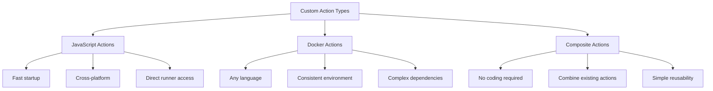

# How to Build GitHub Actions Custom Actions

Author: [nawazdhandala](https://www.github.com/nawazdhandala)

Tags: GitHub Actions, CI/CD, DevOps, Automation, JavaScript

Description: Create reusable GitHub Actions using JavaScript, Docker, and composite actions for automating workflows across repositories.

---

GitHub Actions has become the go-to CI/CD platform for millions of developers. While the marketplace offers thousands of pre-built actions, there comes a point where you need something tailored to your specific workflow. Building custom actions lets you encapsulate complex logic, share functionality across repositories, and create reusable automation that fits your team's needs perfectly.

In this guide, we will walk through the three types of custom actions you can build: JavaScript actions, Docker container actions, and composite actions. Each has its strengths, and choosing the right one depends on your use case.

## Understanding the Three Types of Actions

Before diving into code, let us understand what each action type offers:



**JavaScript actions** run directly on the runner machine, making them fast and lightweight. **Docker actions** package your code with its environment, ensuring consistency regardless of the runner. **Composite actions** combine multiple workflow steps into a reusable unit without writing any application code.

## Building a JavaScript Action

JavaScript actions are the most common choice when you need speed and cross-platform compatibility. Let us build a simple action that posts deployment notifications to Slack.

First, create the directory structure for your action:

```
my-slack-notifier/
├── action.yml
├── index.js
├── package.json
└── node_modules/
```

The `action.yml` file defines your action's interface - its inputs, outputs, and how it runs:

```yaml
# action.yml - Defines the action's metadata and interface
name: 'Slack Deployment Notifier'
description: 'Posts deployment notifications to a Slack channel'
author: 'Your Name'

# Define what inputs the action accepts
inputs:
  webhook-url:
    description: 'Slack incoming webhook URL'
    required: true
  environment:
    description: 'Deployment environment (staging, production)'
    required: true
    default: 'staging'
  status:
    description: 'Deployment status (success, failure)'
    required: true

# Define what the action outputs for subsequent steps
outputs:
  message-ts:
    description: 'Timestamp of the posted Slack message'

# Specify this is a JavaScript action running on Node 20
runs:
  using: 'node20'
  main: 'index.js'
```

Now implement the action logic in JavaScript:

```javascript
// index.js - Main entry point for the action
const core = require('@actions/core');
const github = require('@actions/github');
const https = require('https');

async function run() {
  try {
    // Retrieve inputs defined in action.yml
    const webhookUrl = core.getInput('webhook-url', { required: true });
    const environment = core.getInput('environment');
    const status = core.getInput('status');

    // Access context about the workflow run
    const { repo, sha, actor, workflow } = github.context;
    const repoName = `${repo.owner}/${repo.repo}`;
    const shortSha = sha.substring(0, 7);

    // Build the Slack message payload
    const color = status === 'success' ? '#36a64f' : '#dc3545';
    const emoji = status === 'success' ? ':white_check_mark:' : ':x:';

    const payload = {
      attachments: [{
        color: color,
        blocks: [
          {
            type: 'section',
            text: {
              type: 'mrkdwn',
              text: `${emoji} *Deployment ${status}*\n*Repo:* ${repoName}\n*Environment:* ${environment}\n*Commit:* ${shortSha}\n*Actor:* ${actor}`
            }
          }
        ]
      }]
    };

    // Send the notification to Slack
    const messageTs = await postToSlack(webhookUrl, payload);

    // Set the output for use in subsequent workflow steps
    core.setOutput('message-ts', messageTs);
    core.info(`Successfully posted notification to Slack`);

  } catch (error) {
    // Mark the action as failed if something goes wrong
    core.setFailed(`Action failed: ${error.message}`);
  }
}

// Helper function to send HTTP POST to Slack webhook
function postToSlack(webhookUrl, payload) {
  return new Promise((resolve, reject) => {
    const url = new URL(webhookUrl);
    const data = JSON.stringify(payload);

    const options = {
      hostname: url.hostname,
      path: url.pathname,
      method: 'POST',
      headers: {
        'Content-Type': 'application/json',
        'Content-Length': data.length
      }
    };

    const req = https.request(options, (res) => {
      if (res.statusCode === 200) {
        resolve(Date.now().toString());
      } else {
        reject(new Error(`Slack API returned ${res.statusCode}`));
      }
    });

    req.on('error', reject);
    req.write(data);
    req.end();
  });
}

run();
```

Install the GitHub Actions toolkit packages:

```bash
# Initialize the package and install required dependencies
npm init -y
npm install @actions/core @actions/github
```

## Building a Docker Container Action

Docker actions are ideal when your action needs specific tools, languages, or system dependencies. Let us create an action that runs security scans using a custom tool.

```yaml
# action.yml - Docker action configuration
name: 'Security Scanner'
description: 'Runs security vulnerability scans on your codebase'
author: 'Your Name'

inputs:
  scan-path:
    description: 'Path to scan for vulnerabilities'
    required: false
    default: '.'
  severity-threshold:
    description: 'Minimum severity to report (low, medium, high, critical)'
    required: false
    default: 'medium'

outputs:
  vulnerabilities-found:
    description: 'Number of vulnerabilities found'
  report-path:
    description: 'Path to the generated report'

# Specify this runs as a Docker container
runs:
  using: 'docker'
  image: 'Dockerfile'
  args:
    - ${{ inputs.scan-path }}
    - ${{ inputs.severity-threshold }}
```

Create the Dockerfile that packages your action:

```dockerfile
# Dockerfile - Defines the container environment for the action
FROM python:3.11-slim

# Install system dependencies your scanner needs
RUN apt-get update && apt-get install -y \
    git \
    curl \
    && rm -rf /var/lib/apt/lists/*

# Install the scanning tool
RUN pip install --no-cache-dir safety bandit

# Copy the entrypoint script
COPY entrypoint.sh /entrypoint.sh
RUN chmod +x /entrypoint.sh

# Set the entrypoint that GitHub Actions will call
ENTRYPOINT ["/entrypoint.sh"]
```

The entrypoint script receives inputs as arguments:

```bash
#!/bin/bash
# entrypoint.sh - Script that runs when the container starts

SCAN_PATH=$1
SEVERITY=$2

echo "Starting security scan on: $SCAN_PATH"
echo "Severity threshold: $SEVERITY"

# Run Python security scanner
bandit -r "$SCAN_PATH" -f json -o /tmp/bandit-report.json || true

# Count vulnerabilities based on severity
VULN_COUNT=$(cat /tmp/bandit-report.json | python3 -c "
import sys, json
data = json.load(sys.stdin)
count = len([r for r in data.get('results', []) if r['issue_severity'].lower() >= '$SEVERITY'.lower()])
print(count)
")

# Set outputs using the special GitHub Actions file
echo "vulnerabilities-found=$VULN_COUNT" >> $GITHUB_OUTPUT
echo "report-path=/tmp/bandit-report.json" >> $GITHUB_OUTPUT

# Copy report to workspace for artifact upload
cp /tmp/bandit-report.json "$GITHUB_WORKSPACE/security-report.json"

echo "Scan complete. Found $VULN_COUNT vulnerabilities at or above $SEVERITY severity."

# Fail the action if vulnerabilities exceed threshold
if [ "$VULN_COUNT" -gt 0 ]; then
  exit 1
fi
```

## Building a Composite Action

Composite actions are the simplest to create since they combine existing actions and shell commands without any application code. They are perfect for standardizing common workflows across your organization.

```yaml
# action.yml - Composite action that sets up a Node.js project
name: 'Setup Node Project'
description: 'Sets up Node.js, installs dependencies with caching, and runs linting'
author: 'Your Name'

inputs:
  node-version:
    description: 'Node.js version to use'
    required: false
    default: '20'
  working-directory:
    description: 'Directory containing package.json'
    required: false
    default: '.'

outputs:
  cache-hit:
    description: 'Whether the cache was hit'
    value: ${{ steps.cache.outputs.cache-hit }}

# Composite actions use 'composite' as the using value
runs:
  using: 'composite'
  steps:
    # Step 1: Set up the specified Node.js version
    - name: Setup Node.js
      uses: actions/setup-node@v4
      with:
        node-version: ${{ inputs.node-version }}

    # Step 2: Cache node_modules for faster subsequent runs
    - name: Cache dependencies
      id: cache
      uses: actions/cache@v4
      with:
        path: ${{ inputs.working-directory }}/node_modules
        key: node-modules-${{ runner.os }}-${{ hashFiles(format('{0}/package-lock.json', inputs.working-directory)) }}
        restore-keys: |
          node-modules-${{ runner.os }}-

    # Step 3: Install dependencies if cache missed
    - name: Install dependencies
      if: steps.cache.outputs.cache-hit != 'true'
      shell: bash
      working-directory: ${{ inputs.working-directory }}
      run: npm ci

    # Step 4: Run linting as part of setup
    - name: Run linter
      shell: bash
      working-directory: ${{ inputs.working-directory }}
      run: npm run lint --if-present
```

## Using Your Custom Actions

Once your action is ready, you can use it in workflows. For actions in the same repository, reference them by path:

```yaml
# .github/workflows/deploy.yml
name: Deploy Application

on:
  push:
    branches: [main]

jobs:
  deploy:
    runs-on: ubuntu-latest
    steps:
      - uses: actions/checkout@v4

      # Use a local action from the same repo
      - name: Setup project
        uses: ./.github/actions/setup-node-project
        with:
          node-version: '20'

      - name: Build and deploy
        run: npm run build && npm run deploy

      # Use another local action for notifications
      - name: Notify Slack
        if: always()
        uses: ./.github/actions/slack-notifier
        with:
          webhook-url: ${{ secrets.SLACK_WEBHOOK }}
          environment: production
          status: ${{ job.status }}
```

For actions in a separate repository, reference them with the owner, repo, and version:

```yaml
- name: Run security scan
  uses: your-org/security-scanner@v1
  with:
    scan-path: ./src
    severity-threshold: high
```

## Publishing to the Marketplace

To share your action with the community, add branding to your `action.yml`:

```yaml
branding:
  icon: 'bell'
  color: 'blue'
```

Then create a release in your repository. GitHub will prompt you to publish to the marketplace if your action.yml is properly configured.

## Best Practices

When building custom actions, keep these guidelines in mind:

1. **Version your actions** using semantic versioning and git tags. Users should be able to pin to a specific version.

2. **Handle errors gracefully** and provide meaningful error messages. Use `core.setFailed()` in JavaScript actions to properly signal failures.

3. **Document your inputs and outputs** thoroughly in the action.yml file. This metadata appears in the marketplace and IDE integrations.

4. **Test your actions** before publishing. Create a test workflow that exercises different input combinations.

5. **Keep actions focused** on a single responsibility. It is better to have multiple small actions than one monolithic action.

Custom actions are a powerful way to extend GitHub Actions and create automation tailored to your workflows. Whether you choose JavaScript for speed, Docker for consistency, or composite for simplicity, you now have the foundation to build reusable automation that scales across your projects.
