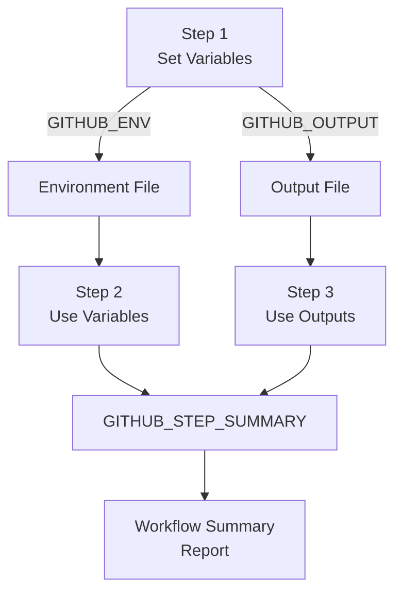
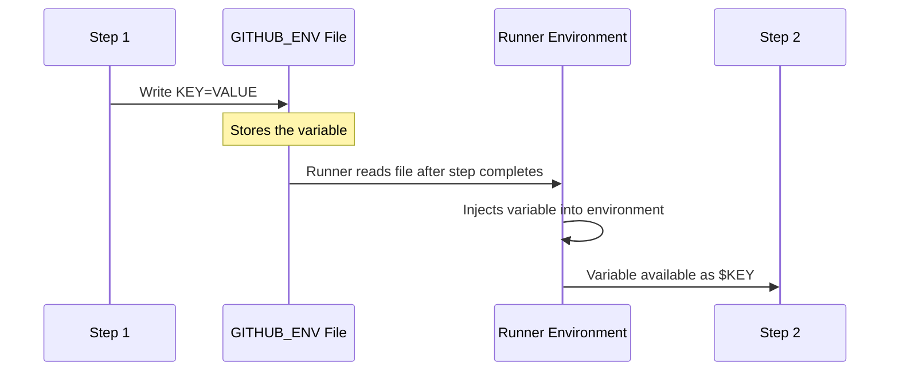
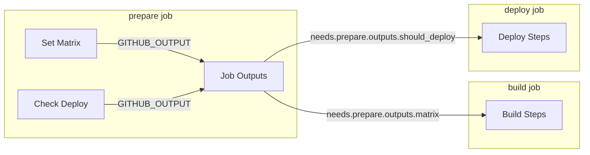
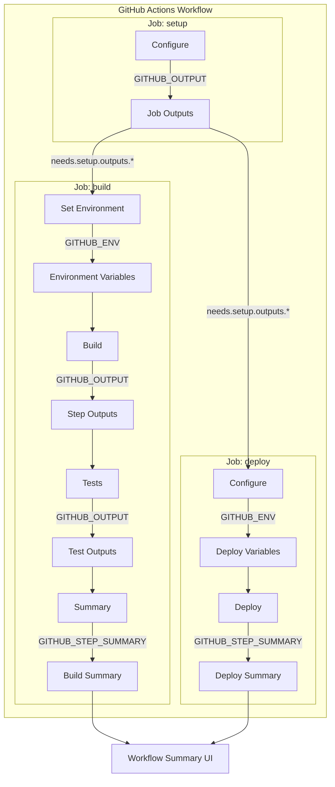

# How to Build GitHub Actions Environment Files

Author: [nawazdhandala](https://github.com/nawazdhandala)

Tags: GitHub Actions, CI/CD, Environment, Automation

Description: A comprehensive guide to building and managing environment files in GitHub Actions. Learn how to use GITHUB_ENV, GITHUB_OUTPUT, and GITHUB_STEP_SUMMARY for dynamic workflows.

---

> Environment files in GitHub Actions let you dynamically set environment variables, pass data between steps, and create rich workflow summaries. Mastering these files is essential for building flexible, maintainable CI/CD pipelines.

Static workflows break when requirements change. Environment files make your pipelines dynamic and adaptable.

---

## Overview

GitHub Actions provides special environment files that enable dynamic workflow configuration. These files allow steps to communicate with each other and modify the workflow's execution context at runtime.



---

## The Three Key Environment Files

GitHub Actions provides three main environment files for workflow communication:

| File | Purpose | Scope |
|------|---------|-------|
| `GITHUB_ENV` | Set environment variables | Available in subsequent steps |
| `GITHUB_OUTPUT` | Pass outputs between steps/jobs | Step and job outputs |
| `GITHUB_STEP_SUMMARY` | Create markdown summaries | Visible in workflow UI |

---

## Setting Environment Variables with GITHUB_ENV

### Basic Usage

Write key-value pairs to the `GITHUB_ENV` file to set environment variables for subsequent steps:

```yaml
name: Environment Variables Demo
on: push

jobs:
  demo:
    runs-on: ubuntu-latest
    steps:
      - name: Set environment variables
        run: |
          echo "APP_VERSION=1.2.3" >> $GITHUB_ENV
          echo "BUILD_DATE=$(date -u +%Y-%m-%d)" >> $GITHUB_ENV
          echo "COMMIT_SHORT=$(echo $GITHUB_SHA | cut -c1-7)" >> $GITHUB_ENV

      - name: Use environment variables
        run: |
          echo "Version: $APP_VERSION"
          echo "Build Date: $BUILD_DATE"
          echo "Commit: $COMMIT_SHORT"
```

### How GITHUB_ENV Works



### Multi-line Values

For values containing newlines, use a delimiter syntax:

```yaml
- name: Set multi-line variable
  run: |
    echo "CHANGELOG<<EOF" >> $GITHUB_ENV
    echo "## Changes in this release" >> $GITHUB_ENV
    echo "- Added new feature X" >> $GITHUB_ENV
    echo "- Fixed bug in module Y" >> $GITHUB_ENV
    echo "- Improved performance by 20%" >> $GITHUB_ENV
    echo "EOF" >> $GITHUB_ENV

- name: Use multi-line variable
  run: |
    echo "$CHANGELOG"
```

The delimiter (EOF in this example) must be unique and not appear in the content.

### Dynamic Configuration Based on Branch

Set different configurations based on the current branch:

```yaml
- name: Configure environment
  run: |
    if [[ "${{ github.ref }}" == "refs/heads/main" ]]; then
      echo "DEPLOY_ENV=production" >> $GITHUB_ENV
      echo "API_URL=https://api.example.com" >> $GITHUB_ENV
      echo "LOG_LEVEL=warn" >> $GITHUB_ENV
    elif [[ "${{ github.ref }}" == "refs/heads/develop" ]]; then
      echo "DEPLOY_ENV=staging" >> $GITHUB_ENV
      echo "API_URL=https://staging-api.example.com" >> $GITHUB_ENV
      echo "LOG_LEVEL=debug" >> $GITHUB_ENV
    else
      echo "DEPLOY_ENV=development" >> $GITHUB_ENV
      echo "API_URL=https://dev-api.example.com" >> $GITHUB_ENV
      echo "LOG_LEVEL=debug" >> $GITHUB_ENV
    fi

- name: Deploy to ${{ env.DEPLOY_ENV }}
  run: |
    echo "Deploying to $DEPLOY_ENV"
    echo "API endpoint: $API_URL"
```

---

## Passing Data Between Steps with GITHUB_OUTPUT

### Basic Step Outputs

Use `GITHUB_OUTPUT` to pass data from one step to another within the same job:

```yaml
jobs:
  build:
    runs-on: ubuntu-latest
    steps:
      - name: Generate build info
        id: build_info
        run: |
          VERSION=$(cat package.json | jq -r '.version')
          BUILD_NUMBER=${{ github.run_number }}
          ARTIFACT_NAME="myapp-${VERSION}-${BUILD_NUMBER}"

          echo "version=$VERSION" >> $GITHUB_OUTPUT
          echo "build_number=$BUILD_NUMBER" >> $GITHUB_OUTPUT
          echo "artifact_name=$ARTIFACT_NAME" >> $GITHUB_OUTPUT

      - name: Build application
        run: |
          echo "Building version ${{ steps.build_info.outputs.version }}"
          echo "Build number: ${{ steps.build_info.outputs.build_number }}"

      - name: Upload artifact
        uses: actions/upload-artifact@v4
        with:
          name: ${{ steps.build_info.outputs.artifact_name }}
          path: dist/
```

### Multi-line Outputs

Similar to GITHUB_ENV, use delimiters for multi-line outputs:

```yaml
- name: Get changed files
  id: changes
  run: |
    CHANGED_FILES=$(git diff --name-only HEAD~1)
    echo "files<<EOF" >> $GITHUB_OUTPUT
    echo "$CHANGED_FILES" >> $GITHUB_OUTPUT
    echo "EOF" >> $GITHUB_OUTPUT

- name: Process changes
  run: |
    echo "Changed files:"
    echo "${{ steps.changes.outputs.files }}"
```

### Passing Outputs Between Jobs

Use job outputs to share data across different jobs:

```yaml
jobs:
  prepare:
    runs-on: ubuntu-latest
    outputs:
      matrix: ${{ steps.set-matrix.outputs.matrix }}
      should_deploy: ${{ steps.check.outputs.deploy }}
    steps:
      - name: Set build matrix
        id: set-matrix
        run: |
          MATRIX='{"include":[{"os":"ubuntu-latest","node":"18"},{"os":"ubuntu-latest","node":"20"}]}'
          echo "matrix=$MATRIX" >> $GITHUB_OUTPUT

      - name: Check if should deploy
        id: check
        run: |
          if [[ "${{ github.ref }}" == "refs/heads/main" ]]; then
            echo "deploy=true" >> $GITHUB_OUTPUT
          else
            echo "deploy=false" >> $GITHUB_OUTPUT
          fi

  build:
    needs: prepare
    runs-on: ${{ matrix.os }}
    strategy:
      matrix: ${{ fromJson(needs.prepare.outputs.matrix) }}
    steps:
      - name: Build on Node ${{ matrix.node }}
        run: echo "Building with Node.js ${{ matrix.node }}"

  deploy:
    needs: [prepare, build]
    if: needs.prepare.outputs.should_deploy == 'true'
    runs-on: ubuntu-latest
    steps:
      - name: Deploy
        run: echo "Deploying to production"
```

### Flow of Job Outputs



---

## Creating Workflow Summaries with GITHUB_STEP_SUMMARY

### Basic Summary

Write markdown to `GITHUB_STEP_SUMMARY` to create rich summaries visible in the GitHub UI:

```yaml
- name: Create build summary
  run: |
    echo "## Build Results" >> $GITHUB_STEP_SUMMARY
    echo "" >> $GITHUB_STEP_SUMMARY
    echo "- **Version**: ${{ steps.build_info.outputs.version }}" >> $GITHUB_STEP_SUMMARY
    echo "- **Build Number**: ${{ github.run_number }}" >> $GITHUB_STEP_SUMMARY
    echo "- **Commit**: ${{ github.sha }}" >> $GITHUB_STEP_SUMMARY
    echo "- **Branch**: ${{ github.ref_name }}" >> $GITHUB_STEP_SUMMARY
```

### Test Results Summary

Create a comprehensive test results table:

```yaml
- name: Run tests
  id: tests
  run: |
    # Run tests and capture results
    npm test -- --json --outputFile=test-results.json || true

    # Parse results
    TOTAL=$(jq '.numTotalTests' test-results.json)
    PASSED=$(jq '.numPassedTests' test-results.json)
    FAILED=$(jq '.numFailedTests' test-results.json)
    SKIPPED=$(jq '.numPendingTests' test-results.json)

    echo "total=$TOTAL" >> $GITHUB_OUTPUT
    echo "passed=$PASSED" >> $GITHUB_OUTPUT
    echo "failed=$FAILED" >> $GITHUB_OUTPUT

- name: Create test summary
  run: |
    echo "## Test Results" >> $GITHUB_STEP_SUMMARY
    echo "" >> $GITHUB_STEP_SUMMARY
    echo "| Metric | Count |" >> $GITHUB_STEP_SUMMARY
    echo "|--------|-------|" >> $GITHUB_STEP_SUMMARY
    echo "| Total | ${{ steps.tests.outputs.total }} |" >> $GITHUB_STEP_SUMMARY
    echo "| Passed | ${{ steps.tests.outputs.passed }} |" >> $GITHUB_STEP_SUMMARY
    echo "| Failed | ${{ steps.tests.outputs.failed }} |" >> $GITHUB_STEP_SUMMARY
    echo "" >> $GITHUB_STEP_SUMMARY

    if [[ "${{ steps.tests.outputs.failed }}" != "0" ]]; then
      echo "> **Warning**: Some tests failed!" >> $GITHUB_STEP_SUMMARY
    else
      echo "> **Success**: All tests passed!" >> $GITHUB_STEP_SUMMARY
    fi
```

### Deployment Summary with Links

Create an informative deployment summary:

```yaml
- name: Deploy and summarize
  run: |
    # Perform deployment
    DEPLOY_URL="https://${{ env.DEPLOY_ENV }}.example.com"

    # Create summary
    cat >> $GITHUB_STEP_SUMMARY << 'EOF'
    ## Deployment Summary

    ### Environment Details

    | Property | Value |
    |----------|-------|
    | Environment | ${{ env.DEPLOY_ENV }} |
    | Version | ${{ steps.build_info.outputs.version }} |
    | Deployed By | @${{ github.actor }} |
    | Timestamp | $(date -u +"%Y-%m-%d %H:%M:%S UTC") |

    ### Links

    - [Application](https://${{ env.DEPLOY_ENV }}.example.com)
    - [Health Check](https://${{ env.DEPLOY_ENV }}.example.com/health)
    - [API Docs](https://${{ env.DEPLOY_ENV }}.example.com/docs)

    EOF
```

### Collapsible Sections

Use HTML details tags for collapsible content:

```yaml
- name: Create detailed summary
  run: |
    echo "## Build Report" >> $GITHUB_STEP_SUMMARY
    echo "" >> $GITHUB_STEP_SUMMARY

    echo "<details>" >> $GITHUB_STEP_SUMMARY
    echo "<summary>Dependencies Installed (click to expand)</summary>" >> $GITHUB_STEP_SUMMARY
    echo "" >> $GITHUB_STEP_SUMMARY
    echo '```' >> $GITHUB_STEP_SUMMARY
    npm list --depth=0 >> $GITHUB_STEP_SUMMARY
    echo '```' >> $GITHUB_STEP_SUMMARY
    echo "</details>" >> $GITHUB_STEP_SUMMARY
    echo "" >> $GITHUB_STEP_SUMMARY

    echo "<details>" >> $GITHUB_STEP_SUMMARY
    echo "<summary>Build Logs</summary>" >> $GITHUB_STEP_SUMMARY
    echo "" >> $GITHUB_STEP_SUMMARY
    echo '```' >> $GITHUB_STEP_SUMMARY
    cat build.log | tail -50 >> $GITHUB_STEP_SUMMARY
    echo '```' >> $GITHUB_STEP_SUMMARY
    echo "</details>" >> $GITHUB_STEP_SUMMARY
```

---

## Complete Workflow Example

Here is a complete workflow that demonstrates all three environment files working together:

```yaml
name: Build and Deploy Pipeline

on:
  push:
    branches: [main, develop]
  pull_request:
    branches: [main]

jobs:
  setup:
    runs-on: ubuntu-latest
    outputs:
      environment: ${{ steps.config.outputs.environment }}
      version: ${{ steps.version.outputs.version }}
      should_deploy: ${{ steps.config.outputs.should_deploy }}
    steps:
      - uses: actions/checkout@v4

      - name: Determine configuration
        id: config
        run: |
          if [[ "${{ github.ref }}" == "refs/heads/main" ]]; then
            echo "environment=production" >> $GITHUB_OUTPUT
            echo "should_deploy=true" >> $GITHUB_OUTPUT
          elif [[ "${{ github.ref }}" == "refs/heads/develop" ]]; then
            echo "environment=staging" >> $GITHUB_OUTPUT
            echo "should_deploy=true" >> $GITHUB_OUTPUT
          else
            echo "environment=development" >> $GITHUB_OUTPUT
            echo "should_deploy=false" >> $GITHUB_OUTPUT
          fi

      - name: Calculate version
        id: version
        run: |
          BASE_VERSION=$(cat package.json | jq -r '.version')
          SHORT_SHA=$(echo "${{ github.sha }}" | cut -c1-7)
          VERSION="${BASE_VERSION}-${SHORT_SHA}"
          echo "version=$VERSION" >> $GITHUB_OUTPUT

  build:
    needs: setup
    runs-on: ubuntu-latest
    steps:
      - uses: actions/checkout@v4

      - name: Set build environment
        run: |
          echo "VERSION=${{ needs.setup.outputs.version }}" >> $GITHUB_ENV
          echo "ENVIRONMENT=${{ needs.setup.outputs.environment }}" >> $GITHUB_ENV
          echo "BUILD_TIME=$(date -u +%Y-%m-%dT%H:%M:%SZ)" >> $GITHUB_ENV

      - name: Setup Node.js
        uses: actions/setup-node@v4
        with:
          node-version: '20'
          cache: 'npm'

      - name: Install dependencies
        run: npm ci

      - name: Build application
        id: build
        run: |
          npm run build

          # Calculate build metrics
          BUILD_SIZE=$(du -sh dist | cut -f1)
          FILE_COUNT=$(find dist -type f | wc -l)

          echo "build_size=$BUILD_SIZE" >> $GITHUB_OUTPUT
          echo "file_count=$FILE_COUNT" >> $GITHUB_OUTPUT

      - name: Run tests
        id: tests
        run: |
          npm test -- --coverage --json --outputFile=test-results.json || true

          TOTAL=$(jq '.numTotalTests' test-results.json)
          PASSED=$(jq '.numPassedTests' test-results.json)
          FAILED=$(jq '.numFailedTests' test-results.json)
          COVERAGE=$(jq '.coverageMap.total.lines.pct' coverage/coverage-summary.json)

          echo "total=$TOTAL" >> $GITHUB_OUTPUT
          echo "passed=$PASSED" >> $GITHUB_OUTPUT
          echo "failed=$FAILED" >> $GITHUB_OUTPUT
          echo "coverage=$COVERAGE" >> $GITHUB_OUTPUT

      - name: Create build summary
        run: |
          cat >> $GITHUB_STEP_SUMMARY << EOF
          ## Build Summary

          ### Configuration
          | Property | Value |
          |----------|-------|
          | Version | $VERSION |
          | Environment | $ENVIRONMENT |
          | Build Time | $BUILD_TIME |
          | Node.js | $(node --version) |

          ### Build Artifacts
          | Metric | Value |
          |--------|-------|
          | Build Size | ${{ steps.build.outputs.build_size }} |
          | File Count | ${{ steps.build.outputs.file_count }} |

          ### Test Results
          | Metric | Value |
          |--------|-------|
          | Total Tests | ${{ steps.tests.outputs.total }} |
          | Passed | ${{ steps.tests.outputs.passed }} |
          | Failed | ${{ steps.tests.outputs.failed }} |
          | Coverage | ${{ steps.tests.outputs.coverage }}% |

          EOF

          if [[ "${{ steps.tests.outputs.failed }}" != "0" ]]; then
            echo "> **Warning**: ${{ steps.tests.outputs.failed }} tests failed" >> $GITHUB_STEP_SUMMARY
          else
            echo "> **Success**: All tests passed" >> $GITHUB_STEP_SUMMARY
          fi

      - name: Upload build artifacts
        uses: actions/upload-artifact@v4
        with:
          name: build-${{ needs.setup.outputs.version }}
          path: dist/

  deploy:
    needs: [setup, build]
    if: needs.setup.outputs.should_deploy == 'true'
    runs-on: ubuntu-latest
    environment: ${{ needs.setup.outputs.environment }}
    steps:
      - name: Download artifacts
        uses: actions/download-artifact@v4
        with:
          name: build-${{ needs.setup.outputs.version }}
          path: dist/

      - name: Configure deployment
        run: |
          echo "DEPLOY_VERSION=${{ needs.setup.outputs.version }}" >> $GITHUB_ENV
          echo "TARGET_ENV=${{ needs.setup.outputs.environment }}" >> $GITHUB_ENV

      - name: Deploy to ${{ needs.setup.outputs.environment }}
        id: deploy
        run: |
          # Simulate deployment
          echo "Deploying version $DEPLOY_VERSION to $TARGET_ENV"
          DEPLOY_URL="https://${TARGET_ENV}.example.com"
          echo "deploy_url=$DEPLOY_URL" >> $GITHUB_OUTPUT

      - name: Create deployment summary
        run: |
          cat >> $GITHUB_STEP_SUMMARY << EOF
          ## Deployment Complete

          ### Details
          | Property | Value |
          |----------|-------|
          | Environment | $TARGET_ENV |
          | Version | $DEPLOY_VERSION |
          | Deployed By | @${{ github.actor }} |
          | URL | ${{ steps.deploy.outputs.deploy_url }} |

          ### Quick Links
          - [Application](${{ steps.deploy.outputs.deploy_url }})
          - [Health Check](${{ steps.deploy.outputs.deploy_url }}/health)

          EOF
```

---

## Environment File Architecture



---

## Reusable Workflow with Environment Files

Create a reusable workflow that accepts inputs and produces outputs:

```yaml
# .github/workflows/reusable-build.yml
name: Reusable Build

on:
  workflow_call:
    inputs:
      node_version:
        required: false
        type: string
        default: '20'
      environment:
        required: true
        type: string
    outputs:
      version:
        description: "The built version"
        value: ${{ jobs.build.outputs.version }}
      artifact_name:
        description: "Name of the uploaded artifact"
        value: ${{ jobs.build.outputs.artifact_name }}

jobs:
  build:
    runs-on: ubuntu-latest
    outputs:
      version: ${{ steps.version.outputs.version }}
      artifact_name: ${{ steps.version.outputs.artifact_name }}
    steps:
      - uses: actions/checkout@v4

      - name: Calculate version
        id: version
        run: |
          VERSION=$(cat package.json | jq -r '.version')
          ARTIFACT_NAME="app-${VERSION}-${{ inputs.environment }}"

          echo "version=$VERSION" >> $GITHUB_OUTPUT
          echo "artifact_name=$ARTIFACT_NAME" >> $GITHUB_OUTPUT

          echo "VERSION=$VERSION" >> $GITHUB_ENV

      - name: Setup Node.js
        uses: actions/setup-node@v4
        with:
          node-version: ${{ inputs.node_version }}

      - name: Build
        run: npm ci && npm run build

      - name: Upload artifact
        uses: actions/upload-artifact@v4
        with:
          name: ${{ steps.version.outputs.artifact_name }}
          path: dist/

      - name: Summary
        run: |
          echo "## Reusable Build Complete" >> $GITHUB_STEP_SUMMARY
          echo "- Version: $VERSION" >> $GITHUB_STEP_SUMMARY
          echo "- Environment: ${{ inputs.environment }}" >> $GITHUB_STEP_SUMMARY
          echo "- Node.js: ${{ inputs.node_version }}" >> $GITHUB_STEP_SUMMARY
```

Call the reusable workflow:

```yaml
# .github/workflows/main.yml
name: Main Pipeline

on:
  push:
    branches: [main]

jobs:
  build-staging:
    uses: ./.github/workflows/reusable-build.yml
    with:
      environment: staging

  build-production:
    uses: ./.github/workflows/reusable-build.yml
    with:
      environment: production
      node_version: '18'

  notify:
    needs: [build-staging, build-production]
    runs-on: ubuntu-latest
    steps:
      - name: Report versions
        run: |
          echo "## Build Versions" >> $GITHUB_STEP_SUMMARY
          echo "- Staging: ${{ needs.build-staging.outputs.version }}" >> $GITHUB_STEP_SUMMARY
          echo "- Production: ${{ needs.build-production.outputs.version }}" >> $GITHUB_STEP_SUMMARY
```

---

## Best Practices

### 1. Use Descriptive Output Names

```yaml
# Good - clear and descriptive
echo "docker_image_tag=$TAG" >> $GITHUB_OUTPUT
echo "deployment_url=$URL" >> $GITHUB_OUTPUT

# Avoid - vague names
echo "tag=$TAG" >> $GITHUB_OUTPUT
echo "url=$URL" >> $GITHUB_OUTPUT
```

### 2. Validate Outputs Before Using

```yaml
- name: Use output safely
  run: |
    if [[ -z "${{ steps.build.outputs.version }}" ]]; then
      echo "Error: version output is empty"
      exit 1
    fi
    echo "Using version: ${{ steps.build.outputs.version }}"
```

### 3. Keep Summaries Focused

```yaml
# Good - essential information only
echo "## Deploy: $VERSION to $ENV" >> $GITHUB_STEP_SUMMARY
echo "[View Application]($URL)" >> $GITHUB_STEP_SUMMARY

# Avoid - information overload
# Don't dump entire log files into summaries
```

### 4. Use Consistent Naming Conventions

```yaml
# Environment variables: UPPER_SNAKE_CASE
echo "BUILD_VERSION=1.0.0" >> $GITHUB_ENV
echo "DEPLOY_TARGET=production" >> $GITHUB_ENV

# Outputs: lower_snake_case
echo "build_version=1.0.0" >> $GITHUB_OUTPUT
echo "deploy_target=production" >> $GITHUB_OUTPUT
```

### 5. Handle Special Characters

```yaml
- name: Handle special characters
  run: |
    # Escape special characters in values
    MESSAGE="Build completed with \"special\" characters & symbols"
    echo "message<<EOF" >> $GITHUB_OUTPUT
    echo "$MESSAGE" >> $GITHUB_OUTPUT
    echo "EOF" >> $GITHUB_OUTPUT
```

---

## Common Pitfalls to Avoid

### 1. Variables Not Available in Same Step

Environment variables set via `GITHUB_ENV` are not available until the next step:

```yaml
# This will NOT work
- name: Set and use
  run: |
    echo "MY_VAR=hello" >> $GITHUB_ENV
    echo $MY_VAR  # Empty - not yet available

# This works
- name: Set variable
  run: echo "MY_VAR=hello" >> $GITHUB_ENV

- name: Use variable
  run: echo $MY_VAR  # Outputs: hello
```

### 2. Missing Step ID for Outputs

```yaml
# Wrong - missing id
- name: Generate value
  run: echo "result=42" >> $GITHUB_OUTPUT

- name: Use value
  run: echo "${{ steps.???.outputs.result }}"  # Cannot reference

# Correct
- name: Generate value
  id: generate
  run: echo "result=42" >> $GITHUB_OUTPUT

- name: Use value
  run: echo "${{ steps.generate.outputs.result }}"
```

### 3. Forgetting to Quote Multi-line Content

```yaml
# Problematic - may break with special characters
echo "message=$COMPLEX_MESSAGE" >> $GITHUB_OUTPUT

# Safe - using delimiter
echo "message<<EOF" >> $GITHUB_OUTPUT
echo "$COMPLEX_MESSAGE" >> $GITHUB_OUTPUT
echo "EOF" >> $GITHUB_OUTPUT
```

---

## Conclusion

GitHub Actions environment files provide powerful mechanisms for building dynamic, flexible CI/CD pipelines:

- **GITHUB_ENV** sets environment variables for subsequent steps
- **GITHUB_OUTPUT** passes data between steps and jobs
- **GITHUB_STEP_SUMMARY** creates rich markdown summaries in the UI

Key takeaways:

- Use environment files to make workflows dynamic and configurable
- Pass data between jobs using job outputs
- Create informative summaries to improve visibility
- Follow naming conventions and validate outputs
- Remember that environment variables are only available in subsequent steps

---

*Building CI/CD pipelines? [OneUptime](https://oneuptime.com) provides comprehensive monitoring for your deployment infrastructure, helping you track build times, deployment success rates, and system health.*
