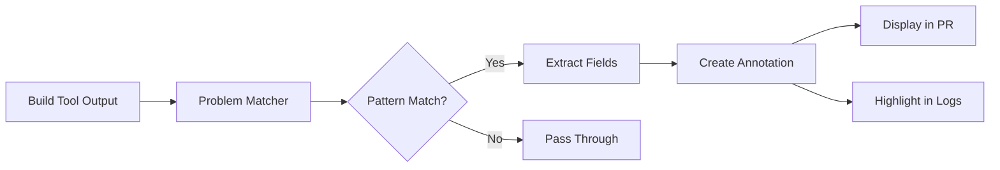
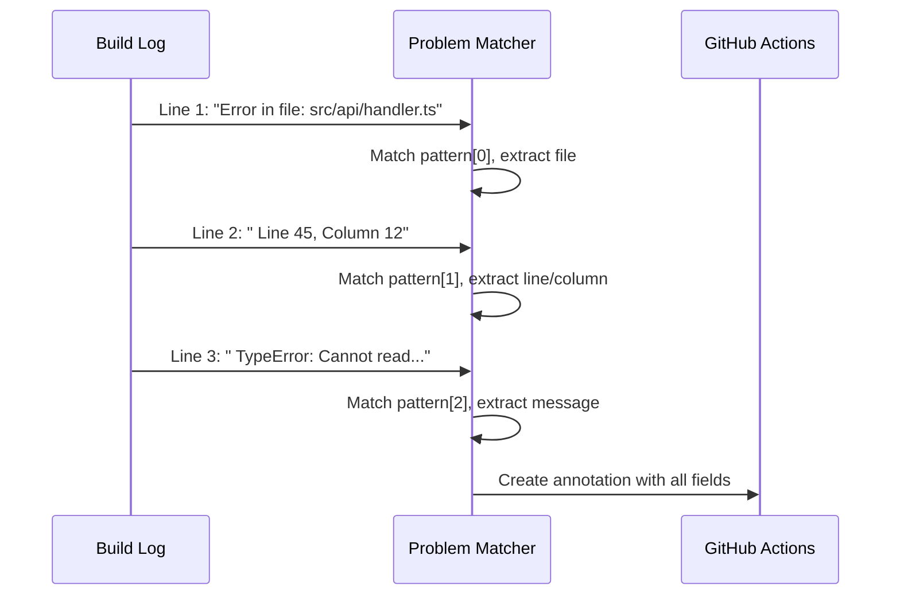
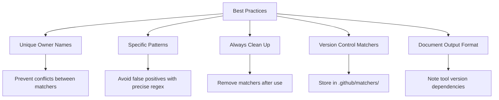

# How to Create GitHub Actions Problem Matchers

Author: [nawazdhandala](https://github.com/nawazdhandala)

Tags: GitHub Actions, CI/CD, Debugging, Automation

Description: Learn how to create custom problem matchers in GitHub Actions to automatically detect, parse, and display errors, warnings, and notices directly in your workflow logs and pull request annotations.

---

When a CI pipeline fails, developers often spend precious minutes scrolling through walls of log output searching for the actual error. GitHub Actions problem matchers solve this by automatically extracting errors and warnings from your build output and displaying them as inline annotations. This guide shows you how to create custom problem matchers for any tool or framework.

## What Are Problem Matchers?

Problem matchers are JSON configuration files that tell GitHub Actions how to parse log output and extract structured error information. When a match is found, GitHub Actions:

1. Highlights the error in the workflow log
2. Creates an annotation on the relevant file in pull requests
3. Displays a summary in the Actions tab



## Problem Matcher Anatomy

A problem matcher is a JSON file with a specific structure. Here is a complete example:

```json
{
  "problemMatcher": [
    {
      "owner": "my-linter",
      "pattern": [
        {
          "regexp": "^(.+):(\\d+):(\\d+):\\s+(error|warning):\\s+(.+)$",
          "file": 1,
          "line": 2,
          "column": 3,
          "severity": 4,
          "message": 5
        }
      ]
    }
  ]
}
```

### Field Reference

| Field | Description | Required |
|-------|-------------|----------|
| `owner` | Unique identifier for this matcher | Yes |
| `severity` | Maps to error, warning, or notice | No |
| `pattern` | Array of regex patterns to match | Yes |
| `file` | Capture group number for filename | Yes |
| `line` | Capture group number for line number | No |
| `column` | Capture group number for column | No |
| `message` | Capture group number for error message | Yes |
| `code` | Capture group number for error code | No |
| `loop` | Whether pattern repeats for multiple errors | No |

## Creating Your First Problem Matcher

Let us build a problem matcher for a custom linter that outputs errors in this format:

```
src/utils/parser.ts:42:15: error TS2345: Argument of type 'string' is not assignable
src/components/Button.tsx:18:3: warning: Unused import 'useState'
```

### Step 1: Create the Matcher File

Create `.github/matchers/custom-linter.json`:

```json
{
  "problemMatcher": [
    {
      "owner": "custom-linter",
      "pattern": [
        {
          "regexp": "^(.+):(\\d+):(\\d+):\\s+(error|warning)(?:\\s+([A-Z]+\\d+))?:\\s+(.+)$",
          "file": 1,
          "line": 2,
          "column": 3,
          "severity": 4,
          "code": 5,
          "message": 6
        }
      ]
    }
  ]
}
```

### Step 2: Register the Matcher in Your Workflow

Use the `::add-matcher::` command to activate your matcher before running the tool:

```yaml
name: Lint
on: [push, pull_request]

jobs:
  lint:
    runs-on: ubuntu-latest
    steps:
      - uses: actions/checkout@v4

      - name: Register problem matcher
        run: echo "::add-matcher::.github/matchers/custom-linter.json"

      - name: Run linter
        run: npm run lint

      - name: Remove problem matcher
        if: always()
        run: echo "::remove-matcher owner=custom-linter::"
```

The workflow registers the matcher, runs the linting tool, and then removes the matcher to prevent interference with subsequent steps.

## Multi-Line Pattern Matching

Some tools output errors across multiple lines. Problem matchers handle this with pattern arrays where each pattern matches a consecutive line.

Consider this multi-line error format:

```
Error in file: src/api/handler.ts
  Line 45, Column 12
  TypeError: Cannot read property 'map' of undefined
```

Create a matcher with multiple patterns:

```json
{
  "problemMatcher": [
    {
      "owner": "multiline-checker",
      "pattern": [
        {
          "regexp": "^Error in file:\\s+(.+)$",
          "file": 1
        },
        {
          "regexp": "^\\s+Line (\\d+), Column (\\d+)$",
          "line": 1,
          "column": 2
        },
        {
          "regexp": "^\\s+(\\w+Error):\\s+(.+)$",
          "code": 1,
          "message": 2
        }
      ]
    }
  ]
}
```



## Looping Patterns for Repeated Errors

When a tool outputs multiple errors in a repeating format, use the `loop` property to avoid creating separate matchers for each occurrence.

```json
{
  "problemMatcher": [
    {
      "owner": "repeating-checker",
      "pattern": [
        {
          "regexp": "^\\[ERROR\\]\\s+(.+):(\\d+):\\s+(.+)$",
          "file": 1,
          "line": 2,
          "message": 3,
          "loop": true
        }
      ]
    }
  ]
}
```

With `loop: true`, the matcher continues scanning for matches after finding one, creating multiple annotations from a single tool invocation.

## Real-World Examples

### ESLint Problem Matcher

ESLint with the stylish formatter outputs errors like:

```
/home/runner/work/project/src/index.ts
  2:10  error  'foo' is defined but never used  no-unused-vars
  5:1   warning  Unexpected console statement    no-console
```

```json
{
  "problemMatcher": [
    {
      "owner": "eslint-stylish",
      "pattern": [
        {
          "regexp": "^([^\\s].*)",
          "file": 1
        },
        {
          "regexp": "^\\s+(\\d+):(\\d+)\\s+(error|warning)\\s+(.+?)\\s{2,}(.+)$",
          "line": 1,
          "column": 2,
          "severity": 3,
          "message": 4,
          "code": 5,
          "loop": true
        }
      ]
    }
  ]
}
```

### Python Pytest Matcher

Pytest failure output:

```
FAILED tests/test_api.py::test_create_user - AssertionError: assert 200 == 201
```

```json
{
  "problemMatcher": [
    {
      "owner": "pytest",
      "severity": "error",
      "pattern": [
        {
          "regexp": "^FAILED\\s+(.+)::(\\S+)\\s+-\\s+(.+)$",
          "file": 1,
          "message": 3
        }
      ]
    }
  ]
}
```

### Go Compiler Matcher

Go compiler errors:

```
./main.go:15:2: undefined: fmt.Prinln
./utils/helper.go:8:9: cannot use x (type int) as type string
```

```json
{
  "problemMatcher": [
    {
      "owner": "go-compiler",
      "pattern": [
        {
          "regexp": "^\\.?\\/(.+):(\\d+):(\\d+):\\s+(.+)$",
          "file": 1,
          "line": 2,
          "column": 3,
          "message": 4,
          "loop": true
        }
      ]
    }
  ]
}
```

### Rust Cargo Matcher

Rust compiler output is more complex with JSON output support:

```yaml
- name: Register Rust matcher
  run: echo "::add-matcher::.github/matchers/rust.json"

- name: Build
  run: cargo build --message-format=short 2>&1
```

```json
{
  "problemMatcher": [
    {
      "owner": "rust-cargo",
      "pattern": [
        {
          "regexp": "^(error|warning)(?:\\[([A-Z]\\d+)\\])?:\\s+(.+)$",
          "severity": 1,
          "code": 2,
          "message": 3
        },
        {
          "regexp": "^\\s+-->\\s+(.+):(\\d+):(\\d+)$",
          "file": 1,
          "line": 2,
          "column": 3
        }
      ]
    }
  ]
}
```

## Complete Workflow Example

Here is a complete workflow demonstrating multiple problem matchers working together:

```yaml
name: CI Pipeline

on:
  push:
    branches: [main]
  pull_request:
    branches: [main]

jobs:
  build-and-test:
    runs-on: ubuntu-latest

    steps:
      - name: Checkout code
        uses: actions/checkout@v4

      - name: Setup Node.js
        uses: actions/setup-node@v4
        with:
          node-version: '20'
          cache: 'npm'

      - name: Install dependencies
        run: npm ci

      # Register all problem matchers before running tools
      - name: Register problem matchers
        run: |
          echo "::add-matcher::.github/matchers/eslint.json"
          echo "::add-matcher::.github/matchers/typescript.json"
          echo "::add-matcher::.github/matchers/jest.json"

      # TypeScript compilation
      - name: Type check
        run: npm run typecheck
        continue-on-error: true

      # Linting
      - name: Lint code
        run: npm run lint
        continue-on-error: true

      # Tests
      - name: Run tests
        run: npm test

      # Clean up matchers
      - name: Remove problem matchers
        if: always()
        run: |
          echo "::remove-matcher owner=eslint::"
          echo "::remove-matcher owner=typescript::"
          echo "::remove-matcher owner=jest::"
```

## Debugging Problem Matchers

When your matcher is not working as expected, use these debugging techniques:

### 1. Test Your Regex

Use an online regex tester with your exact log output. Remember that GitHub Actions uses JavaScript regex syntax.

### 2. Enable Debug Logging

Add the `ACTIONS_STEP_DEBUG` secret to your repository with value `true` to see detailed matcher activity:

```yaml
- name: Run with debug
  run: npm run lint
  env:
    ACTIONS_STEP_DEBUG: true
```

### 3. Print Raw Output

Verify your tool output matches expectations:

```yaml
- name: Capture lint output
  run: |
    npm run lint 2>&1 | tee lint-output.txt
    echo "=== Raw output ==="
    cat lint-output.txt
    echo "=== Hex dump for hidden characters ==="
    xxd lint-output.txt | head -50
```

### 4. Test Incrementally

Start with a simple pattern and gradually add complexity:

```json
{
  "problemMatcher": [
    {
      "owner": "debug-test",
      "pattern": [
        {
          "regexp": "^(.+\\.ts):(\\d+).*$",
          "file": 1,
          "line": 2,
          "message": 0
        }
      ]
    }
  ]
}
```

## Best Practices



### 1. Use Descriptive Owner Names

Choose owner names that clearly identify the tool and purpose:

```json
{
  "owner": "eslint-v8-stylish"
}
```

### 2. Handle Tool Version Changes

Document which tool version your matcher supports. Output formats can change between versions:

```json
{
  "problemMatcher": [
    {
      "owner": "mypy-v1.5",
      "pattern": [...]
    }
  ]
}
```

### 3. Prefer Built-in Matchers

Many popular actions include problem matchers. Check before creating your own:

- `actions/setup-node` includes TypeScript matcher
- `actions/setup-python` includes Python matcher
- `actions/setup-go` includes Go matcher

### 4. Use Severity Levels Appropriately

Map severity correctly to help developers prioritize:

- `error`: Build failures, type errors, security issues
- `warning`: Code style issues, deprecations
- `notice`: Informational messages, suggestions

### 5. Scope Matchers to Specific Steps

Register matchers only when needed and remove them afterward to prevent false matches:

```yaml
- name: Register TypeScript matcher
  run: echo "::add-matcher::.github/matchers/tsc.json"

- name: Compile TypeScript
  run: npx tsc --noEmit

- name: Remove TypeScript matcher
  run: echo "::remove-matcher owner=tsc::"
```

## Creating a Reusable Action with Problem Matchers

Package your problem matcher as a reusable action for your organization:

```yaml
# .github/actions/lint-with-matcher/action.yml
name: 'Lint with Problem Matcher'
description: 'Runs linter with problem matcher enabled'

inputs:
  working-directory:
    description: 'Directory to run linter in'
    required: false
    default: '.'

runs:
  using: 'composite'
  steps:
    - name: Register matcher
      shell: bash
      run: echo "::add-matcher::${{ github.action_path }}/matcher.json"

    - name: Run linter
      shell: bash
      working-directory: ${{ inputs.working-directory }}
      run: npm run lint

    - name: Remove matcher
      shell: bash
      if: always()
      run: echo "::remove-matcher owner=custom-linter::"
```

Place `matcher.json` alongside `action.yml` in your action directory.

## Conclusion

Problem matchers transform noisy CI logs into actionable feedback. By investing time in creating accurate matchers for your tools, you help developers find and fix issues faster. Start with the built-in matchers from official actions, then create custom matchers for your organization-specific tools. The time spent debugging regex patterns pays dividends in faster PR reviews and fewer missed errors.

Key takeaways:

- Problem matchers parse log output using regex and create GitHub annotations
- Multi-line patterns handle complex error formats
- Use the `loop` property for tools that output multiple errors
- Always clean up matchers to prevent false positives
- Test your regex patterns thoroughly before deploying

With proper problem matchers in place, your CI pipeline becomes a proactive partner in code quality rather than a passive log aggregator.
