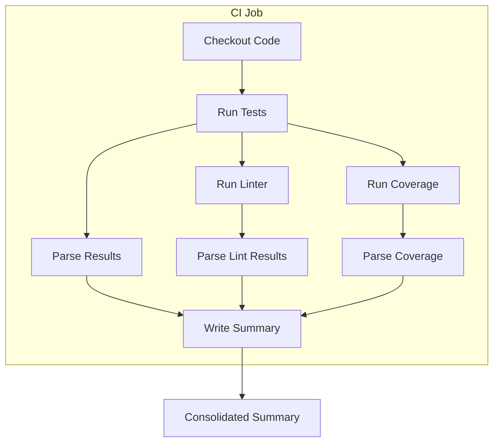
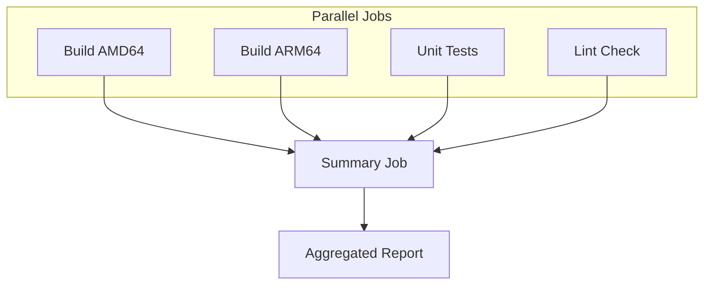
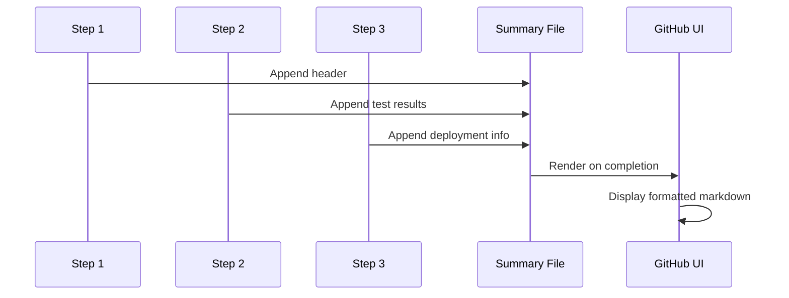

# How to Implement GitHub Actions Step Summary

Author: [nawazdhandala](https://github.com/nawazdhandala)

Tags: GitHub Actions, CI/CD, Reports, Automation

Description: Learn how to create rich, informative job summaries in GitHub Actions using the GITHUB_STEP_SUMMARY environment file. This guide covers markdown formatting, tables, charts, and practical patterns for test results, deployment reports, and build metrics.

---

GitHub Actions Step Summary transforms your workflow runs from walls of logs into readable reports. Instead of hunting through console output, your team sees formatted markdown right on the workflow summary page. Here is how to implement it effectively.

## What is GITHUB_STEP_SUMMARY?

The `GITHUB_STEP_SUMMARY` environment variable points to a file where you can write markdown content. GitHub renders this content on the Actions run summary page, making it visible without expanding logs.


Every job gets its own summary section. Multiple steps can append to the same summary, building a comprehensive report as your workflow progresses.

## Basic Usage

The simplest way to add a summary is echoing markdown to the summary file.

```yaml
jobs:
  build:
    runs-on: ubuntu-latest
    steps:
      - name: Add build summary
        run: |
          echo "## Build Results" >> $GITHUB_STEP_SUMMARY
          echo "Build completed successfully at $(date)" >> $GITHUB_STEP_SUMMARY
```

This appends a heading and timestamp to the job summary. The double angle brackets (`>>`) append content rather than overwriting.

## Writing Tables

Tables make test results and metrics scannable. Use standard markdown table syntax.

```yaml
      - name: Generate test summary
        run: |
          echo "## Test Results" >> $GITHUB_STEP_SUMMARY
          echo "" >> $GITHUB_STEP_SUMMARY
          echo "| Suite | Passed | Failed | Skipped |" >> $GITHUB_STEP_SUMMARY
          echo "|-------|--------|--------|---------|" >> $GITHUB_STEP_SUMMARY
          echo "| Unit Tests | 142 | 0 | 3 |" >> $GITHUB_STEP_SUMMARY
          echo "| Integration | 58 | 2 | 0 |" >> $GITHUB_STEP_SUMMARY
          echo "| E2E | 24 | 0 | 1 |" >> $GITHUB_STEP_SUMMARY
```

This renders as a formatted table on the summary page. Add blank lines before tables for proper spacing.

## Dynamic Content from Test Frameworks

Real workflows pull data from test output. Here is a pattern for Jest test results.

```yaml
      - name: Run tests
        id: test
        run: |
          npm test -- --json --outputFile=test-results.json || true

      - name: Generate test summary
        if: always()
        run: |
          echo "## Test Results" >> $GITHUB_STEP_SUMMARY
          echo "" >> $GITHUB_STEP_SUMMARY

          # Parse Jest JSON output
          TOTAL=$(jq '.numTotalTests' test-results.json)
          PASSED=$(jq '.numPassedTests' test-results.json)
          FAILED=$(jq '.numFailedTests' test-results.json)

          if [ "$FAILED" -gt 0 ]; then
            echo "> [!CAUTION]" >> $GITHUB_STEP_SUMMARY
            echo "> $FAILED tests failed" >> $GITHUB_STEP_SUMMARY
          else
            echo "> [!NOTE]" >> $GITHUB_STEP_SUMMARY
            echo "> All $TOTAL tests passed" >> $GITHUB_STEP_SUMMARY
          fi

          echo "" >> $GITHUB_STEP_SUMMARY
          echo "| Metric | Count |" >> $GITHUB_STEP_SUMMARY
          echo "|--------|-------|" >> $GITHUB_STEP_SUMMARY
          echo "| Total | $TOTAL |" >> $GITHUB_STEP_SUMMARY
          echo "| Passed | $PASSED |" >> $GITHUB_STEP_SUMMARY
          echo "| Failed | $FAILED |" >> $GITHUB_STEP_SUMMARY
```

The `if: always()` ensures the summary generates even when tests fail. GitHub's alert syntax (`> [!CAUTION]`) creates visual callouts.

## Workflow Architecture for Summaries



Each step contributes to a unified report. Structure your workflows so summary generation happens after data collection steps.

## Using Heredocs for Complex Summaries

Multi-line content is easier with heredocs.

```yaml
      - name: Deployment summary
        run: |
          cat << 'EOF' >> $GITHUB_STEP_SUMMARY
          ## Deployment Report

          ### Environment Details

          | Property | Value |
          |----------|-------|
          | Environment | Production |
          | Region | us-east-1 |
          | Timestamp | $(date -u +"%Y-%m-%d %H:%M:%S UTC") |

          ### Deployed Services

          - **API Server**: v2.4.1
          - **Worker**: v2.4.1
          - **Frontend**: v2.4.0

          ### Health Checks

          All services passed initial health checks.
          EOF
```

Quote the heredoc delimiter (`'EOF'`) to prevent variable expansion, or leave it unquoted to interpolate shell variables.

## Code Blocks and Syntax Highlighting

Include code snippets with proper syntax highlighting.

```yaml
      - name: Show config diff
        run: |
          echo "## Configuration Changes" >> $GITHUB_STEP_SUMMARY
          echo "" >> $GITHUB_STEP_SUMMARY
          echo "\`\`\`diff" >> $GITHUB_STEP_SUMMARY
          git diff HEAD~1 -- config/ >> $GITHUB_STEP_SUMMARY
          echo "\`\`\`" >> $GITHUB_STEP_SUMMARY
```

This displays configuration changes as a diff with color-coded additions and deletions.

## Adding Images and Badges

Reference images from your repository or external URLs.

```yaml
      - name: Add coverage badge
        run: |
          COVERAGE=87
          COLOR="green"
          if [ "$COVERAGE" -lt 80 ]; then COLOR="yellow"; fi
          if [ "$COVERAGE" -lt 60 ]; then COLOR="red"; fi

          echo "## Coverage" >> $GITHUB_STEP_SUMMARY
          echo "" >> $GITHUB_STEP_SUMMARY
          echo "" >> $GITHUB_STEP_SUMMARY
```

Shields.io badges provide visual status indicators without hosting custom images.

## Collapsible Sections

Use HTML details elements for verbose output that most readers can skip.

```yaml
      - name: Add verbose logs
        run: |
          echo "## Build Logs" >> $GITHUB_STEP_SUMMARY
          echo "" >> $GITHUB_STEP_SUMMARY
          echo "<details>" >> $GITHUB_STEP_SUMMARY
          echo "<summary>Click to expand full build output</summary>" >> $GITHUB_STEP_SUMMARY
          echo "" >> $GITHUB_STEP_SUMMARY
          echo "\`\`\`" >> $GITHUB_STEP_SUMMARY
          cat build.log >> $GITHUB_STEP_SUMMARY
          echo "\`\`\`" >> $GITHUB_STEP_SUMMARY
          echo "</details>" >> $GITHUB_STEP_SUMMARY
```

Collapsible sections keep summaries scannable while preserving access to detailed information.

## Multi-Job Summary Pattern



When jobs run in parallel, create a final summary job that aggregates results.

```yaml
jobs:
  build-amd64:
    runs-on: ubuntu-latest
    outputs:
      status: ${{ steps.build.outcome }}
      duration: ${{ steps.build.outputs.duration }}
    steps:
      - id: build
        run: |
          START=$(date +%s)
          # Build steps here
          END=$(date +%s)
          echo "duration=$((END-START))s" >> $GITHUB_OUTPUT

  build-arm64:
    runs-on: ubuntu-latest
    outputs:
      status: ${{ steps.build.outcome }}
      duration: ${{ steps.build.outputs.duration }}
    steps:
      - id: build
        run: |
          START=$(date +%s)
          # Build steps here
          END=$(date +%s)
          echo "duration=$((END-START))s" >> $GITHUB_OUTPUT

  summary:
    needs: [build-amd64, build-arm64]
    runs-on: ubuntu-latest
    if: always()
    steps:
      - name: Generate summary
        run: |
          echo "## Build Matrix Results" >> $GITHUB_STEP_SUMMARY
          echo "" >> $GITHUB_STEP_SUMMARY
          echo "| Architecture | Status | Duration |" >> $GITHUB_STEP_SUMMARY
          echo "|--------------|--------|----------|" >> $GITHUB_STEP_SUMMARY
          echo "| AMD64 | ${{ needs.build-amd64.result }} | ${{ needs.build-amd64.outputs.duration }} |" >> $GITHUB_STEP_SUMMARY
          echo "| ARM64 | ${{ needs.build-arm64.result }} | ${{ needs.build-arm64.outputs.duration }} |" >> $GITHUB_STEP_SUMMARY
```

Use job outputs to pass data between jobs for aggregation.

## Production-Ready Summary Script

For complex summaries, use a dedicated script rather than inline YAML.

```bash
#!/bin/bash
# scripts/generate-summary.sh

set -e

# Input files
TEST_RESULTS="${1:-test-results.json}"
LINT_RESULTS="${2:-lint-results.json}"
COVERAGE_REPORT="${3:-coverage/coverage-summary.json}"

# Start summary
cat << 'HEADER' >> $GITHUB_STEP_SUMMARY
# CI Pipeline Report

Generated at: $(date -u +"%Y-%m-%d %H:%M:%S UTC")

---

HEADER

# Test Results Section
if [ -f "$TEST_RESULTS" ]; then
  TOTAL=$(jq '.numTotalTests // 0' "$TEST_RESULTS")
  PASSED=$(jq '.numPassedTests // 0' "$TEST_RESULTS")
  FAILED=$(jq '.numFailedTests // 0' "$TEST_RESULTS")

  echo "## Test Results" >> $GITHUB_STEP_SUMMARY
  echo "" >> $GITHUB_STEP_SUMMARY

  if [ "$FAILED" -gt 0 ]; then
    echo "> [!WARNING]" >> $GITHUB_STEP_SUMMARY
    echo "> $FAILED of $TOTAL tests failed" >> $GITHUB_STEP_SUMMARY
    echo "" >> $GITHUB_STEP_SUMMARY

    # List failed tests
    echo "### Failed Tests" >> $GITHUB_STEP_SUMMARY
    echo "" >> $GITHUB_STEP_SUMMARY
    jq -r '.testResults[] | select(.status == "failed") | .name' "$TEST_RESULTS" | while read -r name; do
      echo "- \`$name\`" >> $GITHUB_STEP_SUMMARY
    done
  else
    echo "> [!TIP]" >> $GITHUB_STEP_SUMMARY
    echo "> All $TOTAL tests passed" >> $GITHUB_STEP_SUMMARY
  fi
  echo "" >> $GITHUB_STEP_SUMMARY
fi

# Coverage Section
if [ -f "$COVERAGE_REPORT" ]; then
  LINES=$(jq '.total.lines.pct // 0' "$COVERAGE_REPORT")
  BRANCHES=$(jq '.total.branches.pct // 0' "$COVERAGE_REPORT")
  FUNCTIONS=$(jq '.total.functions.pct // 0' "$COVERAGE_REPORT")

  echo "## Code Coverage" >> $GITHUB_STEP_SUMMARY
  echo "" >> $GITHUB_STEP_SUMMARY
  echo "| Metric | Percentage |" >> $GITHUB_STEP_SUMMARY
  echo "|--------|------------|" >> $GITHUB_STEP_SUMMARY
  echo "| Lines | ${LINES}% |" >> $GITHUB_STEP_SUMMARY
  echo "| Branches | ${BRANCHES}% |" >> $GITHUB_STEP_SUMMARY
  echo "| Functions | ${FUNCTIONS}% |" >> $GITHUB_STEP_SUMMARY
  echo "" >> $GITHUB_STEP_SUMMARY
fi

# Lint Section
if [ -f "$LINT_RESULTS" ]; then
  ERRORS=$(jq '.errorCount // 0' "$LINT_RESULTS")
  WARNINGS=$(jq '.warningCount // 0' "$LINT_RESULTS")

  echo "## Lint Results" >> $GITHUB_STEP_SUMMARY
  echo "" >> $GITHUB_STEP_SUMMARY

  if [ "$ERRORS" -gt 0 ]; then
    echo "> [!CAUTION]" >> $GITHUB_STEP_SUMMARY
    echo "> $ERRORS errors, $WARNINGS warnings" >> $GITHUB_STEP_SUMMARY
  elif [ "$WARNINGS" -gt 0 ]; then
    echo "> [!WARNING]" >> $GITHUB_STEP_SUMMARY
    echo "> $WARNINGS warnings (no errors)" >> $GITHUB_STEP_SUMMARY
  else
    echo "> [!NOTE]" >> $GITHUB_STEP_SUMMARY
    echo "> No lint issues found" >> $GITHUB_STEP_SUMMARY
  fi
  echo "" >> $GITHUB_STEP_SUMMARY
fi

echo "---" >> $GITHUB_STEP_SUMMARY
echo "" >> $GITHUB_STEP_SUMMARY
echo "*Report generated by CI pipeline*" >> $GITHUB_STEP_SUMMARY
```

Call it from your workflow:

```yaml
      - name: Generate CI summary
        if: always()
        run: chmod +x scripts/generate-summary.sh && ./scripts/generate-summary.sh
```

## Size Limits and Best Practices

GitHub imposes a 1MB limit per step summary. Keep summaries focused:

- Truncate long logs with `head` or `tail`
- Use collapsible sections for verbose output
- Link to artifacts instead of embedding large content
- Summarize data rather than dumping raw output

```yaml
      - name: Add truncated error log
        if: failure()
        run: |
          echo "## Error Log (last 50 lines)" >> $GITHUB_STEP_SUMMARY
          echo "" >> $GITHUB_STEP_SUMMARY
          echo "\`\`\`" >> $GITHUB_STEP_SUMMARY
          tail -50 error.log >> $GITHUB_STEP_SUMMARY
          echo "\`\`\`" >> $GITHUB_STEP_SUMMARY
          echo "" >> $GITHUB_STEP_SUMMARY
          echo "Full log available in workflow artifacts." >> $GITHUB_STEP_SUMMARY
```

## Clearing Previous Content

To replace rather than append, use single angle bracket:

```yaml
      - name: Overwrite summary
        run: echo "## Fresh Summary" > $GITHUB_STEP_SUMMARY
```

This is useful when re-running a step that should not accumulate output.

## Summary Flow in Complex Pipelines



Content accumulates throughout the job and renders when the job completes.

## Debugging Summaries

Preview your markdown locally before committing:

```bash
# Write summary to local file
export GITHUB_STEP_SUMMARY=summary.md
./scripts/generate-summary.sh

# Preview with a markdown viewer or browser
npx marked -o summary.html < summary.md && open summary.html
```

This catches formatting issues before they appear in production runs.

## Integration with Third-Party Actions

Many popular actions write summaries automatically. Check action documentation for summary support:

- `actions/upload-artifact` - Lists uploaded files
- `dorny/test-reporter` - Formats test results
- `codecov/codecov-action` - Coverage summaries

Combine auto-generated summaries with custom content for comprehensive reports.

---

Step summaries turn GitHub Actions from a black box into a dashboard. Start simple with test counts and build status, then layer in coverage, timing, and deployment details. Your team will spend less time clicking through logs and more time shipping code.
