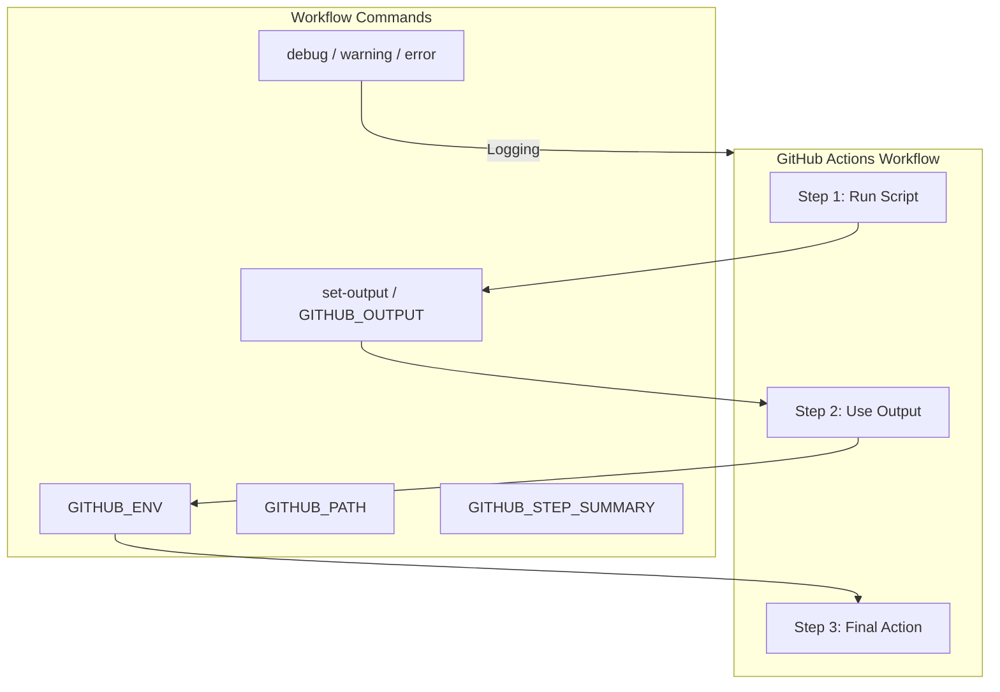
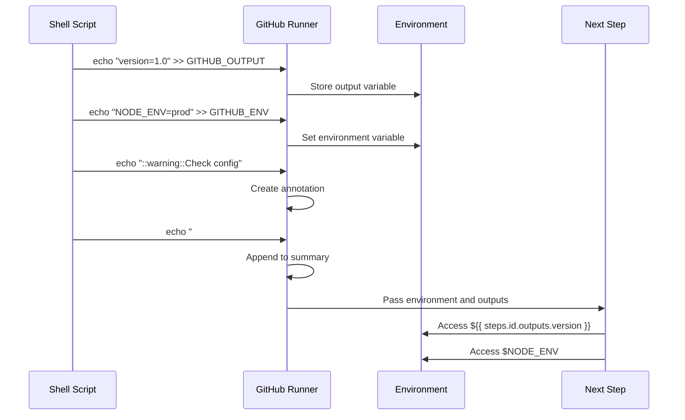
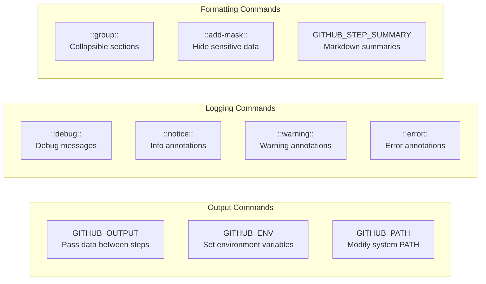

# How to Build GitHub Actions Workflow Commands

Author: [nawazdhandala](https://github.com/nawazdhandala)

Tags: GitHub Actions, CI/CD, Commands, Automation

Description: Learn how to build and use GitHub Actions workflow commands to control your CI/CD pipelines. This comprehensive guide covers output variables, environment files, logging commands, job summaries, and advanced automation techniques.

---

> GitHub Actions workflow commands let you communicate with the runner to set environment variables, output values, add debug messages, and more. Mastering these commands transforms your workflows from simple scripts into powerful automation pipelines.

Workflow commands are the secret sauce that makes GitHub Actions flexible and powerful. Understanding them unlocks advanced CI/CD capabilities.

---

## Overview

GitHub Actions workflow commands use a special syntax to communicate with the runner. These commands can set outputs, create environment variables, add log messages, and control workflow behavior.



---

## Command Syntax

Workflow commands follow a specific format that the runner interprets:

```bash
::workflow-command parameter1={data},parameter2={data}::{command value}
```

The format consists of:
- `::` - Command delimiter
- `workflow-command` - The command name
- `parameter1={data}` - Optional parameters
- `::` - Separator between parameters and value
- `{command value}` - The value or message

---

## Setting Output Variables

Output variables let you pass data between steps in a job. The modern approach uses the `GITHUB_OUTPUT` environment file.

### Basic Output

Set an output value that other steps can reference:

```yaml
# .github/workflows/output-example.yml
name: Output Variables Example

on: push

jobs:
  build:
    runs-on: ubuntu-latest
    steps:
      - name: Set version output
        id: version
        run: |
          # Write output to GITHUB_OUTPUT file
          echo "version=1.2.3" >> $GITHUB_OUTPUT
          echo "build_number=${{ github.run_number }}" >> $GITHUB_OUTPUT

      - name: Use version output
        run: |
          echo "Version: ${{ steps.version.outputs.version }}"
          echo "Build: ${{ steps.version.outputs.build_number }}"
```

### Multiline Output

For multiline values, use a delimiter pattern:

```yaml
- name: Set multiline output
  id: changelog
  run: |
    # Use EOF as delimiter for multiline content
    echo "changelog<<EOF" >> $GITHUB_OUTPUT
    echo "## Changes" >> $GITHUB_OUTPUT
    echo "- Feature A added" >> $GITHUB_OUTPUT
    echo "- Bug B fixed" >> $GITHUB_OUTPUT
    echo "- Performance improved" >> $GITHUB_OUTPUT
    echo "EOF" >> $GITHUB_OUTPUT

- name: Display changelog
  run: |
    echo "${{ steps.changelog.outputs.changelog }}"
```

### Dynamic Output from Scripts

Generate outputs dynamically based on your build process:

```yaml
- name: Extract package info
  id: package
  run: |
    # Read version from package.json
    VERSION=$(node -p "require('./package.json').version")
    NAME=$(node -p "require('./package.json').name")

    echo "version=$VERSION" >> $GITHUB_OUTPUT
    echo "name=$NAME" >> $GITHUB_OUTPUT

    # Set a boolean flag based on version
    if [[ "$VERSION" == *"-beta"* ]]; then
      echo "is_prerelease=true" >> $GITHUB_OUTPUT
    else
      echo "is_prerelease=false" >> $GITHUB_OUTPUT
    fi

- name: Create release
  if: steps.package.outputs.is_prerelease == 'false'
  run: |
    echo "Creating release for ${{ steps.package.outputs.name }}@${{ steps.package.outputs.version }}"
```

---

## Environment Variables

Set environment variables that persist across steps using the `GITHUB_ENV` file.

### Setting Environment Variables

```yaml
name: Environment Variables Example

on: push

jobs:
  build:
    runs-on: ubuntu-latest
    steps:
      - name: Set environment variables
        run: |
          # Set single-line environment variable
          echo "APP_ENV=production" >> $GITHUB_ENV
          echo "API_BASE_URL=https://api.example.com" >> $GITHUB_ENV

          # Set variable based on branch
          if [[ "${{ github.ref }}" == "refs/heads/main" ]]; then
            echo "DEPLOY_TARGET=production" >> $GITHUB_ENV
          else
            echo "DEPLOY_TARGET=staging" >> $GITHUB_ENV
          fi

      - name: Use environment variables
        run: |
          echo "Environment: $APP_ENV"
          echo "API URL: $API_BASE_URL"
          echo "Deploy to: $DEPLOY_TARGET"
```

### Multiline Environment Variables

```yaml
- name: Set multiline environment variable
  run: |
    # Use delimiter for multiline content
    echo "CONFIG_JSON<<EOF" >> $GITHUB_ENV
    echo '{
      "database": "postgres",
      "cache": "redis",
      "debug": false
    }' >> $GITHUB_ENV
    echo "EOF" >> $GITHUB_ENV

- name: Use config
  run: |
    echo "Configuration:"
    echo "$CONFIG_JSON"
```

---

## Modifying the System PATH

Add directories to the system PATH for subsequent steps using `GITHUB_PATH`.

```yaml
name: PATH Modification Example

on: push

jobs:
  build:
    runs-on: ubuntu-latest
    steps:
      - name: Install custom tool
        run: |
          # Create a local bin directory
          mkdir -p $HOME/custom-tools

          # Download or create your tool
          echo '#!/bin/bash' > $HOME/custom-tools/mytool
          echo 'echo "MyTool v1.0 running"' >> $HOME/custom-tools/mytool
          chmod +x $HOME/custom-tools/mytool

          # Add to PATH for subsequent steps
          echo "$HOME/custom-tools" >> $GITHUB_PATH

      - name: Use custom tool
        run: |
          # mytool is now available without full path
          mytool
```

---

## Logging Commands

Control log output with different severity levels and formatting.

### Debug Messages

Debug messages only appear when debug logging is enabled:

```yaml
- name: Debug logging
  run: |
    # Only visible with ACTIONS_STEP_DEBUG secret set to true
    echo "::debug::Starting build process"
    echo "::debug::Current directory: $(pwd)"
    echo "::debug::Node version: $(node --version)"
```

### Warning and Error Messages

Create visible annotations in the workflow logs:

```yaml
- name: Validation with warnings and errors
  run: |
    # Warning message - appears in yellow
    echo "::warning::Deprecated API version detected"

    # Warning with file location
    echo "::warning file=src/api.js,line=42,col=10::Consider using async/await"

    # Error message - appears in red
    echo "::error::Configuration file missing"

    # Error with file location for PR annotations
    echo "::error file=config.json,line=1::Invalid JSON syntax"
```

### Notice Messages

Add informational annotations:

```yaml
- name: Add notices
  run: |
    echo "::notice::Build completed successfully"
    echo "::notice file=README.md::Documentation updated"
```

### Grouping Log Output

Organize verbose output into collapsible sections:

```yaml
- name: Grouped output
  run: |
    echo "::group::Installing dependencies"
    npm install
    echo "::endgroup::"

    echo "::group::Running tests"
    npm test
    echo "::endgroup::"

    echo "::group::Building application"
    npm run build
    echo "::endgroup::"
```

---

## Masking Sensitive Data

Prevent secrets from appearing in logs using the mask command:

```yaml
- name: Mask sensitive data
  run: |
    # Generate or retrieve sensitive value
    API_KEY="sk-live-abc123xyz789"

    # Mask it from all subsequent log output
    echo "::add-mask::$API_KEY"

    # Now even if you echo it, it appears as ***
    echo "API Key: $API_KEY"

    # Use the masked value safely
    curl -H "Authorization: Bearer $API_KEY" https://api.example.com
```

### Dynamic Masking

Mask values generated during the workflow:

```yaml
- name: Generate and mask token
  id: token
  run: |
    # Generate a temporary token
    TOKEN=$(openssl rand -hex 32)

    # Mask it immediately
    echo "::add-mask::$TOKEN"

    # Save for later use
    echo "token=$TOKEN" >> $GITHUB_OUTPUT

- name: Use masked token
  run: |
    # Token is masked in logs but still usable
    echo "Using token: ${{ steps.token.outputs.token }}"
```

---

## Job Summaries

Create rich Markdown summaries that appear on the workflow run page.

### Basic Summary

```yaml
- name: Create job summary
  run: |
    echo "## Build Results" >> $GITHUB_STEP_SUMMARY
    echo "" >> $GITHUB_STEP_SUMMARY
    echo "Build completed successfully!" >> $GITHUB_STEP_SUMMARY
    echo "" >> $GITHUB_STEP_SUMMARY
    echo "- **Version**: 1.2.3" >> $GITHUB_STEP_SUMMARY
    echo "- **Commit**: ${{ github.sha }}" >> $GITHUB_STEP_SUMMARY
    echo "- **Branch**: ${{ github.ref_name }}" >> $GITHUB_STEP_SUMMARY
```

### Summary with Tables

```yaml
- name: Test results summary
  run: |
    cat >> $GITHUB_STEP_SUMMARY << 'EOF'
    ## Test Results

    | Suite | Passed | Failed | Skipped |
    |-------|--------|--------|---------|
    | Unit Tests | 142 | 0 | 3 |
    | Integration | 38 | 0 | 0 |
    | E2E | 24 | 1 | 2 |

    ### Failed Tests
    - `e2e/checkout.spec.ts` - Timeout on payment confirmation
    EOF
```

### Dynamic Summary Generation

```yaml
- name: Generate coverage summary
  run: |
    # Run tests and capture coverage
    npm test -- --coverage --json > coverage.json

    # Parse and create summary
    TOTAL=$(jq '.total.lines.pct' coverage.json)
    STATEMENTS=$(jq '.total.statements.pct' coverage.json)
    FUNCTIONS=$(jq '.total.functions.pct' coverage.json)
    BRANCHES=$(jq '.total.branches.pct' coverage.json)

    cat >> $GITHUB_STEP_SUMMARY << EOF
    ## Code Coverage Report

    | Metric | Coverage |
    |--------|----------|
    | Lines | ${TOTAL}% |
    | Statements | ${STATEMENTS}% |
    | Functions | ${FUNCTIONS}% |
    | Branches | ${BRANCHES}% |

    EOF

    # Add badge based on coverage
    if (( $(echo "$TOTAL > 80" | bc -l) )); then
      echo "Coverage is above threshold." >> $GITHUB_STEP_SUMMARY
    else
      echo "Warning: Coverage below 80% threshold" >> $GITHUB_STEP_SUMMARY
    fi
```

---

## Workflow Command Flow

Understanding how commands flow through your workflow:



---

## Practical Examples

### Semantic Version Bump

Automatically determine and set the next version:

```yaml
name: Version Bump

on:
  push:
    branches: [main]

jobs:
  version:
    runs-on: ubuntu-latest
    outputs:
      new_version: ${{ steps.bump.outputs.version }}
    steps:
      - uses: actions/checkout@v4
        with:
          fetch-depth: 0

      - name: Determine version bump
        id: bump
        run: |
          # Get latest tag
          LATEST_TAG=$(git describe --tags --abbrev=0 2>/dev/null || echo "v0.0.0")
          echo "::notice::Latest tag: $LATEST_TAG"

          # Parse version components
          VERSION=${LATEST_TAG#v}
          MAJOR=$(echo $VERSION | cut -d. -f1)
          MINOR=$(echo $VERSION | cut -d. -f2)
          PATCH=$(echo $VERSION | cut -d. -f3)

          # Check commit messages for bump type
          COMMITS=$(git log $LATEST_TAG..HEAD --pretty=format:"%s")

          if echo "$COMMITS" | grep -qi "BREAKING CHANGE\|^feat!:"; then
            MAJOR=$((MAJOR + 1))
            MINOR=0
            PATCH=0
            echo "bump_type=major" >> $GITHUB_OUTPUT
          elif echo "$COMMITS" | grep -qi "^feat:"; then
            MINOR=$((MINOR + 1))
            PATCH=0
            echo "bump_type=minor" >> $GITHUB_OUTPUT
          else
            PATCH=$((PATCH + 1))
            echo "bump_type=patch" >> $GITHUB_OUTPUT
          fi

          NEW_VERSION="$MAJOR.$MINOR.$PATCH"
          echo "version=$NEW_VERSION" >> $GITHUB_OUTPUT

          # Add to summary
          echo "## Version Bump" >> $GITHUB_STEP_SUMMARY
          echo "- Previous: $LATEST_TAG" >> $GITHUB_STEP_SUMMARY
          echo "- New: v$NEW_VERSION" >> $GITHUB_STEP_SUMMARY
          echo "- Type: ${{ steps.bump.outputs.bump_type }}" >> $GITHUB_STEP_SUMMARY
```

### Build Matrix with Outputs

Collect outputs from matrix builds:

```yaml
name: Matrix Build

on: push

jobs:
  build:
    runs-on: ubuntu-latest
    strategy:
      matrix:
        node: [18, 20, 22]
    steps:
      - uses: actions/checkout@v4

      - name: Setup Node ${{ matrix.node }}
        uses: actions/setup-node@v4
        with:
          node-version: ${{ matrix.node }}

      - name: Build and test
        id: build
        run: |
          npm ci
          npm test
          npm run build

          # Record build artifact info
          ARTIFACT_SIZE=$(du -sh dist | cut -f1)
          echo "artifact_size=$ARTIFACT_SIZE" >> $GITHUB_OUTPUT
          echo "node_version=${{ matrix.node }}" >> $GITHUB_OUTPUT

      - name: Add to summary
        run: |
          echo "### Node ${{ matrix.node }} Build" >> $GITHUB_STEP_SUMMARY
          echo "- Artifact size: ${{ steps.build.outputs.artifact_size }}" >> $GITHUB_STEP_SUMMARY
          echo "- Status: Success" >> $GITHUB_STEP_SUMMARY
```

### Conditional Deployment

Use outputs to control deployment flow:

```yaml
name: Deploy Pipeline

on:
  push:
    branches: [main, develop]

jobs:
  analyze:
    runs-on: ubuntu-latest
    outputs:
      should_deploy: ${{ steps.check.outputs.deploy }}
      environment: ${{ steps.check.outputs.env }}
    steps:
      - uses: actions/checkout@v4

      - name: Analyze changes
        id: check
        run: |
          # Check for deployment-worthy changes
          CHANGED_FILES=$(git diff --name-only HEAD~1)

          if echo "$CHANGED_FILES" | grep -qE "^src/|^package.json"; then
            echo "deploy=true" >> $GITHUB_OUTPUT
            echo "::notice::Deployment-worthy changes detected"
          else
            echo "deploy=false" >> $GITHUB_OUTPUT
            echo "::notice::No deployment needed - only non-source changes"
          fi

          # Set environment based on branch
          if [[ "${{ github.ref }}" == "refs/heads/main" ]]; then
            echo "env=production" >> $GITHUB_OUTPUT
          else
            echo "env=staging" >> $GITHUB_OUTPUT
          fi

  deploy:
    needs: analyze
    if: needs.analyze.outputs.should_deploy == 'true'
    runs-on: ubuntu-latest
    environment: ${{ needs.analyze.outputs.environment }}
    steps:
      - name: Deploy to ${{ needs.analyze.outputs.environment }}
        run: |
          echo "Deploying to ${{ needs.analyze.outputs.environment }}"

          # Mask deployment credentials
          echo "::add-mask::${{ secrets.DEPLOY_TOKEN }}"

          # Deployment logic here
          echo "## Deployment" >> $GITHUB_STEP_SUMMARY
          echo "- Environment: ${{ needs.analyze.outputs.environment }}" >> $GITHUB_STEP_SUMMARY
          echo "- Status: Deployed" >> $GITHUB_STEP_SUMMARY
```

---

## State Management

Save and restore state between steps:

```yaml
- name: Save state
  run: |
    # Save state for post-job cleanup
    echo "cleanup_needed=true" >> $GITHUB_STATE
    echo "temp_dir=/tmp/build-${{ github.run_id }}" >> $GITHUB_STATE

- name: Build process
  run: |
    mkdir -p /tmp/build-${{ github.run_id }}
    # Build steps here

- name: Cleanup
  if: always()
  run: |
    if [[ "${{ env.STATE_cleanup_needed }}" == "true" ]]; then
      rm -rf "${{ env.STATE_temp_dir }}"
      echo "::notice::Cleanup completed"
    fi
```

---

## Error Handling

Properly handle and report errors:

```yaml
- name: Build with error handling
  id: build
  run: |
    set +e  # Don't exit on error

    # Attempt build
    npm run build 2>&1 | tee build.log
    BUILD_STATUS=$?

    if [[ $BUILD_STATUS -ne 0 ]]; then
      echo "::error::Build failed with exit code $BUILD_STATUS"

      # Extract error details
      ERROR_MSG=$(grep -i "error" build.log | head -5)
      echo "::add-mask::${{ secrets.NPM_TOKEN }}"

      # Add failure details to summary
      cat >> $GITHUB_STEP_SUMMARY << EOF
    ## Build Failed

    Exit code: $BUILD_STATUS

    \`\`\`
    $ERROR_MSG
    \`\`\`
    EOF

      echo "status=failed" >> $GITHUB_OUTPUT
      exit 1
    fi

    echo "status=success" >> $GITHUB_OUTPUT
    echo "::notice::Build completed successfully"
```

---

## Command Reference

Quick reference for all workflow commands:



| Command | Purpose | Example |
|---------|---------|---------|
| `GITHUB_OUTPUT` | Set step output | `echo "key=value" >> $GITHUB_OUTPUT` |
| `GITHUB_ENV` | Set environment variable | `echo "VAR=value" >> $GITHUB_ENV` |
| `GITHUB_PATH` | Add to PATH | `echo "/path" >> $GITHUB_PATH` |
| `GITHUB_STEP_SUMMARY` | Add to summary | `echo "# Title" >> $GITHUB_STEP_SUMMARY` |
| `::debug::` | Debug message | `echo "::debug::message"` |
| `::notice::` | Notice annotation | `echo "::notice::message"` |
| `::warning::` | Warning annotation | `echo "::warning::message"` |
| `::error::` | Error annotation | `echo "::error::message"` |
| `::group::` | Start group | `echo "::group::Title"` |
| `::endgroup::` | End group | `echo "::endgroup::"` |
| `::add-mask::` | Mask value | `echo "::add-mask::secret"` |

---

## Best Practices

1. **Always use GITHUB_OUTPUT** - Avoid deprecated set-output command
2. **Mask sensitive data immediately** - Call add-mask before any logging
3. **Use descriptive output names** - Make outputs self-documenting
4. **Group verbose output** - Keep logs readable with groups
5. **Create meaningful summaries** - Help reviewers understand results
6. **Handle errors gracefully** - Use proper exit codes and error messages
7. **Document your outputs** - Comment what each output contains

---

## Conclusion

GitHub Actions workflow commands are essential for building sophisticated CI/CD pipelines. Key takeaways:

- **GITHUB_OUTPUT** passes data between steps
- **GITHUB_ENV** sets persistent environment variables
- **Logging commands** create annotations and organize output
- **GITHUB_STEP_SUMMARY** provides rich Markdown reports
- **add-mask** protects sensitive values from logs

Master these commands to build more powerful and maintainable workflows.

---

*Looking to monitor your CI/CD pipelines? [OneUptime](https://oneuptime.com) provides comprehensive monitoring for your deployment infrastructure, including GitHub Actions workflow status and performance tracking.*
