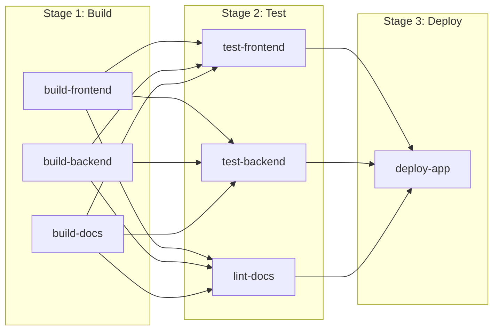
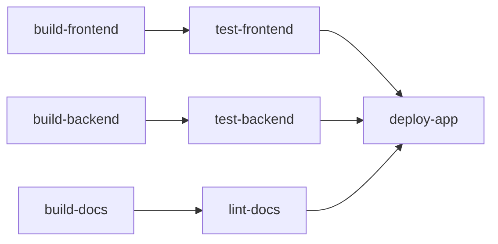
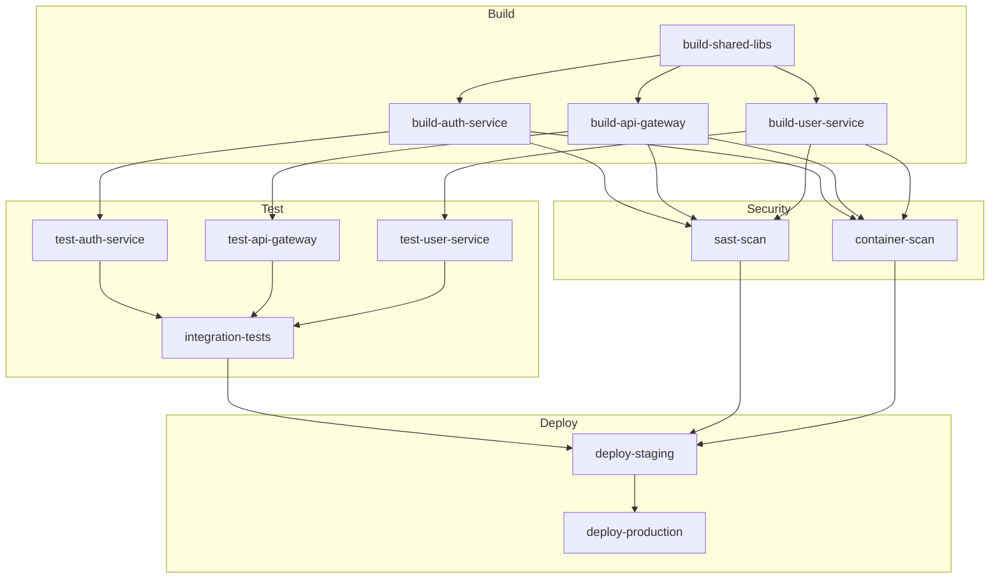
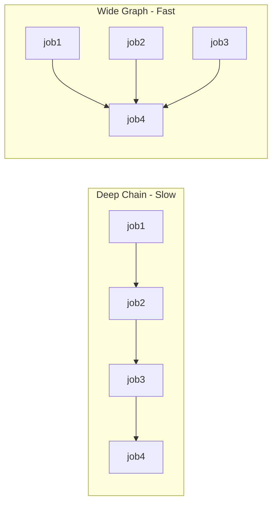

# How to Build GitLab CI Directed Acyclic Graph

Author: [nawazdhandala](https://github.com/nawazdhandala)

Tags: GitLab CI, Pipeline, DAG, CI/CD

Description: Learn how to use the needs keyword to build Directed Acyclic Graph pipelines in GitLab CI for faster parallel execution and smarter dependency management.

---

GitLab CI pipelines run stages sequentially by default. Every job in stage N waits for every job in stage N-1 to finish, even when there's no actual dependency. The `needs` keyword changes this by letting you define explicit job dependencies, creating a Directed Acyclic Graph (DAG) that runs jobs as soon as their actual dependencies complete.

## How Traditional Stages Work



In this model, `test-frontend` waits for `build-docs` to finish even though it only needs `build-frontend`. That's wasted time.

## The DAG Approach

With `needs`, you specify exactly which jobs must complete before a job can start:



Now `test-frontend` starts immediately after `build-frontend` finishes, regardless of whether `build-backend` or `build-docs` are still running.

## Basic DAG Pipeline Example

Here's a `.gitlab-ci.yml` that implements the DAG pattern:

```yaml
stages:
  - build
  - test
  - deploy

build-frontend:
  stage: build
  script:
    - npm ci
    - npm run build
  artifacts:
    paths:
      - dist/

build-backend:
  stage: build
  script:
    - go build -o bin/api ./cmd/api
  artifacts:
    paths:
      - bin/

build-docs:
  stage: build
  script:
    - mkdocs build
  artifacts:
    paths:
      - site/

test-frontend:
  stage: test
  needs: [build-frontend]
  script:
    - npm run test:unit
    - npm run test:e2e

test-backend:
  stage: test
  needs: [build-backend]
  script:
    - go test ./...

lint-docs:
  stage: test
  needs: [build-docs]
  script:
    - vale site/

deploy-app:
  stage: deploy
  needs: [test-frontend, test-backend, lint-docs]
  script:
    - ./deploy.sh
  environment:
    name: production
```

## Parallel Execution with Complex Dependencies

Real projects have more complex dependency graphs. Here's a pipeline for a microservices application:



The corresponding `.gitlab-ci.yml`:

```yaml
stages:
  - build
  - test
  - security
  - deploy

variables:
  DOCKER_REGISTRY: registry.example.com

# Shared libraries must build first
build-shared-libs:
  stage: build
  script:
    - npm ci
    - npm run build:libs
  artifacts:
    paths:
      - packages/shared/dist/
    expire_in: 1 hour

# Service builds depend on shared libs
build-auth-service:
  stage: build
  needs: [build-shared-libs]
  script:
    - docker build -t $DOCKER_REGISTRY/auth:$CI_COMMIT_SHA ./services/auth
    - docker push $DOCKER_REGISTRY/auth:$CI_COMMIT_SHA

build-api-gateway:
  stage: build
  needs: [build-shared-libs]
  script:
    - docker build -t $DOCKER_REGISTRY/gateway:$CI_COMMIT_SHA ./services/gateway
    - docker push $DOCKER_REGISTRY/gateway:$CI_COMMIT_SHA

build-user-service:
  stage: build
  needs: [build-shared-libs]
  script:
    - docker build -t $DOCKER_REGISTRY/user:$CI_COMMIT_SHA ./services/user
    - docker push $DOCKER_REGISTRY/user:$CI_COMMIT_SHA

# Unit tests run immediately after their service builds
test-auth-service:
  stage: test
  needs: [build-auth-service]
  script:
    - docker run $DOCKER_REGISTRY/auth:$CI_COMMIT_SHA npm test

test-api-gateway:
  stage: test
  needs: [build-api-gateway]
  script:
    - docker run $DOCKER_REGISTRY/gateway:$CI_COMMIT_SHA npm test

test-user-service:
  stage: test
  needs: [build-user-service]
  script:
    - docker run $DOCKER_REGISTRY/user:$CI_COMMIT_SHA npm test

# Integration tests need all services tested
integration-tests:
  stage: test
  needs:
    - test-auth-service
    - test-api-gateway
    - test-user-service
  script:
    - docker compose -f docker-compose.test.yml up -d
    - npm run test:integration
    - docker compose -f docker-compose.test.yml down

# Security scans run in parallel with tests
sast-scan:
  stage: security
  needs:
    - build-auth-service
    - build-api-gateway
    - build-user-service
  script:
    - semgrep scan --config auto ./services

container-scan:
  stage: security
  needs:
    - build-auth-service
    - build-api-gateway
    - build-user-service
  script:
    - trivy image $DOCKER_REGISTRY/auth:$CI_COMMIT_SHA
    - trivy image $DOCKER_REGISTRY/gateway:$CI_COMMIT_SHA
    - trivy image $DOCKER_REGISTRY/user:$CI_COMMIT_SHA

# Deploy requires both tests and security to pass
deploy-staging:
  stage: deploy
  needs:
    - integration-tests
    - sast-scan
    - container-scan
  script:
    - kubectl apply -f k8s/staging/
  environment:
    name: staging

deploy-production:
  stage: deploy
  needs: [deploy-staging]
  script:
    - kubectl apply -f k8s/production/
  environment:
    name: production
  when: manual
```

## Passing Artifacts Between Jobs

When using `needs`, artifacts from dependent jobs are automatically downloaded. You can control this behavior:

```yaml
build-app:
  stage: build
  script:
    - npm run build
  artifacts:
    paths:
      - dist/
    expire_in: 1 hour

test-app:
  stage: test
  needs:
    - job: build-app
      artifacts: true  # Download artifacts (default)
  script:
    - npm test

deploy-app:
  stage: deploy
  needs:
    - job: build-app
      artifacts: true
    - job: test-app
      artifacts: false  # Skip artifacts from test job
  script:
    - ./deploy.sh dist/
```

## Optional Dependencies

Sometimes a job should run even if a dependency fails or is skipped:

```yaml
build-app:
  stage: build
  script:
    - npm run build
  rules:
    - if: $CI_COMMIT_BRANCH == "main"

# Runs even if build-app was skipped (on non-main branches)
lint-code:
  stage: test
  needs:
    - job: build-app
      optional: true
  script:
    - npm run lint
```

## Combining DAG with Parallel Matrix Jobs

You can combine `needs` with `parallel:matrix` for powerful parallel execution:

```yaml
stages:
  - build
  - test
  - deploy

build:
  stage: build
  parallel:
    matrix:
      - SERVICE: [auth, gateway, user, notification]
  script:
    - docker build -t $REGISTRY/$SERVICE:$CI_COMMIT_SHA ./services/$SERVICE
    - docker push $REGISTRY/$SERVICE:$CI_COMMIT_SHA

test:
  stage: test
  parallel:
    matrix:
      - SERVICE: [auth, gateway, user, notification]
  needs:
    - job: build
      parallel:
        matrix:
          - SERVICE: $SERVICE
  script:
    - docker run $REGISTRY/$SERVICE:$CI_COMMIT_SHA npm test

deploy:
  stage: deploy
  needs:
    - job: test
      parallel:
        matrix:
          - SERVICE: [auth, gateway, user, notification]
  script:
    - ./deploy-all.sh
```

## Performance Optimization Tips

### 1. Minimize Artifact Size

Large artifacts slow down job startup. Only include what downstream jobs actually need:

```yaml
build:
  artifacts:
    paths:
      - dist/          # Only the build output
    exclude:
      - dist/**/*.map  # Skip source maps for most jobs
    expire_in: 1 hour  # Clean up quickly
```

### 2. Use needs:artifacts Wisely

Skip artifact downloads when a job only needs to know another job succeeded:

```yaml
notify-slack:
  stage: notify
  needs:
    - job: deploy-production
      artifacts: false  # Just need to know deploy succeeded
  script:
    - curl -X POST $SLACK_WEBHOOK -d '{"text":"Deployed!"}'
```

### 3. Keep DAG Depth Shallow

Deep dependency chains limit parallelism. Restructure when possible:



### 4. Set Resource Limits

Limit concurrent jobs to avoid overwhelming shared runners:

```yaml
# In project settings or .gitlab-ci.yml
variables:
  # Limit concurrent jobs
  CI_PARALLEL_JOBS: 10
```

## Debugging DAG Pipelines

### Visualize the Graph

GitLab shows your DAG in the pipeline view. Click "Needs" tab to see job dependencies as a graph.

### Check Job Dependencies

Use the API to inspect job relationships:

```bash
curl --header "PRIVATE-TOKEN: $GITLAB_TOKEN" \
  "https://gitlab.com/api/v4/projects/$PROJECT_ID/pipelines/$PIPELINE_ID/jobs" | \
  jq '.[] | {name: .name, needs: .needs}'
```

### Common Errors

**Circular dependency detected:**
```yaml
# This fails - jobs depend on each other
job-a:
  needs: [job-b]

job-b:
  needs: [job-a]
```

**needs: job not found:**
```yaml
# This fails - job name must match exactly
build-app:
  script: echo "building"

test-app:
  needs: [build_app]  # Wrong: underscore vs hyphen
```

## Real-World Example: Monorepo Pipeline

Here's a complete pipeline for a monorepo with multiple packages:

```yaml
stages:
  - setup
  - build
  - test
  - publish

variables:
  NODE_VERSION: "20"

# Detect which packages changed
detect-changes:
  stage: setup
  script:
    - |
      if git diff --name-only $CI_MERGE_REQUEST_DIFF_BASE_SHA HEAD | grep -q "^packages/core/"; then
        echo "CORE_CHANGED=true" >> changes.env
      fi
      if git diff --name-only $CI_MERGE_REQUEST_DIFF_BASE_SHA HEAD | grep -q "^packages/ui/"; then
        echo "UI_CHANGED=true" >> changes.env
      fi
      if git diff --name-only $CI_MERGE_REQUEST_DIFF_BASE_SHA HEAD | grep -q "^packages/api/"; then
        echo "API_CHANGED=true" >> changes.env
      fi
  artifacts:
    reports:
      dotenv: changes.env

# Build only changed packages
build-core:
  stage: build
  needs: [detect-changes]
  rules:
    - if: $CORE_CHANGED == "true"
  script:
    - cd packages/core && npm ci && npm run build
  artifacts:
    paths:
      - packages/core/dist/

build-ui:
  stage: build
  needs:
    - detect-changes
    - job: build-core
      optional: true
  rules:
    - if: $UI_CHANGED == "true"
  script:
    - cd packages/ui && npm ci && npm run build
  artifacts:
    paths:
      - packages/ui/dist/

build-api:
  stage: build
  needs:
    - detect-changes
    - job: build-core
      optional: true
  rules:
    - if: $API_CHANGED == "true"
  script:
    - cd packages/api && npm ci && npm run build
  artifacts:
    paths:
      - packages/api/dist/

# Test packages in parallel
test-core:
  stage: test
  needs:
    - job: build-core
      optional: true
  rules:
    - if: $CORE_CHANGED == "true"
  script:
    - cd packages/core && npm test

test-ui:
  stage: test
  needs:
    - job: build-ui
      optional: true
  rules:
    - if: $UI_CHANGED == "true"
  script:
    - cd packages/ui && npm test

test-api:
  stage: test
  needs:
    - job: build-api
      optional: true
  rules:
    - if: $API_CHANGED == "true"
  script:
    - cd packages/api && npm test

# Publish only on main
publish:
  stage: publish
  needs:
    - job: test-core
      optional: true
    - job: test-ui
      optional: true
    - job: test-api
      optional: true
  rules:
    - if: $CI_COMMIT_BRANCH == "main"
  script:
    - npm publish --workspaces
```

---

DAG pipelines with `needs` can cut your CI time significantly by running jobs as soon as their actual dependencies finish. Start by mapping out what each job truly depends on, then update your `.gitlab-ci.yml` to reflect those relationships. The visualization tools in GitLab make it easy to verify your dependency graph is correct. Monitor your pipeline duration over time to measure the improvement.
