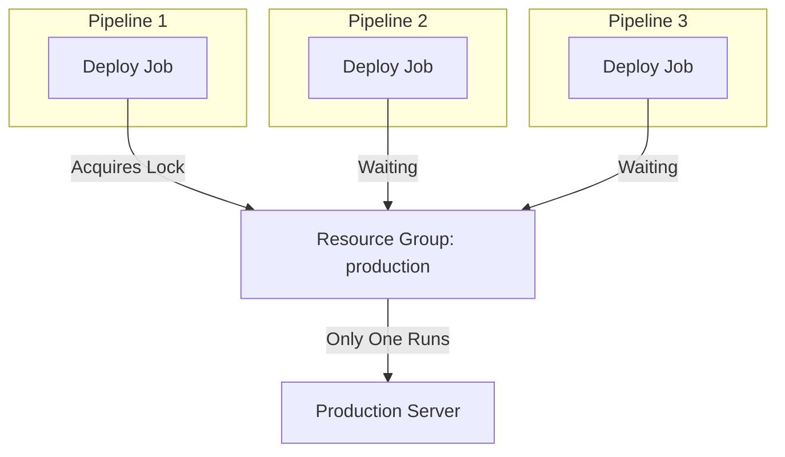
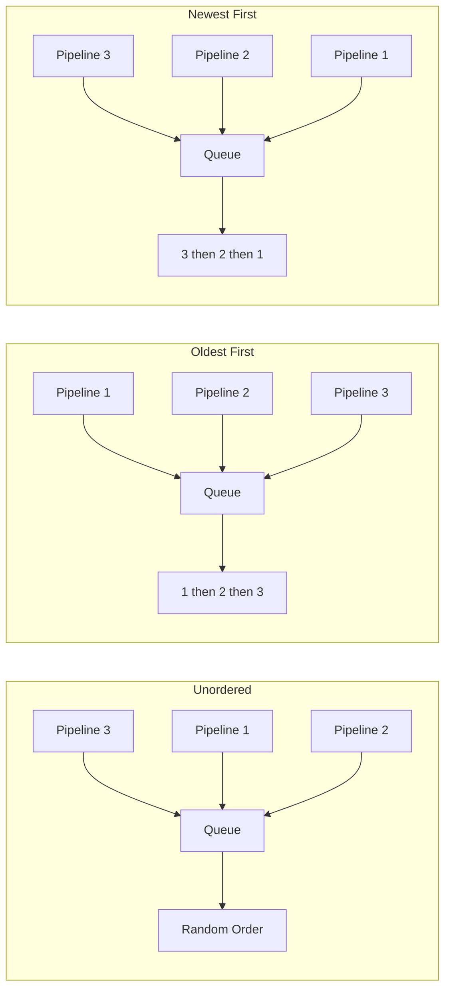
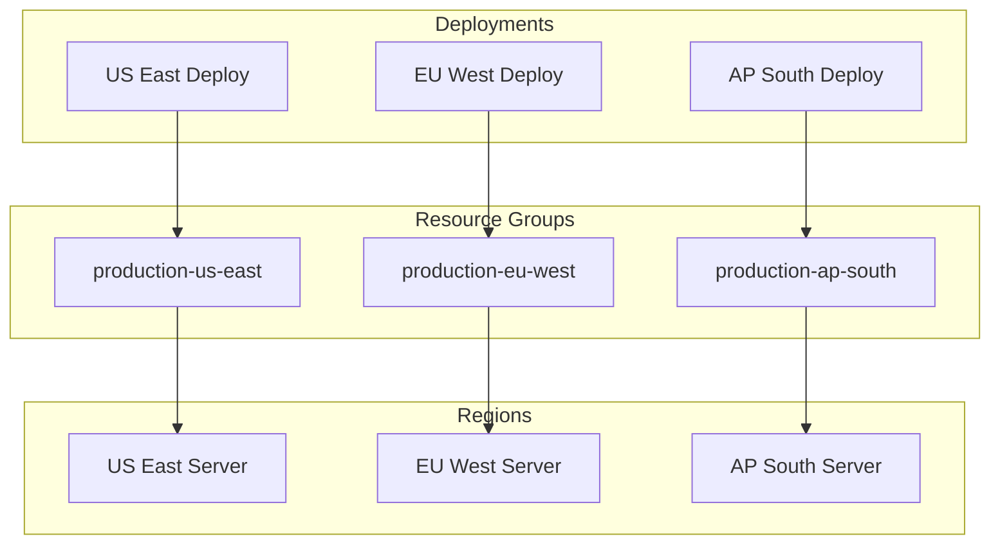
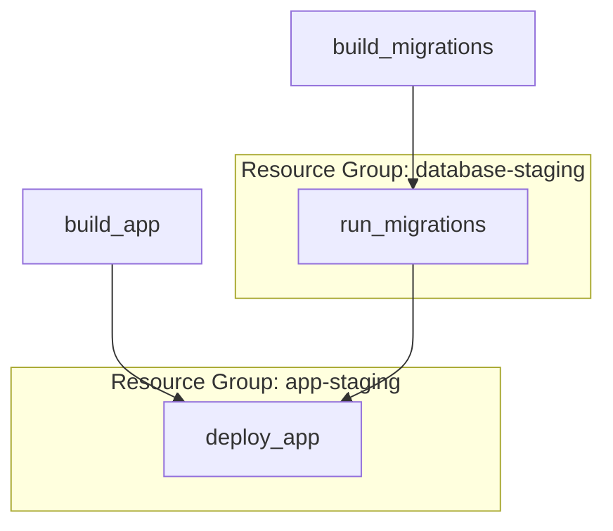
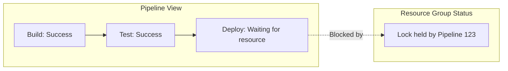

# How to Implement GitLab CI Resource Groups

Author: [nawazdhandala](https://github.com/nawazdhandala)

Tags: GitLab CI, CI/CD, Concurrency, DevOps

Description: A complete guide to implementing GitLab CI resource groups for controlling job concurrency, preventing deployment conflicts, and managing shared resources in your CI/CD pipelines.

---

Resource groups in GitLab CI let you control which jobs can run simultaneously. When multiple pipelines try to deploy to the same environment or access the same shared resource, resource groups prevent conflicts by ensuring only one job runs at a time.

## What Are Resource Groups?

Resource groups act as mutexes (mutual exclusion locks) for your CI/CD jobs. When a job belongs to a resource group, GitLab ensures that only one job from that group executes at any given time across all pipelines.



Without resource groups, multiple deployments could run simultaneously, causing:
- Race conditions during database migrations
- Inconsistent application states
- Failed deployments due to resource conflicts
- Corrupted data or configurations

## Basic Syntax

Add the `resource_group` keyword to any job:

```yaml
deploy_production:
  stage: deploy
  resource_group: production
  script:
    - ./deploy.sh production
```

All jobs sharing the same `resource_group` value will run one at a time, even across different pipelines.

## Practical Example: Multi-Environment Deployment

Here is a complete `.gitlab-ci.yml` demonstrating resource groups for a typical web application:

```yaml
stages:
  - build
  - test
  - deploy

variables:
  DOCKER_IMAGE: $CI_REGISTRY_IMAGE:$CI_COMMIT_SHA

# Build runs in parallel - no resource group needed
build:
  stage: build
  script:
    - docker build -t $DOCKER_IMAGE .
    - docker push $DOCKER_IMAGE

# Tests can run in parallel
test:
  stage: test
  script:
    - docker run $DOCKER_IMAGE npm test

# Staging deployment - one at a time
deploy_staging:
  stage: deploy
  resource_group: staging
  environment:
    name: staging
    url: https://staging.example.com
  script:
    - kubectl set image deployment/myapp myapp=$DOCKER_IMAGE -n staging
    - kubectl rollout status deployment/myapp -n staging
  only:
    - develop

# Production deployment - one at a time, separate from staging
deploy_production:
  stage: deploy
  resource_group: production
  environment:
    name: production
    url: https://example.com
  script:
    - kubectl set image deployment/myapp myapp=$DOCKER_IMAGE -n production
    - kubectl rollout status deployment/myapp -n production
  only:
    - main
  when: manual
```

In this configuration:
- Multiple `build` and `test` jobs can run simultaneously
- Only one `deploy_staging` job runs at a time across all pipelines
- Only one `deploy_production` job runs at a time across all pipelines
- Staging and production deployments can run in parallel since they use different resource groups

## Process Modes

GitLab offers three process modes that control how jobs in a resource group are queued:

### 1. Unordered (Default)

Jobs are processed as they become ready, regardless of pipeline creation order.

```yaml
deploy:
  resource_group: production
  # process_mode: unordered (default)
```

### 2. Oldest First

Jobs from older pipelines are prioritized:

```yaml
deploy:
  resource_group: production
```

Configure at the project level via API:

```bash
curl --request PUT \
  --header "PRIVATE-TOKEN: $GITLAB_TOKEN" \
  --data "process_mode=oldest_first" \
  "https://gitlab.example.com/api/v4/projects/$PROJECT_ID/resource_groups/production"
```

### 3. Newest First

Jobs from newer pipelines are prioritized, useful when you want the latest code deployed:

```bash
curl --request PUT \
  --header "PRIVATE-TOKEN: $GITLAB_TOKEN" \
  --data "process_mode=newest_first" \
  "https://gitlab.example.com/api/v4/projects/$PROJECT_ID/resource_groups/production"
```



## Dynamic Resource Groups

Use CI/CD variables to create dynamic resource groups:

### Per-Branch Resource Groups

```yaml
deploy_review:
  stage: deploy
  resource_group: review-$CI_COMMIT_REF_SLUG
  environment:
    name: review/$CI_COMMIT_REF_SLUG
    url: https://$CI_COMMIT_REF_SLUG.review.example.com
  script:
    - ./deploy-review.sh
  only:
    - merge_requests
```

Each branch gets its own resource group, allowing parallel review app deployments while preventing conflicts within the same branch.

### Per-Region Resource Groups

```yaml
.deploy_template:
  stage: deploy
  script:
    - ./deploy.sh $REGION

deploy_us_east:
  extends: .deploy_template
  resource_group: production-us-east
  variables:
    REGION: us-east-1

deploy_eu_west:
  extends: .deploy_template
  resource_group: production-eu-west
  variables:
    REGION: eu-west-1

deploy_ap_south:
  extends: .deploy_template
  resource_group: production-ap-south
  variables:
    REGION: ap-south-1
```



This allows deployments to different regions to run in parallel while ensuring each region only receives one deployment at a time.

## Database Migrations with Resource Groups

Database migrations are a perfect use case for resource groups:

```yaml
stages:
  - build
  - migrate
  - deploy

migrate_database:
  stage: migrate
  resource_group: database-$CI_ENVIRONMENT_NAME
  script:
    - ./run-migrations.sh
  rules:
    - if: $CI_COMMIT_BRANCH == "main"
      variables:
        CI_ENVIRONMENT_NAME: production
    - if: $CI_COMMIT_BRANCH == "develop"
      variables:
        CI_ENVIRONMENT_NAME: staging

deploy:
  stage: deploy
  resource_group: deploy-$CI_ENVIRONMENT_NAME
  needs:
    - migrate_database
  script:
    - ./deploy.sh
  rules:
    - if: $CI_COMMIT_BRANCH == "main"
      variables:
        CI_ENVIRONMENT_NAME: production
    - if: $CI_COMMIT_BRANCH == "develop"
      variables:
        CI_ENVIRONMENT_NAME: staging
```

## Combining with Other Concurrency Controls

### Resource Groups + Interruptible

Cancel older pending jobs when a new pipeline starts:

```yaml
deploy:
  stage: deploy
  resource_group: production
  interruptible: false  # Don't cancel running deploys
  script:
    - ./deploy.sh

test:
  stage: test
  interruptible: true  # Can be cancelled
  script:
    - npm test
```

### Resource Groups + Needs (DAG)

Control job dependencies while maintaining concurrency limits:

```yaml
stages:
  - build
  - test
  - deploy

build_app:
  stage: build
  script:
    - docker build -t app .

build_migrations:
  stage: build
  script:
    - docker build -t migrations .

run_migrations:
  stage: test
  resource_group: database-staging
  needs:
    - build_migrations
  script:
    - docker run migrations

deploy_app:
  stage: deploy
  resource_group: app-staging
  needs:
    - build_app
    - run_migrations
  script:
    - docker run app deploy
```



## Real-World Patterns

### Pattern 1: Blue-Green Deployments

```yaml
variables:
  CURRENT_SLOT: blue
  TARGET_SLOT: green

determine_slots:
  stage: prepare
  script:
    - |
      CURRENT=$(kubectl get service myapp -o jsonpath='{.spec.selector.slot}')
      if [ "$CURRENT" = "blue" ]; then
        echo "TARGET_SLOT=green" >> deploy.env
        echo "CURRENT_SLOT=blue" >> deploy.env
      else
        echo "TARGET_SLOT=blue" >> deploy.env
        echo "CURRENT_SLOT=green" >> deploy.env
      fi
  artifacts:
    reports:
      dotenv: deploy.env

deploy_to_target:
  stage: deploy
  resource_group: production-deployment
  needs:
    - determine_slots
  script:
    - kubectl set image deployment/myapp-$TARGET_SLOT myapp=$DOCKER_IMAGE
    - kubectl rollout status deployment/myapp-$TARGET_SLOT

switch_traffic:
  stage: deploy
  resource_group: production-traffic
  needs:
    - deploy_to_target
  script:
    - kubectl patch service myapp -p '{"spec":{"selector":{"slot":"'$TARGET_SLOT'"}}}'
  when: manual
```

### Pattern 2: Canary Deployments

```yaml
deploy_canary:
  stage: deploy
  resource_group: production-canary
  script:
    - kubectl set image deployment/myapp-canary myapp=$DOCKER_IMAGE
    - kubectl scale deployment/myapp-canary --replicas=1
  environment:
    name: production-canary

verify_canary:
  stage: verify
  needs:
    - deploy_canary
  script:
    - ./run-smoke-tests.sh https://canary.example.com
    - ./check-error-rates.sh

deploy_full:
  stage: deploy
  resource_group: production-main
  needs:
    - verify_canary
  script:
    - kubectl set image deployment/myapp myapp=$DOCKER_IMAGE
    - kubectl rollout status deployment/myapp
  when: manual
```

### Pattern 3: Shared Infrastructure Resources

When multiple projects share infrastructure:

```yaml
# Project A: API Service
deploy_api:
  resource_group: shared-kubernetes-cluster
  script:
    - kubectl apply -f k8s/api/

# Project B: Worker Service
deploy_worker:
  resource_group: shared-kubernetes-cluster
  script:
    - kubectl apply -f k8s/worker/
```

Note: Resource groups are project-scoped by default. For cross-project resource groups, consider using external locking mechanisms or GitLab Premium features.

## Monitoring Resource Group Usage

### View Resource Group Status via API

```bash
# List all resource groups in a project
curl --header "PRIVATE-TOKEN: $GITLAB_TOKEN" \
  "https://gitlab.example.com/api/v4/projects/$PROJECT_ID/resource_groups"

# Get specific resource group details
curl --header "PRIVATE-TOKEN: $GITLAB_TOKEN" \
  "https://gitlab.example.com/api/v4/projects/$PROJECT_ID/resource_groups/production"

# List upcoming jobs in a resource group
curl --header "PRIVATE-TOKEN: $GITLAB_TOKEN" \
  "https://gitlab.example.com/api/v4/projects/$PROJECT_ID/resource_groups/production/upcoming_jobs"
```

### Pipeline Visualization

GitLab shows resource group status in the pipeline view:



## Troubleshooting

### Jobs Stuck in Waiting State

If jobs remain stuck waiting for a resource group:

1. Check for zombie jobs holding the lock:

```bash
curl --header "PRIVATE-TOKEN: $GITLAB_TOKEN" \
  "https://gitlab.example.com/api/v4/projects/$PROJECT_ID/resource_groups/production/upcoming_jobs"
```

2. Cancel stuck pipelines manually

3. If necessary, delete and recreate the resource group:

```bash
# Delete (releases all locks)
curl --request DELETE \
  --header "PRIVATE-TOKEN: $GITLAB_TOKEN" \
  "https://gitlab.example.com/api/v4/projects/$PROJECT_ID/resource_groups/production"
```

### Job Times Out While Waiting

Increase timeout or use `oldest_first` mode to ensure predictable ordering:

```yaml
deploy:
  resource_group: production
  timeout: 2h  # Increase timeout for waiting
  script:
    - ./deploy.sh
```

### Race Conditions Still Occurring

Ensure all related jobs use the same resource group name:

```yaml
# Wrong - different resource groups
deploy_a:
  resource_group: production

deploy_b:
  resource_group: prod  # Different name!

# Correct - same resource group
deploy_a:
  resource_group: production

deploy_b:
  resource_group: production
```

## Best Practices

### 1. Use Descriptive Resource Group Names

```yaml
# Good - clear and specific
resource_group: production-api-us-east-1
resource_group: staging-database-migrations

# Avoid - too generic
resource_group: deploy
resource_group: prod
```

### 2. Scope Resource Groups Appropriately

```yaml
# Per-environment (common)
resource_group: $CI_ENVIRONMENT_NAME

# Per-service-per-environment (more granular)
resource_group: $SERVICE_NAME-$CI_ENVIRONMENT_NAME

# Per-resource type
resource_group: database-$CI_ENVIRONMENT_NAME
resource_group: cache-$CI_ENVIRONMENT_NAME
```

### 3. Document Resource Groups

Add comments explaining why resource groups are used:

```yaml
deploy:
  # Resource group prevents concurrent deployments that could cause
  # database migration conflicts or partial rollouts
  resource_group: production
  script:
    - ./deploy.sh
```

### 4. Combine with Environments

Always pair resource groups with environments for better visibility:

```yaml
deploy:
  resource_group: production
  environment:
    name: production
    url: https://example.com
  script:
    - ./deploy.sh
```

### 5. Plan for Failure

Ensure your deployment scripts are idempotent so that failed jobs can be safely retried:

```yaml
deploy:
  resource_group: production
  script:
    - ./deploy.sh  # Must handle partial failures gracefully
  retry:
    max: 2
    when: script_failure
```

---

Resource groups are essential for safe, predictable deployments. Start by adding resource groups to your production deployment jobs, then expand to other shared resources like databases, caches, and external services. The small addition of a `resource_group` keyword prevents hours of debugging deployment conflicts.
