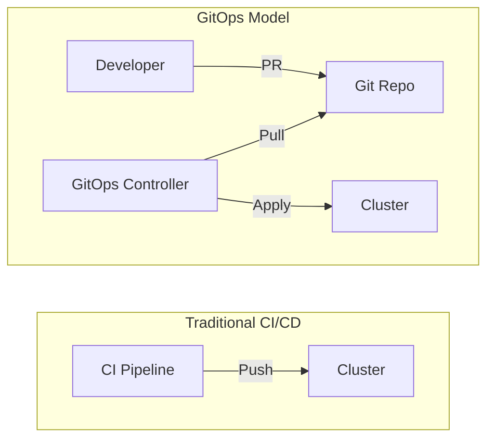
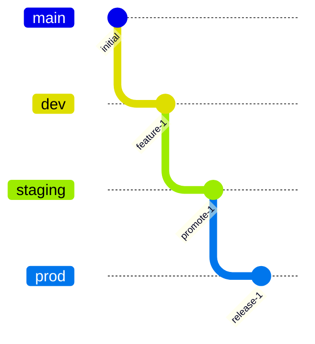
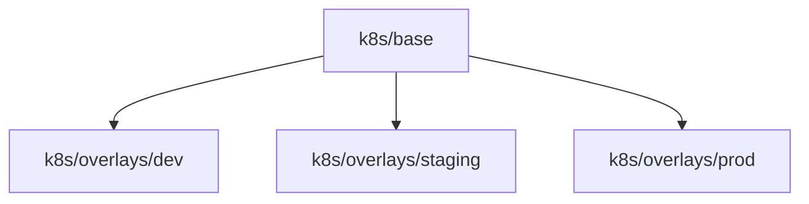
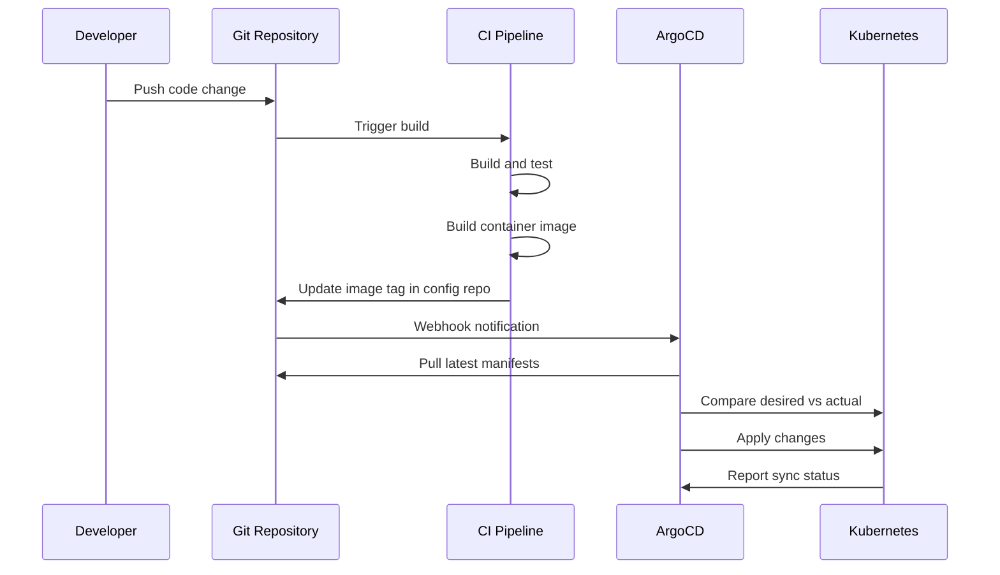

# How to Create GitOps Deployment Patterns

Author: [nawazdhandala](https://github.com/nawazdhandala)

Tags: GitOps, Deployment, Kubernetes, DevOps

Description: A practical guide to structuring GitOps repositories, implementing sync strategies, and managing multiple environments with ArgoCD and Flux.

---

GitOps puts Git at the center of your deployment workflow. Every infrastructure change flows through pull requests, gets reviewed, and leaves an audit trail. This guide covers the deployment patterns that make GitOps work at scale.

## What Makes GitOps Different

Traditional deployments push changes from CI pipelines to clusters. GitOps flips this model. A controller inside the cluster pulls desired state from Git and reconciles continuously.



Benefits of the pull model:

- **Single source of truth**: Git history shows exactly what ran when
- **Drift detection**: Controllers spot manual changes and can auto-correct
- **Rollback simplicity**: Revert a commit to roll back a deployment
- **Security**: Clusters pull changes instead of CI needing cluster credentials

## Repository Structure Patterns

How you organize your Git repositories shapes your entire GitOps workflow. Three patterns dominate.

### Pattern 1: Monorepo

Everything lives in one repository. Application code, Kubernetes manifests, and environment configs share the same Git history.

```
myapp/
├── src/
│   └── main.go
├── Dockerfile
├── k8s/
│   ├── base/
│   │   ├── kustomization.yaml
│   │   ├── deployment.yaml
│   │   ├── service.yaml
│   │   └── hpa.yaml
│   └── overlays/
│       ├── dev/
│       │   ├── kustomization.yaml
│       │   └── replicas-patch.yaml
│       ├── staging/
│       │   ├── kustomization.yaml
│       │   └── replicas-patch.yaml
│       └── prod/
│           ├── kustomization.yaml
│           └── replicas-patch.yaml
└── .github/
    └── workflows/
        └── build.yaml
```

**When to use**: Small teams, single application, tight coupling between code and config changes.

**Watch out**: CI builds trigger on every commit, including config-only changes. Use path filters in your CI workflows.

### Pattern 2: Separate Config Repository

Application code and deployment configs live in different repositories. CI builds images and updates image tags in the config repo.

```
# App repository (myapp)
myapp/
├── src/
├── Dockerfile
└── .github/workflows/build.yaml  # Updates config repo

# Config repository (myapp-config)
myapp-config/
├── base/
│   ├── kustomization.yaml
│   ├── deployment.yaml
│   └── service.yaml
└── overlays/
    ├── dev/
    ├── staging/
    └── prod/
```

**When to use**: Multiple teams, different change cadences for code vs config, audit requirements that separate concerns.

**CI workflow for updating config repo**:

```yaml
# In app repository: .github/workflows/build.yaml
name: Build and Update Config
on:
  push:
    branches: [main]

jobs:
  build:
    runs-on: ubuntu-latest
    steps:
      - uses: actions/checkout@v4

      - name: Build and push image
        run: |
          docker build -t myregistry/myapp:${{ github.sha }} .
          docker push myregistry/myapp:${{ github.sha }}

      - name: Update config repository
        run: |
          git clone https://github.com/myorg/myapp-config.git
          cd myapp-config
          kustomize edit set image myapp=myregistry/myapp:${{ github.sha }}
          git commit -am "Update image to ${{ github.sha }}"
          git push
```

### Pattern 3: Multi-Tenant Platform Repository

A central repository manages deployments for multiple applications across multiple clusters. Platform teams own the structure; app teams submit PRs for their namespaces.

```
platform-config/
├── clusters/
│   ├── dev-us-east/
│   │   ├── flux-system/
│   │   └── tenants/
│   │       ├── team-alpha/
│   │       └── team-beta/
│   ├── staging-us-east/
│   └── prod-us-east/
├── infrastructure/
│   ├── sources/
│   ├── monitoring/
│   └── ingress/
└── tenants/
    ├── team-alpha/
    │   ├── base/
    │   └── overlays/
    └── team-beta/
        ├── base/
        └── overlays/
```

**When to use**: Platform engineering teams supporting multiple product teams, consistent policy enforcement needed.

## Environment Management Strategies

### Strategy 1: Branch per Environment

Each environment tracks a different Git branch. Simple but creates merge headaches.



**ArgoCD configuration**:

```yaml
apiVersion: argoproj.io/v1alpha1
kind: Application
metadata:
  name: myapp-prod
  namespace: argocd
spec:
  source:
    repoURL: https://github.com/myorg/myapp-config.git
    targetRevision: prod  # Branch name
    path: k8s
  destination:
    server: https://kubernetes.default.svc
    namespace: production
```

**Flux configuration**:

```yaml
apiVersion: source.toolkit.fluxcd.io/v1
kind: GitRepository
metadata:
  name: myapp-prod
  namespace: flux-system
spec:
  url: https://github.com/myorg/myapp-config.git
  ref:
    branch: prod
  interval: 1m
```

### Strategy 2: Directory per Environment (Recommended)

All environments live on the same branch in different directories. Kustomize overlays handle environment-specific values.



**Base kustomization**:

```yaml
# k8s/base/kustomization.yaml
apiVersion: kustomize.config.k8s.io/v1beta1
kind: Kustomization
resources:
  - deployment.yaml
  - service.yaml
  - configmap.yaml
```

**Production overlay**:

```yaml
# k8s/overlays/prod/kustomization.yaml
apiVersion: kustomize.config.k8s.io/v1beta1
kind: Kustomization
namespace: production
resources:
  - ../../base
patches:
  - path: replicas-patch.yaml
  - path: resources-patch.yaml
images:
  - name: myapp
    newTag: v2.1.0
```

```yaml
# k8s/overlays/prod/replicas-patch.yaml
apiVersion: apps/v1
kind: Deployment
metadata:
  name: myapp
spec:
  replicas: 5
```

### Strategy 3: Tag-Based Promotion

Environments track Git tags rather than branches or directories. Promotion means creating a new tag.

```yaml
# ArgoCD tracking a tag pattern
apiVersion: argoproj.io/v1alpha1
kind: Application
metadata:
  name: myapp-prod
spec:
  source:
    repoURL: https://github.com/myorg/myapp-config.git
    targetRevision: prod-*  # Tracks tags matching pattern
    path: k8s/prod
```

## Sync Strategies

### Manual Sync

Changes require explicit approval. Best for production environments.

**ArgoCD**:

```yaml
apiVersion: argoproj.io/v1alpha1
kind: Application
metadata:
  name: myapp-prod
spec:
  syncPolicy: {}  # No automated sync
```

**Flux**:

```yaml
apiVersion: kustomize.toolkit.fluxcd.io/v1
kind: Kustomization
metadata:
  name: myapp-prod
spec:
  interval: 10m
  suspend: true  # Requires manual resume
```

### Automated Sync with Self-Healing

The controller applies changes automatically and reverts manual drift.

**ArgoCD**:

```yaml
apiVersion: argoproj.io/v1alpha1
kind: Application
metadata:
  name: myapp-dev
spec:
  syncPolicy:
    automated:
      prune: true      # Delete resources removed from Git
      selfHeal: true   # Revert manual cluster changes
    syncOptions:
      - CreateNamespace=true
```

**Flux**:

```yaml
apiVersion: kustomize.toolkit.fluxcd.io/v1
kind: Kustomization
metadata:
  name: myapp-dev
spec:
  interval: 5m
  prune: true
  force: false  # Set true to overwrite conflicts
  path: ./k8s/overlays/dev
  sourceRef:
    kind: GitRepository
    name: myapp
```

### Progressive Sync with Waves

Deploy resources in a specific order. Critical for CRDs, namespaces, and dependent services.

**ArgoCD sync waves**:

```yaml
# Wave -1: CRDs first
apiVersion: apiextensions.k8s.io/v1
kind: CustomResourceDefinition
metadata:
  annotations:
    argocd.argoproj.io/sync-wave: "-1"
---
# Wave 0: Namespace
apiVersion: v1
kind: Namespace
metadata:
  name: myapp
  annotations:
    argocd.argoproj.io/sync-wave: "0"
---
# Wave 1: ConfigMaps and Secrets
apiVersion: v1
kind: ConfigMap
metadata:
  annotations:
    argocd.argoproj.io/sync-wave: "1"
---
# Wave 2: Deployments
apiVersion: apps/v1
kind: Deployment
metadata:
  annotations:
    argocd.argoproj.io/sync-wave: "2"
```

**Flux dependencies**:

```yaml
apiVersion: kustomize.toolkit.fluxcd.io/v1
kind: Kustomization
metadata:
  name: myapp
spec:
  dependsOn:
    - name: infrastructure
    - name: cert-manager
  path: ./k8s/overlays/prod
```

## Multi-Cluster Deployment

### ArgoCD ApplicationSet

Generate applications dynamically across clusters.

```yaml
apiVersion: argoproj.io/v1alpha1
kind: ApplicationSet
metadata:
  name: myapp-all-clusters
  namespace: argocd
spec:
  generators:
    - clusters:
        selector:
          matchLabels:
            env: production
  template:
    metadata:
      name: 'myapp-{{name}}'
    spec:
      project: default
      source:
        repoURL: https://github.com/myorg/myapp-config.git
        targetRevision: HEAD
        path: k8s/overlays/prod
      destination:
        server: '{{server}}'
        namespace: myapp
      syncPolicy:
        automated:
          prune: true
```

### Flux Multi-Cluster with Cluster API

```yaml
# Bootstrap flux on each cluster
apiVersion: source.toolkit.fluxcd.io/v1
kind: GitRepository
metadata:
  name: flux-system
  namespace: flux-system
spec:
  url: https://github.com/myorg/platform-config.git
  ref:
    branch: main
---
apiVersion: kustomize.toolkit.fluxcd.io/v1
kind: Kustomization
metadata:
  name: cluster-config
  namespace: flux-system
spec:
  path: ./clusters/${CLUSTER_NAME}
  sourceRef:
    kind: GitRepository
    name: flux-system
  postBuild:
    substituteFrom:
      - kind: ConfigMap
        name: cluster-vars
```

## Handling Secrets in GitOps

Never commit plain secrets to Git. Three approaches work well.

### Sealed Secrets

Encrypt secrets with a cluster-specific key. Only the controller can decrypt.

```bash
# Install kubeseal
brew install kubeseal

# Create sealed secret
kubectl create secret generic db-creds \
  --from-literal=password=supersecret \
  --dry-run=client -o yaml | \
  kubeseal --format yaml > sealed-db-creds.yaml
```

```yaml
# sealed-db-creds.yaml (safe to commit)
apiVersion: bitnami.com/v1alpha1
kind: SealedSecret
metadata:
  name: db-creds
spec:
  encryptedData:
    password: AgBy8hCi...encrypted...
```

### External Secrets Operator

Pull secrets from Vault, AWS Secrets Manager, or other backends.

```yaml
apiVersion: external-secrets.io/v1beta1
kind: ExternalSecret
metadata:
  name: db-creds
spec:
  refreshInterval: 1h
  secretStoreRef:
    name: vault-backend
    kind: ClusterSecretStore
  target:
    name: db-creds
  data:
    - secretKey: password
      remoteRef:
        key: secret/data/myapp/db
        property: password
```

### SOPS with Age/GPG

Encrypt specific values within YAML files.

```yaml
# secrets.enc.yaml
apiVersion: v1
kind: Secret
metadata:
  name: db-creds
stringData:
  password: ENC[AES256_GCM,data:abc123...,type:str]
sops:
  age:
    - recipient: age1...
```

Flux decrypts automatically when configured:

```yaml
apiVersion: kustomize.toolkit.fluxcd.io/v1
kind: Kustomization
metadata:
  name: myapp
spec:
  decryption:
    provider: sops
    secretRef:
      name: sops-age-key
```

## Deployment Workflow Example

Here is a complete workflow from code change to production deployment.



### ArgoCD Webhook Configuration

```yaml
apiVersion: v1
kind: ConfigMap
metadata:
  name: argocd-cm
  namespace: argocd
data:
  webhook.github.secret: $webhook-secret
```

### Flux Receiver for Webhooks

```yaml
apiVersion: notification.toolkit.fluxcd.io/v1
kind: Receiver
metadata:
  name: github-receiver
  namespace: flux-system
spec:
  type: github
  secretRef:
    name: webhook-token
  resources:
    - kind: GitRepository
      name: myapp
```

## Rollback Patterns

### Git Revert

The simplest rollback. Revert the commit that introduced the bad change.

```bash
git revert HEAD
git push
```

ArgoCD and Flux detect the change and sync automatically.

### ArgoCD History Rollback

```bash
# List deployment history
argocd app history myapp

# Rollback to specific revision
argocd app rollback myapp 3
```

### Flux Revision Pinning

```yaml
apiVersion: source.toolkit.fluxcd.io/v1
kind: GitRepository
metadata:
  name: myapp
spec:
  ref:
    commit: abc123def456  # Pin to known good commit
```

## Monitoring GitOps Health

### ArgoCD Metrics

ArgoCD exposes Prometheus metrics at `/metrics`.

Key metrics to watch:

- `argocd_app_info` - Application sync status
- `argocd_app_sync_total` - Sync operations count
- `argocd_app_reconcile_duration_seconds` - Reconciliation time

### Flux Metrics

```yaml
apiVersion: monitoring.coreos.com/v1
kind: ServiceMonitor
metadata:
  name: flux-system
spec:
  selector:
    matchLabels:
      app: source-controller
  endpoints:
    - port: http-prom
```

Key metrics:

- `gotk_reconcile_duration_seconds` - Reconciliation duration
- `gotk_resource_info` - Resource status

## Best Practices Summary

1. **Use directory-based environments** over branches. Easier to diff and review.

2. **Separate config from code** when teams or change cadences differ.

3. **Automate dev/staging, gate production**. Auto-sync catches issues early; manual approval prevents surprises.

4. **Use sync waves** for dependent resources. CRDs before CRs, namespaces before deployments.

5. **Never commit plain secrets**. Use Sealed Secrets, External Secrets, or SOPS.

6. **Monitor sync status**. Alert on failed syncs and drift detection.

7. **Document your rollback procedure**. Practice it before you need it.

8. **Keep manifests DRY with Kustomize or Helm**. Base configs with minimal overlays reduce duplication.

GitOps works best when the entire team commits to the workflow. Every change through Git, every deployment automated, every rollback a commit away.
