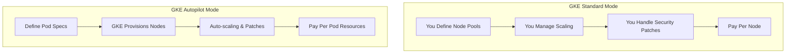
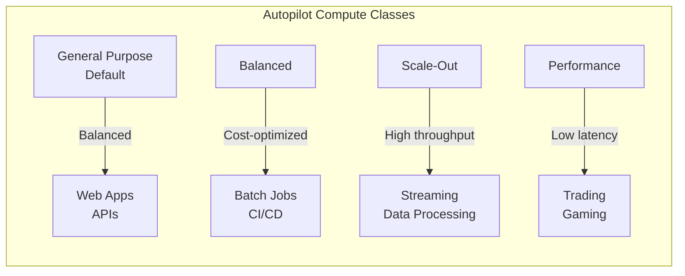
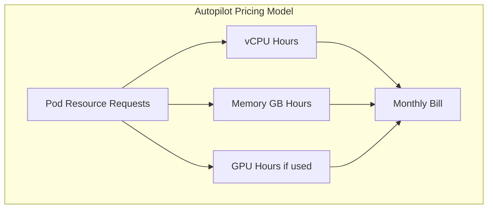
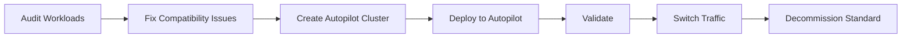

# How to Build GKE Autopilot Mode

Author: [nawazdhandala](https://github.com/nawazdhandala)

Tags: GKE, Kubernetes, Google Cloud, DevOps

Description: A comprehensive guide to deploying and managing workloads on GKE Autopilot, Google's fully managed Kubernetes mode that handles node provisioning, scaling, and security automatically.

---

GKE Autopilot is Google's opinionated, fully managed Kubernetes experience. Unlike Standard mode where you manage node pools, Autopilot provisions and scales nodes based on your Pod specifications. You pay per Pod, not per node, and Google handles the infrastructure.

## What Makes Autopilot Different?



Key differences from Standard mode:

| Feature | Standard Mode | Autopilot Mode |
| --- | --- | --- |
| Node management | Manual or autoscaler | Fully automated |
| Billing | Per node hour | Per Pod vCPU/memory/GPU |
| Security patching | Your responsibility | Google managed |
| Node access | SSH available | No SSH access |
| DaemonSets | Full control | Restricted |
| Privileged containers | Allowed | Not allowed |
| Resource requests | Optional | Required |

## When to Use Autopilot

Autopilot is ideal when:

- You want to focus on applications, not infrastructure
- Your team lacks deep Kubernetes node management expertise
- Workloads have predictable resource requirements
- You prefer pay-per-use pricing without over-provisioning

Stick with Standard mode if:

- You need privileged containers or custom DaemonSets
- Workloads require specific node configurations (GPU types, local SSDs)
- You want SSH access to nodes for debugging
- You have highly variable workloads that benefit from pre-provisioned capacity

## Prerequisites

Before creating an Autopilot cluster, ensure you have:

1. A Google Cloud project with billing enabled
2. The `gcloud` CLI installed and configured
3. Required APIs enabled

Enable the required APIs with this command:

```bash
# Enable GKE and related APIs
gcloud services enable container.googleapis.com \
    compute.googleapis.com \
    cloudresourcemanager.googleapis.com
```

## Creating an Autopilot Cluster

### Using gcloud CLI

The most straightforward way to create an Autopilot cluster:

```bash
# Create a basic Autopilot cluster in us-central1
gcloud container clusters create-auto my-autopilot-cluster \
    --region=us-central1 \
    --project=my-project-id
```

For production workloads, add more configuration options:

```bash
# Create a production-ready Autopilot cluster with private nodes
# and enhanced security settings
gcloud container clusters create-auto prod-cluster \
    --region=us-central1 \
    --project=my-project-id \
    --enable-private-nodes \
    --enable-master-authorized-networks \
    --master-authorized-networks=10.0.0.0/8 \
    --network=my-vpc \
    --subnetwork=my-subnet \
    --cluster-secondary-range-name=pods \
    --services-secondary-range-name=services \
    --release-channel=stable
```

### Using Terraform

For infrastructure as code, use the Google provider:

```hcl
# Configure the Google Cloud provider
provider "google" {
  project = var.project_id
  region  = var.region
}

# Create a VPC for the cluster
resource "google_compute_network" "vpc" {
  name                    = "gke-autopilot-vpc"
  auto_create_subnetworks = false
}

# Create a subnet with secondary ranges for Pods and Services
resource "google_compute_subnetwork" "subnet" {
  name          = "gke-autopilot-subnet"
  ip_cidr_range = "10.0.0.0/24"
  region        = var.region
  network       = google_compute_network.vpc.id

  secondary_ip_range {
    range_name    = "pods"
    ip_cidr_range = "10.1.0.0/16"
  }

  secondary_ip_range {
    range_name    = "services"
    ip_cidr_range = "10.2.0.0/20"
  }
}

# Create the Autopilot cluster
resource "google_container_cluster" "autopilot" {
  name     = "autopilot-cluster"
  location = var.region

  # Enable Autopilot mode
  enable_autopilot = true

  # Network configuration
  network    = google_compute_network.vpc.name
  subnetwork = google_compute_subnetwork.subnet.name

  ip_allocation_policy {
    cluster_secondary_range_name  = "pods"
    services_secondary_range_name = "services"
  }

  # Use the stable release channel for production
  release_channel {
    channel = "STABLE"
  }

  # Enable private nodes for security
  private_cluster_config {
    enable_private_nodes    = true
    enable_private_endpoint = false
    master_ipv4_cidr_block  = "172.16.0.0/28"
  }

  # Configure master authorized networks
  master_authorized_networks_config {
    cidr_blocks {
      cidr_block   = "10.0.0.0/8"
      display_name = "internal"
    }
  }
}

# Output the cluster endpoint
output "cluster_endpoint" {
  value = google_container_cluster.autopilot.endpoint
}
```

Apply the Terraform configuration:

```bash
# Initialize Terraform and apply the configuration
terraform init
terraform plan -out=tfplan
terraform apply tfplan
```

## Connecting to Your Cluster

Once the cluster is created, configure kubectl:

```bash
# Get credentials for the cluster
gcloud container clusters get-credentials autopilot-cluster \
    --region=us-central1 \
    --project=my-project-id

# Verify the connection
kubectl get nodes
```

You will see nodes created automatically as you deploy workloads.

## Deploying Workloads

### Resource Requests Are Required

Autopilot requires resource requests on all containers. This is how it knows what nodes to provision:

```yaml
# A basic deployment with required resource requests
apiVersion: apps/v1
kind: Deployment
metadata:
  name: nginx-deployment
  labels:
    app: nginx
spec:
  replicas: 3
  selector:
    matchLabels:
      app: nginx
  template:
    metadata:
      labels:
        app: nginx
    spec:
      containers:
        - name: nginx
          image: nginx:1.25
          # Resource requests are mandatory in Autopilot
          resources:
            requests:
              cpu: "250m"
              memory: "256Mi"
            limits:
              cpu: "500m"
              memory: "512Mi"
          ports:
            - containerPort: 80
```

### Compute Classes

Autopilot offers different compute classes for various workload types:



Specify a compute class using node selectors:

```yaml
# Deploy to the Scale-Out compute class for high-throughput workloads
apiVersion: apps/v1
kind: Deployment
metadata:
  name: data-processor
spec:
  replicas: 5
  selector:
    matchLabels:
      app: data-processor
  template:
    metadata:
      labels:
        app: data-processor
    spec:
      # Select the Scale-Out compute class
      nodeSelector:
        cloud.google.com/compute-class: Scale-Out
      containers:
        - name: processor
          image: my-processor:v1
          resources:
            requests:
              cpu: "2"
              memory: "4Gi"
```

Available compute classes:

| Compute Class | Use Case | vCPU Range | Memory Range |
| --- | --- | --- | --- |
| General-purpose | Default, balanced workloads | 0.25-30 | 0.5Gi-110Gi |
| Balanced | Cost-optimized batch jobs | 0.5-30 | 2Gi-110Gi |
| Scale-Out | High-throughput processing | 0.5-30 | 2Gi-110Gi |
| Performance | Low-latency applications | 4-30 | 16Gi-110Gi |

### Using Spot Pods

Save up to 91% with Spot Pods for fault-tolerant workloads:

```yaml
# Use Spot Pods for batch processing to reduce costs
apiVersion: batch/v1
kind: Job
metadata:
  name: batch-processor
spec:
  parallelism: 10
  completions: 100
  template:
    spec:
      # Request Spot Pods for cost savings
      nodeSelector:
        cloud.google.com/gke-spot: "true"
      # Spot Pods can be preempted, so set appropriate tolerations
      tolerations:
        - key: cloud.google.com/gke-spot
          operator: Equal
          value: "true"
          effect: NoSchedule
      containers:
        - name: processor
          image: my-batch-job:v1
          resources:
            requests:
              cpu: "1"
              memory: "2Gi"
      restartPolicy: OnFailure
```

### GPU Workloads

Autopilot supports GPU workloads for ML and AI:

```yaml
# Deploy a GPU workload for machine learning inference
apiVersion: apps/v1
kind: Deployment
metadata:
  name: ml-inference
spec:
  replicas: 2
  selector:
    matchLabels:
      app: ml-inference
  template:
    metadata:
      labels:
        app: ml-inference
    spec:
      # Select GPU-enabled nodes
      nodeSelector:
        cloud.google.com/gke-accelerator: nvidia-tesla-t4
      containers:
        - name: inference
          image: my-ml-model:v1
          resources:
            requests:
              cpu: "4"
              memory: "16Gi"
              # Request GPU resources
              nvidia.com/gpu: "1"
            limits:
              nvidia.com/gpu: "1"
```

## Autoscaling Configuration

### Horizontal Pod Autoscaler

Autopilot works seamlessly with HPA:

```yaml
# HPA to scale based on CPU utilization
apiVersion: autoscaling/v2
kind: HorizontalPodAutoscaler
metadata:
  name: nginx-hpa
spec:
  scaleTargetRef:
    apiVersion: apps/v1
    kind: Deployment
    name: nginx-deployment
  minReplicas: 2
  maxReplicas: 50
  metrics:
    - type: Resource
      resource:
        name: cpu
        target:
          type: Utilization
          averageUtilization: 70
    - type: Resource
      resource:
        name: memory
        target:
          type: Utilization
          averageUtilization: 80
```

### Vertical Pod Autoscaler

Let VPA recommend optimal resource requests:

```yaml
# VPA to automatically adjust resource requests
apiVersion: autoscaling.k8s.io/v1
kind: VerticalPodAutoscaler
metadata:
  name: nginx-vpa
spec:
  targetRef:
    apiVersion: apps/v1
    kind: Deployment
    name: nginx-deployment
  updatePolicy:
    # Start with recommendations, then switch to Auto
    updateMode: "Off"
  resourcePolicy:
    containerPolicies:
      - containerName: nginx
        minAllowed:
          cpu: "100m"
          memory: "128Mi"
        maxAllowed:
          cpu: "4"
          memory: "8Gi"
```

## Networking

### Exposing Services

Use a LoadBalancer service for external traffic:

```yaml
# Expose the nginx deployment via a LoadBalancer
apiVersion: v1
kind: Service
metadata:
  name: nginx-service
spec:
  type: LoadBalancer
  selector:
    app: nginx
  ports:
    - protocol: TCP
      port: 80
      targetPort: 80
```

### Using Ingress with Google Cloud Load Balancer

For HTTP(S) traffic, use GKE Ingress:

```yaml
# Create an Ingress with Google Cloud Load Balancer
apiVersion: networking.k8s.io/v1
kind: Ingress
metadata:
  name: nginx-ingress
  annotations:
    # Use the GCE ingress class
    kubernetes.io/ingress.class: gce
    # Enable HTTPS redirect
    kubernetes.io/ingress.allow-http: "false"
spec:
  tls:
    - secretName: tls-secret
      hosts:
        - myapp.example.com
  rules:
    - host: myapp.example.com
      http:
        paths:
          - path: /
            pathType: Prefix
            backend:
              service:
                name: nginx-service
                port:
                  number: 80
```

### Network Policies

Autopilot enforces network policies by default:

```yaml
# Allow traffic only from specific namespaces
apiVersion: networking.k8s.io/v1
kind: NetworkPolicy
metadata:
  name: allow-frontend
  namespace: backend
spec:
  podSelector:
    matchLabels:
      app: api
  policyTypes:
    - Ingress
  ingress:
    - from:
        - namespaceSelector:
            matchLabels:
              name: frontend
        - podSelector:
            matchLabels:
              app: web
      ports:
        - protocol: TCP
          port: 8080
```

## Security Best Practices

### Workload Identity

Use Workload Identity to access Google Cloud services securely:

```yaml
# Create a Kubernetes service account linked to a Google Cloud service account
apiVersion: v1
kind: ServiceAccount
metadata:
  name: my-app-sa
  namespace: default
  annotations:
    # Link to Google Cloud service account
    iam.gke.io/gcp-service-account: my-app@my-project-id.iam.gserviceaccount.com
```

Configure the IAM binding:

```bash
# Allow the Kubernetes service account to impersonate the Google Cloud SA
gcloud iam service-accounts add-iam-policy-binding \
    my-app@my-project-id.iam.gserviceaccount.com \
    --role=roles/iam.workloadIdentityUser \
    --member="serviceAccount:my-project-id.svc.id.goog[default/my-app-sa]"
```

Use the service account in your deployment:

```yaml
# Deployment using Workload Identity
apiVersion: apps/v1
kind: Deployment
metadata:
  name: my-app
spec:
  selector:
    matchLabels:
      app: my-app
  template:
    metadata:
      labels:
        app: my-app
    spec:
      # Use the service account with Workload Identity
      serviceAccountName: my-app-sa
      containers:
        - name: my-app
          image: my-app:v1
          resources:
            requests:
              cpu: "500m"
              memory: "512Mi"
```

### Pod Security Standards

Autopilot enforces Pod Security Standards by default. Your Pods must comply with the baseline policy:

```yaml
# A compliant Pod specification for Autopilot
apiVersion: v1
kind: Pod
metadata:
  name: secure-pod
spec:
  securityContext:
    # Run as non-root user
    runAsNonRoot: true
    runAsUser: 1000
    fsGroup: 1000
  containers:
    - name: app
      image: my-secure-app:v1
      securityContext:
        # Drop all capabilities
        capabilities:
          drop:
            - ALL
        # Read-only root filesystem
        readOnlyRootFilesystem: true
        allowPrivilegeEscalation: false
      resources:
        requests:
          cpu: "250m"
          memory: "256Mi"
      volumeMounts:
        - name: tmp
          mountPath: /tmp
  volumes:
    # Use emptyDir for writable directories
    - name: tmp
      emptyDir: {}
```

## Monitoring and Observability

### Cloud Monitoring Integration

Autopilot automatically integrates with Google Cloud Monitoring. View metrics in the Google Cloud Console or query them programmatically:

```bash
# View cluster metrics using gcloud
gcloud monitoring metrics list --filter="metric.type:kubernetes"
```

### Custom Metrics with OpenTelemetry

Export custom metrics to Cloud Monitoring:

```yaml
# Deploy OpenTelemetry Collector for custom metrics
apiVersion: apps/v1
kind: Deployment
metadata:
  name: otel-collector
spec:
  selector:
    matchLabels:
      app: otel-collector
  template:
    metadata:
      labels:
        app: otel-collector
    spec:
      serviceAccountName: otel-collector-sa
      containers:
        - name: collector
          image: otel/opentelemetry-collector-contrib:latest
          resources:
            requests:
              cpu: "200m"
              memory: "256Mi"
          volumeMounts:
            - name: config
              mountPath: /etc/otelcol
      volumes:
        - name: config
          configMap:
            name: otel-config
---
apiVersion: v1
kind: ConfigMap
metadata:
  name: otel-config
data:
  config.yaml: |
    receivers:
      otlp:
        protocols:
          grpc:
            endpoint: 0.0.0.0:4317
    processors:
      batch:
        timeout: 10s
    exporters:
      googlecloud:
        project: my-project-id
    service:
      pipelines:
        metrics:
          receivers: [otlp]
          processors: [batch]
          exporters: [googlecloud]
```

## Cost Optimization

### Understanding Autopilot Pricing



### Cost Saving Strategies

1. **Right-size resource requests**: Use VPA recommendations to avoid over-provisioning
2. **Use Spot Pods**: For fault-tolerant workloads, save up to 91%
3. **Scale to zero**: Use KEDA or custom solutions for workloads that can scale down
4. **Choose appropriate compute classes**: Do not use Performance class unless needed

Check current resource utilization:

```bash
# View resource utilization across namespaces
kubectl top pods --all-namespaces --sort-by=cpu

# Get VPA recommendations
kubectl get vpa -o jsonpath='{range .items[*]}{.metadata.name}{"\t"}{.status.recommendation.containerRecommendations[*].target}{"\n"}{end}'
```

## Migration from Standard to Autopilot

### Migration Checklist

Before migrating, verify your workloads are compatible:

```bash
# Check for privileged containers (not allowed in Autopilot)
kubectl get pods --all-namespaces -o jsonpath='{range .items[*]}{.metadata.namespace}{"\t"}{.metadata.name}{"\t"}{.spec.containers[*].securityContext.privileged}{"\n"}{end}' | grep true

# Check for missing resource requests (required in Autopilot)
kubectl get pods --all-namespaces -o jsonpath='{range .items[*]}{.metadata.namespace}{"\t"}{.metadata.name}{"\t"}{.spec.containers[*].resources.requests}{"\n"}{end}' | grep -v cpu

# Check for hostNetwork or hostPID usage (not allowed)
kubectl get pods --all-namespaces -o jsonpath='{range .items[*]}{.metadata.namespace}{"\t"}{.metadata.name}{"\t"}{.spec.hostNetwork}{"\t"}{.spec.hostPID}{"\n"}{end}' | grep true
```

### Migration Steps



## Troubleshooting

### Pod Stuck in Pending

If Pods are stuck pending, check for resource issues:

```bash
# Check Pod events for scheduling issues
kubectl describe pod <pod-name>

# Common issues:
# - Resource requests too high (no node can satisfy)
# - Invalid compute class selector
# - GPU not available in region
```

### Pods Evicted

Autopilot may evict Pods for node maintenance:

```yaml
# Add PodDisruptionBudget to control evictions
apiVersion: policy/v1
kind: PodDisruptionBudget
metadata:
  name: my-app-pdb
spec:
  minAvailable: 2
  selector:
    matchLabels:
      app: my-app
```

### Debugging Without SSH

Since you cannot SSH into Autopilot nodes, use ephemeral containers:

```bash
# Debug a running Pod with an ephemeral container
kubectl debug -it <pod-name> --image=busybox --target=<container-name>

# Or create a debug Pod in the same namespace
kubectl run debug --rm -it --image=nicolaka/netshoot -- /bin/bash
```

## Summary

GKE Autopilot removes the burden of node management while providing a secure, cost-effective Kubernetes experience. Start with these key takeaways:

1. **Always specify resource requests** - Autopilot requires them for node provisioning
2. **Use appropriate compute classes** - Match your workload characteristics
3. **Embrace Workload Identity** - Secure access to Google Cloud services
4. **Leverage Spot Pods** - Significant cost savings for fault-tolerant workloads
5. **Monitor with Cloud Operations** - Built-in observability out of the box

For production deployments, combine Autopilot with proper observability. See how to set up comprehensive monitoring with [OpenTelemetry and OneUptime](https://oneuptime.com/docs) to get full visibility into your Autopilot workloads.
