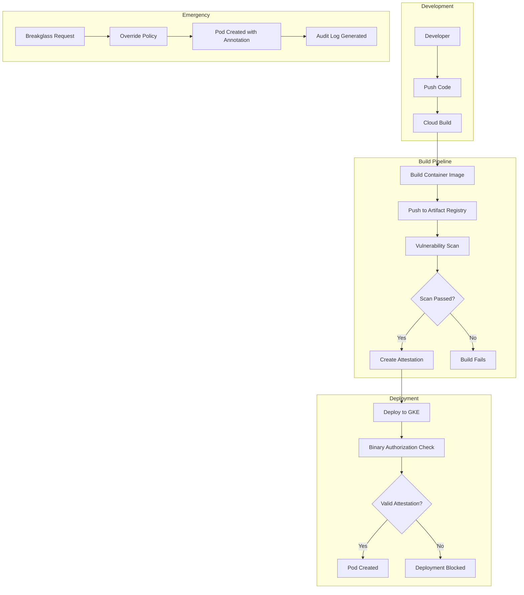
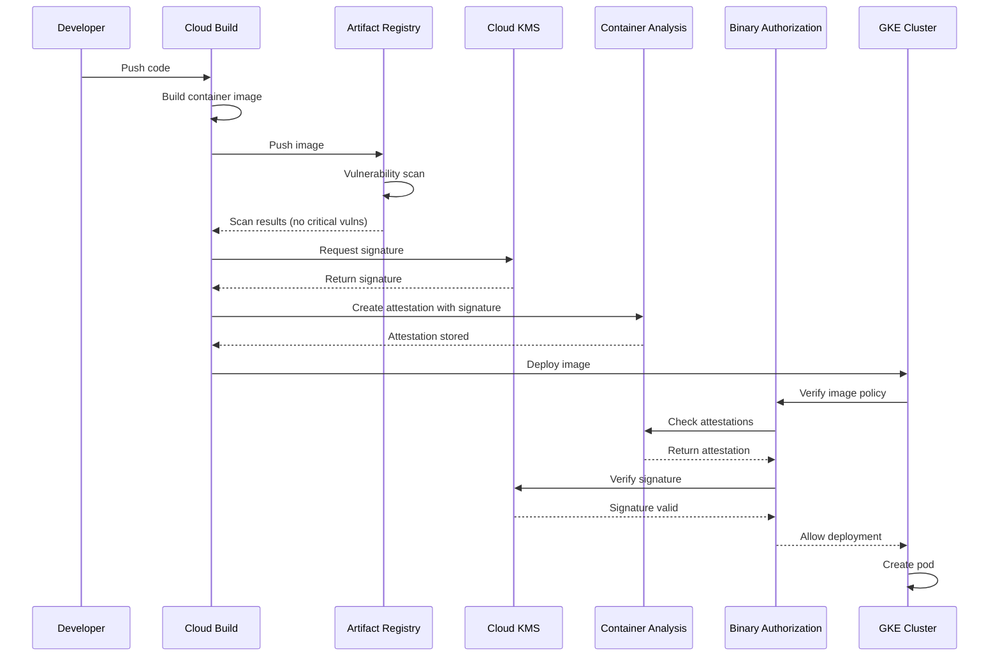

# How to Build GKE Binary Authorization

Author: [nawazdhandala](https://github.com/nawazdhandala)

Tags: GKE, Kubernetes, Security, BinaryAuthorization

Description: Learn how to implement Binary Authorization in GKE to ensure only trusted container images are deployed to your Kubernetes clusters.

---

## Introduction

Binary Authorization is a deploy-time security control in Google Kubernetes Engine (GKE) that ensures only trusted container images are deployed to your clusters. It works by requiring images to be signed by trusted authorities (attestors) before they can run in your production environment.

This guide walks you through setting up Binary Authorization from scratch, including policy configuration, attestor creation, Cloud Build integration, and emergency breakglass procedures.

## Architecture Overview

Before diving into implementation, let us understand how Binary Authorization works in the GKE ecosystem.



## Prerequisites

Before starting, ensure you have:

- A GCP project with billing enabled
- GKE cluster running
- gcloud CLI installed and configured
- Artifact Registry repository set up

## Step 1: Enable Required APIs

First, enable the necessary Google Cloud APIs for Binary Authorization.

```bash
# Enable Binary Authorization API
gcloud services enable binaryauthorization.googleapis.com

# Enable Container Analysis API for storing attestations
gcloud services enable containeranalysis.googleapis.com

# Enable Cloud KMS for signing attestations
gcloud services enable cloudkms.googleapis.com

# Enable Artifact Registry if not already enabled
gcloud services enable artifactregistry.googleapis.com
```

## Step 2: Create a KMS Key for Signing

Binary Authorization uses asymmetric keys to sign and verify attestations. We will use Cloud KMS to manage these keys securely.

```bash
# Set your project and region variables
export PROJECT_ID="your-project-id"
export REGION="us-central1"
export KEY_RING="binary-auth-keyring"
export KEY_NAME="attestor-key"

# Create a KMS keyring
gcloud kms keyrings create ${KEY_RING} \
    --location=${REGION} \
    --project=${PROJECT_ID}

# Create an asymmetric signing key
# Using EC_SIGN_P256_SHA256 for efficient signing operations
gcloud kms keys create ${KEY_NAME} \
    --keyring=${KEY_RING} \
    --location=${REGION} \
    --purpose=asymmetric-signing \
    --default-algorithm=ec-sign-p256-sha256 \
    --project=${PROJECT_ID}
```

## Step 3: Create an Attestor

An attestor is a trusted authority that can vouch for container images. You can have multiple attestors for different stages of your pipeline.

```bash
# Set attestor variables
export ATTESTOR_NAME="build-attestor"
export NOTE_ID="build-attestor-note"

# Create a Container Analysis note
# Notes are the foundation for attestations in Binary Authorization
cat > /tmp/note.json << EOF
{
  "name": "projects/${PROJECT_ID}/notes/${NOTE_ID}",
  "attestation": {
    "hint": {
      "human_readable_name": "Build Pipeline Attestor"
    }
  }
}
EOF

# Create the note using the Container Analysis API
curl -X POST \
    -H "Content-Type: application/json" \
    -H "Authorization: Bearer $(gcloud auth print-access-token)" \
    -d @/tmp/note.json \
    "https://containeranalysis.googleapis.com/v1/projects/${PROJECT_ID}/notes/?noteId=${NOTE_ID}"

# Create the attestor and link it to the note
gcloud container binauthz attestors create ${ATTESTOR_NAME} \
    --attestation-authority-note=${NOTE_ID} \
    --attestation-authority-note-project=${PROJECT_ID} \
    --project=${PROJECT_ID}

# Add the public key from KMS to the attestor
gcloud container binauthz attestors public-keys add \
    --attestor=${ATTESTOR_NAME} \
    --keyversion-project=${PROJECT_ID} \
    --keyversion-location=${REGION} \
    --keyversion-keyring=${KEY_RING} \
    --keyversion-key=${KEY_NAME} \
    --keyversion=1 \
    --project=${PROJECT_ID}

# Verify the attestor was created correctly
gcloud container binauthz attestors describe ${ATTESTOR_NAME} \
    --project=${PROJECT_ID}
```

## Step 4: Configure Binary Authorization Policy

The policy defines which images are allowed to run and what attestations are required.

```yaml
# binary-auth-policy.yaml
# This policy requires attestation from our build attestor
# and allows specific system images to run without attestation

admissionWhitelistPatterns:
  # Allow GKE system images
  - namePattern: gcr.io/google_containers/*
  - namePattern: gcr.io/google-containers/*
  - namePattern: k8s.gcr.io/*
  - namePattern: gke.gcr.io/*
  - namePattern: gcr.io/gke-release/*
  # Allow Artifact Registry system images
  - namePattern: us-docker.pkg.dev/google-samples/*

defaultAdmissionRule:
  # Default rule for all other images
  evaluationMode: REQUIRE_ATTESTATION
  enforcementMode: ENFORCED_BLOCK_AND_AUDIT_LOG
  requireAttestationsBy:
    - projects/YOUR_PROJECT_ID/attestors/build-attestor

globalPolicyEvaluationMode: ENABLE

# Cluster-specific rules (optional)
clusterAdmissionRules:
  # Production cluster requires attestation
  us-central1-a.prod-cluster:
    evaluationMode: REQUIRE_ATTESTATION
    enforcementMode: ENFORCED_BLOCK_AND_AUDIT_LOG
    requireAttestationsBy:
      - projects/YOUR_PROJECT_ID/attestors/build-attestor

  # Dev cluster allows all images (less restrictive for testing)
  us-central1-a.dev-cluster:
    evaluationMode: ALWAYS_ALLOW
    enforcementMode: ENFORCED_BLOCK_AND_AUDIT_LOG
```

Apply the policy:

```bash
# Replace YOUR_PROJECT_ID with your actual project ID
sed -i "s/YOUR_PROJECT_ID/${PROJECT_ID}/g" binary-auth-policy.yaml

# Import the policy
gcloud container binauthz policy import binary-auth-policy.yaml \
    --project=${PROJECT_ID}

# Verify the policy
gcloud container binauthz policy export \
    --project=${PROJECT_ID}
```

## Step 5: Enable Binary Authorization on GKE Cluster

Enable Binary Authorization when creating a new cluster or update an existing one.

```bash
# For a new cluster
gcloud container clusters create prod-cluster \
    --zone=us-central1-a \
    --binauthz-evaluation-mode=PROJECT_SINGLETON_POLICY_ENFORCE \
    --project=${PROJECT_ID}

# For an existing cluster
gcloud container clusters update prod-cluster \
    --zone=us-central1-a \
    --binauthz-evaluation-mode=PROJECT_SINGLETON_POLICY_ENFORCE \
    --project=${PROJECT_ID}
```

## Step 6: Create Attestations

Now let us create an attestation for a container image. This is typically done in your CI/CD pipeline after the image passes all quality gates.

```bash
# Set the image details
export IMAGE_PATH="us-central1-docker.pkg.dev/${PROJECT_ID}/my-repo/my-app"
export IMAGE_DIGEST="sha256:abc123..." # Get this from your image build

# Create the attestation using gcloud
gcloud container binauthz attestations sign-and-create \
    --artifact-url="${IMAGE_PATH}@${IMAGE_DIGEST}" \
    --attestor=${ATTESTOR_NAME} \
    --attestor-project=${PROJECT_ID} \
    --keyversion-project=${PROJECT_ID} \
    --keyversion-location=${REGION} \
    --keyversion-keyring=${KEY_RING} \
    --keyversion-key=${KEY_NAME} \
    --keyversion=1

# Verify the attestation was created
gcloud container binauthz attestations list \
    --attestor=${ATTESTOR_NAME} \
    --attestor-project=${PROJECT_ID}
```

## Step 7: Integration with Cloud Build

Here is a complete Cloud Build configuration that builds, scans, attests, and deploys container images.

```yaml
# cloudbuild.yaml
# Complete CI/CD pipeline with Binary Authorization

substitutions:
  _REGION: us-central1
  _ATTESTOR_NAME: build-attestor
  _KEY_RING: binary-auth-keyring
  _KEY_NAME: attestor-key
  _KEY_VERSION: "1"
  _GKE_CLUSTER: prod-cluster
  _GKE_ZONE: us-central1-a

steps:
  # Step 1: Build the container image
  - name: 'gcr.io/cloud-builders/docker'
    id: 'build'
    args:
      - 'build'
      - '-t'
      - '${_REGION}-docker.pkg.dev/${PROJECT_ID}/my-repo/my-app:${SHORT_SHA}'
      - '-t'
      - '${_REGION}-docker.pkg.dev/${PROJECT_ID}/my-repo/my-app:latest'
      - '.'

  # Step 2: Push the image to Artifact Registry
  - name: 'gcr.io/cloud-builders/docker'
    id: 'push'
    args:
      - 'push'
      - '--all-tags'
      - '${_REGION}-docker.pkg.dev/${PROJECT_ID}/my-repo/my-app'

  # Step 3: Get the image digest for attestation
  - name: 'gcr.io/cloud-builders/gcloud'
    id: 'get-digest'
    entrypoint: 'bash'
    args:
      - '-c'
      - |
        # Retrieve the image digest and save it for later steps
        gcloud artifacts docker images describe \
          ${_REGION}-docker.pkg.dev/${PROJECT_ID}/my-repo/my-app:${SHORT_SHA} \
          --format='get(image_summary.digest)' > /workspace/image-digest.txt
        echo "Image digest: $(cat /workspace/image-digest.txt)"

  # Step 4: Run vulnerability scanning
  - name: 'gcr.io/cloud-builders/gcloud'
    id: 'vulnerability-scan'
    entrypoint: 'bash'
    args:
      - '-c'
      - |
        # Wait for the vulnerability scan to complete
        IMAGE_DIGEST=$(cat /workspace/image-digest.txt)
        IMAGE_URL="${_REGION}-docker.pkg.dev/${PROJECT_ID}/my-repo/my-app@${IMAGE_DIGEST}"

        echo "Waiting for vulnerability scan to complete..."
        sleep 30  # Allow time for scan to start

        # Check for critical vulnerabilities
        CRITICAL_COUNT=$(gcloud artifacts docker images describe ${IMAGE_URL} \
          --show-package-vulnerability \
          --format='value(package_vulnerability_summary.critical_vulnerability_count)' 2>/dev/null || echo "0")

        if [ "${CRITICAL_COUNT}" != "0" ] && [ "${CRITICAL_COUNT}" != "" ]; then
          echo "ERROR: Found ${CRITICAL_COUNT} critical vulnerabilities!"
          exit 1
        fi

        echo "Vulnerability scan passed!"

  # Step 5: Create attestation for the image
  - name: 'gcr.io/cloud-builders/gcloud'
    id: 'create-attestation'
    entrypoint: 'bash'
    args:
      - '-c'
      - |
        IMAGE_DIGEST=$(cat /workspace/image-digest.txt)
        IMAGE_URL="${_REGION}-docker.pkg.dev/${PROJECT_ID}/my-repo/my-app@${IMAGE_DIGEST}"

        echo "Creating attestation for: ${IMAGE_URL}"

        gcloud container binauthz attestations sign-and-create \
          --artifact-url="${IMAGE_URL}" \
          --attestor="${_ATTESTOR_NAME}" \
          --attestor-project="${PROJECT_ID}" \
          --keyversion-project="${PROJECT_ID}" \
          --keyversion-location="${_REGION}" \
          --keyversion-keyring="${_KEY_RING}" \
          --keyversion-key="${_KEY_NAME}" \
          --keyversion="${_KEY_VERSION}"

        echo "Attestation created successfully!"

  # Step 6: Deploy to GKE
  - name: 'gcr.io/cloud-builders/gke-deploy'
    id: 'deploy'
    args:
      - 'run'
      - '--filename=k8s/'
      - '--image=${_REGION}-docker.pkg.dev/${PROJECT_ID}/my-repo/my-app:${SHORT_SHA}'
      - '--cluster=${_GKE_CLUSTER}'
      - '--location=${_GKE_ZONE}'

options:
  logging: CLOUD_LOGGING_ONLY

# Grant Cloud Build service account necessary permissions
# See IAM setup section below
```

### Required IAM Permissions for Cloud Build

```bash
# Get the Cloud Build service account
export CB_SA="$(gcloud projects describe ${PROJECT_ID} --format='value(projectNumber)')@cloudbuild.gserviceaccount.com"

# Grant permission to create attestations
gcloud projects add-iam-policy-binding ${PROJECT_ID} \
    --member="serviceAccount:${CB_SA}" \
    --role="roles/binaryauthorization.attestorsViewer"

# Grant permission to sign with KMS key
gcloud kms keys add-iam-policy-binding ${KEY_NAME} \
    --keyring=${KEY_RING} \
    --location=${REGION} \
    --member="serviceAccount:${CB_SA}" \
    --role="roles/cloudkms.signerVerifier" \
    --project=${PROJECT_ID}

# Grant permission to write attestations
gcloud projects add-iam-policy-binding ${PROJECT_ID} \
    --member="serviceAccount:${CB_SA}" \
    --role="roles/containeranalysis.notes.attacher"

# Grant permission to deploy to GKE
gcloud projects add-iam-policy-binding ${PROJECT_ID} \
    --member="serviceAccount:${CB_SA}" \
    --role="roles/container.developer"
```

## Step 8: Breakglass Procedures

In emergency situations, you may need to deploy an unattested image. Binary Authorization provides a breakglass mechanism for this purpose.

### Method 1: Breakglass Annotation

Add a special annotation to your pod to bypass Binary Authorization. This will be logged and audited.

```yaml
# emergency-deployment.yaml
# Use this ONLY in emergencies - all uses are logged

apiVersion: apps/v1
kind: Deployment
metadata:
  name: emergency-app
  namespace: production
spec:
  replicas: 1
  selector:
    matchLabels:
      app: emergency-app
  template:
    metadata:
      labels:
        app: emergency-app
      annotations:
        # This annotation allows deployment without attestation
        # IMPORTANT: This bypasses security controls and is audited
        alpha.image-policy.k8s.io/break-glass: "true"
    spec:
      containers:
        - name: app
          image: us-central1-docker.pkg.dev/my-project/my-repo/my-app@sha256:abc123
          ports:
            - containerPort: 8080
```

### Method 2: Temporarily Update Policy

For a cluster-wide emergency, temporarily allow all images.

```bash
# Export current policy for backup
gcloud container binauthz policy export \
    --project=${PROJECT_ID} > policy-backup.yaml

# Create emergency policy
cat > emergency-policy.yaml << EOF
defaultAdmissionRule:
  evaluationMode: ALWAYS_ALLOW
  enforcementMode: ENFORCED_BLOCK_AND_AUDIT_LOG
globalPolicyEvaluationMode: ENABLE
EOF

# Apply emergency policy
gcloud container binauthz policy import emergency-policy.yaml \
    --project=${PROJECT_ID}

# IMPORTANT: Restore original policy after emergency
gcloud container binauthz policy import policy-backup.yaml \
    --project=${PROJECT_ID}
```

### Monitoring Breakglass Events

Set up alerts for breakglass usage to ensure proper follow-up.

```bash
# Create a log-based metric for breakglass events
gcloud logging metrics create breakglass-usage \
    --description="Tracks Binary Authorization breakglass events" \
    --log-filter='resource.type="k8s_cluster"
protoPayload.request.metadata.annotations."alpha.image-policy.k8s.io/break-glass"="true"'

# Create an alert policy (using gcloud or console)
# Alert when breakglass is used more than 0 times in any 5-minute window
```

## Attestation Flow Diagram

The following diagram shows the complete attestation and verification flow.



## Multi-Attestor Setup

For more robust security, require attestations from multiple attestors representing different stages.

```yaml
# multi-attestor-policy.yaml
# Requires both build and security attestations

admissionWhitelistPatterns:
  - namePattern: gcr.io/google_containers/*
  - namePattern: k8s.gcr.io/*
  - namePattern: gke.gcr.io/*

defaultAdmissionRule:
  evaluationMode: REQUIRE_ATTESTATION
  enforcementMode: ENFORCED_BLOCK_AND_AUDIT_LOG
  # Require BOTH attestors to sign the image
  requireAttestationsBy:
    - projects/YOUR_PROJECT_ID/attestors/build-attestor
    - projects/YOUR_PROJECT_ID/attestors/security-scan-attestor

globalPolicyEvaluationMode: ENABLE
```

Create the additional security attestor:

```bash
# Create a second attestor for security scanning
export SECURITY_ATTESTOR="security-scan-attestor"
export SECURITY_NOTE_ID="security-scan-note"
export SECURITY_KEY="security-attestor-key"

# Create KMS key for security attestor
gcloud kms keys create ${SECURITY_KEY} \
    --keyring=${KEY_RING} \
    --location=${REGION} \
    --purpose=asymmetric-signing \
    --default-algorithm=ec-sign-p256-sha256 \
    --project=${PROJECT_ID}

# Create the note
cat > /tmp/security-note.json << EOF
{
  "name": "projects/${PROJECT_ID}/notes/${SECURITY_NOTE_ID}",
  "attestation": {
    "hint": {
      "human_readable_name": "Security Scan Attestor"
    }
  }
}
EOF

curl -X POST \
    -H "Content-Type: application/json" \
    -H "Authorization: Bearer $(gcloud auth print-access-token)" \
    -d @/tmp/security-note.json \
    "https://containeranalysis.googleapis.com/v1/projects/${PROJECT_ID}/notes/?noteId=${SECURITY_NOTE_ID}"

# Create the attestor
gcloud container binauthz attestors create ${SECURITY_ATTESTOR} \
    --attestation-authority-note=${SECURITY_NOTE_ID} \
    --attestation-authority-note-project=${PROJECT_ID} \
    --project=${PROJECT_ID}

# Add the public key
gcloud container binauthz attestors public-keys add \
    --attestor=${SECURITY_ATTESTOR} \
    --keyversion-project=${PROJECT_ID} \
    --keyversion-location=${REGION} \
    --keyversion-keyring=${KEY_RING} \
    --keyversion-key=${SECURITY_KEY} \
    --keyversion=1 \
    --project=${PROJECT_ID}
```

## Testing Your Setup

Verify that Binary Authorization is working correctly.

```bash
# Test 1: Deploy an attested image (should succeed)
kubectl run test-attested \
    --image=us-central1-docker.pkg.dev/${PROJECT_ID}/my-repo/my-app@sha256:attested-digest \
    --restart=Never

# Check the result
kubectl get pod test-attested

# Test 2: Deploy an unattested image (should fail)
kubectl run test-unattested \
    --image=us-central1-docker.pkg.dev/${PROJECT_ID}/my-repo/untrusted-app@sha256:random-digest \
    --restart=Never

# You should see an error like:
# Error from server: admission webhook "imagepolicywebhook.image-policy.k8s.io"
# denied the request: Image us-central1-docker.pkg.dev/.../untrusted-app@sha256:...
# denied by Binary Authorization cluster admission rule

# Clean up test pods
kubectl delete pod test-attested --ignore-not-found
```

## Troubleshooting

### Common Issues and Solutions

**Issue: Attestation creation fails with permission denied**

```bash
# Verify the service account has the correct roles
gcloud projects get-iam-policy ${PROJECT_ID} \
    --flatten="bindings[].members" \
    --filter="bindings.members:serviceAccount:${CB_SA}" \
    --format="table(bindings.role)"

# Ensure these roles are present:
# - roles/binaryauthorization.attestorsViewer
# - roles/containeranalysis.notes.attacher
# - roles/cloudkms.signerVerifier
```

**Issue: Deployment blocked even with valid attestation**

```bash
# Check if the attestation exists for the specific digest
gcloud container binauthz attestations list \
    --attestor=${ATTESTOR_NAME} \
    --attestor-project=${PROJECT_ID} \
    --artifact-url="us-central1-docker.pkg.dev/${PROJECT_ID}/my-repo/my-app@sha256:your-digest"

# Verify the image digest matches exactly
# Tags can point to different digests over time
docker manifest inspect us-central1-docker.pkg.dev/${PROJECT_ID}/my-repo/my-app:latest
```

**Issue: GKE cluster not enforcing policy**

```bash
# Verify Binary Authorization is enabled on the cluster
gcloud container clusters describe prod-cluster \
    --zone=us-central1-a \
    --format="value(binaryAuthorization.evaluationMode)"

# Should return: PROJECT_SINGLETON_POLICY_ENFORCE
```

## Best Practices

1. **Use image digests, not tags**: Tags can be reassigned, but digests are immutable. Always reference images by digest in production.

2. **Separate attestors by purpose**: Use different attestors for different validation stages (build, security scan, QA approval).

3. **Rotate KMS keys regularly**: Set up a key rotation schedule for your attestor keys.

4. **Monitor breakglass usage**: Set up alerts for any breakglass events and require incident tickets.

5. **Test policy changes in staging**: Always test policy modifications in a non-production cluster first.

6. **Keep allowlist minimal**: Only whitelist images that absolutely need to bypass attestation.

7. **Audit regularly**: Review attestation logs and policy changes periodically.

## Conclusion

Binary Authorization provides a powerful layer of security for your GKE deployments by ensuring only verified, trusted container images can run in your clusters. By integrating it with your CI/CD pipeline through Cloud Build, you create an automated chain of trust from code commit to production deployment.

The combination of vulnerability scanning, attestation requirements, and audit logging gives you visibility and control over your container supply chain. Remember to implement breakglass procedures for emergencies, but monitor and review any usage of these overrides.

Start with a permissive policy in development, gradually tightening controls as you move toward production. This approach lets teams adapt to the new workflow while ensuring production environments remain secure.
